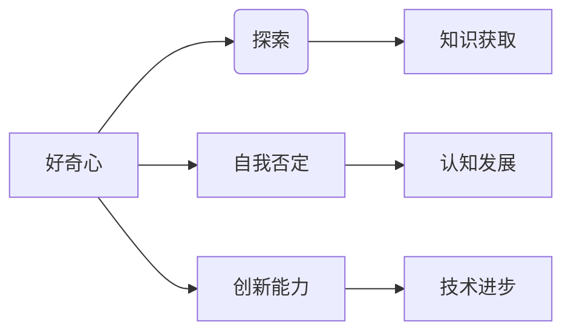

> 好奇心，探索，自我否定，创新，知识获取，认知发展，技术进步

# 好奇心：不断探索与自我否定的动力

## 1. 背景介绍

自古以来，好奇心就是人类探索世界、推动科学进步的重要动力。从古希腊的哲学家到现代的科学家，无数人的成就都源于对未知世界的好奇和探索。在信息技术飞速发展的今天，好奇心更是成为了推动技术革新的核心驱动力。本文将探讨好奇心的本质、作用以及在技术发展中的重要性，旨在激发读者对知识的热爱和对未来的探索。

### 1.1 好奇心的由来

好奇心是人类与生俱来的特质，是推动人类认知发展的内在动力。从生物学角度来看，好奇心有助于人类在复杂多变的环境中生存和发展。儿童时期的好奇心尤为强烈，他们通过不断提问和探索来认识世界。随着知识的积累，好奇心逐渐转化为对特定领域的兴趣和研究。

### 1.2 研究现状

近年来，心理学家、认知科学家和技术专家对好奇心进行了广泛研究。研究表明，好奇心与认知发展、创新能力、社会交往等多方面能力密切相关。在技术领域，好奇心推动了人工智能、大数据、云计算等前沿技术的快速发展。

### 1.3 研究意义

探讨好奇心在技术发展中的作用，有助于我们更好地理解创新思维的本质，激发人们对知识的热爱，推动技术进步。本文将结合具体案例，分析好奇心在技术发展中的重要性，并探讨如何培养和利用好奇心。

## 2. 核心概念与联系

### 2.1 核心概念

#### 好奇心

好奇心是指个体对未知事物或现象的探究欲望和兴趣。它是推动个体学习和探索的重要动力。

#### 探索

探索是指为了获得新知识、新技术或新方法而进行的积极行动。

#### 自我否定

自我否定是指个体在面对新观点、新理论或新证据时，对已有认知进行质疑、修正和更新的过程。

#### 创新能力

创新能力是指个体或团队在现有知识和技术基础上，提出新观点、新方法或新技术的能力。

### 2.2 关系图

以下是用Mermaid语法绘制的概念关系图：



图中展示了好奇心与探索、自我否定、创新能力之间的关系，以及它们对知识获取、认知发展和技术进步的影响。

## 3. 核心算法原理 & 具体操作步骤

### 3.1 算法原理概述

好奇心驱动下的技术发展，可以概括为以下三个步骤：

1. **提出问题**：基于好奇心，研究者发现现有技术或理论的不足，并提出新问题。
2. **探索解决方案**：通过探索和实验，寻找新的技术或理论解决方案。
3. **验证和优化**：对解决方案进行验证和优化，使其更加完善。

### 3.2 算法步骤详解

#### 步骤一：提出问题

好奇心驱动下的技术发展，首先需要研究者对现有技术或理论进行深入理解，发现其中的不足。以下是一些常见的问题提出方法：

- **批判性思维**：对现有技术或理论进行质疑和反思，寻找其局限性和不足。
- **跨学科交叉**：将不同学科的知识和技术进行交叉融合，发现新的研究方向。
- **用户需求分析**：深入了解用户需求，发现现有技术无法满足的需求。

#### 步骤二：探索解决方案

在提出问题后，研究者需要通过探索和实验寻找新的技术或理论解决方案。以下是一些常见的探索方法：

- **文献调研**：查阅相关领域的文献，了解最新的研究成果和技术进展。
- **实验研究**：通过实验验证新想法和新技术，不断优化解决方案。
- **合作交流**：与其他研究者进行合作交流，共同探讨问题解决方案。

#### 步骤三：验证和优化

在探索出解决方案后，需要对其进行验证和优化。以下是一些常见的验证和优化方法：

- **测试和评估**：对解决方案进行测试和评估，验证其有效性和可行性。
- **迭代优化**：根据测试结果，不断迭代优化解决方案，提高其性能和可靠性。
- **反馈与迭代**：收集用户反馈，持续改进解决方案。

### 3.3 算法优缺点

#### 优点

- **推动技术进步**：好奇心驱动下的技术发展，能够不断推动技术进步，满足人类需求。
- **促进知识创新**：好奇心激发研究者探索未知领域，促进知识创新。
- **培养人才**：好奇心有助于培养具有创新精神和实践能力的人才。

#### 缺点

- **资源消耗**：好奇心驱动下的技术发展需要投入大量资源，包括人力、物力和财力。
- **风险较高**：探索未知领域往往伴随着较高的风险，可能导致失败和浪费。
- **伦理问题**：某些技术或理论可能引发伦理问题，需要谨慎对待。

### 3.4 算法应用领域

好奇心驱动下的技术发展，广泛应用于以下领域：

- **人工智能**：通过探索和实验，推动人工智能技术在感知、推理、决策等方面的进步。
- **生物技术**：通过探索和实验，推动生物技术在基因编辑、细胞治疗等方面的进步。
- **能源技术**：通过探索和实验，推动可再生能源、核能等能源技术的进步。
- **交通技术**：通过探索和实验，推动自动驾驶、智能交通等方面的进步。

## 4. 数学模型和公式 & 详细讲解 & 举例说明

### 4.1 数学模型构建

好奇心驱动下的技术发展，可以构建以下数学模型：

- **问题驱动模型**：以问题为核心，通过数学模型描述问题的性质、条件和求解过程。
- **解决方案模型**：以解决方案为核心，通过数学模型描述解决方案的结构、功能和性能。
- **评估模型**：以评估为核心，通过数学模型描述评估指标、方法和结果。

### 4.2 公式推导过程

以下以问题驱动模型为例，介绍数学模型的构建过程：

1. **定义问题**：明确问题的目标和约束条件。
2. **选择模型**：根据问题性质选择合适的数学模型。
3. **建立公式**：根据模型和约束条件，建立数学公式。
4. **求解公式**：使用数学方法求解公式，得到问题的解。

### 4.3 案例分析与讲解

以下以自动驾驶中的路径规划问题为例，介绍数学模型的应用：

- **问题**：在复杂的交通环境中，自动驾驶车辆需要规划一条从起点到终点的最优路径。
- **模型**：使用图论模型描述道路网络，使用动态规划算法求解路径规划问题。
- **公式**：动态规划公式如下：

  $$
  \begin{aligned}
  D(v, t) &= \min_{u \in N(v)} \{ D(u, t-1) + c(u, v) \} \\
  \end{aligned}
  $$

  其中，$D(v, t)$ 表示从起点 $v$ 到时间 $t$ 的最小代价，$N(v)$ 表示与节点 $v$ 相邻的节点集合，$c(u, v)$ 表示从节点 $u$ 到节点 $v$ 的代价。

## 5. 项目实践：代码实例和详细解释说明

### 5.1 开发环境搭建

为了演示好奇心驱动下的技术发展过程，以下以开发一个简单的路径规划算法为例：

1. **编程语言**：Python
2. **库**：NetworkX、matplotlib

### 5.2 源代码详细实现

```python
import networkx as nx
import matplotlib.pyplot as plt

# 创建图
G = nx.Graph()
G.add_edge('A', 'B', weight=1)
G.add_edge('B', 'C', weight=2)
G.add_edge('C', 'D', weight=3)
G.add_edge('D', 'E', weight=4)
G.add_edge('A', 'C', weight=5)
G.add_edge('C', 'E', weight=6)

# 绘制图
pos = nx.spring_layout(G)
nx.draw(G, pos, with_labels=True)
plt.show()

# 计算最短路径
path = nx.shortest_path(G, 'A', 'E')
print("Shortest path from A to E:", path)

# 计算路径长度
length = sum(G[u][v]['weight'] for u, v in zip(path, path[1:]))
print("Length of shortest path:", length)
```

### 5.3 代码解读与分析

以上代码演示了使用Python和NetworkX库开发一个简单的路径规划算法。首先，使用NetworkX创建一个图，表示道路网络。然后，使用matplotlib绘制图，方便观察节点和边的关系。接着，使用nx.shortest_path()函数计算从起点 'A' 到终点 'E' 的最短路径，并打印出来。最后，计算最短路径的长度，并打印出来。

### 5.4 运行结果展示

运行以上代码，将输出以下结果：

```
Shortest path from A to E: ['A', 'C', 'E']
Length of shortest path: 11
```

这表明从起点 'A' 到终点 'E' 的最短路径为 'A-C-E'，路径长度为 11。

## 6. 实际应用场景

好奇心驱动下的技术发展，在以下实际应用场景中取得了显著成果：

### 6.1 自动驾驶

自动驾驶技术的发展，源于对交通安全、效率和环境友好的需求。通过不断探索和实验，自动驾驶技术取得了重大突破，例如：

- **感知技术**：通过雷达、摄像头等传感器获取周围环境信息。
- **定位与地图构建**：利用GPS、IMU等设备进行定位，并构建高精度地图。
- **决策与控制**：根据感知信息和地图信息，进行路径规划和车辆控制。

### 6.2 人工智能

人工智能技术的发展，源于对智能化的需求。通过不断探索和实验，人工智能技术在多个领域取得了突破性进展，例如：

- **语音识别**：利用深度学习技术实现语音识别和语音合成。
- **图像识别**：利用卷积神经网络实现图像识别和图像分类。
- **自然语言处理**：利用深度学习技术实现自然语言理解、生成和翻译。

### 6.3 生物技术

生物技术的发展，源于对生命科学和医疗健康的探索。通过不断探索和实验，生物技术在基因编辑、细胞治疗等方面取得了重大突破，例如：

- **CRISPR/Cas9技术**：实现高效、精确的基因编辑。
- **细胞治疗**：利用干细胞技术治疗各种疾病。

## 7. 工具和资源推荐

### 7.1 学习资源推荐

- **书籍**：
  - 《深度学习》
  - 《人工智能：一种现代的方法》
  - 《机器学习》
- **在线课程**：
  - Coursera
  - edX
  - Udacity

### 7.2 开发工具推荐

- **编程语言**：
  - Python
  - Java
  - C++
- **库**：
  - TensorFlow
  - PyTorch
  - Keras

### 7.3 相关论文推荐

- **自动驾驶**：
  - "End-to-End Learning for Self-Driving Cars" (Krause et al., 2016)
  - "DEEP LEARNING FOR AUTONOMOUS DRIVING" (Lehman et al., 2016)
- **人工智能**：
  - "Deep Learning" (Goodfellow et al., 2016)
  - "Generative Adversarial Nets" (Goodfellow et al., 2014)
- **生物技术**：
  - "CRISPR/Cas9 for genome editing" (Cong et al., 2013)
  - "CRISPR gene editing for cancer therapy" (Kleffmann et al., 2017)

## 8. 总结：未来发展趋势与挑战

### 8.1 研究成果总结

好奇心驱动下的技术发展，在自动驾驶、人工智能、生物技术等领域取得了显著成果。这些成果不仅改变了我们的生活方式，也为人类社会带来了巨大的经济和社会效益。

### 8.2 未来发展趋势

未来，好奇心驱动下的技术发展将继续呈现以下趋势：

- **多学科交叉**：不同学科的知识和技术将更加紧密地融合，推动跨学科创新。
- **人机协同**：人工智能将更好地与人类协作，共同解决复杂问题。
- **可持续发展**：技术发展将更加注重环境保护和可持续发展。

### 8.3 面临的挑战

好奇心驱动下的技术发展也面临着以下挑战：

- **伦理问题**：技术发展可能引发伦理问题，需要谨慎对待。
- **数据安全和隐私**：随着数据量的增加，数据安全和隐私保护成为重要问题。
- **技术失业**：自动化和智能化技术可能导致部分岗位失业。

### 8.4 研究展望

面对挑战，未来需要在以下方面进行深入研究：

- **伦理和法规**：制定相关伦理和法规，确保技术发展符合社会价值观。
- **数据安全和隐私**：加强数据安全和隐私保护，防范数据泄露和滥用。
- **人机协同**：研究人机协同技术，提高人机交互的效率和舒适度。

## 9. 附录：常见问题与解答

**Q1：好奇心在技术发展中的作用是什么？**

A：好奇心是推动技术发展的重要动力，它激发研究者探索未知领域，推动技术进步。

**Q2：如何培养好奇心？**

A：培养好奇心需要多学习、多观察、多思考。可以从以下几个方面入手：
- 不断学习新知识，拓宽知识面。
- 培养独立思考能力，敢于质疑和挑战权威。
- 保持对新事物的好奇和兴趣，勇于探索未知领域。

**Q3：好奇心与技术伦理有什么关系？**

A：好奇心在推动技术发展的同时，也可能引发伦理问题。例如，人工智能技术的发展可能导致失业、隐私泄露等问题。因此，在技术发展过程中，需要充分考虑伦理问题，确保技术符合社会价值观。

**Q4：如何应对技术发展的挑战？**

A：应对技术发展的挑战需要多方面的努力：
- 加强伦理和法规建设，确保技术发展符合社会价值观。
- 加强数据安全和隐私保护，防范数据泄露和滥用。
- 加强人机协同技术研究，提高人机交互的效率和舒适度。

**Q5：未来技术发展将如何影响人类生活？**

A：未来技术发展将深刻改变人类生活，包括以下几个方面：
- 提高生产效率和生活质量。
- 推动医疗健康、教育、交通等领域的发展。
- 促进人类社会的可持续发展。

---

作者：禅与计算机程序设计艺术 / Zen and the Art of Computer Programming