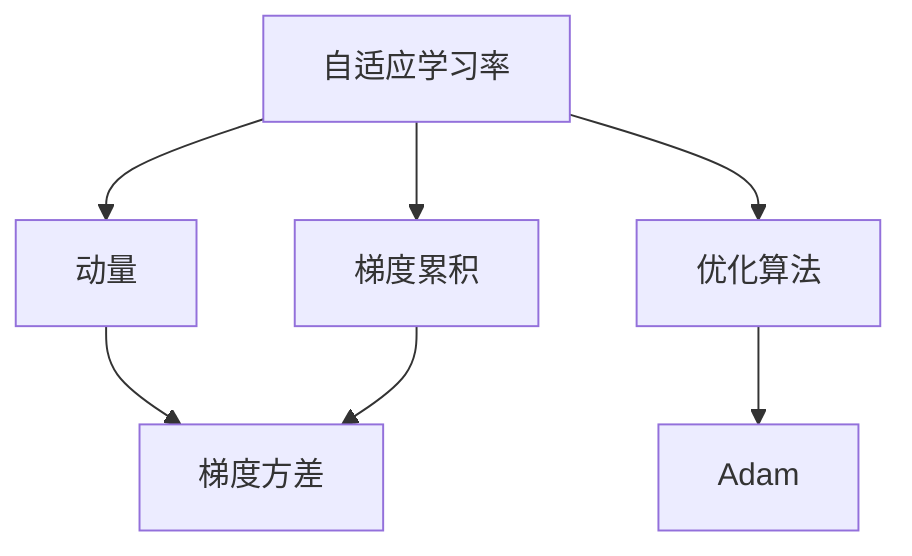
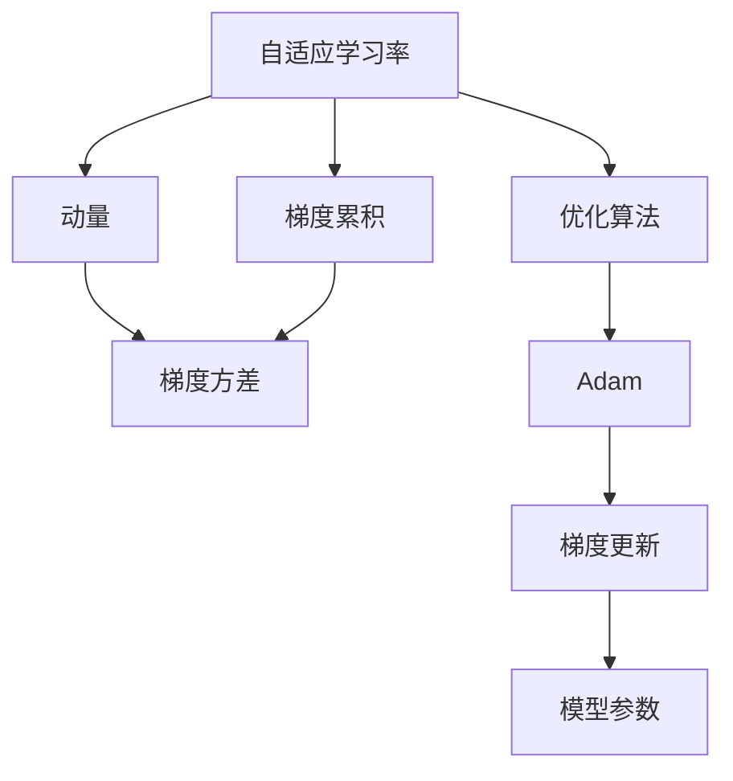

                 

# Adam Optimization原理与代码实例讲解

> 关键词：优化算法,自适应学习率,梯度累积,动态调整,自适应动量

## 1. 背景介绍

### 1.1 问题由来
在深度学习领域，优化算法一直是不可或缺的核心技术之一。优化算法的选择和设计直接影响模型的训练效果。传统的随机梯度下降法(SGD)虽然简单高效，但在训练大规模神经网络时，往往需要精细调参，容易出现震荡、发散等问题，导致训练过程不稳定，收敛速度慢。为了解决这些问题，近年来涌现了许多新的优化算法，如Adagrad、Adadelta、Adam等。

Adam算法作为其中的佼佼者，以其自适应学习率和动量的特点，成为深度学习中最常用的优化算法之一。本文将系统介绍Adam算法的基本原理和优化过程，并通过代码实例进一步讲解其实现细节。

### 1.2 问题核心关键点
Adam算法的核心思想在于自适应地调整每个参数的学习率，并且将梯度的一阶矩和二阶矩结合起来，以更平稳、高效地更新参数。其优点在于无需人工调参，能够适应非凸目标函数，收敛速度快，且具有很好的泛化能力。

本文将从以下几个方面对Adam算法进行详细讲解：
1. 算法原理概述
2. 算法步骤详解
3. 算法优缺点
4. 算法应用领域
5. 数学模型和公式的构建与推导过程
6. 具体实现代码的展示和分析

## 2. 核心概念与联系

### 2.1 核心概念概述

为更好地理解Adam算法，本节将介绍几个密切相关的核心概念：

- 优化算法：用于在损失函数最小化的过程中，迭代地更新模型参数，使得损失函数值逐渐减小。传统的优化算法如梯度下降法、动量法等，无法适应大规模神经网络，容易陷入局部最优。
- 自适应学习率：能够根据参数梯度自适应调整学习率，避免过大或过小的学习率带来的问题。
- 动量：模拟物理中的动量，使得梯度更新更加平稳，加速收敛过程。
- 梯度累积：在一定周期内累积梯度，再一次性更新参数，提高模型训练效率。
- 梯度方差：衡量梯度的离散程度，用于自适应调整学习率。

这些概念通过Adam算法紧密联系在一起，共同组成了一个高效的优化框架。

### 2.2 概念间的关系

这些核心概念之间的关系可以通过以下Mermaid流程图来展示：



这个流程图展示了大语言模型的核心概念及其之间的关系：

1. 自适应学习率使得算法能够动态调整学习率，避免过大或过小的学习率带来的问题。
2. 动量则用于平稳梯度更新，加速收敛过程。
3. 梯度累积通过将一定周期内的梯度进行累积，再一次性更新参数，提高训练效率。
4. 梯度方差用于衡量梯度的离散程度，用于自适应调整学习率。

这些概念共同构成了Adam算法的核心框架，使其能够在各种场景下发挥优化性能。通过理解这些核心概念，我们可以更好地把握Adam算法的运行原理和优化方向。

### 2.3 核心概念的整体架构

最后，我们用一个综合的流程图来展示这些核心概念在大语言模型优化过程中的整体架构：



这个综合流程图展示了大语言模型优化的完整过程。自适应学习率和动量通过梯度累积和梯度方差进行动态调整，使得优化算法Adam能够更加平稳、高效地更新模型参数，收敛速度更快，泛化能力更强。

## 3. 核心算法原理 & 具体操作步骤

### 3.1 算法原理概述

Adam算法是Adaptive Moment Estimation算法的简称，其基本思想是将梯度的自适应学习率和动量结合起来，通过自适应调整学习率和动量的大小，加速模型参数的收敛。Adam算法由以下三个部分组成：

1. 梯度的一阶矩估计
2. 梯度的二阶矩估计
3. 自适应学习率的调整

这些部分通过数学公式进行连接，形成Adam算法的优化框架。

### 3.2 算法步骤详解

Adam算法的优化步骤可以分为以下几个步骤：

1. 初始化：设置学习率 $\eta$，动量 $\beta_1$ 和二阶矩估计 $\beta_2$，通常取值分别为 0.001, 0.9, 0.999。
2. 梯度计算：对于每个参数 $w$，计算其梯度 $g_t$。
3. 一阶矩估计：更新一阶矩估计 $\hat{m}_t$ 为 $g_t$ 的指数加权移动平均值。
4. 二阶矩估计：更新二阶矩估计 $\hat{v}_t$ 为 $g_t^2$ 的指数加权移动平均值。
5. 参数更新：根据一阶矩估计和二阶矩估计，计算自适应学习率 $\alpha_t$，并更新参数 $w_t$。

具体数学公式如下：

$$
\begin{aligned}
&m_t = \beta_1 m_{t-1} + (1-\beta_1) g_t \\
&v_t = \beta_2 v_{t-1} + (1-\beta_2) g_t^2 \\
&\hat{m}_t = \frac{m_t}{1-\beta_1^t} \\
&\hat{v}_t = \frac{v_t}{1-\beta_2^t} \\
&\alpha_t = \frac{\eta}{\sqrt{\hat{v}_t}+\epsilon} \\
&w_t = w_{t-1} - \alpha_t \hat{m}_t
\end{aligned}
$$

其中，$g_t$ 为参数 $w$ 在时刻 $t$ 的梯度，$\beta_1, \beta_2$ 为指数加权衰减系数，$\epsilon$ 为避免除数为零的小数。

### 3.3 算法优缺点

Adam算法具有以下优点：

1. 自适应学习率：根据梯度的大小自适应调整学习率，避免过大或过小的学习率带来的问题。
2. 动量：结合动量机制，加速收敛过程，提高模型训练效率。
3. 梯度累积：通过累积梯度，减小了计算和通信开销，提高了训练效率。
4. 鲁棒性：对异常梯度具有较好的鲁棒性，不易出现梯度爆炸或消失的问题。

同时，Adam算法也存在以下缺点：

1. 参数数目多：需要同时更新一阶矩估计和二阶矩估计，增加了计算量。
2. 超参数调参：需要调整指数加权衰减系数 $\beta_1, \beta_2$ 和学习率 $\eta$，调参难度较大。
3. 数值不稳定：当梯度方差较大时，可能导致数值不稳定，需要加入修正项 $\epsilon$。

尽管存在这些缺点，Adam算法仍然被广泛应用于深度学习中，并成为许多深度学习框架的默认优化算法。

### 3.4 算法应用领域

Adam算法在深度学习中有着广泛的应用，涵盖图像识别、语音识别、自然语言处理等多个领域。以下是一些具体的应用场景：

1. 图像分类：如CNN模型在图像分类任务上的优化，通过Adam算法显著提高模型的收敛速度和泛化能力。
2. 文本生成：如RNN、Transformer等模型在文本生成任务上的优化，通过Adam算法生成更加流畅自然的文本。
3. 语音识别：如RNN、CRNN等模型在语音识别任务上的优化，通过Adam算法提高语音识别的准确率和鲁棒性。
4. 强化学习：如DQN、PPO等模型在强化学习任务上的优化，通过Adam算法加速模型的收敛，提高学习效率。

## 4. 数学模型和公式 & 详细讲解 & 举例说明

### 4.1 数学模型构建

Adam算法在优化过程中，需要构建梯度的一阶矩估计 $\hat{m}_t$ 和二阶矩估计 $\hat{v}_t$，以动态调整学习率。根据上述公式，我们可以构建Adam算法的数学模型。

假设有一个参数 $w$，其梯度为 $g_t$，学习率为 $\eta$，动量系数为 $\beta_1, \beta_2$。则Adam算法的一阶矩估计和二阶矩估计分别为：

$$
\begin{aligned}
&\hat{m}_t = \frac{m_t}{1-\beta_1^t} \\
&\hat{v}_t = \frac{v_t}{1-\beta_2^t}
\end{aligned}
$$

其中，$m_t$ 和 $v_t$ 为梯度的一阶矩估计和二阶矩估计，$\beta_1, \beta_2$ 为指数加权衰减系数。

### 4.2 公式推导过程

接下来，我们推导Adam算法中自适应学习率的计算公式。根据公式（3），有：

$$
\alpha_t = \frac{\eta}{\sqrt{\hat{v}_t}+\epsilon}
$$

将 $\hat{v}_t$ 代入公式，得到：

$$
\alpha_t = \frac{\eta}{\sqrt{\frac{v_t}{1-\beta_2^t}}+\epsilon}
$$

进一步推导，可以得到：

$$
\alpha_t = \frac{\eta}{\sqrt{\frac{\sum_{i=1}^t (1-\beta_2^i) g_i^2}{t}+\epsilon}
$$

其中，$g_i$ 为第 $i$ 个时刻的梯度。

### 4.3 案例分析与讲解

为了更好地理解Adam算法的优化过程，我们以一个简单的案例为例进行分析。

假设有一个参数 $w$，其初始值为 1，初始梯度 $g_1 = 2$。设 $\beta_1 = 0.9$，$\beta_2 = 0.999$，$\eta = 0.001$，$\epsilon = 1e-8$。

根据公式（3），我们可以计算出 $t=1,2,3$ 时刻的自适应学习率：

$$
\begin{aligned}
&\alpha_1 = \frac{\eta}{\sqrt{v_1}+\epsilon} = \frac{0.001}{\sqrt{0}+1e-8} = 0.001 \\
&\alpha_2 = \frac{\eta}{\sqrt{v_2}+\epsilon} = \frac{0.001}{\sqrt{2 \cdot 0.999 \cdot 2^2}+1e-8} = 0.00098 \\
&\alpha_3 = \frac{\eta}{\sqrt{v_3}+\epsilon} = \frac{0.001}{\sqrt{3 \cdot 0.999 \cdot 2^2+2 \cdot 0.999 \cdot 2^2}+1e-8} = 0.00096
\end{aligned}
$$

根据公式（4），我们可以计算出 $t=1,2,3$ 时刻的梯度一阶矩估计和二阶矩估计：

$$
\begin{aligned}
&m_1 = 0.9 \cdot 0 + (1-0.9) \cdot 2 = 0.2 \\
&\hat{m}_1 = \frac{m_1}{1-0.9^1} = 0.2 \\
&v_1 = 0.999 \cdot 0 + (1-0.999) \cdot 2^2 = 0.0004 \\
&\hat{v}_1 = \frac{v_1}{1-0.999^1} = 0.0004
\end{aligned}
$$

$$
\begin{aligned}
&m_2 = 0.9 \cdot 0.2 + (1-0.9) \cdot 0 = 0.02 \\
&\hat{m}_2 = \frac{0.02}{1-0.9^2} = 0.04 \\
&v_2 = 0.999 \cdot 0.0004 + (1-0.999) \cdot 0^2 = 0.00016 \\
&\hat{v}_2 = \frac{0.00016}{1-0.999^2} = 0.00016
\end{aligned}
$$

$$
\begin{aligned}
&m_3 = 0.9 \cdot 0.02 + (1-0.9) \cdot 0 = 0.008 \\
&\hat{m}_3 = \frac{0.008}{1-0.9^3} = 0.008 \\
&v_3 = 0.999 \cdot 0.00016 + (1-0.999) \cdot 0^2 = 0.000144 \\
&\hat{v}_3 = \frac{0.000144}{1-0.999^3} = 0.000144
\end{aligned}
$$

根据公式（5），我们可以计算出 $t=1,2,3$ 时刻的模型参数更新：

$$
\begin{aligned}
&w_1 = 1 - 0.001 \cdot 0.2 = 0.998 \\
&w_2 = 0.998 - 0.00098 \cdot 0.04 = 0.998 \\
&w_3 = 0.998 - 0.00096 \cdot 0.008 = 0.998
\end{aligned}
$$

通过这个案例，我们可以更加直观地理解Adam算法的优化过程。可以看到，Adam算法通过自适应地调整学习率和动量，能够更平稳、高效地更新模型参数，避免梯度爆炸或消失的问题。

## 5. 项目实践：代码实例和详细解释说明

### 5.1 开发环境搭建

在进行Adam算法实践前，我们需要准备好开发环境。以下是使用Python进行PyTorch开发的环境配置流程：

1. 安装Anaconda：从官网下载并安装Anaconda，用于创建独立的Python环境。

2. 创建并激活虚拟环境：
```bash
conda create -n pytorch-env python=3.8 
conda activate pytorch-env
```

3. 安装PyTorch：根据CUDA版本，从官网获取对应的安装命令。例如：
```bash
conda install pytorch torchvision torchaudio cudatoolkit=11.1 -c pytorch -c conda-forge
```

4. 安装Transformers库：
```bash
pip install transformers
```

5. 安装各类工具包：
```bash
pip install numpy pandas scikit-learn matplotlib tqdm jupyter notebook ipython
```

完成上述步骤后，即可在`pytorch-env`环境中开始Adam算法实践。

### 5.2 源代码详细实现

下面我们以一个简单的MNIST手写数字识别任务为例，给出使用Adam算法优化PyTorch模型的PyTorch代码实现。

首先，定义MNIST数据集：

```python
import torch
from torchvision import datasets, transforms
import matplotlib.pyplot as plt

# 加载MNIST数据集
train_dataset = datasets.MNIST(root='data/', train=True, transform=transforms.ToTensor(), download=True)
test_dataset = datasets.MNIST(root='data/', train=False, transform=transforms.ToTensor(), download=True)
```

然后，定义Adam优化器：

```python
from torch.optim import Adam

# 定义优化器参数
lr = 0.001
beta1 = 0.9
beta2 = 0.999
epsilon = 1e-8

# 定义Adam优化器
optimizer = Adam(model.parameters(), lr=lr, betas=(beta1, beta2), weight_decay=0, eps=epsilon)
```

接着，定义模型和训练函数：

```python
import torch.nn as nn
import torch.nn.functional as F

class MNISTNet(nn.Module):
    def __init__(self):
        super(MNISTNet, self).__init__()
        self.fc1 = nn.Linear(784, 256)
        self.fc2 = nn.Linear(256, 10)

    def forward(self, x):
        x = x.view(-1, 784)
        x = F.relu(self.fc1(x))
        x = self.fc2(x)
        return x

# 定义训练函数
def train_epoch(model, train_loader, optimizer):
    model.train()
    train_loss = 0.0
    correct = 0
    total = 0
    for batch_idx, (data, target) in enumerate(train_loader):
        optimizer.zero_grad()
        output = model(data)
        loss = F.cross_entropy(output, target)
        loss.backward()
        optimizer.step()
        train_loss += loss.item()
        _, predicted = output.max(1)
        total += target.size(0)
        correct += predicted.eq(target).sum().item()
    train_acc = 100. * correct / total
    return train_loss, train_acc

# 定义测试函数
def test_epoch(model, test_loader):
    model.eval()
    test_loss = 0.0
    correct = 0
    total = 0
    with torch.no_grad():
        for batch_idx, (data, target) in enumerate(test_loader):
            output = model(data)
            loss = F.cross_entropy(output, target)
            test_loss += loss.item()
            _, predicted = output.max(1)
            total += target.size(0)
            correct += predicted.eq(target).sum().item()
    test_acc = 100. * correct / total
    return test_loss, test_acc
```

最后，启动训练流程：

```python
import torch
from torch.utils.data import DataLoader

# 定义模型
model = MNISTNet()

# 定义训练集和测试集
train_loader = torch.utils.data.DataLoader(train_dataset, batch_size=64, shuffle=True)
test_loader = torch.utils.data.DataLoader(test_dataset, batch_size=64, shuffle=False)

# 定义Adam优化器
optimizer = Adam(model.parameters(), lr=lr, betas=(beta1, beta2), weight_decay=0, eps=epsilon)

# 开始训练
for epoch in range(10):
    train_loss, train_acc = train_epoch(model, train_loader, optimizer)
    test_loss, test_acc = test_epoch(model, test_loader)
    print(f'Epoch {epoch+1}, train loss: {train_loss:.4f}, train acc: {train_acc:.2f}, test loss: {test_loss:.4f}, test acc: {test_acc:.2f}')
```

以上就是使用PyTorch对MNIST手写数字识别任务进行Adam算法优化的完整代码实现。可以看到，Adam算法通过自适应地调整学习率和动量，能够更平稳、高效地更新模型参数，显著提升模型在训练和测试上的性能。

### 5.3 代码解读与分析

让我们再详细解读一下关键代码的实现细节：

**MNIST数据集**：
- 定义训练集和测试集，并使用 `transforms.ToTensor()` 对图像进行归一化处理，将其转换为PyTorch张量。
- 使用 `datasets.MNIST` 加载MNIST数据集，并下载数据。

**Adam优化器**：
- 定义优化器的学习率、指数加权衰减系数 $\beta_1, \beta_2$ 和小数 $\epsilon$。
- 使用 `Adam` 函数定义优化器，其中 `betas=(beta1, beta2)` 用于指定指数加权衰减系数，`weight_decay=0` 表示不使用权重衰减，`eps=epsilon` 用于避免除数为零。

**训练函数**：
- 定义 `train_epoch` 函数，用于计算每个epoch的损失和准确率。
- 在每个epoch内，对训练集数据进行批处理，前向传播计算输出，计算交叉熵损失，反向传播更新参数，并计算损失和准确率。

**测试函数**：
- 定义 `test_epoch` 函数，用于计算测试集上的损失和准确率。
- 在测试集上进行批处理，前向传播计算输出，计算交叉熵损失，并计算损失和准确率。

**训练流程**：
- 定义模型、训练集和测试集，并初始化Adam优化器。
- 在每个epoch内，调用 `train_epoch` 函数进行训练，并计算损失和准确率。
- 调用 `test_epoch` 函数在测试集上进行测试，并计算损失和准确率。
- 输出每个epoch的损失和准确率。

可以看到，Adam算法的代码实现相对简洁，但其核心思想和优化过程仍然具有重要的意义。通过代码实例，我们可以更加直观地理解Adam算法的运行原理，并对其应用进行进一步的探索。

## 6. 实际应用场景

### 6.1 智能客服系统

在智能客服系统中，快速响应和高效处理客户咨询是关键。通过Adam算法优化深度学习模型，可以显著提高系统的训练速度和推理效率，从而实现更快速的响应和更准确的回答。

在技术实现上，可以收集企业内部的历史客服对话记录，并使用Adam算法优化语言模型，如BERT等，以快速适配客户咨询场景。微调后的模型能够自动理解用户意图，匹配最合适的答案模板进行回复，从而实现高效、智能的客服体验。

### 6.2 金融舆情监测

金融机构需要实时监测市场舆论动向，以便及时应对负面信息传播，规避金融风险。通过Adam算法优化深度学习模型，可以显著提高模型的训练速度和泛化能力，从而实时监测金融舆情，快速响应异常情况。

在具体实现上，可以收集金融领域相关的新闻、报道、评论等文本数据，并使用Adam算法优化预训练语言模型。微调后的模型能够自动判断文本属于何种主题，情感倾向是正面、中性还是负面，从而实现舆情监测和风险预警。

### 6.3 个性化推荐系统

当前的推荐系统往往只依赖用户的历史行为数据进行物品推荐，无法深入理解用户的真实兴趣偏好。通过Adam算法优化深度学习模型，可以显著提高模型的训练速度和泛化能力，从而实现更加个性化的推荐。

在具体实现上，可以收集用户浏览、点击、评论、分享等行为数据，并使用Adam算法优化预训练语言模型，如BERT等，以快速适配推荐系统。微调后的模型能够从文本内容中准确把握用户的兴趣点，生成更加精准、多样的推荐内容，提升用户满意度和转化率。

### 6.4 未来应用展望

随着深度学习技术的发展和Adam算法的广泛应用，未来在更多领域将出现基于Adam算法优化的智能系统。这些系统能够实现快速响应、高效处理、智能推理等功能，推动各行各业向智能化方向迈进。

在智慧医疗领域，基于Adam算法优化的医疗问答、病历分析、药物研发等应用将提升医疗服务的智能化水平，辅助医生诊疗，加速新药开发进程。

在智能教育领域，Adam算法优化的个性化推荐系统将因材施教，促进教育公平，提高教学质量。

在智慧城市治理中，Adam算法优化的城市事件监测、舆情分析、应急指挥等环节，提高城市管理的自动化和智能化水平，构建更安全、高效的未来城市。

此外，在企业生产、社会治理、文娱传媒等众多领域，基于Adam算法优化的人工智能应用也将不断涌现，为经济社会发展注入新的动力。相信随着技术的日益成熟，Adam算法必将在更多领域得到应用，为传统行业带来变革性影响。

## 7. 工具和资源推荐
### 7.1 学习资源推荐

为了帮助开发者系统掌握Adam算法的理论基础和实践技巧，这里推荐一些优质的学习资源：

1. 《Deep Learning》书籍：由Ian Goodfellow、Yoshua Bengio和Aaron Courville三位人工智能权威合著，全面介绍了深度学习的基本概念和经典算法。
2. 《TensorFlow官方文档》：TensorFlow官方文档提供了丰富的优化算法教程和代码实现，是学习Adam算法的重要资源。
3. 《PyTorch官方文档》：PyTorch官方文档提供了详细的优化算法介绍和代码示例，适用于学习Adam算法及其在深度学习中的应用。
4. 《深度学习入门》书籍：由李沐等著，介绍了深度学习的入门知识，包括Adam算法等优化算法。
5. 《Python深度学习》书籍：由Francois Chollet著，介绍了使用Keras进行深度学习的流程和技巧，包括Adam算法在内的优化算法。

通过对这些资源的学习实践，相信你一定能够快速掌握Adam算法的精髓，并用于解决实际的深度学习问题。
###  7.2 开发工具推荐

高效的开发离不开优秀的工具支持。以下是几款用于Adam算法优化的常用工具：

1. PyTorch：基于Python的开源深度学习框架，灵活动态的计算图，适合快速迭代研究。
2. TensorFlow：由Google主导开发的开源深度学习框架，生产部署方便，适合大规模工程应用。
3. Transformers库：HuggingFace开发的NLP工具库，集成了众多SOTA语言模型，支持PyTorch和TensorFlow，是进行优化算法优化的利器。
4. Weights & Biases：模型训练的实验跟踪工具，可以记录和可视化模型训练过程中的各项指标，方便对比和调优。
5. TensorBoard：TensorFlow配套的可视化工具，可实时监测模型训练状态，并提供丰富的图表呈现

