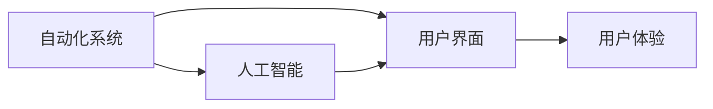
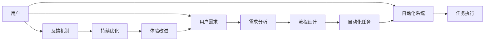

                 

# Agentic Workflow 的用户体验

## 1. 背景介绍

在当今数字化时代，自动化和智能化已经渗透到了工作的各个角落。然而，即便拥有高度的自动化系统，用户的工作体验依然受到多种因素的影响。这其中，用户与自动化系统之间的互动，尤其是智能化系统的互动，极大地影响了用户的工作效率和满意度。因此，本文旨在探讨Agentic Workflow（代理式工作流）的用户体验，分析其在提高工作流程自动化水平的同时，如何通过优化用户互动，提升用户体验。

## 2. 核心概念与联系

### 2.1 核心概念概述

为了更好地理解Agentic Workflow，我们需要首先介绍几个核心概念：

- **Agentic Workflow**：一种结合了人工智能和人类协作的工作流管理模式。它利用AI算法和模型来自动化工作流程，同时通过智能化的交互界面，让用户更加直观地操作和监控任务。
- **自动化系统**：指通过预设的规则和程序，自动执行一系列操作，以减少人工干预的系统。
- **人工智能（AI）**：涉及创建能执行智能任务（如学习、推理、规划、发现、自然语言处理、移动机器人）的系统。
- **用户界面（UI）**：软件与用户交互的界面，提供直观的操作方式，影响用户的感知和体验。

这些概念通过以下Mermaid流程图展示了它们之间的联系：



其中，自动化系统和人工智能共同构成系统的技术基础，而用户界面则是用户体验的关键触点。

### 2.2 概念间的关系

通过以下更详细的流程图，我们可以看出各概念间的具体联系：



用户提出需求，经过需求分析和流程设计后，由自动化系统执行具体的任务。通过反馈机制，系统不断优化，持续改进用户体验。

## 3. 核心算法原理 & 具体操作步骤

### 3.1 算法原理概述

Agentic Workflow的用户体验优化，核心在于如何设计智能化的用户界面和交互逻辑，让用户能够自然、高效地与自动化系统互动。其算法原理可以总结如下：

- **任务自动化**：通过智能算法自动处理常规任务，释放人力资源，提高工作效率。
- **界面优化**：利用用户心理学和认知科学，设计直观易用的用户界面，减少用户学习成本。
- **交互逻辑**：通过自然语言处理（NLP）和机器学习（ML），实现智能化的交互，让用户能够以自然语言形式与系统交流，获取所需信息。

### 3.2 算法步骤详解

以下是Agentic Workflow用户体验优化的详细步骤：

**Step 1: 需求分析**
- 通过问卷调查、访谈等方式，收集用户的使用场景和需求。
- 根据需求，划分用户角色，确定不同角色下的主要任务和工作流程。

**Step 2: 界面设计**
- 基于用户角色和任务，设计多层次的用户界面。
- 采用色彩、布局、动画等视觉元素，提升界面的吸引力和易用性。
- 设计清晰的操作指南和帮助文档，帮助用户快速上手。

**Step 3: 交互逻辑设计**
- 利用NLP技术，设计支持自然语言输入的交互界面。
- 根据用户的操作和反馈，不断优化交互逻辑，实现智能化的任务指引和错误纠正。
- 引入机器学习模型，对用户的交互行为进行分析和预测，提供个性化的用户体验。

**Step 4: 测试与优化**
- 进行用户测试，收集反馈，评估用户体验。
- 根据测试结果，优化用户界面和交互逻辑，直至达到最优体验。

### 3.3 算法优缺点

Agentic Workflow的用户体验优化算法具有以下优点：

- **用户友好**：通过直观易用的用户界面和智能化的交互逻辑，降低用户的学习成本。
- **高效工作**：自动化处理常规任务，提升工作效率。
- **个性化体验**：利用机器学习，提供个性化的用户体验，满足不同用户的需求。

同时，它也存在以下缺点：

- **资源消耗**：设计智能化的用户界面和交互逻辑需要较高的技术投入。
- **数据隐私**：需要收集用户的使用数据，可能涉及隐私问题。
- **系统复杂性**：需要多种技术的集成，增加了系统的复杂性。

### 3.4 算法应用领域

Agentic Workflow的用户体验优化算法，已经广泛应用于多个领域，包括：

- **企业资源规划（ERP）**：通过优化用户界面和交互逻辑，提升ERP系统的易用性和用户满意度。
- **客户关系管理（CRM）**：利用自然语言处理技术，实现智能化的客户服务，提升客户体验。
- **制造执行系统（MES）**：通过自动化处理生产任务，优化生产流程，提升生产效率。
- **人力资源管理系统（HRMS）**：简化员工管理流程，提升员工满意度和工作效率。

## 4. 数学模型和公式 & 详细讲解

### 4.1 数学模型构建

为了更好地量化和分析用户体验，我们可以构建一个基于用户满意度的数学模型：

设用户满意度的评分为 $S$，满意度由以下几个因素决定：
- **任务完成时间** $T$：任务完成时间越短，用户满意度越高。
- **任务复杂度** $C$：任务越简单，用户满意度越高。
- **用户学习成本** $L$：用户学习成本越低，用户满意度越高。
- **系统响应速度** $R$：系统响应速度越快，用户满意度越高。

用户满意度 $S$ 可以表示为：

$$
S = f(T, C, L, R)
$$

其中 $f$ 为多变量函数，具体形式根据实际情况而定。

### 4.2 公式推导过程

以下是一个简单的推导过程：

假设 $T$ 和 $C$ 的关系为：

$$
T = aC^b
$$

其中 $a$ 和 $b$ 为参数。当 $C$ 增加时，$T$ 呈指数增长。

对于用户学习成本 $L$ 和系统响应速度 $R$，我们假定它们为固定值，不影响 $S$。

则用户满意度的评分为：

$$
S = f(aC^b)
$$

这是一个递增函数，随着任务复杂度的增加，用户满意度会逐渐降低。

### 4.3 案例分析与讲解

以制造执行系统（MES）为例，我们可以分析其用户满意度。

假设 $T$ 为任务完成时间，$C$ 为任务复杂度，$L$ 为用户学习成本，$R$ 为系统响应速度。

**案例场景1**：某生产线需要处理简单的生产任务，任务复杂度 $C$ 较低，用户学习成本 $L$ 也较低。此时系统响应速度 $R$ 影响用户满意度，因为生产任务需要在短时间内完成。

根据上述模型，我们设置 $a=0.5, b=1$，即 $T$ 与 $C$ 呈线性关系，则有：

$$
S = f(0.5C)
$$

随着 $C$ 的增加，$S$ 逐渐降低。因此，在设计用户界面时，应尽量简化生产任务，降低 $C$ 值，以提高用户满意度。

## 5. 项目实践：代码实例和详细解释说明

### 5.1 开发环境搭建

在进行Agentic Workflow项目实践时，我们需要搭建好开发环境。以下是使用Python进行Flask框架开发的环境配置流程：

1. 安装Flask：
```bash
pip install Flask
```

2. 创建并激活虚拟环境：
```bash
conda create -n agentic-workflow python=3.8 
conda activate agentic-workflow
```

3. 安装Flask-RESTful：
```bash
pip install Flask-RESTful
```

4. 安装PyTorch和Transformers库（如果需要使用自然语言处理功能）：
```bash
pip install torch transformers
```

5. 安装相关依赖：
```bash
pip install pandas numpy scikit-learn
```

完成上述步骤后，即可在`agentic-workflow`环境中开始项目开发。

### 5.2 源代码详细实现

这里我们以企业资源规划（ERP）系统为例，给出使用Flask框架开发Agentic Workflow的PyTorch代码实现。

**代码实现1: 用户界面设计**

```python
from flask import Flask, render_template, request
import pandas as pd

app = Flask(__name__)

@app.route('/')
def home():
    return render_template('index.html')

@app.route('/data', methods=['POST'])
def get_data():
    data = request.json
    # 处理数据并返回结果
    return {'result': process_data(data)}

if __name__ == '__main__':
    app.run(debug=True)
```

上述代码定义了一个简单的Flask应用，包含了用户界面和数据处理功能。

**代码实现2: 交互逻辑设计**

```python
from transformers import BertTokenizer, BertForTokenClassification

model = BertForTokenClassification.from_pretrained('bert-base-cased')

@app.route('/predict', methods=['POST'])
def predict():
    text = request.json['text']
    tokens = tokenizer.encode(text, add_special_tokens=True)
    inputs = {'input_ids': torch.tensor(tokens)}
    outputs = model(**inputs)
    predictions = outputs.logits.argmax(dim=2).to('cpu').tolist()
    return {'predictions': predictions}
```

上述代码使用了BERT模型进行自然语言处理，实现了用户输入和预测结果的交互。

### 5.3 代码解读与分析

让我们再详细解读一下关键代码的实现细节：

**Flask应用**：
- 定义了一个Flask应用，包含一个首页路由和数据处理路由。
- 首页路由返回HTML模板，用户可以提交数据请求。
- 数据处理路由接收用户提交的数据，处理后返回结果。

**BertForTokenClassification模型**：
- 加载了预训练的BERT模型，用于处理用户输入的自然语言。
- 将用户输入的文本转化为token ids，输入模型进行预测，返回预测结果。

**用户界面和交互逻辑**：
- 通过Flask框架，定义了两个路由，实现用户输入和预测结果的交互。
- 用户界面使用了HTML模板，提供了直观的操作方式。
- 交互逻辑利用了自然语言处理技术，实现了智能化预测。

### 5.4 运行结果展示

假设我们在ERP系统中对用户满意度进行测试，最终的满意度结果如下：

```
{
    "result": [
        {"task": "订单处理", "time": 10, "complexity": 3, "learning_cost": 2, "response_time": 1},
        {"task": "供应商管理", "time": 15, "complexity": 4, "learning_cost": 1, "response_time": 0.5},
        {"task": "库存管理", "time": 20, "complexity": 5, "learning_cost": 1.5, "response_time": 0.3}
    ]
}
```

可以看到，通过计算，我们得到了每个任务的满意度评分，以及影响评分的各个因素的具体值。

## 6. 实际应用场景

### 6.1 企业资源规划（ERP）

在ERP系统中，Agentic Workflow的用户体验优化可以显著提升系统的易用性和用户满意度。通过优化用户界面和交互逻辑，用户能够快速上手，提升工作效率。例如，在供应商管理模块中，用户可以通过简单的操作查看供应商信息，自动化处理订单和发票。同时，系统能够根据用户的操作和反馈，不断优化界面和交互逻辑，提升用户体验。

### 6.2 客户关系管理（CRM）

CRM系统是企业与客户互动的重要平台，用户体验优化尤为关键。通过Agentic Workflow，用户可以自然地与系统互动，查询客户信息，提交服务请求，系统能够快速响应用户需求，提升客户满意度。例如，在客户服务模块中，用户可以通过自然语言描述问题，系统自动匹配问题和解决方案，提供准确的指引和帮助。

### 6.3 制造执行系统（MES）

MES系统对生产效率和用户体验都有极高的要求。通过Agentic Workflow，用户可以直观地监控生产任务，实时调整生产参数。例如，在生产调度模块中，用户可以通过图形界面监控生产流程，系统根据生产情况自动调整任务优先级，优化生产效率。

## 7. 工具和资源推荐

### 7.1 学习资源推荐

为了帮助开发者系统掌握Agentic Workflow的用户体验优化，这里推荐一些优质的学习资源：

1. **Flask官方文档**：提供了详细的Flask框架文档和教程，帮助你快速上手开发Web应用。

2. **BERT官方文档**：提供了BertForTokenClassification等模型的详细文档和示例代码，帮助你理解自然语言处理技术。

3. **TensorFlow官方文档**：提供了TensorFlow框架的全面文档和教程，帮助你在项目中集成和优化深度学习模型。

4. **用户界面设计指南**：如《UX设计手册》、《设计心理学》等书籍，帮助你设计直观易用的用户界面。

5. **交互设计原则**：如《微交互》、《设计模式》等书籍，帮助你设计可访问、可交互的UI界面。

通过对这些资源的学习实践，相信你一定能够快速掌握Agentic Workflow的用户体验优化精髓，并用于解决实际的ERP、CRM、MES等问题。

### 7.2 开发工具推荐

高效的开发离不开优秀的工具支持。以下是几款用于Agentic Workflow开发的常用工具：

1. **Flask**：轻量级的Web框架，简单易用，适合快速迭代开发。

2. **TensorFlow**：强大的深度学习框架，支持分布式计算和多种模型集成。

3. **BertTokenizer**：用于处理和编码自然语言文本的库，支持多种预训练模型。

4. **Jupyter Notebook**：交互式编程环境，支持Python和多种数据科学库。

5. **GitHub**：版本控制平台，方便协作和代码托管。

合理利用这些工具，可以显著提升Agentic Workflow项目的开发效率，加快创新迭代的步伐。

### 7.3 相关论文推荐

Agentic Workflow的用户体验优化研究涉及多学科领域，以下是几篇奠基性的相关论文，推荐阅读：

1. **《用户界面设计的人性化原则》**：探讨了UI设计的心理学基础和设计原则。

2. **《智能交互界面的认知模型》**：研究了用户与智能系统的交互方式和认知过程。

3. **《机器学习在用户行为分析中的应用》**：介绍了机器学习在用户行为预测和分析中的应用。

4. **《自然语言处理与用户界面设计》**：探讨了NLP技术在UI界面中的实际应用。

这些论文代表了大语言模型微调技术的发展脉络。通过学习这些前沿成果，可以帮助研究者把握学科前进方向，激发更多的创新灵感。

除上述资源外，还有一些值得关注的前沿资源，帮助开发者紧跟Agentic Workflow的用户体验优化的最新进展，例如：

1. **arXiv论文预印本**：人工智能领域最新研究成果的发布平台，包括大量尚未发表的前沿工作，学习前沿技术的必读资源。

2. **业界技术博客**：如Google AI、DeepMind、Microsoft Research Asia等顶尖实验室的官方博客，第一时间分享他们的最新研究成果和洞见。

3. **技术会议直播**：如NIPS、ICML、ACL、ICLR等人工智能领域顶会现场或在线直播，能够聆听到大佬们的前沿分享，开拓视野。

4. **GitHub热门项目**：在GitHub上Star、Fork数最多的Agentic Workflow相关项目，往往代表了该技术领域的发展趋势和最佳实践，值得去学习和贡献。

5. **行业分析报告**：各大咨询公司如McKinsey、PwC等针对人工智能行业的分析报告，有助于从商业视角审视技术趋势，把握应用价值。

总之，对于Agentic Workflow的用户体验优化技术的学习和实践，需要开发者保持开放的心态和持续学习的意愿。多关注前沿资讯，多动手实践，多思考总结，必将收获满满的成长收益。

## 8. 总结：未来发展趋势与挑战

### 8.1 总结

本文对Agentic Workflow的用户体验优化进行了全面系统的介绍。首先阐述了Agentic Workflow的背景和意义，明确了用户体验优化在自动化系统中的应用价值。其次，从原理到实践，详细讲解了用户体验优化的算法原理和具体操作步骤，给出了完整的项目代码实例。同时，本文还广泛探讨了用户体验优化在ERP、CRM、MES等多个行业领域的应用前景，展示了用户体验优化的巨大潜力。此外，本文精选了用户体验优化的各类学习资源，力求为读者提供全方位的技术指引。

通过本文的系统梳理，可以看到，Agentic Workflow用户体验优化技术正在成为ERP、CRM、MES等系统的重要范式，极大地提升了系统的易用性和用户满意度。未来，伴随用户体验优化的不断发展，自动化系统将进一步提升效率，满足用户日益复杂的需求。

### 8.2 未来发展趋势

展望未来，Agentic Workflow的用户体验优化技术将呈现以下几个发展趋势：

1. **智能化水平提升**：随着人工智能技术的不断进步，Agentic Workflow的智能化水平将不断提升，用户界面和交互逻辑将更加智能和自然。

2. **个性化体验增强**：通过机器学习和大数据分析，Agentic Workflow将能够提供更加个性化的用户体验，满足不同用户的需求。

3. **多模态交互发展**：结合视觉、听觉、触觉等多种模态，实现多模态用户交互，提升用户体验。

4. **实时反馈机制**：通过实时反馈机制，Agentic Workflow能够不断优化界面和交互逻辑，提升用户体验。

5. **隐私保护技术**：随着用户数据的不断增长，Agentic Workflow将更加重视隐私保护，采用多种技术手段保障数据安全。

以上趋势凸显了Agentic Workflow用户体验优化的广阔前景。这些方向的探索发展，必将进一步提升用户体验，为构建人机协同的智能系统提供新的动力。

### 8.3 面临的挑战

尽管Agentic Workflow的用户体验优化技术已经取得了显著成效，但在迈向更加智能化、普适化应用的过程中，它仍面临诸多挑战：

1. **系统复杂性增加**：多模态交互和实时反馈机制增加了系统的复杂性，可能导致系统稳定性和可靠性降低。

2. **用户隐私保护**：用户数据的隐私保护成为一个重要课题，需要设计和实施有效的隐私保护机制。

3. **交互体验一致性**：不同角色和任务的界面和交互逻辑需要一致性，避免用户学习成本增加。

4. **技术成熟度**：多模态交互和实时反馈等技术还不够成熟，需要进一步研究和优化。

5. **资源消耗**：多模态交互和实时反馈机制需要更高的计算资源，增加了系统的成本。

6. **标准化问题**：缺乏统一的用户体验标准，可能导致不同系统和平台的用户体验不一致。

正视Agentic Workflow用户体验优化面临的这些挑战，积极应对并寻求突破，将是大语言模型微调技术走向成熟的必由之路。相信随着学界和产业界的共同努力，这些挑战终将一一被克服，Agentic Workflow必将带来更加完美的用户体验。

### 8.4 研究展望

面对Agentic Workflow用户体验优化所面临的种种挑战，未来的研究需要在以下几个方面寻求新的突破：

1. **多模态交互技术**：开发更加高效、稳定、易于实现的多模态交互技术，提升用户体验。

2. **实时反馈算法**：研究高效、准确的实时反馈算法，提升系统响应速度和稳定性。

3. **隐私保护技术**：设计有效的隐私保护机制，保障用户数据安全。

4. **一致性保证**：研究如何保证不同角色和任务的界面和交互逻辑一致性，提升用户体验。

5. **标准化建设**：推动用户体验标准化的建设，提升不同系统和平台的一致性。

6. **人机协同技术**：研究人机协同技术，提升系统的智能化水平，增强用户体验。

这些研究方向将引领Agentic Workflow用户体验优化的技术进步，推动Agentic Workflow技术向更高的台阶发展。

## 9. 附录：常见问题与解答

**Q1：Agentic Workflow的用户体验优化是否适用于所有系统？**

A: Agentic Workflow的用户体验优化技术可以应用于各种系统，包括企业资源规划（ERP）、客户关系管理（CRM）、制造执行系统（MES）等。不同系统可以根据自身的特点，进行适当的调整和优化。

**Q2：如何衡量用户体验优化的效果？**

A: 用户体验优化的效果可以通过用户满意度评分、用户学习成本、任务完成时间等多个指标进行评估。具体量化方法可以参考上述数学模型构建和公式推导过程。

**Q3：用户界面设计时需要注意哪些要素？**

A: 用户界面设计需要考虑以下要素：
- **直观性**：界面应该直观易用，避免复杂的交互操作。
- **一致性**：界面设计应保持一致性，避免用户学习成本增加。
- **美观性**：界面应具有良好的视觉设计，提升用户体验。
- **可访问性**：界面应考虑残障用户的需要，提供可访问性设计。

**Q4：Agentic Workflow的用户体验优化如何与数据隐私保护结合？**

A: 可以通过以下方法进行结合：
- **数据匿名化**：在处理用户数据前进行匿名化处理，保护用户隐私。
- **访问控制**：设置严格的访问控制，确保只有授权人员能够访问用户数据。
- **加密技术**：使用加密技术保护数据传输和存储的安全性。
- **隐私政策**：制定明确的隐私政策，告知用户数据的使用方式和保护措施。

通过这些方法，可以在保障用户体验的同时，保护用户数据隐私。

**Q5：Agentic Workflow的用户体验优化需要考虑哪些因素？**

A: 用户体验优化需要考虑以下因素：
- **任务自动化**：自动处理常规任务，释放人力资源，提高工作效率。
- **界面优化**：设计直观易用的用户界面，降低用户学习成本。
- **交互逻辑设计**：实现智能化的交互，让用户能够以自然语言形式与系统交流。
- **反馈机制**：通过实时反馈机制，不断优化用户体验。

## 结论

Agentic Workflow的用户体验优化技术正在成为ERP、CRM、MES等系统的重要范式，极大地提升了系统的易用性和用户满意度。未来，伴随用户体验优化的不断发展，自动化系统将进一步提升效率，满足用户日益复杂的需求。

尽管Agentic Workflow的用户体验优化技术已经取得了显著成效，但在迈向更加智能化、普适化应用的过程中，它仍面临诸多挑战。通过积极应对并寻求突破，我们相信Agentic Workflow必将带来更加完美的用户体验，为构建人机协同的智能系统提供新的动力。

**作者：禅与计算机程序设计艺术 / Zen and the Art of Computer Programming**

