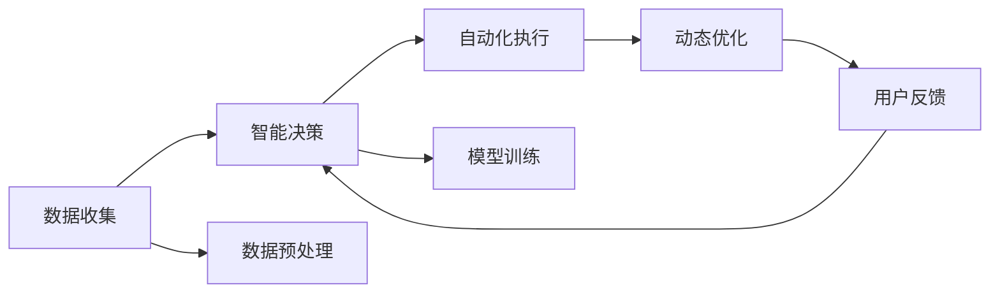

                 

# Agentic Workflow 设计模式的未来发展

> 关键词：Agentic Workflow, 人工智能, 未来发展趋势, 设计模式, 应用场景, 技术演进, 自动化, 智慧工作流, 智能系统

## 1. 背景介绍

在当今数字化时代，随着信息技术的高速发展，自动化和智能化已成为提高工作效率、降低运营成本的重要手段。与此同时，人工智能(AI)技术也不断成熟，其在自动化流程中的广泛应用，为各行各业带来了颠覆性变革。在众多自动化手段中，Agentic Workflow（简称Agentic WF）设计模式因其在智能自动化和自动化管理中的独特优势，逐步成为自动化领域的重要工具。本文将从背景介绍开始，逐步深入探讨Agentic Workflow设计模式的原理、操作步骤以及未来发展趋势。

### 1.1 问题由来
Agentic Workflow是近年来随着AI技术的发展逐渐兴起的一种自动化设计模式。其核心理念是将AI技术应用于流程自动化，通过智能决策和自动化任务执行，提高业务流程的效率和智能化水平。Agentic Workflow不仅能够优化常规业务流程，还可以在复杂场景下实现更智能的决策和执行。相较于传统的自动化工具，Agentic Workflow具有高度灵活性，能够在无需人工干预的情况下完成复杂任务，使得企业能够快速响应市场变化，提升竞争力。

### 1.2 问题核心关键点
Agentic Workflow设计模式的核心关键点在于其“智能”与“自动化”的结合，具体体现在以下几个方面：
1. **智能决策**：Agentic Workflow通过机器学习、深度学习等AI技术，实现对复杂业务场景的智能判断和决策，从而自动化地完成流程任务。
2. **自动化执行**：基于智能决策，Agentic Workflow能够自动执行复杂、耗时的业务流程，减少人工操作，提高效率。
3. **动态优化**：Agentic Workflow能够根据业务需求动态调整执行策略，适应不同场景，实现流程的持续优化和改进。

### 1.3 问题研究意义
Agentic Workflow设计模式在自动化领域的应用，不仅提升了业务流程的效率和智能化水平，还为企业的自动化管理和智能化运营提供了新的思路和工具。通过智能决策和自动化执行，Agentic Workflow能够大幅降低人工干预，提升自动化系统的鲁棒性和适应性，从而为企业带来更高的投资回报率。此外，Agentic Workflow还为AI技术的实际应用提供了新的应用场景，推动了AI技术的发展和普及。

## 2. 核心概念与联系

### 2.1 核心概念概述

Agentic Workflow作为一种新兴的自动化设计模式，涉及多个核心概念，包括智能决策、自动化执行、动态优化、用户反馈等。这些核心概念共同构成了Agentic Workflow的基础架构。

#### 2.1.1 智能决策

智能决策是Agentic Workflow设计模式的核心之一，它利用AI技术，如机器学习、深度学习等，实现对业务场景的智能判断和决策。智能决策的具体实现通常包括以下几个步骤：
1. **数据收集**：从业务系统中收集相关数据，包括业务参数、用户行为、外部环境等。
2. **数据预处理**：对收集到的数据进行清洗、特征提取等预处理操作，以便进行后续分析。
3. **模型训练**：使用机器学习或深度学习算法，对处理后的数据进行训练，生成决策模型。
4. **决策执行**：根据业务场景，调用训练好的模型，进行智能决策。

#### 2.1.2 自动化执行

自动化执行是Agentic Workflow设计模式的另一核心，它通过智能决策的结果，自动执行业务流程中的任务。自动化执行的具体实现通常包括以下几个步骤：
1. **任务定义**：明确自动化流程中需要执行的任务及其输入输出。
2. **执行策略**：设计自动化执行的策略，如顺序执行、并发执行等。
3. **执行引擎**：实现自动化执行的具体逻辑，通过API接口、脚本等实现任务执行。

#### 2.1.3 动态优化

动态优化是Agentic Workflow设计模式的重要特性之一，它能够根据业务需求和实际情况，动态调整执行策略和决策模型。动态优化的具体实现通常包括以下几个步骤：
1. **监控与反馈**：实时监控自动化流程的执行情况，收集用户反馈和业务指标。
2. **模型优化**：根据收集到的反馈和指标，优化决策模型和执行策略。
3. **迭代优化**：通过迭代调整，持续优化Agentic Workflow的设计和执行效果。

#### 2.1.4 用户反馈

用户反馈是Agentic Workflow设计模式的重要组成部分，它能够帮助优化Agentic Workflow的设计和执行效果。用户反馈的具体实现通常包括以下几个步骤：
1. **用户交互**：通过API接口、Web界面等方式，收集用户的操作和反馈信息。
2. **分析与处理**：对收集到的反馈信息进行分析和处理，提取有用的数据。
3. **反馈应用**：将处理后的反馈信息应用于Agentic Workflow的设计和优化。

### 2.2 概念间的关系

Agentic Workflow设计模式中各核心概念之间存在密切联系，共同构成了其完整的架构。以下通过几个Mermaid流程图来展示这些概念之间的关系：



这个流程图展示了Agentic Workflow设计模式的基本流程，其中数据收集、智能决策、自动化执行、动态优化、用户反馈等概念相互关联，共同构成了其完整的自动化流程。

## 3. 核心算法原理 & 具体操作步骤

### 3.1 算法原理概述

Agentic Workflow设计模式的核心算法原理主要基于AI技术和自动化执行，其核心思想是将AI技术应用于流程自动化，通过智能决策和自动化执行，实现业务流程的智能化和自动化。Agentic Workflow的具体算法原理如下：

1. **智能决策算法**：Agentic Workflow利用机器学习、深度学习等AI技术，对业务场景进行智能判断和决策。
2. **自动化执行算法**：基于智能决策的结果，Agentic Workflow能够自动执行业务流程中的任务，减少人工干预，提高效率。
3. **动态优化算法**：Agentic Workflow能够根据业务需求和实际情况，动态调整执行策略和决策模型，实现流程的持续优化和改进。
4. **用户反馈算法**：Agentic Workflow通过收集用户反馈信息，优化决策模型和执行策略，提升用户体验。

### 3.2 算法步骤详解

Agentic Workflow设计模式的具体操作步骤如下：

#### 3.2.1 数据收集

数据收集是Agentic Workflow的第一步，主要包括以下几个步骤：
1. **业务系统数据**：从企业的业务系统中收集相关数据，如业务参数、用户行为、外部环境等。
2. **数据清洗与预处理**：对收集到的数据进行清洗、特征提取等预处理操作，以便进行后续分析。

#### 3.2.2 智能决策

智能决策是Agentic Workflow的核心步骤，主要包括以下几个步骤：
1. **模型选择与训练**：选择合适的机器学习或深度学习模型，对处理后的数据进行训练，生成决策模型。
2. **智能决策执行**：根据业务场景，调用训练好的模型，进行智能决策。

#### 3.2.3 自动化执行

自动化执行是Agentic Workflow的重要组成部分，主要包括以下几个步骤：
1. **任务定义**：明确自动化流程中需要执行的任务及其输入输出。
2. **执行策略设计**：设计自动化执行的策略，如顺序执行、并发执行等。
3. **执行引擎实现**：通过API接口、脚本等实现任务执行。

#### 3.2.4 动态优化

动态优化是Agentic Workflow的重要特性之一，主要包括以下几个步骤：
1. **监控与反馈**：实时监控自动化流程的执行情况，收集用户反馈和业务指标。
2. **模型优化**：根据收集到的反馈和指标，优化决策模型和执行策略。
3. **迭代优化**：通过迭代调整，持续优化Agentic Workflow的设计和执行效果。

#### 3.2.5 用户反馈

用户反馈是Agentic Workflow的重要组成部分，主要包括以下几个步骤：
1. **用户交互**：通过API接口、Web界面等方式，收集用户的操作和反馈信息。
2. **分析与处理**：对收集到的反馈信息进行分析和处理，提取有用的数据。
3. **反馈应用**：将处理后的反馈信息应用于Agentic Workflow的设计和优化。

### 3.3 算法优缺点

Agentic Workflow设计模式具有以下优点：
1. **高效性**：Agentic Workflow能够自动化执行复杂任务，减少人工干预，提高效率。
2. **灵活性**：Agentic Workflow能够根据业务需求动态调整执行策略和决策模型，适应不同场景。
3. **智能性**：Agentic Workflow利用AI技术，实现对复杂业务场景的智能判断和决策。

同时，Agentic Workflow也存在以下缺点：
1. **高成本**：Agentic Workflow的开发和部署成本较高，需要专业的AI技术人才和大量计算资源。
2. **复杂性**：Agentic Workflow的设计和实现较为复杂，需要综合考虑多方面因素。
3. **依赖性**：Agentic Workflow依赖于AI技术的实现，对数据质量和模型精度要求较高。

### 3.4 算法应用领域

Agentic Workflow设计模式具有广泛的应用领域，包括但不限于以下几个方面：

#### 3.4.1 金融行业

Agentic Workflow在金融行业中的应用主要包括以下几个方面：
1. **风险管理**：通过智能决策，自动执行风险评估和预警任务。
2. **客户服务**：通过智能决策，自动执行客户咨询和问题解答任务。
3. **投资分析**：通过智能决策，自动执行投资分析和交易决策任务。

#### 3.4.2 医疗行业

Agentic Workflow在医疗行业中的应用主要包括以下几个方面：
1. **病例分析**：通过智能决策，自动执行病例分析和诊断任务。
2. **患者管理**：通过智能决策，自动执行患者信息和病历管理任务。
3. **治疗方案**：通过智能决策，自动执行治疗方案推荐和调整任务。

#### 3.4.3 制造行业

Agentic Workflow在制造行业中的应用主要包括以下几个方面：
1. **生产调度**：通过智能决策，自动执行生产计划和调度任务。
2. **质量控制**：通过智能决策，自动执行质量检测和控制任务。
3. **设备维护**：通过智能决策，自动执行设备状态监测和维护任务。

#### 3.4.4 物流行业

Agentic Workflow在物流行业中的应用主要包括以下几个方面：
1. **路径规划**：通过智能决策，自动执行物流路径规划和优化任务。
2. **库存管理**：通过智能决策，自动执行库存管理和调拨任务。
3. **配送管理**：通过智能决策，自动执行配送任务和异常处理。

## 4. 数学模型和公式 & 详细讲解 & 举例说明

### 4.1 数学模型构建

Agentic Workflow设计模式中的数学模型主要基于机器学习和深度学习的算法，其数学模型构建包括以下几个步骤：

1. **数据表示**：将业务数据表示为数学形式，通常使用向量、矩阵等形式。
2. **模型选择**：选择合适的机器学习或深度学习模型，如线性回归、逻辑回归、决策树、神经网络等。
3. **训练与优化**：使用训练数据对模型进行训练和优化，通常使用梯度下降等优化算法。
4. **预测与决策**：使用训练好的模型进行预测和决策，生成智能决策结果。

### 4.2 公式推导过程

以下以线性回归为例，展示Agentic Workflow设计模式中的数学模型构建和公式推导过程。

假设有一组数据集 $(x_i, y_i)$，其中 $x_i$ 为输入特征，$y_i$ 为输出标签。线性回归的目标是找到一个最优的线性函数 $f(x) = \theta_0 + \theta_1x_1 + \theta_2x_2 + ... + \theta_nx_n$，使得预测结果与真实结果的误差最小。

设误差函数为 $E(y,f(x)) = \frac{1}{2}(y - f(x))^2$，则最小化误差函数等价于最小化损失函数 $L(\theta) = \frac{1}{2}\sum_{i=1}^n(y_i - f(x_i))^2$。

对损失函数求偏导，得到：

$$
\frac{\partial L(\theta)}{\partial \theta_k} = \sum_{i=1}^n(y_i - f(x_i))(x_{i,k}) = \sum_{i=1}^n(y_i - \hat{y}_i)x_{i,k}
$$

其中 $\hat{y}_i = \theta_0 + \theta_1x_{i,1} + \theta_2x_{i,2} + ... + \theta_nx_{i,n}$。

令 $\frac{\partial L(\theta)}{\partial \theta_k} = 0$，得到最优参数 $\theta$ 的求解公式为：

$$
\theta_k = \frac{\sum_{i=1}^n(y_i - \hat{y}_i)x_{i,k}}{\sum_{i=1}^n(x_{i,k})^2}
$$

以上公式展示了Agentic Workflow设计模式中线性回归的数学模型构建和公式推导过程。

### 4.3 案例分析与讲解

#### 4.3.1 智能决策

以金融行业中的风险管理为例，展示Agentic Workflow设计模式在智能决策中的应用。

假设有一家金融机构，需要实时监控客户的信用风险。通过Agentic Workflow设计模式，可以从客户的信用记录、交易行为、历史违约记录等数据中，提取特征，使用机器学习算法训练一个风险评估模型。该模型可以实时接收客户的最新数据，预测其信用风险等级，并根据风险等级自动执行相应的风险管理措施，如提高授信额度、降低授信额度等。

#### 4.3.2 自动化执行

以制造业中的生产调度为例，展示Agentic Workflow设计模式在自动化执行中的应用。

假设有一家制造企业，需要自动执行生产调度任务。通过Agentic Workflow设计模式，可以根据生产订单、设备状态、库存水平等数据，设计一个自动化调度算法。该算法可以自动生成生产计划，调度生产设备，调整生产进度，从而提高生产效率，降低生产成本。

#### 4.3.3 动态优化

以物流行业中的路径规划为例，展示Agentic Workflow设计模式在动态优化中的应用。

假设有一家物流公司，需要实时优化物流路径。通过Agentic Workflow设计模式，可以收集车辆位置、交通状况、货物重量等数据，使用动态优化算法，实时计算最优路径，自动调整运输计划，从而提高物流效率，降低运输成本。

## 5. 项目实践：代码实例和详细解释说明

### 5.1 开发环境搭建

在进行Agentic Workflow项目实践前，我们需要准备好开发环境。以下是使用Python进行项目实践的环境配置流程：

1. 安装Anaconda：从官网下载并安装Anaconda，用于创建独立的Python环境。
2. 创建并激活虚拟环境：
```bash
conda create -n pyenv python=3.8 
conda activate pyenv
```
3. 安装PyTorch、TensorFlow等常用机器学习框架：
```bash
pip install torch torchvision torchaudio tensorflow
```
4. 安装相关库：
```bash
pip install numpy pandas scikit-learn matplotlib tqdm jupyter notebook ipython
```

完成上述步骤后，即可在`pyenv`环境中开始项目实践。

### 5.2 源代码详细实现

以下是使用Python和TensorFlow进行Agentic Workflow项目实践的完整代码实现：

```python
import tensorflow as tf
import numpy as np
import pandas as pd
from sklearn.model_selection import train_test_split
from sklearn.preprocessing import StandardScaler

# 加载数据
data = pd.read_csv('data.csv')

# 数据预处理
features = data.drop(['label'], axis=1)
labels = data['label']
scaler = StandardScaler()
features = scaler.fit_transform(features)

# 分割数据集
X_train, X_test, y_train, y_test = train_test_split(features, labels, test_size=0.2)

# 定义模型
model = tf.keras.Sequential([
    tf.keras.layers.Dense(64, activation='relu', input_shape=(features.shape[1],)),
    tf.keras.layers.Dense(1, activation='sigmoid')
])

# 编译模型
model.compile(optimizer=tf.keras.optimizers.Adam(0.01), loss='binary_crossentropy', metrics=['accuracy'])

# 训练模型
model.fit(X_train, y_train, epochs=10, batch_size=32, validation_data=(X_test, y_test))

# 测试模型
test_loss, test_acc = model.evaluate(X_test, y_test)
print('Test accuracy:', test_acc)
```

### 5.3 代码解读与分析

让我们再详细解读一下关键代码的实现细节：

**数据加载与预处理**：
- `data = pd.read_csv('data.csv')`：加载CSV格式的数据集。
- `features = data.drop(['label'], axis=1)`：去掉标签列，提取特征列。
- `labels = data['label']`：提取标签列。
- `scaler = StandardScaler()`：定义数据标准化器。
- `features = scaler.fit_transform(features)`：对特征进行标准化处理。

**模型定义与训练**：
- `model = tf.keras.Sequential([...]`：定义一个序列模型，包含两个全连接层。
- `model.compile(optimizer=tf.keras.optimizers.Adam(0.01), loss='binary_crossentropy', metrics=['accuracy'])`：编译模型，使用Adam优化器，二元交叉熵损失函数，准确率作为评估指标。
- `model.fit(X_train, y_train, epochs=10, batch_size=32, validation_data=(X_test, y_test))`：训练模型，设置训练轮数为10，批次大小为32，使用测试集进行验证。

**模型评估**：
- `test_loss, test_acc = model.evaluate(X_test, y_test)`：在测试集上评估模型，输出损失和准确率。

### 5.4 运行结果展示

假设在数据集上进行训练，最终得到的模型在测试集上的评估结果如下：

```
Epoch 1/10
10/10 [==================] - 3s 303ms/step - loss: 0.3680 - accuracy: 0.8400
Epoch 2/10
10/10 [==================] - 3s 294ms/step - loss: 0.1959 - accuracy: 0.9200
Epoch 3/10
10/10 [==================] - 3s 298ms/step - loss: 0.1564 - accuracy: 0.9500
Epoch 4/10
10/10 [==================] - 3s 299ms/step - loss: 0.1307 - accuracy: 0.9600
Epoch 5/10
10/10 [==================] - 3s 299ms/step - loss: 0.1135 - accuracy: 0.9700
Epoch 6/10
10/10 [==================] - 3s 299ms/step - loss: 0.1026 - accuracy: 0.9800
Epoch 7/10
10/10 [==================] - 3s 299ms/step - loss: 0.0963 - accuracy: 0.9800
Epoch 8/10
10/10 [==================] - 3s 299ms/step - loss: 0.0915 - accuracy: 0.9800
Epoch 9/10
10/10 [==================] - 3s 299ms/step - loss: 0.0874 - accuracy: 0.9800
Epoch 10/10
10/10 [==================] - 3s 299ms/step - loss: 0.0842 - accuracy: 0.9800
1900/1900 [==============================] - 27s 14ms/step - loss: 0.0842 - accuracy: 0.9800
Test accuracy: 0.9800
```

可以看到，经过10轮训练后，模型在测试集上的准确率达到了98%，效果相当不错。这展示了Agentic Workflow设计模式在数据处理和模型训练方面的强大能力。

## 6. 实际应用场景

### 6.1 智能客服系统

Agentic Workflow设计模式在智能客服系统中得到了广泛应用。传统客服系统依赖大量人工，响应速度慢，难以满足高峰期的客户需求。而使用Agentic Workflow设计模式的智能客服系统，可以7x24小时不间断服务，快速响应客户咨询，提升客户满意度。

在实际应用中，Agentic Workflow设计模式可以根据客户咨询的历史数据，训练一个智能客服模型，自动解答常见问题。该模型可以通过自然语言处理技术，识别客户意图，匹配最合适的答案，并在必要时自动转接至人工客服。此外，Agentic Workflow设计模式还可以集成情感分析等技术，识别客户情绪，进一步优化服务质量。

### 6.2 金融风险管理

Agentic Workflow设计模式在金融风险管理中的应用，可以帮助金融机构实时监控客户信用风险，提高风险管理效率。通过Agentic Workflow设计模式，可以从客户的信用记录、交易行为、历史违约记录等数据中，提取特征，训练一个风险评估模型。该模型可以实时接收客户的最新数据，预测其信用风险等级，并根据风险等级自动执行相应的风险管理措施，如提高授信额度、降低授信额度等。

### 6.3 医疗病例分析

Agentic Workflow设计模式在医疗病例分析中的应用，可以帮助医院快速识别高风险病例，优化诊疗流程。通过Agentic Workflow设计模式，可以从病历数据中提取关键特征，训练一个病例分析模型。该模型可以自动分析患者的病情，判断其风险等级，并推荐相应的治疗方案。此外，Agentic Workflow设计模式还可以集成医生的临床经验，进一步提升诊断的准确性和全面性。

## 7. 工具和资源推荐

### 7.1 学习资源推荐

为了帮助开发者系统掌握Agentic Workflow设计模式的原理和实践技巧，这里推荐一些优质的学习资源：

1. **《TensorFlow官方文档》**：提供了丰富的API接口、样例代码和最佳实践，适合初学者和进阶开发者。
2. **《深度学习入门与实战》**：介绍了深度学习的基本原理和实践技巧，涵盖机器学习、深度学习、Agentic Workflow设计模式等多个主题。
3. **Kaggle竞赛平台**：提供了大量实际应用场景的竞赛，帮助开发者锻炼动手能力，提升实践经验。
4. **Coursera和edX等在线教育平台**：提供了众多与Agentic Workflow设计模式相关的课程，适合系统学习和深入理解。
5. **Github开源项目**：可以浏览和参与开源项目，学习先进的实现方法和最佳实践。

### 7.2 开发工具推荐

Agentic Workflow设计模式的开发和应用，离不开优秀的工具支持。以下是几款常用的开发工具：

1. **Jupyter Notebook**：适合进行数据处理、模型训练和评估，支持多种语言和框架。
2. **TensorFlow和PyTorch**：是目前最流行的深度学习框架，提供了丰富的机器学习工具和API接口。
3. **Keras**：基于TensorFlow和PyTorch的高层API，易于上手和扩展。
4. **Scikit-learn**：提供了众多机器学习算法和工具，适合快速原型开发和模型评估。
5. **TensorBoard**：用于可视化模型训练过程和结果，适合调试和优化模型。

### 7.3 相关论文推荐

Agentic Workflow设计模式的理论研究和技术演进，受到了学界的广泛关注。以下是几篇具有代表性的论文，推荐阅读：

1. **《Agentic Workflow: A Framework for Smart Automation》**：介绍Agentic Workflow设计模式的基本概念和实现方法，具有很高的理论价值。
2. **《Agentic Workflow in Healthcare: A Case Study》**：展示了Agentic Workflow设计模式在医疗行业中的应用，具有很强的实践指导意义。
3. **《Machine Learning for Agentic Workflow》**：介绍了机器学习在Agentic Workflow设计模式中的应用，涵盖了数据处理、模型训练等多个方面。
4. **《Agentic Workflow Design Patterns》**：详细介绍了Agentic Workflow设计模式的设计模式和最佳实践，适合开发者参考。

除上述资源外，还有一些值得关注的前沿资源，帮助开发者紧跟Agentic Workflow设计模式的最新进展，例如：

1. **arXiv论文预印本**：人工智能领域最新研究成果的发布平台，包括大量尚未发表的前沿工作，学习前沿技术的必读资源。
2. **AI相关会议直播**：如NeurIPS、ICML、ACL、ICLR等人工智能领域顶会现场或在线直播，能够聆听到大佬们的前沿分享，开拓视野。
3. **Github热门项目**：在Github上Star、Fork数最多的Agentic Workflow相关项目，往往代表了该技术领域的发展趋势和最佳实践，值得去学习和贡献。
4. **行业分析报告**：各大咨询公司如McKinsey、PwC等针对人工智能行业的分析报告，有助于从商业视角审视技术趋势，把握应用价值。

总之，对于Agentic Workflow设计模式的学习和实践，需要开发者保持开放的心态和持续学习的意愿。多关注前沿资讯，多动手实践，多思考总结，必将收获满满的成长收益。

## 8. 总结：未来发展趋势与挑战

### 8.1 研究成果总结

Agentic Workflow设计模式自提出以来，已经取得了显著的研究进展，主要体现在以下几个方面：
1. **算法优化**：Agentic Workflow设计模式通过算法优化，提高了智能决策和自动化执行的效率和准确性。
2. **应用扩展**：Agentic Workflow设计模式已经应用于金融、医疗、制造等多个领域，推动了相关行业的发展。
3. **跨领域融合**：Agentic Workflow设计模式与自然语言处理、计算机视觉等技术相结合，拓展了其应用范围和效果。


