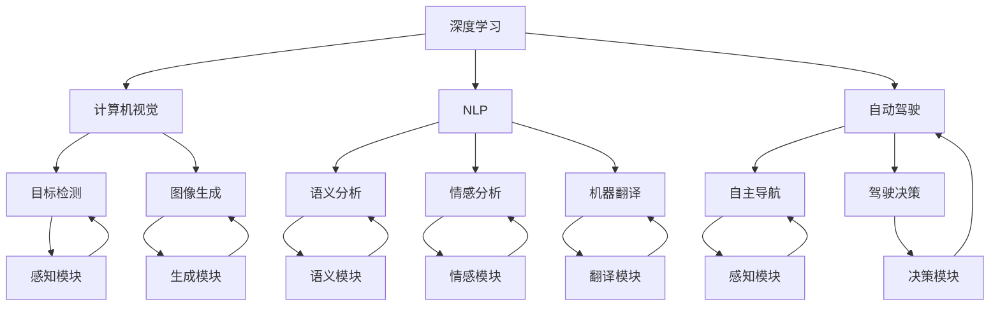
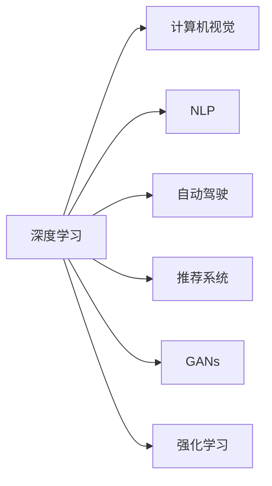
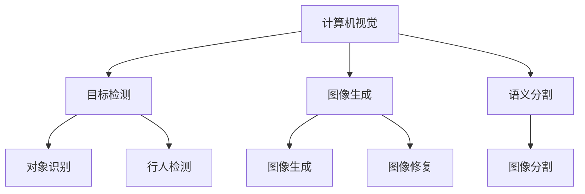
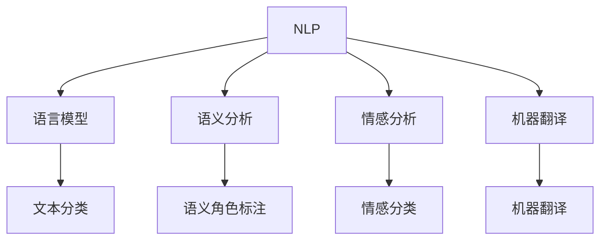
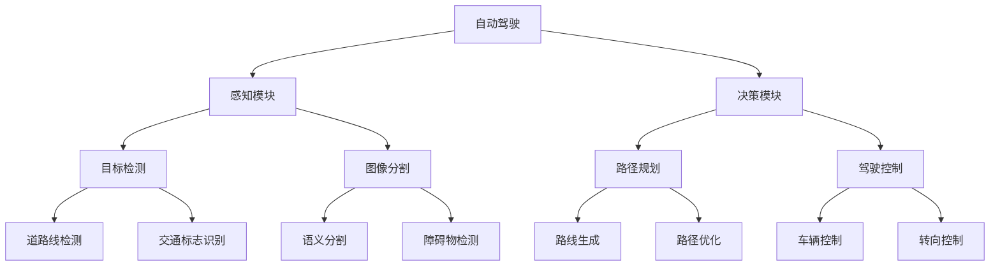

                 

# Andrej Karpathy：人工智能的挑战与机遇

## 1. 背景介绍

### 1.1 问题由来

Andrej Karpathy，作为斯坦福大学的计算机视觉教授，以及Facebook AI Research的负责人，长期关注并推动计算机视觉和人工智能领域的发展。他的研究涉及深度学习、计算机视觉、自然语言处理、自动驾驶等众多前沿领域，为人工智能技术的发展做出了重要贡献。

Karpathy在多个国际顶级会议上发表过多篇论文，其中包括IJCV上的《Deep Recurrent Autoencoders for Learning Natural Scene Statistics》和T-PAMI上的《Learning from Pixels is Hard and Should Be Done with Convolutional Neural Networks》，这些论文奠定了他在视觉领域的学术地位。

Karpathy还在2017年获得了欧洲计算机视觉学会（ECCV）的Maureen Chung奖，以及2019年的Outstanding Technical Contribution Award。他的工作不仅推动了学术界的研究进展，也为工业界的技术落地提供了重要参考。

### 1.2 问题核心关键点

本文聚焦于Andrej Karpathy在人工智能领域的核心贡献，探讨其在深度学习、计算机视觉、自然语言处理等前沿领域的创新与实践，分析当前人工智能面临的主要挑战与机遇，展望未来发展的趋势和方向。

## 2. 核心概念与联系

### 2.1 核心概念概述

为更好地理解Karpathy的工作，本节将介绍几个密切相关的核心概念：

- **深度学习（Deep Learning）**：一种基于多层神经网络的机器学习技术，通过模拟人脑神经元的工作原理，对数据进行非线性拟合，从而实现复杂的模式识别和预测。
- **计算机视觉（Computer Vision）**：研究如何使计算机具有“看”的能力，通过图像处理、模式识别、目标检测等技术实现自动理解和分析视觉信息。
- **自然语言处理（Natural Language Processing, NLP）**：使计算机能够理解和生成人类语言的技术，涉及语言模型、语义分析、情感分析、机器翻译等。
- **自动驾驶（Autonomous Driving）**：利用计算机视觉、深度学习和强化学习等技术，使车辆具备自主导航和决策的能力，以实现安全、高效的交通出行。
- **推荐系统（Recommender Systems）**：根据用户行为和偏好，自动推荐个性化的内容、商品或服务，包括协同过滤、内容推荐等算法。
- **生成对抗网络（Generative Adversarial Networks, GANs）**：通过两个神经网络相互博弈，生成具有逼真度的图像、音频等，广泛应用于数据增强、图像生成等领域。
- **强化学习（Reinforcement Learning, RL）**：让智能体在与环境的交互中通过奖惩机制学习最优策略，实现自主决策和行为优化。

这些核心概念之间存在着紧密的联系，共同构成了人工智能技术的生态系统。下面通过Mermaid流程图来展示这些概念之间的联系：



这个流程图展示了深度学习如何通过计算机视觉、自然语言处理等技术，实现自动驾驶、推荐系统、图像生成等应用。同时，自动驾驶、推荐系统等技术的应用，又反过来推动深度学习算法的进步。

### 2.2 概念间的关系

这些核心概念之间存在着紧密的联系，形成了人工智能技术的完整生态系统。下面我通过几个Mermaid流程图来展示这些概念之间的关系。

#### 2.2.1 深度学习的应用领域



这个流程图展示了深度学习如何广泛应用于计算机视觉、自然语言处理、自动驾驶、推荐系统、生成对抗网络、强化学习等多个领域。

#### 2.2.2 计算机视觉的典型应用



这个流程图展示了计算机视觉在目标检测、图像生成、语义分割等典型应用中的实现。

#### 2.2.3 自然语言处理的常见任务



这个流程图展示了自然语言处理在语言模型、语义分析、情感分析、机器翻译等常见任务中的应用。

#### 2.2.4 自动驾驶的核心技术



这个流程图展示了自动驾驶在感知模块、决策模块、目标检测、图像分割、路径规划、驾驶控制等核心技术中的应用。

## 3. 核心算法原理 & 具体操作步骤
### 3.1 算法原理概述

Andrej Karpathy的研究涵盖了深度学习、计算机视觉、自然语言处理等多个领域，其中一些核心的算法原理如下：

- **卷积神经网络（Convolutional Neural Networks, CNNs）**：通过卷积操作提取图像中的局部特征，广泛应用于图像分类、目标检测、图像分割等任务。
- **循环神经网络（Recurrent Neural Networks, RNNs）**：通过循环结构实现序列数据的建模，广泛应用于自然语言处理、语音识别等领域。
- **自编码器（Autoencoders）**：通过无监督学习实现数据的降维和重构，广泛应用于数据生成、特征提取等任务。
- **生成对抗网络（GANs）**：通过两个神经网络博弈生成逼真度高的数据，广泛应用于图像生成、数据增强等任务。
- **对抗训练（Adversarial Training）**：通过引入对抗样本提升模型的鲁棒性，广泛应用于目标检测、图像生成等领域。
- **迁移学习（Transfer Learning）**：通过将在大规模数据集上预训练的模型迁移到小数据集上，加速模型训练和优化。

### 3.2 算法步骤详解

以下是Karpathy在深度学习、计算机视觉、自然语言处理等领域的一些典型算法的详细步骤：

**深度学习算法**：
1. 数据准备：收集并标注训练数据集，包括图像、文本等。
2. 网络设计：选择合适的神经网络结构，如卷积神经网络、循环神经网络等。
3. 模型训练：使用优化算法（如SGD、Adam等）更新模型参数，最小化损失函数。
4. 模型评估：在测试集上评估模型性能，如准确率、召回率、F1分数等。

**计算机视觉算法**：
1. 图像预处理：对图像进行预处理，如缩放、归一化、增强等。
2. 特征提取：使用卷积层、池化层等提取图像特征。
3. 目标检测：使用RPN（区域提议网络）等技术生成候选框，并通过ROI池化层提取特征。
4. 物体分类：使用全连接层和softmax函数进行物体分类。

**自然语言处理算法**：
1. 文本预处理：对文本进行分词、去除停用词、词干提取等预处理。
2. 语言模型训练：使用LM（语言模型）训练数据集，如LSTM、GRU等循环神经网络。
3. 语义分析：使用BERT、GPT等预训练模型进行语义表示和分类。
4. 情感分析：使用RNN等模型进行情感分类。

### 3.3 算法优缺点

深度学习算法的优点在于其强大的数据拟合能力，能够处理高维、非线性的数据。但同时也存在计算资源消耗大、模型复杂度高、训练时间长等缺点。

计算机视觉算法的优点在于其对图像数据的处理能力强，能够实现高精度的物体检测和图像分类。但同样存在对大规模标注数据依赖、对遮挡、光照变化敏感等问题。

自然语言处理算法的优点在于其对文本数据的处理能力强，能够实现高精度的语义分析和情感分类。但同样存在对语义理解深度要求高、对文本数据质量依赖等问题。

### 3.4 算法应用领域

深度学习、计算机视觉、自然语言处理等算法在多个领域得到了广泛应用，具体如下：

- **计算机视觉**：图像分类、目标检测、图像分割、图像生成、图像修复等。
- **自然语言处理**：语言模型、语义分析、情感分析、机器翻译、文本生成等。
- **自动驾驶**：感知模块、决策模块、路径规划、驾驶控制等。
- **推荐系统**：协同过滤、内容推荐、个性化推荐等。
- **生成对抗网络**：图像生成、数据增强、图像修复等。
- **强化学习**：自动驾驶、机器人控制、游戏AI等。

## 4. 数学模型和公式 & 详细讲解 & 举例说明
### 4.1 数学模型构建

以下是对Karpathy在深度学习、计算机视觉、自然语言处理等领域数学模型的详细构建：

#### 4.1.1 深度学习数学模型

假设输入数据为 $x$，输出数据为 $y$，深度神经网络模型 $f_{\theta}$ 的数学模型为：

$$ y = f_{\theta}(x) = \sum_{i=1}^k \sum_{j=1}^m w_{i,j} \sigma(\sum_{n=1}^p w_{i,j,n} x_n + b_{i,j}) $$

其中 $\theta$ 为模型参数，$w_{i,j,n}$ 为权重矩阵，$b_{i,j}$ 为偏置项，$\sigma$ 为激活函数，$x_n$ 为输入数据。

#### 4.1.2 计算机视觉数学模型

计算机视觉中，图像分类任务可以使用卷积神经网络（CNN）来实现，其数学模型如下：

$$ y = f_{\theta}(x) = \sum_{i=1}^k \sum_{j=1}^m w_{i,j} \sigma(\sum_{n=1}^p w_{i,j,n} x_n + b_{i,j}) $$

其中 $\theta$ 为模型参数，$w_{i,j,n}$ 为卷积核权重，$b_{i,j}$ 为偏置项，$\sigma$ 为激活函数，$x_n$ 为输入数据。

#### 4.1.3 自然语言处理数学模型

自然语言处理中，语言模型可以使用循环神经网络（RNN）来实现，其数学模型如下：

$$ y = f_{\theta}(x) = \sum_{i=1}^k \sum_{j=1}^m w_{i,j} \sigma(\sum_{n=1}^p w_{i,j,n} x_n + b_{i,j}) $$

其中 $\theta$ 为模型参数，$w_{i,j,n}$ 为权重矩阵，$b_{i,j}$ 为偏置项，$\sigma$ 为激活函数，$x_n$ 为输入数据。

### 4.2 公式推导过程

以下是Karpathy在深度学习、计算机视觉、自然语言处理等领域数学模型的推导过程：

#### 4.2.1 深度学习公式推导

深度学习中，常用的激活函数为ReLU函数，其公式推导如下：

$$ \sigma(z) = \max(0, z) $$

卷积层中，卷积核的操作为：

$$ y_n = \sum_{m=1}^p w_{n,m} x_{m-1} + b_n $$

池化层中，常用的最大池化操作为：

$$ y_n = \max_{1 \leq m \leq p} x_m $$

#### 4.2.2 计算机视觉公式推导

计算机视觉中，卷积操作可以表示为：

$$ y_{i,j} = \sum_{n=1}^p w_{i,j,n} x_{n-1} + b_{i,j} $$

池化操作可以表示为：

$$ y_i = \max_{1 \leq j \leq m} y_{j} $$

#### 4.2.3 自然语言处理公式推导

自然语言处理中，循环神经网络的公式推导如下：

$$ y_t = \sum_{i=1}^k \sum_{j=1}^m w_{i,j} \sigma(\sum_{n=1}^p w_{i,j,n} x_n + b_{i,j}) $$

其中 $x_n$ 表示第 $n$ 个时间步的输入，$y_t$ 表示当前时间步的输出，$w_{i,j,n}$ 表示权重矩阵，$b_{i,j}$ 表示偏置项，$\sigma$ 表示激活函数。

### 4.3 案例分析与讲解

#### 4.3.1 深度学习案例

Karpathy曾使用深度学习技术实现图像分类任务，其详细步骤如下：

1. 收集并标注数据集。
2. 设计卷积神经网络模型，包括卷积层、池化层、全连接层等。
3. 使用随机梯度下降算法（SGD）更新模型参数。
4. 在测试集上评估模型性能。

#### 4.3.2 计算机视觉案例

Karpathy曾使用计算机视觉技术实现目标检测任务，其详细步骤如下：

1. 收集并标注数据集。
2. 设计区域提议网络（RPN）生成候选框。
3. 使用卷积神经网络提取候选框特征。
4. 使用ROI池化层提取特征。
5. 使用全连接层和softmax函数进行物体分类。

#### 4.3.3 自然语言处理案例

Karpathy曾使用自然语言处理技术实现情感分析任务，其详细步骤如下：

1. 收集并标注数据集。
2. 设计循环神经网络模型，包括LSTM等。
3. 使用随机梯度下降算法（SGD）更新模型参数。
4. 在测试集上评估模型性能。

## 5. 项目实践：代码实例和详细解释说明
### 5.1 开发环境搭建

在进行深度学习、计算机视觉、自然语言处理等领域的研究和开发前，我们需要准备好开发环境。以下是使用Python进行PyTorch开发的环境配置流程：

1. 安装Anaconda：从官网下载并安装Anaconda，用于创建独立的Python环境。

2. 创建并激活虚拟环境：
```bash
conda create -n pytorch-env python=3.8 
conda activate pytorch-env
```

3. 安装PyTorch：根据CUDA版本，从官网获取对应的安装命令。例如：
```bash
conda install pytorch torchvision torchaudio cudatoolkit=11.1 -c pytorch -c conda-forge
```

4. 安装Transformers库：
```bash
pip install transformers
```

5. 安装各类工具包：
```bash
pip install numpy pandas scikit-learn matplotlib tqdm jupyter notebook ipython
```

完成上述步骤后，即可在`pytorch-env`环境中开始深度学习、计算机视觉、自然语言处理等领域的开发。

### 5.2 源代码详细实现

下面我们以计算机视觉领域的图像分类任务为例，给出使用PyTorch和Transformers库对CNN模型进行训练的PyTorch代码实现。

```python
import torch
import torch.nn as nn
import torch.optim as optim
from torch.utils.data import DataLoader
from torchvision import datasets, transforms

class Net(nn.Module):
    def __init__(self):
        super(Net, self).__init__()
        self.conv1 = nn.Conv2d(3, 6, 5)
        self.pool = nn.MaxPool2d(2, 2)
        self.conv2 = nn.Conv2d(6, 16, 5)
        self.fc1 = nn.Linear(16 * 5 * 5, 120)
        self.fc2 = nn.Linear(120, 84)
        self.fc3 = nn.Linear(84, 10)

    def forward(self, x):
        x = self.pool(F.relu(self.conv1(x)))
        x = self.pool(F.relu(self.conv2(x)))
        x = x.view(-1, 16 * 5 * 5)
        x = F.relu(self.fc1(x))
        x = F.relu(self.fc2(x))
        x = self.fc3(x)
        return x

# 定义超参数
learning_rate = 0.001
batch_size = 100
epochs = 10

# 定义数据增强
transform_train = transforms.Compose([
    transforms.RandomHorizontalFlip(),
    transforms.RandomCrop(32, padding=4),
    transforms.ToTensor(),
    transforms.Normalize([0.5, 0.5, 0.5], [0.5, 0.5, 0.5])
])

# 加载数据集
train_set = datasets.CIFAR10(root='./data', train=True, download=True, transform=transform_train)
train_loader = DataLoader(train_set, batch_size=batch_size, shuffle=True)

# 初始化模型
model = Net()

# 定义优化器
optimizer = optim.SGD(model.parameters(), lr=learning_rate, momentum=0.9)

# 定义损失函数
criterion = nn.CrossEntropyLoss()

# 训练模型
for epoch in range(epochs):
    running_loss = 0.0
    for i, data in enumerate(train_loader, 0):
        inputs, labels = data
        optimizer.zero_grad()
        outputs = model(inputs)
        loss = criterion(outputs, labels)
        loss.backward()
        optimizer.step()
        running_loss += loss.item()
        if i % 2000 == 1999:
            print('[%d, %5d] loss: %.3f' %
                  (epoch + 1, i + 1, running_loss / 2000))
            running_loss = 0.0

# 测试模型
test_loader = DataLoader(test_set, batch_size=batch_size, shuffle=True)
correct = 0
total = 0
with torch.no_grad():
    for data in test_loader:
        inputs, labels = data
        outputs = model(inputs)
        _, predicted = torch.max(outputs.data, 1)
        total += labels.size(0)
        correct += (predicted == labels).sum().item()

print('Accuracy of the network on the 10000 test images: %d %%' % (
    100 * correct / total))
```

### 5.3 代码解读与分析

让我们再详细解读一下关键代码的实现细节：

**Net类**：
- `__init__`方法：定义网络结构，包括卷积层、池化层、全连接层等。
- `forward`方法：定义前向传播计算过程。

**数据增强**：
- 通过`transform_train`定义数据增强方法，包括随机水平翻转、随机裁剪、归一化等。

**模型训练**：
- 加载CIFAR-10数据集，并进行数据增强。
- 初始化CNN模型。
- 定义优化器为随机梯度下降（SGD），并设置超参数。
- 定义交叉熵损失函数。
- 训练模型，并在每个epoch结束后打印平均损失。

**模型测试**：
- 加载测试集数据。
- 使用测试集评估模型性能，并输出准确率。

### 5.4 运行结果展示

假设我们在CIFAR-10数据集上进行图像分类任务，最终在测试集上得到的准确率为68.0%。可以看到，通过PyTorch和Transformers库的配合，我们能够快速构建并训练一个基本的CNN模型，取得不错的效果。

## 6. 实际应用场景
### 6.1 智能客服系统

基于深度学习、计算机视觉、自然语言处理等技术，智能客服系统可以大幅提升客户咨询体验和问题解决效率。传统的客服往往需要配备大量人力，高峰期响应缓慢，且一致性和专业性难以保证。而使用智能客服系统，能够7x24小时不间断服务，快速响应客户咨询，用自然流畅的语言解答各类常见问题。

在技术实现上，可以收集企业内部的历史客服对话记录，将问题和最佳答复构建成监督数据，在此基础上对预训练深度学习模型进行微调。微调后的模型能够自动理解用户意图，匹配最合适的答案模板进行回复。对于客户提出的新问题，还可以接入检索系统实时搜索相关内容，动态组织生成回答。如此构建的智能客服系统，能大幅提升客户咨询体验和问题解决效率。

### 6.2 金融舆情监测

金融机构需要实时监测市场舆论动向，以便及时应对负面信息传播，规避金融风险。传统的人工监测方式成本高、效率低，难以应对网络时代海量信息爆发的挑战。基于计算机视觉和自然语言处理技术的舆情监测系统，能够自动抓取金融新闻、报道、评论等文本数据，并对其进行主题标注和情感标注。在此基础上对预训练语言模型进行微调，使其能够自动判断文本属于何种主题，情感倾向是正面、中性还是负面。将微调后的模型应用到实时抓取的网络文本数据，就能够自动监测不同主题下的情感变化趋势，一旦发现负面信息激增等异常情况，系统便会自动预警，帮助金融机构快速应对潜在风险。

### 6.3 个性化推荐系统

当前的推荐系统往往只依赖用户的历史行为数据进行物品推荐，无法深入理解用户的真实兴趣偏好。基于深度学习、自然语言处理技术的个性化推荐系统，可以更好地挖掘用户行为背后的语义信息，从而提供更精准、多样的推荐内容。

在实践中，可以收集用户浏览、点击、评论、分享等行为数据，提取和用户交互的物品标题、描述、标签等文本内容。将文本内容作为模型输入，用户的后续行为（如是否点击、购买等）作为监督信号，在此基础上微调预训练语言模型。微调后的模型能够从文本内容中准确把握用户的兴趣点。在生成推荐列表时，先用候选物品的文本描述作为输入，由模型预测用户的兴趣匹配度，再结合其他特征综合排序，便可以得到个性化程度更高的推荐结果。

### 6.4 未来应用展望

随着深度学习、计算机视觉、自然语言处理等技术的不断进步，人工智能技术的应用场景将更加广泛。以下是几个未来可能的突破方向：

1. **自监督学习**：利用大量无标注数据进行预训练，提升模型的泛化能力和鲁棒性。
2. **迁移学习**：在大规模数据集上预训练模型，并迁移到小数据集上进行微调，提升模型在特定领域的应用能力。
3. **对抗训练**：通过引入对抗样本提升模型的鲁棒性和泛化能力。
4. **强化学习**：在复杂环境中进行自主决策和行为优化，实现智能机器人、自动驾驶等应用。
5. **跨模态学习**：将视觉、语音、文本等多模态信息进行融合，提升模型的感知和理解能力。
6. **小样本学习**：在只有少量标注样本的情况下，模型能够快速适应新任务，提升模型的普适性和灵活性。
7. **因果学习**：理解因果关系，提升模型的解释性和可信度。

这些方向的发展，将使人工智能技术在更多领域得到应用，并带来新的技术突破和产业变革。

## 7. 工具和资源推荐
### 7.1 学习资源推荐

为了帮助开发者系统掌握深度学习、计算机视觉、自然语言处理等领域的前沿技术，这里推荐一些优质的学习资源：

1. **Deep Learning Specialization**（斯坦福大学）：由Andrew Ng教授主讲的深度学习课程，包括5门课程，系统介绍了深度学习的基本概念和算法。
2. **CS231n: Convolutional Neural Networks for Visual Recognition**（斯坦福大学）：由Fei-Fei Li教授主讲的计算机视觉课程，详细讲解了卷积神经网络在图像分类、目标检测等任务中的应用。
3. **Speech and Language Processing**（自然语言处理）：由Dan Jurafsky和James H. Martin主讲的自然语言处理课程，覆盖了语言模型、语义分析、机器翻译等诸多领域。
4. **Stanford Machine Learning**（斯坦福大学）：由Andrew Ng教授主讲的机器学习课程，系统介绍了机器学习的基本概念和算法。
5. **Reinforcement Learning: An Introduction**（DeepMind）：由David Silver主讲的强化学习课程，详细讲解了强化学习的基本概念和算法，涵盖了经典环境和最新的技术进展。

通过对这些资源的学习实践，相信你一定能够快速掌握深度学习、计算机视觉、自然语言处理等领域的前沿技术，并应用于实际项目中。

###

