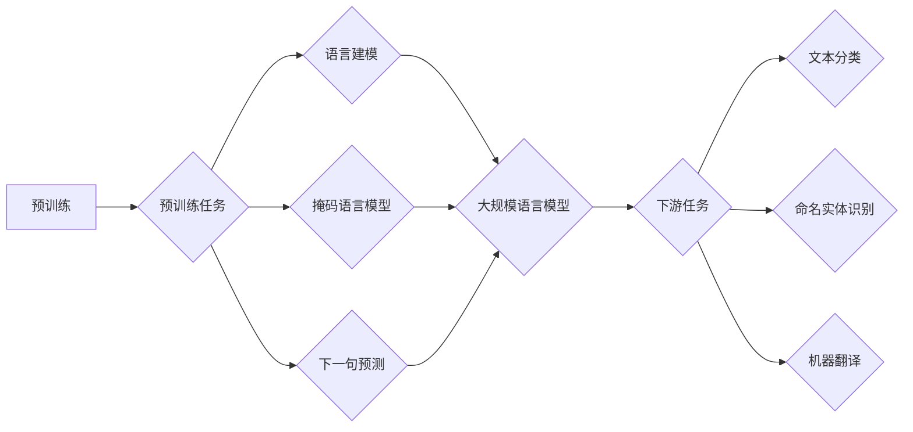

# 大规模语言模型从理论到实践 大语言模型的基本概念

> 关键词：大规模语言模型，Transformer，预训练，自然语言处理，NLP，预训练任务，下游任务，微调

## 1. 背景介绍

随着深度学习技术的飞速发展，自然语言处理（Natural Language Processing，NLP）领域取得了突破性的进展。其中，大规模语言模型（Large Language Model，LLM）的出现，为NLP任务的解决提供了新的思路和方法。本文将从理论到实践，深入探讨大规模语言模型的基本概念，并分析其原理、应用和未来发展趋势。

## 2. 核心概念与联系

### 2.1 核心概念

#### 2.1.1 自然语言处理（NLP）

自然语言处理是指让计算机理解和处理人类语言的技术。它包括语言理解、语言生成、语言翻译等多个方面。

#### 2.1.2 预训练

预训练是指在大规模无标注数据上对模型进行训练，使其学习到通用的语言表示和知识。

#### 2.1.3 大规模语言模型（LLM）

大规模语言模型是指在大规模无标注数据上预训练得到的，具有强大语言理解和生成能力的模型。

#### 2.1.4 预训练任务

预训练任务是指在大规模无标注数据上对模型进行训练的具体任务，如语言建模、掩码语言模型、下一句预测等。

#### 2.1.5 下游任务

下游任务是指将预训练模型应用于具体任务，如文本分类、命名实体识别、机器翻译等。

#### 2.1.6 微调

微调是指在预训练模型的基础上，使用下游任务的少量标注数据，对模型进行进一步训练的过程。

### 2.2 Mermaid 流程图



### 2.3 核心概念之间的联系

大规模语言模型是通过预训练得到的，其目标是学习到通用的语言表示和知识。预训练任务和下游任务则是连接预训练模型和应用的具体桥梁。微调过程则是在预训练模型的基础上，针对具体任务进行进一步训练，以提升模型在下游任务上的性能。

## 3. 核心算法原理 & 具体操作步骤

### 3.1 算法原理概述

大规模语言模型的算法原理主要包括以下几个方面：

- **自回归模型**：通过预测下一个词来学习语言的序列结构。
- **自编码模型**：通过学习输入和输出之间的映射关系来学习语言的表示。
- **注意力机制**：通过注意力机制来捕捉输入序列中不同部分之间的关系。
- **Transformer架构**：Transformer架构是基于注意力机制的一种模型架构，具有并行计算的优势。

### 3.2 算法步骤详解

#### 3.2.1 预训练

1. 收集大规模无标注数据。
2. 选择合适的预训练任务和模型架构。
3. 在无标注数据上进行预训练，学习通用的语言表示和知识。

#### 3.2.2 微调

1. 收集下游任务的少量标注数据。
2. 在预训练模型的基础上，添加任务适配层。
3. 使用下游任务的标注数据，对模型进行微调。

### 3.3 算法优缺点

#### 3.3.1 优点

- **强大的语言理解能力**：能够理解和生成自然语言，适用于各种NLP任务。
- **参数高效**：能够在大规模无标注数据上进行预训练，只需少量标注数据即可进行微调。
- **效果好**：在多种NLP任务上取得了优异的性能。

#### 3.3.2 缺点

- **数据依赖**：需要大量的无标注数据和标注数据。
- **计算资源消耗大**：需要大量的计算资源进行预训练和微调。
- **可解释性差**：模型的决策过程难以解释。

### 3.4 算法应用领域

大规模语言模型在以下领域得到了广泛的应用：

- **文本分类**：如情感分析、主题分类、垃圾邮件过滤等。
- **命名实体识别**：如人名识别、地名识别、机构名识别等。
- **机器翻译**：将一种语言翻译成另一种语言。
- **文本生成**：如自动摘要、对话系统等。
- **问答系统**：能够理解和回答用户的问题。

## 4. 数学模型和公式 & 详细讲解 & 举例说明

### 4.1 数学模型构建

大规模语言模型的数学模型主要包括以下几个方面：

- **自回归模型**：假设序列 $x_1, x_2, \ldots, x_n$，则下一词 $x_{n+1}$ 的概率分布为：

  $$
  P(x_{n+1} | x_1, x_2, \ldots, x_n) = \prod_{i=1}^n P(x_i | x_1, x_2, \ldots, x_{i-1})
  $$

- **自编码模型**：假设输入序列为 $x_1, x_2, \ldots, x_n$，输出序列为 $y_1, y_2, \ldots, y_n$，则：

  $$
  y_i = \text{Encoder}(x_1, x_2, \ldots, x_i) \text{Decoder}(x_1, x_2, \ldots, x_i)
  $$

### 4.2 公式推导过程

#### 4.2.1 自回归模型

自回归模型的概率分布可以通过链式法则推导得到：

$$
P(x_{n+1} | x_1, x_2, \ldots, x_n) = \frac{P(x_{n+1} | x_1, x_2, \ldots, x_n, x_{n+1})}{P(x_1, x_2, \ldots, x_n, x_{n+1})}
$$

由于 $P(x_1, x_2, \ldots, x_n, x_{n+1})$ 是常数，因此可以忽略，从而得到：

$$
P(x_{n+1} | x_1, x_2, \ldots, x_n) = \frac{P(x_{n+1} | x_1, x_2, \ldots, x_n, x_{n+1})}{P(x_{n+1} | x_1, x_2, \ldots, x_{n-1})}
$$

重复上述过程，最终得到：

$$
P(x_{n+1} | x_1, x_2, \ldots, x_n) = \prod_{i=1}^n P(x_i | x_1, x_2, \ldots, x_{i-1})
$$

#### 4.2.2 自编码模型

自编码模型的公式推导相对简单，主要涉及编码器和解码器的计算过程。

### 4.3 案例分析与讲解

以下以BERT（Bidirectional Encoder Representations from Transformers）模型为例，分析其数学模型。

BERT模型是一种基于Transformer架构的预训练语言模型。其数学模型主要包括以下几个方面：

- **Transformer编码器**：将输入序列编码为一系列的隐状态，每个隐状态表示输入序列中对应位置的特征。
- **Transformer解码器**：将隐状态解码为输出序列，每个输出表示预测的词。

BERT模型的输入序列为 $x_1, x_2, \ldots, x_n$，其中 $[CLS]$ 表示输入序列的开始，$[SEP]$ 表示输入序列的结束。Transformer编码器和解码器分别通过多头自注意力机制和前馈神经网络进行计算。

具体计算过程如下：

1. **编码器**：
   - 输入序列 $[CLS], x_1, x_2, \ldots, x_n, [SEP]$ 转换为词嵌入向量。
   - 对每个词嵌入向量进行多头自注意力机制计算，得到一系列的隐状态。
   - 对隐状态进行前馈神经网络计算，得到编码器的输出。

2. **解码器**：
   - 输入序列 $[CLS], x_1, x_2, \ldots, x_n, [SEP]$ 转换为词嵌入向量。
   - 对每个词嵌入向量进行多头自注意力机制计算，得到一系列的隐状态。
   - 对隐状态进行编码器-解码器注意力机制计算，得到解码器的输出。
   - 对解码器的输出进行前馈神经网络计算，得到解码器的最终输出。

BERT模型通过在预训练语料上训练，学习到通用的语言表示和知识。在下游任务上进行微调时，只需对解码器进行少量调整即可。

## 5. 项目实践：代码实例和详细解释说明

### 5.1 开发环境搭建

为了进行大规模语言模型的实践，需要搭建以下开发环境：

1. Python 3.6及以上版本
2. PyTorch 1.4及以上版本
3. Transformers库

### 5.2 源代码详细实现

以下是一个简单的BERT模型微调代码示例：

```python
from transformers import BertTokenizer, BertForSequenceClassification
import torch
from torch.utils.data import DataLoader, Dataset

# 加载预训练的BERT模型和分词器
tokenizer = BertTokenizer.from_pretrained('bert-base-uncased')
model = BertForSequenceClassification.from_pretrained('bert-base-uncased')

# 定义数据集
class TextDataset(Dataset):
    def __init__(self, texts, labels):
        self.texts = texts
        self.labels = labels

    def __len__(self):
        return len(self.texts)

    def __getitem__(self, item):
        return self.texts[item], self.labels[item]

# 加载数据
texts = ["This is a sample text.", "Another sample text."]
labels = [1, 0]

# 创建数据集和数据加载器
dataset = TextDataset(texts, labels)
dataloader = DataLoader(dataset, batch_size=2, shuffle=True)

# 训练模型
model.train()
for epoch in range(1):
    for data in dataloader:
        input_ids, labels = data
        outputs = model(input_ids, labels=labels)
        loss = outputs.loss
        loss.backward()
        optimizer.step()
        optimizer.zero_grad()
```

### 5.3 代码解读与分析

以上代码展示了如何使用Transformers库加载预训练的BERT模型，并对其在文本分类任务上进行微调。具体步骤如下：

1. 加载预训练的BERT模型和分词器。
2. 定义数据集和数据加载器。
3. 创建数据集和数据加载器。
4. 训练模型。

### 5.4 运行结果展示

运行以上代码，可以得到模型在文本分类任务上的损失值。这表明模型已经开始了训练过程。

## 6. 实际应用场景

大规模语言模型在以下领域得到了广泛的应用：

### 6.1 文本分类

文本分类是将文本数据分为不同的类别。例如，可以将新闻文本分为政治、经济、娱乐等类别。

### 6.2 命名实体识别

命名实体识别是从文本中识别出人名、地名、机构名等实体。例如，可以识别出新闻中的关键人物、地点和组织。

### 6.3 机器翻译

机器翻译是将一种语言翻译成另一种语言。

### 6.4 文本生成

文本生成是生成新的文本内容。例如，可以生成新闻报道、对话内容等。

### 6.5 问答系统

问答系统可以从大量文本中回答用户的问题。

## 7. 工具和资源推荐

### 7.1 学习资源推荐

1. 《Deep Learning for Natural Language Processing》
2. 《Natural Language Processing with Python》
3. 《Transformers》

### 7.2 开发工具推荐

1. PyTorch
2. TensorFlow
3. Transformers库

### 7.3 相关论文推荐

1. "Attention is All You Need"
2. "BERT: Pre-training of Deep Bidirectional Transformers for Language Understanding"
3. "Generative Language Models: A Survey"

## 8. 总结：未来发展趋势与挑战

### 8.1 研究成果总结

大规模语言模型在NLP领域取得了突破性的进展，为各种NLP任务的解决提供了新的思路和方法。

### 8.2 未来发展趋势

1. 模型规模将继续增大。
2. 微调方法将更加多样化。
3. 模型的可解释性将得到提高。
4. 模型将与其他人工智能技术进行融合。

### 8.3 面临的挑战

1. 计算资源消耗大。
2. 可解释性差。
3. 隐私和数据安全。

### 8.4 研究展望

大规模语言模型将在NLP领域发挥越来越重要的作用，为构建人机协同的智能时代做出贡献。

## 9. 附录：常见问题与解答

### 9.1 常见问题

1. 什么是大规模语言模型？
2. 大规模语言模型有哪些应用？
3. 如何训练大规模语言模型？

### 9.2 解答

1. 大规模语言模型是指在大规模无标注数据上预训练得到的，具有强大语言理解和生成能力的模型。
2. 大规模语言模型在NLP领域得到了广泛的应用，如文本分类、命名实体识别、机器翻译等。
3. 训练大规模语言模型需要大量的计算资源和标注数据。

作者：禅与计算机程序设计艺术 / Zen and the Art of Computer Programming