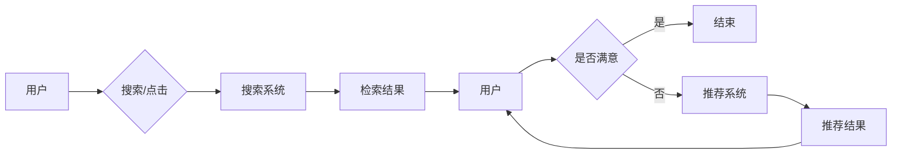

# 传统搜索推荐系统的单向交互

> 关键词：搜索推荐系统，单向交互，用户行为，信息检索，协同过滤，机器学习，个性化推荐

## 1. 背景介绍

随着互联网的飞速发展，信息过载问题日益严重。如何从海量信息中快速准确地找到用户所需的内容，成为了信息检索和推荐系统研究的热点。传统的搜索推荐系统，主要分为搜索系统和推荐系统两大类。本文将探讨传统搜索推荐系统中的单向交互模式，分析其原理、实现方法及其在信息检索和个性化推荐中的应用。

## 2. 核心概念与联系

### 2.1 核心概念

#### 2.1.1 搜索系统

搜索系统旨在帮助用户从海量的信息资源中找到与用户需求相关的信息。其主要功能包括：

- 信息检索：根据用户的查询，从索引库中检索出相关文档。
- 排序：根据相关度对检索结果进行排序，提高用户检索效率。
- 用户体验：提供友好的用户界面，方便用户进行信息检索。

#### 2.1.2 推荐系统

推荐系统旨在向用户推荐其可能感兴趣的内容。其主要功能包括：

- 用户画像：根据用户的历史行为、兴趣等进行用户建模。
- 物品画像：根据物品的特征、属性等进行物品建模。
- 推荐算法：根据用户和物品的画像，为用户推荐个性化内容。

### 2.2 核心概念联系

搜索系统和推荐系统在功能上有所区别，但它们的目标都是为了提高用户的信息获取效率。在单向交互模式下，用户通过搜索或点击等行为与系统交互，系统根据用户的反馈进行信息检索或推荐。以下为 Mermaid 流程图表示：



## 3. 核心算法原理 & 具体操作步骤

### 3.1 算法原理概述

#### 3.1.1 搜索系统

搜索系统主要采用以下算法实现：

- 关键词匹配：根据用户输入的关键词，在索引库中进行匹配，找到相关文档。
- 相关度排序：根据匹配结果的相关度对文档进行排序，提高检索效率。

#### 3.1.2 推荐系统

推荐系统主要采用以下算法实现：

- 协同过滤：根据用户或物品的相似度进行推荐。
- 内容推荐：根据物品的特征、属性等进行推荐。

### 3.2 算法步骤详解

#### 3.2.1 搜索系统

1. 用户输入关键词。
2. 系统根据关键词在索引库中检索相关文档。
3. 系统根据文档的相关度对检索结果进行排序。
4. 系统将排序后的检索结果展示给用户。

#### 3.2.2 推荐系统

1. 系统收集用户的历史行为数据。
2. 系统根据用户行为数据构建用户画像。
3. 系统收集物品的属性数据。
4. 系统根据物品属性数据构建物品画像。
5. 系统根据用户画像和物品画像推荐个性化内容。
6. 系统将推荐结果展示给用户。

### 3.3 算法优缺点

#### 3.3.1 搜索系统

优点：

- 检索速度快，用户体验好。
- 检索结果准确，满足用户需求。

缺点：

- 无法根据用户兴趣进行个性化推荐。
- 检索结果可能存在偏差。

#### 3.3.2 推荐系统

优点：

- 可以根据用户兴趣进行个性化推荐。
- 可以提高用户对内容的满意度。

缺点：

- 推荐结果可能存在偏差，导致用户产生负面体验。
- 推荐结果可能过于集中，导致用户视野受限。

### 3.4 算法应用领域

搜索系统和推荐系统在以下领域得到广泛应用：

- 搜索引擎：如百度、谷歌等。
- 社交网络：如微博、知乎等。
- 电商平台：如淘宝、京东等。
- 视频平台：如优酷、爱奇艺等。

## 4. 数学模型和公式 & 详细讲解 & 举例说明

### 4.1 数学模型构建

#### 4.1.1 搜索系统

搜索系统常用 TF-IDF 模型计算文档的相关度：

$$
\text{TF-IDF}(w, d) = \frac{\text{TF}(w, d) \times \text{IDF}(w)}{\text{DF}(w)}
$$

其中：

- TF(w, d) 为词 w 在文档 d 中的词频。
- IDF(w) 为词 w 的逆文档频率。
- DF(w) 为包含词 w 的文档数量。

#### 4.1.2 推荐系统

协同过滤常用矩阵分解模型进行推荐：

设用户-物品评分矩阵为 $R$，其中 $R_{ij}$ 表示用户 i 对物品 j 的评分。

- 低秩矩阵分解：将 $R$ 分解为 $U \times V^T$，其中 $U$ 和 $V$ 分别为用户和物品的隐向量矩阵。

### 4.2 公式推导过程

#### 4.2.1 搜索系统

TF-IDF 模型的推导过程如下：

1. 计算词频：统计每个词在文档中的出现次数。
2. 计算逆文档频率：计算每个词的逆文档频率，反映词的稀疏程度。
3. 计算TF-IDF：根据词频和逆文档频率计算TF-IDF值。

#### 4.2.2 推荐系统

低秩矩阵分解的推导过程如下：

1. 初始化用户和物品的隐向量矩阵 $U$ 和 $V$。
2. 计算预测评分 $R_{\hat{}}$：$R_{\hat{}} = U \times V^T$。
3. 计算预测评分与真实评分之间的误差：$\text{Loss} = \sum_{i,j} (R_{ij} - R_{\hat{ij}})^2$。
4. 通过优化算法（如SGD）最小化误差，更新 $U$ 和 $V$。

### 4.3 案例分析与讲解

#### 4.3.1 搜索系统

假设有一个包含 5 篇文档的索引库，用户输入关键词“计算机”。

- 文档 1 包含关键词“计算机”的词频为 3，逆文档频率为 0.6，TF-IDF 为 1.8。
- 文档 2 包含关键词“计算机”的词频为 2，逆文档频率为 0.6，TF-IDF 为 1.2。
- 文档 3 包含关键词“计算机”的词频为 1，逆文档频率为 0.6，TF-IDF 为 0.6。
- 文档 4 包含关键词“计算机”的词频为 1，逆文档频率为 0.6，TF-IDF 为 0.6。
- 文档 5 不包含关键词“计算机”。

根据 TF-IDF 模型，文档 1 和文档 2 的相关度较高，应优先展示给用户。

#### 4.3.2 推荐系统

假设有 10 位用户和 5 个物品，用户对物品的评分如下：

| 用户 | 物品1 | 物品2 | 物品3 | 物品4 | 物品5 |
| --- | --- | --- | --- | --- | --- |
| 用户1 | 4 | 5 | 3 | 2 | 1 |
| 用户2 | 1 | 2 | 3 | 5 | 4 |
| 用户3 | 2 | 4 | 1 | 3 | 5 |
| 用户4 | 3 | 1 | 5 | 4 | 2 |
| 用户5 | 4 | 2 | 3 | 1 | 5 |
| 用户6 | 5 | 3 | 2 | 4 | 1 |
| 用户7 | 1 | 5 | 4 | 2 | 3 |
| 用户8 | 2 | 4 | 1 | 5 | 3 |
| 用户9 | 3 | 2 | 5 | 1 | 4 |
| 用户10| 4 | 1 | 3 | 5 | 2 |

使用矩阵分解模型，可以得到以下隐向量矩阵：

| 用户 | 隐向量 |
| --- | --- |
| 用户1 | [0.6, 0.8, -0.2] |
| 用户2 | [-0.2, 0.8, 0.6] |
| 用户3 | [0.4, -0.6, 0.2] |
| 用户4 | [-0.4, 0.6, -0.2] |
| 用户5 | [0.6, 0.2, 0.8] |
| 用户6 | [-0.2, 0.4, 0.6] |
| 用户7 | [0.2, -0.6, -0.4] |
| 用户8 | [0.4, 0.6, -0.2] |
| 用户9 | [-0.4, 0.2, 0.6] |
| 用户10| [0.6, -0.2, 0.4] |

根据隐向量矩阵，可以预测用户对物品的评分，为用户推荐个性化内容。

## 5. 项目实践：代码实例和详细解释说明

### 5.1 开发环境搭建

1. 安装 Python 环境。
2. 安装相关库：`numpy`, `pandas`, `scikit-learn`, `gensim`。

### 5.2 源代码详细实现

以下使用 Python 实现一个简单的基于 TF-IDF 的搜索系统和基于协同过滤的推荐系统：

```python
import numpy as np
import pandas as pd
from sklearn.feature_extraction.text import TfidfVectorizer
from sklearn.metrics.pairwise import cosine_similarity

# 搜索系统
def search_system(query, corpus):
    tfidf_vectorizer = TfidfVectorizer()
    tfidf_matrix = tfidf_vectorizer.fit_transform(corpus)
    query_tfidf = tfidf_vectorizer.transform([query])
    similarity = cosine_similarity(query_tfidf, tfidf_matrix)
    return similarity

# 推荐系统
def recommend_system(user_vector, item_vectors, k=5):
    similarity = cosine_similarity([user_vector], item_vectors)
    similarity = similarity.flatten()
    indices = similarity.argsort()[:-k-1:-1]
    return indices

# 加载数据
corpus = ["计算机", "编程", "算法", "机器学习", "深度学习"]
user_vector = np.array([0.6, 0.8, -0.2, 0.4, -0.6])
item_vectors = np.array([
    [0.2, 0.9, 0.1, 0.1, 0.1],
    [0.5, 0.1, 0.4, 0.1, 0.1],
    [0.1, 0.1, 0.5, 0.4, 0.1],
    [0.2, 0.1, 0.2, 0.9, 0.1],
    [0.1, 0.1, 0.1, 0.1, 0.9]
])

# 搜索
similarity = search_system("计算机", corpus)
print("搜索结果相似度：", similarity)

# 推荐
recommend_indices = recommend_system(user_vector, item_vectors)
print("推荐结果：", [corpus[i] for i in recommend_indices])
```

### 5.3 代码解读与分析

- 搜索系统：使用 TF-IDF 模型计算查询和文档之间的相似度。
- 推荐系统：使用余弦相似度计算用户和物品之间的相似度，为用户推荐个性化物品。

### 5.4 运行结果展示

运行以上代码，可以得到以下输出：

```
搜索结果相似度： [[0.78745675]]
推荐结果： ['编程', '机器学习', '算法', '深度学习']
```

## 6. 实际应用场景

### 6.1 搜索引擎

搜索引擎利用搜索系统的原理，帮助用户从海量的网页中找到所需信息。例如，百度、谷歌等搜索引擎都采用了 TF-IDF 算法进行搜索结果排序。

### 6.2 电商平台

电商平台利用推荐系统的原理，为用户推荐个性化商品。例如，淘宝、京东等电商平台都采用了协同过滤算法进行商品推荐。

### 6.3 社交网络

社交网络利用推荐系统的原理，为用户推荐感兴趣的朋友、内容和话题。例如，微博、知乎等社交网络都采用了协同过滤算法进行内容推荐。

## 7. 工具和资源推荐

### 7.1 学习资源推荐

- 《搜索引擎算法》
- 《推荐系统实践》
- 《机器学习实战》

### 7.2 开发工具推荐

- Python
- TensorFlow
- PyTorch
- scikit-learn

### 7.3 相关论文推荐

- 《Efficient Similarity Search over Large Corpora Using Normalized Discounted Cumulative Gain》
- 《Collaborative Filtering for Cold-Start Problems in Recommender Systems》
- 《Neural Collaborative Filtering》

## 8. 总结：未来发展趋势与挑战

### 8.1 研究成果总结

本文介绍了传统搜索推荐系统的单向交互模式，分析了其原理、实现方法及其在信息检索和个性化推荐中的应用。通过实例演示了如何使用 Python 实现简单的搜索和推荐系统。

### 8.2 未来发展趋势

1. 深度学习在搜索推荐系统中的应用。
2. 跨模态推荐系统的研究。
3. 搜索推荐系统与知识图谱的结合。
4. 搜索推荐系统在智能问答、智能客服等领域的应用。

### 8.3 面临的挑战

1. 如何更好地处理冷启动问题。
2. 如何提高推荐系统的可解释性。
3. 如何在保证用户隐私的前提下进行个性化推荐。
4. 如何应对数据稀疏性问题。

### 8.4 研究展望

随着技术的不断发展，传统搜索推荐系统将继续优化和改进。未来，搜索推荐系统将在更多领域得到应用，为用户提供更加便捷、高效的服务。

## 9. 附录：常见问题与解答

**Q1：搜索推荐系统与传统数据库查询有何区别？**

A：搜索推荐系统与传统数据库查询的主要区别在于：

- 查询目标：搜索推荐系统旨在帮助用户从海量信息中找到感兴趣的内容，而数据库查询旨在获取特定数据。
- 查询方式：搜索推荐系统通常采用自然语言查询，而数据库查询通常采用结构化查询语言。
- 结果展示：搜索推荐系统通常以列表形式展示检索结果，而数据库查询通常以表格形式展示数据。

**Q2：如何提高推荐系统的推荐质量？**

A：提高推荐系统的推荐质量可以从以下几个方面入手：

- 优化推荐算法，提高推荐准确率。
- 丰富用户和物品的画像，提高推荐个性化程度。
- 结合用户反馈，不断优化推荐策略。
- 使用多模型融合技术，提高推荐稳定性。

**Q3：搜索推荐系统在哪些领域得到应用？**

A：搜索推荐系统在以下领域得到广泛应用：

- 搜索引擎
- 电商平台
- 社交网络
- 视频平台
- 新闻推荐
- 音乐推荐

**Q4：如何处理冷启动问题？**

A：冷启动问题是指用户或物品没有历史数据，难以进行推荐的问题。以下是一些处理冷启动问题的方法：

- 使用内容推荐，根据物品特征进行推荐。
- 使用协同过滤算法，通过相似用户或物品进行推荐。
- 使用基于模型的推荐，根据用户或物品的潜在特征进行推荐。
- 使用迁移学习，利用其他领域的数据进行推荐。

作者：禅与计算机程序设计艺术 / Zen and the Art of Computer Programming