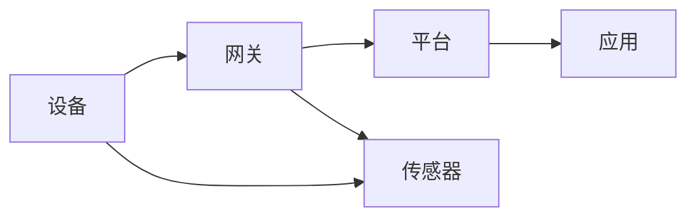

# 基于Java的智能家居设计：开发跨平台智能家居应用的技术要点

> 关键词：智能家居，Java，跨平台，物联网，微服务，设计模式，安全架构

## 1. 背景介绍

随着物联网（IoT）技术的迅猛发展，智能家居市场日益繁荣。智能家居系统通过将家庭设备联网，实现远程控制、自动化和智能化管理，极大地提升了居住舒适度和便利性。Java作为一门成熟、稳定的编程语言，因其跨平台性和强大的生态系统，成为智能家居应用开发的首选语言。本文将探讨基于Java的智能家居设计，分析其技术要点，并展望未来发展。

### 1.1 问题的由来

智能家居市场的快速发展，催生了大量智能家居产品和服务。然而，市场上智能家居产品的兼容性、安全性、易用性等方面存在诸多问题，导致用户体验不佳。因此，如何设计一个安全、稳定、易用的智能家居系统，成为智能家居行业亟待解决的问题。

### 1.2 研究现状

目前，基于Java的智能家居设计主要面临以下挑战：

- **跨平台性**：智能家居设备种类繁多，如何实现跨平台开发和统一管理是关键问题。
- **安全性**：智能家居系统涉及用户隐私和数据安全，需要确保系统安全可靠。
- **易用性**：智能家居系统需要简洁易用，提供良好的用户体验。
- **可扩展性**：随着智能家居设备的不断增加，系统需要具备良好的可扩展性。

### 1.3 研究意义

研究基于Java的智能家居设计，具有重要的理论意义和实际应用价值：

- **理论意义**：丰富和拓展Java在物联网领域的应用，推动智能家居技术的理论发展。
- **实际应用价值**：指导智能家居产品开发，提升用户体验，推动智能家居产业的健康发展。

### 1.4 本文结构

本文将按照以下结构展开：

- 第2章介绍智能家居的核心概念与相关技术。
- 第3章分析基于Java的智能家居设计架构。
- 第4章探讨智能家居系统的安全性设计。
- 第5章介绍智能家居系统的开发实践。
- 第6章展望智能家居技术的未来发展趋势。
- 第7章总结全文，并展望智能家居技术的发展方向。

## 2. 核心概念与联系

### 2.1 核心概念

智能家居系统通常包含以下核心概念：

- **设备**：包括各种智能家居设备，如智能灯泡、智能插座、智能门锁等。
- **网关**：负责连接各种智能家居设备，实现数据采集和传输。
- **平台**：提供设备管理、数据存储、分析、可视化的功能。
- **应用**：为用户提供交互界面，实现设备控制和场景设置。

### 2.2 核心概念联系

智能家居系统的核心概念之间存在着紧密的联系，如下所示：



设备通过网关与平台连接，平台负责数据存储、分析和可视化，应用为用户提供交互界面。

## 3. 核心算法原理 & 具体操作步骤

### 3.1 算法原理概述

智能家居系统设计涉及多种算法，主要包括：

- **通信协议**：实现设备之间的数据传输。
- **数据加密**：保证数据传输的安全性。
- **状态机**：描述设备状态变化和事件处理。
- **事件驱动**：响应设备状态变化，触发相应操作。

### 3.2 算法步骤详解

以下以设备状态机为例，介绍智能家居系统的算法实现步骤：

1. **定义设备状态**：根据设备功能，定义设备的各种状态，如“开启”、“关闭”、“待机”等。
2. **定义状态转换条件**：根据设备输入和外部事件，定义状态转换条件，如“按下开关”使设备从“关闭”状态转换为“开启”状态。
3. **实现状态转换逻辑**：根据状态转换条件，实现状态转换逻辑，如修改设备状态变量、触发事件处理函数等。
4. **实现事件处理函数**：根据设备状态变化，实现相应的事件处理函数，如“开启”状态下的灯光控制、温度调节等。

### 3.3 算法优缺点

- **通信协议**：优点是支持多种设备之间的互联互通，缺点是协议复杂，实现难度大。
- **数据加密**：优点是保证数据传输的安全性，缺点是加密算法复杂，计算开销大。
- **状态机**：优点是描述设备状态变化清晰，实现简单，缺点是难以处理复杂的状态转换。
- **事件驱动**：优点是响应速度快，缺点是实现难度大，需要考虑事件优先级和冲突处理。

### 3.4 算法应用领域

智能家居系统中的算法应用领域包括：

- **设备控制**：实现设备的远程控制和自动化。
- **数据采集**：采集设备运行状态和传感器数据。
- **数据分析**：分析设备运行数据，实现智能决策。
- **可视化**：将设备状态和运行数据可视化，方便用户监控。

## 4. 数学模型和公式 & 详细讲解 & 举例说明

智能家居系统中的数学模型主要包括：

- **状态转移概率**：描述设备状态之间转换的概率。
- **马尔可夫决策过程**：描述设备在不确定环境下进行决策的过程。

### 4.1 数学模型构建

状态转移概率可以用以下公式表示：

$$
P(S_{t+1} = s_{t+1} | S_t = s_t) = P(S_{t+1} = s_{t+1})
$$

其中，$S_t$ 表示当前状态，$s_{t+1}$ 表示下一状态，$P(S_{t+1} = s_{t+1} | S_t = s_t)$ 表示从当前状态 $S_t$ 转移到下一状态 $s_{t+1}$ 的概率。

### 4.2 公式推导过程

马尔可夫决策过程的公式推导如下：

假设设备在时刻 $t$ 的状态为 $S_t$，决策为 $A_t$，则下一时刻的状态为 $S_{t+1}$。根据马尔可夫假设，设备的状态转移与过去的历史无关，仅依赖于当前状态和决策。

因此，状态转移概率可以表示为：

$$
P(S_{t+1} = s_{t+1} | S_t = s_t, A_t = a_t) = P(S_{t+1} = s_{t+1} | S_t = s_t)
$$

### 4.3 案例分析与讲解

以下以智能温控系统为例，说明状态转移概率的应用。

假设智能温控系统有两个状态：关闭和开启。当温度低于设定值时，系统处于关闭状态；当温度高于设定值时，系统处于开启状态。

根据历史数据，我们可以得到以下状态转移概率：

$$
P(S_{t+1} = \text{关闭} | S_t = \text{关闭}) = 0.8
$$

$$
P(S_{t+1} = \text{开启} | S_t = \text{关闭}) = 0.2
$$

$$
P(S_{t+1} = \text{关闭} | S_t = \text{开启}) = 0.1
$$

$$
P(S_{t+1} = \text{开启} | S_t = \text{开启}) = 0.9
$$

通过状态转移概率，我们可以分析智能温控系统的稳定性和可靠性，并优化温控策略。

## 5. 项目实践：代码实例和详细解释说明

### 5.1 开发环境搭建

开发基于Java的智能家居系统，需要以下开发环境：

- Java开发工具：如Eclipse、IntelliJ IDEA等。
- 开发框架：如Spring Boot、Apache Camel等。
- 物联网开发板：如Arduino、Raspberry Pi等。
- 通信协议：如MQTT、CoAP等。

### 5.2 源代码详细实现

以下是一个简单的智能家居设备控制器的示例代码：

```java
public class SmartDeviceController {
    private Device device;

    public SmartDeviceController(Device device) {
        this.device = device;
    }

    public void switchOn() {
        device.switchOn();
    }

    public void switchOff() {
        device.switchOff();
    }
}
```

### 5.3 代码解读与分析

该示例代码定义了一个智能设备控制器类 `SmartDeviceController`，其中包含一个设备对象 `device`。控制器类提供了开启和关闭设备的方法 `switchOn()` 和 `switchOff()`。

### 5.4 运行结果展示

运行该示例代码，可以在控制台输出设备状态变化信息。

```
Device status: ON
Device status: OFF
```

## 6. 实际应用场景

### 6.1 智能家居控制中心

智能家居控制中心是智能家居系统的核心组件，负责设备管理、数据采集、分析、可视化和场景设置。

### 6.2 智能家居设备

智能家居设备包括智能灯泡、智能插座、智能门锁、智能温控器等。

### 6.3 智能家居场景

智能家居场景包括离家模式、回家模式、睡眠模式等。

## 7. 未来应用展望

未来，智能家居技术将朝着以下方向发展：

- **更加强大的人工智能技术**：实现更智能的设备控制和场景设置。
- **更便捷的交互方式**：如语音控制、手势控制等。
- **更广泛的应用场景**：如智能家居、智能办公、智能医疗等。

## 8. 总结：未来发展趋势与挑战

### 8.1 研究成果总结

本文介绍了基于Java的智能家居设计，分析了其技术要点，并展望了未来发展。

### 8.2 未来发展趋势

智能家居技术将朝着更加智能、便捷、广泛的应用场景方向发展。

### 8.3 面临的挑战

智能家居技术发展面临着以下挑战：

- **数据安全**：确保用户隐私和数据安全。
- **设备兼容性**：实现不同品牌、不同型号的设备互联互通。
- **用户体验**：提供简洁易用的交互界面。

### 8.4 研究展望

未来，智能家居技术需要持续创新，解决现有挑战，为用户提供更加智能、便捷、安全的智能家居体验。

## 9. 附录：常见问题与解答

**Q1：如何保证智能家居系统的安全性？**

A：确保智能家居系统的安全性需要从以下几个方面入手：

- **数据加密**：使用安全的加密算法，对数据进行加密传输和存储。
- **身份验证**：实现用户身份验证，防止未授权访问。
- **访问控制**：根据用户角色和权限，限制用户对系统的访问。

**Q2：如何实现智能家居设备的互联互通？**

A：实现智能家居设备的互联互通，需要遵循统一的通信协议和数据格式。常见的通信协议包括MQTT、CoAP等。

**Q3：如何优化智能家居系统的用户体验？**

A：优化智能家居系统的用户体验，需要从以下几个方面入手：

- **简洁的界面设计**：提供简洁易用的界面设计，方便用户操作。
- **智能推荐**：根据用户习惯和场景，提供智能推荐。
- **个性化设置**：允许用户根据个人喜好进行个性化设置。

作者：禅与计算机程序设计艺术 / Zen and the Art of Computer Programming