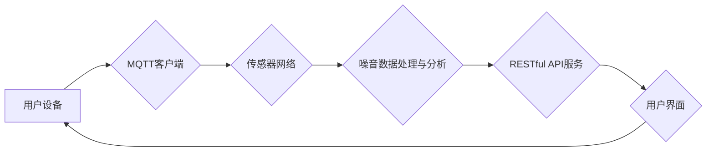

# 基于MQTT协议和RESTful API的室内噪音监控与控制系统

> 关键词：MQTT协议, RESTful API, 室内噪音监控, 物联网, 系统架构, 算法原理, 实时监控, 远程控制

## 1. 背景介绍

随着城市化进程的加快和人们生活水平的提高，室内噪音污染问题日益凸显。为了改善居住环境，提高生活质量，开发一套高效、稳定的室内噪音监控与控制系统显得尤为重要。本文将介绍一种基于MQTT协议和RESTful API的室内噪音监控与控制系统，通过实时监测噪音水平，实现远程控制和管理。

### 1.1 问题的由来

室内噪音污染来源广泛，如交通、工业、建筑施工、家庭娱乐等。长期的噪音暴露会对人们的身心健康造成严重影响，包括听力损伤、心理压力、睡眠障碍等。因此，对室内噪音进行实时监测和控制，已成为现代居住环境改善的重要手段。

### 1.2 研究现状

目前，室内噪音监控与控制系统主要基于以下技术：

- **声学监测技术**：通过声学传感器采集噪音信号，进行噪声水平的测量和评估。
- **物联网技术**：将声学传感器与网络连接，实现数据的实时传输和远程监控。
- **云计算技术**：将数据处理和分析任务部署在云端，提高系统处理能力和数据安全性。

### 1.3 研究意义

本文提出的室内噪音监控与控制系统，旨在解决以下问题：

- 实时监测室内噪音水平，为用户提供实时反馈。
- 通过远程控制，实现噪音源的管理和调整。
- 基于大数据分析，为噪音治理提供决策支持。

## 2. 核心概念与联系

### 2.1 核心概念

- **MQTT协议**：轻量级的消息队列传输协议，适用于低带宽、高延迟的网络环境，适用于物联网设备之间的通信。
- **RESTful API**：基于REST架构的API设计风格，通过HTTP请求实现资源的创建、读取、更新和删除（CRUD）操作。
- **室内噪音监控**：通过声学传感器实时采集室内噪音信号，并进行处理和分析。
- **远程控制**：通过远程设备控制噪音源，如关闭门窗、调节空调等。

### 2.2 架构流程图



### 2.3 关系联系

- 用户设备通过MQTT客户端与传感器网络连接，实时接收噪音数据。
- 传感器网络将噪音数据发送到噪音数据处理与分析模块。
- 数据处理与分析模块对噪音数据进行处理和分析，并将结果通过RESTful API服务提供给用户界面。
- 用户界面展示噪音数据和报警信息，并允许用户通过远程控制模块对噪音源进行操作。

## 3. 核心算法原理 & 具体操作步骤

### 3.1 算法原理概述

室内噪音监控与控制系统的核心算法主要包括以下部分：

- **噪音信号采集与处理**：通过声学传感器采集噪音信号，进行滤波、降噪等处理。
- **噪音水平评估**：根据处理后的噪音信号，计算噪音水平指标，如分贝值、噪音能量等。
- **报警阈值设置**：根据用户需求或国家标准，设置噪音报警阈值。
- **远程控制策略**：根据噪音水平和报警阈值，制定相应的远程控制策略。

### 3.2 算法步骤详解

1. 声学传感器采集噪音信号。
2. 对采集到的噪音信号进行滤波、降噪等处理。
3. 计算处理后的噪音信号的分贝值或噪音能量等指标。
4. 将计算结果发送到数据处理与分析模块。
5. 数据处理与分析模块将计算结果与报警阈值进行比较。
6. 若噪音水平超过报警阈值，则触发报警，并通过用户界面通知用户。
7. 用户通过用户界面查看噪音数据和报警信息。
8. 用户根据需要，通过远程控制模块对噪音源进行操作。

### 3.3 算法优缺点

#### 3.3.1 优点

- **实时性**：系统能够实时监测室内噪音水平，为用户提供及时反馈。
- **远程控制**：用户可以远程控制噪音源，提高生活便利性。
- **可扩展性**：系统架构灵活，易于扩展和升级。

#### 3.3.2 缺点

- **成本**：系统建设和维护成本较高，需要投入一定的人力和物力。
- **数据安全**：需要确保数据传输和存储的安全性，防止数据泄露。

### 3.4 算法应用领域

室内噪音监控与控制系统可应用于以下领域：

- **住宅小区**：改善居住环境，提高居民生活质量。
- **办公楼**：降低办公噪音，提高工作效率。
- **学校**：营造安静的学习环境，有助于学生集中注意力。
- **医院**：降低病房噪音，提高患者康复效果。

## 4. 数学模型和公式 & 详细讲解 & 举例说明

### 4.1 数学模型构建

室内噪音监控与控制系统的数学模型主要包括以下部分：

- **噪音信号模型**：描述噪音信号的特性，如频谱、功率谱等。
- **噪音水平评估模型**：将处理后的噪音信号转换为噪音水平指标。
- **报警阈值模型**：根据用户需求或国家标准，确定报警阈值。

### 4.2 公式推导过程

#### 4.2.1 噪音信号模型

假设噪音信号 $x(t)$ 为随机信号，其自相关函数 $R_x(\tau)$ 可以表示为：

$$
R_x(\tau) = \int_{-\infty}^{\infty} x(t)x(t+\tau)dt
$$

#### 4.2.2 噪音水平评估模型

噪音水平指标可以通过以下公式计算：

$$
L = 10 \log_{10}\left(\frac{1}{N}\sum_{i=1}^{N}|x_i|^2\right)
$$

其中，$N$ 为样本数量，$x_i$ 为第 $i$ 个样本的幅值。

#### 4.2.3 报警阈值模型

报警阈值可以根据以下公式计算：

$$
L_{\text{阈值}} = L_0 + A
$$

其中，$L_0$ 为基准噪音水平，$A$ 为报警阈值增量。

### 4.3 案例分析与讲解

假设某住宅小区采用室内噪音监控与控制系统，基准噪音水平 $L_0$ 为 50dB，报警阈值增量 $A$ 为 5dB。当室内噪音水平达到 55dB 时，系统将触发报警。

## 5. 项目实践：代码实例和详细解释说明

### 5.1 开发环境搭建

- **编程语言**：Python
- **开发工具**：PyCharm
- **传感器**：Microphone（用于采集噪音信号）
- **MQTT客户端**：paho-mqtt
- **RESTful API服务**：Flask
- **数据库**：SQLite（用于存储数据）

### 5.2 源代码详细实现

以下是一个简单的室内噪音监控与控制系统的Python代码实例：

```python
from flask import Flask, jsonify
import paho.mqtt.client as mqtt
import numpy as np
import sounddevice as sd
from scipy.io.wavfile import write

app = Flask(__name__)
mqtt_client = mqtt.Client()

# MQTT服务器地址和端口
MQTT_BROKER = 'localhost'
MQTT_PORT = 1883

# 数据库配置
DATABASE_URI = 'sqlite:///noise_data.db'
DB = sqlite3.connect(DATABASE_URI)

# 创建数据库表
DB.execute('''
CREATE TABLE IF NOT EXISTS noise_data (
    timestamp DATETIME DEFAULT CURRENT_TIMESTAMP,
    level REAL
)
''')

# MQTT连接回调函数
def on_connect(client, userdata, flags, rc):
    print(f"Connected with result code {rc}")
    client.subscribe('noise/data')

# MQTT消息接收回调函数
def on_message(client, userdata, message):
    print(f"Received `{message.payload.decode()}` on topic `{message.topic}`")
    level = float(message.payload.decode())
    DB.execute('INSERT INTO noise_data(level) VALUES (?)', (level,))
    DB.commit()

# 启动MQTT客户端
mqtt_client.on_connect = on_connect
mqtt_client.on_message = on_message
mqtt_client.connect(MQTT_BROKER, MQTT_PORT, 60)

# 采集噪音数据
def capture_noise():
    fs = 44100  # 采样率
    duration = 5  # 采集时间（秒）
    x = sd.rec(int(fs * duration), samplerate=fs, channels=1, dtype='float32')
    sd.wait()
    sd.play(x, fs)
    write('noise.wav', fs, x)
    return np.mean(np.abs(x))

# 主函数
@app.route('/noise')
def noise_level():
    level = capture_noise()
    mqtt_client.publish('noise/data', str(level))
    return jsonify(level=level)

if __name__ == '__main__':
    app.run(debug=True)
```

### 5.3 代码解读与分析

- **导入必要的库**：导入Flask、paho-mqtt、numpy、sounddevice和scipy.io.wavfile等库。
- **创建Flask应用**：创建一个Flask应用，用于处理HTTP请求。
- **创建MQTT客户端**：创建一个MQTT客户端，用于连接MQTT服务器并订阅消息。
- **MQTT连接回调函数**：定义连接回调函数，打印连接结果。
- **MQTT消息接收回调函数**：定义消息接收回调函数，将接收到的噪音水平数据存储到数据库。
- **启动MQTT客户端**：启动MQTT客户端，连接服务器并订阅消息。
- **采集噪音数据**：定义一个函数，使用sounddevice库采集噪音数据，并将其保存为WAV文件。
- **主函数**：定义Flask应用的主函数，启动Flask服务器。

### 5.4 运行结果展示

运行上述代码，访问`http://localhost:5000/noise`，即可获取当前的噪音水平。

## 6. 实际应用场景

### 6.1 住宅小区

在住宅小区安装噪音传感器，实时监测室内噪音水平。当噪音水平超过设定阈值时，系统会自动触发报警，并通过短信、APP等方式通知居民。

### 6.2 办公楼

在办公楼安装噪音传感器，实时监测办公室内部和走廊的噪音水平。当噪音水平超过设定阈值时，系统会自动关闭公共区域的音乐播放设备，降低噪音干扰。

### 6.3 学校

在学校教室、图书馆等场所安装噪音传感器，实时监测噪音水平。当噪音水平超过设定阈值时，系统会自动开启静音模式，提醒学生保持安静。

### 6.4 医院病房

在医院病房安装噪音传感器，实时监测病房内部噪音水平。当噪音水平超过设定阈值时，系统会自动开启空气净化器，降低噪音干扰。

## 7. 工具和资源推荐

### 7.1 学习资源推荐

- **《物联网技术与应用》**：介绍物联网的基本原理、技术和应用。
- **《Python编程：从入门到实践》**：介绍Python编程语言和常用库。
- **《MQTT协议与Python客户端编程》**：介绍MQTT协议和Python客户端编程。
- **《RESTful API设计最佳实践》**：介绍RESTful API设计原则和最佳实践。

### 7.2 开发工具推荐

- **PyCharm**：Python集成开发环境，提供代码编辑、调试、测试等功能。
- **Postman**：API调试和测试工具，可以方便地发送HTTP请求和查看响应。
- **MQTT.fx**：MQTT客户端模拟器，可以方便地进行MQTT客户端的开发和测试。

### 7.3 相关论文推荐

- **《基于物联网的智能家居噪音控制方法研究》**：介绍基于物联网技术的智能家居噪音控制方法。
- **《基于MQTT协议的无线传感器网络应用研究》**：介绍MQTT协议在无线传感器网络中的应用。
- **《RESTful API设计方法与实践》**：介绍RESTful API设计方法与实践。

## 8. 总结：未来发展趋势与挑战

### 8.1 研究成果总结

本文介绍了基于MQTT协议和RESTful API的室内噪音监控与控制系统，通过实时监测噪音水平，实现远程控制和管理。系统架构简单、易于扩展，可应用于住宅小区、办公楼、学校、医院等多个场景。

### 8.2 未来发展趋势

- **智能化**：将人工智能技术应用于噪音识别、预警、控制等方面，提高系统的智能化水平。
- **网络化**：将系统扩展到更广泛的网络环境，实现跨地域的实时监控和控制。
- **个性化**：根据用户需求，提供个性化的噪音控制策略。

### 8.3 面临的挑战

- **数据安全**：确保数据传输和存储的安全性，防止数据泄露。
- **系统稳定性**：提高系统的稳定性和可靠性，减少故障率。
- **成本控制**：降低系统建设和维护成本，提高性价比。

### 8.4 研究展望

未来，室内噪音监控与控制系统将在以下方面进行深入研究：

- **跨领域融合**：将声学、物联网、人工智能、云计算等领域的先进技术进行融合，构建更加完善、高效的系统。
- **用户体验**：关注用户体验，提供更加便捷、易用的操作界面。
- **可持续发展**：探索室内噪音污染的治理方法，实现可持续发展。

## 9. 附录：常见问题与解答

**Q1：如何提高室内噪音监控与控制系统的准确性？**

A：提高室内噪音监控与系统的准确性，可以从以下几个方面入手：

- 选择高性能的声学传感器，提高信号采集的精度。
- 对采集到的噪音信号进行预处理，如滤波、降噪等。
- 使用更先进的噪音识别和分类算法，提高噪音识别的准确性。

**Q2：如何降低室内噪音监控与控制系统的成本？**

A：降低室内噪音监控与控制系统的成本，可以从以下几个方面入手：

- 采用低成本的声学传感器和通信模块。
- 优化系统架构，减少不必要的硬件设备。
- 使用开源软件和开源硬件，降低开发成本。

**Q3：如何保证室内噪音监控与控制系统的数据安全？**

A：保证室内噪音监控与控制系统的数据安全，可以从以下几个方面入手：

- 对数据进行加密传输和存储。
- 采用访问控制机制，限制对数据的访问权限。
- 定期进行安全审计，及时发现和修复安全漏洞。

**Q4：室内噪音监控与控制系统如何实现跨地域的实时监控和控制？**

A：实现室内噪音监控与控制系统的跨地域实时监控和控制，可以通过以下方式：

- 使用云平台，将系统的数据处理和分析任务部署在云端。
- 使用物联网技术，将传感器网络连接到云平台。
- 使用分布式数据库，实现数据的分布式存储和管理。

作者：禅与计算机程序设计艺术 / Zen and the Art of Computer Programming