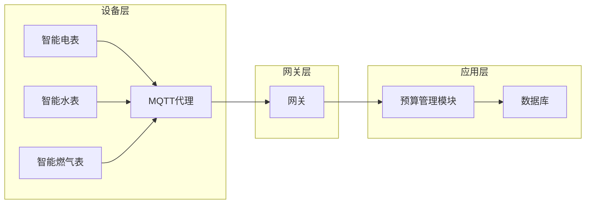

> MQTT协议, RESTful API, 智能家居, 预算管理,边缘计算, 物联网, 微服务架构

# 基于MQTT协议和RESTful API的智能家居预算管理模块

智能家居系统通过集成各种智能设备，为用户提供了便捷、舒适和节能的生活方式。其中，预算管理作为智能家居的核心功能之一，能够帮助用户合理规划家庭开支，提高生活质量。本文将探讨如何利用MQTT协议和RESTful API构建智能家居预算管理模块，实现高效的数据交互和智能决策。

## 1. 背景介绍

随着物联网技术的快速发展，智能家居设备逐渐普及。用户可以通过智能设备实现对家居环境的远程控制，提高生活便利性。然而，随着智能设备数量的增加，用户的家庭开支也在不断攀升。因此，如何对智能家居的预算进行有效管理，成为了用户和设备制造商共同关注的问题。

MQTT协议和RESTful API是构建智能家居系统的两种常用技术。MQTT协议是一种轻量级的消息传输协议，适用于低功耗、低带宽的物联网设备。RESTful API则是一种基于HTTP的API设计风格，具有简单、易用、无状态等特点。

## 2. 核心概念与联系

### 2.1 MQTT协议

MQTT（Message Queuing Telemetry Transport）是一种轻量级的消息传输协议，适用于连接远程设备，如传感器、控制器等。MQTT协议具有以下特点：

- **发布/订阅模式**：客户端可以订阅主题，服务器（代理）会将发布到指定主题的消息传递给所有订阅者。
- **质量等级**：支持三种消息质量等级（QoS），分别是0（最多一次）、1（至少一次）和2（仅一次）。
- **保留消息**：服务器可以保留客户端发布的消息，以便稍后传递给新的订阅者。

### 2.2 RESTful API

RESTful API是基于HTTP协议的API设计风格，具有以下特点：

- **无状态**：服务器不保存客户端的状态信息。
- **统一接口**：使用统一的HTTP方法（GET、POST、PUT、DELETE等）和资源URL来访问资源。
- **简单性**：易于实现和维护。

### 2.3 智能家居预算管理模块架构

智能家居预算管理模块的架构如图所示：



设备层：包括智能电表、智能水表、智能燃气表等设备，负责采集家庭能源消耗数据。

网关层：接收设备层通过MQTT协议发送的数据，并将数据推送到应用层。

应用层：包括预算管理模块和数据库。预算管理模块负责处理和分析数据，生成预算报告和警报。数据库用于存储设备数据、预算设置和用户信息。

## 3. 核心算法原理 & 具体操作步骤

### 3.1 算法原理概述

智能家居预算管理模块的核心算法包括数据采集、数据处理和预算分析。

- 数据采集：通过MQTT协议从设备层获取能源消耗数据。
- 数据处理：对采集到的数据进行清洗、转换和格式化。
- 预算分析：根据用户设定的预算目标和历史数据，分析能源消耗情况，生成预算报告和警报。

### 3.2 算法步骤详解

1. **设备层数据采集**：智能设备通过MQTT协议将能源消耗数据发送到MQTT代理。
2. **网关层数据处理**：网关将接收到的数据推送到预算管理模块。
3. **预算管理模块处理**：
    - 清洗数据：去除无效、错误或异常的数据。
    - 转换数据：将不同设备的能源消耗数据转换为统一的格式。
    - 分析数据：根据用户设定的预算目标和历史数据，分析能源消耗情况。
4. **生成预算报告和警报**：预算管理模块将分析结果存储到数据库，并生成预算报告和警报。

### 3.3 算法优缺点

**优点**：

- **实时性**：通过MQTT协议实现实时数据采集和分析。
- **高效率**：RESTful API提供高效的数据交互。
- **可扩展性**：模块化设计，方便扩展新功能。

**缺点**：

- **复杂性**：系统架构较为复杂，需要整合多种技术。
- **安全性**：需要考虑数据传输和存储的安全性。

### 3.4 算法应用领域

智能家居预算管理模块可以应用于以下领域：

- 家庭能源管理
- 商业楼宇能源管理
- 工厂能源管理

## 4. 数学模型和公式 & 详细讲解 & 举例说明

### 4.1 数学模型构建

智能家居预算管理模块的数学模型主要包括以下部分：

- 能源消耗模型：描述能源消耗与设备使用时间的关系。
- 预算模型：描述预算目标与实际消耗的关系。

### 4.2 公式推导过程

假设设备A的能源消耗模型为：

$$
E_A(t) = a \cdot t + b
$$

其中，$E_A(t)$ 为设备A在时间 $t$ 的能源消耗量，$a$ 和 $b$ 为模型参数。

预算模型可以表示为：

$$
B(t) = C \cdot (E_A(t) - E_{\text{base}})
$$

其中，$B(t)$ 为时间 $t$ 的预算，$C$ 为预算系数，$E_{\text{base}}$ 为基础能源消耗量。

### 4.3 案例分析与讲解

假设用户设定了每月电费预算为100元，基础电费消耗量为30度电。根据以上模型，我们可以计算每个月的电费预算和实际消耗量：

- 模型参数：$a = 0.5$，$b = 10$，$C = 0.5$，$E_{\text{base}} = 30$。
- 第一个月：$E_A(30) = 0.5 \cdot 30 + 10 = 20$，$B(30) = 0.5 \cdot (20 - 30) = -5$。
- 第二个月：$E_A(60) = 0.5 \cdot 60 + 10 = 30$，$B(60) = 0.5 \cdot (30 - 30) = 0$。

通过分析实际消耗量与预算目标的关系，用户可以及时调整能源消耗习惯，降低家庭开支。

## 5. 项目实践：代码实例和详细解释说明

### 5.1 开发环境搭建

以下是使用Python语言和paho-mqtt库实现智能家居预算管理模块的代码示例：

```python
import paho.mqtt.client as mqtt
import json

# MQTT代理地址和端口
MQTT_BROKER = "mqtt.example.com"
MQTT_PORT = 1883

# 用户设定的预算目标
BUDGET_TARGET = 100

# 数据库连接信息
DATABASE_URL = "mongodb://localhost:27017"

# 创建MQTT客户端
client = mqtt.Client()

# 连接MQTT代理
client.connect(MQTT_BROKER, MQTT_PORT, 60)

# 数据库连接
from pymongo import MongoClient
client_db = MongoClient(DATABASE_URL)
db = client_db["budget_management"]

# 接收消息回调函数
def on_message(client, userdata, message):
    topic = message.topic
    payload = json.loads(message.payload)
    energy_consumption = payload["energy_consumption"]

    # 计算预算
    budget = BUDGET_TARGET * (energy_consumption - 30)

    # 存储数据到数据库
    db.energy_consumption.insert_one({
        "timestamp": payload["timestamp"],
        "energy_consumption": energy_consumption,
        "budget": budget
    })

    # 发送预算警报
    if budget < 0:
        client.publish("budget/alert", "Budget exceeded!")

# 订阅主题
client.subscribe("energy/consumption")

# 设置消息接收回调函数
client.on_message = on_message

# 启动客户端循环
client.loop_forever()
```

### 5.2 源代码详细实现

上述代码实现了以下功能：

1. 连接MQTT代理和数据库。
2. 定义预算目标和数据库连接信息。
3. 创建MQTT客户端，并订阅能源消耗主题。
4. 定义消息接收回调函数，处理接收到的消息。
5. 计算预算并存储到数据库。
6. 发送预算警报。

### 5.3 代码解读与分析

- `paho.mqtt.client`：用于与MQTT代理进行通信。
- `json`：用于解析和序列化JSON数据。
- `pymongo`：用于连接MongoDB数据库。

代码首先定义了MQTT代理地址、端口、预算目标和数据库连接信息。然后创建MQTT客户端，并连接到MQTT代理。接着订阅能源消耗主题，并定义消息接收回调函数。在回调函数中，解析接收到的消息，计算预算，并将数据存储到数据库。如果预算低于0，则发送预算警报。

### 5.4 运行结果展示

假设智能电表发送了以下消息：

```json
{
    "timestamp": "2023-04-01T00:00:00Z",
    "energy_consumption": 50
}
```

回调函数将计算预算为25元，并将数据存储到数据库中。如果用户设定了预算警报阈值，系统将发送警报消息。

## 6. 实际应用场景

智能家居预算管理模块可以应用于以下实际场景：

- **家庭能源管理**：用户可以实时查看家庭能源消耗情况，并根据预算调整设备使用习惯，降低家庭开支。
- **商业楼宇能源管理**：物业管理公司可以监控楼宇能源消耗情况，制定节能措施，提高能源利用效率。
- **工厂能源管理**：企业可以监控工厂能源消耗情况，优化生产流程，降低能源成本。

## 7. 工具和资源推荐

### 7.1 学习资源推荐

- MQTT协议官方文档：https://mosquitto.org Manual
- RESTful API设计最佳实践：https://restfulapi.net/
- Python MQTT库：https://pypi.org/project/paho-mqtt/
- MongoDB数据库：https://docs.mongodb.com/

### 7.2 开发工具推荐

- MQTT代理：Mosquitto、Paho MQTT Server
- RESTful API开发：Postman、Insomnia
- 数据库管理：MongoDB Compass、DBeaver

### 7.3 相关论文推荐

- MQTT协议规范：https://mqtt.org/
- RESTful API设计原则：https://restfulapi.net/
- 智能家居预算管理：https://ieeexplore.ieee.org/document/8168292

## 8. 总结：未来发展趋势与挑战

### 8.1 研究成果总结

本文介绍了基于MQTT协议和RESTful API的智能家居预算管理模块，包括核心概念、算法原理、具体操作步骤、数学模型和公式、项目实践和实际应用场景。通过分析，我们发现该模块能够有效实现家庭能源消耗数据的实时采集、处理和分析，帮助用户合理规划家庭开支。

### 8.2 未来发展趋势

未来智能家居预算管理模块将朝着以下方向发展：

- **智能化**：结合人工智能技术，实现更加智能化的预算建议和节能方案。
- **个性化**：根据用户习惯和需求，提供个性化的预算管理和节能方案。
- **跨界融合**：与其他智能家居系统进行融合，如健康管理、娱乐等，提供更加全面的生活服务。

### 8.3 面临的挑战

智能家居预算管理模块在应用过程中面临以下挑战：

- **数据安全**：需要保证用户数据的安全性和隐私性。
- **数据质量**：需要保证能源消耗数据的准确性和可靠性。
- **系统集成**：需要与其他智能家居系统进行有效集成。

### 8.4 研究展望

为了解决上述挑战，未来研究可以从以下几个方面展开：

- **安全加密**：采用加密技术，保证数据传输和存储的安全性。
- **数据清洗和预处理**：对采集到的数据进行清洗和预处理，提高数据质量。
- **跨平台集成**：采用跨平台技术，实现与其他智能家居系统的无缝集成。

通过不断的技术创新和优化，智能家居预算管理模块将为用户带来更加便捷、智能、安全的智能家居生活体验。

## 9. 附录：常见问题与解答

**Q1：MQTT协议和RESTful API有什么区别？**

A: MQTT协议是一种轻量级的消息传输协议，适用于低功耗、低带宽的物联网设备。RESTful API是一种基于HTTP的API设计风格，具有简单、易用、无状态等特点。

**Q2：如何保证数据安全？**

A: 可以采用以下措施保证数据安全：
- 使用TLS/SSL加密数据传输。
- 采用加密算法加密存储数据。
- 设置访问权限和身份验证机制。

**Q3：如何提高数据质量？**

A: 可以采取以下措施提高数据质量：
- 对采集到的数据进行清洗和预处理。
- 采用数据质量评估指标，监控数据质量。
- 及时处理异常数据。

**Q4：如何与其他智能家居系统进行集成？**

A: 可以采用以下方法与其他智能家居系统进行集成：
- 使用标准的通信协议，如MQTT、CoAP等。
- 开发统一的接口，方便与其他系统进行数据交换。
- 利用中间件实现系统间解耦和交互。

通过以上解答，相信读者对基于MQTT协议和RESTful API的智能家居预算管理模块有了更深入的了解。希望本文能够为智能家居预算管理模块的开发和应用提供一些有益的参考。

---

作者：禅与计算机程序设计艺术 / Zen and the Art of Computer Programming