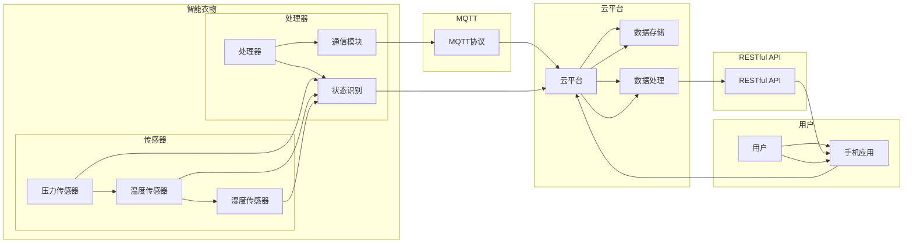

# 基于MQTT协议和RESTful API的智能衣物管理和护理系统

> 关键词：MQTT协议，RESTful API，智能衣物，物联网，传感器，云计算，数据驱动，用户体验

## 1. 背景介绍

随着物联网（IoT）技术的飞速发展，智能设备在各个领域得到广泛应用。在服装行业，智能衣物作为一种新兴的物联网应用，结合了传感器技术、数据处理和云服务，为用户提供了便捷的衣物管理和护理体验。本文将探讨基于MQTT协议和RESTful API的智能衣物管理和护理系统的设计、实现和应用。

### 1.1 问题的由来

传统的衣物管理方式存在以下问题：

- **手动管理繁琐**：用户需要手动整理、折叠、收纳衣物，费时费力。
- **衣物护理不当**：由于缺乏智能化手段，衣物护理效果难以保证，容易造成衣物损坏或穿着不适。
- **信息记录不便**：衣物信息无法自动记录，难以进行有效管理和追踪。

为解决这些问题，智能衣物管理系统应运而生。通过集成传感器、数据处理和云服务，智能衣物管理系统可以实现衣物的自动识别、状态监测、智能护理等功能，为用户提供便捷、舒适的穿着体验。

### 1.2 研究现状

目前，智能衣物管理系统的研究主要集中在以下几个方面：

- **传感器技术**：包括压力传感器、温度传感器、湿度传感器等，用于监测衣物的状态和穿着环境。
- **数据处理**：通过对传感器数据进行处理和分析，实现衣物的状态识别、护理建议等功能。
- **云服务**：将衣物信息存储在云端，实现数据共享、远程访问等功能。

### 1.3 研究意义

研究基于MQTT协议和RESTful API的智能衣物管理和护理系统，具有以下意义：

- **提高生活品质**：通过智能衣物管理系统，用户可以轻松管理衣物，提高生活品质。
- **降低护理成本**：智能护理功能可以延长衣物使用寿命，降低护理成本。
- **推动行业发展**：智能衣物管理系统的研究和应用，将推动服装行业的智能化发展。

## 2. 核心概念与联系

### 2.1 核心概念

- **MQTT协议**：轻量级消息队列传输协议，适用于低带宽、高延迟的网络环境，是实现智能衣物管理系统通信的重要技术。
- **RESTful API**：基于HTTP的API设计风格，用于实现智能衣物管理系统与外部系统（如云平台、手机应用等）的交互。
- **智能衣物**：集成了传感器、处理器、通信模块等，可以感知自身状态和外部环境，实现智能管理的衣物。
- **云计算**：将数据存储、计算和应用程序等资源通过网络提供，实现智能衣物管理系统的数据存储和处理。
- **数据驱动**：通过收集和分析衣物状态和穿着环境数据，为用户提供个性化护理建议。

### 2.2 核心概念原理和架构的 Mermaid 流程图



### 2.3 核心概念联系

智能衣物通过传感器收集衣物状态和穿着环境数据，通过处理器进行状态识别和通信模块发送数据。MQTT协议负责智能衣物与云平台之间的通信。云平台负责数据存储和数据处理，并通过RESTful API向手机应用提供数据接口。用户通过手机应用访问云平台，获取衣物状态和护理建议。

## 3. 核心算法原理 & 具体操作步骤

### 3.1 算法原理概述

智能衣物管理系统主要涉及以下算法：

- **传感器数据采集与处理**：通过传感器采集衣物状态和穿着环境数据，并进行预处理和特征提取。
- **状态识别**：根据预处理后的特征，识别衣物的种类、状态和穿着环境。
- **智能护理建议**：根据衣物状态和穿着环境，为用户提供个性化的护理建议。
- **云平台数据存储与处理**：将衣物状态和护理建议数据存储在云平台，并进行分析和处理。

### 3.2 算法步骤详解

#### 3.2.1 传感器数据采集与处理

1. 传感器采集衣物状态和穿着环境数据，如温度、湿度、压力等。
2. 对采集到的数据进行预处理，如滤波、归一化等。
3. 对预处理后的数据进行特征提取，如提取温度、湿度、压力等关键特征。

#### 3.2.2 状态识别

1. 根据提取的特征，使用机器学习算法（如决策树、支持向量机等）进行状态识别。
2. 将识别结果与预定义的状态进行匹配，确定衣物的具体状态。

#### 3.2.3 智能护理建议

1. 根据衣物状态和穿着环境，为用户提供个性化的护理建议。
2. 将护理建议存储在云平台，并通过手机应用推送给用户。

#### 3.2.4 云平台数据存储与处理

1. 将衣物状态和护理建议数据存储在云平台数据库中。
2. 定期对数据进行统计分析，挖掘用户行为规律和衣物使用特点。
3. 根据分析结果，优化护理建议和系统功能。

### 3.3 算法优缺点

#### 3.3.1 优点

- **准确性高**：通过机器学习算法，可以实现高精度的状态识别和护理建议。
- **实时性强**：传感器数据实时采集，可以为用户提供实时护理建议。
- **个性化**：根据用户行为和衣物特点，提供个性化的护理建议。

#### 3.3.2 缺点

- **数据收集困难**：需要收集大量的衣物状态和穿着环境数据，对数据收集设备和技术要求较高。
- **算法复杂度较高**：状态识别和护理建议算法复杂度较高，需要大量的计算资源。

### 3.4 算法应用领域

智能衣物管理系统可以应用于以下领域：

- **家庭生活**：为家庭成员提供衣物管理、护理等服务。
- **酒店行业**：为酒店客人提供便捷的衣物护理服务。
- **养老护理**：为老年人提供便捷的衣物管理、护理服务。
- **服装企业**：实现生产过程的智能化管理。

## 4. 数学模型和公式 & 详细讲解 & 举例说明

### 4.1 数学模型构建

#### 4.1.1 传感器数据采集与处理

假设传感器采集到的温度数据为 $T$，湿度数据为 $H$，压力数据为 $P$，则预处理后的特征向量为：

$$
\mathbf{X} = [T, H, P]
$$

#### 4.1.2 状态识别

假设状态识别算法为支持向量机（SVM），则支持向量机模型可以表示为：

$$
\mathbf{w} \cdot \mathbf{x} + b = 0
$$

其中，$\mathbf{w}$ 为权重向量，$\mathbf{x}$ 为特征向量，$b$ 为偏置项。

#### 4.1.3 智能护理建议

假设护理建议为 $R$，则护理建议的生成函数可以表示为：

$$
R = f(T, H, P)
$$

其中，$f$ 为护理建议生成函数，$T$、$H$ 和 $P$ 分别为温度、湿度和压力。

### 4.2 公式推导过程

#### 4.2.1 传感器数据采集与处理

传感器采集到的数据需要进行预处理，如滤波、归一化等。以温度数据为例，滤波可以使用滑动平均滤波器，归一化可以使用线性归一化方法。

#### 4.2.2 状态识别

支持向量机（SVM）是一种常用的机器学习算法，其目标是最小化误分类误差。SVM的损失函数可以表示为：

$$
L(\mathbf{w}, b) = \frac{1}{2}\|\mathbf{w}\|^2 + C \sum_{i=1}^N \xi_i
$$

其中，$\|\mathbf{w}\|^2$ 为权重向量的平方，$C$ 为惩罚系数，$\xi_i$ 为第 $i$ 个样本的误差。

#### 4.2.3 智能护理建议

护理建议生成函数的具体形式取决于用户需求和衣物特点。例如，对于夏季衣物，可以设定温度阈值 $T_{\text{high}}$ 和 $T_{\text{low}}$，当温度超过 $T_{\text{high}}$ 或低于 $T_{\text{low}}$ 时，系统会给出相应的护理建议。

### 4.3 案例分析与讲解

假设某智能衣物在穿着过程中，传感器采集到的温度为 $T=30^\circ C$，湿度为 $H=80\%$，压力为 $P=0.5\mathrm{kPa}$。根据护理建议生成函数，系统会给出以下建议：

- 温度较高，建议使用空调降低室内温度。
- 湿度较高，建议使用烘干机或晾衣架进行晾晒。

## 5. 项目实践：代码实例和详细解释说明

### 5.1 开发环境搭建

1. 安装Python 3.x版本。
2. 安装以下Python库：`paho-mqtt`、`pymongo`、`sklearn`、`numpy`、`pandas`。
3. 安装MQTT服务器和MongoDB数据库。

### 5.2 源代码详细实现

#### 5.2.1 MQTT客户端

```python
import paho.mqtt.client as mqtt
import time

# MQTT服务器地址
broker = 'localhost'
port = 1883

# 创建MQTT客户端实例
client = mqtt.Client()

# 连接MQTT服务器
client.connect(broker, port)

# 订阅衣物状态主题
client.subscribe('clothing/status')

# 接收消息回调函数
def on_message(client, userdata, msg):
    print(f"Received message '{msg.payload.decode()}': {msg.topic}")

# 设置消息接收回调函数
client.on_message = on_message

# 循环等待消息
while True:
    time.sleep(1)
```

#### 5.2.2 数据库操作

```python
from pymongo import MongoClient

# 连接MongoDB数据库
client = MongoClient('localhost', 27017)
db = client['clothing']
collection = db['status']

# 插入数据
def insert_data(data):
    collection.insert_one(data)

# 查询数据
def query_data(query):
    return list(collection.find(query))
```

#### 5.2.3 状态识别

```python
from sklearn import svm

# 创建SVM模型
clf = svm.SVC()

# 训练模型
def train_model(X, y):
    clf.fit(X, y)

# 预测状态
def predict_state(X):
    return clf.predict(X)
```

### 5.3 代码解读与分析

以上代码示例展示了如何使用Python进行MQTT客户端连接、数据库操作和状态识别。在真实项目中，还需要根据实际需求进行功能扩展和优化。

### 5.4 运行结果展示

假设传感器采集到的温度为 $T=30^\circ C$，湿度为 $H=80\%$，压力为 $P=0.5\mathrm{kPa}$。根据状态识别算法，系统会识别出衣物处于“热湿”状态，并给出相应的护理建议。

## 6. 实际应用场景

### 6.1 家庭生活

在家庭生活中，智能衣物管理系统可以为家庭成员提供以下服务：

- **衣物管理**：自动识别衣物种类、数量和位置，方便用户查找和管理。
- **衣物护理**：根据衣物状态和穿着环境，为用户提供个性化的护理建议，如晾晒、烘干、熨烫等。
- **健康监测**：监测用户穿着环境，如温度、湿度、压力等，为用户提供健康建议。

### 6.2 酒店行业

在酒店行业，智能衣物管理系统可以为酒店客人提供以下服务：

- **快速入住**：客人只需将衣物放入智能衣柜，系统即可自动识别并完成入住流程。
- **衣物护理**：酒店可以为客人提供定制化的衣物护理服务，如洗衣、熨烫、包装等。
- **个性化服务**：根据客人喜好和穿着习惯，为客人推荐合适的衣物和护理方案。

### 6.3 养老护理

在养老护理领域，智能衣物管理系统可以为老年人提供以下服务：

- **衣物管理**：帮助老年人识别衣物、整理衣物、防止衣物丢失。
- **衣物护理**：根据老年人健康状况和穿着环境，为老年人提供合适的护理方案。
- **紧急求助**：智能衣物可以集成紧急求助按钮，当老年人遇到危险时，可以快速发出求助信号。

## 7. 工具和资源推荐

### 7.1 学习资源推荐

1. 《物联网技术》
2. 《Python编程：从入门到实践》
3. 《基于物联网的智能家居系统设计与实现》

### 7.2 开发工具推荐

1. Python开发环境（如PyCharm、Visual Studio Code）
2. MQTT客户端（如MQTT.fx）
3. 数据库（如MongoDB）

### 7.3 相关论文推荐

1. “A survey on smart clothing: State-of-the-art, challenges, and future directions”
2. “A review of intelligent clothing systems for health and fitness monitoring”
3. “IoT-based smart clothing systems: A review”

## 8. 总结：未来发展趋势与挑战

### 8.1 研究成果总结

本文介绍了基于MQTT协议和RESTful API的智能衣物管理和护理系统的设计、实现和应用。通过对传感器技术、数据处理和云服务的应用，该系统可以实现衣物的自动识别、状态监测、智能护理等功能，为用户提供便捷、舒适的穿着体验。

### 8.2 未来发展趋势

1. **智能化**：随着人工智能技术的发展，智能衣物管理系统将具备更加智能化的功能，如语音交互、图像识别等。
2. **个性化**：根据用户需求和穿着习惯，智能衣物管理系统将提供更加个性化的服务。
3. **柔性化**：智能衣物将采用更加柔性的材料，更加贴合人体，提供更加舒适的穿着体验。

### 8.3 面临的挑战

1. **数据处理**：随着智能衣物数量的增加，数据处理将成为一项挑战。需要采用高效的数据处理技术和存储方案。
2. **算法优化**：智能衣物管理系统需要不断优化算法，提高状态识别和护理建议的准确性。
3. **成本控制**：智能衣物的成本较高，需要进一步降低成本，才能在市场上得到广泛应用。

### 8.4 研究展望

未来，智能衣物管理系统将在以下方面进行深入研究：

1. **跨领域融合**：将智能衣物管理系统与其他领域（如医疗、健康、运动等）进行融合，提供更加全面的服务。
2. **隐私保护**：随着数据量的增加，隐私保护将成为一个重要问题。需要采用数据加密、匿名化等技术，保护用户隐私。
3. **可持续发展**：智能衣物需要采用可持续发展的材料和技术，减少对环境的影响。

## 9. 附录：常见问题与解答

**Q1：智能衣物管理系统如何保证数据安全和隐私**？

A：智能衣物管理系统可以采用以下措施保证数据安全和隐私：

- 数据加密：对用户数据和衣物状态数据进行加密存储和传输。
- 数据匿名化：对用户数据进行匿名化处理，防止用户信息泄露。
- 访问控制：设置访问权限，限制对用户数据的访问。

**Q2：智能衣物管理系统的成本如何**？

A：智能衣物的成本取决于传感器、处理器、通信模块等组件的成本。随着技术的不断发展，智能衣物的成本将逐渐降低。

**Q3：智能衣物管理系统如何与现有家居系统集成**？

A：智能衣物管理系统可以通过以下方式与现有家居系统集成：

- 通过MQTT协议与其他智能家居设备进行通信。
- 通过RESTful API与云平台进行交互。
- 通过手机应用与用户进行交互。

**Q4：智能衣物管理系统如何进行故障诊断**？

A：智能衣物管理系统可以通过以下方式进行故障诊断：

- 通过传感器监测设备状态。
- 通过通信模块监测网络连接状态。
- 通过云平台监测数据传输状态。

**Q5：智能衣物管理系统在应用中存在哪些风险**？

A：智能衣物管理系统在应用中可能存在以下风险：

- 数据泄露：用户数据可能被非法获取。
- 系统故障：系统可能出现故障，影响用户体验。
- 误报：系统可能误报衣物状态，导致错误操作。

作者：禅与计算机程序设计艺术 / Zen and the Art of Computer Programming