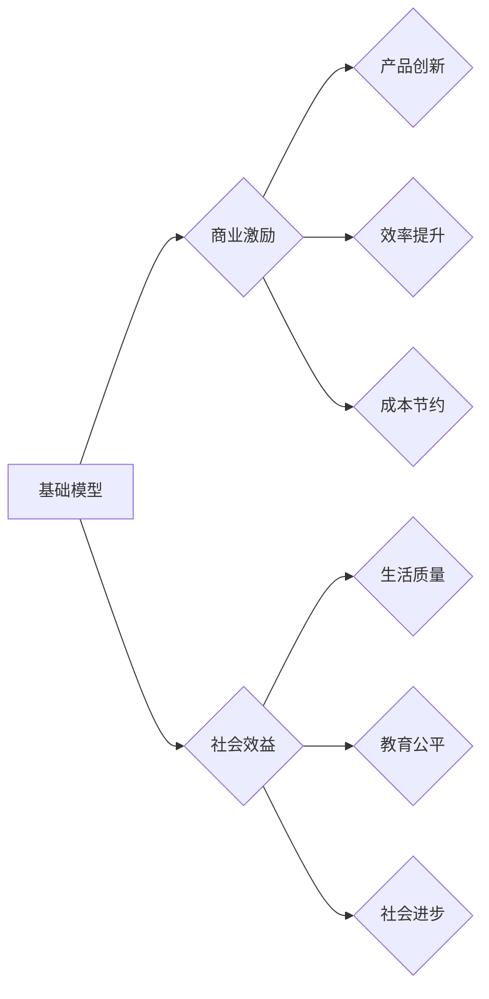

> 基础模型，商业激励，社会效益，人工智能，深度学习，经济价值，伦理考量

# 基础模型的商业激励与社会效益

### 1. 背景介绍

随着人工智能技术的飞速发展，基础模型作为一种核心技术，已经成为推动行业创新和经济增长的关键驱动力。基础模型，如自然语言处理（NLP）的BERT、计算机视觉（CV）的ResNet等，通过在大量数据上预训练，积累了丰富的知识和经验，为各种具体应用提供了强大的能力。本文将探讨基础模型的商业激励与社会效益，分析其带来的机遇与挑战。

### 2. 核心概念与联系

#### 2.1 核心概念原理

**基础模型**：指在特定领域或任务上，通过大规模预训练学习到的通用模型，如BERT、ResNet等。

**商业激励**：指基础模型为企业和个人带来的经济利益，包括产品创新、效率提升、成本节约等。

**社会效益**：指基础模型对社会产生的积极影响，如提高生活质量、促进教育公平、推动社会进步等。

#### 2.2 架构的 Mermaid 流程图



### 3. 核心算法原理 & 具体操作步骤

#### 3.1 算法原理概述

基础模型的原理主要基于深度学习技术，通过多层神经网络对数据进行学习和建模，从而实现特定任务的功能。

#### 3.2 算法步骤详解

1. **数据收集**：从互联网或特定领域收集大量数据，用于模型训练。
2. **数据预处理**：对收集到的数据进行清洗、标注、格式化等预处理操作。
3. **模型训练**：使用深度学习框架（如TensorFlow、PyTorch）训练基础模型。
4. **模型评估**：使用测试数据评估模型的性能，并进行参数调整。
5. **模型部署**：将训练好的模型部署到实际应用场景中。

#### 3.3 算法优缺点

**优点**：

- **高效性**：基础模型能够快速处理大量数据，提高工作效率。
- **通用性**：基础模型具有较强的通用性，可以应用于多个领域。
- **灵活性**：基础模型可以根据不同的任务需求进行微调和定制。

**缺点**：

- **数据依赖性**：基础模型的性能依赖于大量高质量的数据。
- **计算成本高**：训练和部署基础模型需要高性能的计算资源。
- **伦理问题**：基础模型可能存在偏见和歧视问题。

#### 3.4 算法应用领域

基础模型的应用领域非常广泛，包括但不限于以下方面：

- **自然语言处理**：文本分类、机器翻译、情感分析等。
- **计算机视觉**：图像识别、目标检测、图像生成等。
- **语音识别**：语音识别、语音合成、语音翻译等。
- **推荐系统**：个性化推荐、广告投放等。

### 4. 数学模型和公式 & 详细讲解 & 举例说明

#### 4.1 数学模型构建

以BERT模型为例，其核心思想是基于Transformer的编码器-解码器结构。以下是BERT模型的数学公式：

$$
\text{Transformer} = \text{Encoder} + \text{Decoder}
$$

其中，编码器由多个自注意力层（Self-Attention Layer）和前馈神经网络（Feed-Forward Neural Network）组成，解码器由多个编码器-解码器注意力层（Encoder-Decoder Attention Layer）和前馈神经网络组成。

#### 4.2 公式推导过程

**自注意力层**：

$$
\text{Q} = W_Q \cdot \text{X}
$$
$$
\text{K} = W_K \cdot \text{X}
$$
$$
\text{V} = W_V \cdot \text{X}
$$
$$
\text{Attention(Q,K,V)} = \text{softmax}(\frac{\text{Q} \cdot \text{K}^T}{\sqrt{d_k}}) \cdot \text{V}
$$
$$
\text{MultiHeadAttention(Q,K,V)} = \text{Concat}(\text{head}_1, \text{head}_2, ..., \text{head}_n)W_O
$$

**前馈神经网络**：

$$
\text{FFN}(x) = \max(0, \text{xW_1} + b_1) \cdot \text{W_2} + b_2
$$

#### 4.3 案例分析与讲解

以BERT在文本分类任务中的应用为例，首先将文本输入编码为token ids，然后通过BERT模型提取特征，最后使用softmax函数进行分类。

```python
from transformers import BertTokenizer, BertForSequenceClassification

# 加载预训练的BERT模型和分词器
model = BertForSequenceClassification.from_pretrained('bert-base-chinese')
tokenizer = BertTokenizer.from_pretrained('bert-base-chinese')

# 加载数据
texts = [...]  # 文本数据
labels = [...]  # 标签数据

# 编码文本
encodings = tokenizer(texts, truncation=True, padding=True, return_tensors='pt')

# 训练模型
model.train()
outputs = model(**encodings, labels=labels)
loss = outputs.loss
logits = outputs.logits

# 评估模型
model.eval()
with torch.no_grad():
    outputs = model(**encodings)
    logits = outputs.logits
    predictions = logits.argmax(dim=1)
```

### 5. 项目实践：代码实例和详细解释说明

#### 5.1 开发环境搭建

使用Python进行BERT文本分类任务的开发环境搭建如下：

1. 安装Anaconda：从官网下载并安装Anaconda，用于创建独立的Python环境。
2. 创建并激活虚拟环境：
```bash
conda create -n bert-env python=3.8
conda activate bert-env
```
3. 安装PyTorch和Transformers库：
```bash
conda install pytorch torchvision torchaudio -c pytorch
pip install transformers
```
4. 安装其他依赖库：
```bash
pip install numpy pandas scikit-learn matplotlib
```

#### 5.2 源代码详细实现

以下是一个简单的BERT文本分类任务的代码示例：

```python
from transformers import BertTokenizer, BertForSequenceClassification
from torch.utils.data import DataLoader, RandomSampler, SequentialSampler
from torch.optim import AdamW
from torch.utils.data import Dataset
import torch.nn.functional as F
import torch

# 定义数据集
class TextDataset(Dataset):
    def __init__(self, texts, labels):
        self.texts = texts
        self.labels = labels

    def __len__(self):
        return len(self.texts)

    def __getitem__(self, item):
        return self.texts[item], self.labels[item]

# 加载预训练的BERT模型和分词器
model = BertForSequenceClassification.from_pretrained('bert-base-chinese')
tokenizer = BertTokenizer.from_pretrained('bert-base-chinese')

# 加载数据
texts = [...]  # 文本数据
labels = [...]  # 标签数据

# 编码文本
encodings = tokenizer(texts, truncation=True, padding=True, return_tensors='pt')

# 创建数据集
dataset = TextDataset(texts, labels)
train_loader = DataLoader(dataset, batch_size=16, shuffle=True)

# 定义优化器
optimizer = AdamW(model.parameters(), lr=5e-5)

# 训练模型
for epoch in range(3):
    model.train()
    for batch in train_loader:
        inputs = {k: v.to('cuda') for k, v in batch.items()}
        outputs = model(**inputs)
        loss = outputs.loss
        loss.backward()
        optimizer.step()
        optimizer.zero_grad()
```

#### 5.3 代码解读与分析

以上代码展示了如何使用PyTorch和Transformers库实现BERT文本分类任务。首先定义了数据集类`TextDataset`，用于加载和编码文本数据。然后加载预训练的BERT模型和分词器，并加载数据进行编码。接着创建数据集和数据加载器，定义优化器，并开始训练模型。

#### 5.4 运行结果展示

训练完成后，可以使用测试集评估模型的性能。以下是评估代码示例：

```python
from sklearn.metrics import accuracy_score

# 定义评估函数
def evaluate(model, test_loader):
    model.eval()
    all_preds = []
    all_labels = []
    with torch.no_grad():
        for batch in test_loader:
            inputs = {k: v.to('cuda') for k, v in batch.items()}
            outputs = model(**inputs)
            preds = outputs.logits.argmax(dim=1)
            all_preds.extend(preds)
            all_labels.extend(batch['labels'])
    return accuracy_score(all_labels, all_preds)

# 加载测试集
test_texts = [...]  # 测试文本数据
test_labels = [...]  # 测试标签数据
test_dataset = TextDataset(test_texts, test_labels)
test_loader = DataLoader(test_dataset, batch_size=16)

# 评估模型
accuracy = evaluate(model, test_loader)
print(f"Test accuracy: {accuracy}")
```

### 6. 实际应用场景

基础模型在各个领域都有广泛的应用，以下列举一些典型的应用场景：

- **智能客服**：使用基础模型实现自动问答、情感分析等功能，提高客服效率和服务质量。
- **推荐系统**：使用基础模型分析用户行为和偏好，提供个性化的推荐服务。
- **金融风控**：使用基础模型分析交易数据，识别异常交易，防范金融风险。
- **医疗诊断**：使用基础模型分析医学影像和病历数据，辅助医生进行诊断。

### 7. 工具和资源推荐

#### 7.1 学习资源推荐

- **书籍**：
  - 《深度学习》（Goodfellow, Bengio, Courville）
  - 《动手学深度学习》（Daviel, Goodfellow, Bengio）
- **在线课程**：
  - fast.ai的《深度学习泛课程》
  - Coursera上的《深度学习专项课程》
- **开源项目**：
  - TensorFlow、PyTorch、Keras等深度学习框架
  - Hugging Face的Transformers库

#### 7.2 开发工具推荐

- **深度学习框架**：
  - TensorFlow
  - PyTorch
  - Keras
- **数据集**：
  - Common Crawl
  - COCO
  - GLUE
- **在线工具**：
  - Google Colab
  - Kaggle

#### 7.3 相关论文推荐

- **BERT**：
  - Devlin et al. (2018): "BERT: Pre-training of Deep Bidirectional Transformers for Language Understanding"
- **Transformer**：
  - Vaswani et al. (2017): "Attention is All You Need"
- **ResNet**：
  - He et al. (2015): "Deep Residual Learning for Image Recognition"

### 8. 总结：未来发展趋势与挑战

#### 8.1 研究成果总结

本文对基础模型的商业激励与社会效益进行了探讨，分析了其带来的机遇与挑战。基础模型作为一种核心技术，在各个领域都有广泛的应用，为企业和个人带来了巨大的经济利益。然而，基础模型也存在一些挑战，如数据依赖性、计算成本高、伦理问题等。

#### 8.2 未来发展趋势

未来，基础模型将呈现以下发展趋势：

- **模型规模持续增长**：随着计算能力的提升，基础模型的规模将不断增长，能够处理更复杂的任务。
- **多模态融合**：基础模型将融合多种模态信息，如文本、图像、音频等，实现更全面的信息理解和处理。
- **可解释性和可解释性**：基础模型将更加关注可解释性和可解释性，提高模型的可信度和透明度。

#### 8.3 面临的挑战

未来，基础模型将面临以下挑战：

- **数据隐私和安全**：如何保护数据隐私和安全，避免数据泄露和滥用。
- **算法偏见和歧视**：如何避免算法偏见和歧视，确保公平性和公正性。
- **模型可解释性和可解释性**：如何提高模型的可解释性和可解释性，方便用户理解和信任。

#### 8.4 研究展望

为了应对未来挑战，需要从以下几个方面进行研究和探索：

- **隐私保护技术**：研究隐私保护技术，如联邦学习、差分隐私等，在保护数据隐私的同时，实现模型训练和推理。
- **公平性和公正性**：研究如何避免算法偏见和歧视，确保公平性和公正性。
- **可解释性和可解释性**：研究如何提高模型的可解释性和可解释性，方便用户理解和信任。

### 9. 附录：常见问题与解答

**Q1：什么是基础模型？**

A：基础模型是指通过大规模预训练学习到的通用模型，如BERT、ResNet等。

**Q2：基础模型的商业激励有哪些？**

A：基础模型可以带来以下商业激励：
- **产品创新**：基础模型可以用于开发新的产品和服务，提高企业竞争力。
- **效率提升**：基础模型可以自动化处理任务，提高工作效率，降低成本。
- **成本节约**：基础模型可以替代传统的人工处理方式，降低人力成本。

**Q3：基础模型的社会效益有哪些？**

A：基础模型可以带来以下社会效益：
- **提高生活质量**：基础模型可以提供个性化服务，提高人们的幸福感。
- **促进教育公平**：基础模型可以提供教育资源，促进教育公平。
- **推动社会进步**：基础模型可以用于解决社会问题，推动社会进步。

**Q4：如何评估基础模型的效果？**

A：评估基础模型的效果可以从以下方面进行：
- **准确性**：模型预测结果的正确率。
- **召回率**：模型预测结果中包含真实正例的比例。
- **F1分数**：准确率和召回率的调和平均值。

**Q5：基础模型有哪些局限性？**

A：基础模型存在以下局限性：
- **数据依赖性**：基础模型的性能依赖于大量高质量的数据。
- **计算成本高**：训练和部署基础模型需要高性能的计算资源。
- **伦理问题**：基础模型可能存在偏见和歧视问题。

作者：禅与计算机程序设计艺术 / Zen and the Art of Computer Programming