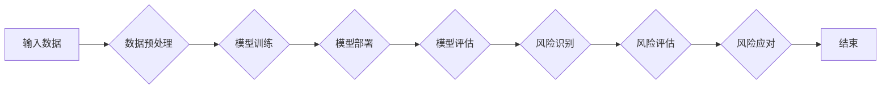

> 人工智能，基础模型，社会危害，风险评估，伦理，责任，透明度，公平性，可解释性，模型可解释性

# 基础模型的社会危害评估

人工智能（AI）的快速发展，尤其是深度学习在基础模型领域的应用，为各行各业带来了前所未有的变革。然而，随着AI技术的深入应用，其潜在的社会危害也日益凸显。本文将探讨基础模型可能带来的社会危害，并提出相应的评估方法，以期推动AI技术的健康发展。

## 1. 背景介绍

### 1.1 问题的由来

随着AI技术的普及，基础模型在图像识别、自然语言处理、推荐系统等领域发挥着越来越重要的作用。这些模型通过学习大量数据，能够自动识别复杂模式，但同时也存在一定的风险。例如，AI系统可能被用于歧视性决策、传播虚假信息、侵犯隐私等，从而对社会造成负面影响。

### 1.2 研究现状

近年来，越来越多的学者开始关注AI的社会危害问题。一些研究从伦理、法律、经济等方面对AI的危害进行了分析，并提出了一些缓解措施。然而，目前对基础模型的社会危害评估尚缺乏系统性的方法和标准。

### 1.3 研究意义

对基础模型进行社会危害评估，有助于：

1. 提高AI系统的透明度和可解释性，增强公众对AI技术的信任。
2. 促进AI技术的伦理和责任制度建设，降低AI对社会带来的风险。
3. 引导AI技术的健康发展，推动AI技术造福人类。

### 1.4 本文结构

本文将首先介绍基础模型的社会危害类型，然后提出一种基于风险评估的评估方法，并探讨其应用场景。最后，总结研究成果，展望未来发展趋势与挑战。

## 2. 核心概念与联系

### 2.1 核心概念

- **基础模型**：指在特定领域具有广泛适用性、能够自动学习复杂模式的AI模型，如卷积神经网络（CNN）、循环神经网络（RNN）、Transformer等。
- **社会危害**：指AI技术对社会产生的负面影响，包括但不限于歧视、侵犯隐私、虚假信息传播等。
- **风险评估**：指对潜在风险进行识别、评估和管理的过程。

### 2.2 核心概念原理和架构的 Mermaid 流程图



### 2.3 核心概念联系

在上述流程图中，输入数据经过预处理后用于训练基础模型，训练好的模型部署到实际场景中。在模型评估阶段，识别潜在风险，并进行风险评估，最终采取相应的风险应对措施。

## 3. 核心算法原理 & 具体操作步骤

### 3.1 算法原理概述

基于风险评估的基础模型社会危害评估方法，主要包括以下步骤：

1. **风险识别**：识别基础模型可能产生的社会危害类型，如歧视、侵犯隐私、虚假信息传播等。
2. **风险评估**：对识别出的风险进行量化评估，确定风险的严重程度。
3. **风险应对**：根据风险评估结果，采取相应的措施降低风险，如模型改进、伦理审查、法律法规等。

### 3.2 算法步骤详解

#### 3.2.1 风险识别

1. **危害类型分析**：根据AI应用场景和基础模型的特性，分析可能产生的社会危害类型。
2. **案例研究**：收集相关案例，分析案例中AI系统导致的社会危害。
3. **专家评估**：邀请相关领域的专家对危害类型进行分析和评估。

#### 3.2.2 风险评估

1. **量化指标设计**：设计能够量化风险程度的指标，如歧视指数、隐私泄露程度等。
2. **指标计算**：根据基础模型的输出和案例数据，计算量化指标。
3. **风险评估模型**：建立风险评估模型，将量化指标与风险等级进行关联。

#### 3.2.3 风险应对

1. **模型改进**：针对风险评估结果，对基础模型进行改进，降低风险。
2. **伦理审查**：对AI系统的设计、开发和部署进行伦理审查，确保符合伦理规范。
3. **法律法规**：制定相关法律法规，规范AI技术的发展和应用。

### 3.3 算法优缺点

#### 3.3.1 优点

1. **系统性**：基于风险评估的方法能够系统地识别、评估和管理基础模型的社会危害。
2. **量化评估**：量化指标能够更直观地反映风险程度，便于比较和分析。
3. **可操作性**：风险评估模型具有可操作性，便于实际应用。

#### 3.3.2 缺点

1. **指标设计难度**：量化指标的设计需要考虑多种因素，具有一定的难度。
2. **评估模型复杂**：风险评估模型的建立需要大量数据和专业知识，具有一定的复杂度。
3. **动态变化**：社会危害类型和风险程度会随着时间和社会环境的变化而变化，需要持续更新评估模型。

### 3.4 算法应用领域

基于风险评估的基础模型社会危害评估方法，可以应用于以下领域：

1. **金融领域**：评估信用评分模型的歧视风险，防止歧视性贷款和保险。
2. **医疗领域**：评估疾病诊断模型的误诊风险，确保医疗决策的准确性。
3. **招聘领域**：评估招聘算法的性别歧视风险，促进公平招聘。
4. **公共安全领域**：评估人脸识别等监控系统的隐私泄露风险，保护公民隐私。

## 4. 数学模型和公式 & 详细讲解 & 举例说明

### 4.1 数学模型构建

基于风险评估的基础模型社会危害评估方法，可以采用以下数学模型：

$$
R = f(I, E)
$$

其中，$R$ 表示风险等级，$I$ 表示量化指标，$E$ 表示外部因素，如社会环境、法律法规等。

### 4.2 公式推导过程

#### 4.2.1 量化指标设计

假设量化指标 $I$ 可以表示为：

$$
I = I_1 \cdot w_1 + I_2 \cdot w_2 + \cdots + I_n \cdot w_n
$$

其中，$I_1, I_2, \cdots, I_n$ 表示不同方面的量化指标，$w_1, w_2, \cdots, w_n$ 表示各指标的权重。

#### 4.2.2 风险等级计算

假设风险等级 $R$ 可以表示为：

$$
R = \begin{cases} 
R_1, & \text{if } I \geq I_0 \\
R_2, & \text{if } I < I_0 
\end{cases}
$$

其中，$R_1$ 和 $R_2$ 分别表示高风险和低风险等级，$I_0$ 表示风险阈值。

### 4.3 案例分析与讲解

假设我们评估一个招聘算法的性别歧视风险。我们可以设计以下量化指标：

- **性别偏见指数**：招聘算法对男性候选人和女性候选人的接受率差异。
- **岗位分布指数**：招聘算法推荐的男女候选人在不同岗位上的分布差异。

根据指标计算结果，我们可以得到招聘算法的性别歧视风险等级。

## 5. 项目实践：代码实例和详细解释说明

### 5.1 开发环境搭建

本节将以Python为例，介绍如何使用相关库进行基础模型社会危害评估。

### 5.2 源代码详细实现

```python
# 导入相关库
import numpy as np

# 定义量化指标计算函数
def calculate_indicators(male_acceptance_rate, female_acceptance_rate, job_distribution):
    bias_index = male_acceptance_rate - female_acceptance_rate
    distribution_index = np.sum(job_distribution) / len(job_distribution)
    return bias_index, distribution_index

# 定义风险等级计算函数
def calculate_risk_level(indicators, thresholds):
    bias_index, distribution_index = indicators
    risk_level = "高风险" if bias_index >= thresholds[0] or distribution_index >= thresholds[1] else "低风险"
    return risk_level

# 示例数据
male_acceptance_rate = 0.8
female_acceptance_rate = 0.6
job_distribution = [0.4, 0.3, 0.2, 0.1]

# 计算量化指标
indicators = calculate_indicators(male_acceptance_rate, female_acceptance_rate, job_distribution)

# 计算风险等级
thresholds = [0.1, 0.2]
risk_level = calculate_risk_level(indicators, thresholds)
print("招聘算法的性别歧视风险等级为：", risk_level)
```

### 5.3 代码解读与分析

上述代码定义了两个函数：`calculate_indicators` 用于计算量化指标，`calculate_risk_level` 用于计算风险等级。示例数据展示了如何使用这些函数评估招聘算法的性别歧视风险。

## 6. 实际应用场景

### 6.1 金融领域

在金融领域，基础模型社会危害评估可以帮助：

- 评估信贷风险评估模型的歧视风险，防止歧视性贷款和保险。
- 评估反欺诈模型的误报率，降低误报对客户造成的影响。

### 6.2 医疗领域

在医疗领域，基础模型社会危害评估可以帮助：

- 评估疾病诊断模型的误诊率，确保医疗决策的准确性。
- 评估药物推荐模型的潜在副作用，保障患者用药安全。

### 6.3 招聘领域

在招聘领域，基础模型社会危害评估可以帮助：

- 评估招聘算法的性别歧视风险，促进公平招聘。
- 评估招聘算法的地域歧视风险，消除地域偏见。

## 7. 工具和资源推荐

### 7.1 学习资源推荐

- 《人工智能伦理学》
- 《人工智能：一种现代的方法》
- 《深度学习》

### 7.2 开发工具推荐

- Scikit-learn：用于数据分析和机器学习
- TensorFlow：用于构建和训练深度学习模型
- PyTorch：用于构建和训练深度学习模型

### 7.3 相关论文推荐

- "Ethical Considerations in AI and Robotics" by Martha C. Nussbaum
- "Ethical AI in the Real World" by Kate Crawford
- "AI, Ethics, and Society" by the IEEE Global Initiative on Ethics of Autonomous Systems

## 8. 总结：未来发展趋势与挑战

### 8.1 研究成果总结

本文提出了基于风险评估的基础模型社会危害评估方法，并探讨了其在实际应用中的可行性。该方法能够系统地识别、评估和管理基础模型的社会危害，有助于推动AI技术的健康发展。

### 8.2 未来发展趋势

1. **评估方法更加完善**：随着研究的深入，评估方法将更加完善，评估指标将更加全面，评估模型将更加精确。
2. **评估工具更加便捷**：开发更加便捷的评估工具，降低评估门槛，使更多的人能够参与评估工作。
3. **评估结果更加开放**：评估结果将更加开放，促进AI技术的透明度和可解释性。

### 8.3 面临的挑战

1. **评估指标设计**：设计有效的评估指标需要考虑多种因素，具有一定的难度。
2. **评估模型复杂**：评估模型的建立需要大量数据和专业知识，具有一定的复杂度。
3. **伦理和责任**：如何确定AI系统的责任主体，以及如何追究责任，是当前面临的重要挑战。

### 8.4 研究展望

未来，我们将继续深入研究基础模型的社会危害评估方法，并探索以下方向：

1. **多模态数据评估**：将文本、图像、语音等多模态数据纳入评估体系，提高评估的全面性。
2. **动态风险评估**：建立动态风险评估模型，实时监测AI系统可能产生的社会危害。
3. **跨领域评估**：探索跨领域的基础模型社会危害评估方法，推动AI技术在更多领域的应用。

## 9. 附录：常见问题与解答

**Q1：什么是基础模型？**

A：基础模型是指具有广泛适用性、能够自动学习复杂模式的AI模型，如卷积神经网络（CNN）、循环神经网络（RNN）、Transformer等。

**Q2：什么是基础模型的社会危害？**

A：基础模型的社会危害是指AI技术对社会产生的负面影响，包括但不限于歧视、侵犯隐私、虚假信息传播等。

**Q3：如何评估基础模型的社会危害？**

A：可以采用基于风险评估的评估方法，识别、评估和管理基础模型的社会危害。

**Q4：基础模型的社会危害评估有哪些意义？**

A：基础模型的社会危害评估有助于提高AI系统的透明度和可解释性，促进AI技术的伦理和责任制度建设，推动AI技术的健康发展。

**Q5：未来基础模型的社会危害评估有哪些发展趋势？**

A：未来基础模型的社会危害评估将更加完善、便捷和开放，并探索多模态数据评估、动态风险评估、跨领域评估等新方向。

作者：禅与计算机程序设计艺术 / Zen and the Art of Computer Programming