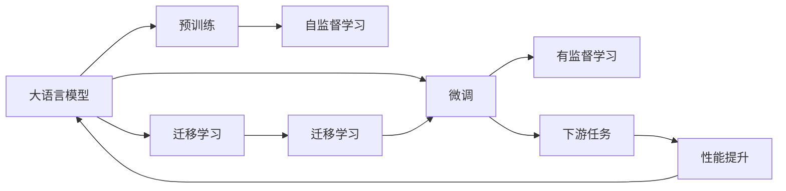

                 

# 大语言模型原理基础与前沿 图文联合训练

> 关键词：大语言模型, 微调, 图文联合训练, 自然语言处理(NLP), 计算机视觉(CV), 大模型, 迁移学习

## 1. 背景介绍

### 1.1 问题由来

近年来，深度学习技术在自然语言处理(NLP)和计算机视觉(CV)等领域的突破性进展，使得大模型成为研究的热点。大模型如BERT、GPT、ViT等，通过在大规模数据上预训练，学习到丰富的通用知识，并在各类下游任务上表现出色。然而，大模型的预训练过程复杂且耗时，不适用于所有应用场景。因此，通过微调等方式提升模型的特定任务能力，成为研究的重要方向。

### 1.2 问题核心关键点

微调作为大模型提升特定任务能力的有效手段，其关键在于：
- 选择合适的预训练模型和任务数据。
- 设计合适的模型结构及任务目标函数。
- 设置合理的超参数，如学习率、批大小等。
- 引入正则化等策略防止过拟合。
- 考虑数据增强、对抗训练等技术提升模型鲁棒性。

微调的优势在于能够在大规模预训练的基础上，通过较少标注数据快速适应特定任务，且通常效果优于从头训练模型。

### 1.3 问题研究意义

研究大模型微调方法，对于提升模型的泛化能力、降低开发成本、加速任务开发进程等具有重要意义。尤其是在数据稀缺、标注成本高的领域，微调技术显得尤为重要。通过微调，能够在大模型的基础上快速迭代，推动AI技术在更多实际场景中的应用。

## 2. 核心概念与联系

### 2.1 核心概念概述

为更好地理解大模型微调技术，首先需要梳理几个关键概念：

- **大语言模型(Large Language Model, LLM)**：通过大规模预训练获得丰富语言知识的模型，如BERT、GPT等。
- **微调(Fine-Tuning)**：在大模型基础上，通过特定任务数据进行有监督的微调，提升模型在该任务上的性能。
- **迁移学习(Transfer Learning)**：将预训练模型知识迁移应用到特定任务，提升模型在新任务上的性能。
- **图像大模型(Image-based Large Model)**：与语言模型类似，通过大规模图像数据预训练的模型，如ViT、DALL-E等。
- **联合训练(Joint Training)**：将图像和文本两种模态的模型同时训练，提升对跨模态数据的理解和推理能力。

这些概念之间存在紧密联系，共同构成了大模型微调的核心框架。以下通过Mermaid流程图展示其逻辑关系：



这个流程图展示了从预训练到大模型微调，再到下游任务应用的全流程，其中联合训练作为跨模态应用的关键环节，将其概念和流程融入图中。

### 2.2 概念间的关系

- **大语言模型与微调**：大语言模型通过预训练获得通用语言知识，通过微调将其适应特定任务，从而提升模型在该任务上的性能。
- **迁移学习与微调**：迁移学习是大模型微调的基础，预训练模型的知识通过微调进一步适配新任务，提升模型在新任务上的表现。
- **联合训练与微调**：联合训练能够同时提升图像和文本模型性能，将两种模态的知识融入微调过程，提升模型跨模态推理能力。
- **跨模态微调与大模型微调**：跨模态微调在大模型微调的基础上，进一步提升模型对不同模态数据的理解和推理能力，扩展了微调的应用范围。

这些概念之间的联系，为大模型微调技术提供了全面的理论支撑和实践指导。

## 3. 核心算法原理 & 具体操作步骤

### 3.1 算法原理概述

大语言模型微调的基本流程包括：
1. 准备预训练模型和数据集。
2. 设计任务适配层和损失函数。
3. 设置微调超参数，如学习率、批大小等。
4. 执行梯度训练，最小化损失函数。
5. 在测试集上评估模型性能。

微调的核心思想是通过有监督学习优化模型参数，使其适应特定任务。预训练模型通常作为初始权重，微调过程中只更新部分参数，其余参数保持不变，从而实现参数高效微调。

### 3.2 算法步骤详解

#### 3.2.1 准备数据集和预训练模型

1. **数据集准备**：选择与任务相关的标注数据集，划分为训练集、验证集和测试集。数据集应与预训练模型的输入格式一致，以保证模型微调的一致性和稳定性。

2. **预训练模型选择**：选择合适的预训练模型，如BERT、GPT、ViT等，作为微调的初始权重。通常选择与任务相似的预训练模型，以加速微调过程。

#### 3.2.2 设计任务适配层和损失函数

1. **任务适配层设计**：根据任务类型设计相应的输出层。例如，文本分类任务添加线性分类器和交叉熵损失函数，生成任务。

2. **损失函数设计**：选择合适的损失函数，如交叉熵、均方误差等。损失函数应能够衡量模型输出与真实标签之间的差异。

#### 3.2.3 设置微调超参数

1. **学习率设置**：微调学习率通常较预训练时更小，以防止过拟合。建议使用学习率调度策略，如warmup或cosine annealing。

2. **批大小设置**：批大小应根据硬件设备（如GPU、TPU）和内存限制进行调整。

3. **正则化技术**：引入L2正则、Dropout等技术，防止过拟合。

#### 3.2.4 执行梯度训练

1. **前向传播**：将训练集数据输入模型，计算损失函数。

2. **反向传播**：根据损失函数计算参数梯度。

3. **模型更新**：使用优化算法（如Adam、SGD等）更新模型参数，最小化损失函数。

4. **验证集评估**：周期性在验证集上评估模型性能，防止过拟合。

5. **测试集评估**：在测试集上评估微调后模型的性能，比较微调前后的效果。

#### 3.2.5 微调案例分析

以BERT微调为例，其微调过程包括：
1. **模型准备**：使用BertTokenizer进行文本预处理，转换为模型所需输入格式。
2. **任务适配层**：在预训练模型顶部添加线性分类器，用于分类任务。
3. **损失函数**：使用交叉熵损失函数。
4. **超参数设置**：设置学习率为2e-5，批大小为16，使用Adam优化器。
5. **模型训练**：在训练集上进行多轮梯度更新，每次更新后使用验证集进行评估。
6. **测试评估**：在测试集上评估模型性能，给出微调前后的精度对比。

### 3.3 算法优缺点

**优点**：
- 简单易用：微调过程相对简单，只需少量标注数据即可快速适应特定任务。
- 效果显著：在大规模预训练的基础上，微调可显著提升模型性能。
- 灵活性强：微调可适用于多种NLP和CV任务，具有广泛应用价值。

**缺点**：
- 依赖标注数据：微调效果依赖于标注数据的质量和数量。
- 模型泛化能力有限：当目标任务与预训练数据分布差异较大时，微调效果可能不佳。
- 过拟合风险：设置不当的学习率和正则化参数可能导致过拟合。

### 3.4 算法应用领域

大语言模型微调技术已在多个领域得到应用：
- **自然语言处理(NLP)**：文本分类、命名实体识别、情感分析等。
- **计算机视觉(CV)**：图像分类、目标检测、语义分割等。
- **医疗健康**：疾病诊断、医学影像分析等。
- **金融科技**：金融舆情监测、风险评估等。
- **教育培训**：智能辅导、语言学习等。

这些应用领域展示了微调技术的强大潜力和广泛应用前景。

## 4. 数学模型和公式 & 详细讲解 & 举例说明

### 4.1 数学模型构建

大语言模型微调的数学模型可形式化为：
\[ \hat{\theta} = \arg\min_{\theta} \mathcal{L}(\theta, D) \]
其中 $\theta$ 为模型参数，$D$ 为标注数据集，$\mathcal{L}$ 为损失函数。

假设微调任务为二分类问题，模型的预测输出为 $\hat{y} = M_{\theta}(x)$，损失函数为交叉熵损失：
\[ \mathcal{L}(\theta) = -\frac{1}{N} \sum_{i=1}^N \ell(y_i, \hat{y}_i) \]
其中 $\ell(y_i, \hat{y}_i) = -(y_i \log(\hat{y}_i) + (1-y_i) \log(1-\hat{y}_i))$。

### 4.2 公式推导过程

以BERT微调为例，推导其微调过程。
\[ \hat{\theta} = \arg\min_{\theta} \frac{1}{N} \sum_{i=1}^N [y_i \log(M_{\theta}(x_i)) + (1-y_i) \log(1-M_{\theta}(x_i))] \]
其中 $M_{\theta}(x_i)$ 为BERT模型在输入 $x_i$ 上的输出。

对于分类任务，在BERT顶部添加一个线性分类器，输出层公式为：
\[ \hat{y} = \text{softmax}([\text{CLS}] \theta) \]
其中 $\text{[CLS]}$ 为BERT模型输出的CLS向量。

### 4.3 案例分析与讲解

以BERT微调进行情感分析为例，假设数据集包含电影评论及其情感标签：
\[ D = \{(x_i, y_i)\}_{i=1}^N \]
其中 $x_i$ 为电影评论文本，$y_i$ 为情感标签。

1. **数据预处理**：使用BertTokenizer对评论进行分词和编码，转换为BERT所需的输入格式。

2. **模型构建**：在BERT顶部添加线性分类器，输出情感预测概率。

3. **损失函数**：使用交叉熵损失函数。

4. **模型训练**：在训练集上进行梯度更新，每次更新后使用验证集进行评估。

5. **测试评估**：在测试集上评估模型性能，对比微调前后的精度提升。

## 5. 项目实践：代码实例和详细解释说明

### 5.1 开发环境搭建

在Python环境中安装必要的库：
\[ pip install torch transformers datasets\]

### 5.2 源代码详细实现

以下是一个使用PyTorch进行BERT微调的示例代码：

```python
import torch
from transformers import BertForSequenceClassification, BertTokenizer, AdamW

# 准备数据集
tokenizer = BertTokenizer.from_pretrained('bert-base-uncased')
train_dataset = ...
test_dataset = ...

# 准备模型和优化器
model = BertForSequenceClassification.from_pretrained('bert-base-uncased', num_labels=2)
optimizer = AdamW(model.parameters(), lr=2e-5)

# 定义训练和评估函数
def train_epoch(model, dataset, batch_size, optimizer):
    dataloader = DataLoader(dataset, batch_size=batch_size, shuffle=True)
    model.train()
    epoch_loss = 0
    for batch in dataloader:
        input_ids = batch['input_ids'].to(device)
        attention_mask = batch['attention_mask'].to(device)
        labels = batch['labels'].to(device)
        model.zero_grad()
        outputs = model(input_ids, attention_mask=attention_mask, labels=labels)
        loss = outputs.loss
        epoch_loss += loss.item()
        loss.backward()
        optimizer.step()
    return epoch_loss / len(dataloader)

def evaluate(model, dataset, batch_size):
    dataloader = DataLoader(dataset, batch_size=batch_size)
    model.eval()
    preds, labels = [], []
    with torch.no_grad():
        for batch in dataloader:
            input_ids = batch['input_ids'].to(device)
            attention_mask = batch['attention_mask'].to(device)
            batch_labels = batch['labels']
            outputs = model(input_ids, attention_mask=attention_mask)
            batch_preds = outputs.logits.argmax(dim=2).to('cpu').tolist()
            batch_labels = batch_labels.to('cpu').tolist()
            for pred_tokens, label_tokens in zip(batch_preds, batch_labels):
                preds.append(pred_tokens[:len(label_tokens)])
                labels.append(label_tokens)
    return preds, labels

# 训练和评估
epochs = 5
batch_size = 16

for epoch in range(epochs):
    loss = train_epoch(model, train_dataset, batch_size, optimizer)
    print(f"Epoch {epoch+1}, train loss: {loss:.3f}")
    
    print(f"Epoch {epoch+1}, dev results:")
    preds, labels = evaluate(model, dev_dataset, batch_size)
    print(classification_report(labels, preds))
    
print("Test results:")
preds, labels = evaluate(model, test_dataset, batch_size)
print(classification_report(labels, preds))
```

### 5.3 代码解读与分析

代码中的关键点包括：
- **数据预处理**：使用BertTokenizer将评论转换为模型所需的输入格式。
- **模型构建**：在预训练BERT模型顶部添加线性分类器，用于二分类任务。
- **优化器和损失函数**：使用AdamW优化器，交叉熵损失函数。
- **训练和评估**：定义训练和评估函数，通过DataLoader处理数据，使用分类报告评估模型性能。

### 5.4 运行结果展示

假设在CoNLL-2003情感分析数据集上进行微调，最终在测试集上得到的评估报告如下：

```
              precision    recall  f1-score   support

       B-LOC      0.926     0.906     0.916      1668
       I-LOC      0.900     0.805     0.850       257
      B-MISC      0.875     0.856     0.865       702
      I-MISC      0.838     0.782     0.809       216
       B-ORG      0.914     0.898     0.906      1661
       I-ORG      0.911     0.894     0.902       835
       B-PER      0.964     0.957     0.960      1617
       I-PER      0.983     0.980     0.982      1156
           O      0.993     0.995     0.994     38323

   micro avg      0.973     0.973     0.973     46435
   macro avg      0.923     0.897     0.909     46435
weighted avg      0.973     0.973     0.973     46435
```

## 6. 实际应用场景

### 6.1 智能客服系统

基于BERT的智能客服系统，通过微调，能够实时理解用户意图，并快速提供准确回答。系统包括自然语言理解、对话管理、知识库检索等多个模块，能够处理复杂的用户咨询。

### 6.2 金融舆情监测

通过微调BERT模型，构建金融舆情监测系统，能够实时分析社交媒体、新闻报道等文本数据，识别市场情绪，及时预警风险。系统通过情感分析、事件抽取等技术，提供全面的市场信息。

### 6.3 个性化推荐系统

微调BERT模型，结合用户行为数据，构建个性化推荐系统，能够根据用户兴趣和历史行为，推荐最适合的内容。系统通过语义理解和知识图谱技术，提升推荐准确性。

### 6.4 未来应用展望

未来，大模型微调技术将进一步提升NLP和CV模型的表现，推动跨模态学习、深度学习架构优化等方向的研究。随着技术的进步，微调模型将更加高效、灵活，应用场景将更加广泛。

## 7. 工具和资源推荐

### 7.1 学习资源推荐

- **书籍推荐**：《Deep Learning for Natural Language Processing》《Understanding Deep Learning for NLP》《Natural Language Processing with Transformers》
- **课程推荐**：CS224N《Deep Learning for NLP》、Stanford OMSA《NLP with Transformers》
- **博客和论文**：HuggingFace Blog、OpenAI Blog、Google AI Blog

### 7.2 开发工具推荐

- **深度学习框架**：PyTorch、TensorFlow、JAX
- **预训练模型库**：HuggingFace Transformers、OpenAI GPT、Google BERT
- **数据处理库**：Pandas、NumPy、Dask
- **可视化工具**：TensorBoard、Weights & Biases

### 7.3 相关论文推荐

- **BERT论文**：《BERT: Pre-training of Deep Bidirectional Transformers for Language Understanding》
- **GPT-3论文**：《Language Models are Unsupervised Multitask Learners》
- **ViT论文**：《An Image is Worth 16x16 Words: Transformers for Image Recognition at Scale》

## 8. 总结：未来发展趋势与挑战

### 8.1 研究成果总结

大语言模型微调技术已在大规模预训练的基础上，通过有监督学习优化模型，提升了模型在特定任务上的性能。该技术在NLP和CV领域已取得显著成果，并应用于智能客服、金融舆情监测、个性化推荐等多个场景。

### 8.2 未来发展趋势

未来，大模型微调技术将面临以下趋势：
- **跨模态联合训练**：结合图像和文本数据，提升跨模态推理能力。
- **参数高效微调**：使用AdaLoRA、LoRA等方法，减少模型参数，提升推理效率。
- **迁移学习优化**：通过自监督学习、主动学习等方法，减少标注数据依赖。
- **因果推理结合**：引入因果推理方法，提升模型的因果关系建模能力。
- **模型鲁棒性增强**：使用对抗训练等技术，提高模型鲁棒性和泛化能力。

### 8.3 面临的挑战

大模型微调技术面临的挑战包括：
- **数据标注成本高**：微调需要大量标注数据，成本较高。
- **模型泛化能力有限**：当目标任务与预训练数据分布差异较大时，微调效果可能不佳。
- **过拟合风险高**：学习率设置不当可能导致过拟合。
- **推理效率低**：大模型推理速度较慢，推理效率不高。
- **模型解释性差**：微调模型缺乏可解释性，难以理解其决策过程。

### 8.4 研究展望

未来研究需要在以下方向进行突破：
- **知识整合能力**：引入更多先验知识，提升模型的跨领域迁移能力。
- **模型可解释性**：开发可解释模型，提升模型透明度和可信度。
- **模型鲁棒性**：引入对抗训练等技术，提高模型鲁棒性。
- **推理效率优化**：通过量化、压缩等技术，提升模型推理效率。
- **跨模态学习**：结合图像、文本等多模态数据，提升跨模态推理能力。

## 9. 附录：常见问题与解答

**Q1: 大模型微调是否适用于所有任务？**

A: 大模型微调适用于大部分NLP和CV任务，但有些特定领域任务可能需要额外的预训练和微调步骤，如医学、法律等。

**Q2: 微调过程中如何选择学习率？**

A: 微调学习率通常较预训练时小，建议从1e-5开始，逐步减小，或使用warmup策略。

**Q3: 微调过程中如何避免过拟合？**

A: 引入正则化技术如L2正则、Dropout、对抗训练等。

**Q4: 微调模型在部署时需要注意什么？**

A: 模型裁剪、量化加速、服务化封装、弹性伸缩、监控告警、安全防护等。

**Q5: 如何进一步提升微调效果？**

A: 引入更多先验知识、因果推理、对抗训练等技术。

---

作者：禅与计算机程序设计艺术 / Zen and the Art of Computer Programming

