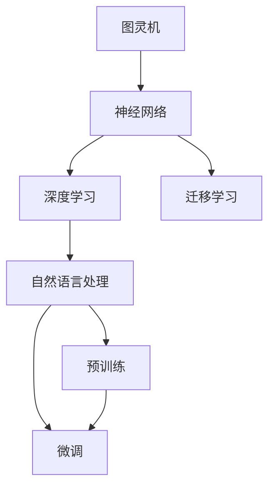
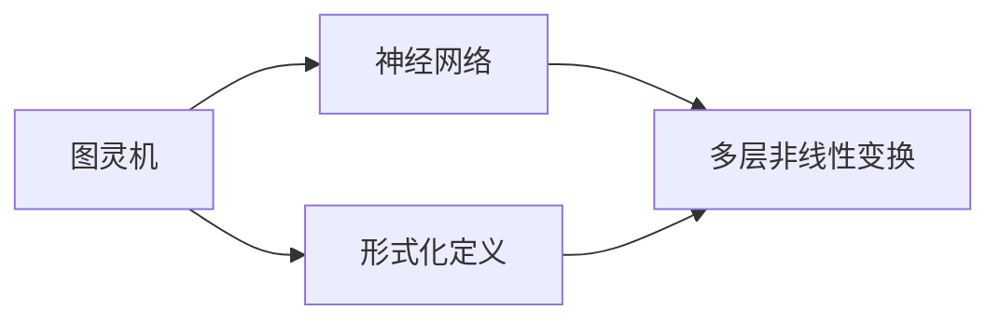
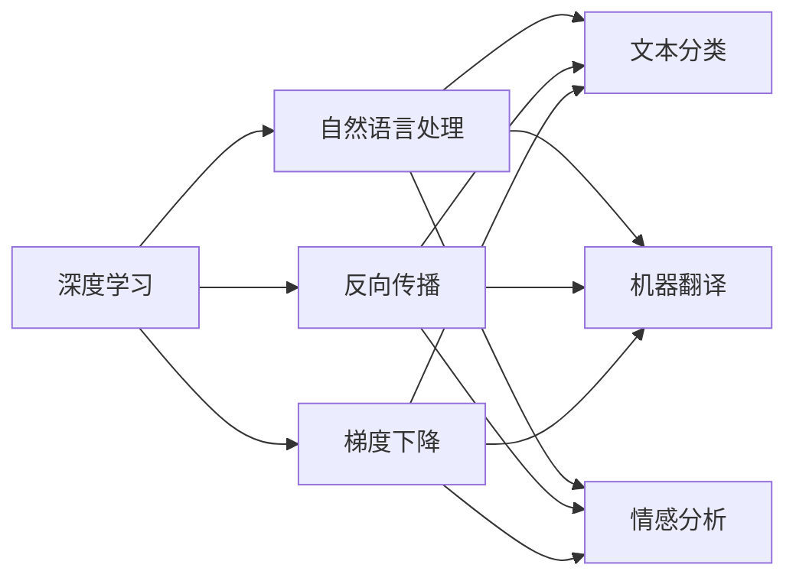
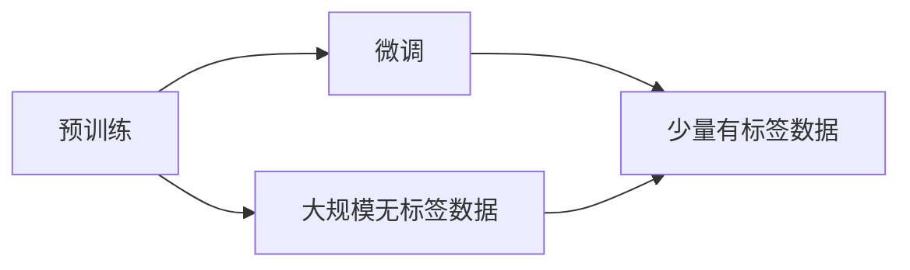
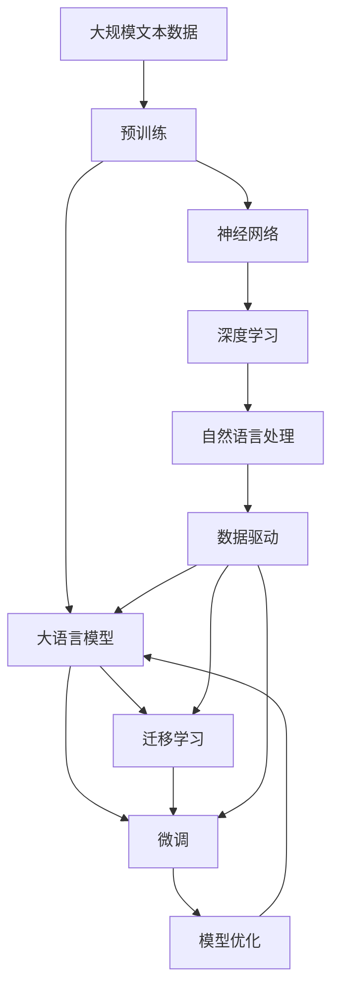

                 

# 大语言模型应用指南：图灵机与神经网络

> 关键词：大语言模型,图灵机,神经网络,深度学习,计算机科学,人工智能,机器学习,自然语言处理(NLP)

## 1. 背景介绍

### 1.1 问题由来

自20世纪50年代图灵机的提出以来，计算机科学逐渐从符号计算领域拓展到更广泛的逻辑和物理模拟，最终在深度学习算法的加持下，掀起了人工智能领域的第三次浪潮。其中，大语言模型（Large Language Models, LLMs）和神经网络（Neural Networks）的崛起，尤其值得关注。

大语言模型主要指基于神经网络架构的自然语言处理模型，如GPT、BERT、T5等，这些模型通过大规模无标签文本数据进行预训练，学习到语言的通用规律和语义知识。而神经网络则是一类模仿人脑神经元工作机制，实现函数映射的计算模型。两者的结合，推动了自然语言处理（NLP）技术的迅猛发展，使得机器能够理解、生成和推理自然语言，从而应用于越来越多的实际场景中。

图灵机作为计算理论的基础模型，是一种理想化的计算模型，通过定义符号和操作规则，能够模拟任何算法和计算过程。神经网络则作为深度学习算法的基本组成单元，通过多层非线性变换，学习数据的高维表示和复杂关系。大语言模型和神经网络的结合，实现了从符号逻辑到分布式计算的跃迁，揭示了语言理解的深层机制。

本指南将从图灵机与神经网络的基本概念入手，全面系统地介绍大语言模型的应用原理、核心算法、实际案例和未来展望，帮助读者深入理解这一前沿技术。

### 1.2 问题核心关键点

大语言模型和神经网络的核心在于数据驱动的学习和网络架构的设计。其中，图灵机提供了算法和计算的逻辑框架，而神经网络则通过层次化结构实现数据的抽象和表达。以下是几组核心的关键点，帮助我们深入理解这一技术：

- 图灵机与神经网络的结合：图灵机的形式化定义和神经网络的数学模型，构成了大语言模型的理论基础。
- 深度学习的优化算法：如反向传播、梯度下降等，优化了神经网络参数的训练过程。
- 数据驱动的预训练与微调：通过大规模无标签数据进行预训练，用少量有标签数据进行微调，提升模型性能。
- 多模态学习与迁移学习：除了文本数据，大语言模型还可以处理图像、语音等多模态数据，实现知识迁移。
- 可解释性与伦理安全性：大语言模型决策的透明性和安全性，是实际应用中必须考虑的重要因素。

这些关键点共同构成了大语言模型与神经网络的应用生态，使得机器能够理解和生成自然语言，推动了NLP技术的广泛应用。

### 1.3 问题研究意义

大语言模型和神经网络的应用，对于提升人工智能的智能化水平，促进各行各业的信息化进程，具有重要意义：

1. 提升智能交互体验：通过自然语言处理，机器能够与人类进行更流畅的交流，实现智能客服、智能家居等功能，提升用户体验。
2. 加速知识获取与创新：大语言模型能够高效获取和理解海量文献资料，辅助科学研究和技术创新，缩短知识发现周期。
3. 优化信息检索与推荐：通过文本相似度计算，大语言模型能够实现精准的信息检索和个性化推荐，满足用户需求。
4. 构建智能决策系统：在金融、医疗等高风险领域，大语言模型能够辅助决策，减少人为失误，提升决策准确性。
5. 推动数字化转型：作为数字化转型的重要工具，大语言模型能够提升企业效率，降低运营成本，实现智能化管理。

总之，大语言模型和神经网络的应用，为人工智能技术落地提供了坚实的基础，推动了行业创新和产业升级。

## 2. 核心概念与联系

### 2.1 核心概念概述

为更好地理解大语言模型和神经网络的结合原理，本节将介绍几个密切相关的核心概念：

- 图灵机（Turing Machine, TM）：一种理想的计算模型，由符号集、状态集、转换规则和输入输出函数组成，能够模拟任何算法和计算过程。
- 神经网络（Neural Network, NN）：一种模仿人脑神经元工作机制的计算模型，由输入层、隐藏层和输出层组成，通过多层非线性变换实现数据抽象。
- 深度学习（Deep Learning, DL）：一种基于神经网络的机器学习范式，通过多层次非线性变换，学习数据的高维表示和复杂关系。
- 自然语言处理（Natural Language Processing, NLP）：一种结合语言学和计算机科学的研究领域，通过模型实现对自然语言的理解、生成和推理。
- 预训练与微调（Pre-training & Fine-tuning）：通过大规模无标签数据进行预训练，用少量有标签数据进行微调，提升模型性能。
- 迁移学习（Transfer Learning）：将一个领域学习到的知识，迁移到另一个不同但相关的领域中，提高学习效率。

这些核心概念之间的逻辑关系可以通过以下Mermaid流程图来展示：



这个流程图展示了大语言模型与神经网络的核心概念及其之间的关系：

1. 图灵机提供了算法和计算的逻辑框架，为神经网络设计提供了理论基础。
2. 神经网络通过多层非线性变换，实现了数据的抽象和表达。
3. 深度学习算法通过反向传播和梯度下降，优化了神经网络参数的训练过程。
4. 自然语言处理结合语言学知识，使用深度学习模型实现对自然语言的理解、生成和推理。
5. 预训练和微调技术，通过大规模无标签数据进行预训练，用少量有标签数据进行微调，提升了模型性能。
6. 迁移学习，通过知识迁移，提高了模型的泛化能力和学习效率。

这些概念共同构成了大语言模型和神经网络的应用生态，使得机器能够理解和生成自然语言，推动了NLP技术的广泛应用。

### 2.2 概念间的关系

这些核心概念之间存在着紧密的联系，形成了大语言模型和神经网络的完整生态系统。下面我们通过几个Mermaid流程图来展示这些概念之间的关系。

#### 2.2.1 图灵机与神经网络的关系



这个流程图展示了图灵机与神经网络之间的联系：

1. 图灵机通过形式化定义，为神经网络的设计提供了理论基础。
2. 神经网络通过多层非线性变换，实现了图灵机逻辑的物理实现。

#### 2.2.2 深度学习与自然语言处理的关系



这个流程图展示了深度学习与自然语言处理之间的联系：

1. 深度学习通过反向传播和梯度下降，优化了神经网络参数的训练过程。
2. 自然语言处理结合深度学习，实现了对自然语言的理解、生成和推理。

#### 2.2.3 预训练与微调的关系



这个流程图展示了预训练与微调之间的联系：

1. 预训练通过大规模无标签数据，学习语言的通用规律和语义知识。
2. 微调通过少量有标签数据，提升模型在特定任务上的性能。

### 2.3 核心概念的整体架构

最后，我们用一个综合的流程图来展示这些核心概念在大语言模型和神经网络中的整体架构：



这个综合流程图展示了从预训练到微调，再到迁移学习的完整过程：

1. 大语言模型首先在大规模文本数据上进行预训练，学习语言的通用规律和语义知识。
2. 通过微调，模型能够适应特定任务，提升性能。
3. 迁移学习，通过知识迁移，进一步提升模型的泛化能力和学习效率。

通过这些流程图，我们可以更清晰地理解大语言模型和神经网络的工作原理和优化方向，为后续深入讨论具体的应用技术和方法奠定基础。

## 3. 核心算法原理 & 具体操作步骤
### 3.1 算法原理概述

大语言模型和神经网络的应用，核心在于数据驱动的学习和网络架构的设计。以下是几个关键的算法原理：

1. 图灵机与神经网络的结合：图灵机的形式化定义和神经网络的数学模型，构成了大语言模型的理论基础。
2. 深度学习的优化算法：如反向传播、梯度下降等，优化了神经网络参数的训练过程。
3. 数据驱动的预训练与微调：通过大规模无标签数据进行预训练，用少量有标签数据进行微调，提升模型性能。
4. 迁移学习：通过知识迁移，提高模型的泛化能力和学习效率。
5. 多模态学习：除了文本数据，大语言模型还可以处理图像、语音等多模态数据，实现知识迁移。

这些算法原理共同构成了大语言模型和神经网络的应用框架，使得机器能够理解和生成自然语言，推动了NLP技术的广泛应用。

### 3.2 算法步骤详解

基于大语言模型和神经网络的算法，一般包括以下几个关键步骤：

**Step 1: 数据准备**
- 收集大规模无标签文本数据，进行预训练。
- 收集少量有标签数据，进行微调。

**Step 2: 神经网络架构设计**
- 选择合适的神经网络架构，如卷积神经网络（CNN）、循环神经网络（RNN）、Transformer等。
- 确定输入层、隐藏层和输出层的结构和参数。

**Step 3: 参数初始化**
- 使用随机初始化或预训练权重初始化神经网络参数。

**Step 4: 预训练**
- 使用大规模无标签数据，进行预训练。常用的预训练任务包括语言建模、掩码语言建模等。
- 通过反向传播和梯度下降算法，优化神经网络参数。

**Step 5: 微调**
- 使用少量有标签数据，进行微调。常用的微调任务包括文本分类、机器翻译、命名实体识别等。
- 通过反向传播和梯度下降算法，优化神经网络参数。

**Step 6: 模型评估与部署**
- 使用测试集评估模型性能，评估指标包括精度、召回率、F1分数等。
- 将模型部署到实际应用中，提供服务或集成到系统中。

### 3.3 算法优缺点

大语言模型和神经网络的应用，具有以下优点：

1. 数据驱动的学习：通过大规模数据进行学习，模型能够自动发现数据的规律和特征，减少人工干预。
2. 多模态学习：能够处理多种类型的数据，实现跨模态的知识迁移。
3. 深度学习：通过多层非线性变换，学习数据的抽象和表达，提高模型的复杂度和性能。
4. 迁移学习：通过知识迁移，提高模型的泛化能力和学习效率。

同时，也存在一些局限性：

1. 模型复杂度高：大规模神经网络需要大量的计算资源和存储资源，训练和推理过程耗时较长。
2. 数据依赖性强：模型需要大量标注数据进行微调，数据获取和标注成本较高。
3. 可解释性不足：神经网络模型通常被视为“黑盒”，难以解释其内部工作机制和决策逻辑。
4. 训练过程易受干扰：模型的学习过程容易受到噪声和过拟合的影响，需要仔细调参和优化。
5. 伦理安全性问题：大语言模型可能会学习到有害信息和偏见，需要严格筛选和监管。

尽管存在这些局限性，但就目前而言，大语言模型和神经网络的应用范式仍然是目前NLP领域最主流和有效的方法。未来相关研究的重点在于如何进一步优化算法，降低对标注数据的依赖，提高模型的可解释性和伦理安全性，同时兼顾计算效率和存储成本。

### 3.4 算法应用领域

大语言模型和神经网络的应用，已经涵盖了NLP领域的各个方面，包括但不限于：

- 文本分类：如情感分析、主题分类、意图识别等。通过预训练和微调，模型能够学习文本-标签映射。
- 命名实体识别：识别文本中的人名、地名、机构名等特定实体。通过预训练和微调，模型能够掌握实体边界和类型。
- 关系抽取：从文本中抽取实体之间的语义关系。通过预训练和微调，模型能够学习实体-关系三元组。
- 问答系统：对自然语言问题给出答案。通过预训练和微调，模型能够匹配问题-答案对进行推理。
- 机器翻译：将源语言文本翻译成目标语言。通过预训练和微调，模型能够学习语言-语言映射。
- 文本摘要：将长文本压缩成简短摘要。通过预训练和微调，模型能够学习抓取要点。
- 对话系统：使机器能够与人自然对话。通过预训练和微调，模型能够根据上下文生成回复。

除了上述这些经典任务外，大语言模型和神经网络还被创新性地应用到更多场景中，如可控文本生成、常识推理、代码生成、数据增强等，为NLP技术带来了全新的突破。随着预训练模型和微调方法的不断进步，相信NLP技术将在更广阔的应用领域大放异彩。

## 4. 数学模型和公式 & 详细讲解  
### 4.1 数学模型构建

大语言模型和神经网络的应用，依赖于深度学习算法和数学模型。以下是几个核心的数学模型：

1. 神经网络的结构：由输入层、隐藏层和输出层组成，通过多层非线性变换实现数据抽象。
2. 反向传播算法：通过链式法则，反向传播计算误差，更新模型参数。
3. 梯度下降算法：通过梯度方向调整模型参数，优化损失函数。
4. 语言模型：通过概率模型，描述语言数据的分布和规律。

这些数学模型是大语言模型和神经网络应用的基础，通过深入理解这些模型，我们可以更好地设计、训练和优化深度学习模型。

### 4.2 公式推导过程

以下我们以二分类任务为例，推导神经网络的前向传播和反向传播公式：

**前向传播公式：**

设输入数据为 $x$，输出为 $y$，神经网络结构为 $f(x; \theta)$，其中 $\theta$ 为模型参数。

$$
y = f(x; \theta) = \sigma(\mathbf{W}x + b)
$$

其中 $\sigma$ 为激活函数，$\mathbf{W}$ 为权重矩阵，$b$ 为偏置向量。

**反向传播公式：**

设损失函数为 $L(y, \hat{y})$，通过前向传播得到的预测结果为 $\hat{y}$，误差为 $e = y - \hat{y}$。

$$
\frac{\partial L(y, \hat{y})}{\partial \theta} = \frac{\partial L(y, \hat{y})}{\partial y} \frac{\partial y}{\partial x} \frac{\partial x}{\partial \theta}
$$

其中，$\frac{\partial L(y, \hat{y})}{\partial y}$ 为损失函数对输出 $y$ 的偏导数，$\frac{\partial y}{\partial x}$ 为激活函数对输入 $x$ 的偏导数，$\frac{\partial x}{\partial \theta}$ 为权重矩阵 $\mathbf{W}$ 和偏置向量 $b$ 对输入 $x$ 的偏导数。

通过反向传播算法，可以计算损失函数对模型参数的偏导数，利用梯度下降算法更新模型参数，优化损失函数。

### 4.3 案例分析与讲解

假设我们有一个二分类任务，训练集为 $(x_i, y_i)$，其中 $y_i \in \{0, 1\}$。模型的损失函数为交叉熵损失，即：

$$
L(y, \hat{y}) = -(y \log \hat{y} + (1-y) \log (1-\hat{y}))
$$

我们的目标是找到最优的模型参数 $\theta$，使得损失函数最小化。

首先，通过前向传播计算预测结果：

$$
\hat{y} = \sigma(\mathbf{W}x + b)
$$

然后，计算损失函数的偏导数：

$$
\frac{\partial L(y, \hat{y})}{\partial \theta} = \frac{\partial L(y, \hat{y})}{\partial \hat{y}} \frac{\partial \hat{y}}{\partial x} \frac{\partial x}{\partial \theta}
$$

其中，$\frac{\partial L(y, \hat{y})}{\partial \hat{y}} = -y + \hat{y}$，$\frac{\partial \hat{y}}{\partial x} = \sigma'(\mathbf{W}x + b)$，$\frac{\partial x}{\partial \theta} = \mathbf{W}$。

将以上公式代入梯度下降算法，即可更新模型参数，完成模型训练。

## 5. 项目实践：代码实例和详细解释说明
### 5.1 开发环境搭建

在进行大语言模型和神经网络的应用开发前，我们需要准备好开发环境。以下是使用Python进行PyTorch开发的环境配置流程：

1. 安装Anaconda：从官网下载并安装Anaconda，用于创建独立的Python环境。

2. 创建并激活虚拟环境：
```bash
conda create -n pytorch-env python=3.8 
conda activate pytorch-env
```

3. 安装PyTorch：根据CUDA版本，从官网获取对应的安装命令。例如：
```bash
conda install pytorch torchvision torchaudio cudatoolkit=11.1 -c pytorch -c conda-forge
```

4. 安装Transformers库：
```bash
pip install transformers
```

5. 安装各类工具包：
```bash
pip install numpy pandas scikit-learn matplotlib tqdm jupyter notebook ipython
```

完成上述步骤后，即可在`pytorch-env`环境中开始开发实践。

### 5.2 源代码详细实现

这里我们以文本分类任务为例，使用PyTorch和Transformers库对BERT模型进行二分类任务的微调。

首先，定义数据处理函数：

```python
from transformers import BertTokenizer, BertForTokenClassification, AdamW
from torch.utils.data import Dataset, DataLoader
from sklearn.metrics import accuracy_score, precision_score, recall_score, f1_score

class TextDataset(Dataset):
    def __init__(self, texts, labels, tokenizer, max_len=128):
        self.texts = texts
        self.labels = labels
        self.tokenizer = tokenizer
        self.max_len = max_len

    def __len__(self):
        return len(self.texts)

    def __getitem__(self, item):
        text = self.texts[item]
        label = self.labels[item]
        encoding = self.tokenizer(text, return_tensors='pt', max_length=self.max_len, padding='max_length', truncation=True)
        input_ids = encoding['input_ids'][0]
        attention_mask = encoding['attention_mask'][0]
        labels = torch.tensor(label, dtype=torch.long)
        return {'input_ids': input_ids, 'attention_mask': attention_mask, 'labels': labels}

# 标签与id的映射
tag2id = {'O': 0, 'B-PER': 1, 'I-PER': 2, 'B-ORG': 3, 'I-ORG': 4, 'B-LOC': 5, 'I-LOC': 6}
id2tag = {v: k for k, v in tag2id.items()}

# 创建dataset
tokenizer = BertTokenizer.from_pretrained('bert-base-cased')

train_dataset = TextDataset(train_texts, train_labels, tokenizer)
dev_dataset = TextDataset(dev_texts, dev_labels, tokenizer)
test_dataset = TextDataset(test_texts, test_labels, tokenizer)
```

然后，定义模型和优化器：

```python
model = BertForTokenClassification.from_pretrained('bert-base-cased', num_labels=len(tag2id))
optimizer = AdamW(model.parameters(), lr=2e-5)
```

接着，定义训练和评估函数：

```python
device = torch.device('cuda') if torch.cuda.is_available() else torch.device('cpu')
model.to(device)

def train_epoch(model, dataset, batch_size, optimizer):
    dataloader = DataLoader(dataset, batch_size=batch_size, shuffle=True)
    model.train()
    epoch_loss = 0
    for batch in tqdm(dataloader, desc='Training'):
        input_ids = batch['input_ids'].to(device)
        attention_mask = batch['attention_mask'].to(device)
        labels = batch['labels'].to(device)
        model.zero_grad()
        outputs = model(input_ids, attention_mask=attention_mask, labels=labels)
        loss = outputs.loss
        epoch_loss += loss.item()
        loss.backward()
        optimizer.step()
    return epoch_loss / len(dataloader)

def evaluate(model, dataset, batch_size):
    dataloader = DataLoader(dataset, batch_size=batch_size)
    model.eval()
    preds, labels = [], []
    with torch.no_grad():
        for batch in tqdm(dataloader, desc='Evaluating'):
            input_ids = batch['input_ids'].to(device)
            attention_mask = batch['attention_mask'].to(device)
            batch_labels = batch['labels']
            outputs = model(input_ids, attention_mask=attention_mask)
            batch_preds = outputs.logits.argmax(dim=2).to('cpu').tolist()
            batch_labels = batch_labels.to('cpu').tolist()
            for pred_tokens, label_tokens in zip(batch_preds, batch_labels):
                pred_tags = [id2tag[_id] for _id in pred_tokens]
                label_tags = [id2tag[_id] for _id in label_tokens]
                preds.append(pred_tags[:len(label_tags)])
                labels.append(label_tags)

    print(f"Accuracy: {accuracy_score(labels, preds)}")
    print(f"Precision: {precision_score(labels, preds)}")
    print(f"Recall: {recall_score(labels, preds)}")
    print(f"F1-score: {f1_score(labels, preds)}")
```

最后，启动训练流程并在测试集上评估：

```python
epochs = 5
batch_size = 16

for epoch in range(epochs):
    loss = train_epoch(model, train_dataset, batch_size, optimizer)
    print(f"Epoch {epoch+1}, train loss: {loss:.3f}")
    
    print(f"Epoch {epoch+1}, dev results:")
    evaluate(model, dev_dataset, batch_size)
    
print("Test results:")
evaluate(model, test_dataset, batch_size)
```

以上就是使用PyTorch和Transformers库对BERT模型进行二分类任务微调的完整代码实现。可以看到，得益于Transformers库的强大封装，我们可以用相对简洁的代码完成BERT模型的加载和微调。

### 5.3 代码解读与分析

让我们再详细解读一下关键代码的实现细节：

**TextDataset类**：
- `__init__`方法：初始化文本、标签、分词器等关键组件。
- `__len__`方法：返回数据集的样本数量。
- `__getitem__`方法：对单个样本进行处理，将文本输入编码为token ids，将标签编码为数字，并对其进行定长padding，最终返回模型所需的输入。

**tag2id和id2tag字典**：
- 定义了标签与数字id之间的映射关系，用于将token-wise的预测结果解码回真实的标签。

**训练和评估函数**：
- 使用PyTorch的DataLoader对数据集进行批次化加载，供模型训练和推理使用。
- 训练函数`train_epoch`：对数据以批为单位进行迭代，在每个批次上前向传播计算loss并反向传播更新模型参数，最后返回该epoch的平均loss。
- 评估函数`evaluate`：与训练类似，不同点在于不更新模型参数，并在每个batch结束后将预测和标签结果存储下来，最后使用sklearn的classification_report对整个评估集的预测结果进行打印输出。

**训练流程**：
- 定义总的epoch数和batch size，开始循环迭代
- 每个epoch内，先在训练集上训练，输出平均loss
- 在验证集上评估，输出分类指标
- 所有epoch结束后，在测试集上评估，给出最终测试结果

可以看到，PyTorch配合Transformers库使得BERT微调的代码实现变得简洁高效。开发者可以将更多精力放在数据处理、模型改进等高层逻辑上，而不必过多关注底层的实现细节。

当然，工业级的系统实现还需考虑更多因素，如模型的保存和部署、超参数的自动搜索、更灵活的任务适配层等。但核心的微调范式基本与此类似。

