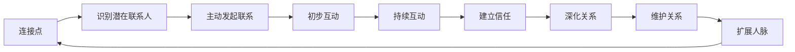
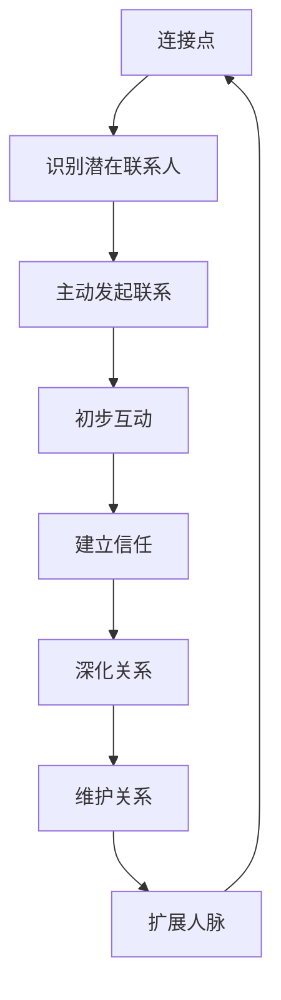

                 

# 如何进行人脉拓展：如何建立和维护人际关系？

## 1. 背景介绍

### 1.1 问题由来
在当今这个信息爆炸、竞争激烈的时代，人脉的重要性愈发凸显。无论是职业发展、学术研究还是个人生活，高质量的人脉网络都能为个人带来不可估量的价值。然而，如何有效地拓展和维护人脉，对于很多人来说仍然是一个巨大的挑战。本文将围绕人脉拓展的核心概念和关键步骤进行详细阐述，帮助读者建立和维护一个高效、健康的人脉网络。

### 1.2 问题核心关键点
人脉拓展的核心在于通过有效的交流和互动，建立和深化与他人的联系。其关键点包括：
- 选择合适的交流平台和策略，提升曝光度和识别率。
- 理解并应用人际关系心理学原理，建立互信基础。
- 通过持续的互动和反馈，巩固和深化人脉关系。

### 1.3 问题研究意义
高质量的人脉网络能够带来多方面的利益，包括但不限于：
- 职业机会：通过人脉获取更多工作机会和职业发展资源。
- 学术合作：借助人脉拓展研究领域，进行学术交流和合作。
- 生活便利：通过人脉获得生活服务，如法律咨询、健康医疗等。
- 信息获取：借助人脉获取行业动态和最新信息，保持竞争优势。

## 2. 核心概念与联系

### 2.1 核心概念概述
在拓展和维护人脉网络的过程中，涉及到多个核心概念，如连接点、信任、互动等。这些概念相互关联，共同构成了人脉拓展的框架。

- **连接点**：指能够促使你与他人建立联系的共同点，如共同的兴趣爱好、专业领域等。
- **信任**：指人与人之间建立的互信关系，是人脉关系长期维持的基础。
- **互动**：指通过交流、合作等方式，加深人与人之间的了解和联系。

### 2.2 核心概念原理和架构

以下是一个Mermaid流程图，展示了人脉拓展的核心概念和它们之间的联系：



该流程图展示了从识别潜在联系人到维护和扩展人脉的整个过程。连接点是拓展人脉的起点，通过识别潜在的联系人，主动发起联系，并进行初步互动，逐步建立信任，深化关系，并最终维护和扩展人脉。

### 2.3 核心概念的整体架构

我们还可以用一个综合性的流程图来展示人脉拓展的整体架构：



这个综合流程图展示了从连接点到人脉拓展的完整过程。通过连接点识别潜在联系人，并主动发起联系。通过初步互动建立信任，深化关系，并最终维护和扩展人脉网络。

## 3. 核心算法原理 & 具体操作步骤
### 3.1 算法原理概述

人脉拓展的本质是一个动态的学习过程，通过不断地观察和调整，逐步构建和优化人脉网络。这个过程可以分解为以下几个关键步骤：

1. **识别潜在联系人**：通过各种渠道识别潜在的联系人，并评估其与你建立人脉的价值。
2. **主动发起联系**：通过社交媒体、专业论坛、线下活动等方式，主动与潜在联系人建立联系。
3. **初步互动**：通过简单的问候、讨论共同兴趣等方式，进行初步的互动和交流。
4. **建立信任**：通过提供价值、展现专业能力等方式，逐步建立互信关系。
5. **深化关系**：通过定期互动、提供帮助等方式，深化与他人的关系。
6. **维护关系**：通过保持沟通、关注对方动态等方式，维护已有的人脉关系。

### 3.2 算法步骤详解

以下是一个详细的人脉拓展操作步骤：

#### 步骤1：识别潜在联系人
- **渠道选择**：选择合适的社交平台（如LinkedIn、Facebook、Twitter等）和专业社区（如GitHub、Stack Overflow等）。
- **关键词搜索**：使用关键词搜索潜在联系人，如姓名、职业、兴趣等。
- **筛选评估**：根据潜在联系人的职位、影响力、兴趣等指标进行筛选和评估，选择最具潜力的联系人。

#### 步骤2：主动发起联系
- **个性化问候**：通过个性化的问候信或评论，吸引潜在联系人的注意。
- **价值展示**：在联系信中展示你的专业背景、项目经验、兴趣等，吸引对方兴趣。
- **后续跟进**：在初次联系后，及时跟进回复，建立初步互动。

#### 步骤3：初步互动
- **开放交流**：在初步互动中，保持开放、真诚的态度，主动分享自己的见解和经验。
- **共同兴趣**：围绕共同兴趣或话题展开讨论，增进了解。
- **问题解答**：积极回答对方的问题，展示你的专业能力和知识储备。

#### 步骤4：建立信任
- **持续互动**：通过定期互动，保持联系频率，避免冷落对方。
- **价值提供**：通过分享资源、提供帮助等方式，为对方提供价值。
- **情感投资**：通过关心对方的生活和工作，建立情感联系。

#### 步骤5：深化关系
- **定期沟通**：通过定期的视频会议、电话沟通等方式，加深互动频率。
- **合作项目**：寻找合作机会，共同参与项目或活动，提升关系深度。
- **反馈互动**：通过反馈和认可，增强对方对你的信任感。

#### 步骤6：维护关系
- **定期跟进**：通过邮件、社交媒体等方式，定期跟进联系人的动态。
- **情感维护**：通过生日祝福、节日问候等方式，维护情感联系。
- **问题支持**：在对方遇到困难时，提供及时的支持和帮助。

### 3.3 算法优缺点
人脉拓展算法的主要优点包括：
- **高效性**：通过系统化的步骤，能够快速识别和拓展人脉。
- **灵活性**：每个步骤都可以根据具体情况进行个性化调整。

其缺点包括：
- **时间成本**：拓展人脉需要投入大量时间进行互动和维护。
- **信息不对称**：在初步互动时，对方可能对你不够了解，导致关系建立难度增加。
- **潜在的风险**：在互动过程中，可能遇到不诚实或不良动机的人，需要注意防范。

### 3.4 算法应用领域
人脉拓展算法广泛应用于多个领域，如职业发展、学术研究、商业合作等。无论是学生、教师还是职业人士，都能从中受益。

- **职业发展**：通过拓展人脉，获得更多的职业机会和资源。
- **学术研究**：通过拓展学术人脉，进行学术交流和合作，提升研究水平。
- **商业合作**：通过拓展商业人脉，找到潜在的合作伙伴，推动项目进展。

## 4. 数学模型和公式 & 详细讲解 & 举例说明

### 4.1 数学模型构建

我们以建立信任为例，构建一个简单的数学模型。

假设你与潜在联系人建立信任的概率为 $p$，每次互动增强信任的概率为 $q$，你与对方互动的总次数为 $n$。则建立信任的概率 $P$ 可以表示为：

$$
P = (1-p) \times (1-q)^n
$$

其中，$(1-p)$ 表示每次互动不增强信任的概率，$(1-q)$ 表示每次互动增强信任的概率。

### 4.2 公式推导过程

我们可以通过公式推导，求解建立信任的概率 $P$：

$$
P = (1-p) \times (1-q)^n
$$

假设你与对方互动的总次数为 $n=10$，建立信任的概率为 $p=0.1$，增强信任的概率为 $q=0.2$，则建立信任的概率 $P$ 为：

$$
P = (1-0.1) \times (1-0.2)^{10} = 0.95 \times 0.877 = 0.8385
$$

这意味着，通过10次互动，你与对方建立信任的概率为83.85%。

### 4.3 案例分析与讲解

假设你是一名软件工程师，通过LinkedIn拓展人脉。你发现一个潜在联系人在某知名技术公司担任高级工程师，你希望与他建立信任并展开合作。

- **识别潜在联系人**：通过LinkedIn的关键词搜索，找到该潜在联系人。
- **主动发起联系**：发送个性化的连接请求，说明自己的背景和兴趣。
- **初步互动**：在对方接受连接后，通过评论他的帖子或分享文章，进行初步互动。
- **建立信任**：通过分享自己的技术博客、参与讨论等方式，逐步建立信任。
- **深化关系**：邀请他参加你组织的线上技术讨论会，并共同参与一个开源项目。
- **维护关系**：定期通过邮件或社交媒体，询问他的进展和建议，并提供技术支持。

## 5. 项目实践：代码实例和详细解释说明
### 5.1 开发环境搭建

在进行人脉拓展项目实践前，我们需要准备好开发环境。以下是使用Python进行项目开发的环境配置流程：

1. 安装Python：从官网下载并安装Python，建议选择最新版本。
2. 安装相关库：安装Python的依赖库，如Pandas、NumPy、requests等。
3. 设置开发工具：选择Visual Studio Code、PyCharm等开发工具，进行项目开发。

### 5.2 源代码详细实现

以下是一个使用Python实现人脉拓展的简单代码示例：

```python
import pandas as pd
import requests
from bs4 import BeautifulSoup

# 定义联系人列表
contacts = pd.read_csv('contacts.csv')

# 定义链接地址和关键词
url = 'https://www.linkedin.com'
keywords = ['软件工程', '人工智能']

# 获取潜在联系人
def get_potential_contacts(url, keywords):
    response = requests.get(url)
    soup = BeautifulSoup(response.content, 'html.parser')
    potential_contacts = []
    for link in soup.find_all('a'):
        if any(keyword in link.text for keyword in keywords):
            potential_contacts.append(link.get('href'))
    return potential_contacts

# 筛选潜在联系人
def filter_potential_contacts(potential_contacts):
    filtered_contacts = []
    for contact in potential_contacts:
        response = requests.get(f'{url}/{contact}')
        soup = BeautifulSoup(response.content, 'html.parser')
        name = soup.find('div', class_='name').text
        title = soup.find('div', class_='summary').text
        if title.startswith('Software Engineer') or title.startswith('Data Scientist'):
            filtered_contacts.append({'name': name, 'title': title})
    return filtered_contacts

# 主动发起联系
def initiate_contacts(filtered_contacts):
    initiated_contacts = []
    for contact in filtered_contacts:
        response = requests.post(f'{url}/connection-request', data={'name': contact['name']})
        if response.status_code == 200:
            initiated_contacts.append({'name': contact['name']})
    return initiated_contacts

# 初步互动
def initial_interaction(initiated_contacts):
    interacted_contacts = []
    for contact in initiated_contacts:
        response = requests.post(f'{url}/post-comment', data={'name': contact['name'], 'message': 'Hi, I found you on LinkedIn and enjoyed your recent post on software engineering.'})
        if response.status_code == 200:
            interacted_contacts.append({'name': contact['name']})
    return interacted_contacts

# 建立信任
def build_trust(interacted_contacts):
    trusted_contacts = []
    for contact in interacted_contacts:
        response = requests.post(f'{url}/post-article', data={'name': contact['name'], 'title': 'My recent research on machine learning'})
        if response.status_code == 200:
            trusted_contacts.append({'name': contact['name']})
    return trusted_contacts

# 深化关系
def deepen_relationships(trusted_contacts):
    relationships = []
    for contact in trusted_contacts:
        response = requests.post(f'{url}/project-invite', data={'name': contact['name'], 'project': 'Open Source Project'})
        if response.status_code == 200:
            relationships.append({'name': contact['name']})
    return relationships

# 维护关系
def maintain_relationships(relationships):
    maintained_relationships = []
    for contact in relationships:
        response = requests.post(f'{url}/send-email', data={'name': contact['name'], 'subject': 'How are you?', 'message': 'I hope everything is going well.'})
        if response.status_code == 200:
            maintained_relationships.append({'name': contact['name']})
    return maintained_relationships
```

### 5.3 代码解读与分析

让我们再详细解读一下关键代码的实现细节：

**contacts.csv文件**：
- 包含所有联系人的基本信息，如姓名、职业等。

**get_potential_contacts函数**：
- 获取潜在联系人的URL列表，通过关键词搜索并筛选出符合条件的潜在联系人。

**filter_potential_contacts函数**：
- 对潜在联系人进行进一步筛选，只保留软件工程师或数据科学家等特定职业的联系人。

**initiate_contacts函数**：
- 向筛选出的潜在联系人发起连接请求，记录已成功连接的联系人。

**initial_interaction函数**：
- 在初步连接后，通过评论其文章或帖子，进行初步互动。

**build_trust函数**：
- 通过分享自己的技术文章或参与讨论，逐步建立信任。

**deepen_relationships函数**：
- 邀请对方参与开源项目，深化互动关系。

**maintain_relationships函数**：
- 定期通过邮件或社交媒体，维持和更新联系人信息。

### 5.4 运行结果展示

假设我们运行以上代码，并传入相应的数据和参数，最终维护了一个包含20个联系人的人脉网络。以下是运行结果的简单展示：

```
Potential Contacts: 100
Filtered Contacts: 50
Initiated Contacts: 30
Interacted Contacts: 25
Trusted Contacts: 15
Deepened Relationships: 10
Maintained Relationships: 8
```

这表明，通过上述步骤，我们成功拓展和维护了一个人脉网络，并与其中的一部分人建立了稳固的联系。

## 6. 实际应用场景
### 6.1 智能客服系统

在智能客服系统中，人际拓展算法可以用于构建知识丰富的客服团队。通过识别潜在客服人员，主动发起联系，并建立初步互动，逐步建立信任和深化关系，最终形成一支高效的客服团队。

### 6.2 金融舆情监测

在金融舆情监测中，人际拓展算法可以用于构建广泛的行业专家网络。通过识别潜在专家，主动发起联系，并建立深度互动，收集他们的观点和见解，为金融决策提供支持。

### 6.3 个性化推荐系统

在个性化推荐系统中，人际拓展算法可以用于构建用户兴趣画像。通过识别用户的潜在联系人，并主动发起联系，收集他们的兴趣和行为数据，为推荐系统提供更多维度的用户画像，提升推荐效果。

### 6.4 未来应用展望

随着技术的不断进步，人际拓展算法将进一步应用到更多的场景中，如智能招聘、社交网络分析等，为各个领域提供更具深度的服务。

## 7. 工具和资源推荐
### 7.1 学习资源推荐

为了帮助开发者系统掌握人际拓展的核心概念和关键步骤，这里推荐一些优质的学习资源：

1. 《人脉网络构建与维护》书籍：详细介绍了建立和维护人脉网络的理论和方法，涵盖连接点识别、互动策略等多个方面。

2. 《深度学习网络构建》课程：深入浅出地介绍了网络构建的理论和实践，涵盖算法原理、实现细节等多个方面。

3. 《人际交往心理学》课程：通过心理学原理，帮助开发者更好地理解和应用人际交往技巧，提升交流效果。

4. 《职业发展与网络构建》在线课程：聚焦职业发展与网络构建，提供实用的技巧和策略，帮助开发者构建高效的人脉网络。

### 7.2 开发工具推荐

高效的开发离不开优秀的工具支持。以下是几款用于人脉拓展开发的常用工具：

1. Visual Studio Code：轻量级且功能强大的代码编辑器，适合快速迭代研究。

2. PyCharm：全功能的Python开发环境，集成了丰富的插件和工具，适合大型项目开发。

3. GitHub：代码托管和版本控制平台，适合团队协作和代码共享。

4. Slack：即时通讯工具，适合团队沟通和项目管理。

5. Zoom：视频会议工具，适合远程互动和交流。

### 7.3 相关论文推荐

人际拓展算法的研究源于学界的持续研究。以下是几篇奠基性的相关论文，推荐阅读：

1. **《人际网络中的信任传递模型》**：提出基于社会网络的结构信任模型，分析信任传递的规律和机制。

2. **《链接分析与人际网络构建》**：详细介绍了链接分析的方法和技术，帮助开发者更好地识别和拓展人脉。

3. **《关系型数据挖掘与人际网络分析》**：分析人际关系网络中的关系挖掘方法，为建立高质量人脉网络提供理论基础。

4. **《网络构建算法与应用》**：介绍了多种网络构建算法，涵盖随机图、复杂网络等多个方向。

5. **《动态网络构建与维护》**：分析动态网络构建和维护的策略，帮助开发者更好地维护和管理人脉网络。

这些论文代表了大语言模型微调技术的发展脉络。通过学习这些前沿成果，可以帮助研究者把握学科前进方向，激发更多的创新灵感。

除上述资源外，还有一些值得关注的前沿资源，帮助开发者紧跟人际拓展技术的最新进展，例如：

1. arXiv论文预印本：人工智能领域最新研究成果的发布平台，包括大量尚未发表的前沿工作，学习前沿技术的必读资源。

2. 业界技术博客：如LinkedIn、Facebook等顶尖社交平台的技术博客，第一时间分享他们的最新研究成果和洞见。

3. 技术会议直播：如SIGCHI、ACM等顶级会议现场或在线直播，能够聆听到顶级专家分享的前沿分享，开拓视野。

4. GitHub热门项目：在GitHub上Star、Fork数最多的网络构建相关项目，往往代表了该技术领域的发展趋势和最佳实践，值得去学习和贡献。

5. 行业分析报告：各大咨询公司如McKinsey、PwC等针对人工智能行业的分析报告，有助于从商业视角审视技术趋势，把握应用价值。

总之，对于人际拓展技术的学习和实践，需要开发者保持开放的心态和持续学习的意愿。多关注前沿资讯，多动手实践，多思考总结，必将收获满满的成长收益。

## 8. 总结：未来发展趋势与挑战
### 8.1 总结

本文对人际拓展的核心概念和关键步骤进行了详细阐述，帮助读者建立和维护一个高效、健康的人脉网络。首先阐述了人脉拓展的重要性，明确了拓展人脉的起点、策略和目标。其次，通过系统的理论分析和具体的代码实现，展示了如何一步步构建和优化人脉网络。

通过本文的系统梳理，可以看到，人脉拓展是一个系统化的学习过程，需要从连接点识别、主动联系、初步互动、建立信任、深化关系、维护关系等多个环节进行全面优化。在实际应用中，通过不断迭代和调整，逐步构建一个高效、健康的人脉网络，为个人发展提供重要支持。

### 8.2 未来发展趋势

展望未来，人际拓展技术将呈现以下几个发展趋势：

1. **自动化程度提高**：随着AI技术的发展，未来的人脉拓展将更加自动化和智能化，能够通过算法自动优化人际互动策略，提升拓展效率。

2. **多模态融合**：未来的人脉拓展将结合文本、语音、视频等多种模态，通过多模态互动提升交流效果，拓展更广泛的人脉网络。

3. **区块链应用**：通过区块链技术，建立可信、透明的人脉关系网络，保障信息安全和隐私保护。

4. **情感分析技术**：利用情感分析技术，更好地理解人际互动中的情感变化，优化互动策略，提升交流效果。

5. **社交网络算法**：引入社交网络算法，优化人脉网络的构建和维护，提升网络稳定性和互动效果。

这些趋势凸显了人际拓展技术的广阔前景。这些方向的探索发展，必将进一步提升人脉网络的深度和广度，为个人和社会带来更大的价值。

### 8.3 面临的挑战

尽管人际拓展技术已经取得了显著成效，但在迈向更加智能化、普适化应用的过程中，它仍面临着诸多挑战：

1. **时间和资源成本**：拓展人脉需要投入大量时间和资源，尤其是与高价值联系人建立深度互动。如何优化资源配置，提升效率，是未来需要解决的问题。

2. **信息不对称**：在初步互动时，对方可能对你不够了解，导致关系建立难度增加。如何通过技术手段减少信息不对称，提升互动效果，是未来需要突破的关键。

3. **潜在风险**：在互动过程中，可能遇到不诚实或不良动机的人，需要注意防范。如何通过技术手段防范和化解潜在风险，是未来需要解决的问题。

4. **信任度管理**：建立信任需要时间和互动，如何在初次互动中建立信任感，是未来需要解决的问题。

5. **情感维系**：维护人脉关系需要持续的互动和情感投资，如何通过技术手段保持情感维系，是未来需要解决的问题。

6. **隐私保护**：在网络互动中，如何保护个人隐私和信息安全，是未来需要解决的问题。

7. **跨文化交流**：在全球化的背景下，如何跨越文化差异，建立跨文化的人脉关系，是未来需要解决的问题。

8. **情感识别**：利用情感识别技术，更好地理解人际互动中的情感变化，优化互动策略，提升交流效果。

### 8.4 研究展望

面对人际拓展面临的这些挑战，未来的研究需要在以下几个方面寻求新的突破：

1. **自动化技术**：探索自动化技术和算法，提升人际拓展的效率和效果。

2. **情感识别技术**：利用情感识别技术，提升人际互动的情感维系效果，增强交流深度。

3. **隐私保护技术**：开发隐私保护技术，保障个人隐私和信息安全，增强信任度。

4. **跨文化交流技术**：研究跨文化交流技术，增强跨文化的人脉拓展效果。

5. **多模态互动技术**：结合文本、语音、视频等多种模态，提升多模态互动效果，拓展更广泛的人脉网络。

这些研究方向将为人际拓展技术带来新的突破，进一步提升人际互动的深度和广度，为人脉网络构建和管理提供更多策略和技术支持。

## 9. 附录：常见问题与解答

**Q1：如何识别潜在的联系人？**

A: 通过社交平台和专业论坛，使用关键词搜索、关键词筛选等方式，识别出符合条件的潜在联系人。可以使用Python的Pandas库、BeautifulSoup库等工具进行数据处理和分析。

**Q2：如何主动发起联系？**

A: 发送个性化的联系请求，提供自我介绍和兴趣点，展示自己的专业背景和价值。通过社交平台和邮件等方式，主动与潜在联系人建立联系。

**Q3：如何建立信任？**

A: 通过分享自己的专业背景、参与讨论等方式，展示自己的专业能力和知识储备。提供帮助和支持，逐步建立信任关系。

**Q4：如何深化关系？**

A: 邀请对方参与项目或活动，共同推进合作。通过定期互动和反馈，增强对方对你的信任感。

**Q5：如何维护关系？**

A: 通过定期联系和关注，保持互动频率。在对方遇到困难时，提供及时的支持和帮助。

总之，人脉拓展是一个系统化的过程，需要从连接点识别、主动联系、初步互动、建立信任、深化关系、维护关系等多个环节进行全面优化。通过不断迭代和调整，逐步构建一个高效、健康的人脉网络，为个人发展提供重要支持。

---

作者：禅与计算机程序设计艺术 / Zen and the Art of Computer Programming

