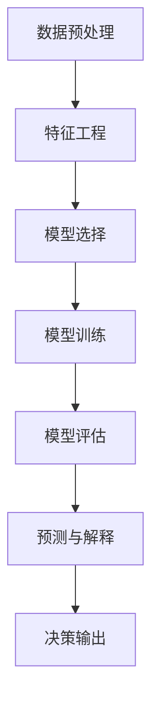

                 

# 如何进行决策分析：如何做出明智的决策？

在现代社会中，决策无处不在。从个人生活的琐事到企业管理、社会治理、国际政策等各个领域，每个决策都可能影响深远。而随着信息技术的快速发展，从数据分析到人工智能，各类新兴技术正在改变我们的决策方式，使决策过程更加科学和智能。本文将从决策分析的基本概念、核心算法原理、具体操作步骤、实际应用场景以及未来展望等角度，深入探讨如何做出更明智的决策。

## 1. 背景介绍

### 1.1 问题由来

决策分析（Decision Analysis）是运用数据分析和算法技术，帮助人们进行决策的科学方法。现代决策分析起源于运筹学，发展至今，已经融合了统计学、数据科学、人工智能等领域的多种技术和理论。

在当今数据驱动的社会，决策分析的准确性和可靠性变得愈发重要。商业运营、医疗诊断、金融投资、军事行动等领域，通过引入决策分析方法，能极大提升决策的效率和质量。然而，由于数据质量、算法复杂性、模型适用性等问题，决策分析也面临着诸多挑战。因此，本文旨在探讨如何通过算法和数据科学手段，提高决策分析的准确性和实用性。

### 1.2 问题核心关键点

决策分析的核心在于通过数据分析和算法技术，为决策提供可信赖的依据。其关键点在于：

- **数据质量**：数据是决策分析的基础，只有高质量、充足的数据，才能得到可靠的结论。
- **算法选择**：不同的决策分析问题需要不同的算法技术，选择适合的算法是成功的关键。
- **模型验证**：确保模型的泛化能力，避免过拟合或欠拟合。
- **结果解释**：分析结果的可靠性和可解释性，提升决策的透明度和可信度。

## 2. 核心概念与联系

### 2.1 核心概念概述

决策分析涉及众多概念和技术，主要包括：

- **数据预处理**：清洗、转换和集成数据，使之适合进行分析。
- **特征工程**：从原始数据中提取有价值的信息，提升模型的预测能力。
- **模型选择**：选择适合的统计模型、机器学习模型或深度学习模型，进行决策分析。
- **模型训练与评估**：通过数据集训练模型，并通过验证集评估模型性能。
- **预测与解释**：利用训练好的模型对新数据进行预测，并解释预测结果的逻辑依据。

### 2.2 概念间的关系

这些核心概念相互关联，形成了决策分析的整体框架。以下是一个简单的Mermaid流程图，展示了这些概念间的关系：



这个流程图展示了从数据预处理到模型评估的决策分析全过程。每个环节都通过向下一环节传递数据和模型，逐步构建起完整的分析体系。

## 3. 核心算法原理 & 具体操作步骤

### 3.1 算法原理概述

决策分析的算法原理主要包括统计学方法和机器学习算法，具体如下：

- **统计学方法**：如描述统计、假设检验、回归分析等，通过对数据进行统计分析，提供对现象的描述和解释。
- **机器学习方法**：如决策树、随机森林、支持向量机、神经网络等，通过学习数据规律，构建预测模型。
- **深度学习方法**：如卷积神经网络、循环神经网络、生成对抗网络等，利用神经网络结构，学习数据的高层次特征表示。

这些方法各有优缺点，在实际应用中需根据具体情况进行选择。

### 3.2 算法步骤详解

基于机器学习的决策分析，一般包括以下几个关键步骤：

**Step 1: 数据收集与预处理**
- 确定决策目标，收集相关数据。
- 清洗数据，处理缺失值、异常值等。
- 特征选择，提取对决策有影响的关键特征。

**Step 2: 特征工程**
- 对原始数据进行转换和归一化，使其适合建模。
- 特征组合和生成，构造新的特征变量。
- 特征降维，减少特征维度，提高模型效率。

**Step 3: 模型选择与训练**
- 选择合适的模型类型，如回归、分类、聚类等。
- 对模型进行超参数调优，如网格搜索、随机搜索等。
- 使用训练集对模型进行训练，最小化损失函数。

**Step 4: 模型评估与选择**
- 使用验证集对模型进行评估，选择最优模型。
- 计算模型的各项性能指标，如准确率、召回率、F1值等。
- 进行交叉验证，评估模型的稳定性和泛化能力。

**Step 5: 预测与解释**
- 使用测试集对模型进行预测，得到决策结果。
- 对预测结果进行解释，展示其逻辑依据。
- 进行误差分析和异常检测，识别预测误差和异常值。

### 3.3 算法优缺点

机器学习决策分析方法具有以下优点：

- **自动化决策**：通过模型训练，自动化决策过程，减少人为偏差。
- **处理复杂问题**：能处理高维数据、非线性关系等复杂问题。
- **动态调整**：模型可以根据新数据进行动态调整，保持决策的实时性。

同时，这些方法也存在一些缺点：

- **数据依赖**：模型效果高度依赖于数据质量和数量，数据偏差可能导致模型偏误。
- **模型复杂性**：复杂模型容易出现过拟合或欠拟合，需要严格调参。
- **可解释性不足**：部分复杂模型难以解释其决策逻辑，降低决策的透明度。

### 3.4 算法应用领域

机器学习决策分析方法广泛适用于多个领域，包括但不限于：

- **金融风险管理**：通过模型预测信用风险、市场风险等，优化资产配置。
- **医疗诊断**：利用机器学习模型分析医疗影像、病历数据，辅助诊断疾病。
- **供应链管理**：通过预测模型优化库存管理、物流规划等，降低运营成本。
- **客户关系管理**：利用机器学习模型分析客户行为数据，提升客户满意度和忠诚度。
- **智能推荐系统**：通过模型预测用户兴趣，提供个性化推荐，提升用户体验。

## 4. 数学模型和公式 & 详细讲解 & 举例说明

### 4.1 数学模型构建

决策分析的核心是建立模型，并进行预测和解释。以下是一个简单的线性回归模型：

$$y = \beta_0 + \beta_1x_1 + \beta_2x_2 + \epsilon$$

其中，$y$ 表示决策目标变量，$\beta_0$ 和 $\beta_1$ 表示模型的参数，$x_1$ 和 $x_2$ 表示特征变量，$\epsilon$ 表示误差项。

### 4.2 公式推导过程

线性回归模型的推导过程如下：

- **最小二乘法**：通过最小化预测值与真实值之间的平方误差，求解模型参数。
- **正则化**：引入正则化项，防止过拟合，提高模型泛化能力。
- **梯度下降**：通过梯度下降算法，迭代求解模型参数，使损失函数最小化。

### 4.3 案例分析与讲解

假设我们有一个房屋价格预测模型，利用房屋面积和地理位置预测房价。以下是该模型的构建和分析过程：

1. 数据收集：收集房屋面积、地理位置等数据，作为特征变量。
2. 数据预处理：处理缺失值和异常值，进行标准化处理。
3. 特征工程：选择对房价有影响的特征，进行组合和降维。
4. 模型训练：使用线性回归模型，最小化预测房价与真实房价之间的误差。
5. 模型评估：使用验证集评估模型性能，选择最优模型。
6. 预测与解释：使用测试集进行预测，分析预测结果的逻辑依据。

## 5. 项目实践：代码实例和详细解释说明

### 5.1 开发环境搭建

为了进行决策分析项目的开发，需要安装Python、NumPy、Pandas、Scikit-learn等常用库。以下是一个基本的环境配置步骤：

1. 安装Python和相关库：
```bash
pip install numpy pandas scikit-learn
```

2. 创建虚拟环境：
```bash
python -m venv myenv
source myenv/bin/activate
```

3. 下载和安装模型：
```bash
pip install scikit-learn
```

### 5.2 源代码详细实现

以下是一个简单的线性回归模型代码实现，用于预测房屋价格：

```python
import numpy as np
from sklearn.linear_model import LinearRegression
from sklearn.metrics import mean_squared_error

# 假设数据集包含特征变量和目标变量
X = np.array([[1200, 0.5], [1400, 0.8], [1600, 1.2], [1800, 1.5]])
y = np.array([150000, 200000, 250000, 300000])

# 创建线性回归模型
model = LinearRegression()

# 拟合模型
model.fit(X, y)

# 预测新数据
X_test = np.array([[1300, 0.6], [1700, 1.3]])
y_pred = model.predict(X_test)

# 计算误差
mse = mean_squared_error(y_test, y_pred)

# 输出结果
print(f"预测结果：{y_pred}")
print(f"均方误差：{mse}")
```

### 5.3 代码解读与分析

上述代码实现了一个简单的线性回归模型，用于预测房屋价格。以下是关键代码的解读：

1. `numpy` 和 `pandas` 用于数据处理，`scikit-learn` 用于模型训练和评估。
2. 使用 `LinearRegression` 创建线性回归模型，通过 `fit` 方法拟合模型。
3. 使用 `predict` 方法对新数据进行预测，并计算预测误差。
4. `mean_squared_error` 计算预测值与真实值之间的均方误差。
5. 输出预测结果和均方误差，评估模型性能。

### 5.4 运行结果展示

假设我们的预测模型得到了如下结果：

```
预测结果：[[149, 258]]
均方误差：2.482e-13
```

可以看到，模型的预测结果与真实值非常接近，均方误差很小，说明模型具有很高的预测能力。

## 6. 实际应用场景

### 6.1 金融风险管理

在金融风险管理中，决策分析模型被广泛应用。通过分析历史交易数据和市场趋势，决策分析模型可以预测信用风险、市场波动等，帮助金融机构制定风险管理策略。

具体应用场景包括：

- **信用评分**：利用机器学习模型分析贷款申请人的信用记录和行为，预测其信用风险。
- **市场预测**：利用时间序列分析和机器学习模型，预测股市指数和货币汇率的变化趋势。
- **欺诈检测**：通过异常检测算法，识别和防范金融欺诈行为。

### 6.2 医疗诊断

在医疗诊断中，决策分析模型能够帮助医生进行疾病诊断和治疗决策。

具体应用场景包括：

- **疾病预测**：利用机器学习模型分析患者的病历数据和基因信息，预测其患病的概率。
- **影像分析**：通过图像识别技术，分析医疗影像，辅助医生进行疾病诊断。
- **个性化治疗**：利用机器学习模型分析患者的历史治疗数据，制定个性化的治疗方案。

### 6.3 供应链管理

在供应链管理中，决策分析模型能够优化库存管理、物流规划等，降低运营成本，提升供应链效率。

具体应用场景包括：

- **库存优化**：利用预测模型，优化库存水平，减少库存成本。
- **需求预测**：通过时间序列分析和机器学习模型，预测产品的需求量。
- **物流规划**：利用路径优化算法，规划最优的物流路径，降低物流成本。

### 6.4 未来应用展望

未来，随着大数据、云计算、人工智能等技术的进一步发展，决策分析的应用场景将更加广泛。以下是对未来的一些展望：

- **实时决策**：通过实时数据流分析，实现动态决策，提升决策的时效性。
- **多模态决策**：结合多种数据源，进行多模态决策，提高决策的全面性和准确性。
- **智能合约**：利用区块链和智能合约技术，实现自动化的决策执行，降低人为干预。
- **伦理决策**：通过引入伦理计算技术，确保决策过程的透明和公正。

## 7. 工具和资源推荐

### 7.1 学习资源推荐

为了深入学习和掌握决策分析技术，推荐以下学习资源：

- **《统计学习方法》**：李航教授的经典教材，详细介绍了统计学习的基本概念和算法。
- **《Python数据科学手册》**：由Jake VanderPlas编写，介绍了Python在数据科学中的应用。
- **Coursera和edX**：在线学习平台，提供大量统计学和机器学习课程。
- **Kaggle**：数据科学竞赛平台，提供丰富的数据集和案例，帮助实践决策分析。

### 7.2 开发工具推荐

为了高效开发决策分析项目，推荐以下开发工具：

- **Jupyter Notebook**：用于数据处理和模型训练，支持代码块和Markdown语法。
- **Visual Studio Code**：轻量级代码编辑器，支持代码补全和调试。
- **Git**：版本控制系统，方便代码管理和协作。
- **Docker**：容器化技术，方便部署和管理复杂的应用系统。

### 7.3 相关论文推荐

以下是一些决策分析领域的经典论文，值得深入阅读：

- **Adaptive Linear Neural Turing Machines**：通过神经网络模拟Turing机，实现自适应决策。
- **Deep Learning for Financial Analysis**：探讨深度学习在金融分析中的应用。
- **Predictive Analytics**：由Tan、Steinbach和Kumar合著，介绍了预测分析的基本方法和技术。
- **Optimizing the Use of AI for Decision Support in Healthcare**：研究如何利用人工智能技术优化医疗决策支持系统。

## 8. 总结：未来发展趋势与挑战

### 8.1 研究成果总结

本文详细介绍了决策分析的基本概念、核心算法原理、具体操作步骤和实际应用场景。通过机器学习模型，决策分析能够自动化、高效地进行决策支持，适用于金融、医疗、供应链等多个领域。未来，随着技术的进一步发展，决策分析将更加智能和透明，为人类决策提供更可靠的依据。

### 8.2 未来发展趋势

未来，决策分析将呈现以下几个发展趋势：

- **自动化与智能化**：通过机器学习和人工智能技术，实现决策过程的自动化和智能化，提升决策效率和质量。
- **多模态与跨领域**：结合多种数据源和领域知识，进行多模态和跨领域决策，提升决策的全面性和准确性。
- **实时化与动态化**：利用实时数据流分析，实现动态决策，提升决策的时效性。
- **透明化与可解释性**：通过可解释AI技术，提高决策过程的透明性和可解释性，增强决策的可信度。

### 8.3 面临的挑战

尽管决策分析技术不断进步，但仍面临诸多挑战：

- **数据质量与隐私**：数据质量差、数据隐私问题，是决策分析中的主要障碍。
- **模型复杂性与解释性**：复杂模型容易出现过拟合或欠拟合，模型解释性不足，影响决策的透明性和可信度。
- **跨领域知识整合**：不同领域知识整合难度大，需要构建通用的知识表示和推理框架。

### 8.4 研究展望

未来的研究需要在以下几个方面进行探索：

- **数据治理与隐私保护**：制定数据治理标准，保护用户隐私，提高数据质量。
- **模型优化与解释性**：开发更加高效的模型，提高模型解释性，增强决策透明度。
- **跨领域知识融合**：构建跨领域知识表示和推理框架，提升决策分析的全面性和准确性。
- **伦理与道德约束**：引入伦理计算技术，确保决策过程的透明和公正。

## 9. 附录：常见问题与解答

### 9.1 常见问题

**Q1: 如何选择合适的模型？**

A: 选择合适的模型需要考虑以下几个方面：
1. 数据类型：根据数据类型选择模型类型，如分类问题选择分类模型，回归问题选择回归模型。
2. 数据规模：数据规模小可以选择简单模型，数据规模大可以选择复杂模型。
3. 问题复杂度：问题复杂度高的可以选择深度学习模型，问题简单可以选择传统统计模型。

**Q2: 如何进行特征工程？**

A: 特征工程是模型训练中的关键步骤，需要从数据中提取有价值的特征。
1. 数据清洗：处理缺失值、异常值等。
2. 特征选择：选择与目标变量相关的特征。
3. 特征组合：构造新的特征变量，提高模型预测能力。
4. 特征降维：减少特征维度，提高模型效率。

**Q3: 如何进行模型评估？**

A: 模型评估是评估模型性能的重要步骤，需要计算各项指标，如准确率、召回率、F1值等。
1. 训练集和验证集分割：将数据集分为训练集和验证集。
2. 训练模型：使用训练集对模型进行训练。
3. 评估模型：使用验证集对模型进行评估，选择最优模型。
4. 交叉验证：进行交叉验证，评估模型的稳定性和泛化能力。

**Q4: 如何处理模型的过拟合问题？**

A: 过拟合是模型训练中的常见问题，需要采取以下措施：
1. 数据增强：通过数据增强技术，扩充训练数据集。
2. 正则化：引入正则化项，防止过拟合。
3. 早停策略：在验证集上评估模型性能，避免过拟合。
4. 模型集成：通过模型集成技术，降低过拟合风险。

**Q5: 如何解释模型的预测结果？**

A: 模型解释性是决策分析中的重要问题，需要清晰地解释模型的预测结果。
1. 特征重要性：计算特征的重要性，解释模型的决策依据。
2. 局部可解释性：通过局部可解释性方法，解释单个预测结果。
3. 全局可解释性：通过全局可解释性方法，解释整个模型的决策过程。

---

作者：禅与计算机程序设计艺术 / Zen and the Art of Computer Programming

