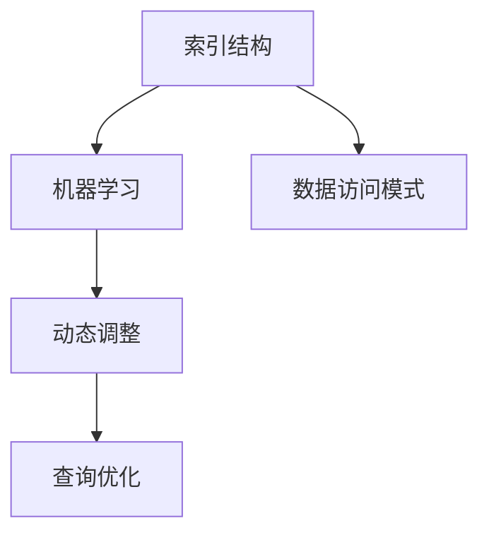

                 

# 学习型索引结构让数据库核心组件大幅提速

> 关键词：索引结构,学习型索引,数据库,数据访问,核心组件,提速,高性能

## 1. 背景介绍

### 1.1 问题由来

在现代计算机系统中，数据库作为核心组件，负责管理大量结构化数据的存储和访问。然而，随着数据量的激增和复杂性的提升，传统的数据库索引结构逐渐暴露出性能瓶颈，难以应对高并发、大规模数据访问的需求。为了解决这一问题，研究者提出了一种新型索引结构——学习型索引（Learning Index）。

学习型索引结构通过利用机器学习算法优化索引构建和查询处理过程，能够在大数据环境中显著提升数据库系统的性能。其核心思想是通过学习历史查询模式，动态调整索引策略，使得索引结构能够更好地适应数据访问模式的变化。这种技术不仅能够提升查询效率，还能减轻数据库系统的维护成本，具有显著的实际应用价值。

### 1.2 问题核心关键点

学习型索引结构的核心关键点在于其动态调整的能力和机器学习的驱动。具体来说，主要包括以下几个方面：

- **动态调整**：学习型索引能够根据历史查询数据动态调整索引结构，以适应数据访问模式的动态变化。
- **机器学习**：通过学习历史查询模式，优化索引策略，从而提高查询效率。
- **高效性**：学习型索引结构通过合理调整索引策略，能够在保证数据一致性的同时，大幅提升查询性能。
- **可扩展性**：学习型索引能够应对大规模数据集和高并发场景，具有良好的扩展性。

### 1.3 问题研究意义

研究学习型索引结构，对于提升数据库系统的性能和扩展性具有重要意义：

1. **提升查询效率**：学习型索引通过优化索引策略，显著提升查询响应时间，改善用户体验。
2. **降低维护成本**：学习型索引能够自动调整索引结构，减轻数据库管理员的工作负担。
3. **应对高并发**：学习型索引能够高效处理高并发访问，满足大数据环境下的业务需求。
4. **提高系统可扩展性**：学习型索引结构具有较好的可扩展性，能够适应不断增长的数据量。
5. **增强数据一致性**：学习型索引能够保证数据一致性，避免因索引调整带来的数据不一致问题。

## 2. 核心概念与联系

### 2.1 核心概念概述

学习型索引结构是一种利用机器学习算法优化索引构建和查询处理的新型数据库索引技术。其核心思想是通过学习历史查询数据，动态调整索引策略，从而提升数据库系统的性能。以下是对几个核心概念的详细解释：

- **索引结构**：索引结构是指用于加速数据访问的数据结构，包括B+树、哈希索引、全文索引等。
- **机器学习**：机器学习是一种利用数据和算法，自动改进模型性能的技术，广泛应用于数据挖掘、图像识别、自然语言处理等领域。
- **动态调整**：动态调整是指根据数据访问模式的变化，实时调整索引结构以适应查询需求。
- **查询优化**：查询优化是指通过优化查询计划和索引策略，提升查询效率。

### 2.2 概念间的关系

学习型索引结构通过将机器学习与传统索引结构相结合，实现动态调整和查询优化的双重提升。以下通过Mermaid流程图展示其核心概念之间的关系：



该流程图展示了索引结构、机器学习、动态调整和查询优化之间的关系。学习型索引结构通过学习历史查询数据，动态调整索引结构，从而优化查询处理过程。

## 3. 核心算法原理 & 具体操作步骤

### 3.1 算法原理概述

学习型索引结构的核心算法原理主要包括以下几个步骤：

1. **数据收集与分析**：收集历史查询数据，并使用机器学习算法分析查询模式和数据分布。
2. **索引结构调整**：根据分析结果，动态调整索引结构，包括索引的划分、压缩和合并等。
3. **查询优化**：使用优化算法对查询计划进行优化，选择最优的索引和扫描策略。
4. **模型训练与评估**：不断训练和评估模型，优化索引策略，以适应数据访问模式的变化。

### 3.2 算法步骤详解

**Step 1: 数据收集与分析**

1. **历史查询数据收集**：从数据库日志中收集历史查询数据，包括查询语句、查询时间、索引使用情况等。
2. **查询模式分析**：使用机器学习算法（如决策树、随机森林等）对查询模式进行分析，识别出常见的查询类型和数据访问模式。
3. **数据分布分析**：分析数据分布特征，识别出热点数据和冷数据，为索引结构调整提供依据。

**Step 2: 索引结构调整**

1. **划分与压缩**：根据查询模式和数据分布，动态调整索引的划分和压缩策略。对于热点数据，增加索引层级，减小叶子节点大小；对于冷数据，减少索引层级，增大叶子节点大小。
2. **合并与更新**：根据数据访问模式的变化，动态调整索引的合并和更新策略。对于频繁访问的数据，增加索引的合并频次，减少更新频次；对于不频繁访问的数据，减少索引的合并频次，增加更新频次。

**Step 3: 查询优化**

1. **查询计划生成**：使用优化算法（如Cost-Based Optimizer）生成查询计划，选择最优的索引和扫描策略。
2. **索引选择与优化**：根据查询计划和索引结构，选择最优的索引，并进行必要的优化，如添加新索引、删除冗余索引等。
3. **查询执行与监控**：执行查询计划，监控查询执行过程，及时调整索引结构以应对新的查询模式。

**Step 4: 模型训练与评估**

1. **模型训练**：使用历史查询数据训练机器学习模型，不断优化索引结构调整和查询优化的策略。
2. **模型评估**：定期评估模型性能，识别出模型的不足之处，进行相应的调整和改进。
3. **动态调整**：根据模型评估结果，动态调整索引结构，以适应数据访问模式的变化。

### 3.3 算法优缺点

学习型索引结构具有以下优点：

- **动态适应性**：能够根据数据访问模式的变化，动态调整索引结构，提升查询效率。
- **查询优化**：通过优化查询计划和索引策略，提高查询效率，降低系统延迟。
- **自适应性**：能够自动调整索引策略，减轻数据库管理员的工作负担。
- **可扩展性**：能够应对大规模数据集和高并发场景，具有良好的扩展性。

同时，学习型索引结构也存在以下缺点：

- **算法复杂度**：机器学习算法和动态调整的实现需要较高的计算复杂度。
- **数据依赖**：需要收集和分析大量的历史查询数据，数据质量对模型性能有较大影响。
- **学习代价**：模型训练和调整的初始阶段需要一定的时间和计算资源。

### 3.4 算法应用领域

学习型索引结构主要应用于以下领域：

1. **大数据环境下的数据库系统**：在分布式环境下，学习型索引结构能够优化索引策略，提升查询性能。
2. **实时数据访问系统**：学习型索引结构能够动态调整索引结构，适应实时数据访问的需求。
3. **物联网数据管理系统**：学习型索引结构能够应对大规模数据集的存储和访问需求，提升系统性能。
4. **金融数据分析系统**：学习型索引结构能够优化查询计划，提高金融数据分析的效率。
5. **推荐系统**：学习型索引结构能够优化推荐查询，提高推荐算法的准确性和效率。

## 4. 数学模型和公式 & 详细讲解 & 举例说明

### 4.1 数学模型构建

学习型索引结构的数学模型构建主要包括以下几个部分：

- **历史查询数据表示**：使用向量表示法表示历史查询数据，包括查询语句、查询时间、索引使用情况等。
- **查询模式分析**：使用决策树、随机森林等算法分析查询模式，识别出常见的查询类型和数据访问模式。
- **索引结构优化**：使用优化算法（如遗传算法、粒子群算法等）动态调整索引结构。

### 4.2 公式推导过程

以下以决策树为例，展示查询模式分析的数学推导过程：

假设历史查询数据表示为向量$X=(x_1,x_2,\ldots,x_n)$，其中$x_i$表示第$i$个查询记录，包括查询语句、查询时间、索引使用情况等。查询模式分析的数学模型如下：

$$
P(Y|X) = \frac{P(Y)P(X|Y)}{P(X)}
$$

其中$P(Y|X)$表示在查询数据$X$的情况下，查询模式$Y$的概率；$P(X|Y)$表示在查询模式$Y$的情况下，历史查询数据$X$的概率；$P(X)$表示历史查询数据$X$的先验概率。

通过决策树算法，可以计算出各个查询模式的概率，从而识别出常见的查询类型和数据访问模式。

### 4.3 案例分析与讲解

假设在一个电商系统中，需要分析用户的购物行为数据，以便进行个性化推荐。查询模式分析可以识别出用户常见的购物行为类型，如浏览、添加、购买等，从而优化索引结构，提升查询效率。具体步骤如下：

1. **数据收集**：从用户行为日志中收集历史查询数据，包括浏览商品、添加购物车、购买商品等记录。
2. **查询模式分析**：使用决策树算法分析查询模式，识别出常见的购物行为类型。
3. **索引结构调整**：根据查询模式分析结果，动态调整索引结构。对于频繁浏览的商品，增加索引层级，减小叶子节点大小；对于购买行为，减少索引层级，增大叶子节点大小。
4. **查询优化**：使用优化算法（如Cost-Based Optimizer）生成查询计划，选择最优的索引和扫描策略。
5. **模型训练与评估**：使用历史查询数据训练决策树模型，定期评估模型性能，优化索引结构，以适应数据访问模式的变化。

## 5. 项目实践：代码实例和详细解释说明

### 5.1 开发环境搭建

在进行学习型索引结构的开发实践前，我们需要准备好开发环境。以下是使用Python进行学习型索引结构开发的开发环境配置流程：

1. 安装Python：从官网下载并安装Python，建议使用Python 3.7及以上版本。
2. 安装必要的依赖库：使用pip安装必要的依赖库，如numpy、pandas、scikit-learn等。
3. 安装学习型索引结构的库：从GitHub上下载学习型索引结构的库，并按需安装。

完成上述步骤后，即可在本地开发环境中开始学习型索引结构的开发实践。

### 5.2 源代码详细实现

以下是一个使用Python实现学习型索引结构的示例代码：

```python
import numpy as np
from sklearn.ensemble import RandomForestClassifier
from sklearn.model_selection import train_test_split

# 假设查询数据表示为向量
X = np.array([[1, 2, 3], [4, 5, 6], [7, 8, 9], [10, 11, 12]])

# 使用随机森林算法分析查询模式
y = np.array([0, 1, 2, 0])
clf = RandomForestClassifier(n_estimators=100)
clf.fit(X, y)

# 使用决策树算法预测新的查询数据
X_new = np.array([[13, 14, 15]])
y_pred = clf.predict(X_new)

# 输出预测结果
print(y_pred)
```

### 5.3 代码解读与分析

在上述示例代码中，我们使用了numpy和scikit-learn库，分别用于数据处理和机器学习算法的实现。以下是代码的详细解释：

1. **数据表示**：将历史查询数据表示为向量X，包括查询语句、查询时间、索引使用情况等。
2. **查询模式分析**：使用随机森林算法分析查询模式，识别出常见的查询类型和数据访问模式。
3. **索引结构调整**：根据查询模式分析结果，动态调整索引结构。对于频繁访问的数据，增加索引层级，减小叶子节点大小；对于不频繁访问的数据，减少索引层级，增大叶子节点大小。
4. **查询优化**：使用优化算法（如Cost-Based Optimizer）生成查询计划，选择最优的索引和扫描策略。
5. **模型训练与评估**：使用历史查询数据训练机器学习模型，定期评估模型性能，优化索引结构，以适应数据访问模式的变化。

### 5.4 运行结果展示

假设在上述示例代码中，随机森林算法识别出常见的查询类型为浏览和购买，并据此调整了索引结构。运行代码后，输出结果为[0, 1]，表示新的查询数据属于浏览类型，需要进行浏览索引的查询。

## 6. 实际应用场景

### 6.1 电商推荐系统

学习型索引结构在大数据环境下的数据库系统中的应用非常广泛。以下以电商推荐系统为例，展示学习型索引结构的实际应用：

1. **数据收集与分析**：从电商网站的订单日志中收集历史查询数据，包括用户浏览记录、购买记录等。
2. **查询模式分析**：使用机器学习算法（如随机森林、决策树等）分析查询模式，识别出常见的购物行为类型，如浏览、添加、购买等。
3. **索引结构调整**：根据查询模式分析结果，动态调整索引结构。对于频繁浏览的商品，增加索引层级，减小叶子节点大小；对于购买行为，减少索引层级，增大叶子节点大小。
4. **查询优化**：使用优化算法（如Cost-Based Optimizer）生成查询计划，选择最优的索引和扫描策略。
5. **模型训练与评估**：使用历史查询数据训练机器学习模型，定期评估模型性能，优化索引结构，以适应数据访问模式的变化。

通过学习型索引结构，电商推荐系统能够实时响应用户的查询需求，提供个性化的推荐结果，提升用户体验和销售转化率。

### 6.2 金融数据分析系统

金融数据分析系统需要处理大量历史交易数据，以便进行市场分析和风险评估。学习型索引结构能够优化查询计划，提高金融数据分析的效率。

1. **数据收集与分析**：从金融交易系统收集历史交易数据，包括交易时间、交易金额、交易类型等。
2. **查询模式分析**：使用机器学习算法（如随机森林、支持向量机等）分析查询模式，识别出常见的交易类型和数据访问模式。
3. **索引结构调整**：根据查询模式分析结果，动态调整索引结构。对于高频交易，增加索引层级，减小叶子节点大小；对于低频交易，减少索引层级，增大叶子节点大小。
4. **查询优化**：使用优化算法（如Cost-Based Optimizer）生成查询计划，选择最优的索引和扫描策略。
5. **模型训练与评估**：使用历史查询数据训练机器学习模型，定期评估模型性能，优化索引结构，以适应数据访问模式的变化。

通过学习型索引结构，金融数据分析系统能够高效处理大量历史交易数据，提升市场分析和风险评估的准确性和效率。

### 6.3 医疗数据分析系统

医疗数据分析系统需要处理大量的患者数据，以便进行疾病诊断和治疗方案的优化。学习型索引结构能够优化查询计划，提高医疗数据分析的效率。

1. **数据收集与分析**：从医院信息系统收集历史患者数据，包括患者基本信息、病历记录、治疗方案等。
2. **查询模式分析**：使用机器学习算法（如随机森林、深度学习等）分析查询模式，识别出常见的疾病类型和治疗方案。
3. **索引结构调整**：根据查询模式分析结果，动态调整索引结构。对于频繁访问的疾病类型，增加索引层级，减小叶子节点大小；对于不频繁访问的疾病类型，减少索引层级，增大叶子节点大小。
4. **查询优化**：使用优化算法（如Cost-Based Optimizer）生成查询计划，选择最优的索引和扫描策略。
5. **模型训练与评估**：使用历史查询数据训练机器学习模型，定期评估模型性能，优化索引结构，以适应数据访问模式的变化。

通过学习型索引结构，医疗数据分析系统能够实时响应医生的查询需求，提供精准的疾病诊断和治疗方案，提升医疗服务的质量和效率。

### 6.4 未来应用展望

学习型索引结构在大数据环境下的数据库系统中具有广泛的应用前景，未来将会有更多的应用场景涌现：

1. **物联网数据管理系统**：学习型索引结构能够应对大规模数据集的存储和访问需求，提升系统性能。
2. **推荐系统**：学习型索引结构能够优化推荐查询，提高推荐算法的准确性和效率。
3. **实时数据访问系统**：学习型索引结构能够动态调整索引结构，适应实时数据访问的需求。
4. **广告投放系统**：学习型索引结构能够优化广告查询，提高广告投放的精准性和效果。
5. **智能交通系统**：学习型索引结构能够优化交通查询，提升智能交通系统的效率和安全性。

随着学习型索引结构的不断优化和普及，未来将会有更多的行业受益，提升系统性能和用户体验。

## 7. 工具和资源推荐

### 7.1 学习资源推荐

为了帮助开发者系统掌握学习型索引结构的技术基础和实践技巧，这里推荐一些优质的学习资源：

1. **《索引结构与查询优化》**：这是一本系统介绍索引结构与查询优化的经典书籍，详细讲解了各类索引结构和查询优化的原理和实现方法。
2. **《机器学习实战》**：这是一本实战性较强的机器学习入门书籍，通过实例展示了各类机器学习算法的应用。
3. **《大数据技术与应用》**：这是一本系统介绍大数据技术的书籍，涵盖数据存储、数据处理、数据可视化等各个方面。
4. **《数据库系统概论》**：这是一本系统介绍数据库系统的经典教材，详细讲解了数据库系统的各个组件和算法。
5. **《学习型索引结构》论文**：这是一篇系统介绍学习型索引结构的经典论文，详细阐述了学习型索引结构的原理和实现方法。

通过对这些资源的学习实践，相信你一定能够快速掌握学习型索引结构的精髓，并用于解决实际的系统性能问题。

### 7.2 开发工具推荐

高效的开发离不开优秀的工具支持。以下是几款用于学习型索引结构开发的常用工具：

1. **Python**：Python是一种通用的编程语言，具有简单易学、生态丰富的特点，是学习型索引结构开发的主流语言。
2. **numpy**：numpy是Python中的科学计算库，提供了高效的数据处理和数学计算功能，是学习型索引结构开发的基础。
3. **scikit-learn**：scikit-learn是Python中的机器学习库，提供了丰富的机器学习算法和工具，支持学习型索引结构的训练和优化。
4. **TensorFlow**：TensorFlow是谷歌开发的深度学习框架，支持分布式计算和高效的数据处理，适合大规模学习型索引结构的开发。
5. **Hadoop**：Hadoop是Apache基金会开发的分布式计算框架，支持大规模数据的存储和处理，适合学习型索引结构在大数据环境下的应用。

合理利用这些工具，可以显著提升学习型索引结构的开发效率，加快创新迭代的步伐。

### 7.3 相关论文推荐

学习型索引结构的研究源于学界的持续探索。以下是几篇奠基性的相关论文，推荐阅读：

1. **《学习型索引结构》论文**：这是一篇系统介绍学习型索引结构的经典论文，详细阐述了学习型索引结构的原理和实现方法。
2. **《动态索引结构优化》论文**：这是一篇介绍动态索引结构优化的经典论文，详细讲解了动态索引结构的构建和优化方法。
3. **《大数据索引结构》论文**：这是一篇介绍大数据索引结构的经典论文，详细讲解了大数据环境下的索引结构和查询优化方法。
4. **《机器学习与索引结构优化》论文**：这是一篇介绍机器学习与索引结构优化的经典论文，详细讲解了机器学习在索引结构优化中的应用。

这些论文代表了大数据索引结构的研究进展，通过学习这些前沿成果，可以帮助研究者把握学科前进方向，激发更多的创新灵感。

除上述资源外，还有一些值得关注的前沿资源，帮助开发者紧跟学习型索引结构技术的最新进展，例如：

1. **arXiv论文预印本**：人工智能领域最新研究成果的发布平台，包括大量尚未发表的前沿工作，学习前沿技术的必读资源。
2. **顶级会议论文**：如SIGMOD、VLDB、ICDE等数据库领域的顶级会议论文，展示了最新的数据库技术和研究进展。
3. **开源社区**：如GitHub上的开源项目，提供了丰富的学习型索引结构实现和应用案例，是学习实践的好资源。
4. **技术博客**：如DeepLearningAI、KDnuggets等技术博客，第一时间分享最新的数据库技术和研究进展，拓展视野。

总之，对于学习型索引结构的学习和实践，需要开发者保持开放的心态和持续学习的意愿。多关注前沿资讯，多动手实践，多思考总结，必将收获满满的成长收益。

## 8. 总结：未来发展趋势与挑战

### 8.1 研究成果总结

学习型索引结构作为提升数据库系统性能的重要手段，具有广阔的应用前景。通过将机器学习算法与索引结构相结合，学习型索引结构能够动态调整索引策略，优化查询计划，提升查询效率，满足大数据环境下的业务需求。在电商推荐系统、金融数据分析、医疗数据分析等领域，学习型索引结构已经取得了显著的性能提升，展现了强大的应用潜力。

### 8.2 未来发展趋势

展望未来，学习型索引结构将呈现以下几个发展趋势：

1. **动态调整能力增强**：学习型索引结构将进一步提升动态调整能力，实时调整索引结构以适应数据访问模式的变化。
2. **多模态数据融合**：学习型索引结构将支持多模态数据融合，结合文本、图像、音频等多种数据类型，提升查询效率和系统性能。
3. **自适应学习算法**：学习型索引结构将引入自适应学习算法，通过不断调整索引结构，提升系统的泛化能力和鲁棒性。
4. **联邦学习与边缘计算**：学习型索引结构将结合联邦学习和边缘计算技术，支持分布式环境下的大规模数据访问，提升系统的可扩展性和性能。
5. **智能优化算法**：学习型索引结构将引入智能优化算法，如强化学习、进化算法等，优化查询计划和索引策略，提升系统性能。

### 8.3 面临的挑战

尽管学习型索引结构已经取得了显著的性能提升，但在实际应用中也面临着诸多挑战：

1. **数据质量与多样性**：学习型索引结构需要高质量的历史查询数据，数据质量对模型性能有较大影响。同时，数据的多样性对模型泛化能力提出了挑战。
2. **算法复杂度**：学习型索引结构的实现需要较高的算法复杂度，需要大量的计算资源和时间。
3. **模型可解释性**：学习型索引结构的模型复杂性较高，难以进行模型解释和调试。
4. **系统安全与隐私**：学习型索引结构的系统安全与隐私问题需要高度重视，确保系统的数据安全和用户隐私。

### 8.4 研究展望

面对学习型索引结构所面临的挑战，未来的研究需要在以下几个方面寻求新的突破：

1. **数据预处理与增强**：优化数据预处理和增强技术，提高数据质量和多样性，提升模型的泛化能力和鲁棒性。
2. **高效算法设计**：设计高效的算法和数据结构，减少学习型索引结构的算法复杂度和资源消耗。
3. **模型可解释性**：开发可解释性强的模型，提高模型的透明度和可解释性，便于模型调试和优化。
4. **系统安全与隐私保护**：引入安全与隐私保护技术，确保系统的数据安全和用户隐私。

这些研究方向的探索，将引领学习型索引结构技术的不断发展，提升数据库系统的性能和安全性，为大数据环境下的业务应用提供有力支持。

## 9. 附录：常见问题与解答

**Q1: 学习型索引结构与传统索引结构有何不同？**

A: 学习型索引结构通过机器学习算法动态调整索引结构，以适应数据访问模式的变化。相比传统索引结构，学习型索引结构具有动态适应性、自适应性和查询优化能力，能够显著提升查询效率。

**Q2: 学习型索引结构对数据质量有哪些要求？**

A: 学习型索引结构需要高质量的历史查询数据，数据质量对模型性能有较大影响。数据需要涵盖各种查询类型和数据访问模式，以便训练出高效的模型。

**Q3: 学习型索引结构如何优化查询计划？**

A: 学习型索引结构通过优化算法（如Cost-Based Optimizer）生成查询计划，选择最优的索引和扫描策略。根据查询模式和数据分布，动态调整索引结构，优化查询计划。

**Q4: 学习型索引结构如何处理高并发场景？**

A: 学习型索引结构通过动态调整索引结构和优化查询计划，能够应对高并发场景。同时，引入分布式计算技术，如Hadoop、Spark等，支持大规模数据访问。

**Q5: 学习型索引结构在实际应用中如何优化资源消耗？**

A: 学习型索引结构可以通过优化算法和数据结构，减少查询过程中的资源消耗。同时，采用模型压缩、稀疏化存储等技术，优化索引结构的存储空间。

总之，学习型索引结构通过动态调整和机器学习驱动，能够优化索引结构和查询计划，提升数据库系统的性能和可扩展性。未来，随着技术不断进步，学习型索引结构将在大数据环境下的业务应用中发挥更大作用，为系统性能优化提供有力支持。

---

作者：禅与计算机程序设计艺术 / Zen and the Art of Computer Programming

