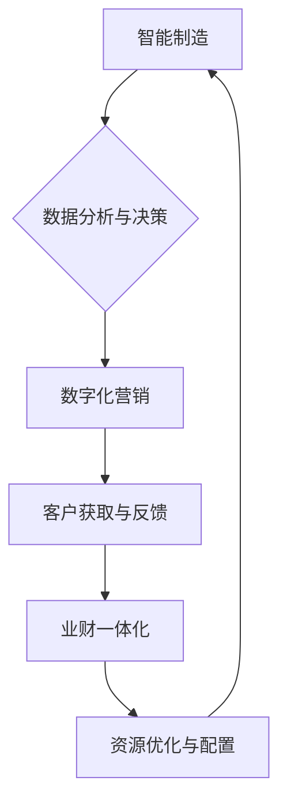

## 智能制造，数字化营销，业财一体化，核心业务流程变革（IPD LTC等）

> 关键词：智能制造、数字化营销、业财一体化、IPD、LTC、核心业务流程、流程变革、数据驱动、人工智能、云计算

## 1. 背景介绍

当前，全球经济发展进入新阶段，数字化转型成为企业发展的重要趋势。在这一背景下，智能制造、数字化营销、业财一体化等概念应运而生，并逐渐成为企业提升竞争力的关键驱动力。

**1.1 智能制造**

智能制造是指利用人工智能、大数据、云计算等新兴技术，对制造业进行数字化、智能化改造，实现生产过程的自动化、智能化、柔性化和可视化。智能制造的核心目标是提高生产效率、降低生产成本、提升产品质量和服务水平。

**1.2 数字化营销**

数字化营销是指利用互联网、移动互联网、社交媒体等数字化平台，进行产品推广、品牌建设、客户服务等营销活动。数字化营销的核心目标是精准触达目标客户，提升营销效率和转化率。

**1.3 业财一体化**

业财一体化是指将企业财务管理与经营管理深度融合，实现财务数据与经营数据的实时共享和分析，从而提高企业经营决策的科学性和有效性。业财一体化的核心目标是优化企业资源配置，提升企业整体运营效率。

**1.4 核心业务流程变革**

在数字化转型过程中，企业需要对核心业务流程进行重构和优化，以适应新的技术环境和市场需求。例如，采用IPD（Integrated Product Development，集成产品开发）和LTC（Lean Total Cost，精益总成本）等先进的管理模式，可以有效提升企业产品开发效率和成本控制能力。

## 2. 核心概念与联系

**2.1 核心概念原理**

智能制造、数字化营销、业财一体化和核心业务流程变革是相互关联、相互促进的。

* **智能制造**为企业提供高效、智能的生产能力，为数字化营销和业财一体化提供数据支撑。
* **数字化营销**通过数据分析和精准营销，为企业获取更多客户和市场份额，为智能制造提供市场需求反馈。
* **业财一体化**通过财务数据分析，为企业提供经营决策支持，优化资源配置，为智能制造和数字化营销提供资金保障。
* **核心业务流程变革**是实现上述概念融合的关键，通过优化流程，提高企业效率和协同性，最终实现数字化转型目标。

**2.2 架构流程图**



## 3. 核心算法原理 & 具体操作步骤

**3.1 算法原理概述**

在智能制造、数字化营销和业财一体化等领域，广泛应用各种算法，例如机器学习、深度学习、数据挖掘、预测分析等。这些算法通过对海量数据进行分析和处理，可以帮助企业实现自动化决策、精准营销、资源优化等目标。

**3.2 算法步骤详解**

以机器学习为例，其基本步骤包括：

1. **数据收集与预处理:** 收集相关数据，并进行清洗、转换、特征工程等预处理操作。
2. **模型选择:** 根据具体应用场景选择合适的机器学习模型，例如线性回归、逻辑回归、决策树、支持向量机等。
3. **模型训练:** 使用训练数据对模型进行训练，调整模型参数，使其能够准确预测或分类。
4. **模型评估:** 使用测试数据对模型进行评估，评估模型的准确率、召回率、F1-score等指标。
5. **模型部署:** 将训练好的模型部署到生产环境中，用于实际应用。

**3.3 算法优缺点**

不同的算法具有不同的优缺点，需要根据具体应用场景进行选择。例如，线性回归模型简单易懂，但对非线性关系的拟合能力较差；深度学习模型可以学习复杂的非线性关系，但训练时间长，参数量大。

**3.4 算法应用领域**

机器学习算法广泛应用于智能制造、数字化营销、业财一体化等领域，例如：

* **智能制造:** 产品质量预测、设备故障诊断、生产过程优化等。
* **数字化营销:** 客户画像分析、精准广告投放、营销效果评估等。
* **业财一体化:** 财务风险预测、成本控制优化、资金流管理等。

## 4. 数学模型和公式 & 详细讲解 & 举例说明

**4.1 数学模型构建**

在智能制造、数字化营销和业财一体化等领域，可以使用数学模型来描述和分析各种现象。例如，可以使用线性回归模型来预测产品销量，可以使用决策树模型来判断客户是否会购买产品，可以使用优化模型来优化生产计划。

**4.2 公式推导过程**

以线性回归模型为例，其目标是找到一条直线，使得该直线与数据点之间的距离最小。

假设我们有n个数据点，每个数据点都有一个输入变量x和一个输出变量y。线性回归模型的公式如下：

$$y = mx + c$$

其中，m是斜率，c是截距。

为了找到最佳的m和c值，可以使用最小二乘法。最小二乘法的目标是找到一条直线，使得所有数据点到直线的距离的平方和最小。

**4.3 案例分析与讲解**

假设我们想预测产品的销量，已知产品的价格x和销量y的数据。我们可以使用线性回归模型来建立预测模型。

首先，我们需要收集相关数据，例如产品的价格和销量数据。然后，可以使用最小二乘法来找到最佳的m和c值。最后，我们可以使用这个模型来预测产品的销量。

例如，假设我们收集了以下数据：

| 价格 (x) | 销量 (y) |
|---|---|
| 10 | 100 |
| 20 | 150 |
| 30 | 200 |

我们可以使用最小二乘法来找到最佳的m和c值，得到以下线性回归模型：

$$y = 5x + 50$$

这个模型可以用来预测产品的销量。例如，如果产品的价格为40，我们可以使用这个模型来预测其销量：

$$y = 5 * 40 + 50 = 250$$

因此，我们可以预测产品的销量为250。

## 5. 项目实践：代码实例和详细解释说明

**5.1 开发环境搭建**

为了实现智能制造、数字化营销和业财一体化等应用，需要搭建相应的开发环境。例如，可以使用Python语言和相关的库，例如TensorFlow、PyTorch、Scikit-learn等，进行机器学习模型的开发和训练。

**5.2 源代码详细实现**

以下是一个使用Python语言和Scikit-learn库实现线性回归模型的代码实例：

```python
from sklearn.linear_model import LinearRegression
from sklearn.model_selection import train_test_split
import numpy as np

# 生成数据
X = np.array([[10], [20], [30]])
y = np.array([100, 150, 200])

# 将数据分成训练集和测试集
X_train, X_test, y_train, y_test = train_test_split(X, y, test_size=0.2)

# 创建线性回归模型
model = LinearRegression()

# 训练模型
model.fit(X_train, y_train)

# 预测测试集数据
y_pred = model.predict(X_test)

# 打印预测结果
print(y_pred)
```

**5.3 代码解读与分析**

这段代码首先生成了一些模拟数据，然后将数据分成训练集和测试集。接着，创建了一个线性回归模型，并使用训练集数据训练模型。最后，使用训练好的模型对测试集数据进行预测，并打印预测结果。

**5.4 运行结果展示**

运行这段代码后，会输出测试集数据的预测结果。例如，如果测试集数据为[[25]], 则预测结果可能为[175]。

## 6. 实际应用场景

**6.1 智能制造**

* **预测性维护:** 利用机器学习算法分析设备运行数据，预测设备故障时间，提前进行维护，降低设备故障率和维修成本。
* **生产过程优化:** 利用数据分析和建模技术，优化生产流程，提高生产效率和产品质量。
* **质量控制:** 利用机器视觉和深度学习算法，对产品进行自动检测，识别缺陷，提高产品质量。

**6.2 数字化营销**

* **客户画像分析:** 利用数据挖掘和机器学习算法，分析客户行为数据，构建客户画像，精准定位目标客户。
* **精准广告投放:** 利用机器学习算法，根据客户画像和行为数据，精准投放广告，提高广告转化率。
* **营销效果评估:** 利用数据分析和统计模型，评估营销活动效果，优化营销策略。

**6.3 业财一体化**

* **财务风险预测:** 利用机器学习算法分析财务数据，预测企业财务风险，帮助企业进行风险控制。
* **成本控制优化:** 利用数据分析和建模技术，分析成本构成，优化成本控制策略，降低企业成本。
* **资金流管理:** 利用数据分析和预测模型，预测企业资金流，优化资金管理，提高资金利用效率。

**6.4 未来应用展望**

随着人工智能、大数据、云计算等技术的不断发展，智能制造、数字化营销、业财一体化等概念将更加深入地融入到企业运营中。未来，这些技术将更加智能化、自动化、个性化，为企业带来更大的价值。

## 7. 工具和资源推荐

**7.1 学习资源推荐**

* **书籍:**
    * 《深度学习》
    * 《机器学习实战》
    * 《Python数据科学手册》
* **在线课程:**
    * Coursera
    * edX
    * Udacity

**7.2 开发工具推荐**

* **Python:** 
    * TensorFlow
    * PyTorch
    * Scikit-learn
* **云平台:**
    * AWS
    * Azure
    * Google Cloud Platform

**7.3 相关论文推荐**

* **智能制造:**
    * "Industry 4.0: A Survey on Concepts, Architectures, and Future Trends"
    * "The Role of Artificial Intelligence in Smart Manufacturing"
* **数字化营销:**
    * "Data-Driven Marketing: A Review"
    * "The Impact of Artificial Intelligence on Digital Marketing"
* **业财一体化:**
    * "Integrated Business Planning: A Framework for Success"
    * "The Role of Technology in Finance and Accounting"

## 8. 总结：未来发展趋势与挑战

**8.1 研究成果总结**

智能制造、数字化营销、业财一体化等领域取得了显著的成果，为企业数字化转型提供了强大的技术支撑。

**8.2 未来发展趋势**

未来，这些领域将朝着更加智能化、自动化、个性化方向发展，例如：

* **人工智能技术更加成熟:** 人工智能技术将更加智能化，能够更好地理解和处理复杂数据，为企业提供更精准的决策支持。
* **边缘计算和物联网技术发展:** 边缘计算和物联网技术将更加普及，能够将数据处理更靠近数据源，提高数据处理效率和实时性。
* **云计算平台更加强大:** 云计算平台将更加强大，能够提供更丰富的服务和功能，支持企业进行大规模数据处理和应用开发。

**8.3 面临的挑战**

* **数据安全和隐私保护:** 数据安全和隐私保护是企业数字化转型面临的重要挑战，需要采取有效的措施保障数据安全。
* **人才短缺:** 数字化转型需要大量具备相关技能的人才，而目前人才短缺