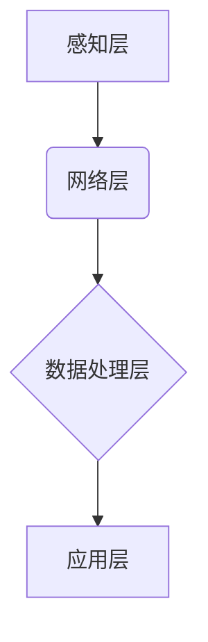

## 物联网 (Internet of Things)

> 关键词：物联网、传感器、网络协议、数据分析、云计算、安全、隐私、智能家居、工业物联网

## 1. 背景介绍

物联网 (Internet of Things, IoT) 是一项革命性的技术，它将物理世界与数字世界紧密连接，赋予普通物体智能感知、互联和数据处理的能力。随着物联网技术的快速发展，越来越多的设备、传感器和系统被连接到网络中，产生了海量的实时数据。这些数据蕴藏着丰富的价值，为我们提供了优化资源利用、提升生活品质、推动经济发展等诸多可能性。

物联网的应用场景广泛，涵盖了智能家居、智能城市、工业自动化、医疗保健、交通运输等各个领域。例如，智能家居可以根据用户的需求自动调节温度、灯光和家电设备；智能城市可以利用传感器数据优化交通流量、提高能源效率和保障公共安全；工业自动化可以实现设备远程监控、故障预测和生产过程优化。

## 2. 核心概念与联系

物联网的核心概念包括：

* **感知层:** 负责收集物理世界的各种数据，例如温度、湿度、位置、声音等。感知层主要由传感器、执行器和微控制器组成。
* **网络层:** 负责将感知层的数据传输到应用层，常用的网络协议包括 Wi-Fi、蓝牙、ZigBee、LoRa 等。
* **数据处理层:** 负责对感知层的数据进行处理、分析和存储，可以利用云计算、边缘计算等技术进行数据分析和决策。
* **应用层:** 负责将数据处理结果转化为用户可理解的信息，并提供相应的应用服务，例如智能控制、远程监控、数据可视化等。

**核心概念架构流程图:**



## 3. 核心算法原理 & 具体操作步骤

### 3.1  算法原理概述

物联网中常用的算法包括数据采集、数据传输、数据分析和数据安全等方面的算法。

* **数据采集算法:** 用于从传感器中获取数据，并进行预处理，例如数据格式转换、噪声过滤等。
* **数据传输算法:** 用于将数据从感知层传输到网络层，并保证数据传输的可靠性和安全性。
* **数据分析算法:** 用于对收集到的数据进行分析和挖掘，例如趋势预测、异常检测、模式识别等。
* **数据安全算法:** 用于保护物联网数据免受攻击和泄露，例如加密算法、身份验证算法等。

### 3.2  算法步骤详解

以数据传输算法为例，其具体操作步骤如下：

1. **数据封装:** 将传感器采集到的数据封装成数据包，并添加必要的元数据，例如数据源、数据类型、时间戳等。
2. **路由选择:** 根据网络拓扑结构和数据包的目的地，选择合适的路由路径。
3. **数据传输:** 将数据包通过网络传输到目标设备。
4. **数据接收:** 目标设备接收数据包，并进行数据解包和验证。
5. **数据处理:** 目标设备对接收到的数据进行处理，例如存储、分析或执行相应的操作。

### 3.3  算法优缺点

物联网算法的优缺点取决于具体的算法类型和应用场景。

* **优点:**

    * **提高效率:** 自动化数据采集、传输和分析，提高工作效率。
    * **优化资源利用:** 通过数据分析，优化资源分配和利用，降低成本。
    * **提升用户体验:** 提供个性化服务和智能控制，提升用户体验。

* **缺点:**

    * **数据安全风险:** 物联网设备和数据容易受到攻击和泄露。
    * **隐私问题:** 物联网设备收集的用户数据可能侵犯隐私。
    * **技术复杂性:** 物联网系统涉及多种技术，开发和维护难度较高。

### 3.4  算法应用领域

物联网算法广泛应用于各个领域，例如：

* **智能家居:** 控制家电设备、远程监控、安全报警等。
* **智能城市:** 交通管理、环境监测、公共安全等。
* **工业自动化:** 设备监控、故障预测、生产优化等。
* **医疗保健:** 远程医疗、健康监测、疾病预防等。

## 4. 数学模型和公式 & 详细讲解 & 举例说明

### 4.1  数学模型构建

物联网中的数据分析通常依赖于数学模型和公式。例如，我们可以使用线性回归模型来预测设备的故障概率，使用聚类算法来识别用户行为模式。

### 4.2  公式推导过程

以线性回归模型为例，其目标是找到一条直线，使得该直线与数据点之间的距离最小。

假设我们有n个数据点，每个数据点包含一个输入变量x和一个输出变量y。线性回归模型的公式如下：

$$y = mx + c$$

其中，m是斜率，c是截距。

为了找到最佳的m和c值，我们可以使用最小二乘法。最小二乘法的目标是找到m和c值，使得误差平方和最小。

误差平方和公式如下：

$$SSE = \sum_{i=1}^{n}(y_i - mx_i - c)^2$$

通过对SSE求偏导，并令其等于零，我们可以得到m和c的解：

$$m = \frac{\sum_{i=1}^{n}(x_i - \bar{x})(y_i - \bar{y})}{\sum_{i=1}^{n}(x_i - \bar{x})^2}$$

$$c = \bar{y} - m\bar{x}$$

其中，$\bar{x}$和$\bar{y}$分别是x和y的平均值。

### 4.3  案例分析与讲解

假设我们想预测房屋价格，已知房屋面积和房屋价格的数据。我们可以使用线性回归模型来建立房屋价格预测模型。

通过对数据进行分析，我们可以得到以下线性回归模型：

$$y = 5000x + 100000$$

其中，y表示房屋价格，x表示房屋面积。

根据这个模型，我们可以预测不同面积的房屋价格。例如，如果房屋面积为100平方米，则其价格为：

$$y = 5000 * 100 + 100000 = 1000000$$

## 5. 项目实践：代码实例和详细解释说明

### 5.1  开发环境搭建

为了实现物联网项目，我们需要搭建相应的开发环境。常用的开发环境包括：

* **硬件平台:** 例如 Raspberry Pi、Arduino 等。
* **软件平台:** 例如 Python、Node.js 等。
* **云平台:** 例如 AWS、Azure、阿里云等。

### 5.2  源代码详细实现

以下是一个简单的物联网项目代码实例，使用 Python 和 Raspberry Pi 实现温度监测和数据上传：

```python
import RPi.GPIO as GPIO
import time
import requests

# 设置 GPIO 引脚
GPIO.setmode(GPIO.BCM)
GPIO.setup(17, GPIO.IN)

# 设置 API 地址
api_url = "https://api.example.com/temperature"

while True:
    # 读取温度传感器数据
    temperature = GPIO.input(17)

    # 发送数据到 API
    data = {"temperature": temperature}
    response = requests.post(api_url, json=data)

    # 打印结果
    print("Temperature:", temperature)
    print("Response:", response.text)

    # 等待一段时间
    time.sleep(5)
```

### 5.3  代码解读与分析

* **导入库:** 导入必要的库，例如 GPIO 用于控制硬件，time 用于延迟，requests 用于发送 HTTP 请求。
* **设置 GPIO 引脚:** 设置 GPIO 引脚模式和功能。
* **设置 API 地址:** 设置数据上传的 API 地址。
* **循环读取数据:** 循环读取温度传感器数据，并将其发送到 API。
* **发送数据:** 使用 requests 库发送 POST 请求到 API，并将温度数据作为 JSON 格式的数据发送。
* **打印结果:** 打印温度数据和 API 返回结果。
* **等待:** 等待一段时间后，再次读取数据。

### 5.4  运行结果展示

运行该代码后，Raspberry Pi 将会不断读取温度传感器数据，并将数据发送到指定的 API 地址。API 将会处理数据并进行相应的操作，例如存储数据、进行分析或触发报警等。

## 6. 实际应用场景

### 6.1  智能家居

物联网技术可以实现智能家居，例如：

* **远程控制家电:** 通过手机或语音助手控制家电设备，例如开关灯、调节空调温度等。
* **智能安防:** 利用传感器检测入侵、烟雾或火灾，并自动报警或触发安全措施。
* **个性化体验:** 根据用户的习惯和喜好，自动调节灯光、温度、音乐等环境参数。

### 6.2  智能城市

物联网技术可以提升城市管理效率和居民生活品质，例如：

* **智慧交通:** 利用传感器监测交通流量，优化交通信号灯控制，减少拥堵。
* **环境监测:** 利用传感器监测空气质量、水质、噪音等环境参数，及时发现环境问题并采取措施。
* **公共安全:** 利用摄像头、传感器等设备，加强城市安全监控，提高应急响应能力。

### 6.3  工业物联网

物联网技术可以提高工业生产效率和降低成本，例如：

* **设备监控:** 利用传感器监测设备运行状态，及时发现故障并进行维护。
* **生产优化:** 利用数据分析，优化生产流程，提高生产效率和产品质量。
* **远程控制:** 利用网络远程控制工业设备，提高生产灵活性。

### 6.4  未来应用展望

物联网技术的应用前景广阔，未来将有更多创新应用场景出现，例如：

* **医疗保健:** 利用物联网技术实现远程医疗、健康监测、疾病预防等。
* **农业:** 利用物联网技术实现精准农业，提高农业生产效率和产品质量。
* **教育:** 利用物联网技术实现个性化教育，提高教育质量。

## 7. 工具和资源推荐

### 7.1  学习资源推荐

* **书籍:**
    * 《物联网技术》
    * 《物联网应用开发》
* **在线课程:**
    * Coursera 物联网课程
    * edX 物联网课程
* **网站:**
    * 物联网联盟 (IoTA)
    * 物联网技术网站

### 7.2  开发工具推荐

* **硬件平台:**
    * Raspberry Pi
    * Arduino
* **软件平台:**
    * Python
    * Node.js
* **云平台:**
    * AWS
    * Azure
    * 阿里云

### 7.3  相关论文推荐

* **物联网安全:**
    * "A Survey of Security Issues and Solutions in Internet of Things"
* **物联网数据分析:**
    * "Big Data Analytics in the Internet of Things: A Survey"
* **物联网应用:**
    * "Internet of Things Applications in Smart Cities: A Review"

## 8. 总结：未来发展趋势与挑战

### 8.1  研究成果总结

物联网技术已经取得了显著的进展，在各个领域都有广泛的应用。

### 8.2  未来发展趋势

物联网技术未来将朝着以下方向发展:

* **边缘计算:** 将计算能力和数据存储能力部署到物联网设备附近，降低数据传输延迟和网络带宽需求。
* **人工智能:** 将人工智能技术应用于物联网，实现智能感知、决策和控制。
* **区块链:** 利用区块链技术保障物联网数据的安全性和隐私性。
* **5G 和 Wi-Fi 6:** 高速、低延迟的网络技术将支持更多物联网设备的连接和数据传输。

### 8.3  面临的挑战

物联网技术发展也面临着一些挑战:

* **数据安全:** 物联网设备和数据容易受到攻击和泄露，需要加强数据安全防护。
* **隐私问题