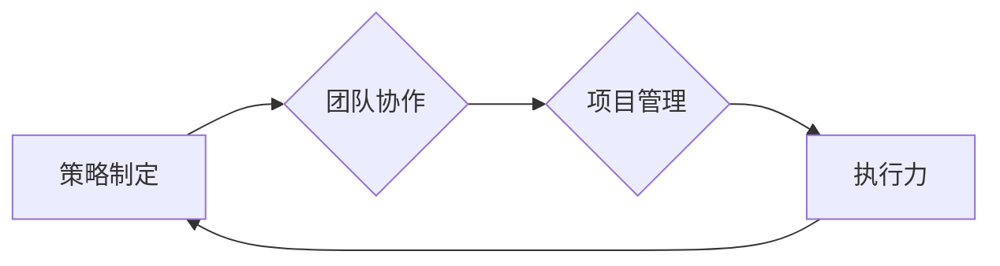

## 管理艺术：从策略到执行

> 关键词：软件架构、系统设计、敏捷开发、团队管理、技术决策、项目管理、执行力

### 1. 背景介绍

在当今瞬息万变的科技时代，软件开发已不再是单纯的代码编写，而演变为一个复杂的系统工程。高效的软件开发需要不仅具备扎实的技术能力，更需要精通管理艺术，将策略转化为实际行动，最终实现项目目标。

传统的软件开发模式往往强调技术细节和代码质量，而忽略了团队协作、沟通协调和项目管理等关键环节。随着软件项目规模和复杂度的不断增加，这种模式已难以满足现代软件开发的需求。

敏捷开发理念的兴起为软件开发带来了新的思路和方法。敏捷开发强调迭代开发、持续集成和团队协作，注重快速响应市场需求和用户反馈，提高软件开发效率和质量。

然而，敏捷开发并非一蹴而就，它需要团队成员具备良好的沟通能力、协作精神和执行力。如何将敏捷开发理念融入到实际项目中，如何有效地管理团队和项目，是软件开发人员需要不断学习和思考的问题。

### 2. 核心概念与联系

软件开发管理艺术的核心概念包括：

* **策略制定:** 明确项目目标、用户需求和技术路线，制定合理的开发计划和资源分配方案。
* **团队协作:** 建立高效的团队沟通机制，鼓励团队成员积极参与决策和协作，共同完成项目目标。
* **项目管理:** 采用科学的项目管理方法，有效地跟踪项目进度、控制项目风险和成本，确保项目按时、按质完成。
* **执行力:** 将策略转化为实际行动，高效地完成任务，并不断优化和改进工作流程。

这些核心概念相互关联，共同构成了软件开发管理艺术的框架。

**Mermaid 流程图:**



### 3. 核心算法原理 & 具体操作步骤

在软件开发管理艺术中，并没有特定的算法，而是需要运用多种管理方法和工具，结合实际情况进行灵活调整。

**3.1 算法原理概述**

软件开发管理艺术的核心在于高效地组织和协调资源，将策略转化为实际行动。

**3.2 算法步骤详解**

1. **需求分析:** 详细了解用户需求，明确项目目标和功能范围。
2. **技术方案设计:** 根据需求分析结果，选择合适的技术架构和开发工具。
3. **项目计划制定:** 制定详细的项目计划，包括开发时间、资源分配、里程碑节点等。
4. **团队建设:** 组建高效的开发团队，明确每个成员的角色和职责。
5. **开发迭代:** 将项目分解为多个迭代周期，每次迭代完成一个功能模块。
6. **测试和验收:** 在每个迭代周期结束后，进行测试和验收，确保功能满足需求。
7. **部署和维护:** 将软件部署到生产环境，并提供持续的维护和更新服务。

**3.3 算法优缺点**

* **优点:** 灵活、迭代、快速响应市场需求。
* **缺点:** 需要团队成员具备良好的沟通能力和协作精神，项目管理难度较高。

**3.4 算法应用领域**

敏捷开发方法广泛应用于各种软件开发项目，例如：

* Web 应用开发
* 移动应用开发
* 企业级软件开发
* 游戏开发

### 4. 数学模型和公式 & 详细讲解 & 举例说明

在软件开发管理艺术中，可以使用数学模型和公式来分析和优化项目进度、资源分配和风险控制等方面。

**4.1 数学模型构建**

例如，可以使用甘特图来表示项目进度，其中每个任务都对应一个时间节点和持续时间。

**4.2 公式推导过程**

可以使用PERT公式来计算项目完成时间，公式如下：

```latex
T_e = \sum_{i=1}^{n} T_{ei}
```

其中：

* $T_e$ 是项目完成时间
* $T_{ei}$ 是每个任务的期望时间

**4.3 案例分析与讲解**

假设一个软件开发项目包含三个任务，每个任务的期望时间分别为：

* 任务 1: 10 天
* 任务 2: 15 天
* 任务 3: 20 天

根据PERT公式，项目完成时间为：

```latex
T_e = 10 + 15 + 20 = 45 天
```

### 5. 项目实践：代码实例和详细解释说明

在实际项目中，可以使用各种工具和技术来辅助软件开发管理。

**5.1 开发环境搭建**

可以使用 Git 作为版本控制系统，Trello 或 Jira 作为项目管理工具，Slack 或 Microsoft Teams 作为团队协作平台。

**5.2 源代码详细实现**

可以使用 Python 或 Java 等编程语言编写代码，并使用 Docker 或 Kubernetes 等容器技术进行部署和管理。

**5.3 代码解读与分析**

需要对代码进行详细的解读和分析，确保代码质量、可维护性和可扩展性。

**5.4 运行结果展示**

需要对软件运行结果进行测试和验收，确保软件功能满足需求。

### 6. 实际应用场景

软件开发管理艺术在各个行业都有广泛的应用场景，例如：

* **金融行业:** 开发金融交易系统、风险管理系统等。
* **医疗行业:** 开发电子病历系统、医疗影像分析系统等。
* **教育行业:** 开发在线教育平台、学习管理系统等。

**6.4 未来应用展望**

随着人工智能和云计算技术的不断发展，软件开发管理艺术将更加智能化和自动化。

### 7. 工具和资源推荐

**7.1 学习资源推荐**

* 《敏捷软件开发》
* 《精益软件开发》
* 《Scrum》

**7.2 开发工具推荐**

* Git
* Trello
* Jira
* Docker
* Kubernetes

**7.3 相关论文推荐**

* The Agile Manifesto
* Scrum: A Pocket Guide

### 8. 总结：未来发展趋势与挑战

**8.1 研究成果总结**

软件开发管理艺术的研究成果表明，敏捷开发方法能够提高软件开发效率和质量，但需要团队成员具备良好的沟通能力和协作精神。

**8.2 未来发展趋势**

未来软件开发管理艺术将更加智能化和自动化，人工智能和云计算技术将发挥越来越重要的作用。

**8.3 面临的挑战**

软件开发管理艺术面临的挑战包括：

* 如何更好地应对项目复杂性和不确定性
* 如何提高团队成员的沟通和协作能力
* 如何将人工智能和云计算技术应用于软件开发管理

**8.4 研究展望**

未来研究方向包括：

* 开发更加智能化的软件开发管理工具
* 研究如何更好地应用人工智能和云计算技术于软件开发管理
* 探讨如何提高团队成员的沟通和协作能力


### 9. 附录：常见问题与解答

**9.1 什么是敏捷开发？**

敏捷开发是一种软件开发方法，强调迭代开发、持续集成和团队协作，注重快速响应市场需求和用户反馈。

**9.2 什么是Scrum？**

Scrum是一种敏捷开发框架，定义了软件开发项目管理的流程和角色。

**9.3 如何提高团队协作能力？**

可以通过以下方式提高团队协作能力：

* 建立良好的沟通机制
* 鼓励团队成员积极参与决策
* 共同制定目标和计划
* 互相支持和帮助

**9.4 如何应对项目复杂性和不确定性？**

可以通过以下方式应对项目复杂性和不确定性：

* 将项目分解为多个小任务
* 使用迭代开发方法
* 持续监控项目进度和风险
* 灵活调整开发计划

**9.5 如何将人工智能和云计算技术应用于软件开发管理？**

人工智能和云计算技术可以应用于以下方面：

* 自动化代码生成和测试
* 智能项目管理和风险控制
* 数据分析和预测


作者：禅与计算机程序设计艺术 / Zen and the Art of Computer Programming 
