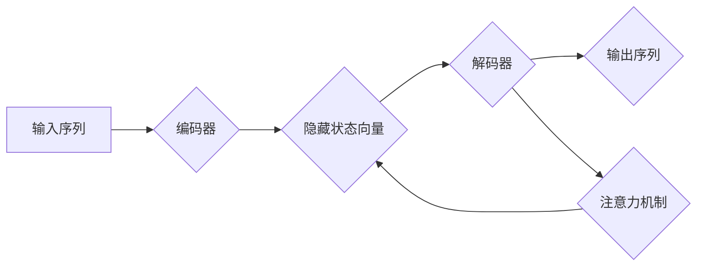

## 自然语言的解码详细过程

> 关键词：自然语言处理，解码，序列到序列模型，Transformer，注意力机制，BERT，GPT

## 1. 背景介绍

自然语言处理（NLP）作为人工智能领域的重要分支，致力于使计算机能够理解、处理和生成人类语言。其中，自然语言解码是NLP的核心任务之一，它涉及将输入的文本序列转换为目标文本序列的过程。例如，机器翻译、文本摘要、对话系统等都需要依赖于解码算法。

传统的解码方法主要基于统计语言模型，但随着深度学习的兴起，基于神经网络的解码模型逐渐成为主流。这些模型能够学习更复杂的语言规律，从而提高解码的准确性和流畅度。

## 2. 核心概念与联系

### 2.1  序列到序列模型

序列到序列模型（Sequence-to-Sequence，Seq2Seq）是一种用于处理输入序列和输出序列的深度学习模型架构。它由两个主要部分组成：编码器（Encoder）和解码器（Decoder）。

* **编码器**：负责将输入序列映射到一个固定长度的隐藏状态向量，该向量包含了输入序列的信息摘要。
* **解码器**：根据编码器的输出和当前生成的输出序列，预测下一个输出符号。

### 2.2  注意力机制

注意力机制（Attention Mechanism）是一种用于提高Seq2Seq模型性能的关键技术。它允许解码器关注输入序列中与当前生成符号相关的部分，从而更好地理解上下文信息。

**Mermaid 流程图：**



## 3. 核心算法原理 & 具体操作步骤

### 3.1  算法原理概述

解码算法的核心是根据输入序列和当前生成的输出序列，预测下一个输出符号。常见的解码算法包括贪婪解码、束搜索和自回归解码。

* **贪婪解码**：每次选择概率最高的符号作为输出，直到生成结束符号。
* **束搜索**：同时考虑多个候选符号，选择概率最高的路径作为输出。
* **自回归解码**：逐个生成输出符号，每个符号的生成都依赖于之前生成的符号。

### 3.2  算法步骤详解

以自回归解码为例，其步骤如下：

1.  **初始化**：设置解码器初始状态，例如隐藏状态向量。
2.  **输入**：将第一个输出符号作为输入，并将其与解码器状态进行结合。
3.  **预测**：根据解码器状态，预测下一个输出符号的概率分布。
4.  **选择**：从概率分布中选择概率最高的符号作为输出。
5.  **更新**：将选择的符号作为新的输入，并更新解码器状态。
6.  **重复**：重复步骤3-5，直到生成结束符号。

### 3.3  算法优缺点

* **贪婪解码**：简单易实现，但容易陷入局部最优解。
* **束搜索**：可以找到更优解，但计算复杂度较高。
* **自回归解码**：能够生成更流畅的文本，但训练过程更复杂。

### 3.4  算法应用领域

解码算法广泛应用于各种NLP任务，例如：

* **机器翻译**：将一种语言翻译成另一种语言。
* **文本摘要**：生成文本的简短摘要。
* **对话系统**：构建能够与人类进行自然对话的系统。
* **文本生成**：生成新的文本内容，例如诗歌、小说等。

## 4. 数学模型和公式 & 详细讲解 & 举例说明

### 4.1  数学模型构建

解码过程可以看作是一个概率模型，其目标是最大化目标文本序列的概率。

假设输入序列为 $x = (x_1, x_2,..., x_n)$，目标文本序列为 $y = (y_1, y_2,..., y_m)$，解码器状态为 $h_t$，则目标文本序列的概率可以表示为：

$$P(y|x) = \prod_{t=1}^{m} P(y_t|y_{1:t-1}, x)$$

其中，$P(y_t|y_{1:t-1}, x)$ 表示在已知之前生成的符号序列 $y_{1:t-1}$ 和输入序列 $x$ 的条件下，生成当前符号 $y_t$ 的概率。

### 4.2  公式推导过程

解码器通常使用循环神经网络（RNN）或Transformer模型来计算 $P(y_t|y_{1:t-1}, x)$。

* **RNN**：RNN模型通过隐藏状态向量来记忆之前生成的符号信息，从而影响当前符号的生成概率。

* **Transformer**：Transformer模型使用注意力机制来关注输入序列中与当前生成符号相关的部分，从而更好地理解上下文信息。

### 4.3  案例分析与讲解

例如，在机器翻译任务中，输入序列为英文句子，目标文本序列为目标语言句子。解码器需要根据输入句子和之前生成的翻译结果，预测下一个目标语言符号。

## 5. 项目实践：代码实例和详细解释说明

### 5.1  开发环境搭建

* **操作系统**: Ubuntu 20.04
* **Python 版本**: 3.8
* **深度学习框架**: TensorFlow 2.x

### 5.2  源代码详细实现

```python
import tensorflow as tf

# 定义解码器模型
class Decoder(tf.keras.Model):
    def __init__(self, vocab_size, embedding_dim, hidden_dim):
        super(Decoder, self).__init__()
        self.embedding = tf.keras.layers.Embedding(vocab_size, embedding_dim)
        self.rnn = tf.keras.layers.LSTM(hidden_dim)
        self.dense = tf.keras.layers.Dense(vocab_size)

    def call(self, inputs, hidden_state):
        # 将输入符号嵌入到词向量空间
        embedded = self.embedding(inputs)
        # 将嵌入向量与隐藏状态进行结合
        combined = tf.concat([embedded, hidden_state], axis=-1)
        # 通过LSTM层进行处理
        output, hidden_state = self.rnn(combined)
        # 通过全连接层预测下一个符号的概率分布
        output = self.dense(output)
        return output, hidden_state

# 定义解码器训练过程
def train_decoder(decoder, encoder_outputs, target_sequences):
    # 定义损失函数和优化器
    loss_fn = tf.keras.losses.SparseCategoricalCrossentropy()
    optimizer = tf.keras.optimizers.Adam()

    # 训练循环
    for epoch in range(num_epochs):
        for batch in range(len(target_sequences)):
            # 计算损失
            with tf.GradientTape() as tape:
                # 获取解码器输出
                outputs, _ = decoder(target_sequences[:, :-1, :], encoder_outputs)
                # 计算损失
                loss = loss_fn(target_sequences[:, 1:, :], outputs)

            # 反向传播
            gradients = tape.gradient(loss, decoder.trainable_variables)
            optimizer.apply_gradients(zip(gradients, decoder.trainable_variables))

        # 打印损失
        print(f"Epoch {epoch+1}, Loss: {loss.numpy()}")

```

### 5.3  代码解读与分析

* **Decoder 模型**: 定义了解码器模型结构，包括嵌入层、LSTM层和全连接层。
* **train_decoder 函数**: 定义了解码器训练过程，包括损失函数、优化器和训练循环。

### 5.4  运行结果展示

训练完成后，可以将解码器模型应用于实际任务，例如机器翻译。

## 6. 实际应用场景

### 6.1  机器翻译

解码器在机器翻译中扮演着关键角色，它负责将源语言文本翻译成目标语言文本。

### 6.2  文本摘要

解码器可以用于生成文本的简短摘要，例如新闻文章的摘要或会议记录的摘要。

### 6.3  对话系统

解码器可以用于构建能够与人类进行自然对话的系统，例如聊天机器人或虚拟助手。

### 6.4  未来应用展望

随着深度学习技术的不断发展，解码器在未来将有更广泛的应用场景，例如：

* **代码生成**: 自动生成代码，提高开发效率。
* **创意写作**: 辅助人类进行创意写作，例如诗歌、小说等。
* **个性化推荐**: 根据用户的喜好生成个性化的推荐内容。

## 7. 工具和资源推荐

### 7.1  学习资源推荐

* **书籍**:
    * 《深度学习》
    * 《自然语言处理入门》
* **在线课程**:
    * Coursera: 自然语言处理
    * edX: 深度学习

### 7.2  开发工具推荐

* **TensorFlow**: 开源深度学习框架
* **PyTorch**: 开源深度学习框架
* **Hugging Face**: 自然语言处理模型库

### 7.3  相关论文推荐

* **Attention Is All You Need**: Transformer模型的提出论文
* **BERT: Pre-training of Deep Bidirectional Transformers for Language Understanding**: BERT模型的提出论文
* **GPT-3: Language Models are Few-Shot Learners**: GPT-3模型的提出论文

## 8. 总结：未来发展趋势与挑战

### 8.1  研究成果总结

近年来，自然语言解码领域取得了显著进展，例如Transformer模型的提出、注意力机制的应用、预训练语言模型的开发等。这些成果使得解码模型的性能大幅提升，并在各种NLP任务中取得了优异的成绩。

### 8.2  未来发展趋势

* **更强大的预训练模型**: 预训练模型的规模和能力将继续提升，从而进一步提高解码模型的性能。
* **更有效的解码算法**: 研究人员将继续探索更有效的解码算法，例如基于强化学习的解码算法。
* **跨语言解码**: 研究人员将致力于开发能够跨语言解码的模型，例如将英文翻译成中文、法文等。

### 8.3  面临的挑战

* **数据稀缺**: 许多语言的数据量有限，这限制了模型的训练和性能提升。
* **计算资源**: 训练大型解码模型需要大量的计算资源，这对于资源有限的机构来说是一个挑战。
* **伦理问题**: 自然语言解码模型可能被用于生成虚假信息或进行恶意攻击，因此需要关注其伦理问题。

### 8.4  研究展望

未来，自然语言解码领域将继续朝着更强大、更智能、更安全的方向发展。


## 9. 附录：常见问题与解答

* **Q1: 什么是自回归解码？**

* **A1:** 自回归解码是一种逐个生成输出符号的方法，每个符号的生成都依赖于之前生成的符号。

* **Q2: 什么是注意力机制？**

* **A2:** 注意力机制是一种用于提高Seq2Seq模型性能的技术，它允许解码器关注输入序列中与当前生成符号相关的部分。

* **Q3: 如何评估解码模型的性能？**

* **A3:** 常见的评估指标包括BLEU、ROUGE和PER。

* **Q4: 如何选择合适的解码算法？**

* **A4:** 选择解码算法需要根据具体任务和模型架构进行考虑。

* **Q5: 如何训练解码模型？**

* **A5:** 训练解码模型需要准备训练数据、定义损失函数和优化器，并进行训练循环。


作者：禅与计算机程序设计艺术 / Zen and the Art of Computer Programming 
