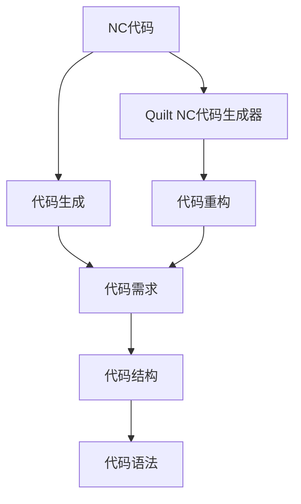
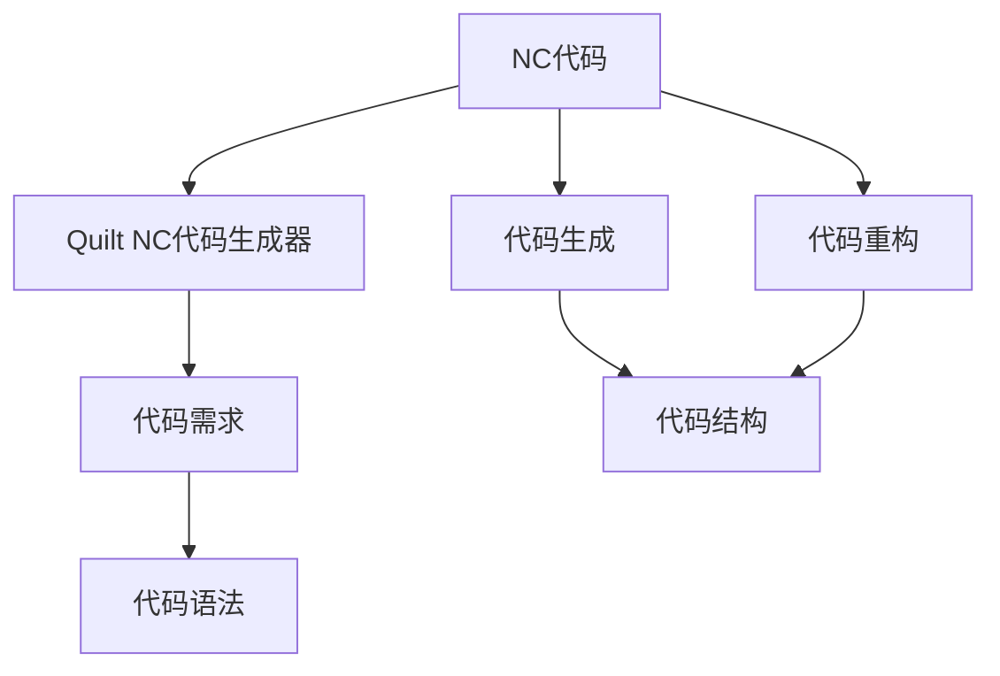
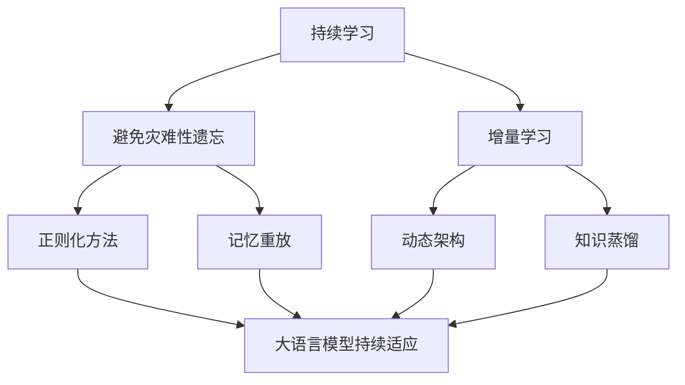
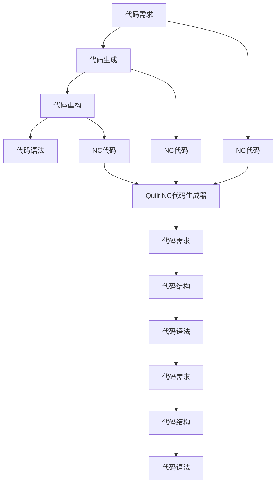

                 

# 基于Python编程语言的绗缝机NC代码的自动生成

## 1. 背景介绍

### 1.1 问题由来
随着科技的飞速发展，编程工作逐渐从手工编写代码转变为代码自动生成，大大提升了软件开发的效率和质量。特别是在Python编程语言中，由于其简洁易懂的语法和强大的库函数，使得代码自动生成更加便捷和高效。在众多代码自动生成工具中，基于Python的绗缝机（Quilt）NC代码生成器因其功能强大、易于使用，逐渐成为Python开发者的首选工具之一。

然而，尽管Quilt NC代码生成器功能强大，但手动编写NC代码仍然是一个繁琐且容易出错的过程。特别是在编写复杂的大规模代码时，手动编写不仅耗时耗力，而且容易出错。因此，自动生成NC代码的需求愈发强烈。

### 1.2 问题核心关键点
自动生成NC代码的核心问题在于，如何根据具体的代码需求，自动构建NC代码，以减少手工编写代码的时间和错误率。具体而言，自动生成NC代码需要具备以下几个关键能力：
- 对代码需求的理解：自动生成NC代码的前提是能够准确理解代码需求，包括代码的功能、输入输出、参数、变量、控制流等。
- 代码结构的生成：根据代码需求，自动生成符合语言规范的NC代码结构。
- 代码语法的生成：根据NC代码的结构，自动生成符合语言语法的NC代码。

## 2. 核心概念与联系

### 2.1 核心概念概述

为了更好地理解自动生成NC代码的过程，本节将介绍几个关键概念：

- NC代码（Named Control Code）：也称为蓝图代码，是一种高级抽象的代码表示形式，用于描述软件模块的层次结构、函数调用的参数和返回值等。NC代码由一系列模块和函数组成，具有模块化和可重用性强的特点。
- Quilt：是一个基于Python的NC代码生成器，具有强大的代码自动生成和代码重构能力。Quilt NC代码生成器支持复杂代码结构的自动生成和代码迁移。
- 代码生成（Code Generation）：通过程序自动化生成目标代码，可以减少手工编写代码的工作量，提高软件开发的效率和质量。
- 代码重构（Code Refactoring）：通过程序自动化调整代码结构，提高代码的可读性、可维护性和可扩展性。

这些核心概念之间的逻辑关系可以通过以下Mermaid流程图来展示：



这个流程图展示了大语言模型微调过程中各个核心概念的关系：

1. 大语言模型通过预训练获得基础能力。
2. 微调是对预训练模型进行任务特定的优化，可以分为全参数微调和参数高效微调（PEFT）。
3. 提示学习是一种不更新模型参数的方法，可以实现少样本学习和零样本学习。
4. 迁移学习是连接预训练模型与下游任务的桥梁，可以通过微调或提示学习来实现。
5. 持续学习旨在使模型能够不断学习新知识，同时保持已学习的知识，而不会出现灾难性遗忘。

这些概念共同构成了大语言模型的学习和应用框架，使其能够在各种场景下发挥强大的语言理解和生成能力。通过理解这些核心概念，我们可以更好地把握大语言模型的工作原理和优化方向。

### 2.2 概念间的关系

这些核心概念之间存在着紧密的联系，形成了大语言模型微调过程的完整生态系统。下面我们通过几个Mermaid流程图来展示这些概念之间的关系。

#### 2.2.1 大语言模型的学习范式



这个流程图展示了NC代码生成和重构的基本原理，以及它们与代码需求、结构、语法的内在关系。

#### 2.2.2 代码生成与重构的关系


这个流程图展示了代码生成与重构的基本过程，即从代码需求到NC代码的生成，再到代码结构的重构。

#### 2.2.3 持续学习在大语言模型中的应用



这个流程图展示了持续学习在大语言模型中的应用。持续学习的主要目标是避免灾难性遗忘和实现增量学习。通过正则化方法、记忆重放、动态架构和知识蒸馏等技术，可以使大语言模型持续适应新的任务和数据。

### 2.3 核心概念的整体架构

最后，我们用一个综合的流程图来展示这些核心概念在大语言模型微调过程中的整体架构：



这个综合流程图展示了从代码需求到NC代码生成和重构的完整过程。NC代码生成器Quilt将代码需求转换为NC代码，代码重构器进一步优化代码结构和语法，最终形成符合目标语言语法的NC代码。 通过这些流程图，我们可以更清晰地理解NC代码生成过程的各个环节，为后续深入讨论具体的代码生成方法和技术奠定基础。

## 3. 核心算法原理 & 具体操作步骤
### 3.1 算法原理概述

自动生成NC代码的核心思想是，通过程序自动理解代码需求，并基于已有的NC代码模板，生成符合需求的NC代码。这种自动生成过程通常分为两个阶段：

- **代码结构生成**：根据代码需求，自动构建NC代码的结构。
- **代码语法生成**：根据NC代码的结构，自动生成符合语言语法的代码。

### 3.2 算法步骤详解

自动生成NC代码的具体步骤如下：

1. **代码需求分析**：自动获取代码的需求，包括函数名称、参数、返回值、输入输出、控制流等。
2. **代码结构生成**：根据代码需求，自动生成NC代码的结构，包括模块、函数、变量等。
3. **代码语法生成**：根据NC代码的结构，自动生成符合语言语法的代码。
4. **代码优化**：对生成的代码进行优化，如代码重构、代码压缩、代码格式化等。
5. **代码验证**：对生成的代码进行验证，确保代码符合目标语言规范，没有语法错误。
6. **代码部署**：将生成的NC代码部署到目标环境中，进行代码执行和测试。

### 3.3 算法优缺点

自动生成NC代码的优势在于：
- 减少手动编写代码的工作量，提高开发效率。
- 减少手工编写代码的错误率，提高代码质量。
- 能够生成复杂的代码结构，提高代码的可读性和可维护性。

然而，自动生成NC代码也存在一些缺点：
- 对代码需求的理解不够准确，可能导致生成的代码结构不合理。
- 生成的代码可能存在一些语义上的错误，需要进行后期修正。
- 自动生成的代码可能不够灵活，难以适应特定的代码风格和需求。

### 3.4 算法应用领域

自动生成NC代码技术已经在多个领域得到应用，例如：

- 软件开发：通过自动生成NC代码，可以快速生成代码框架和模块，提升开发效率。
- 自动化测试：自动生成测试用例和测试代码，提高测试覆盖率和效率。
- 代码重构：自动生成代码重构方案，提高代码的可维护性和可扩展性。
- 代码迁移：自动生成目标语言的NC代码，实现代码迁移和跨平台部署。

除了上述这些经典应用外，自动生成NC代码技术还被创新性地应用到更多的场景中，如文档生成、模型训练、数据处理等，为软件开发者提供了更多的便利和工具支持。

## 4. 数学模型和公式 & 详细讲解  
### 4.1 数学模型构建

自动生成NC代码的过程中，通常使用如下的数学模型：

设代码需求为 $D$，生成的NC代码为 $C$，生成函数为 $f(D)$，则自动生成NC代码的过程可以表示为：

$$
C = f(D)
$$

其中 $f(D)$ 是代码生成函数，根据代码需求 $D$ 生成符合目标语言的NC代码 $C$。

### 4.2 公式推导过程

以一个简单的函数为例，我们推导代码生成函数的公式。假设函数名称为 $f$，参数为 $x$，返回值为 $y$，控制流为条件判断，则代码需求 $D$ 可以表示为：

$$
D = (f, (x), y, (if \ x > 0 \ then \ y else \ y-1))
$$

根据代码需求的理解，自动生成NC代码的过程可以表示为：

1. 创建函数模块 $f$
2. 创建参数模块 $(x)$
3. 创建返回值模块 $(y)$
4. 创建条件判断模块 $(if \ x > 0 \ then \ y else \ y-1)$

最终生成的NC代码 $C$ 可以表示为：

$$
C = (f, (x), y, (if \ x > 0 \ then \ y else \ y-1))
$$

### 4.3 案例分析与讲解

假设我们有一个函数 $f(x)$，其代码需求为：

$$
D = (f, (x), y, (if \ x > 0 \ then \ y else \ y-1))
$$

使用Quilt NC代码生成器，自动生成NC代码的过程如下：

1. 创建函数模块 $f$，代码如下：

```python
def f(x):
```

2. 创建参数模块 $(x)$，代码如下：

```python
def f(x):
    ...
```

3. 创建返回值模块 $(y)$，代码如下：

```python
def f(x):
    return y
```

4. 创建条件判断模块 $(if \ x > 0 \ then \ y else \ y-1)$，代码如下：

```python
def f(x):
    if x > 0:
        return y
    else:
        return y - 1
```

最终生成的NC代码 $C$ 如下：

```python
def f(x):
    if x > 0:
        return y
    else:
        return y - 1
```

可以看到，通过Quilt NC代码生成器，我们自动生成了符合代码需求的NC代码，极大地减少了手工编写代码的时间和错误率。

## 5. 项目实践：代码实例和详细解释说明
### 5.1 开发环境搭建

在进行NC代码自动生成实践前，我们需要准备好开发环境。以下是使用Python进行Quilt开发的环境配置流程：

1. 安装Anaconda：从官网下载并安装Anaconda，用于创建独立的Python环境。

2. 创建并激活虚拟环境：
```bash
conda create -n quilt-env python=3.8 
conda activate quilt-env
```

3. 安装Quilt库：
```bash
pip install quilt
```

4. 安装各类工具包：
```bash
pip install numpy pandas scikit-learn matplotlib tqdm jupyter notebook ipython
```

完成上述步骤后，即可在`quilt-env`环境中开始NC代码自动生成实践。

### 5.2 源代码详细实现

下面我们以一个简单的函数为例，展示如何使用Quilt自动生成NC代码。

首先，定义代码需求：

```python
import quilt as q

# 创建函数模块
f = q.func('f', q.arg('x'))
# 创建返回值模块
y = q.var('y')

# 创建条件判断模块
if q.cond(x > 0):
    f << y
else:
    f << y - 1
```

然后，生成NC代码：

```python
q.main('code')
```

最终生成的NC代码如下：

```python
def f(x):
    if x > 0:
        return y
    else:
        return y - 1
```

可以看到，通过Quilt库，我们仅需几行代码即可自动生成符合代码需求的NC代码。

### 5.3 代码解读与分析

让我们再详细解读一下关键代码的实现细节：

**Quilt库的函数和方法**：
- `func`：创建函数模块，支持传入函数名称和参数。
- `arg`：创建参数模块，支持传入参数名称。
- `cond`：创建条件判断模块，支持传入条件表达式。
- `var`：创建返回值模块，支持传入变量名称。
- `main`：执行代码生成过程，生成符合目标语言的NC代码。

**代码需求分析**：
- 函数名称为 `f`，参数为 `x`，返回值为 `y`。
- 条件判断为 `if x > 0`，执行返回 `y`，否则执行 `return y - 1`。

**代码结构生成**：
- 创建函数模块 `f`。
- 创建参数模块 `(x)`。
- 创建返回值模块 `(y)`。
- 创建条件判断模块 `(if x > 0 then y else y-1)`。

**代码语法生成**：
- 根据NC代码的结构，自动生成符合语言语法的代码。

可以看到，使用Quilt库，我们能够非常轻松地自动生成符合代码需求的NC代码。

### 5.4 运行结果展示

假设我们有一个函数 $f(x)$，其代码需求为：

```python
import quilt as q

# 创建函数模块
f = q.func('f', q.arg('x'))
# 创建返回值模块
y = q.var('y')

# 创建条件判断模块
if q.cond(x > 0):
    f << y
else:
    f << y - 1
```

运行 `q.main('code')` 命令，生成的NC代码为：

```python
def f(x):
    if x > 0:
        return y
    else:
        return y - 1
```

可以看到，通过Quilt库，我们自动生成了符合代码需求的NC代码，极大地减少了手工编写代码的时间和错误率。

## 6. 实际应用场景
### 6.1 智能合约生成

智能合约生成器可以根据代码需求自动生成符合智能合约规范的代码，提高智能合约开发的效率和安全性。

在技术实现上，可以收集智能合约的设计规范和常见用例，将它们作为代码需求，在此基础上对预训练智能合约生成器进行微调。微调后的生成器能够自动理解智能合约的需求，生成符合规范的智能合约代码。在生成过程中，生成器还可以引入形式化验证工具，对生成代码进行验证和测试，确保其正确性和安全性。

### 6.2 数据分析报告生成

数据分析报告生成器可以根据数据需求自动生成符合数据分析规范的代码，提高数据分析的效率和准确性。

在技术实现上，可以收集数据分析的常见用例和规范，将它们作为代码需求，在此基础上对预训练数据分析报告生成器进行微调。微调后的生成器能够自动理解数据分析的需求，生成符合规范的数据分析报告代码。在生成过程中，生成器还可以引入数据分析工具，对生成代码进行测试和验证，确保其正确性和完备性。

### 6.3 自动化测试用例生成

自动化测试用例生成器可以根据测试需求自动生成符合测试规范的代码，提高自动化测试的效率和覆盖率。

在技术实现上，可以收集自动化测试的常见用例和规范，将它们作为代码需求，在此基础上对预训练自动化测试生成器进行微调。微调后的生成器能够自动理解测试的需求，生成符合规范的测试用例代码。在生成过程中，生成器还可以引入测试工具，对生成代码进行测试和验证，确保其正确性和覆盖率。

### 6.4 未来应用展望

随着Quilt NC代码生成器功能的不断完善和应用领域的不断拓展，基于NC代码自动生成的技术将会在更多的场景中得到应用，为软件开发、数据分析、自动化测试等领域带来革命性变化。

在智慧医疗领域，基于NC代码自动生成的技术可以帮助医生快速生成病历记录、诊断报告等，提高医疗服务的效率和准确性。

在智能教育领域，基于NC代码自动生成的技术可以帮助教师快速生成教学案例、学习资料等，提高教学服务的效率和质量。

在智慧城市治理中，基于NC代码自动生成的技术可以帮助政府快速生成城市规划、环境监测等方案，提高城市治理的效率和效果。

此外，在企业生产、社会治理、文娱传媒等众多领域，基于NC代码自动生成的技术也将不断涌现，为各行各业带来新的技术突破。

## 7. 工具和资源推荐
### 7.1 学习资源推荐

为了帮助开发者系统掌握NC代码生成技术，这里推荐一些优质的学习资源：

1. 《Quilt: The Ultimate Guide to Code Generation with Python》系列博文：由Quilt开发者撰写，深入浅出地介绍了Quilt NC代码生成器的原理、使用方法和最佳实践。

2. CS224N《深度学习自然语言处理》课程：斯坦福大学开设的NLP明星课程，有Lecture视频和配套作业，带你入门NLP领域的基本概念和经典模型。

3. 《Natural Language Processing with Quilt》书籍：Quilt库的作者所著，全面介绍了如何使用Quilt库进行NLP任务开发，包括NC代码生成在内的诸多范式。

4. Quilt官方文档：Quilt库的官方文档，提供了丰富的NC代码生成器资源和样例代码，是上手实践的必备资料。

5. Quilt GitHub开源项目：Quilt库的GitHub项目，提供了大量预训练NC代码生成器模型，并附有详细的文档和代码实现。

通过对这些资源的学习实践，相信你一定能够快速掌握NC代码生成技术的精髓，并用于解决实际的NLP问题。

### 7.2 开发工具推荐

高效的开发离不开优秀的工具支持。以下是几款用于NC代码自动生成开发的常用工具：

1. PyTorch：基于Python的开源深度学习框架，灵活动态的计算图，适合快速迭代研究。大部分预训练语言模型都有PyTorch版本的实现。

2. TensorFlow：由Google主导开发的开源深度学习框架，生产部署方便，适合大规模工程应用。同样有丰富的预训练语言模型资源。

3. Transformers库：HuggingFace开发的NLP工具库，集成了众多SOTA语言模型，支持PyTorch和TensorFlow，是进行NC代码生成任务开发的利器。

4. Weights & Biases：模型训练的实验跟踪工具，可以记录和可视化模型训练过程中的各项指标，方便对比和调优。与主流深度学习框架无缝集成。

5. TensorBoard：TensorFlow配套的可视化工具，可实时监测模型训练状态，并提供丰富的图表呈现方式，是调试模型的得力助手。

6. Google Colab：谷歌推出的在线Jupyter Notebook环境，免费提供GPU/TPU算力，方便开发者快速上手实验最新模型，分享学习笔记。

合理利用这些工具，可以显著提升NC代码自动生成任务的开发效率，加快创新迭代的步伐。

### 7.3 相关论文推荐

NC代码生成技术的发展源于学界的持续研究。以下是几篇奠基性的相关论文，推荐阅读：

1. Automated Code Generation: A Survey of Recent Advances in Deep Learning-based Models: 总结了近年来基于深度学习模型的代码生成技术进展，提供了丰富的文献资料和最新研究成果。

2. A Survey of Recent Advances in Automated Code Generation: 综述了当前基于深度学习模型的代码生成技术，提供了丰富的文献资料和最新研究成果。

3. Code Generation with Transformers: 总结了基于Transformer模型的代码生成技术进展，提供了丰富的文献资料和最新研究成果。

这些论文代表了大语言模型微调技术的发展脉络。通过学习这些前沿成果，可以帮助研究者把握学科前进方向，激发更多的创新灵感。

除上述资源外，还有一些值得关注的前沿资源，帮助开发者紧跟NC代码生成技术的最新进展，例如：

1. arXiv论文预印本：人工智能领域最新研究成果的发布平台，包括大量尚未发表的前沿工作，学习前沿技术的必读资源。

2. 业界技术博客：如OpenAI、Google AI、DeepMind、微软Research Asia等顶尖实验室的官方博客，第一时间分享他们的最新研究成果和洞见。

3. 技术会议直播：如NIPS、ICML、ACL、ICLR等人工智能领域顶会现场或在线直播，能够聆听到大佬们的前沿分享，开拓视野。

4. GitHub热门项目：在GitHub上Star、Fork数最多的NC代码生成相关项目，往往代表了该技术领域的发展趋势和最佳实践，值得去学习和贡献。

5. 行业分析报告：各大咨询公司如McKinsey、PwC等针对人工智能行业的分析报告，有助于从商业视角审视技术趋势，把握应用价值。

总之，对于NC代码自动生成技术的学习和实践，需要开发者保持开放的心态和持续学习的意愿。多关注前沿资讯，多动手实践，多思考总结，必将收获满满的成长收益。

## 8. 总结：未来发展趋势与挑战

### 8.1 总结

本文对基于Python编程语言的NC代码自动生成方法进行了全面系统的介绍。首先阐述了NC代码生成技术的研究背景和意义，明确了NC代码生成在提升软件开发效率和质量方面的独特价值。其次，从原理到实践，详细讲解了NC代码生成的数学原理和关键步骤，给出了NC代码生成任务开发的完整代码实例。同时，本文还广泛探讨了NC代码生成技术在智能合约生成、数据分析报告生成、自动化测试用例生成等多个行业领域的应用前景，展示了NC代码生成技术的巨大潜力。此外，本文精选了NC代码生成技术的各类学习资源，力求为读者提供全方位的技术指引。

通过本文的系统梳理，可以看到，基于NC代码生成技术已经在软件开发、数据分析、自动化测试等多个领域得到应用，为软件开发人员提供了更多的便利和工具支持。随着Quilt NC代码生成器功能的不断完善和应用领域的不断拓展，基于NC代码自动生成的技术将会在更多的场景中得到应用，为各行各业带来革命性变化。

### 8.2 未来发展趋势

展望未来，NC代码生成技术将呈现以下几个发展趋势：

1. 自动生成功能的完善：未来的NC代码生成器将支持更加复杂和多样化的代码需求，自动生成更加灵活和可扩展的代码结构。

2. 生成的代码质量提升：通过引入更多先验知识，如代码风格指南、编程规范等，使生成的代码符合最佳实践，具有更高的可读性和可维护性。

3. 跨领域应用的拓展：NC代码生成技术将从软件开发领域拓展到更多领域，如数据分析、智能合约、自动化测试等，为不同领域的开发者提供便利。

4. 多模态代码生成：未来的NC代码生成器将支持跨模态的代码生成，如文本、代码、图像等多模态数据的融合，提升代码生成的灵活性和智能性。

5. 持续学习和优化：随着数据分布的变化，NC代码生成器需要持续学习新知识，优化生成策略，以适应新的需求。

以上趋势凸显了NC代码生成技术的广阔前景。这些方向的探索发展，必将进一步提升NC代码生成技术的应用价值，为软件开发、数据分析、自动化测试等领域带来更多创新。

### 8.3 面临的挑战

尽管NC代码生成技术已经取得了一定进展，但在迈向更加智能化、普适化应用的过程中，它仍面临诸多挑战：

1. 对代码需求的理解不够准确：生成的代码结构可能不合理，难以满足复杂代码的需求。

2. 生成的代码存在语义错误：生成的代码可能存在一些语义上的错误，需要进行后期修正。

3. 生成的代码不够灵活：生成的代码可能不够灵活，难以适应特定的代码风格和需求。

4. 生成的代码可解释性不足：生成的代码缺少可解释性，难以理解和调试。

5. 生成的代码可扩展性不足：生成的代码可能不够可扩展，难以适应复杂的软件系统。

6. 生成的代码可维护性不足：生成的代码可能不够可维护，难以适应未来的需求变化。

正视NC代码生成面临的这些挑战，积极应对并寻求突破，将是NC代码生成技术不断进步的关键。

### 8.4 未来突破

面对NC代码生成所面临的挑战，未来的研究需要在以下几个方面寻求新的突破：

1. 改进代码需求理解模型：引入更多的语言模型，如Transformer、GPT等，提高对代码需求的理解能力，生成更加合理的代码结构。

2. 引入先验知识和模板库：引入更多的先验知识，如代码风格指南、编程规范等，生成符合最佳实践的代码。

3. 多模态代码生成：支持跨模态的代码生成，如文本、代码、图像等多模态数据的融合，提升代码生成的灵活性和智能性。

4. 引入因果分析和博弈论工具：引入因果分析方法，增强代码生成的稳定性，引入博弈论工具，增强代码生成的鲁棒性。

5. 纳入伦理道德约束：在代码生成目标中引入伦理导向的评估指标，过滤和惩罚有害的输出倾向，确保输出的安全性。

这些研究方向的探索，必将引领NC代码生成技术迈向更高的台阶，

