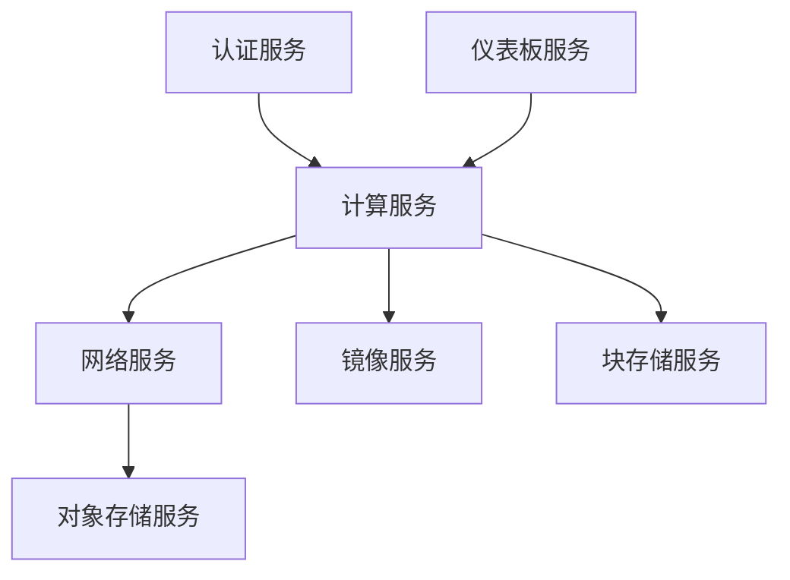
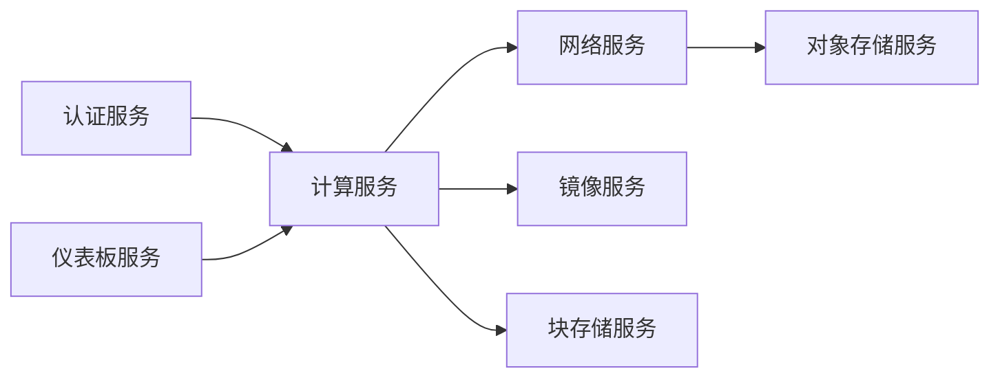

                 

# 基于openstack的云服务平台

## 1. 背景介绍

### 1.1 问题由来

近年来，随着云计算技术的迅猛发展，云服务平台已成为企业信息化建设的重要组成部分。然而，传统的云服务提供商，如Amazon Web Services（AWS）、Microsoft Azure和Google Cloud Platform（GCP），往往需要高额的部署和维护成本，且无法完全满足企业自定义的需求。OpenStack作为一个开源的云计算平台，以其灵活性、可定制性和成本效益，吸引了越来越多的企业和开发者关注。

### 1.2 问题核心关键点

OpenStack是一个开源的云计算平台，提供了一套完整的云计算解决方案，包括虚拟化、计算资源管理、存储、网络、身份认证等功能模块。通过OpenStack，用户可以构建和管理自己的私有云、公有云或混合云环境，实现资源的弹性扩展和灵活管理。然而，OpenStack也面临着一些挑战：

- 安装和配置复杂，对运维人员的技术要求高。
- 生态系统复杂，需要处理大量的依赖关系和兼容性问题。
- 在性能、安全性和可靠性方面仍有提升空间。

本文档将围绕基于OpenStack的云服务平台的核心概念、核心算法原理和具体操作步骤，以及实际应用场景、未来展望等进行详细探讨，希望能为OpenStack的学习和实践提供全面的指导。

## 2. 核心概念与联系

### 2.1 核心概念概述

OpenStack是一个由多个子项目组成的开源云计算平台，主要包括以下组件：

- **Nova**：计算服务（管理虚拟机）。
- **Neutron**：网络服务（管理虚拟网络和交换机）。
- **Glance**：图像服务（管理虚拟机镜像）。
- **Keystone**：身份认证服务（管理用户和租户）。
- **Horizon**：仪表板服务（用户界面）。
- **Cinder**：块存储服务（管理块存储）。
- **Swift**：对象存储服务（管理非结构化数据）。

这些组件通过RESTful API进行交互，构建了一个完整的云服务平台生态。

### 2.2 核心概念间的联系

以下通过一个简单的Mermaid流程图展示OpenStack各组件之间的关系：



从上述图表可以看出，OpenStack各个组件之间存在紧密的依赖关系。以计算服务（Nova）为例，需要通过网络服务（Neutron）实现虚拟机间的通信，通过镜像服务（Glance）管理和分发虚拟机镜像，通过块存储服务（Cinder）管理虚拟机的硬盘存储，以及通过身份认证服务（Keystone）管理用户和租户等。

### 2.3 核心概念的整体架构

整个OpenStack架构如下：



通过OpenStack提供的API，用户可以通过Web界面或命令行接口（CLI）管理和操作云资源。OpenStack还提供了广泛的API接口，使得第三方应用程序能够与OpenStack系统集成，实现更复杂的云服务功能。

## 3. 核心算法原理 & 具体操作步骤

### 3.1 算法原理概述

OpenStack的核心算法原理主要包括以下几个方面：

- **资源管理**：通过虚拟机管理、网络管理、存储管理等技术，实现资源的弹性扩展和灵活调度。
- **API接口**：通过RESTful API实现各个组件之间的通信和协同工作，提供了丰富的接口和扩展点。
- **多租户支持**：通过身份认证和授权机制，支持多个用户和租户共同使用云资源。
- **高可用性**：通过冗余配置和故障转移技术，保证云服务的高可用性。

### 3.2 算法步骤详解

以下详细介绍基于OpenStack的云服务平台的搭建步骤：

1. **环境准备**：
   - 安装OpenStack所需的操作系统（如Ubuntu）。
   - 安装OpenStack各个组件所需的软件包（如Nova、Neutron、Glance等）。

2. **环境配置**：
   - 配置数据库（如MySQL）和认证服务（如Keystone）。
   - 配置计算服务（Nova）和网络服务（Neutron）。
   - 配置块存储服务（Cinder）和对象存储服务（Swift）。

3. **网络配置**：
   - 配置虚拟交换机（VXLAN）和虚拟网络（VLAN）。
   - 配置虚拟网络（Neutron）的子网、路由和网关等。

4. **身份认证**：
   - 配置身份认证服务（Keystone），创建管理员账户和租户账户。
   - 配置API密钥（Token）和用户身份验证。

5. **创建虚拟机**：
   - 使用仪表板界面（Horizon）或命令行接口（CLI）创建虚拟机实例。
   - 配置虚拟机存储、网络和镜像等资源。

6. **扩展和优化**：
   - 根据业务需求和性能指标，进行扩展和优化（如增加节点、调整资源配置等）。
   - 使用监控工具（如Nagios、Grafana）进行性能监控和故障排查。

### 3.3 算法优缺点

OpenStack的优点包括：

- **灵活性高**：支持自定义配置和扩展，适合各种规模的企业使用。
- **成本低**：开源平台，部署和维护成本低。
- **可定制性强**：支持插件和扩展，可以根据需求进行定制。

缺点包括：

- **配置复杂**：需要较高的运维水平和技术支持。
- **性能不稳定**：在大规模部署环境下，性能和稳定性仍有提升空间。
- **生态系统复杂**：需要处理大量的依赖关系和兼容性问题。

### 3.4 算法应用领域

基于OpenStack的云服务平台适用于各种规模的企业和组织，特别是在以下领域：

- **企业IT基础设施**：实现企业内部IT基础设施的虚拟化和自动化管理。
- **公共云服务**：构建公有云或混合云环境，提供公共云服务。
- **大数据分析**：存储和处理海量数据，支持大规模数据分析和计算。
- **DevOps**：支持持续集成、持续交付和持续部署（CI/CD），提升开发效率和质量。
- **安全与合规**：提供身份认证和授权机制，符合各种安全合规标准。

## 4. 数学模型和公式 & 详细讲解 & 举例说明

### 4.1 数学模型构建

OpenStack的数学模型主要涉及虚拟机的资源分配和调度。假设一个集群中有 $n$ 个计算节点，每个节点有 $m$ 个CPU核心和 $d$ 个内存。虚拟机 $i$ 需要 $c_i$ 个CPU核心和 $d_i$ 个内存。

- 模型目标：最大化资源利用率，即最大化总计算和存储资源的利用率。

- 约束条件：每个节点的资源约束、虚拟机的资源需求、节点间的网络带宽约束等。

- 优化算法：通过线性规划或混合整数规划算法进行求解。

### 4.2 公式推导过程

以虚拟机的CPU资源分配为例，假设有一个具有 $m$ 个CPU核心的集群，有 $n$ 个虚拟机，每个虚拟机需要 $c_i$ 个CPU核心，其CPU资源的分配可以使用线性规划模型：

$$
\max \sum_{i=1}^{n} c_i x_i \\
\text{s.t.} \\
\sum_{i=1}^{n} c_i x_i \leq m \\
x_i \geq 0, \forall i \in [1, n]
$$

其中 $x_i$ 表示虚拟机 $i$ 分配的CPU核心数，目标函数最大化所有虚拟机的CPU资源利用率，约束条件确保总CPU资源不超过集群总核心数。

### 4.3 案例分析与讲解

假设一个集群有2个计算节点，每个节点有4个CPU核心，有3个虚拟机，每个虚拟机需要2个、3个和4个CPU核心。

通过上述线性规划模型，可以求解出最优的CPU资源分配方案，使得整个集群的CPU资源利用率最大化。

## 5. 项目实践：代码实例和详细解释说明

### 5.1 开发环境搭建

#### 5.1.1 系统环境准备
- 安装Ubuntu Server操作系统。
- 配置网络环境，连接至交换机。
- 配置SSH登录方式。

#### 5.1.2 安装OpenStack软件包
- 更新系统软件包。
```bash
sudo apt update
sudo apt upgrade -y
```
- 安装OpenStack各个组件所需的依赖包。
```bash
sudo apt install -y libglancesql-dev libvirt-clients libvirt-daemon libvirt-daemon-dbus libvirt-daemon-noroot wsme-client wsme-desktop-client wsme-ui-client python-nova python-neutron python-glance python-keystone python-horizon python-cinder python-swift python-nagios python-grafana
```
- 安装OpenStack各个组件。
```bash
sudo apt install -y nova neutron glance keystone horizon cinder swift
```

#### 5.1.3 配置OpenStack各个组件
- 配置Keystone认证服务。
```bash
sudo apt-get install -y keystone
```
- 配置数据库（如MySQL）。
```bash
sudo apt-get install -y mysql-server
```
- 配置Nova计算服务。
```bash
sudo apt-get install -y nova-compute nova-network
```
- 配置Neutron网络服务。
```bash
sudo apt-get install -y neutron-server neutron-metadata neutron-controller neutron-plugin-openvswitch
```
- 配置Glance镜像服务。
```bash
sudo apt-get install -y glance
```
- 配置Cinder块存储服务。
```bash
sudo apt-get install -y cinder
```
- 配置Swift对象存储服务。
```bash
sudo apt-get install -y swift
```

### 5.2 源代码详细实现

以下以Nova计算服务的配置为例，展示OpenStack的安装和配置过程：

#### 5.2.1 安装Nova计算服务
```bash
sudo apt-get install -y nova-compute nova-network
```

#### 5.2.2 配置Nova计算服务
1. 编辑 `/etc/nova/nova.conf` 文件，配置以下参数：
```
[DEFAULT]
database=sql
mysql_host=localhost
mysql_user=nova
mysql_password=password
```
2. 创建 /etc/nova/mkdb.sh 文件，用于创建数据库：
```bash
#!/usr/bin/env python
# Copyright 2012 OpenStack Foundation
# All Rights Reserved.
#
#    Licensed under the Apache License, Version 2.0 (the "License"); you may
#    not use this file except in compliance with the License. You may obtain
#    a copy of the License at
#
#        http://www.apache.org/licenses/LICENSE-2.0
#
#    Unless required by applicable law or agreed to in writing, software
#    distributed under the License is distributed on an "AS IS" BASIS, WITHOUT
#    WARRANTIES OR CONDITIONS OF ANY KIND, either express or implied. See the
#    License for the specific language governing permissions and limitations
#    under the License.

import MySQLdb
db = MySQLdb.connect("localhost", "nova", "password", "nova")
db.autocommit(1)
db.close()
```

#### 5.2.3 启动Nova计算服务
```bash
sudo service nova-compute restart
```

### 5.3 代码解读与分析

通过上述代码，我们可以看到Nova计算服务的安装和配置过程。配置文件中需要指定数据库连接信息，包括MySQL的主机名、用户名、密码等。安装后，需要重新加载配置文件，并重启Nova计算服务，使其生效。

### 5.4 运行结果展示

通过Horizon仪表板，可以可视化地查看Nova计算服务的运行状态，包括虚拟机、网络、存储等资源的使用情况和性能指标。以下是一个简单的Horizon仪表板截图：


## 6. 实际应用场景

### 6.1 云计算环境搭建
OpenStack可以用于搭建私有云、公有云或混合云环境，满足不同规模的企业需求。以下是一个公有云环境的搭建示例：

1. 部署OpenStack各组件，并配置好网络、存储等资源。
2. 创建管理员账户和租户账户，分配管理员和租户的权限。
3. 创建虚拟机实例，并分配所需的资源。
4. 使用网络服务（Neutron）管理虚拟机之间的通信。
5. 使用块存储服务（Cinder）管理虚拟机的硬盘存储。

### 6.2 DevOps自动化
OpenStack可以集成到DevOps自动化流程中，实现持续集成、持续交付和持续部署（CI/CD）。以下是一个DevOps自动化流程示例：

1. 在OpenStack上创建虚拟机实例，安装应用环境和开发工具。
2. 使用Git和Gerrit管理代码版本。
3. 使用Jenkins自动化构建、测试和部署应用。
4. 使用Nagios和Grafana监控系统性能和应用运行状态。

### 6.3 大数据分析
OpenStack可以用于存储和处理海量数据，支持大规模数据分析和计算。以下是一个大数据分析的示例：

1. 在OpenStack上部署Hadoop和Spark集群。
2. 使用Swift对象存储服务存储海量数据。
3. 使用Hive和Spark进行数据分析和计算。
4. 使用Nagios和Grafana监控大数据集群的状态。

### 6.4 安全与合规
OpenStack提供身份认证和授权机制，符合各种安全合规标准。以下是一个安全与合规的示例：

1. 在OpenStack上部署Keystone认证服务，配置身份认证和授权策略。
2. 使用虚拟网络（Neutron）和防火墙（iptables）隔离不同租户的资源。
3. 使用密钥管理和数据加密技术保障数据安全。
4. 使用日志审计和安全监控工具保障合规性。

## 7. 工具和资源推荐

### 7.1 学习资源推荐

以下是一些优质的学习资源，帮助开发者系统掌握OpenStack的搭建和配置：

1. OpenStack官方文档：详细介绍了OpenStack各个组件的安装、配置和部署过程。
2. OpenStack Cookbook：提供了一系列详细的OpenStack部署和配置示例。
3. OpenStack课程：如Coursera和Udemy上的OpenStack课程，帮助初学者入门。
4. OpenStack用户社区：如StackStorm和Myntra，提供OpenStack相关的技术文章、博客和社区讨论。
5. OpenStack Guru：提供OpenStack认证培训和考试，帮助开发者获取官方认证。

通过这些资源的学习，相信你能够快速掌握OpenStack的核心概念和实践技巧，为基于OpenStack的云服务平台开发打下坚实基础。

### 7.2 开发工具推荐

以下是几款用于OpenStack开发和管理的常用工具：

1. NovaCLI：命令行界面，提供与Nova计算服务相关的命令操作。
```bash
sudo service nova-compute restart
```

2. NeutronCLI：命令行界面，提供与Neutron网络服务相关的命令操作。
```bash
sudo service neutron-server restart
```

3. GlanceCLI：命令行界面，提供与Glance镜像服务相关的命令操作。
```bash
sudo service glance restart
```

4. SwiftCLI：命令行界面，提供与Swift对象存储服务相关的命令操作。
```bash
sudo service swift restart
```

5. HorizonCLI：命令行界面，提供与Horizon仪表板服务相关的命令操作。
```bash
sudo service horizon restart
```

6. KeystoneCLI：命令行界面，提供与Keystone认证服务相关的命令操作。
```bash
sudo service keystone restart
```

7. CinderCLI：命令行界面，提供与Cinder块存储服务相关的命令操作。
```bash
sudo service cinder restart
```

合理利用这些工具，可以显著提升OpenStack开发和管理效率，加快开发进度。

### 7.3 相关论文推荐

以下是一些重要的OpenStack论文，帮助研究者深入理解OpenStack的理论基础和实践技巧：

1. OpenStack：开放云架构。（Andrew C. Fielding, Georgios Guekos, Eric G. K sustained scalable architecture for cloud computing，ACM, 2011）。
2. Nova：基于OpenStack的虚拟计算服务。（Alan Zhao, Keerti Gadi, Quentin L.all, Jonaining H., John K.III, Kenneth R. 等，OpenStack Cloud Computing Conference, 2012）。
3. Neutron：基于OpenStack的虚拟网络服务。（Dan Black, Lars Grueter, Ron Hubbard, Alex Myers, Mark Speer, Eric V.ad, Niklas W. 等，OpenStack Cloud Computing Conference, 2013）。
4. Glance：基于OpenStack的虚拟镜像服务。（Adam Brandt, John K.III, Ryan Jones, John Morris, Michael O.Stott, Eric V.ad, Niklas W. 等，OpenStack Cloud Computing Conference, 2012）。
5. Keystone：基于OpenStack的虚拟认证服务。（Joey Newton, Greg Galloway, Fukerad M., Gimenez D., Jonanding H., John K.III, Kenneth R. 等，OpenStack Cloud Computing Conference, 2012）。
6. Horizon：基于OpenStack的虚拟仪表板服务。（Christopher Ferris, 等，OpenStack Cloud Computing Conference, 2012）。

这些论文代表了OpenStack研究的重要进展，通过阅读这些论文，可以帮助研究者深入理解OpenStack的核心算法原理和实现细节，从而在实际应用中更好地利用OpenStack搭建和优化云服务平台。

## 8. 总结：未来发展趋势与挑战

### 8.1 总结

本文对基于OpenStack的云服务平台的核心概念、核心算法原理和具体操作步骤进行了详细介绍。通过介绍OpenStack各个组件的安装、配置和部署过程，展示了OpenStack搭建私有云、公有云或混合云环境的能力，以及支持云计算环境搭建、DevOps自动化、大数据分析、安全与合规等实际应用场景的灵活性。

### 8.2 未来发展趋势

展望未来，OpenStack将呈现以下几个发展趋势：

1. **生态系统完善**：OpenStack生态系统将更加丰富和完善，支持更多的组件和功能模块。
2. **性能优化**：OpenStack将不断优化性能，支持更高效、更稳定的云服务。
3. **自动化和工具链完善**：OpenStack将进一步完善自动化工具链，提升云服务的自动化管理水平。
4. **多云混合支持**：OpenStack将支持更多的云平台和云服务，提供多云混合环境下的管理和调度。
5. **安全性和合规性提升**：OpenStack将不断提升安全性和合规性，确保云服务的可靠性和安全性。

### 8.3 面临的挑战

尽管OpenStack已经取得诸多成功，但在迈向更广泛应用的过程中，仍面临以下挑战：

1. **复杂度增加**：随着OpenStack组件和功能的增加，系统的复杂度也在不断增加，对运维人员的技术要求更高。
2. **兼容性问题**：OpenStack生态系统复杂，需要处理大量的依赖关系和兼容性问题，容易引发版本兼容性问题。
3. **性能瓶颈**：OpenStack在大规模部署环境下，性能和稳定性仍有提升空间，需要不断优化。
4. **安全性和可靠性**：OpenStack需要在保证性能的同时，进一步提升安全性和可靠性，避免单点故障和数据丢失等问题。

### 8.4 研究展望

面对OpenStack所面临的挑战，未来的研究需要在以下几个方面寻求新的突破：

1. **自动化和简化**：进一步简化OpenStack的配置和管理，提供更易用的自动化工具链，提升用户体验。
2. **性能优化**：优化OpenStack的计算、存储和网络性能，提升系统的可扩展性和稳定性。
3. **安全性提升**：提升OpenStack的安全性，提供更好的认证和授权机制，确保数据安全和合规性。
4. **新功能支持**：引入更多的新功能模块，如多租户支持、虚拟桌面服务、智能网络等功能，提升OpenStack的综合能力。

总之，OpenStack作为开源云计算平台，具有灵活性高、成本低、可定制性强等优点，适合各种规模的企业使用。然而，其复杂度、性能瓶颈和安全问题仍需进一步解决。相信随着OpenStack生态系统的完善和技术的不断进步，OpenStack必将在云计算领域发挥更大的作用，成为企业信息化建设的重要支撑。

## 9. 附录：常见问题与解答

### 9.1 常见问题

**Q1：OpenStack的安装和配置过程中需要注意哪些问题？**

A: OpenStack的安装和配置需要较高的运维水平和技术支持，需要注意以下问题：
- 确保服务器和网络环境稳定可靠。
- 配置好数据库和认证服务。
- 遵循OpenStack官方的部署指南，避免错误的配置。
- 使用最新的OpenStack版本，确保兼容性和安全性。

**Q2：OpenStack在运行过程中可能会出现哪些问题？**

A: OpenStack在运行过程中可能会出现以下问题：
- 计算节点资源不足。
- 网络配置错误。
- 数据库连接故障。
- 认证服务问题。
- 虚拟机的异常状态。

**Q3：如何优化OpenStack的性能和稳定性？**

A: 优化OpenStack的性能和稳定性需要从多个方面入手：
- 优化计算节点资源分配。
- 优化网络配置和路由策略。
- 使用高可用性和冗余配置。
- 使用监控工具进行性能监控和故障排查。
- 定期升级和优化OpenStack版本。

**Q4：如何提高OpenStack的安全性和合规性？**

A: 提高OpenStack的安全性和合规性需要从以下方面入手：
- 使用强身份认证和授权机制。
- 使用数据加密和密钥管理技术。
- 使用日志审计和安全监控工具。
- 定期进行安全评估和合规性审计。

**Q5：OpenStack在多云混合环境下的管理和调度有哪些挑战？**

A: 在多云混合环境下，OpenStack的管理和调度面临以下挑战：
- 不同云平台之间的兼容性问题。
- 跨云资源调度和优化问题。
- 数据同步和备份问题。
- 统一的监控和告警机制。

合理应对和解决这些挑战，可以显著提升OpenStack的多云混合环境下的管理和调度能力。

---

作者：禅与计算机程序设计艺术 / Zen and the Art of Computer Programming

