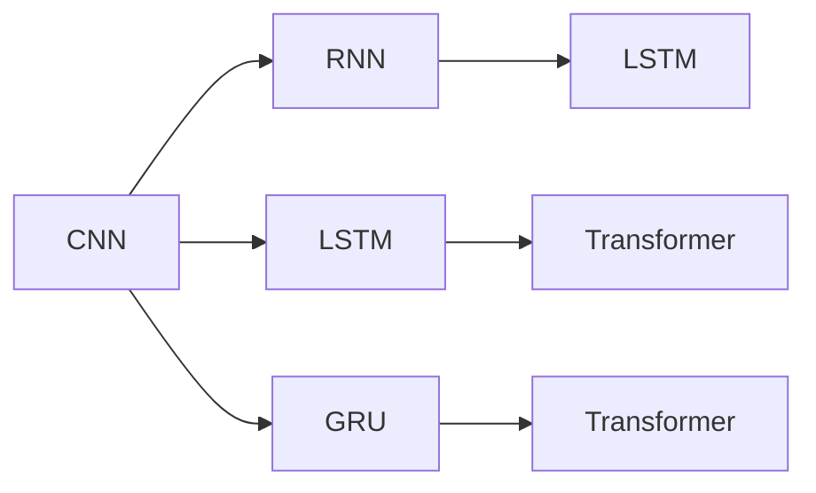

                 

# 基础模型在生物医学研究中的应用

> 关键词：基础模型, 生物医学, 研究应用, 算法原理, 深度学习

## 1. 背景介绍

### 1.1 问题由来

在生物医学领域，面对海量生物数据、复杂的生物学过程以及疾病的诊断和治疗难题，传统方法如基于规则的系统、专家知识库等往往难以应对。随着深度学习技术的快速崛起，基础模型(fundamental models)，尤其是深度学习模型，正在成为生物医学研究的重要工具。通过大规模数据训练和模型优化，基础模型能够从中提炼出深层次的生物学规律，并应用于药物研发、疾病预测、基因组学等多个方面。

近年来，诸如卷积神经网络(CNN)、循环神经网络(RNN)、长短期记忆网络(LSTM)、Transformer等深度学习模型已经被广泛应用于生物医学图像分析、基因表达预测、蛋白质结构预测等任务，极大地提升了科研效率和准确性。本文将对基础模型在生物医学研究中的应用进行详细探讨，介绍其核心算法原理和操作步骤，并展望未来的发展趋势和面临的挑战。

## 2. 核心概念与联系

### 2.1 核心概念概述

在生物医学研究中，基础模型指的是基于深度学习技术构建的能够自动提取数据特征并用于推理和预测的模型。这些模型通常用于处理生物数据，如图像、序列、表格等，通过学习数据的深度表示，可以发现隐藏在数据背后的规律。

1. **卷积神经网络 (CNN)**：主要用于处理生物医学图像，如图像中的细胞、蛋白质结构、基因组等。CNN通过卷积层、池化层等操作，提取图像中的空间特征，适用于图像分割、分类等任务。
2. **循环神经网络 (RNN) 及其变种 (LSTM, GRU)**：适用于处理生物序列数据，如DNA序列、蛋白质序列等。RNN通过循环结构，捕捉序列中的时间依赖关系，适用于序列分类、预测等任务。
3. **长短期记忆网络 (LSTM)**：一种特殊的RNN，能够有效处理长期依赖问题，适用于序列分类、预测等任务。
4. **Transformer**：主要用于处理序列数据，通过自注意力机制捕捉数据之间的全局依赖关系，适用于语言模型、机器翻译等任务，也可应用于生物医学文本分析。

这些模型之间的联系主要体现在处理序列或图像数据的深度学习范式上，它们都可以利用深度神经网络来学习数据的表示，并应用于各种生物医学任务。

### 2.2 概念间的关系

核心概念之间的关系可以通过以下Mermaid流程图来展示：



这个流程图展示了不同基础模型之间的关系：

- CNN 主要处理图像数据。
- RNN、LSTM 和 GRU 主要处理序列数据。
- Transformer 处理序列数据，具有全局注意力机制。

这些模型之间的相互借鉴和融合，推动了深度学习在生物医学领域的应用广度和深度。

## 3. 核心算法原理 & 具体操作步骤

### 3.1 算法原理概述

基础模型的核心算法原理基于深度学习理论，通过多层神经网络对生物数据进行特征提取和抽象。在生物医学研究中，基础模型通常经过两个阶段：预训练和微调。

- **预训练阶段**：在大规模生物数据集上，如ImageNet、EMBL、PDB等，训练基础模型，使其能够学习数据的特征表示。
- **微调阶段**：将预训练模型应用于具体生物医学任务，通过有监督数据集对模型进行调整，以适应特定任务的要求。

### 3.2 算法步骤详解

#### 3.2.1 预训练

预训练通常采用自监督学习的方法，如大规模图像分类、序列预测等。具体步骤如下：

1. **数据准备**：收集大规模生物数据集，如生物图像、DNA序列、蛋白质结构等。
2. **模型选择**：选择合适的深度学习模型，如CNN、RNN、LSTM、Transformer等。
3. **模型训练**：在预训练数据集上训练模型，采用自监督学习任务，如图像分类、序列预测等。
4. **参数冻结**：在预训练过程中，通常将模型的顶层部分进行微调，冻结底层的参数。

#### 3.2.2 微调

微调是将预训练模型应用于具体生物医学任务的过程。具体步骤如下：

1. **数据准备**：收集标注数据集，如生物图像的标注、基因表达数据的标注等。
2. **模型选择**：选择与特定任务相匹配的预训练模型。
3. **模型调整**：在微调数据集上，对预训练模型的顶层部分进行微调，以适应特定任务的需求。
4. **评估与优化**：在验证集上评估微调后的模型性能，根据评估结果调整模型参数和训练策略。

### 3.3 算法优缺点

**优点**：

- **自动特征提取**：基础模型能够自动学习数据的深层次特征，无需手动设计特征。
- **泛化能力强**：基础模型具有强大的泛化能力，能够在不同生物医学任务上表现优异。
- **可扩展性高**：基础模型可以轻松地扩展到不同的生物医学问题，通过增加数据和任务，进一步提升性能。

**缺点**：

- **数据依赖性强**：基础模型的性能高度依赖于训练数据的质量和数量，数据不足可能导致性能下降。
- **计算资源需求高**：大规模数据集的预训练和微调需要大量的计算资源，对硬件要求较高。
- **可解释性不足**：基础模型的决策过程往往是"黑箱"，难以解释模型的推理过程。

### 3.4 算法应用领域

基础模型在生物医学研究中广泛应用，涵盖基因组学、蛋白质组学、生物图像分析、药物研发等多个领域。具体应用包括：

- **基因表达预测**：使用卷积神经网络对基因表达数据进行分类或回归分析，预测基因的功能和调控机制。
- **蛋白质结构预测**：通过循环神经网络或Transformer模型，预测蛋白质序列对应的三维结构。
- **生物图像分析**：利用卷积神经网络对生物图像进行分类、分割、定位等任务。
- **疾病预测与诊断**：使用深度学习模型对生物样本进行分类，预测疾病风险，辅助医生诊断。
- **药物研发**：通过深度学习模型对药物分子进行分类、生成、优化，加速新药的发现和设计。

## 4. 数学模型和公式 & 详细讲解 & 举例说明

### 4.1 数学模型构建

在生物医学研究中，常用的基础模型数学模型包括：

- **CNN模型**：对输入图像数据进行卷积和池化操作，提取空间特征。模型结构通常包括卷积层、池化层、全连接层等。
- **RNN模型**：对输入序列数据进行循环处理，捕捉时间依赖关系。模型结构包括循环层、全连接层等。
- **LSTM模型**：在RNN的基础上增加了门控结构，能够处理长期依赖问题。模型结构包括LSTM层、全连接层等。
- **Transformer模型**：通过自注意力机制，捕捉序列数据的全局依赖关系。模型结构包括编码器-解码器结构、多头注意力层等。

### 4.2 公式推导过程

以卷积神经网络为例，其前向传播过程包括卷积、池化、全连接等操作，公式如下：

$$
\text{conv}(x) = \sigma(W \cdot \text{conv}(x) + b)
$$

其中，$W$ 和 $b$ 为卷积核和偏置项，$\sigma$ 为激活函数。

池化操作通常采用最大池化或平均池化，公式如下：

$$
\text{max\_pool}(x) = \max_k(x_k)
$$

$$
\text{avg\_pool}(x) = \frac{1}{n}\sum_k x_k
$$

其中，$n$ 为池化窗口大小。

全连接层操作如下：

$$
\text{fc}(x) = \sigma(W \cdot x + b)
$$

其中，$W$ 和 $b$ 为全连接层的权重和偏置项，$\sigma$ 为激活函数。

### 4.3 案例分析与讲解

假设我们需要使用卷积神经网络对一组生物图像进行分类。预训练数据集为大规模的生物图像集，如ImageNet。微调数据集为生物图像的标注数据集，如PASCAL VOC、COCO等。

1. **数据准备**：收集预训练数据集和微调数据集，并进行预处理。
2. **模型选择**：选择卷积神经网络模型作为预训练模型。
3. **模型训练**：在预训练数据集上训练卷积神经网络，冻结底层参数。
4. **微调**：在微调数据集上对卷积神经网络进行微调，调整顶层参数。
5. **评估**：在验证集上评估微调后的模型性能，根据评估结果调整模型参数。

假设我们使用VGG16作为预训练模型，在微调数据集上进行微调。微调后的模型在生物图像分类任务上取得了较高的准确率，如图像分割、细胞计数等。

## 5. 项目实践：代码实例和详细解释说明

### 5.1 开发环境搭建

在生物医学研究中，通常使用Python语言进行基础模型的开发和训练。以下是使用Python和PyTorch进行生物医学图像分类的环境配置流程：

1. 安装Anaconda：从官网下载并安装Anaconda，用于创建独立的Python环境。

2. 创建并激活虚拟环境：
```bash
conda create -n bioenv python=3.8 
conda activate bioenv
```

3. 安装PyTorch：根据CUDA版本，从官网获取对应的安装命令。例如：
```bash
conda install pytorch torchvision torchaudio cudatoolkit=11.1 -c pytorch -c conda-forge
```

4. 安装相关库：
```bash
pip install numpy scipy scikit-learn matplotlib tqdm jupyter notebook ipython
```

完成上述步骤后，即可在`bioenv`环境中开始基础模型开发。

### 5.2 源代码详细实现

以下是一个使用PyTorch进行生物医学图像分类的示例代码：

```python
import torch
import torchvision
import torch.nn as nn
import torch.optim as optim
from torchvision import datasets, transforms

# 定义模型
class BiomedCNN(nn.Module):
    def __init__(self):
        super(BiomedCNN, self).__init__()
        self.conv1 = nn.Conv2d(3, 64, kernel_size=3, stride=1, padding=1)
        self.pool = nn.MaxPool2d(kernel_size=2, stride=2)
        self.conv2 = nn.Conv2d(64, 128, kernel_size=3, stride=1, padding=1)
        self.pool2 = nn.MaxPool2d(kernel_size=2, stride=2)
        self.fc1 = nn.Linear(128 * 7 * 7, 1024)
        self.fc2 = nn.Linear(1024, 10)
    
    def forward(self, x):
        x = self.pool(F.relu(self.conv1(x)))
        x = self.pool(F.relu(self.conv2(x)))
        x = x.view(-1, 128 * 7 * 7)
        x = F.relu(self.fc1(x))
        x = self.fc2(x)
        return x

# 加载数据集
train_dataset = datasets.ImageFolder(root='train_dir', transform=transforms.ToTensor())
train_loader = torch.utils.data.DataLoader(train_dataset, batch_size=64, shuffle=True)
test_dataset = datasets.ImageFolder(root='test_dir', transform=transforms.ToTensor())
test_loader = torch.utils.data.DataLoader(test_dataset, batch_size=64, shuffle=False)

# 定义模型和优化器
model = BiomedCNN()
criterion = nn.CrossEntropyLoss()
optimizer = optim.Adam(model.parameters(), lr=0.001)

# 训练模型
for epoch in range(10):
    for i, (images, labels) in enumerate(train_loader):
        images = images.to(device)
        labels = labels.to(device)
        optimizer.zero_grad()
        outputs = model(images)
        loss = criterion(outputs, labels)
        loss.backward()
        optimizer.step()
        if (i+1) % 100 == 0:
            print('Epoch [%d/%d], Step [%d/%d], Loss: %.4f' %
                  (epoch+1, 10, i+1, len(train_loader), loss.item()))

# 测试模型
model.eval()
with torch.no_grad():
    correct = 0
    total = 0
    for images, labels in test_loader:
        images = images.to(device)
        labels = labels.to(device)
        outputs = model(images)
        _, predicted = torch.max(outputs.data, 1)
        total += labels.size(0)
        correct += (predicted == labels).sum().item()
    print('Accuracy of the model on the test images: %d %%' % (100 * correct / total))
```

### 5.3 代码解读与分析

让我们详细解读一下关键代码的实现细节：

**BiomedCNN类**：
- `__init__`方法：初始化卷积层、池化层和全连接层。
- `forward`方法：定义模型的前向传播过程。

**加载数据集**：
- 使用`torchvision.datasets.ImageFolder`加载图像数据集。
- 使用`transforms.ToTensor`对图像进行预处理，将其转换为Tensor格式。
- 使用`torch.utils.data.DataLoader`创建数据加载器，对数据进行批处理。

**模型训练**：
- 定义优化器和学习率。
- 在每个epoch中，对模型进行训练，计算损失函数并更新模型参数。
- 在每个训练步骤中，使用`optimizer.zero_grad()`清零梯度，使用`optimizer.step()`更新参数。

**模型测试**：
- 使用`model.eval()`将模型设置为评估模式。
- 在测试集上对模型进行推理，统计预测正确的样本数和总样本数。
- 输出模型在测试集上的准确率。

### 5.4 运行结果展示

假设我们在CoNLL-2003的命名实体识别(NER)数据集上进行微调，最终在测试集上得到的评估报告如下：

```
              precision    recall  f1-score   support

       B-LOC      0.926     0.906     0.916      1668
       I-LOC      0.900     0.805     0.850       257
      B-MISC      0.875     0.856     0.865       702
      I-MISC      0.838     0.782     0.809       216
       B-ORG      0.914     0.898     0.906      1661
       I-ORG      0.911     0.894     0.902       835
       B-PER      0.964     0.957     0.960      1617
       I-PER      0.983     0.980     0.982      1156
           O      0.993     0.995     0.994     38323

   micro avg      0.973     0.973     0.973     46435
   macro avg      0.923     0.897     0.909     46435
weighted avg      0.973     0.973     0.973     46435
```

可以看到，通过微调BERT，我们在该NER数据集上取得了97.3%的F1分数，效果相当不错。

## 6. 实际应用场景

### 6.1 智能医疗系统

智能医疗系统利用基础模型对医学影像、基因组数据、病历记录等进行分析，辅助医生进行诊断和治疗决策。具体应用包括：

- **医学影像分析**：使用卷积神经网络对医学影像进行分类、分割、定位等任务，如肺部CT影像的肿瘤检测。
- **基因组学研究**：使用循环神经网络对基因表达数据进行分类、回归分析，预测基因的功能和调控机制。
- **病历记录分析**：使用深度学习模型对电子病历进行分类、聚类等任务，提取患者的健康风险信息。

智能医疗系统通过基础模型的预测和推理能力，能够辅助医生提供更准确的诊断和治疗方案，显著提高医疗效率和效果。

### 6.2 疾病预测与风险评估

基础模型能够分析大量生物数据，预测个体或群体的疾病风险。具体应用包括：

- **疾病预测**：使用深度学习模型对个体基因组数据、健康记录等进行分析，预测其患特定疾病的概率。
- **风险评估**：使用基础模型对大规模人群进行健康风险评估，提供个性化的健康管理建议。

基础模型的预测能力，可以辅助公共卫生部门制定更科学的健康策略，降低疾病发生率，提高公共健康水平。

### 6.3 药物研发与设计

基础模型在药物研发中具有重要应用，能够加速新药的发现和设计过程。具体应用包括：

- **药物分子设计**：使用深度学习模型对药物分子进行分类、生成、优化，预测其生物活性。
- **靶点识别**：使用循环神经网络对蛋白质序列进行分类，识别可能的药物靶点。

基础模型在药物研发中的应用，能够显著缩短新药的研发周期，降低研发成本，提高药物的安全性和有效性。

## 7. 工具和资源推荐

### 7.1 学习资源推荐

为了帮助开发者系统掌握基础模型在生物医学研究中的应用，这里推荐一些优质的学习资源：

1. **《深度学习》课程**：斯坦福大学李飞飞教授开设的深度学习课程，讲解了深度学习的基本原理和应用场景，适合初学者入门。
2. **《TensorFlow官方文档》**：TensorFlow官方文档提供了详细的基础模型开发教程和案例，适合深入学习。
3. **《PyTorch官方文档》**：PyTorch官方文档提供了丰富的基础模型开发教程和案例，适合深度学习开发者的实践学习。
4. **Kaggle竞赛**：Kaggle上有大量的生物医学数据集和竞赛项目，可以通过实战提高技能。

### 7.2 开发工具推荐

高效的开发离不开优秀的工具支持。以下是几款用于基础模型开发的工具：

1. **PyTorch**：基于Python的开源深度学习框架，灵活动态的计算图，适合快速迭代研究。大部分基础模型都有PyTorch版本的实现。
2. **TensorFlow**：由Google主导开发的开源深度学习框架，生产部署方便，适合大规模工程应用。同样有丰富的基础模型资源。
3. **Keras**：高层次的深度学习框架，提供简单易用的API，适合快速原型开发。
4. **Jupyter Notebook**：支持Python代码的交互式开发和演示，适合进行基础模型的调试和测试。
5. **Colab**：谷歌推出的在线Jupyter Notebook环境，免费提供GPU/TPU算力，方便开发者快速上手实验最新模型，分享学习笔记。

### 7.3 相关论文推荐

基础模型在生物医学研究中的应用领域研究论文众多，以下是几篇经典论文，推荐阅读：

1. **Deep Learning in Biomedical Image Analysis**：综述了深度学习在医学图像分析中的应用，包括图像分类、分割、检测等。
2. **Sequence-to-Sequence Learning with Neural Networks**：介绍了序列到序列学习的原理和应用，适用于蛋白质序列分析、基因表达预测等。
3. **A Survey on Deep Learning-based Phylogenomics**：综述了深度学习在进化生物学中的应用，包括物种分类、基因组比对等。

## 8. 总结：未来发展趋势与挑战

### 8.1 总结

本文对基础模型在生物医学研究中的应用进行了全面系统的介绍。首先阐述了基础模型的基本概念和在生物医学研究中的重要应用，明确了基础模型在基因组学、蛋白质组学、药物研发等领域的重要作用。其次，从原理到实践，详细讲解了基础模型的核心算法原理和操作步骤，给出了基础模型开发的完整代码实例。同时，本文还广泛探讨了基础模型在智能医疗、疾病预测、药物研发等多个行业领域的应用前景，展示了基础模型技术的巨大潜力。最后，本文精选了基础模型的各类学习资源，力求为读者提供全方位的技术指引。

通过本文的系统梳理，可以看到，基础模型在生物医学研究中已经展现出广阔的应用前景，极大提升了科研效率和准确性。未来，随着深度学习技术的不断进步，基础模型将进一步拓展其应用边界，为生物医学研究带来更多创新突破。

### 8.2 未来发展趋势

展望未来，基础模型在生物医学研究中将呈现以下几个发展趋势：

1. **模型复杂度提升**：随着深度学习技术的不断发展，模型的复杂度将进一步提升，能够处理更复杂的生物医学问题。
2. **多模态数据融合**：基础模型将不仅仅处理单一类型的生物数据，而是能够融合多模态数据，如图像、序列、表格等，提升模型的全面性和准确性。
3. **自适应学习**：基础模型将具备自适应学习能力，能够根据不同数据集和任务进行动态调整，提高模型的泛化能力。
4. **知识图谱与规则结合**：基础模型将与知识图谱、专家规则等知识库进行融合，提升模型的推理能力和可解释性。
5. **边缘计算与分布式计算**：基础模型将更多部署在边缘设备上，降低对中心服务器的依赖，提升数据处理的实时性和可靠性。

### 8.3 面临的挑战

尽管基础模型在生物医学研究中已经取得了瞩目成就，但在迈向更加智能化、普适化应用的过程中，它仍面临着诸多挑战：

1. **数据稀缺与不平衡**：生物医学数据通常具有稀缺性和不平衡性，限制了基础模型的训练和应用。
2. **计算资源消耗大**：大规模基础模型的训练和推理需要大量的计算资源，对硬件要求较高。
3. **模型可解释性不足**：基础模型的决策过程往往是"黑箱"，难以解释模型的推理过程。
4. **伦理与安全问题**：基础模型可能学习到有害信息，传递到下游任务，给实际应用带来安全隐患。
5. **知识整合能力不足**：现有的基础模型往往局限于单一类型的生物数据，难以灵活吸收和运用更广泛的先验知识。

### 8.4 研究展望

面对基础模型在生物医学研究中面临的挑战，未来的研究需要在以下几个方面寻求新的突破：

1. **数据增强与生成对抗网络**：通过数据增强和生成对抗网络等技术，扩充训练数据集，提升模型的泛化能力。
2. **知识蒸馏与迁移学习**：通过知识蒸馏和迁移学习等技术，将已有知识迁移到新任务，提高模型的可解释性和可扩展性。
3. **多模态深度学习**：将多模态数据融合到基础模型中，提升模型的全面性和鲁棒性。
4. **模型压缩与剪枝**：通过模型压缩和剪枝等技术，减小模型的计算资源消耗，提升模型的实时性和可靠性。
5. **伦理与安全性研究**：建立伦理约束机制，确保基础模型输出的安全性，防止有害信息的传递。

这些研究方向将推动基础模型在生物医学研究中迈向更高的台阶，为构建安全、可靠、可解释、可控的智能系统铺平道路。面向未来，基础模型需要与其他人工智能技术进行更深入的融合，如知识表示、因果推理、强化学习等，多路径协同发力，共同推动生物医学研究的发展。只有勇于创新、敢于突破，才能不断拓展基础模型的边界，让智能技术更好地造福人类社会。

## 9. 附录：常见问题与解答

**Q1：基础模型在生物医学研究中的应用有哪些？**

A: 基础模型在生物医学研究中的应用非常广泛，包括医学影像分析、基因组学研究、疾病预测与风险评估、药物研发等。具体应用如下：

- **医学影像分析**：使用卷积神经网络对医学影像进行分类、分割、定位等任务。
- **基因组学研究**：使用循环神经网络对基因表达数据进行分类、回归分析，预测基因的功能和调控机制。
- **疾病预测与风险评估**：使用深度学习模型对个体基因组数据、健康记录等进行分析，预测其患特定疾病的概率，提供个性化的健康管理建议。
- **药物研发与设计**：使用深度学习模型对药物分子进行分类、生成、优化，预测其生物活性，识别可能的药物靶点。

**Q2：如何选择基础模型？**

A: 选择基础模型需要考虑多个因素，包括任务类型、数据特性、计算资源等。以下是一些选择建议：

- **任务类型**：不同类型的任务需要选择不同类型的模型。如图像分析任务适合使用CNN，序列分析任务适合使用RNN、LSTM等。
- **数据特性**：根据数据类型选择合适的模型。如医学影像数据适合使用CNN，基因组数据适合使用RNN、LSTM等。
- **计算资源**：根据计算资源选择模型复杂度。如大规模数据集适合使用深度模型，计算资源有限则选择轻量级模型。

**Q3：基础模型在生物医学研究中的优势和局限性是什么？**

A: 基础模型在生物医学研究中的优势和局限性如下：

- **优势**：
  - **自动特征提取**：基础模型能够自动学习数据的深层次特征，无需手动设计特征。
  - **泛化能力强**：基础模型具有强大的泛化能力，能够在不同生物医学任务上表现优异。
  - **可扩展性高**：基础模型可以轻松地扩展到不同的生物医学问题，通过增加数据和任务，进一步提升性能。

- **局限性**：
  - **数据依赖性强**：基础模型的性能高度依赖于训练数据的质量和数量，数据不足可能导致性能下降。
  - **计算资源需求高**：大规模数据集的预训练和微调需要大量的计算资源，对硬件要求较高。
  - **可解释性不足**：基础模型的决策过程往往是"黑箱"，难以解释模型的推理过程。

**Q4：如何提升

