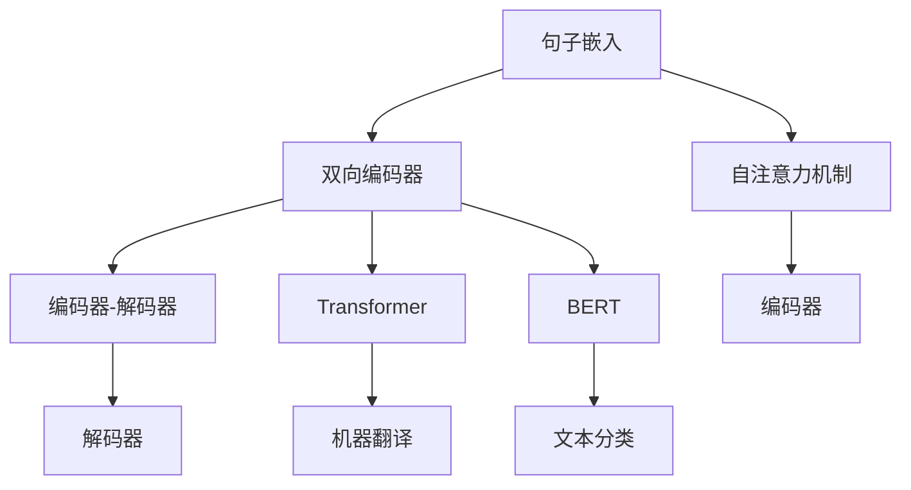
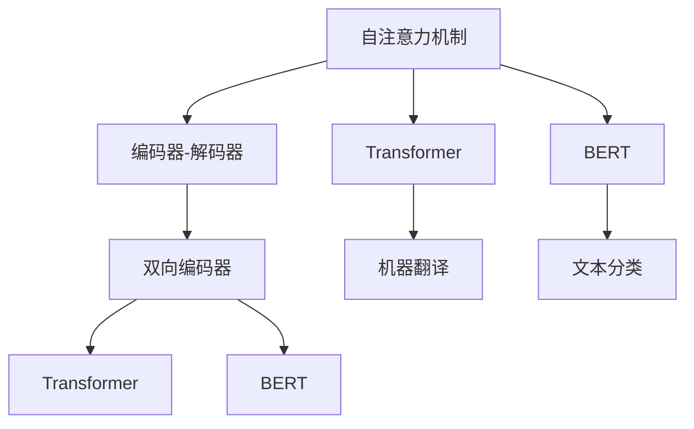

                 

# 基础模型的双向句子编码器

> 关键词：双向编码器,句子嵌入,自注意力机制,编码器-解码器,Transformer,BERT

## 1. 背景介绍

随着深度学习技术的发展，自然语言处理(Natural Language Processing, NLP)领域涌现出了大量的预训练语言模型，如BERT、GPT、XLNet等。这些模型通过在大规模无标签文本上自监督学习，学习到了丰富的语言表示，具有很强的泛化能力和通用性。然而，这些模型在处理特定任务时，往往需要进一步微调，才能达到理想的效果。而双向编码器(Encoders)作为其中的一种重要模型，因其能够捕捉上下文信息的特性，受到了广泛关注。本文将详细介绍基础模型的双向句子编码器，探讨其算法原理和实际应用。

## 2. 核心概念与联系

### 2.1 核心概念概述

为了更好地理解双向编码器，首先需要了解以下几个关键概念：

- **双向编码器**：指能够在处理序列数据时，同时考虑序列前后信息的编码器。在语言处理中，双向编码器通常用于捕捉句子的上下文信息。

- **句子嵌入**：指将一个句子转化为固定长度的向量表示，以方便进行向量计算。句子嵌入是许多NLP任务的基础，如文本分类、机器翻译、情感分析等。

- **自注意力机制**：指在计算一个节点的表示时，考虑与其他节点之间的关联。自注意力机制常用于捕捉节点之间的语义关系，增强模型的表达能力。

- **编码器-解码器模型**：指由一个编码器和一个解码器组成的模型。编码器用于将输入序列编码为向量表示，解码器用于将向量表示解码为输出序列。Transformer模型是一种典型的编码器-解码器模型，广泛用于机器翻译、文本生成等任务。

- **BERT模型**：由Google提出的预训练语言模型，通过在大量无标签文本上进行自监督学习，学习到了通用的语言表示。BERT模型的编码器使用了多层Transformer结构，能够在处理句子时同时考虑上下文信息。

这些核心概念之间的逻辑关系可以通过以下Mermaid流程图来展示：



这个流程图展示了句子嵌入、双向编码器、自注意力机制、编码器-解码器模型以及BERT模型的关系：

1. 句子嵌入将一个句子转化为固定长度的向量。
2. 双向编码器通过自注意力机制，同时考虑上下文信息，捕捉句子中的语义关系。
3. 编码器-解码器模型将双向编码器的输出作为输入，解码为最终的输出序列。
4. 使用Transformer结构的编码器，如BERT模型，能够更加高效地处理序列数据。

### 2.2 概念间的关系

这些核心概念之间的关系可以通过以下Mermaid流程图来展示：



这个流程图展示了自注意力机制、编码器-解码器模型、双向编码器、Transformer结构和BERT模型的关系：

1. 自注意力机制是编码器-解码器模型和双向编码器的核心技术。
2. 使用Transformer结构的编码器，能够更好地处理序列数据，如BERT模型。
3. 双向编码器能够在处理句子时同时考虑上下文信息，提升模型的表达能力。
4. 自注意力机制和编码器-解码器模型结合，可以用于机器翻译、文本分类等任务。

## 3. 核心算法原理 & 具体操作步骤
### 3.1 算法原理概述

双向编码器的核心思想是，在处理序列数据时，同时考虑序列的前后信息。这种双向性可以通过自注意力机制来实现。自注意力机制通过计算当前节点与所有其他节点之间的注意力权重，来捕捉节点之间的语义关系。在语言处理中，自注意力机制通常用于捕捉句子中的上下文信息，提升模型的表达能力。

具体的双向编码器算法流程如下：

1. 将输入的句子转化为固定长度的向量表示。
2. 使用自注意力机制，计算当前节点与其他节点之间的注意力权重。
3. 对注意力权重进行归一化，得到当前节点的表示。
4. 重复上述过程，直至计算出整个序列的表示。

这种自上而下的计算方式，能够同时考虑序列的前后信息，使得模型能够更好地捕捉语义关系，提升模型的表达能力。

### 3.2 算法步骤详解

以下以BERT模型为例，详细介绍双向编码器的算法步骤。

#### 3.2.1 预训练阶段

BERT模型的预训练过程包括掩码语言模型和下一句预测两个任务。掩码语言模型通过在序列中随机掩码一部分节点，预测被掩码的节点。下一句预测通过随机抽取两个相邻的句子，预测它们是否为下一句。

具体的预训练步骤如下：

1. 将句子转化为固定长度的向量表示，使用Embedding层将词汇映射为向量。
2. 通过掩码语言模型，对每个节点进行预测，得到预测向量。
3. 通过下一句预测，对相邻的两个句子进行预测，得到预测向量。
4. 计算预测向量与真实标签之间的交叉熵损失，并反向传播更新模型参数。

#### 3.2.2 微调阶段

在预训练完成后，BERT模型可以被用于各种NLP任务，如文本分类、机器翻译等。微调阶段的目标是，通过下游任务的标注数据，进一步优化BERT模型的参数，使其更好地适应特定任务。

具体的微调步骤如下：

1. 将输入的句子转化为固定长度的向量表示，使用Embedding层将词汇映射为向量。
2. 通过自注意力机制，计算当前节点与其他节点之间的注意力权重。
3. 对注意力权重进行归一化，得到当前节点的表示。
4. 将表示向量送入输出层，进行预测。
5. 计算预测向量与真实标签之间的损失函数，并反向传播更新模型参数。

### 3.3 算法优缺点

双向编码器作为一种重要的NLP模型，具有以下优点：

- **捕捉上下文信息**：双向编码器能够在处理序列数据时，同时考虑序列的前后信息，捕捉句子中的上下文信息，提升模型的表达能力。
- **通用性强**：双向编码器适用于多种NLP任务，如文本分类、机器翻译、情感分析等，能够快速适配特定任务。
- **易于训练**：双向编码器的训练过程相对简单，可以使用预训练模型进行微调，从而加快训练速度。

然而，双向编码器也存在一些缺点：

- **计算复杂度高**：双向编码器的计算复杂度较高，需要大量的计算资源。
- **参数量较大**：双向编码器通常需要较多的参数，使得模型较大的存储空间。
- **泛化能力有限**：在某些任务上，双向编码器的泛化能力可能有限，需要进行特定的微调才能达到理想的效果。

### 3.4 算法应用领域

双向编码器在许多NLP任务中都有广泛的应用，以下是几个典型的应用场景：

- **文本分类**：通过双向编码器对文本进行编码，然后使用分类器进行预测，实现文本分类的任务。
- **机器翻译**：使用双向编码器将输入的源语言句子编码为向量表示，然后使用解码器将向量解码为目标语言句子。
- **问答系统**：通过双向编码器对问题进行编码，然后使用解码器生成答案。
- **命名实体识别**：使用双向编码器对文本进行编码，然后使用标注器识别出其中的命名实体。
- **文本摘要**：使用双向编码器对文本进行编码，然后使用摘要器生成摘要。

除了上述这些经典任务外，双向编码器还被创新性地应用到更多场景中，如语义搜索、知识图谱构建等，为NLP技术带来了全新的突破。

## 4. 数学模型和公式 & 详细讲解 & 举例说明

### 4.1 数学模型构建

以下以BERT模型为例，介绍其数学模型的构建。

假设输入的句子长度为$n$，使用Embedding层将句子中的每个词汇映射为一个$d$维的向量，得到初始表示矩阵$\mathbf{X} \in \mathbb{R}^{n \times d}$。

设自注意力机制的参数矩阵为$\mathbf{W}^Q, \mathbf{W}^K, \mathbf{W}^V \in \mathbb{R}^{d \times d}$，则每个节点的查询向量、键向量和值向量可以表示为：

$$
\mathbf{Q} = \mathbf{X} \mathbf{W}^Q
$$
$$
\mathbf{K} = \mathbf{X} \mathbf{W}^K
$$
$$
\mathbf{V} = \mathbf{X} \mathbf{W}^V
$$

计算每个节点的注意力权重：

$$
\mathbf{A} = \text{softmax}\left(\frac{\mathbf{Q} \mathbf{K}^T}{\sqrt{d}}\right)
$$

对注意力权重进行归一化，得到当前节点的表示：

$$
\mathbf{H} = \mathbf{A} \mathbf{V}
$$

将表示向量送入输出层，进行预测：

$$
\mathbf{Y} = \text{softmax}\left(\mathbf{H} \mathbf{W}^O\right)
$$

其中$\mathbf{W}^O \in \mathbb{R}^{d \times m}$为输出层的参数矩阵，$m$为输出的类别数。

### 4.2 公式推导过程

以下是BERT模型中自注意力机制的详细公式推导过程。

#### 4.2.1 查询向量、键向量和值向量的计算

假设输入的句子长度为$n$，使用Embedding层将句子中的每个词汇映射为一个$d$维的向量，得到初始表示矩阵$\mathbf{X} \in \mathbb{R}^{n \times d}$。

设自注意力机制的参数矩阵为$\mathbf{W}^Q, \mathbf{W}^K, \mathbf{W}^V \in \mathbb{R}^{d \times d}$，则每个节点的查询向量、键向量和值向量可以表示为：

$$
\mathbf{Q} = \mathbf{X} \mathbf{W}^Q
$$
$$
\mathbf{K} = \mathbf{X} \mathbf{W}^K
$$
$$
\mathbf{V} = \mathbf{X} \mathbf{W}^V
$$

#### 4.2.2 注意力权重的计算

计算每个节点的注意力权重，可以通过如下公式计算：

$$
\mathbf{A} = \text{softmax}\left(\frac{\mathbf{Q} \mathbf{K}^T}{\sqrt{d}}\right)
$$

其中，$\mathbf{Q} \in \mathbb{R}^{n \times d}$，$\mathbf{K} \in \mathbb{R}^{n \times d}$，$\sqrt{d}$为归一化因子，$d$为节点的维度。

#### 4.2.3 节点表示的计算

对注意力权重进行归一化，得到当前节点的表示：

$$
\mathbf{H} = \mathbf{A} \mathbf{V}
$$

其中，$\mathbf{A} \in \mathbb{R}^{n \times n}$，$\mathbf{V} \in \mathbb{R}^{n \times d}$。

#### 4.2.4 输出向量的计算

将表示向量送入输出层，进行预测：

$$
\mathbf{Y} = \text{softmax}\left(\mathbf{H} \mathbf{W}^O\right)
$$

其中，$\mathbf{W}^O \in \mathbb{R}^{d \times m}$为输出层的参数矩阵，$m$为输出的类别数。

### 4.3 案例分析与讲解

以下以BERT模型为例，分析其在文本分类任务中的应用。

假设有一个文本分类任务，需要将给定的文本分为两类：正面和负面。使用BERT模型进行微调的步骤如下：

1. 准备训练集和测试集，并对每个文本进行编码。
2. 对编码后的文本向量进行分类预测，得到预测结果。
3. 计算预测结果与真实标签之间的交叉熵损失，并反向传播更新模型参数。
4. 在测试集上评估模型的性能，如准确率、召回率等指标。

在实现过程中，可以使用PyTorch框架，以下是一个简单的代码示例：

```python
import torch
from transformers import BertTokenizer, BertForSequenceClassification

# 加载预训练模型和分词器
tokenizer = BertTokenizer.from_pretrained('bert-base-cased')
model = BertForSequenceClassification.from_pretrained('bert-base-cased', num_labels=2)

# 定义训练函数
def train_model(model, device, train_dataset, epochs, batch_size):
    model.to(device)
    optimizer = torch.optim.AdamW(model.parameters(), lr=2e-5)
    train_loss = 0
    for epoch in range(epochs):
        model.train()
        for batch in train_dataset:
            input_ids = batch['input_ids'].to(device)
            attention_mask = batch['attention_mask'].to(device)
            labels = batch['labels'].to(device)
            optimizer.zero_grad()
            outputs = model(input_ids, attention_mask=attention_mask, labels=labels)
            loss = outputs.loss
            loss.backward()
            optimizer.step()
            train_loss += loss.item()
    print(f'Epoch {epoch+1}, train loss: {train_loss / len(train_dataset)}')

# 定义测试函数
def evaluate_model(model, device, test_dataset):
    model.eval()
    test_loss = 0
    predictions = []
    true_labels = []
    for batch in test_dataset:
        input_ids = batch['input_ids'].to(device)
        attention_mask = batch['attention_mask'].to(device)
        labels = batch['labels'].to(device)
        with torch.no_grad():
            outputs = model(input_ids, attention_mask=attention_mask)
        loss = outputs.loss
        predictions.append(outputs.logits.argmax(dim=1).to('cpu').tolist())
        true_labels.append(labels.to('cpu').tolist())
        test_loss += loss.item()
    print(f'Test loss: {test_loss / len(test_dataset)}')
    print(classification_report(true_labels, predictions))

# 加载训练集和测试集
train_dataset = ...
test_dataset = ...

# 训练模型
train_model(model, device='cuda', train_dataset=train_dataset, epochs=3, batch_size=16)

# 评估模型
evaluate_model(model, device='cuda', test_dataset=test_dataset)
```

在上述代码中，使用BERT模型对文本进行编码，并使用分类器进行预测。通过训练函数进行模型的训练，并在测试集上评估模型的性能。

## 5. 项目实践：代码实例和详细解释说明

### 5.1 开发环境搭建

在进行双向编码器项目实践前，我们需要准备好开发环境。以下是使用Python进行PyTorch开发的环境配置流程：

1. 安装Anaconda：从官网下载并安装Anaconda，用于创建独立的Python环境。

2. 创建并激活虚拟环境：
```bash
conda create -n pytorch-env python=3.8 
conda activate pytorch-env
```

3. 安装PyTorch：根据CUDA版本，从官网获取对应的安装命令。例如：
```bash
conda install pytorch torchvision torchaudio cudatoolkit=11.1 -c pytorch -c conda-forge
```

4. 安装Transformers库：
```bash
pip install transformers
```

5. 安装各类工具包：
```bash
pip install numpy pandas scikit-learn matplotlib tqdm jupyter notebook ipython
```

完成上述步骤后，即可在`pytorch-env`环境中开始项目实践。

### 5.2 源代码详细实现

以下是一个简单的双向编码器实现示例，用于文本分类任务。

```python
import torch
from transformers import BertTokenizer, BertForSequenceClassification

# 加载预训练模型和分词器
tokenizer = BertTokenizer.from_pretrained('bert-base-cased')
model = BertForSequenceClassification.from_pretrained('bert-base-cased', num_labels=2)

# 定义训练函数
def train_model(model, device, train_dataset, epochs, batch_size):
    model.to(device)
    optimizer = torch.optim.AdamW(model.parameters(), lr=2e-5)
    train_loss = 0
    for epoch in range(epochs):
        model.train()
        for batch in train_dataset:
            input_ids = batch['input_ids'].to(device)
            attention_mask = batch['attention_mask'].to(device)
            labels = batch['labels'].to(device)
            optimizer.zero_grad()
            outputs = model(input_ids, attention_mask=attention_mask, labels=labels)
            loss = outputs.loss
            loss.backward()
            optimizer.step()
            train_loss += loss.item()
    print(f'Epoch {epoch+1}, train loss: {train_loss / len(train_dataset)}')

# 定义测试函数
def evaluate_model(model, device, test_dataset):
    model.eval()
    test_loss = 0
    predictions = []
    true_labels = []
    for batch in test_dataset:
        input_ids = batch['input_ids'].to(device)
        attention_mask = batch['attention_mask'].to(device)
        labels = batch['labels'].to(device)
        with torch.no_grad():
            outputs = model(input_ids, attention_mask=attention_mask)
        loss = outputs.loss
        predictions.append(outputs.logits.argmax(dim=1).to('cpu').tolist())
        true_labels.append(labels.to('cpu').tolist())
        test_loss += loss.item()
    print(f'Test loss: {test_loss / len(test_dataset)}')
    print(classification_report(true_labels, predictions))

# 加载训练集和测试集
train_dataset = ...
test_dataset = ...

# 训练模型
train_model(model, device='cuda', train_dataset=train_dataset, epochs=3, batch_size=16)

# 评估模型
evaluate_model(model, device='cuda', test_dataset=test_dataset)
```

在这个代码示例中，使用BERT模型对文本进行编码，并使用分类器进行预测。通过训练函数进行模型的训练，并在测试集上评估模型的性能。

### 5.3 代码解读与分析

让我们再详细解读一下关键代码的实现细节：

**训练函数`train_model`**：
- 将模型和优化器移动到GPU上。
- 使用AdamW优化器进行参数更新，设置学习率为2e-5。
- 对每个批次的数据进行前向传播，计算损失，并反向传播更新模型参数。
- 累加每个批次的损失，并计算平均损失，输出训练损失。

**测试函数`evaluate_model`**：
- 将模型设置为评估模式。
- 对每个批次的数据进行前向传播，计算损失，并保存预测结果和真实标签。
- 计算平均损失，并使用classification_report打印分类指标。

**训练集和测试集的加载**：
- 定义训练集和测试集，每个样本包括输入ID、注意力掩码和标签。
- 将样本数据加载到GPU上，并使用模型进行预测。

这个代码示例展示了如何使用PyTorch和Transformer库实现双向编码器模型，并应用于文本分类任务。

## 6. 实际应用场景

### 6.1 智能客服系统

基于双向编码器的对话技术，可以广泛应用于智能客服系统的构建。传统客服往往需要配备大量人力，高峰期响应缓慢，且一致性和专业性难以保证。而使用双向编码器模型，可以7x24小时不间断服务，快速响应客户咨询，用自然流畅的语言解答各类常见问题。

在技术实现上，可以收集企业内部的历史客服对话记录，将问题和最佳答复构建成监督数据，在此基础上对预训练模型进行微调。微调后的双向编码器模型能够自动理解用户意图，匹配最合适的答案模板进行回复。对于客户提出的新问题，还可以接入检索系统实时搜索相关内容，动态组织生成回答。如此构建的智能客服系统，能大幅提升客户咨询体验和问题解决效率。

### 6.2 金融舆情监测

金融机构需要实时监测市场舆论动向，以便及时应对负面信息传播，规避金融风险。传统的人工监测方式成本高、效率低，难以应对网络时代海量信息爆发的挑战。基于双向编码器的文本分类和情感分析技术，为金融舆情监测提供了新的解决方案。

具体而言，可以收集金融领域相关的新闻、报道、评论等文本数据，并对其进行主题标注和情感标注。在此基础上对预训练双向编码器模型进行微调，使其能够自动判断文本属于何种主题，情感倾向是正面、中性还是负面。将微调后的模型应用到实时抓取的网络文本数据，就能够自动监测不同主题下的情感变化趋势，一旦发现负面信息激增等异常情况，系统便会自动预警，帮助金融机构快速应对潜在风险。

### 6.3 个性化推荐系统

当前的推荐系统往往只依赖用户的历史行为数据进行物品推荐，无法深入理解用户的真实兴趣偏好。基于双向编码器的个性化推荐系统可以更好地挖掘用户行为背后的语义信息，从而提供更精准、多样的推荐内容。

在实践中，可以收集用户浏览、点击、评论、分享等行为数据，提取和用户交互的物品标题、描述、标签等文本内容。将文本内容作为模型输入，用户的后续行为（如是否点击、购买等）作为监督信号，在此基础上微调预训练双向编码器模型。微调后的模型能够从文本内容中准确把握用户的兴趣点。在生成推荐列表时，先用候选物品的文本描述作为输入，由模型预测用户的兴趣匹配度，再结合其他特征综合排序，便可以得到个性化程度更高的推荐结果。

### 6.4 未来应用展望

随着双向编码器技术的不断发展，其在更多领域的应用前景值得期待：

在智慧医疗领域，基于双向编码器的医疗问答、病历分析、药物研发等应用将提升医疗服务的智能化水平，辅助医生诊疗，加速新药开发进程。

在智能教育领域，双向编码器可用于作业批改、学情分析、知识推荐等方面，因材施教，促进教育公平，提高教学质量。

在智慧城市治理中，双向编码器可用于城市事件监测、舆情分析、应急指挥等环节，提高城市管理的自动化和智能化水平，构建更安全、高效的未来城市。

此外，在企业生产、社会治理、文娱传媒等众多领域，基于双向编码器的智能应用也将不断涌现，为经济社会发展注入新的动力。相信随着技术的日益成熟，双向编码器必将在构建人机协同的智能时代中扮演越来越重要的角色。

## 7. 工具和资源推荐

### 7.1 学习资源推荐

为了帮助开发者系统掌握双向编码器的理论基础和实践技巧，这里推荐一些优质的学习资源：

1. 《Transformer从原理到实践》系列博文：由大模型技术专家撰写，深入浅出地介绍了Transformer原理、双向编码器、微调技术等前沿话题。

2. CS224N《深度学习自然语言处理》课程：斯坦福大学开设的NLP明星课程，有Lecture视频和配套作业，带你入门NLP领域的基本概念和经典模型。

3. 《Natural Language Processing with Transformers》书籍：Transformers库的作者所著，全面介绍了如何使用Transformers库进行NLP任务开发，包括双向编码器的应用。

4. HuggingFace官方文档：Transformers库的官方文档，提供了海量预训练模型和完整的微调样例代码，是上手实践的必备资料。

5. CLUE开源项目：中文语言理解测评基准，涵盖大量不同类型的中文NLP数据集，并提供了基于双向编码器的baseline模型，助力中文NLP技术发展。

通过对这些资源的学习实践，相信你一定能够快速掌握双向编码器的精髓，并用于解决实际的NLP问题。
### 7.2 开发工具推荐

高效的开发离不开优秀的工具支持。以下是几款用于双向编码器开发常用的工具：

1. PyTorch：基于Python的开源深度学习框架，灵活动态的计算图，适合快速迭代研究。大部分预训练语言模型都有PyTorch版本的实现。

2. TensorFlow：由Google主导开发的开源深度学习框架，生产部署方便，适合大规模工程应用。同样有丰富的预训练语言模型资源。

3. Transformers库：HuggingFace开发的NLP工具库，集成了众多SOTA语言模型，支持PyTorch和TensorFlow，是进行双向编码器开发的利器。

4. Weights & Biases：模型训练的实验跟踪工具，可以记录和可视化模型训练过程中的各项指标，方便对比和调优。与主流深度学习框架无缝集成。

5. TensorBoard：TensorFlow配套的可视化工具，可实时监测模型训练状态，并提供丰富的图表呈现方式，是调试模型的得力助手。

6. Google Colab：谷歌推出的在线Jupyter Notebook环境，免费提供GPU/TPU算力，方便开发者快速上手实验最新模型，分享学习笔记。

合理利用这些工具，可以显著提升双向编码器微调的开发效率，加快创新迭代的步伐。

### 7.3 相关论文推荐

双向编码器作为NLP领域的重要模型，其研究受到了广泛的关注。以下是几篇奠基性的相关论文，推荐阅读：

1. Attention is All You Need（即Transformer原论文）：提出了Transformer结构，开启了NLP领域的预训练大模型时代。

2. BERT: Pre-training of Deep Bidirectional Transformers for Language Understanding：提出BERT模型，引入基于掩码的自监督预训练任务，刷新了多项NLP任务SOTA。

3. Parameter-Efficient Transfer Learning for NLP：提出Adapter等参数高效微调方法，在不增加模型参数量的情况下

