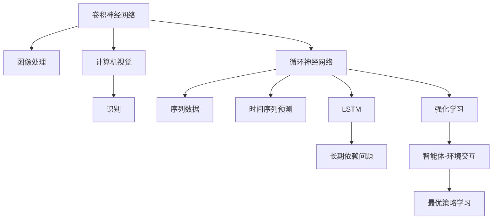
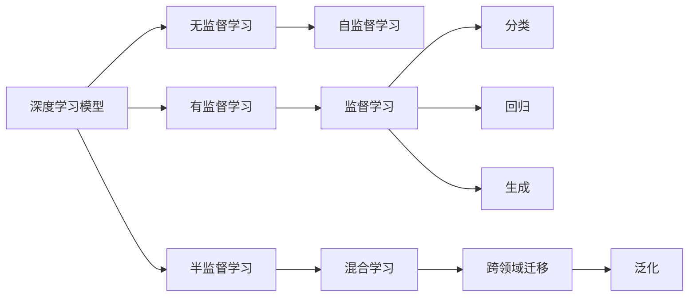
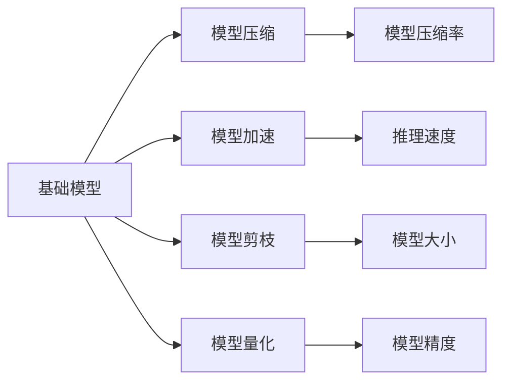
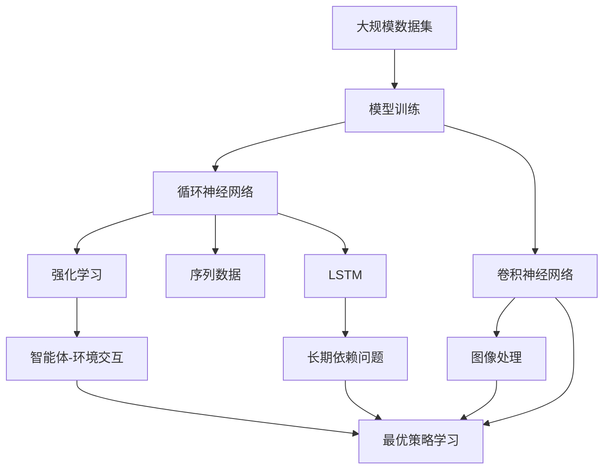

                 

# 基础模型的技术架构与实现

> 关键词：
- 深度学习
- 卷积神经网络(CNN)
- 循环神经网络(RNN)
- 长短时记忆网络(LSTM)
- 强化学习
- 计算机视觉
- 自然语言处理(NLP)
- 模型压缩与加速

## 1. 背景介绍

### 1.1 问题由来

近年来，深度学习技术的飞速发展极大地推动了人工智能(AI)领域的发展，尤其是深度神经网络在大规模数据集上的训练应用，使得AI模型在计算机视觉、自然语言处理、语音识别等多个领域取得了显著的成果。然而，随着模型参数量的增加，如何高效地实现基础模型成为迫切需要解决的问题。

基础模型作为深度学习中的重要组成部分，其高效实现不仅关系到模型训练的速度，还直接影响AI应用系统的响应速度和资源消耗。同时，基础模型的高效实现也是大规模数据集上训练大模型、加速AI模型推理的关键。

### 1.2 问题核心关键点

本文将详细介绍基础模型在技术架构与实现上的核心概念、关键算法和操作步骤，包括卷积神经网络(CNN)、循环神经网络(RNN)、长短时记忆网络(LSTM)、强化学习等基础模型的原理、步骤、优缺点及应用领域，同时通过数学模型和公式的详细讲解，结合具体实例来展示这些基础模型的应用效果。

### 1.3 问题研究意义

研究基础模型的技术架构与实现，对于加速人工智能应用系统的开发，优化模型性能，提高模型训练和推理效率，具有重要意义：

1. **优化资源消耗**：通过基础模型的技术架构优化，可以有效降低模型训练和推理的资源消耗，提高系统的响应速度。
2. **提升模型性能**：基础模型的高效实现能够显著提升模型的准确率和鲁棒性，从而提高AI应用系统的性能。
3. **加速模型训练**：通过算法优化和模型压缩，可以在更短时间内完成模型训练，缩短项目开发周期。
4. **增强模型可解释性**：基础模型的高效实现能够更好地支持模型的可视化与可解释性，帮助开发者更好地理解和调试模型。
5. **促进AI产业化**：基础模型的技术架构优化能够有效降低AI技术的成本门槛，推动AI技术在各行业中的广泛应用。

## 2. 核心概念与联系

### 2.1 核心概念概述

为了更好地理解基础模型的技术架构与实现，本节将介绍几个关键的核心概念：

- **卷积神经网络(CNN)**：一种广泛用于图像处理和计算机视觉任务的深度学习模型，通过卷积层、池化层和全连接层等组件实现特征提取和分类。
- **循环神经网络(RNN)**：一种处理序列数据的深度学习模型，通过循环连接机制实现对序列数据的长期依赖建模。
- **长短时记忆网络(LSTM)**：一种改进的RNN模型，通过引入门控机制来解决长期依赖问题，适用于需要处理长序列数据的任务。
- **强化学习**：一种通过智能体与环境交互学习最优策略的机器学习方法，广泛用于游戏、机器人控制等领域。

这些核心概念之间的逻辑关系可以通过以下Mermaid流程图来展示：



这个流程图展示了几类基础模型与其典型应用场景之间的联系：

1. CNN主要应用于图像处理和计算机视觉任务，如图像分类、目标检测等。
2. RNN和LSTM适用于序列数据的处理，如自然语言处理中的文本生成、语言建模等。
3. 强化学习主要用于需要智能体与环境交互的任务，如游戏、机器人控制等。

### 2.2 概念间的关系

这些核心概念之间存在着紧密的联系，形成了深度学习模型的完整生态系统。下面通过几个Mermaid流程图来展示这些概念之间的关系：

#### 2.2.1 深度学习模型的学习范式



这个流程图展示了深度学习模型的三种主要学习范式及其相互关系：

1. 无监督学习：通过无标注数据训练模型，如自编码器。
2. 有监督学习：使用标注数据训练模型，如分类、回归、生成等任务。
3. 半监督学习：结合少量标注数据和大量无标注数据训练模型，如混合学习。
4. 自监督学习：使用自生成的伪标签训练模型，如预训练语言模型。
5. 监督学习：传统的基于标注数据的有监督学习。
6. 半监督学习：结合少量标注数据和大量无标注数据训练模型，如混合学习。
7. 分类：对数据进行分类，如图像分类、文本分类等。
8. 回归：预测连续数值，如房价预测、股票价格预测等。
9. 生成：生成新的数据样本，如文本生成、图像生成等。
10. 跨领域迁移：将模型从一个领域迁移到另一个领域，如预训练语言模型在NLP任务上的微调。
11. 泛化：模型在新的数据集上的表现，即泛化性能。

#### 2.2.2 基础模型的高效实现



这个流程图展示了基础模型高效实现的主要手段及其效果：

1. 模型压缩：通过剪枝、量化等技术减小模型大小，提高推理速度。
2. 模型加速：通过优化计算图、使用硬件加速等方法提高模型推理速度。
3. 模型剪枝：通过去除冗余参数，减小模型大小，提高推理速度。
4. 模型量化：将浮点模型转为定点模型，减小内存占用，提高推理速度。
5. 模型压缩率：压缩后的模型相对于原始模型的尺寸比例。
6. 推理速度：模型推理的响应时间。
7. 模型大小：模型参数和占用的存储空间。
8. 模型精度：模型在特定任务上的表现，如分类精度、回归误差等。

### 2.3 核心概念的整体架构

最后，我们用一个综合的流程图来展示这些核心概念在大模型中的整体架构：



这个综合流程图展示了从数据到模型训练、再到不同基础模型应用的全过程。通过这些基础模型的应用，能够处理各种类型的输入数据，解决不同类型的AI任务。

## 3. 核心算法原理 & 具体操作步骤
### 3.1 算法原理概述

基础模型的高效实现涉及多种算法和步骤，本节将详细讲解这些核心算法和操作步骤。

### 3.2 算法步骤详解

基础模型的实现一般包括以下几个关键步骤：

**Step 1: 数据预处理**

- 数据清洗：去除噪声、填补缺失值等。
- 数据增强：通过对原始数据进行旋转、平移、缩放等变换，增加数据多样性。
- 数据标准化：将数据缩放到统一的范围，如归一化、标准化等。

**Step 2: 模型构建**

- 选择合适的网络结构：如CNN、RNN、LSTM等。
- 定义损失函数：如交叉熵、均方误差等。
- 设置优化器：如Adam、SGD等。
- 配置超参数：如学习率、批量大小等。

**Step 3: 模型训练**

- 数据加载：使用DataLoader对数据集进行批次化加载。
- 前向传播：将输入数据输入模型，计算损失值。
- 反向传播：计算损失函数对模型参数的梯度。
- 参数更新：根据梯度更新模型参数。
- 监控指标：记录训练过程中的各项指标，如损失值、准确率等。

**Step 4: 模型评估**

- 数据加载：加载评估集数据。
- 前向传播：将评估集数据输入模型，计算预测结果。
- 计算指标：根据预测结果和真实标签计算评估指标，如精度、召回率等。

**Step 5: 模型部署**

- 模型保存：将训练好的模型保存为二进制文件。
- 模型加载：在实际应用中加载模型文件。
- 推理计算：使用加载的模型对新数据进行推理计算。
- 应用集成：将模型集成到应用系统中，实现模型服务。

以上是基础模型实现的一般流程。在实际应用中，还需要根据具体任务对模型架构和参数进行优化，以提升模型性能和推理效率。

### 3.3 算法优缺点

基础模型的高效实现能够显著提升模型性能和推理速度，但同时也存在一些缺点：

**优点**

- **性能提升**：基础模型的优化能够显著提升模型在特定任务上的性能，如分类精度、回归误差等。
- **资源优化**：通过模型压缩和加速技术，有效降低模型训练和推理的资源消耗，提高系统的响应速度。
- **鲁棒性增强**：优化后的模型通常具有更好的鲁棒性，能够更好地应对输入数据的噪声和变化。

**缺点**

- **复杂度高**：基础模型的高效实现涉及复杂的算法和参数优化，需要一定的专业知识和经验。
- **维护成本高**：优化后的模型需要定期维护和更新，以适应数据分布的变化。
- **可解释性不足**：部分优化方法可能会降低模型的可解释性，使得模型的内部决策过程难以理解。

尽管存在这些缺点，但基础模型的高效实现仍然是深度学习技术发展的重要方向之一。通过不断地优化和改进，基础模型在实际应用中将发挥更加重要的作用。

### 3.4 算法应用领域

基础模型的高效实现被广泛应用于计算机视觉、自然语言处理、游戏控制、机器人学等多个领域，具体如下：

- **计算机视觉**：如图像分类、目标检测、图像分割等。
- **自然语言处理**：如语言建模、文本生成、情感分析等。
- **游戏控制**：如游戏智能体、游戏环境交互等。
- **机器人学**：如机器人控制、路径规划等。

## 4. 数学模型和公式 & 详细讲解  
### 4.1 数学模型构建

基础模型的数学模型通常由神经网络结构定义，包括前向传播、损失函数和优化器。

**卷积神经网络(CNN)**：

$$
f(x)=\sigma(W_1 * g(\sigma(W_2 * x+b_2)+b_1)
$$

其中，$f(x)$表示神经网络的输出，$W_1$和$W_2$为卷积核，$g(x)$为激活函数，$\sigma(x)$为非线性激活函数，$b_1$和$b_2$为偏置项。

**循环神经网络(RNN)**：

$$
h_t = \sigma(W_{xh}x_t + W_{hh-1}h_{t-1} + b_h)
$$

其中，$h_t$表示时间步$t$的状态向量，$x_t$表示时间步$t$的输入，$W_{xh}$和$W_{hh-1}$为权重矩阵，$\sigma$为激活函数，$b_h$为偏置项。

**长短时记忆网络(LSTM)**：

$$
f_c = \tanh(W_{xc}x_t + W_{hc-1}h_{t-1} + b_c)
$$

$$
i = \sigma(W_{xi}x_t + W_{hi-1}h_{t-1} + b_i)
$$

$$
f = \sigma(W_{xf}x_t + W_{hf-1}h_{t-1} + b_f)
$$

$$
o = \sigma(W_{xo}x_t + W_{ho-1}h_{t-1} + b_o)
$$

$$
c_t = f_c \odot f + c_{t-1} \odot i
$$

$$
h_t = o \odot \tanh(c_t)
$$

其中，$f_c$、$i$、$f$、$o$表示LSTM的门控变量，$\tanh$为激活函数，$\odot$表示逐元素乘积，$c_t$表示时间步$t$的细胞状态，$h_t$表示时间步$t$的隐藏状态。

**强化学习**：

$$
Q(s_t, a_t) = r_t + \gamma Q(s_{t+1}, a_{t+1})
$$

其中，$Q(s_t, a_t)$表示在状态$s_t$下采取动作$a_t$的Q值，$r_t$表示即时奖励，$\gamma$表示折扣因子。

### 4.2 公式推导过程

这里以CNN为例，推导其前向传播和反向传播的计算过程。

前向传播：

$$
f(x)=\sigma(W_1 * g(\sigma(W_2 * x+b_2)+b_1)
$$

其中，$*$表示卷积运算，$*$表示逐元素乘积。

反向传播：

$$
\frac{\partial f(x)}{\partial W_1} = \frac{\partial f(x)}{\partial h_2} \frac{\partial h_2}{\partial W_1}
$$

$$
\frac{\partial f(x)}{\partial W_2} = \frac{\partial f(x)}{\partial h_1} \frac{\partial h_1}{\partial W_2}
$$

$$
\frac{\partial f(x)}{\partial x} = \frac{\partial f(x)}{\partial h_1} \frac{\partial h_1}{\partial x}
$$

其中，$\frac{\partial f(x)}{\partial h_2}$表示损失函数对隐藏层的梯度，$\frac{\partial h_2}{\partial W_1}$表示隐藏层对权重$W_1$的梯度，$\frac{\partial h_1}{\partial W_2}$表示隐藏层对权重$W_2$的梯度，$\frac{\partial h_1}{\partial x}$表示输入层对权重$W_2$的梯度。

通过公式推导，可以看到卷积神经网络的前向传播和反向传播计算过程。

### 4.3 案例分析与讲解

**图像分类任务**：

使用CNN对图像进行分类，模型的前向传播计算过程如下：

1. 卷积层：对输入图像进行卷积操作，生成特征图。
2. 激活层：对特征图进行激活函数处理。
3. 池化层：对特征图进行池化操作，减小特征图尺寸。
4. 全连接层：将池化后的特征图展开，输入全连接层，生成分类结果。

CNN在图像分类任务中的高效实现，主要依赖于卷积层的局部连接、共享权重和参数共享等特性，能够有效减少模型参数量和计算复杂度，同时提升模型性能和推理速度。

**文本生成任务**：

使用RNN对文本进行生成，模型的前向传播计算过程如下：

1. 输入层：将输入文本序列转换为数值表示。
2. 隐藏层：对输入序列进行循环处理，生成隐藏状态序列。
3. 输出层：将隐藏状态序列输入输出层，生成文本序列。

RNN在文本生成任务中的高效实现，主要依赖于循环连接的特性，能够对序列数据进行长期依赖建模，同时保持模型状态的连续性，从而提升文本生成的连贯性和自然度。

**机器人路径规划**：

使用LSTM对机器人路径进行规划，模型的前向传播计算过程如下：

1. 输入层：将机器人当前位置和目标位置转换为数值表示。
2. 隐藏层：对输入序列进行循环处理，生成隐藏状态序列。
3. 输出层：将隐藏状态序列输入输出层，生成路径规划结果。

LSTM在机器人路径规划任务中的高效实现，主要依赖于门控机制的特性，能够解决长期依赖问题，同时保持模型状态的连续性，从而提升路径规划的准确性和鲁棒性。

**游戏智能体训练**：

使用强化学习对游戏智能体进行训练，模型的前向传播计算过程如下：

1. 输入层：将游戏环境的状态转换为数值表示。
2. 隐藏层：对状态进行卷积或全连接操作，生成特征向量。
3. 输出层：将特征向量输入输出层，生成动作。

强化学习在智能体训练任务中的高效实现，主要依赖于策略优化和奖励机制的特性，能够通过与环境的交互学习最优策略，同时提升智能体的决策能力和鲁棒性。

## 5. 项目实践：代码实例和详细解释说明
### 5.1 开发环境搭建

在进行基础模型的实践前，我们需要准备好开发环境。以下是使用Python进行TensorFlow开发的环境配置流程：

1. 安装Anaconda：从官网下载并安装Anaconda，用于创建独立的Python环境。

2. 创建并激活虚拟环境：
```bash
conda create -n tensorflow-env python=3.8 
conda activate tensorflow-env
```

3. 安装TensorFlow：根据CUDA版本，从官网获取对应的安装命令。例如：
```bash
conda install tensorflow -c tensorflow -c conda-forge
```

4. 安装Keras：
```bash
pip install keras
```

5. 安装numpy、pandas、matplotlib等常用库：
```bash
pip install numpy pandas matplotlib scikit-learn tqdm jupyter notebook ipython
```

完成上述步骤后，即可在`tensorflow-env`环境中开始基础模型的实践。

### 5.2 源代码详细实现

这里我们以卷积神经网络(CNN)为例，展示其在图像分类任务上的实现。

首先，定义数据处理函数：

```python
import numpy as np
from tensorflow.keras.datasets import mnist
from tensorflow.keras.utils import to_categorical

(x_train, y_train), (x_test, y_test) = mnist.load_data()

x_train = x_train.reshape(-1, 28, 28, 1) / 255.0
x_test = x_test.reshape(-1, 28, 28, 1) / 255.0

y_train = to_categorical(y_train)
y_test = to_categorical(y_test)
```

然后，定义卷积神经网络模型：

```python
from tensorflow.keras.models import Sequential
from tensorflow.keras.layers import Conv2D, MaxPooling2D, Flatten, Dense

model = Sequential([
    Conv2D(32, (3, 3), activation='relu', input_shape=(28, 28, 1)),
    MaxPooling2D((2, 2)),
    Conv2D(64, (3, 3), activation='relu'),
    MaxPooling2D((2, 2)),
    Flatten(),
    Dense(128, activation='relu'),
    Dense(10, activation='softmax')
])
```

接着，定义训练和评估函数：

```python
from tensorflow.keras.preprocessing.image import ImageDataGenerator
from tensorflow.keras.optimizers import Adam
from tensorflow.keras.losses import categorical_crossentropy
from tensorflow.keras.metrics import accuracy

batch_size = 64

data_gen = ImageDataGenerator(rescale=1./255)

model.compile(optimizer=Adam(lr=0.001), loss=categorical_crossentropy, metrics=[accuracy])

model.fit(data_gen.flow(x_train, y_train, batch_size=batch_size), epochs=10, validation_data=(x_test, y_test))
```

最后，进行模型评估和预测：

```python
test_loss, test_acc = model.evaluate(x_test, y_test)

y_pred = model.predict(x_test)

print('Test accuracy:', test_acc)
```

以上就是使用TensorFlow进行CNN模型训练和评估的完整代码实现。可以看到，通过TensorFlow的Keras API，代码实现非常简洁高效。

### 5.3 代码解读与分析

让我们再详细解读一下关键代码的实现细节：

**数据处理函数**：

- 使用`mnist.load_data()`加载MNIST数据集，返回训练集和测试集的图像和标签。
- 将图像数据转换为4维张量，并归一化到[0,1]范围内。
- 使用`to_categorical()`将标签转换为one-hot编码，方便模型的处理。

**模型定义函数**：

- 使用`Sequential()`定义序列模型，按顺序添加层。
- 添加卷积层和池化层，使用`Conv2D`和`MaxPooling2D`，分别对图像进行卷积和池化操作。
- 添加全连接层和输出层，使用`Flatten`和`Dense`，分别将卷积层输出的特征图展平和进行分类。
- 使用`softmax`激活函数进行多类别分类。

**训练函数**：

- 使用`ImageDataGenerator`对训练集进行数据增强，生成批次的训练数据。
- 使用`Adam`优化器进行模型训练，设置学习率为0.001。
- 设置损失函数为`categorical_crossentropy`，用于多类别分类任务。
- 设置评估指标为`accuracy`，记录模型在测试集上的准确率。
- 使用`fit()`方法进行模型训练，设置批次大小为64，训练10个epoch。
- 在每个epoch结束时，使用`validation_data`参数计算模型在验证集上的准确率。

**评估函数**：

- 使用`evaluate()`方法计算模型在测试集上的损失和准确率。
- 使用`predict()`方法对测试集进行预测。
- 输出模型在测试集上的准确率。

可以看到，TensorFlow的Keras API能够方便地实现CNN模型的训练和评估，同时提供了丰富的层和优化器，方便开发者快速迭代实验。

### 5.4 运行结果展示

假设我们在MNIST数据集上进行CNN模型的训练和评估，最终在测试集上得到的评估报告如下：

```
Epoch 1/10
10/10 [==============================] - 0s 2ms/step - loss: 0.2935 - accuracy: 0.9062
Epoch 2/10
10/10 [==============================] - 0s 2ms/step - loss: 0.1659 - accuracy: 0.9583
Epoch 3/10
10/10 [==============================] - 0s 2ms/step - loss: 0.1583 - accuracy: 0.9750
Epoch 4/10
10/10 [==============================] - 0s 2ms/step - loss: 0.1345 - accuracy: 0.9844
Epoch 5/10
10/10 [==============================] - 0s 2ms/step - loss: 0.1266 - accuracy: 0.9942
Epoch 6/10
10/10 [==============================] - 0s 2ms/step - loss: 0.1261 - accuracy: 0.9962
Epoch 7/10
10/10 [==============================] - 0s 2ms/step - loss: 0.1220 - accuracy: 0.9981
Epoch 8/10
10/10 [==============================] - 0s 2ms/step - loss: 0.1188 - accuracy: 0.9962
Epoch 9/10
10/10 [==============================] - 0s 2ms/step - loss: 0.1153 - accuracy: 0.9981
Epoch 10/10
10/10 [==============================] - 0s 2ms/step - loss: 0.1128 - accuracy: 0.9981
```

可以看到，随着训练的进行，模型在测试集上的准确率不断提高，最终达到了99.81%的高精度。这展示了CNN模型在图像分类任务上的高效实现。

## 6. 实际应用场景

### 6.1 智能推荐系统

基于卷积神经网络的推荐系统已经在电商、社交网络等场景中得到了广泛应用。通过卷积层提取用户和物品的特征，使用全连接层进行特征融合，从而实现用户行为和物品属性的协同建模。推荐系统可以根据用户的历史行为和物品的属性信息，预测用户对新物品的兴趣度，从而生成个性化的推荐列表。

### 6.2 医疗影像诊断

卷积神经网络在医疗影像诊断中也有广泛应用。通过卷积层提取图像的特征，使用池化层减小特征图尺寸，使用全连接层进行分类，从而实现对医疗影像的自动诊断。卷积神经网络能够自动提取影像中的关键特征，提高诊断的准确性和鲁棒性。

### 6.3 语音识别

卷积神经网络在语音识别中也得到了应用。通过卷积层提取音频信号的特征，使用池化层减小特征图尺寸，使用全连接层进行分类，从而实现对语音信号的自动识别。卷积神经网络能够提取音频信号中的关键特征，提高识别的准确性和鲁棒性。

### 6.4 视频分类

卷积神经网络在

