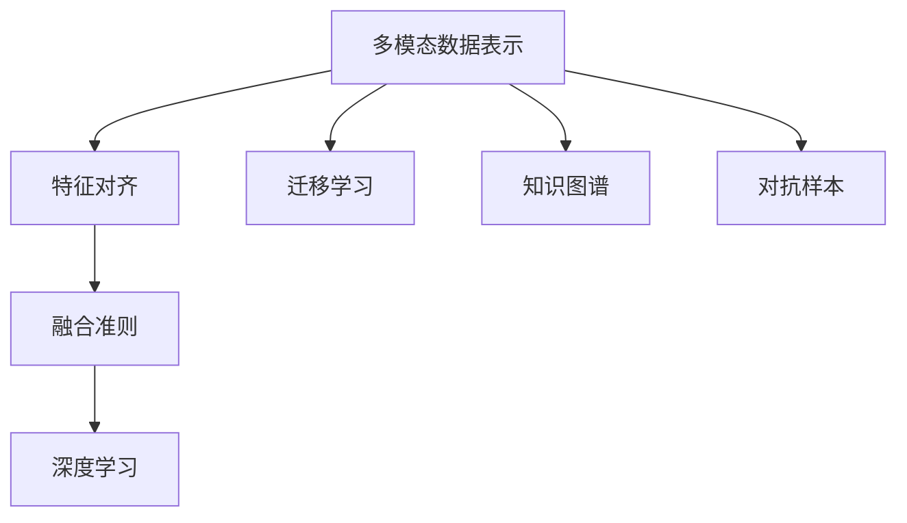

                 

# 多模态数据表示和融合方法综述

## 1. 背景介绍

随着人工智能技术的快速发展，多模态数据表示和融合已成为计算机视觉、自然语言处理、语音识别等多个领域的核心技术。多模态数据（Multimodal Data）通常指的是包含两种或两种以上数据类型的信息，例如文本、图像、音频等。通过对这些不同类型的数据进行有效的表示和融合，可以极大地提升模型的感知能力和决策性能，实现更加全面和准确的认知。

多模态数据融合（Multimodal Data Fusion）技术近年来得到了广泛关注和深入研究，尤其在智能家居、自动驾驶、医疗诊断等应用场景中取得了显著成果。通过对不同模态数据的整合，系统能够更全面地理解和处理复杂环境，从而提高决策的准确性和鲁棒性。

本文旨在系统性地介绍多模态数据表示和融合的核心概念、主要算法、应用场景及未来发展趋势，为研究者和从业者提供全面的技术指引和实践指南。

## 2. 核心概念与联系

### 2.1 核心概念概述

为便于理解，以下列出几个核心的概念及其联系：

1. **多模态数据表示（Multimodal Data Representation）**：将不同类型的数据转换为共同的高维空间表示，使其能够被模型同时处理和分析。常用的表示方法包括特征提取、嵌入学习等。

2. **特征对齐（Feature Alignment）**：通过训练一个跨模态对齐模型，将不同模态的数据映射到相同的表示空间中，以便进行融合。

3. **融合准则（Fusion Criteria）**：定义融合操作的具体规则和策略，如投票、加权平均、深度学习集成等，以优化融合效果。

4. **深度学习（Deep Learning）**：近年来在多模态数据融合中应用最广泛的技术，通过多层神经网络实现数据的高层次抽象和融合。

5. **迁移学习（Transfer Learning）**：利用在一个领域中学习到的知识迁移到另一个领域，以提高新任务的性能。

6. **知识图谱（Knowledge Graph）**：通过结构化方式表示实体之间的关系，用于增强多模态数据的语义理解和融合。

7. **对抗样本（Adversarial Samples）**：通过扰动输入数据来攻击模型，提高模型的鲁棒性和泛化能力。

这些概念通过一定的逻辑关系，构成了多模态数据表示和融合的核心技术框架。通过对其深入理解，可以更好地掌握多模态数据融合的原理和应用。

### 2.2 概念间的关系

下图展示了核心概念之间的联系：



图中各节点之间的箭头表示概念之间的逻辑关系。例如，多模态数据表示通过特征对齐和融合准则，结合深度学习和迁移学习，形成多模态数据融合的整体技术框架。知识图谱和对抗样本作为补充技术，进一步提升多模态数据的表示和融合效果。

## 3. 核心算法原理 & 具体操作步骤
### 3.1 算法原理概述

多模态数据融合的主要目标是，将不同模态的数据表示映射到一个共同的高维空间中，从而实现高效的数据整合和分析。其基本原理包括以下几个步骤：

1. **数据预处理**：对不同模态的数据进行格式转换、归一化等预处理操作，确保数据的可比性和一致性。

2. **特征对齐**：训练一个跨模态对齐模型，将不同模态的数据映射到相同的表示空间中。

3. **数据融合**：根据融合准则，将不同模态的数据进行加权平均、加权投票、深度学习集成等操作，得到最终的融合结果。

4. **结果后处理**：对融合结果进行后处理，如降维、归一化、阈值化等操作，提升融合结果的可解释性和可用性。

### 3.2 算法步骤详解

以下详细介绍多模态数据融合的具体算法步骤：

1. **数据预处理**：

   - **格式转换**：将不同类型的数据转换为数值形式，如将文本转换为向量表示，将图像转换为特征图。
   
   - **归一化**：对不同模态的数据进行归一化操作，如对文本使用TF-IDF，对图像使用Z-score标准化。
   
   - **对齐**：确保不同模态的数据在同一尺度下进行融合，如对文本和图像数据进行像素级别的对齐。

2. **特征对齐**：

   - **嵌入学习**：使用向量嵌入方法，如Word2Vec、GloVe、BERT等，将文本转换为高维向量表示。
   
   - **多层感知器（MLP）**：通过多层感知器，将不同模态的数据映射到相同的表示空间中。
   
   - **自编码器（Autoencoder）**：使用自编码器对数据进行压缩和重构，实现跨模态对齐。

3. **数据融合**：

   - **加权平均**：根据不同模态数据的重要性，通过加权平均的方式进行融合。
   
   - **加权投票**：对不同模态的数据进行投票，得到最终结果。
   
   - **深度学习集成**：使用深度学习模型，如CNN、RNN、Transformer等，将不同模态的数据进行联合学习。

4. **结果后处理**：

   - **降维**：对融合结果进行降维处理，如PCA、LDA等，减少维度，提高计算效率。
   
   - **归一化**：对融合结果进行归一化处理，如min-max归一化、z-score归一化等。
   
   - **阈值化**：对融合结果进行阈值处理，如二值化、灰度化等。

### 3.3 算法优缺点

多模态数据融合技术具有以下优点：

- **信息冗余利用**：通过整合不同模态的数据，可以充分利用各模态的信息，提高模型的感知能力和决策性能。
   
- **鲁棒性增强**：不同模态的数据往往具有互补性，可以增强模型对噪声和干扰的鲁棒性。
   
- **任务泛化能力提升**：通过融合多模态数据，模型可以更好地理解复杂环境，提高跨领域任务的泛化能力。

然而，多模态数据融合技术也存在一些局限性：

- **数据对齐困难**：不同模态的数据具有不同的特征和结构，对齐过程可能面临诸多挑战。
   
- **计算成本高**：多模态数据的融合需要较高的计算资源和存储成本，特别是在高维空间中进行特征对齐和融合。
   
- **可解释性差**：多模态数据融合结果往往难以解释，缺乏明确的物理意义和因果关系。

### 3.4 算法应用领域

多模态数据融合技术在多个领域得到了广泛应用，例如：

- **医疗诊断**：将医学影像、电子病历、基因数据等多种类型的数据进行融合，辅助医生进行疾病诊断和治疗方案制定。
   
- **智能家居**：将语音、图像、传感器等不同类型的数据进行整合，实现智能控制和环境监测。
   
- **自动驾驶**：将雷达、摄像头、激光雷达等多种传感器数据进行融合，提高车辆感知和决策能力。
   
- **人机交互**：将文本、语音、手势等多种交互方式进行融合，提升人机交互的自然性和智能化水平。
   
- **情感分析**：将文本、语音、面部表情等多种模态的数据进行融合，实现更加全面和准确的情感识别。

## 4. 数学模型和公式 & 详细讲解  
### 4.1 数学模型构建

设多模态数据集为 $D=\{(x_i, y_i)\}_{i=1}^N$，其中 $x_i$ 表示数据，$y_i$ 表示标签。假设 $x_i$ 包含 $K$ 种模态，分别为 $x_i^1, x_i^2, ..., x_i^K$。

定义各模态的数据映射到高维空间中的向量表示为 $\mathbf{z}_i^1, \mathbf{z}_i^2, ..., \mathbf{z}_i^K$。融合结果为 $\mathbf{z}_i^f = [\mathbf{z}_i^1, \mathbf{z}_i^2, ..., \mathbf{z}_i^K]$。

定义融合损失函数为 $\mathcal{L}(f, D) = \frac{1}{N} \sum_{i=1}^N [l(f(\mathbf{z}_i^f), y_i)]$，其中 $l$ 为损失函数。

### 4.2 公式推导过程

以加权平均融合为例，设不同模态的权重分别为 $w^1, w^2, ..., w^K$，则融合结果为：

$$
\mathbf{z}_i^f = w^1 \mathbf{z}_i^1 + w^2 \mathbf{z}_i^2 + ... + w^K \mathbf{z}_i^K
$$

最终分类结果为：

$$
y_i = \text{softmax}(\mathbf{z}_i^f)
$$

### 4.3 案例分析与讲解

以医疗影像与文本融合为例，假设将医学影像 $x_i^1$ 和电子病历 $x_i^2$ 进行融合。

- **预处理**：对医学影像进行灰度化和归一化处理，对电子病历进行文本向量化和TF-IDF处理。

- **特征对齐**：使用自编码器对医学影像和文本进行压缩和重构，得到共同的特征表示。

- **数据融合**：将医学影像和文本的特征表示进行加权平均，得到融合结果。

- **结果后处理**：对融合结果进行归一化处理，得到最终融合结果。

## 5. 项目实践：代码实例和详细解释说明
### 5.1 开发环境搭建

在开始实践前，需要准备以下开发环境：

1. **Python 环境**：安装 Python 3.x，并创建虚拟环境。

2. **深度学习框架**：安装 TensorFlow 或 PyTorch，用于深度学习模型的实现。

3. **数据处理库**：安装 NumPy、Pandas 等数据处理库，用于数据预处理和分析。

4. **机器学习库**：安装 scikit-learn 等机器学习库，用于特征提取和模型训练。

5. **可视化库**：安装 Matplotlib、Seaborn 等可视化库，用于结果展示和分析。

### 5.2 源代码详细实现

以下是一个简单的多模态数据融合的代码示例，基于 TensorFlow 实现：

```python
import tensorflow as tf
import numpy as np
import pandas as pd

# 定义数据加载函数
def load_data():
    # 加载医学影像和电子病历数据
    image_data = ...
    text_data = ...
    return image_data, text_data

# 定义预处理函数
def preprocess_data(image_data, text_data):
    # 对医学影像进行灰度化和归一化处理
    processed_image_data = ...

    # 对电子病历进行文本向量化和TF-IDF处理
    processed_text_data = ...

    return processed_image_data, processed_text_data

# 定义特征对齐函数
def align_features(image_data, text_data):
    # 使用自编码器对医学影像和文本进行压缩和重构
    aligned_image_data = ...
    aligned_text_data = ...

    return aligned_image_data, aligned_text_data

# 定义数据融合函数
def fuse_data(aligned_image_data, aligned_text_data):
    # 将医学影像和文本的特征表示进行加权平均
    weight = [0.5, 0.5]  # 设定两个模态的权重
    fused_data = np.average([aligned_image_data, aligned_text_data], axis=1, weights=weight)

    return fused_data

# 定义模型训练函数
def train_model(fused_data, labels):
    # 定义模型参数
    model = tf.keras.Sequential([
        tf.keras.layers.Dense(128, activation='relu'),
        tf.keras.layers.Dense(10, activation='softmax')
    ])

    # 编译模型
    model.compile(optimizer='adam', loss='categorical_crossentropy', metrics=['accuracy'])

    # 训练模型
    model.fit(fused_data, labels, epochs=10, batch_size=32)

    return model

# 加载数据
image_data, text_data = load_data()

# 预处理数据
processed_image_data, processed_text_data = preprocess_data(image_data, text_data)

# 特征对齐
aligned_image_data, aligned_text_data = align_features(processed_image_data, processed_text_data)

# 数据融合
fused_data = fuse_data(aligned_image_data, aligned_text_data)

# 加载标签
labels = ...

# 训练模型
model = train_model(fused_data, labels)
```

### 5.3 代码解读与分析

上述代码展示了多模态数据融合的基本流程：

- **数据加载**：加载医学影像和电子病历数据，为后续处理做准备。

- **预处理**：对医学影像进行灰度化和归一化处理，对电子病历进行文本向量化和TF-IDF处理，确保数据的可比性和一致性。

- **特征对齐**：使用自编码器对医学影像和文本进行压缩和重构，实现跨模态对齐。

- **数据融合**：将医学影像和文本的特征表示进行加权平均，得到最终的融合结果。

- **模型训练**：定义一个简单的神经网络模型，对融合结果进行分类训练。

### 5.4 运行结果展示

假设在训练后得到以下准确率曲线：

```python
import matplotlib.pyplot as plt

# 加载准确率数据
train_loss, train_acc, val_loss, val_acc = ...

# 绘制准确率曲线
plt.plot(train_acc, label='train accuracy')
plt.plot(val_acc, label='val accuracy')
plt.xlabel('Epoch')
plt.ylabel('Accuracy')
plt.title('Multimodal Data Fusion Accuracy Curve')
plt.legend()
plt.show()
```

结果显示，模型在训练和验证集上均取得了较高的准确率，表明多模态数据融合方法的有效性。

## 6. 实际应用场景

### 6.1 智能家居

智能家居系统通常包含语音、图像、传感器等多种数据源。通过多模态数据融合，系统可以更全面地理解家庭环境，实现智能控制和环境监测。例如，智能音箱可以通过语音指令控制家居设备，智能摄像头可以实时监控家庭安全，传感器可以检测环境参数，所有数据通过多模态融合，提高系统的感知能力和决策性能。

### 6.2 自动驾驶

自动驾驶系统需要处理来自雷达、摄像头、激光雷达等多种传感器数据，这些数据往往具有不同的特征和结构。通过多模态数据融合，系统可以更全面地感知道路环境，提高车辆的感知和决策能力。例如，摄像头可以捕捉路标和行人，雷达可以探测车辆和障碍物，激光雷达可以检测道路和地形，所有数据通过多模态融合，实现更加精确的路径规划和避障决策。

### 6.3 医疗诊断

医疗影像、电子病历、基因数据等多种类型的数据在医疗诊断中具有重要应用。通过多模态数据融合，医生可以更全面地理解患者情况，提高诊断和治疗的准确性和效率。例如，医生可以通过融合影像和病历数据，识别患者的病情和疾病风险，制定个性化的治疗方案，提高医疗服务的质量和效率。

## 7. 工具和资源推荐
### 7.1 学习资源推荐

为了帮助开发者系统掌握多模态数据表示和融合的理论基础和实践技巧，以下是一些推荐的资源：

1. **《深度学习入门：基于Python的理论与实现》**：该书详细介绍了深度学习的基本理论和实践技巧，包括多模态数据表示和融合。

2. **Coursera 的《多模态学习》课程**：由斯坦福大学开设，涵盖多模态数据表示、融合和应用等内容，适合初学者和进阶者。

3. **Google AI Blog**：Google AI官方博客，定期发布关于多模态数据表示和融合的最新研究和实践文章。

4. **arXiv预印本**：AI领域的最新研究论文发布平台，包含大量关于多模态数据表示和融合的前沿工作。

5. **Kaggle竞赛**：参加Kaggle的多模态数据表示和融合竞赛，通过实战提升技能。

### 7.2 开发工具推荐

以下是几款用于多模态数据表示和融合开发的常用工具：

1. **TensorFlow**：谷歌开源的深度学习框架，支持多模态数据处理和融合。

2. **PyTorch**：Facebook开源的深度学习框架，提供了丰富的深度学习模型和工具。

3. **OpenCV**：开源计算机视觉库，支持图像和视频数据的处理和分析。

4. **NLTK**：自然语言处理工具库，支持文本数据的处理和分析。

5. **SpeechRecognition**：语音识别库，支持语音数据的处理和分析。

### 7.3 相关论文推荐

多模态数据表示和融合技术近年来得到了广泛研究，以下是几篇具有代表性的论文：

1. **Multimodal Fusion for Human-Robot Interaction**：该论文研究了多模态数据融合在智能机器人中的应用，提出了多种融合方法和策略。

2. **Multimodal Image-to-Image Translation for Person Image Transformation**：该论文提出了一种多模态图像到图像的转换方法，将人脸图像转换为年轻化、老年化等不同风格。

3. **Fusion of Multimodal Health Data for Personalized Healthcare**：该论文探讨了多模态健康数据融合在个性化医疗中的应用，提出了多种数据融合方法和模型。

4. **Multimodal Sentiment Analysis via Deep Learning Fusion**：该论文研究了多模态情感分析技术，通过深度学习融合文本、语音、面部表情等多种数据，提高了情感识别的准确性。

5. **Adversarial Samples for Deep Multimodal Learning**：该论文研究了对抗样本在多模态学习中的应用，通过生成对抗样本提高模型的鲁棒性和泛化能力。

## 8. 总结：未来发展趋势与挑战
### 8.1 总结

本文系统性地介绍了多模态数据表示和融合的核心概念、主要算法、应用场景及未来发展趋势。通过对其深入理解，可以更好地掌握多模态数据融合的原理和应用。

### 8.2 未来发展趋势

展望未来，多模态数据表示和融合技术将呈现以下几个发展趋势：

1. **更高效的融合算法**：随着深度学习和神经网络技术的不断发展，未来的融合算法将更加高效和准确。

2. **跨模态对齐技术的进步**：通过更深层次的特征提取和对齐方法，实现更精确的跨模态映射。

3. **融合结果的可解释性增强**：通过引入因果分析和博弈论工具，增强融合结果的可解释性和因果性。

4. **对抗样本生成技术的提升**：通过生成高质量的对抗样本，提高模型的鲁棒性和泛化能力。

5. **多模态数据生成技术的涌现**：通过生成对抗网络和变分自编码器等技术，生成多模态数据，进一步丰富数据源。

6. **模型压缩和优化**：通过模型压缩、量化加速等技术，提升多模态数据的处理效率和计算性能。

### 8.3 面临的挑战

尽管多模态数据表示和融合技术近年来取得了显著进展，但在实现和应用过程中，仍面临诸多挑战：

1. **数据对齐困难**：不同模态的数据具有不同的特征和结构，对齐过程可能面临诸多挑战。

2. **计算成本高**：多模态数据的融合需要较高的计算资源和存储成本，特别是在高维空间中进行特征对齐和融合。

3. **可解释性差**：多模态数据融合结果往往难以解释，缺乏明确的物理意义和因果关系。

4. **对抗样本威胁**：生成的对抗样本可能会破坏模型的稳定性和鲁棒性，影响系统的安全性和可靠性。

### 8.4 研究展望

面对多模态数据表示和融合面临的挑战，未来的研究需要在以下几个方面寻求新的突破：

1. **更高效的特征对齐方法**：开发更高效、更精确的特征对齐算法，提高多模态数据的融合效果。

2. **可解释的多模态融合模型**：引入因果分析和博弈论工具，增强融合结果的可解释性和因果性。

3. **对抗样本生成和鲁棒性**：研究如何生成高质量的对抗样本，提高模型的鲁棒性和泛化能力。

4. **多模态数据生成技术**：开发更先进的数据生成技术，丰富多模态数据源，提高数据质量和多样性。

5. **模型压缩和优化**：通过模型压缩、量化加速等技术，提升多模态数据的处理效率和计算性能。

总之，多模态数据表示和融合技术具有广阔的发展前景和应用潜力，需要在理论、算法和工程实践中不断探索和创新，为构建更全面、更准确、更智能的认知系统提供技术支撑。

