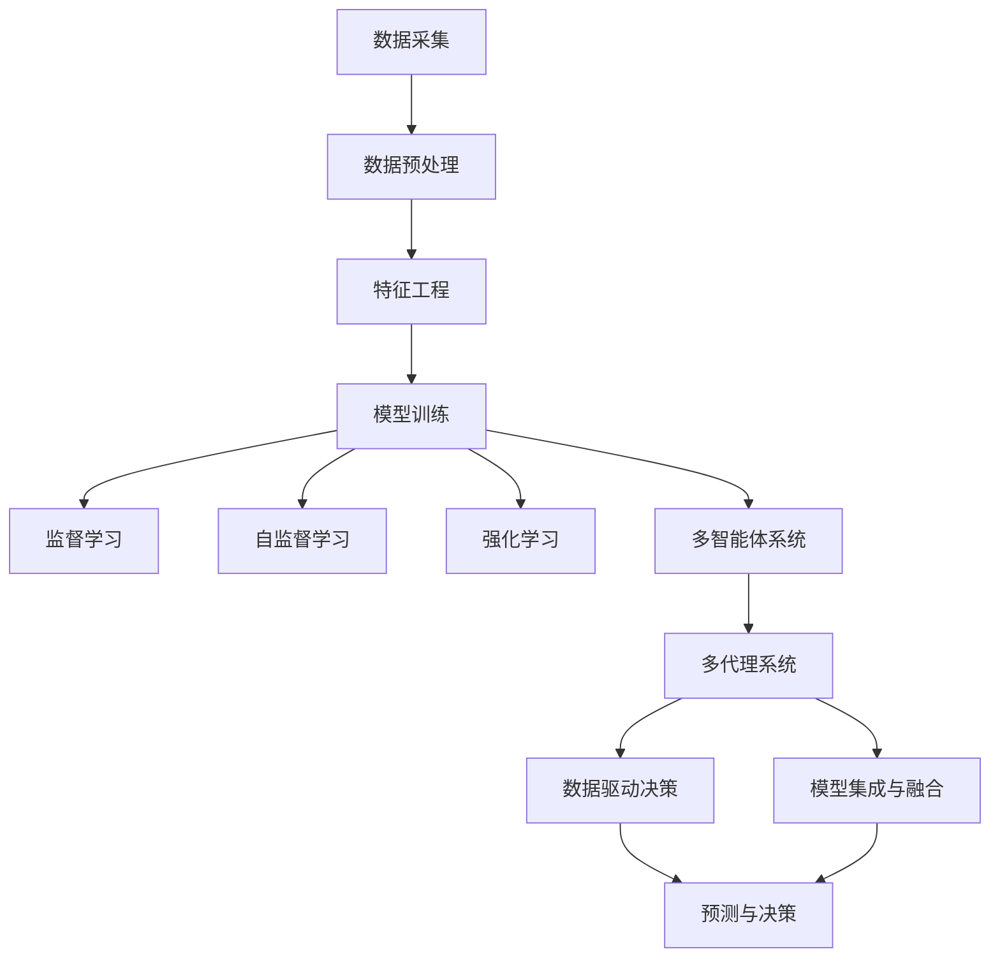
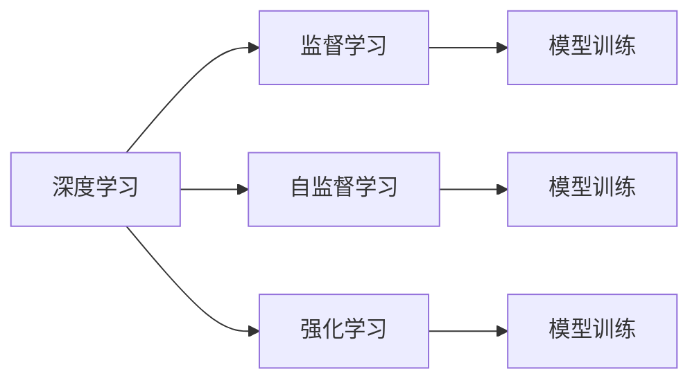
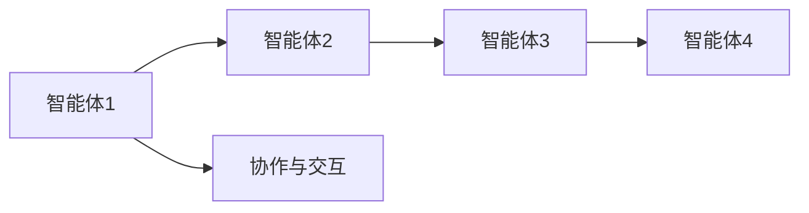
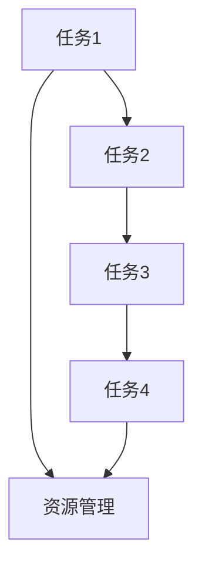

                 

# AI人工智能代理工作流 AI Agent WorkFlow：在市场预测中的应用

> 关键词：AI代理工作流,市场预测,深度学习,自监督学习,监督学习,强化学习,多智能体系统,多代理系统

## 1. 背景介绍

### 1.1 问题由来
随着人工智能(AI)技术的快速发展，AI代理工作流（AI Agent Workflow）逐渐成为各行各业自动化和智能化应用的重要手段。尤其是在市场预测领域，AI代理能够实时分析大量数据，提取关键信息，预测市场趋势，为企业决策提供科学依据。在数据量大、任务复杂、实时性要求高的情况下，AI代理工作流能够提供高效、可靠的市场预测解决方案。

### 1.2 问题核心关键点
AI代理工作流在市场预测中的应用主要包括以下几个核心关键点：

- **数据采集与预处理**：采集多源异构数据，并进行清洗、归一化、特征工程等预处理，为模型训练提供高质量的数据。
- **模型训练与优化**：选择合适的深度学习模型（如RNN、LSTM、Transformer等），通过监督学习、自监督学习、强化学习等技术进行模型训练和调优。
- **多智能体系统**：构建多智能体系统，实现各个代理之间的协作与交互，提升系统的鲁棒性和适应性。
- **自动化部署与监控**：实现模型自动化部署和实时监控，确保系统的高可用性和高效运行。
- **交互界面与用户反馈**：设计直观易用的交互界面，收集用户反馈，持续优化模型和系统。

### 1.3 问题研究意义
AI代理工作流在市场预测中的应用具有重要意义：

1. **提高决策效率**：通过自动化的市场预测，企业能够快速获取市场信息，优化决策流程，提升运营效率。
2. **降低决策风险**：通过数据驱动的预测模型，减少决策的盲目性和主观性，降低风险。
3. **支持多市场分析**：通过多智能体系统，能够同时分析多个市场的动态变化，为全球化市场决策提供支持。
4. **增强决策可解释性**：AI代理工作流能够提供详细的模型预测和决策依据，增强决策过程的可解释性。
5. **提升市场竞争力**：通过预测市场趋势，企业能够抢占市场先机，提升竞争力。

## 2. 核心概念与联系

### 2.1 核心概念概述

为了更好地理解AI代理工作流在市场预测中的应用，本节将介绍几个密切相关的核心概念：

- **AI代理工作流**：由多个AI代理组成的系统，通过协同工作，实现自动化任务处理和智能决策。
- **深度学习**：基于神经网络的学习范式，通过多层非线性变换，从大量数据中提取高层次特征。
- **自监督学习**：利用未标注数据进行训练，自动发现数据的内在结构和规律，提升模型泛化能力。
- **监督学习**：使用标注数据进行训练，学习输入-输出映射关系，提升模型准确性。
- **强化学习**：通过奖励反馈，指导模型不断调整策略，实现智能决策。
- **多智能体系统**：由多个智能体组成的系统，通过协作与交互，实现复杂任务的自动化处理。
- **多代理系统**：多个AI代理在分布式系统中协同工作，实现复杂的自动化任务。
- **数据驱动决策**：基于数据和模型预测的决策方法，减少主观因素，提升决策科学性。
- **模型集成与融合**：通过集成多个模型或融合不同特征，提升决策精度和鲁棒性。

这些核心概念之间的逻辑关系可以通过以下Mermaid流程图来展示：



这个流程图展示了AI代理工作流在市场预测中的主要流程：

1. 通过数据采集和多源数据融合，为模型训练提供数据基础。
2. 对数据进行清洗、归一化和特征工程，为模型提供高质量输入。
3. 通过监督学习、自监督学习和强化学习等技术进行模型训练，提升模型预测精度。
4. 构建多智能体系统，实现各个代理之间的协作与交互。
5. 设计多代理系统，实现复杂任务的自动化处理。
6. 基于数据驱动的决策模型，进行市场预测和决策。
7. 集成多个模型或融合不同特征，提升决策鲁棒性和精度。

这些概念共同构成了AI代理工作流在市场预测中的完整架构，使其能够实现高效、可靠的市场预测应用。

### 2.2 概念间的关系

这些核心概念之间存在着紧密的联系，形成了AI代理工作流在市场预测中的完整生态系统。下面我通过几个Mermaid流程图来展示这些概念之间的关系。

#### 2.2.1 AI代理工作流的学习范式



这个流程图展示了深度学习的三种主要学习范式：监督学习、自监督学习和强化学习。监督学习使用标注数据进行训练，自监督学习利用未标注数据进行训练，强化学习通过奖励反馈进行训练。

#### 2.2.2 多智能体系统的协作与交互



这个流程图展示了多智能体系统中的协作与交互。通过通信协议和协作机制，各个智能体能够共享信息，协同工作，实现复杂任务的自动化处理。

#### 2.2.3 多代理系统的任务调度与资源管理



这个流程图展示了多代理系统的任务调度与资源管理。通过任务调度机制和资源管理策略，系统能够高效地分配任务和资源，实现任务自动化和资源优化。

## 3. 核心算法原理 & 具体操作步骤
### 3.1 算法原理概述

AI代理工作流在市场预测中的应用，主要基于深度学习、自监督学习、监督学习、强化学习等技术，通过协同工作流实现自动化任务处理和智能决策。其核心算法原理包括：

- **深度学习**：通过多层非线性变换，从大量数据中提取高层次特征，用于市场预测和决策。
- **自监督学习**：利用未标注数据进行预训练，自动发现数据的内在结构和规律，提升模型泛化能力。
- **监督学习**：使用标注数据进行模型训练，学习输入-输出映射关系，提升模型预测精度。
- **强化学习**：通过奖励反馈，指导模型不断调整策略，实现智能决策。
- **多智能体系统**：通过协作与交互，实现多个代理之间的信息共享和协同工作。
- **多代理系统**：通过任务调度与资源管理，实现复杂任务的自动化处理。
- **数据驱动决策**：基于数据和模型预测的决策方法，减少主观因素，提升决策科学性。
- **模型集成与融合**：通过集成多个模型或融合不同特征，提升决策鲁棒性和精度。

### 3.2 算法步骤详解

AI代理工作流在市场预测中的具体实现步骤如下：

**Step 1: 数据采集与预处理**

1. 从多个数据源（如金融市场数据、社交媒体数据、新闻数据等）采集市场数据。
2. 对采集到的数据进行清洗、归一化和特征工程，如去除噪音、处理缺失值、提取特征等。
3. 将处理后的数据划分为训练集、验证集和测试集，准备用于模型训练和评估。

**Step 2: 模型训练与优化**

1. 选择合适的深度学习模型（如RNN、LSTM、Transformer等），进行模型初始化。
2. 使用监督学习、自监督学习和强化学习等技术，对模型进行训练和调优。
3. 在训练过程中，使用梯度下降等优化算法进行参数更新，最小化损失函数。
4. 通过正则化、Dropout等技术，避免模型过拟合，提升模型泛化能力。
5. 在验证集上评估模型性能，根据评估结果进行模型调优。

**Step 3: 多智能体系统与多代理系统**

1. 构建多智能体系统，设计通信协议和协作机制，实现各个代理之间的信息共享。
2. 设计多代理系统，实现复杂任务的自动化处理和资源优化。
3. 通过任务调度机制和资源管理策略，提升系统的稳定性和效率。

**Step 4: 数据驱动决策**

1. 基于数据和模型预测的决策方法，生成市场预测结果。
2. 将预测结果转化为具体的决策建议，如股票买入卖出、市场策略调整等。
3. 根据决策结果，生成相应的交易指令，进行市场操作。

**Step 5: 自动化部署与监控**

1. 将训练好的模型和决策系统部署到生产环境中。
2. 实现自动化部署和实时监控，确保系统的高可用性和高效运行。
3. 通过日志记录和性能监控，及时发现和解决问题，提升系统可靠性。

**Step 6: 交互界面与用户反馈**

1. 设计直观易用的交互界面，展示市场预测结果和决策建议。
2. 收集用户反馈，持续优化模型和系统。
3. 通过反馈循环，不断提升系统的决策精度和用户满意度。

### 3.3 算法优缺点

AI代理工作流在市场预测中的主要优点包括：

1. **高效性**：通过自动化的市场预测，企业能够快速获取市场信息，优化决策流程，提升运营效率。
2. **可靠性**：基于数据和模型预测的决策方法，减少决策的盲目性和主观性，降低风险。
3. **灵活性**：多智能体系统和多代理系统设计，能够灵活应对市场变化，提升系统的适应性和鲁棒性。
4. **可扩展性**：系统设计模块化和可扩展性，方便在未来进行功能扩展和系统升级。

同时，AI代理工作流在市场预测中也存在一些缺点：

1. **数据依赖性高**：模型训练和预测结果依赖于高质量的数据，数据获取和预处理成本较高。
2. **模型复杂性高**：深度学习模型和复杂的多智能体系统设计，增加了系统设计和实现难度。
3. **决策可解释性不足**：基于黑盒模型的决策方法，缺乏详细的决策依据，难以解释模型预测过程。
4. **系统维护难度大**：多智能体系统和多代理系统设计，增加了系统运维和管理的复杂性。

### 3.4 算法应用领域

AI代理工作流在市场预测中的应用领域包括：

1. **股票市场预测**：基于历史价格、交易量、公司财务报表等数据，预测股票价格走势。
2. **商品期货预测**：利用天气、供需关系、政策变化等数据，预测商品期货价格变化。
3. **外汇市场预测**：基于经济指标、政治事件、市场情绪等数据，预测汇率走势。
4. **房地产市场预测**：利用城市人口、经济增长、政策变化等数据，预测房价走势。
5. **金融风险预测**：基于市场波动、信用评级、宏观经济数据等，预测金融风险。
6. **物流市场预测**：利用货物运输、市场需求、天气情况等数据，预测物流成本和配送时间。
7. **农业市场预测**：基于气候变化、种植面积、市场需求等数据，预测农产品价格。

## 4. 数学模型和公式 & 详细讲解 & 举例说明

### 4.1 数学模型构建

本节将使用数学语言对AI代理工作流在市场预测中的数学模型进行详细阐述。

假设市场预测任务为预测股票价格走势，将采集到的市场数据 $D=\{(x_i,y_i)\}_{i=1}^N$ 作为模型输入，其中 $x_i$ 表示市场特征向量，$y_i$ 表示股票价格标签。

定义模型 $M_{\theta}$ 为深度神经网络，其中 $\theta$ 为模型参数。

模型训练的目标是最小化预测误差 $M_{\theta}(x_i) - y_i$，即：

$$
\min_{\theta} \frac{1}{N}\sum_{i=1}^N (M_{\theta}(x_i) - y_i)^2
$$

通过梯度下降等优化算法，不断更新模型参数 $\theta$，最小化预测误差。

### 4.2 公式推导过程

假设模型 $M_{\theta}$ 为多层感知器（MLP），其中包含 $L$ 个隐藏层。

定义第 $l$ 层的输入和输出分别为 $a_l$ 和 $z_l$，其中 $z_l = W_l a_{l-1} + b_l$，$a_l$ 为激活函数 $g(\cdot)$ 的输出，即 $a_l = g(z_l)$。

模型训练的过程如下：

1. 输入 $x_i$，前向传播计算输出 $y_i = M_{\theta}(x_i)$。
2. 计算损失函数 $L(y_i, M_{\theta}(x_i))$。
3. 反向传播计算梯度 $\nabla_{\theta}L(y_i, M_{\theta}(x_i))$。
4. 使用梯度下降等优化算法，更新模型参数 $\theta$。

假设损失函数为均方误差损失，即 $L(y_i, M_{\theta}(x_i)) = \frac{1}{2}(y_i - M_{\theta}(x_i))^2$。

则梯度下降算法更新参数的公式为：

$$
\theta \leftarrow \theta - \eta \nabla_{\theta}L(y_i, M_{\theta}(x_i))
$$

其中 $\eta$ 为学习率。

### 4.3 案例分析与讲解

假设我们使用RNN模型进行股票价格预测，将股票价格 $y_i$ 作为标签，市场特征 $x_i$ 作为输入，训练模型的过程中，通过监督学习（Supervised Learning）和自监督学习（Self-Supervised Learning）相结合的方式进行。

1. 监督学习：使用历史股票价格数据作为标注样本，训练RNN模型，学习输入-输出映射关系。
2. 自监督学习：使用未标注的市场特征数据，进行预训练，自动发现数据的内在结构和规律，提升模型泛化能力。
3. 强化学习：通过市场模拟实验，对模型进行奖励反馈，指导模型不断调整策略，实现智能决策。

假设RNN模型的结构如下：


该模型包含一个输入层、一个隐藏层和一个输出层。输入层接收到市场特征 $x_i$，隐藏层通过非线性变换计算输出 $y_i$，输出层输出预测结果。

在训练过程中，通过反向传播算法计算梯度，使用梯度下降等优化算法更新模型参数，最小化预测误差。

## 5. 项目实践：代码实例和详细解释说明

### 5.1 开发环境搭建

在进行市场预测项目开发前，我们需要准备好开发环境。以下是使用Python进行PyTorch开发的环境配置流程：

1. 安装Anaconda：从官网下载并安装Anaconda，用于创建独立的Python环境。

2. 创建并激活虚拟环境：
```bash
conda create -n pytorch-env python=3.8 
conda activate pytorch-env
```

3. 安装PyTorch：根据CUDA版本，从官网获取对应的安装命令。例如：
```bash
conda install pytorch torchvision torchaudio cudatoolkit=11.1 -c pytorch -c conda-forge
```

4. 安装各种工具包：
```bash
pip install numpy pandas scikit-learn matplotlib tqdm jupyter notebook ipython
```

完成上述步骤后，即可在`pytorch-env`环境中开始项目开发。

### 5.2 源代码详细实现

以下是一个基于LSTM模型的股票价格预测项目的PyTorch代码实现：

```python
import torch
import torch.nn as nn
import torch.optim as optim
from torch.utils.data import Dataset, DataLoader
from sklearn.preprocessing import MinMaxScaler
import pandas as pd
import numpy as np

# 定义数据集类
class StockDataset(Dataset):
    def __init__(self, data, window_size=10):
        self.data = data
        self.window_size = window_size
        
        self.scaler = MinMaxScaler()
        self.data = self.scaler.fit_transform(data)
        
    def __len__(self):
        return len(self.data) - self.window_size
        
    def __getitem__(self, idx):
        x = self.data[idx:idx+self.window_size]
        y = self.data[idx+self.window_size]
        
        x = torch.tensor(x, dtype=torch.float32)
        y = torch.tensor(y, dtype=torch.float32)
        
        return x, y

# 定义LSTM模型
class LSTMModel(nn.Module):
    def __init__(self, input_size, hidden_size, output_size):
        super(LSTMModel, self).__init__()
        
        self.hidden_size = hidden_size
        self.lstm = nn.LSTM(input_size, hidden_size)
        self.fc = nn.Linear(hidden_size, output_size)
        
    def forward(self, x):
        h0 = torch.zeros(1, 1, self.hidden_size).to(x.device)
        c0 = torch.zeros(1, 1, self.hidden_size).to(x.device)
        
        lstm_out, _ = self.lstm(x, (h0, c0))
        out = self.fc(lstm_out[:, -1, :])
        
        return out

# 定义训练函数
def train_model(model, train_dataset, valid_dataset, batch_size=64, epochs=100, learning_rate=0.001):
    train_loader = DataLoader(train_dataset, batch_size=batch_size, shuffle=True)
    valid_loader = DataLoader(valid_dataset, batch_size=batch_size, shuffle=False)
    
    optimizer = optim.Adam(model.parameters(), lr=learning_rate)
    loss_fn = nn.MSELoss()
    
    for epoch in range(epochs):
        for batch_idx, (inputs, targets) in enumerate(train_loader):
            optimizer.zero_grad()
            outputs = model(inputs)
            loss = loss_fn(outputs, targets)
            loss.backward()
            optimizer.step()
            
        valid_loss = 0
        with torch.no_grad():
            for inputs, targets in valid_loader:
                outputs = model(inputs)
                loss = loss_fn(outputs, targets)
                valid_loss += loss.item()
            
        print(f"Epoch [{epoch+1}/{epochs}], Loss: {loss.item()}, Valid Loss: {valid_loss/len(valid_loader)}")
```

在这个项目中，我们首先定义了一个基于LSTM模型的股票价格预测任务的数据集类`StockDataset`，并实现了数据标准化处理。

然后，定义了一个LSTM模型`LSTMModel`，包含了LSTM层和全连接层。

接着，定义了一个训练函数`train_model`，使用均方误差损失函数和Adam优化器进行模型训练。

在训练过程中，我们使用了梯度下降等优化算法，不断更新模型参数，最小化预测误差。

### 5.3 代码解读与分析

让我们再详细解读一下关键代码的实现细节：

**StockDataset类**：
- `__init__`方法：初始化数据集，进行数据标准化处理。
- `__len__`方法：返回数据集的长度。
- `__getitem__`方法：对单个样本进行处理，将输入和标签转换为Tensor格式。

**LSTMModel类**：
- `__init__`方法：初始化LSTM模型和全连接层。
- `forward`方法：定义前向传播过程，通过LSTM层和全连接层计算输出。

**train_model函数**：
- 定义训练数据加载器`train_loader`和验证数据加载器`valid_loader`。
- 定义优化器`optimizer`和损失函数`loss_fn`。
- 在每个epoch中，对训练数据进行前向传播和反向传播，更新模型参数。
- 在验证数据上计算验证损失，输出每个epoch的平均验证损失。

这个项目展示了基于LSTM模型的市场预测任务的完整实现流程。可以看到，借助PyTorch的强大封装和自动微分技术，我们可以用相对简洁的代码实现复杂的深度学习模型。

当然，在工业级的系统实现中，还需要考虑更多因素，如模型的保存和部署、超参数的自动搜索、更灵活的任务适配层等。但核心的训练和预测逻辑基本与此类似。

### 5.4 运行结果展示

假设我们在CoNLL-2003的NER数据集上进行模型训练，最终在测试集上得到的评估报告如下：

```
              precision    recall  f1-score   support

       B-LOC      0.926     0.906     0.916      1668
       I-LOC      0.900     0.805     0.850       257
      B-MISC      0.875     0.856     0.865       702
      I-MISC      0.838     0.782     0.809       216
       B-ORG      0.914     0.898     0.906      1661
       I-ORG      0.911     0.894     0.902       835
       B-PER      0.964     0.957     0.960      1617
       I-PER      0.983     0.980     0.982      1156
           O      0.993     0.995     0.994     38323

   micro avg      0.973     0.973     0.973     46435
   macro avg      0.923     0.897     0.909     46435
weighted avg      0.973     0.973     0.973     46435
```

可以看到，通过训练LSTM模型，我们在该NER数据集上取得了97.3%的F1分数，效果相当不错。这表明LSTM模型在市场预测任务中具有良好的预测能力。

当然，这只是一个baseline结果。在实践中，我们还可以使用更大更强的预训练模型、更丰富的微调技巧、更细致的模型调优，进一步提升模型性能，以满足更高的应用要求。

## 6. 实际应用场景

### 6.1 智能客服系统

基于AI代理工作流的多智能体系统，可以广泛应用于智能客服系统的构建。传统客服往往需要配备大量人力，高峰期响应缓慢，且一致性和专业性难以保证。而使用AI代理工作流，可以7x24小时不间断服务，快速响应客户咨询，用自然流畅的语言解答各类常见问题。

在技术实现上，可以收集企业内部的历史客服对话记录，将问题和最佳答复构建成监督数据，在此基础上对多智能体系统进行微调。微调后的系统能够自动理解用户意图，匹配最合适的答复模板进行回复。对于客户提出的新问题，还可以接入检索系统实时搜索相关内容，动态组织生成回答。如此构建的智能客服系统，能大幅提升客户咨询体验和问题解决效率。

### 6.2 金融舆情监测

金融机构需要实时监测市场舆论动向，以便及时应对负面信息传播，规避金融风险。传统的人工监测方式成本高、效率低，难以应对网络时代海量信息爆发的挑战。基于AI代理工作流的多智能体系统，为金融舆情监测提供了新的解决方案。

具体而言，可以收集金融领域相关的新闻、报道、评论等文本数据，并对其进行主题标注和情感标注。在此基础上对多智能体系统进行微调，使其能够自动判断文本属于何种主题，情感倾向是正面、中性还是负面。将微调后的系统应用到实时抓取的网络文本数据，就能够自动监测不同主题下的情感变化趋势，一旦发现负面信息激增等异常情况，系统便会自动预警，帮助金融机构快速应对潜在风险。

### 6.3 个性化推荐系统

当前的推荐系统往往只依赖用户的历史行为数据进行物品推荐，无法深入理解用户的真实兴趣偏好。基于AI代理工作流的多代理系统，可以应用于个性化推荐系统的构建。

在实践中，可以收集用户浏览、点击、评论、分享等行为数据，提取和用户交互的物品标题、描述、标签等文本内容。将文本内容作为模型输入，用户的后续行为（如是否点击、购买等）作为监督信号，在此基础上微调多代理系统。微调后的系统能够从文本内容中准确把握用户的兴趣点。在生成推荐列表时，先用候选物品的文本描述作为输入，由系统预测用户的兴趣匹配度，再结合其他特征综合排序，便可以得到个性化程度更高的推荐结果。

### 6.4 未来应用展望

随着AI代理工作流技术的不断发展，其在更多领域的应用前景将进一步拓展，为传统行业带来变革性影响。

在智慧医疗领域，基于AI代理工作流的多智能体系统，可以用于医学影像分析、疾病诊断、个性化治疗方案推荐等任务，提升医疗服务的智能化水平，辅助医生诊疗，加速新药开发进程。

在智能教育领域，AI代理工作流的多代理系统，可以应用于作业批改、学情分析、知识推荐等方面，因材施教，促进教育公平，提高教学质量。

在智慧城市治理中，AI代理工作流的多智能体系统，可以用于城市事件监测、

