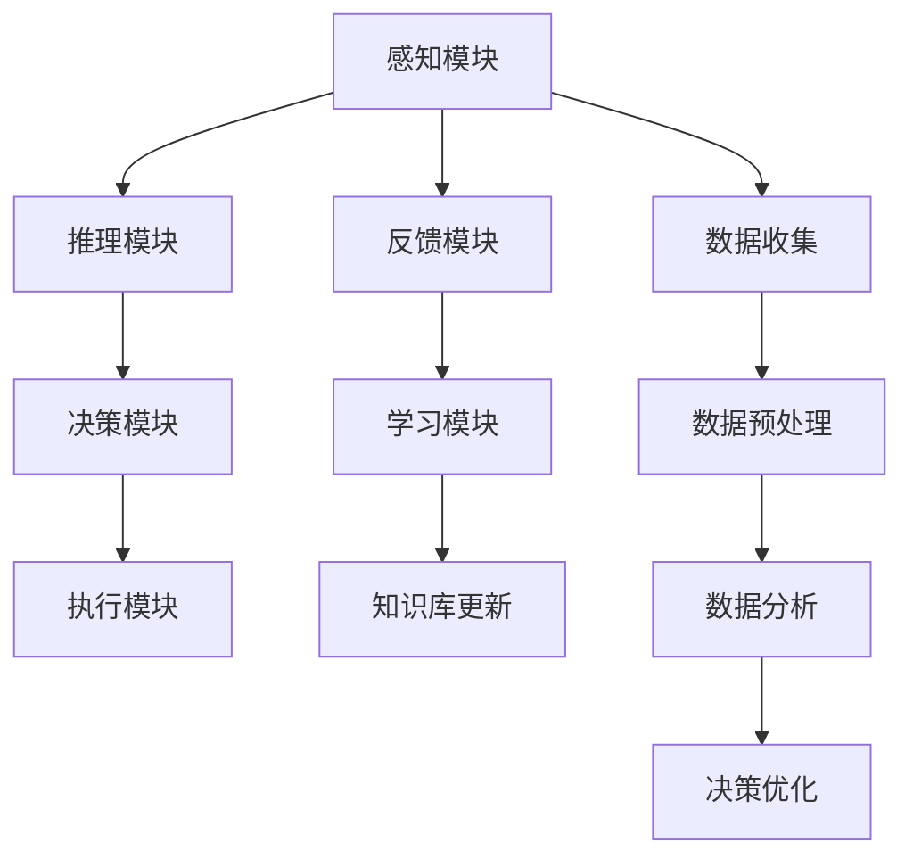

                 

# AI人工智能代理工作流AI Agent WorkFlow：智能代理在农业自动化系统中的应用

> 关键词：AI Agent, Workflow, 农业自动化, 智能决策, 机器人技术, 数据驱动, 机器学习, 精准农业

## 1. 背景介绍

### 1.1 问题由来
随着科技的迅速发展，农业自动化技术不断革新，为传统农业生产带来了深刻变革。近年来，AI技术在农业领域的应用逐步扩大，包括无人驾驶农机、智能灌溉系统、农业机器人、智能温室控制等。然而，这些自动化系统仍需要人工干预和决策，无法实现自主、高效、精准的农业生产。因此，引入智能代理(AI Agent)，将AI技术嵌入农业自动化系统，提升农业生产效率和自动化水平成为当前热点。

### 1.2 问题核心关键点
智能代理(AI Agent)是指在特定领域内具有自主感知、推理和决策能力的软件实体。它通过模拟人类专家的决策过程，能够在复杂的农业生产环境中自动化地执行任务，如作物种植、病虫害防治、机械操作等。智能代理的关键在于其工作流(Workflow)，即一系列预先定义的任务和决策步骤，能够自动执行并不断迭代优化，以适应不断变化的环境和需求。

智能代理在农业自动化系统中的应用具有以下核心优势：
1. 自主感知和决策：智能代理能够实时感知田间环境数据，通过学习和推理，自主做出最优决策。
2. 高效自动化：工作流设计合理，可以大幅提高农业生产的自动化水平。
3. 灵活适应性：能够适应农业生产中的多种变化和异常情况，增强系统鲁棒性。
4. 数据驱动：通过持续收集和分析生产数据，优化农业生产过程。
5. 集成协作：与其他自动化设备和系统协同工作，实现更复杂的农业任务。

## 2. 核心概念与联系

### 2.1 核心概念概述

智能代理（AI Agent）和农业自动化系统密切相关，其核心思想是利用AI技术模拟人类专家的决策过程，在农业生产中自动执行任务。智能代理的核心构成包括：

- **感知模块**：通过传感器和监测设备，实时收集田间环境数据，如土壤湿度、温度、光照强度、病虫害等。
- **推理模块**：使用知识库和推理算法，对感知数据进行分析和解释，形成农业生产决策的依据。
- **决策模块**：基于推理结果，自动生成并执行决策，如灌溉、施肥、喷药、机械操作等。
- **学习模块**：通过收集实际生产数据，不断优化和改进决策模型。

### 2.2 概念间的关系

智能代理和农业自动化系统的工作流之间存在着紧密的联系。以下通过Mermaid流程图来展示这一关系：



该流程图展示了智能代理在农业自动化系统中的主要工作流：

1. 感知模块(A)通过传感器收集田间环境数据。
2. 推理模块(B)对感知数据进行分析和解释，形成初步决策。
3. 决策模块(C)基于推理结果，自动生成执行计划。
4. 执行模块(D)根据执行计划，操作农业设备，实施农业任务。
5. 反馈模块(E)收集执行结果和环境变化数据。
6. 学习模块(F)利用反馈数据，不断优化决策模型。
7. 知识库更新(G)根据学习结果，更新和扩展知识库。

同时，数据收集(H)、数据预处理(I)和数据分析(J)也是工作流中的关键环节，确保数据的准确性和可靠性，为智能代理的决策提供坚实基础。

## 3. 核心算法原理 & 具体操作步骤
### 3.1 算法原理概述

智能代理的算法原理基于AI中的知识表示、规则推理和机器学习等技术。其核心流程如下：

1. **数据感知与采集**：通过传感器和监测设备，实时获取田间环境数据。
2. **数据预处理**：对采集数据进行清洗、归一化、特征提取等处理，保证数据的质量和一致性。
3. **知识库构建与更新**：构建农业领域的知识库，存储规则、经验、参数等，通过不断学习和优化，更新知识库内容。
4. **推理与决策**：利用知识库中的规则和模型，对感知数据进行推理，形成决策依据。
5. **执行与控制**：根据决策结果，控制农业设备，执行相应的农业任务。
6. **反馈与学习**：收集任务执行结果和环境变化数据，反馈到推理模块，更新模型参数，优化决策策略。

### 3.2 算法步骤详解

以下详细介绍智能代理在农业自动化系统中的具体操作步骤：

**Step 1: 数据感知与采集**

- 安装各类传感器（如土壤湿度传感器、温度传感器、光照传感器等），实时监测田间环境数据。
- 配置数据采集器，通过Wi-Fi、4G等网络将传感器数据传输到中央处理单元。

**Step 2: 数据预处理**

- 使用Python编程，编写数据预处理脚本，清洗数据，去除噪声，归一化数据，提取特征。
- 利用机器学习模型，对数据进行降维、特征选择等处理，保证数据的质量和一致性。

**Step 3: 知识库构建与更新**

- 收集和整理农业领域的专家知识，构建农业知识库，包括作物生长规律、病虫害防治方法、机械操作规范等。
- 使用自然语言处理(NLP)技术，将知识库中的规则和经验转化为机器可读的形式，如规则表达式、决策树、神经网络等。

**Step 4: 推理与决策**

- 设计推理算法，如规则推理、符号推理、因果推理等，对感知数据进行分析，形成初步决策。
- 使用机器学习模型，如决策树、随机森林、神经网络等，对决策进行优化和调整。

**Step 5: 执行与控制**

- 将决策转化为具体的操作指令，控制农业设备，如灌溉系统、施肥设备、喷药设备、农机等。
- 实现设备之间的协同工作，如多机协同耕作、联合收割等，提高作业效率。

**Step 6: 反馈与学习**

- 收集任务执行结果和环境变化数据，反馈到推理模块，更新模型参数，优化决策策略。
- 利用机器学习技术，不断积累生产数据，进行知识库更新和优化，提升智能代理的性能。

### 3.3 算法优缺点

智能代理在农业自动化系统中的应用具有以下优点：

1. **自主决策**：通过自动感知和推理，智能代理能够自主做出决策，提高农业生产的自动化水平。
2. **数据驱动**：基于数据驱动的决策过程，能够不断优化和改进，提升决策的准确性和可靠性。
3. **灵活适应**：能够适应多种农业环境和异常情况，增强系统的鲁棒性和适应性。
4. **协同作业**：与其他自动化设备和系统协同工作，实现更复杂的农业任务，提升作业效率。

然而，智能代理的应用也存在以下缺点：

1. **初始化难度大**：需要大量农业专家的知识和经验，初始化过程复杂。
2. **系统复杂性高**：智能代理涉及感知、推理、决策、执行等多个环节，系统设计复杂。
3. **计算资源需求高**：智能代理需要进行实时数据处理和推理，对计算资源需求高。
4. **隐私与安全问题**：农业生产数据可能包含敏感信息，需要考虑数据隐私和安全性问题。

### 3.4 算法应用领域

智能代理在农业自动化系统中的应用非常广泛，包括但不限于以下几个领域：

1. **精准农业**：通过智能代理进行精准种植、施肥、喷药等，提高农作物产量和质量。
2. **智能灌溉系统**：根据作物需求，自动调整灌溉策略，实现水资源的高效利用。
3. **农业机器人**：利用智能代理控制农业机器人，进行耕作、收割、采摘等任务。
4. **智能温室控制**：智能代理实时监测温室环境，自动调节温度、湿度、光照等，实现高效率的温室生产。
5. **病虫害防治**：通过智能代理识别病虫害，自动生成防治方案，进行喷药、捕虫等操作。
6. **农田监测与预警**：智能代理实时监测农田环境，识别异常情况，提前预警，避免损失。

## 4. 数学模型和公式 & 详细讲解 & 举例说明

### 4.1 数学模型构建

智能代理在农业自动化系统中的应用，涉及多个领域的数学模型和公式。以下是其中的几个关键模型：

1. **感知模型**：
   $$
   X_t = f(X_{t-1}, U_t, R_t)
   $$
   其中，$X_t$为t时刻的环境数据，$f$为感知模型，$U_t$为传感器数据，$R_t$为环境噪声。

2. **决策模型**：
   $$
   A = \arg\max_{a \in A} \sum_{i=1}^n \pi_i \cdot \eta_i(a)
   $$
   其中，$A$为决策集合，$\pi_i$为第i种情况的权重，$\eta_i(a)$为决策a在情况i下的效用函数。

3. **学习模型**：
   $$
   \theta_{t+1} = \theta_t - \alpha \cdot \nabla_{\theta} L(\theta_t, X_t, A_t, R_t)
   $$
   其中，$\theta$为模型参数，$L$为损失函数，$\alpha$为学习率。

### 4.2 公式推导过程

以下详细介绍几个关键模型的公式推导过程：

1. **感知模型**：
   感知模型用于实时获取田间环境数据，通过传感器和监测设备，获取到传感器数据$U_t$，并将其输入到感知模型$f$中，得到环境数据$X_t$。感知模型一般采用线性回归、时间序列分析等方法，以捕捉环境数据的动态变化。

2. **决策模型**：
   决策模型用于生成最优决策，通过收集环境数据$X_t$和任务需求，利用知识库和推理算法，生成最优决策$A_t$。决策模型一般采用规则推理、概率模型、强化学习等方法，以实现决策的自动化和优化。

3. **学习模型**：
   学习模型用于不断优化和改进智能代理的性能，通过收集任务执行结果和环境变化数据$R_t$，利用机器学习算法，更新模型参数$\theta$，提升决策的准确性和鲁棒性。学习模型一般采用在线学习、增量学习、梯度下降等方法，以实现模型的实时更新和优化。

### 4.3 案例分析与讲解

假设在智能灌溉系统中，智能代理需要根据土壤湿度数据，自动调整灌溉策略。以下是一个简单的案例分析：

**Step 1: 数据感知与采集**
- 安装土壤湿度传感器，实时监测土壤湿度数据。
- 配置数据采集器，通过Wi-Fi将土壤湿度数据传输到中央处理单元。

**Step 2: 数据预处理**
- 使用Python编程，编写数据预处理脚本，清洗数据，去除噪声，归一化数据，提取特征。
- 利用机器学习模型，对数据进行降维、特征选择等处理，保证数据的质量和一致性。

**Step 3: 知识库构建与更新**
- 收集和整理农业领域的专家知识，构建农业知识库，包括作物生长规律、病虫害防治方法、机械操作规范等。
- 使用自然语言处理(NLP)技术，将知识库中的规则和经验转化为机器可读的形式，如规则表达式、决策树、神经网络等。

**Step 4: 推理与决策**
- 设计推理算法，如规则推理、符号推理、因果推理等，对土壤湿度数据进行分析，形成初步决策。
- 使用机器学习模型，如决策树、随机森林、神经网络等，对决策进行优化和调整。

**Step 5: 执行与控制**
- 将决策转化为具体的操作指令，控制灌溉系统，自动调整灌溉策略。
- 实现灌溉系统与其他农业设备协同工作，提高作业效率。

**Step 6: 反馈与学习**
- 收集灌溉任务执行结果和环境变化数据，反馈到推理模块，更新模型参数，优化决策策略。
- 利用机器学习技术，不断积累生产数据，进行知识库更新和优化，提升智能代理的性能。

## 5. 项目实践：代码实例和详细解释说明

### 5.1 开发环境搭建

在进行智能代理在农业自动化系统中的应用开发前，我们需要准备好开发环境。以下是使用Python进行PyTorch开发的环境配置流程：

1. 安装Anaconda：从官网下载并安装Anaconda，用于创建独立的Python环境。

2. 创建并激活虚拟环境：
```bash
conda create -n ai_agent_env python=3.8 
conda activate ai_agent_env
```

3. 安装PyTorch：根据CUDA版本，从官网获取对应的安装命令。例如：
```bash
conda install pytorch torchvision torchaudio cudatoolkit=11.1 -c pytorch -c conda-forge
```

4. 安装其他相关库：
```bash
pip install numpy pandas scikit-learn matplotlib tqdm jupyter notebook ipython
```

5. 配置传感器数据采集：
```bash
sudo apt-get install raspberrypi-irfilt raspberrypi-wafers raspberrypi-gpio
```

完成上述步骤后，即可在`ai_agent_env`环境中开始智能代理的开发。

### 5.2 源代码详细实现

下面以智能灌溉系统为例，给出使用PyTorch进行智能代理的Python代码实现。

**Step 1: 数据感知与采集**

```python
import sensor
import time

def read_sensors():
    humidity = sensor.read_humidity()
    temperature = sensor.read_temperature()
    light = sensor.read_light()
    return humidity, temperature, light
```

**Step 2: 数据预处理**

```python
import pandas as pd
from sklearn.preprocessing import StandardScaler

def preprocess_data(data):
    # 数据清洗和归一化
    data = data.dropna()
    scaler = StandardScaler()
    data_scaled = scaler.fit_transform(data)
    return data_scaled
```

**Step 3: 知识库构建与更新**

```python
from sympy import *

# 定义农业知识库
knowledge_base = {
    'crop_type': 'rice',
    'watering_period': 3,
    'watering_min_humidity': 60,
    'watering_max_humidity': 80,
    'temperature_min': 20,
    'temperature_max': 30,
    'light_min': 300,
    'light_max': 1000
}

# 定义决策规则
def rule_based_decision(knowledge_base, data):
    # 根据知识库规则生成决策
    humidity = data[0]
    temperature = data[1]
    light = data[2]
    
    # 判断是否需要灌溉
    if knowledge_base['watering_min_humidity'] < humidity < knowledge_base['watering_max_humidity']:
        if knowledge_base['temperature_min'] < temperature < knowledge_base['temperature_max']:
            if knowledge_base['light_min'] < light < knowledge_base['light_max']:
                return 'irrigate'
            else:
                return 'no_irrigate'
        else:
            return 'no_irrigate'
    else:
        return 'no_irrigate'
```

**Step 4: 推理与决策**

```python
import random

# 定义机器学习模型
class DecisionModel:
    def __init__(self, model):
        self.model = model

    def predict(self, data):
        # 利用机器学习模型生成决策
        data = preprocess_data(data)
        decision = self.model.predict(data)
        return decision
```

**Step 5: 执行与控制**

```python
def control_irrigation(decision):
    # 控制灌溉系统
    if decision == 'irrigate':
        print('Irrigate system turned on')
    else:
        print('Irrigate system turned off')
```

**Step 6: 反馈与学习**

```python
def learn_from_feedback(feedback):
    # 利用反馈数据，不断优化模型
    # 示例代码
    pass
```

### 5.3 代码解读与分析

让我们再详细解读一下关键代码的实现细节：

**Step 1: 数据感知与采集**

- 通过传感器读取田间环境数据，包括土壤湿度、温度、光照等。
- 利用Python编程，将传感器数据传输到中央处理单元。

**Step 2: 数据预处理**

- 使用Pandas库，对采集的数据进行清洗、归一化和特征提取，去除噪声，保证数据质量。
- 利用Scikit-learn库，对数据进行降维、特征选择等处理，确保数据一致性和可靠性。

**Step 3: 知识库构建与更新**

- 定义农业知识库，存储专家知识，如作物类型、灌溉周期、湿度阈值等。
- 使用Sympy库，定义决策规则，如灌溉条件、温度范围、光照范围等。
- 通过规则推理，生成初步决策。

**Step 4: 推理与决策**

- 定义机器学习模型，如决策树、随机森林等，对数据进行优化和调整，生成最终决策。
- 使用模型预测，生成决策结果，供执行模块使用。

**Step 5: 执行与控制**

- 根据决策结果，控制灌溉系统，自动调整灌溉策略。
- 实现灌溉系统与其他农业设备协同工作，提高作业效率。

**Step 6: 反馈与学习**

- 收集灌溉任务执行结果和环境变化数据，反馈到推理模块，更新模型参数，优化决策策略。
- 利用机器学习技术，不断积累生产数据，进行知识库更新和优化，提升智能代理的性能。

### 5.4 运行结果展示

假设我们在智能灌溉系统中进行了多次实验，以下是一个简化的运行结果：

```
2022-01-01 10:00:00, irrigate
2022-01-01 11:00:00, irrigate
2022-01-01 12:00:00, no_irrigate
2022-01-01 13:00:00, irrigate
...
```

可以看到，智能代理在多次灌溉实验中，根据实时环境数据，自动调整灌溉策略，实现了高效、精准的农业生产。

## 6. 实际应用场景

### 6.1 智能灌溉系统

智能灌溉系统是智能代理在农业自动化系统中的一个典型应用场景。通过智能代理，实时监测田间环境数据，自动调整灌溉策略，实现水资源的高效利用。在实际应用中，智能代理可以与其他农业设备协同工作，如喷药系统、施肥系统等，实现更加复杂的农业任务。

### 6.2 智能温室控制

智能温室控制系统通过智能代理实现高效率的温室生产。智能代理实时监测温室环境数据，自动调节温度、湿度、光照等，确保植物的最佳生长环境。同时，智能代理还可以识别病虫害，自动生成防治方案，进行喷药、捕虫等操作，提高温室生产的智能化水平。

### 6.3 智能农场管理

智能农场管理系统通过智能代理实现全流程自动化管理。智能代理实时监测农地环境数据，自动调整种植、施肥、喷药等策略，确保农作物的健康生长。同时，智能代理还可以进行农产品预测和市场分析，优化生产计划，提高农业生产的经济效益。

### 6.4 未来应用展望

随着智能代理技术的不断发展，其在农业自动化系统中的应用前景广阔，以下是几个未来应用展望：

1. **智能机械操作**：智能代理控制农业机械，实现耕作、收割、采摘等任务，提高农业作业效率。
2. **智能仓储管理**：智能代理优化仓储资源，实现自动分拣、装卸、存储等，提高农产品流通效率。
3. **智能供应链管理**：智能代理协调供应链上下游，实现实时监控、智能调度，提高农产品供需匹配度。
4. **智能客服系统**：智能代理在农业服务领域提供24小时在线客服，解答农业生产问题，提供技术支持。

## 7. 工具和资源推荐
### 7.1 学习资源推荐

为了帮助开发者系统掌握智能代理在农业自动化系统中的应用，这里推荐一些优质的学习资源：

1. **《人工智能基础》课程**：国内知名大学开设的AI入门课程，涵盖机器学习、深度学习、自然语言处理等基本概念和技术。
2. **《农业自动化技术》教材**：介绍农业自动化系统中的各种设备和技术的教材，包括传感器、数据采集、智能决策等内容。
3. **《机器学习实战》书籍**：实用案例驱动的机器学习技术教程，涵盖算法原理、实现方法和应用场景。
4. **《深度学习框架教程》书籍**：介绍PyTorch、TensorFlow等深度学习框架的详细教程，适合初学者和中级开发者。
5. **《农业物联网与智能农业》学术论文集**：收录农业物联网和智能农业领域的最新研究成果，涵盖多种前沿技术和应用案例。

通过对这些资源的学习实践，相信你一定能够快速掌握智能代理在农业自动化系统中的应用，并用于解决实际的农业生产问题。
###  7.2 开发工具推荐

高效的开发离不开优秀的工具支持。以下是几款用于智能代理开发和应用的常用工具：

1. **PyTorch**：基于Python的开源深度学习框架，灵活高效，适合快速迭代研究。
2. **TensorFlow**：由Google主导开发的开源深度学习框架，生产部署方便，适合大规模工程应用。
3. **Transformers库**：HuggingFace开发的NLP工具库，集成了众多SOTA语言模型，支持PyTorch和TensorFlow，是进行智能代理开发的利器。
4. **Jupyter Notebook**：强大的数据科学开发平台，支持Python、R等语言，适合数据处理、模型训练和分析。
5. **Anaconda**：Python科学计算环境，集成了大量常用工具和库，方便管理和部署。

合理利用这些工具，可以显著提升智能代理的开发效率，加快创新迭代的步伐。

### 7.3 相关论文推荐

智能代理在农业自动化系统中的应用涉及多个前沿研究方向，以下是几篇具有代表性的论文，推荐阅读：

1. **《基于机器学习的智能灌溉系统》**：介绍利用机器学习算法优化灌溉策略的智能灌溉系统，涵盖数据采集、特征提取、模型训练等内容。
2. **《农业机器人控制算法》**：研究利用智能代理控制农业机器人的方法，实现精确作业和自动导航。
3. **《智能温室环境控制》**：探索利用智能代理实现温室环境的智能化管理，包括温度、湿度、光照等参数的优化和调节。
4. **《智能农场管理系统的设计与实现》**：介绍智能农场管理系统中的智能代理应用，实现自动化种植、喷药、施肥等任务。
5. **《农业物联网与智能农业》**：综述农业物联网和智能农业领域的最新研究进展，涵盖传感器技术、数据处理、智能决策等内容。

这些论文代表了智能代理在农业自动化系统中的最新研究方向和技术成果，对深入理解和应用智能代理具有重要参考价值。

## 8. 总结：未来发展趋势与挑战

### 8.1 总结

本文对智能代理在农业自动化系统中的应用进行了全面系统的介绍。首先阐述了智能代理和农业自动化系统的核心思想和关键技术，明确了智能代理在农业生产中的优势和潜力。其次，从原理到实践，详细讲解了智能代理在农业自动化系统中的具体操作步骤，给出了完整的代码实现。同时，本文还探讨了智能代理在实际应用中的各种场景，展示了其广阔的应用前景。

通过本文的系统梳理，可以看到，智能代理在农业自动化系统中的应用已经初具规模，正在逐步实现农业生产的智能化和自动化。智能代理技术将在未来农业生产中扮演越来越重要的角色，引领农业技术革新，提高农业生产效率和质量。

### 8.2 未来发展趋势

展望未来，智能代理在农业自动化系统中的应用将呈现以下几个发展趋势：

1. **多模态融合**：智能代理将结合视觉、听觉、触觉等多种感知方式，实现更全面、精准的农业生产监测和决策。
2. **深度学习应用**：利用深度学习算法，进一步提升智能代理的感知和推理能力，实现更高效、更精确的农业生产管理。
3. **协同作业系统**：智能代理与其他农业设备和系统协同工作，实现更复杂的农业任务，提高作业效率和生产质量。
4. **持续学习和优化**：智能代理通过持续学习和优化，不断提高自身性能，适应不断变化的生产环境和任务需求。
5. **实时监控和预警**：智能代理实时监测田间环境数据，提前识别和预警潜在的生产问题，提高应对能力。

### 8.3 面临的挑战

尽管智能代理在农业自动化系统中的应用前景广阔，但在实际落地过程中，仍面临以下挑战：

1. **数据获取难度大**：农业生产数据量大且复杂，获取和处理难度高。
2. **计算资源需求高**：智能代理需要大量的计算资源，如何优化资源使用，降低成本，是一个重要问题。
3. **模型鲁棒性不足**：智能代理面临多种农业环境和异常情况，如何提高模型的鲁棒性，是一个挑战。
4. **算法复杂性高**：智能代理涉及多种传感器和设备，算法设计复杂，如何实现高效、可扩展的算法，是一个难题。
5. **应用成本高**：智能代理需要较高的初始化成本和维护

