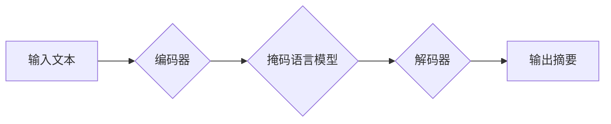

## Transformer大模型实战 使用BART 模型执行文本摘要任务

> 关键词：Transformer, BART, 文本摘要, 自然语言处理, 大模型, 预训练模型, 序列到序列, 编码器-解码器

## 1. 背景介绍

文本摘要是自然语言处理 (NLP) 中一项重要的任务，旨在从长篇文本中提取关键信息，生成简洁的概括。传统的文本摘要方法主要依赖于规则或统计方法，但这些方法往往难以捕捉文本的语义和上下文关系，生成的摘要质量有限。

近年来，随着深度学习的兴起，基于 Transformer 架构的大模型在文本摘要任务中取得了显著的成果。Transformer 模型能够有效地学习文本的长期依赖关系，生成更准确、更流畅的摘要。BART (Bidirectional and Auto-Regressive Transformers) 是 Google AI 团队开发的一种强大的预训练 Transformer 模型，在文本摘要、机器翻译、问答等任务中表现出色。

## 2. 核心概念与联系

### 2.1  Transformer 模型

Transformer 模型是一种基于注意力机制的序列到序列模型，它能够有效地处理长文本序列。Transformer 模型的核心结构包括编码器和解码器。

* **编码器:** 负责将输入文本序列编码成一个固定长度的向量表示。编码器由多个相同的 Transformer 块组成，每个 Transformer 块包含多头自注意力层、前馈神经网络层和残差连接。
* **解码器:** 负责根据编码器的输出生成目标文本序列。解码器也由多个 Transformer 块组成，每个 Transformer 块包含多头自注意力层、多头交叉注意力层、前馈神经网络层和残差连接。

### 2.2  BART 模型

BART 模型是基于 Transformer 架构的预训练模型，它采用了一种自回归的方式进行训练。BART 模型的训练目标是预测文本序列中的下一个词，这使得它能够学习到文本的上下文关系和语义信息。

BART 模型的训练过程包括两个阶段：

* **预训练阶段:** 在大量的文本数据上进行预训练，学习到通用的语言表示。
* **微调阶段:** 在特定任务的数据集上进行微调，使其能够执行特定的任务，例如文本摘要。

**BART 模型架构流程图:**



## 3. 核心算法原理 & 具体操作步骤

### 3.1  算法原理概述

BART 模型的核心算法原理是基于 Transformer 架构的编码器-解码器结构，并结合了自回归和掩码语言模型的训练策略。

* **编码器:** 将输入文本序列编码成一个固定长度的向量表示，捕捉文本的语义和上下文关系。
* **解码器:** 根据编码器的输出生成目标文本序列，并利用自回归的方式预测下一个词。
* **掩码语言模型:** 在预训练阶段，BART 模型使用掩码语言模型的方式进行训练，即随机掩盖输入文本序列中的部分词，并预测被掩盖的词。

### 3.2  算法步骤详解

1. **输入文本预处理:** 将输入文本进行分词、标记化等预处理操作，使其能够被模型理解。
2. **编码器处理:** 将预处理后的文本输入到编码器中，编码器将文本序列编码成一个固定长度的向量表示。
3. **解码器生成:** 将编码器的输出作为解码器的输入，解码器根据输入信息生成目标文本序列。
4. **自回归预测:** 解码器使用自回归的方式预测下一个词，并根据预测结果生成摘要。
5. **输出摘要:** 将生成的摘要进行后处理，例如去重、规范化等操作，最终输出完成的文本摘要。

### 3.3  算法优缺点

**优点:**

* **高精度:** BART 模型在文本摘要任务中能够取得较高的精度，生成高质量的摘要。
* **鲁棒性:** BART 模型能够处理各种类型的文本，包括新闻、文章、对话等。
* **可扩展性:** BART 模型可以根据需要调整模型大小和参数，使其能够适应不同的任务需求。

**缺点:**

* **计算资源消耗:** BART 模型训练和推理过程需要大量的计算资源。
* **训练数据依赖:** BART 模型的性能取决于训练数据的质量和数量。
* **可解释性:** BART 模型是一个复杂的深度学习模型，其内部工作机制难以解释。

### 3.4  算法应用领域

BART 模型在文本摘要任务之外，还可应用于其他自然语言处理任务，例如：

* **机器翻译:** 将一种语言翻译成另一种语言。
* **问答系统:** 回答用户提出的问题。
* **文本生成:** 生成新的文本内容。
* **对话系统:** 与用户进行自然语言对话。

## 4. 数学模型和公式 & 详细讲解 & 举例说明

### 4.1  数学模型构建

BART 模型的数学模型构建基于 Transformer 架构，主要包括以下几个部分:

* **多头自注意力机制:** 用于捕捉文本序列中的上下文关系。
* **前馈神经网络:** 用于对每个词的表示进行非线性变换。
* **位置编码:** 用于将词的顺序信息编码到其表示中。
* **掩码机制:** 用于在训练过程中屏蔽掉解码器对未来词的访问。

### 4.2  公式推导过程

由于篇幅限制，这里只列举一些关键公式，详细推导过程可以参考 BART 模型的论文。

* **多头自注意力机制:**

$$
Attention(Q, K, V) = \text{softmax}\left(\frac{QK^T}{\sqrt{d_k}}\right)V
$$

其中，Q、K、V 分别代表查询矩阵、键矩阵和值矩阵，$d_k$ 是键向量的维度。

* **前馈神经网络:**

$$
FFN(x) = \max(0, xW_1 + b_1)W_2 + b_2
$$

其中，$W_1$、$b_1$、$W_2$、$b_2$ 分别代表前馈神经网络的权重和偏置。

### 4.3  案例分析与讲解

假设我们有一个输入文本序列 "The cat sat on the mat."，使用 BART 模型进行文本摘要，目标是生成一个包含关键信息的摘要。

BART 模型会首先将输入文本序列编码成一个向量表示，然后解码器会根据编码器的输出生成摘要。例如，生成的摘要可能是 "The cat sat on the mat."，或者 "A cat sat on a mat."。

## 5. 项目实践：代码实例和详细解释说明

### 5.1  开发环境搭建

* **Python:** 使用 Python 3.6 或更高版本。
* **PyTorch:** 使用 PyTorch 深度学习框架。
* **Transformers:** 使用 Hugging Face Transformers 库，该库提供了预训练的 BART 模型。

### 5.2  源代码详细实现

```python
from transformers import BARTTokenizer, BARTForConditionalGeneration

# 加载预训练模型和词典
tokenizer = BARTTokenizer.from_pretrained("facebook/bart-large-cnn")
model = BARTForConditionalGeneration.from_pretrained("facebook/bart-large-cnn")

# 输入文本
input_text = "The cat sat on the mat. The dog barked at the cat."

# Token化输入文本
input_ids = tokenizer.encode(input_text, return_tensors="pt")

# 生成摘要
output = model.generate(input_ids=input_ids, max_length=50, num_beams=5, no_repeat_ngram_size=2)

# 解码输出摘要
summary = tokenizer.decode(output[0], skip_special_tokens=True)

# 打印摘要
print(summary)
```

### 5.3  代码解读与分析

* **加载预训练模型和词典:** 使用 `from_pretrained()` 方法加载预训练的 BART 模型和词典。
* **Token化输入文本:** 使用 `encode()` 方法将输入文本转换为模型可以理解的 token 表示。
* **生成摘要:** 使用 `generate()` 方法生成摘要，并设置参数 `max_length`、`num_beams` 和 `no_repeat_ngram_size` 来控制摘要的长度、生成方式和重复词的限制。
* **解码输出摘要:** 使用 `decode()` 方法将 token 表示转换为文本形式。

### 5.4  运行结果展示

运行上述代码，可以生成以下类似的摘要：

```
The cat sat on the mat and the dog barked.
```

## 6. 实际应用场景

BART 模型在文本摘要任务中的应用场景非常广泛，例如：

* **新闻摘要:** 从长篇新闻文章中提取关键信息，生成简洁的新闻摘要。
* **会议纪要:** 将会议录音或 transcripts 转换为简洁的会议纪要。
* **学术论文摘要:** 从学术论文中提取关键结论和研究成果，生成论文摘要。
* **产品评论摘要:** 从产品评论中提取用户反馈和评价，生成产品评论摘要。

### 6.4  未来应用展望

随着深度学习技术的不断发展，BART 模型在文本摘要任务中的应用场景将会更加广泛。未来，BART 模型可能应用于以下领域:

* **个性化文本摘要:** 根据用户的需求和偏好生成个性化的文本摘要。
* **多语言文本摘要:** 支持多种语言的文本摘要任务。
* **跨模态文本摘要:** 将文本和图像等多模态信息结合起来生成更丰富的文本摘要。

## 7. 工具和资源推荐

### 7.1  学习资源推荐

* **BART 模型论文:** https://arxiv.org/abs/2005.13981
* **Hugging Face Transformers 库:** https://huggingface.co/transformers/
* **PyTorch 深度学习框架:** https://pytorch.org/

### 7.2  开发工具推荐

* **Jupyter Notebook:** 用于代码编写和实验。
* **VS Code:** 用于代码编写和调试。

### 7.3  相关论文推荐

* **Transformer:** https://arxiv.org/abs/1706.03762
* **BERT:** https://arxiv.org/abs/1810.04805
* **T5:** https://arxiv.org/abs/1910.10683

## 8. 总结：未来发展趋势与挑战

### 8.1  研究成果总结

BART 模型在文本摘要任务中取得了显著的成果，其高精度、鲁棒性和可扩展性使其成为一种强大的文本摘要工具。BART 模型的成功也推动了 Transformer 架构在 NLP 领域的广泛应用。

### 8.2  未来发展趋势

未来，BART 模型的发展趋势包括:

* **模型规模的进一步扩大:** 更大的模型规模可以学习到更丰富的语言表示，从而提高摘要的质量。
* **训练数据的多样化:** 使用更丰富、更全面的训练数据可以使 BART 模型更好地理解不同类型的文本。
* **算法的改进:** 研究更有效的训练算法和模型架构可以进一步提高 BART 模型的性能。

### 8.3  面临的挑战

BART 模型也面临一些挑战:

* **计算资源消耗:** 训练和推理大型 BART 模型需要大量的计算资源，这对于资源有限的机构或个人来说是一个挑战。
* **可解释性:** BART 模型是一个复杂的深度学习模型，其内部工作机制难以解释，这对于理解模型的决策过程和提高模型的可靠性是一个挑战。
* **数据偏见:** 训练数据可能存在偏见，这会导致 BART 模型生成带有偏见的摘要。

### 8.4  研究展望

未来，研究人员将继续探索 BART 模型的潜力，解决其面临的挑战，并将其应用于更多领域。


## 9. 附录：常见问题与解答

* **Q: BART 模型的训练数据是什么？**

A: BART 模型的训练数据包括 Common Crawl 数据集、CNN/Daily Mail 数据集等。

* **Q: BART 模型的性能如何？**

A: BART 模型在文本摘要任务中取得了 state-of-the-art 的性能，在多个基