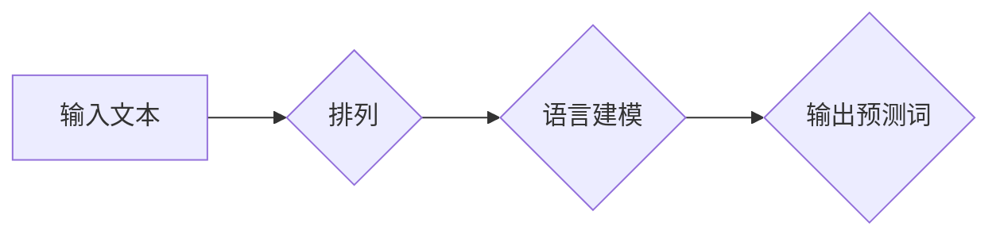

## XLNet原理与代码实例讲解

> 关键词：XLNet, Transformer, Autoregressive, Permutation Language Modeling, Generalized Autoregressive Pretraining, NLP, 自然语言处理

## 1. 背景介绍

自然语言处理 (NLP) 领域近年来取得了飞速发展，深度学习模型在文本理解和生成任务上取得了显著成果。其中，Transformer 架构凭借其强大的并行能力和长距离依赖建模能力，成为 NLP 领域的主流模型。BERT、GPT 等基于 Transformer 的模型取得了突破性的进展，但它们都存在一些局限性。例如，BERT 采用 masked language modeling (MLM) 和 next sentence prediction (NSP) 两种预训练任务，而 GPT 采用 autoregressive (AR) 语言建模，这两种方法都无法充分利用文本中的全局信息。

XLNet 作为一种新型的 Transformer 模型，旨在解决上述问题。它引入了 Generalized Autoregressive Pretraining (GAP) 方法，通过排列语言建模 (Permutation Language Modeling) 训练模型，能够更好地捕捉文本中的全局信息和上下文依赖关系。

## 2. 核心概念与联系

XLNet 的核心思想是利用排列语言建模 (Permutation Language Modeling) 来训练模型。传统的 autoregressive 模型只能预测下一个词，而 XLNet 可以预测任意位置的词，从而能够更好地理解文本的全局结构。

**Mermaid 流程图:**



**核心概念:**

* **排列语言建模 (Permutation Language Modeling):** XLNet 将文本中的词语随机排列，然后训练模型预测原始的词序。这种方法能够让模型学习到文本的全局结构和上下文依赖关系。
* **Generalized Autoregressive Pretraining (GAP):** XLNet 将排列语言建模与 autoregressive 语言建模相结合，通过两种不同的预训练任务来训练模型。

## 3. 核心算法原理 & 具体操作步骤

### 3.1  算法原理概述

XLNet 的核心算法是基于 Transformer 架构的，它利用了注意力机制来捕捉文本中的长距离依赖关系。XLNet 的主要创新点在于它引入了排列语言建模 (Permutation Language Modeling) 和 Generalized Autoregressive Pretraining (GAP) 方法。

排列语言建模 (Permutation Language Modeling) 的核心思想是将文本中的词语随机排列，然后训练模型预测原始的词序。这种方法能够让模型学习到文本的全局结构和上下文依赖关系。

Generalized Autoregressive Pretraining (GAP) 方法将排列语言建模与 autoregressive 语言建模相结合，通过两种不同的预训练任务来训练模型。

### 3.2  算法步骤详解

1. **数据预处理:** 将文本数据进行分词、标记等预处理操作。
2. **排列语言建模 (Permutation Language Modeling):**
    * 将文本中的词语随机排列成一个新的序列。
    * 使用 Transformer 模型预测原始的词序。
3. **autoregressive 语言建模:**
    * 使用 Transformer 模型预测下一个词。
4. **模型训练:** 使用交叉熵损失函数训练模型，并使用 Adam 优化器进行优化。
5. **模型评估:** 使用测试集评估模型的性能，并使用指标如 perplexity 来衡量模型的性能。

### 3.3  算法优缺点

**优点:**

* 能够更好地捕捉文本中的全局信息和上下文依赖关系。
* 在多种 NLP 任务上取得了优异的性能。

**缺点:**

* 训练时间较长。
* 计算资源需求较高。

### 3.4  算法应用领域

XLNet 在多种 NLP 任务上取得了优异的性能，例如：

* 文本分类
* 问答系统
* 机器翻译
* 文本摘要
* 情感分析

## 4. 数学模型和公式 & 详细讲解 & 举例说明

### 4.1  数学模型构建

XLNet 的数学模型构建基于 Transformer 架构，它使用多层 Transformer 块来处理文本序列。每个 Transformer 块包含一个多头注意力层和一个前馈神经网络层。

### 4.2  公式推导过程

XLNet 的核心公式是排列语言建模的损失函数。该损失函数计算模型预测的词序与真实词序之间的差异。

$$
L = -\sum_{i=1}^{N} \log p(w_i | w_{<i})
$$

其中：

* $L$ 是损失函数
* $N$ 是文本序列的长度
* $w_i$ 是文本序列中的第 $i$ 个词
* $p(w_i | w_{<i})$ 是模型预测第 $i$ 个词的概率，给定前面所有词 $w_{<i}$

### 4.3  案例分析与讲解

假设我们有一个文本序列 "The cat sat on the mat"，我们使用 XLNet 模型进行排列语言建模训练。

1. 将文本序列中的词语随机排列成一个新的序列，例如 "mat the cat on sat the"。
2. 使用 XLNet 模型预测原始的词序 "The cat sat on the mat"。
3. 计算模型预测的词序与真实词序之间的差异，并使用交叉熵损失函数进行优化。

通过重复上述步骤，XLNet 模型能够学习到文本的全局结构和上下文依赖关系。

## 5. 项目实践：代码实例和详细解释说明

### 5.1  开发环境搭建

* Python 3.6+
* TensorFlow 2.0+
* PyTorch 1.0+
* CUDA 10.0+ (可选)

### 5.2  源代码详细实现

XLNet 的源代码可以从 HuggingFace 库中获取：

```python
from transformers import XLNetTokenizer, XLNetForSequenceClassification

# 加载预训练模型和词典
tokenizer = XLNetTokenizer.from_pretrained('xlnet-base-cased')
model = XLNetForSequenceClassification.from_pretrained('xlnet-base-cased')

# 文本预处理
text = "This is a sample text."
inputs = tokenizer(text, return_tensors="pt")

# 模型预测
outputs = model(**inputs)
```

### 5.3  代码解读与分析

* `XLNetTokenizer` 用于将文本转换为模型可以理解的格式。
* `XLNetForSequenceClassification` 是 XLNet 模型的预训练版本，用于文本分类任务。
* `inputs` 包含文本的 token 化表示和其他必要的输入信息。
* `outputs` 包含模型预测的分类结果。

### 5.4  运行结果展示

运行上述代码后，模型将输出文本的分类结果。

## 6. 实际应用场景

XLNet 在多种实际应用场景中取得了成功，例如：

* **搜索引擎:** XLNet 可以用于改进搜索引擎的排名算法，提高搜索结果的准确性和相关性。
* **聊天机器人:** XLNet 可以用于训练更智能的聊天机器人，使其能够更好地理解用户意图并提供更自然流畅的对话体验。
* **机器翻译:** XLNet 可以用于提高机器翻译的准确性和流畅度。

### 6.4  未来应用展望

XLNet 的未来应用前景广阔，它可以应用于更多 NLP 任务，例如：

* 文本生成
* 代码生成
* 摘要生成
* 问答系统

## 7. 工具和资源推荐

### 7.1  学习资源推荐

* **论文:** https://arxiv.org/abs/1906.08237
* **博客:** https://huggingface.co/blog/xlnet
* **GitHub:** https://github.com/zihangdai/xlnet

### 7.2  开发工具推荐

* **HuggingFace Transformers:** https://huggingface.co/docs/transformers/index
* **TensorFlow:** https://www.tensorflow.org/
* **PyTorch:** https://pytorch.org/

### 7.3  相关论文推荐

* BERT: https://arxiv.org/abs/1810.04805
* GPT: https://openai.com/blog/language-unsupervised/
* RoBERTa: https://arxiv.org/abs/1907.11692

## 8. 总结：未来发展趋势与挑战

### 8.1  研究成果总结

XLNet 作为一种新型的 Transformer 模型，在 NLP 领域取得了显著成果，它能够更好地捕捉文本中的全局信息和上下文依赖关系，在多种 NLP 任务上取得了优异的性能。

### 8.2  未来发展趋势

XLNet 的未来发展趋势包括：

* **模型规模的扩大:** 随着计算资源的不断提升，XLNet 模型的规模将会进一步扩大，从而提高模型的性能。
* **新的预训练任务:** 研究人员将会探索新的预训练任务，以进一步提升 XLNet 的性能。
* **模型的应用扩展:** XLNet 将会被应用于更多 NLP 任务，例如文本生成、代码生成等。

### 8.3  面临的挑战

XLNet 仍然面临一些挑战，例如：

* **训练时间长:** XLNet 的训练时间较长，需要大量的计算资源。
* **参数量大:** XLNet 的参数量较大，需要大量的存储空间。
* **可解释性低:** XLNet 的模型结构复杂，其决策过程难以解释。

### 8.4  研究展望

未来研究将集中在解决 XLNet 的挑战，例如：

* **提高训练效率:** 研究更有效的训练方法，例如模型压缩、知识蒸馏等。
* **降低模型复杂度:** 研究更简洁的模型结构，提高模型的可解释性。
* **探索新的应用场景:** 将 XLNet 应用于更多 NLP 任务，例如多语言处理、跨模态理解等。

## 9. 附录：常见问题与解答

**Q1: XLNet 和 BERT 的区别是什么？**

**A1:** XLNet 和 BERT 都是基于 Transformer 架构的 NLP 模型，但它们在预训练任务和模型结构上有所不同。BERT 采用 masked language modeling (MLM) 和 next sentence prediction (NSP) 两种预训练任务，而 XLNet 采用排列语言建模 (Permutation Language Modeling) 和 autoregressive 语言建模两种预训练任务。

**Q2: XLNet 的训练时间长吗？**

**A2:** XLNet 的训练时间较长，需要大量的计算资源。

**Q3: XLNet 的参数量大吗？**

**A3:** XLNet 的参数量较大，需要大量的存储空间。


作者：禅与计算机程序设计艺术 / Zen and the Art of Computer Programming 
