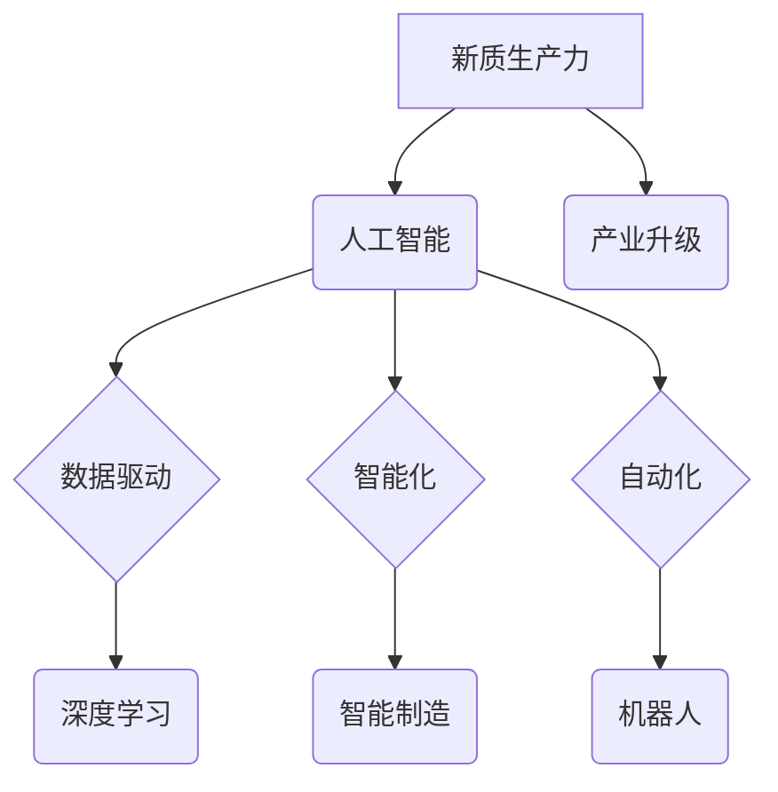

## 产业升级的新质生产力推动力

> 关键词：人工智能、新质生产力、产业升级、深度学习、数据驱动、自动化、智能化、机器学习

### 1. 背景介绍

当前，全球经济正处于深刻变革时期，传统产业面临着数字化、智能化转型升级的压力。第四次工业革命的浪潮席卷而来，人工智能（AI）作为其核心驱动力，正在深刻地改变着生产方式、生活方式和社会结构。

新质生产力是指以数据为基础、以智能技术为驱动的生产力，其核心特征是效率提升、成本降低、产品质量提升和创新能力增强。人工智能技术的快速发展为新质生产力的构建提供了强大的技术支撑。

### 2. 核心概念与联系

**2.1 新质生产力**

新质生产力是基于数据驱动、智能化、自动化等新技术，实现生产要素更加高效、智能、灵活配置，从而提升生产效率、降低生产成本、提高产品质量和创新能力的新型生产力。

**2.2 人工智能**

人工智能是指模拟人类智能行为的计算机系统，包括学习、推理、决策、感知、语言理解等能力。深度学习作为人工智能的重要分支，通过构建多层神经网络，能够从海量数据中学习复杂的模式和关系，从而实现更精准、更智能的决策和预测。

**2.3 产业升级**

产业升级是指通过技术创新、结构调整、要素优化等方式，提升产业的附加值、核心竞争力和发展水平的过程。

**2.4 核心概念关系图**



### 3. 核心算法原理 & 具体操作步骤

**3.1 算法原理概述**

深度学习算法的核心原理是构建多层神经网络，通过层层叠加的非线性变换，学习数据中的复杂特征和模式。

**3.2 算法步骤详解**

1. **数据预处理:** 将原始数据进行清洗、转换、特征工程等处理，使其适合深度学习模型的训练。
2. **模型构建:** 根据具体任务选择合适的深度学习模型架构，例如卷积神经网络（CNN）、循环神经网络（RNN）等。
3. **模型训练:** 使用训练数据训练深度学习模型，通过调整模型参数，使模型能够准确地预测或分类数据。
4. **模型评估:** 使用测试数据评估模型的性能，例如准确率、召回率、F1-score等指标。
5. **模型调优:** 根据评估结果，调整模型参数、网络结构等，进一步提升模型性能。
6. **模型部署:** 将训练好的模型部署到实际应用场景中，用于预测、分类、识别等任务。

**3.3 算法优缺点**

**优点:**

* 能够学习复杂数据中的非线性特征。
* 具有强大的泛化能力，能够应用于多种不同的任务。
* 随着数据量的增加，模型性能不断提升。

**缺点:**

* 需要大量的训练数据。
* 训练过程耗时且计算资源消耗大。
* 模型解释性较差，难以理解模型的决策过程。

**3.4 算法应用领域**

深度学习算法广泛应用于图像识别、自然语言处理、语音识别、机器翻译、推荐系统、医疗诊断等领域。

### 4. 数学模型和公式 & 详细讲解 & 举例说明

**4.1 数学模型构建**

深度学习模型可以看作是一个复杂的函数映射，将输入数据映射到输出结果。

**4.2 公式推导过程**

深度学习模型的训练过程本质上是一个优化问题，目标是找到最优的模型参数，使得模型的预测结果与真实结果之间的误差最小。常用的优化算法包括梯度下降法、动量法、Adam算法等。

**4.3 案例分析与讲解**

**举例说明：**

假设我们有一个图像分类任务，目标是将图像分类为猫或狗。我们可以使用卷积神经网络（CNN）作为深度学习模型。

CNN模型的结构包括多个卷积层、池化层和全连接层。卷积层用于提取图像特征，池化层用于降低特征维度，全连接层用于分类。

模型的训练过程是通过反向传播算法来更新模型参数的。反向传播算法计算模型预测结果与真实结果之间的误差，然后根据误差反向传播，更新每个神经元的权重和偏置。

**4.4 数学公式**

* **损失函数:**

$$L(w,b) = \frac{1}{N} \sum_{i=1}^{N} \mathcal{L}(y_i, \hat{y}_i)$$

其中：

* $L(w,b)$ 是损失函数，$w$ 和 $b$ 是模型参数。
* $N$ 是样本数量。
* $\mathcal{L}(y_i, \hat{y}_i)$ 是单个样本的损失函数，$y_i$ 是真实标签，$\hat{y}_i$ 是模型预测标签。

* **梯度下降算法:**

$$w = w - \eta \frac{\partial L(w,b)}{\partial w}$$

$$b = b - \eta \frac{\partial L(w,b)}{\partial b}$$

其中：

* $\eta$ 是学习率。
* $\frac{\partial L(w,b)}{\partial w}$ 和 $\frac{\partial L(w,b)}{\partial b}$ 是损失函数对模型参数的梯度。

### 5. 项目实践：代码实例和详细解释说明

**5.1 开发环境搭建**

* 操作系统：Ubuntu 20.04
* Python 版本：3.8
* 深度学习框架：TensorFlow 2.0

**5.2 源代码详细实现**

```python
import tensorflow as tf

# 定义模型结构
model = tf.keras.models.Sequential([
    tf.keras.layers.Conv2D(32, (3, 3), activation='relu', input_shape=(28, 28, 1)),
    tf.keras.layers.MaxPooling2D((2, 2)),
    tf.keras.layers.Conv2D(64, (3, 3), activation='relu'),
    tf.keras.layers.MaxPooling2D((2, 2)),
    tf.keras.layers.Flatten(),
    tf.keras.layers.Dense(10, activation='softmax')
])

# 编译模型
model.compile(optimizer='adam',
              loss='sparse_categorical_crossentropy',
              metrics=['accuracy'])

# 加载数据集
(x_train, y_train), (x_test, y_test) = tf.keras.datasets.mnist.load_data()

# 数据预处理
x_train = x_train.astype('float32') / 255.0
x_test = x_test.astype('float32') / 255.0
x_train = x_train.reshape((x_train.shape[0], 28, 28, 1))
x_test = x_test.reshape((x_test.shape[0], 28, 28, 1))

# 训练模型
model.fit(x_train, y_train, epochs=5)

# 评估模型
loss, accuracy = model.evaluate(x_test, y_test)
print('Test loss:', loss)
print('Test accuracy:', accuracy)
```

**5.3 代码解读与分析**

这段代码实现了使用 TensorFlow 框架训练一个简单的 MNIST 手写数字识别模型。

* 首先定义了模型结构，包括卷积层、池化层和全连接层。
* 然后编译模型，指定优化器、损失函数和评价指标。
* 加载 MNIST 数据集，并进行数据预处理，将数据转换为适合模型输入的格式。
* 训练模型，指定训练轮数。
* 最后评估模型，计算测试集上的损失和准确率。

**5.4 运行结果展示**

运行这段代码后，会输出模型在测试集上的损失和准确率。

### 6. 实际应用场景

**6.1 智能制造**

人工智能可以应用于智能制造领域，例如：

* **预测性维护:** 通过分析设备运行数据，预测设备故障，提前进行维护，降低设备停机时间。
* **质量控制:** 使用计算机视觉技术，对生产过程中的产品进行实时质量检测，提高产品质量。
* **柔性生产:** 使用机器人和人工智能，实现生产线的灵活配置，适应不同产品的生产需求。

**6.2 自动驾驶**

人工智能是自动驾驶的核心技术，例如：

* **环境感知:** 使用传感器数据，感知周围环境，识别道路、车辆、行人等。
* **路径规划:** 根据环境感知信息，规划行驶路径，避开障碍物。
* **决策控制:** 根据路径规划信息，控制车辆的加速、减速、转向等动作。

**6.3 金融科技**

人工智能可以应用于金融科技领域，例如：

* **风险管理:** 分析客户数据，识别潜在的风险，降低金融机构的风险敞口。
* **欺诈检测:** 使用机器学习算法，识别欺诈交易，保护客户资金安全。
* **个性化服务:** 根据客户的投资偏好和风险承受能力，提供个性化的投资建议。

**6.4 未来应用展望**

随着人工智能技术的不断发展，其应用场景将更加广泛，例如：

* **医疗诊断:** 使用人工智能辅助医生进行疾病诊断，提高诊断准确率。
* **教育个性化:** 使用人工智能为学生提供个性化的学习方案，提高学习效率。
* **城市智能化:** 使用人工智能管理城市资源，提高城市效率和居民生活质量。

### 7. 工具和资源推荐

**7.1 学习资源推荐**

* **在线课程:** Coursera、edX、Udacity 等平台提供丰富的深度学习课程。
* **书籍:** 《深度学习》、《机器学习实战》等书籍是深度学习学习的经典教材。
* **博客和论坛:** TensorFlow、PyTorch 等深度学习框架的官方博客和论坛提供大量学习资源和技术支持。

**7.2 开发工具推荐**

* **TensorFlow:** Google 开发的开源深度学习框架，功能强大，应用广泛。
* **PyTorch:** Facebook 开发的开源深度学习框架，灵活易用，适合研究和开发。
* **Keras:** TensorFlow 的高层API，简化了深度学习模型的构建和训练。

**7.3 相关论文推荐**

* **《ImageNet Classification with Deep Convolutional Neural Networks》**
* **《Attention Is All You Need》**
* **《Generative Adversarial Networks》**

### 8. 总结：未来发展趋势与挑战

**8.1 研究成果总结**

近年来，人工智能领域取得了显著的进展，深度学习算法在图像识别、自然语言处理等领域取得了突破性成果。

**8.2 未来发展趋势**

* **模型规模和能力的提升:** 未来深度学习模型将更加庞大，能够处理更加复杂的数据，实现更加精细的智能化。
* **算法效率的提高:** 研究人员将继续探索更加高效的深度学习算法，降低模型训练和推理的成本。
* **模型解释性和可信度的提升:** 研究人员将致力于提高深度学习模型的解释性和可信度，使其能够更好地被人类理解和信任。
* **跨模态学习:** 未来深度学习模型将能够处理多种模态数据，例如文本、图像、音频等，实现更加全面的智能化。

**8.3 面临的挑战**

* **数据获取和隐私保护:** 深度学习算法依赖于海量数据，如何获取高质量数据并保护用户隐私是一个重要的挑战。
* **模型可解释性和公平性:** 深度学习模型的决策过程往往难以理解，如何保证模型的公平性和可解释性是一个重要的伦理问题。
* **模型安全性和鲁棒性:** 深度学习模型容易受到攻击，如何提高模型的安全性和鲁棒性是一个重要的技术挑战。

**8.4