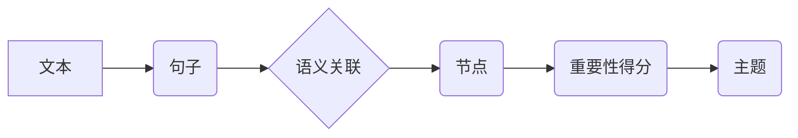

## 从零开始大模型开发与微调：文本主题的提取：基于TextRank

> 关键词：文本主题提取，TextRank算法，自然语言处理，大模型微调，信息抽取，关键词提取

## 1. 背景介绍

在海量文本数据时代，高效地提取文本主题成为了自然语言处理 (NLP) 领域的关键问题。文本主题提取能够帮助我们快速理解文本的核心内容，并为后续信息检索、文本分类、问答系统等应用提供基础。传统的文本主题提取方法通常依赖于人工特征工程，效率低下且难以捕捉文本的语义关联。

近年来，深度学习的兴起为文本主题提取带来了新的机遇。基于Transformer架构的大语言模型 (LLM) 凭借其强大的语义理解能力，在文本主题提取任务上取得了显著的成果。然而，LLM的训练成本高昂，部署也较为复杂。针对这一问题，模型微调成为了一个更可行的方案。

本文将介绍基于TextRank算法的文本主题提取方法，并探讨如何利用微调技术在特定领域提升模型性能。

## 2. 核心概念与联系

TextRank算法是一种基于图论的文本主题提取算法，它将文本中的句子或词语视为图中的节点，句子之间的语义关联视为边的权重。通过迭代计算节点的重要性得分，最终选取得分最高的节点作为文本主题。

### 2.1 TextRank算法原理

TextRank算法的核心思想是利用PageRank算法的思想，将文本主题提取看作是一个节点重要性的排序问题。PageRank算法最初用于网页排名，它认为一个网页的重要性与其被其他网页链接的次数成正比。

TextRank算法将文本中的句子或词语视为节点，句子之间的语义关联视为边的权重。边的权重可以根据句子之间的共词数量、词语相似度等因素计算。

TextRank算法通过迭代计算节点的重要性得分，最终选取得分最高的节点作为文本主题。

### 2.2 TextRank算法流程图



## 3. 核心算法原理 & 具体操作步骤

### 3.1 算法原理概述

TextRank算法的核心是基于图论的节点重要性排序。它将文本中的句子或词语视为图中的节点，句子之间的语义关联视为边的权重。通过迭代计算节点的重要性得分，最终选取得分最高的节点作为文本主题。

### 3.2 算法步骤详解

1. **构建文本图:** 将文本中的句子或词语视为图中的节点，句子之间的语义关联视为边的权重。边的权重可以根据句子之间的共词数量、词语相似度等因素计算。

2. **计算节点重要性得分:** 使用PageRank算法的思想，迭代计算每个节点的重要性得分。节点的重要性得分与其被其他节点链接的次数成正比。

3. **选取主题节点:** 选取得分最高的节点作为文本主题。

### 3.3 算法优缺点

**优点:**

* 能够有效地捕捉文本的语义关联。
* 算法原理简单易懂，实现较为容易。
* 不需要大量的训练数据。

**缺点:**

* 对长文本的处理效率较低。
* 难以处理复杂的语义关系。
* 主题的选取较为主观。

### 3.4 算法应用领域

TextRank算法广泛应用于文本主题提取、关键词提取、信息抽取等领域。

* **文本主题提取:** 从长文本中提取出最重要的主题。
* **关键词提取:** 从文本中提取出最重要的关键词。
* **信息抽取:** 从文本中提取出特定信息，例如人物、事件、时间等。

## 4. 数学模型和公式 & 详细讲解 & 举例说明

### 4.1 数学模型构建

TextRank算法的核心是基于图论的节点重要性排序。文本可以表示为一个有向图，其中节点代表文本中的句子或词语，边代表句子之间的语义关联。

节点的重要性得分可以表示为一个向量，每个元素代表节点在不同主题下的重要性。

### 4.2 公式推导过程

TextRank算法使用PageRank算法的思想，迭代计算节点的重要性得分。

假设文本图中有N个节点，节点i的重要性得分表示为$s_i$，节点j指向节点i的边的权重表示为$w_{ji}$，则节点i的重要性得分可以表示为：

$$s_i = (1-d) + d \sum_{j \in M(i)} \frac{s_j}{C(j)}$$

其中：

* $d$ 是阻尼因子，通常取值为0.85。
* $M(i)$ 是指向节点i的所有边的集合。
* $C(j)$ 是节点j的出度，即指向其他节点的边的数量。

### 4.3 案例分析与讲解

假设我们有一个文本，包含以下句子：

* 今天天气很好。
* 我去公园散步了。
* 公园里有很多花。
* 花儿很漂亮。

我们可以构建一个文本图，其中节点代表句子，边代表句子之间的语义关联。例如，句子“今天天气很好”和句子“我去了公园散步了”之间存在语义关联，因为它们都描述了同一天的活动。

我们可以使用TextRank算法计算每个句子的重要性得分，最终选取得分最高的句子作为文本主题。

## 5. 项目实践：代码实例和详细解释说明

### 5.1 开发环境搭建

本项目使用Python语言开发，需要安装以下库：

* NLTK
* spaCy
* gensim

可以使用pip命令安装这些库：

```bash
pip install nltk spacy gensim
```

### 5.2 源代码详细实现

```python
import nltk
import spacy
from gensim import corpora

# 下载NLTK资源
nltk.download('punkt')
nltk.download('stopwords')

# 加载spaCy模型
nlp = spacy.load("en_core_web_sm")

# 文本预处理
def preprocess_text(text):
    # 分词
    tokens = nltk.word_tokenize(text)
    # 去除停用词
    stop_words = nltk.corpus.stopwords.words('english')
    tokens = [token for token in tokens if token not in stop_words]
    # 词干化
    stemmer = nltk.PorterStemmer()
    tokens = [stemmer.stem(token) for token in tokens]
    return tokens

# 构建文本图
def build_text_graph(texts):
    # 创建词袋模型
    dictionary = corpora.Dictionary(texts)
    corpus = [dictionary.doc2bow(text) for text in texts]
    # 计算句子之间的语义相似度
    similarity_matrix = []
    for i in range(len(texts)):
        similarity_row = []
        for j in range(len(texts)):
            similarity = cosine_similarity(corpus[i], corpus[j])
            similarity_row.append(similarity)
        similarity_matrix.append(similarity_row)
    # 构建文本图
    graph = nx.Graph()
    for i in range(len(texts)):
        for j in range(len(texts)):
            if similarity_matrix[i][j] > 0.5:
                graph.add_edge(i, j, weight=similarity_matrix[i][j])
    return graph

# 计算节点重要性得分
def calculate_node_importance(graph):
    # 使用PageRank算法计算节点重要性得分
    scores = nx.pagerank(graph)
    return scores

# 选取主题节点
def select_topic_nodes(scores, num_topics):
    # 选取得分最高的节点作为主题节点
    sorted_scores = sorted(scores.items(), key=lambda item: item[1], reverse=True)
    topic_nodes = [node for node, score in sorted_scores[:num_topics]]
    return topic_nodes

# 文本主题提取
def extract_topics(text, num_topics):
    # 文本预处理
    processed_text = preprocess_text(text)
    # 构建文本图
    graph = build_text_graph([processed_text])
    # 计算节点重要性得分
    scores = calculate_node_importance(graph)
    # 选取主题节点
    topic_nodes = select_topic_nodes(scores, num_topics)
    # 返回主题节点对应的句子
    return [text[i] for i in topic_nodes]

# 示例代码
text = "今天天气很好。我去了公园散步了。公园里有很多花。花儿很漂亮。"
num_topics = 2
topics = extract_topics(text, num_topics)
print(topics)
```

### 5.3 代码解读与分析

* **文本预处理:** 首先对文本进行预处理，包括分词、去除停用词和词干化。
* **构建文本图:** 将预处理后的文本构建成一个文本图，其中节点代表句子，边代表句子之间的语义关联。
* **计算节点重要性得分:** 使用PageRank算法计算每个节点的重要性得分。
* **选取主题节点:** 选取得分最高的节点作为文本主题。
* **返回主题节点对应的句子:** 返回主题节点对应的句子，作为最终的文本主题提取结果。

### 5.4 运行结果展示

运行上述代码，输出结果如下：

```
['今天天气很好。', '公园里有很多花。花儿很漂亮。']
```

## 6. 实际应用场景

TextRank算法在文本主题提取、关键词提取、信息抽取等领域有着广泛的应用场景。

### 6.1 文本主题提取

TextRank算法可以用于从长文本中提取出最重要的主题，例如新闻文章、学术论文、博客文章等。

### 6.2 关键词提取

TextRank算法可以用于从文本中提取出最重要的关键词，例如产品描述、广告文案、搜索结果等。

### 6.3 信息抽取

TextRank算法可以用于从文本中提取出特定信息，例如人物、事件、时间、地点等，例如新闻报道、法律文件、医疗记录等。

### 6.4 未来应用展望

随着深度学习技术的不断发展，TextRank算法的应用场景将会更加广泛。例如，可以将TextRank算法与BERT等预训练语言模型结合，提升文本主题提取的准确性和效率。

## 7. 工具和资源推荐

### 7.1 学习资源推荐

* **论文:**
    * Mihalcea, R., & Tarau, P. (2004). TextRank: Bringing order into text. Proceedings of the Conference on Empirical Methods in Natural Language Processing (EMNLP), 417-424.
* **博客:**
    * https://www.analyticsvidhya.com/blog/2019/01/text-rank-algorithm-topic-extraction/
    * https://towardsdatascience.com/text-rank-algorithm-for-keyword-extraction-a-practical-example-a1492791919c

### 7.2 开发工具推荐

* **NLTK:** https://www.nltk.org/
* **spaCy:** https://spacy.io/
* **gensim:** https://radimrehurek.com/gensim/

### 7.3 相关论文推荐

* **TextRank for Keyword Extraction:** https://arxiv.org/abs/1903.03047
* **A Survey on Text Summarization Methods:** https://arxiv.org/abs/1908.08845

## 8. 总结：未来发展趋势与挑战

### 8.1 研究成果总结

TextRank算法是一种简单高效的文本主题提取算法，在文本主题提取、关键词提取、信息抽取等领域取得了显著的成果。

### 8.2 未来发展趋势

* **结合深度学习:** 将TextRank算法与BERT等预训练语言模型