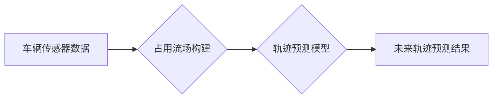

## 1. 背景介绍

自动驾驶技术作为未来交通运输的重要发展方向，其核心之一便是精准的未来轨迹预测。传统的轨迹预测方法主要依赖于车辆的历史行驶数据和周围环境的静态信息，难以有效应对复杂路况和突发事件带来的动态变化。近年来，占用流场 (Occupancy Grid) 方法因其对环境感知和轨迹预测的优势，逐渐成为自动驾驶领域的研究热点。

占用流场是一种常用的地图表示方法，它将环境空间离散化，并通过栅格单元表示每个位置是否被占用。每个栅格单元都对应一个占用概率，表示该位置被障碍物占据的可能性。占用流场能够有效地描述环境的复杂性和动态性，为自动驾驶车辆提供更全面的感知信息。

## 2. 核心概念与联系

### 2.1 占用流场

占用流场是一种将环境空间离散化表示的方法，将环境空间划分为一系列栅格单元，每个单元都代表一个空间区域。每个单元包含一个占用概率，表示该区域被障碍物占据的可能性。

### 2.2 未来轨迹预测

未来轨迹预测是指根据车辆的历史行驶数据、周围环境信息以及驾驶员意图，预测车辆未来一段时间内的行驶轨迹。

### 2.3 占用流场与未来轨迹预测的联系

占用流场为未来轨迹预测提供了丰富的环境感知信息。通过分析占用流场中的障碍物分布和占用概率，车辆可以更好地理解周围环境，并预测未来可能出现的障碍物和危险情况。

**Mermaid 流程图**



## 3. 核心算法原理 & 具体操作步骤

### 3.1 算法原理概述

占用流场在自动驾驶未来轨迹预测中的应用主要基于以下算法原理：

* **环境感知:** 利用传感器数据构建占用流场地图，准确描述周围环境的障碍物分布和占用概率。
* **轨迹预测模型:** 基于占用流场信息，训练轨迹预测模型，预测车辆未来行驶轨迹。
* **路径规划:** 根据预测轨迹，规划安全有效的行驶路径。

### 3.2 算法步骤详解

1. **传感器数据采集:** 利用激光雷达、摄像头等传感器采集车辆周围环境信息。
2. **占用流场构建:** 将传感器数据进行处理，构建占用流场地图。
3. **轨迹预测模型训练:** 利用历史行驶数据和占用流场信息，训练轨迹预测模型。
4. **未来轨迹预测:** 将当前车辆状态和占用流场信息输入到训练好的轨迹预测模型中，预测车辆未来行驶轨迹。
5. **路径规划:** 根据预测轨迹，规划安全有效的行驶路径。

### 3.3 算法优缺点

**优点:**

* **高精度:** 占用流场能够提供高精度的环境感知信息，提高轨迹预测的准确性。
* **动态性:** 占用流场能够实时更新，适应环境的动态变化。
* **鲁棒性:** 占用流场对传感器噪声和遮挡具有较好的鲁棒性。

**缺点:**

* **计算复杂度:** 占用流场构建和轨迹预测计算量较大，对计算资源要求高。
* **空间分辨率:** 占用流场的空间分辨率有限，难以描述细小的障碍物。
* **数据量需求:** 训练轨迹预测模型需要大量的历史行驶数据。

### 3.4 算法应用领域

占用流场在自动驾驶未来轨迹预测领域具有广泛的应用前景，例如：

* **自动驾驶车辆:** 预测车辆未来行驶轨迹，避免碰撞事故。
* **无人机:** 预测无人机飞行路径，避开障碍物和人员。
* **机器人:** 预测机器人运动轨迹，完成复杂的任务。

## 4. 数学模型和公式 & 详细讲解 & 举例说明

### 4.1 数学模型构建

占用流场可以表示为一个二维矩阵，其中每个元素代表一个空间单元的占用概率。假设环境空间为 $m \times n$ 的网格，则占用流场可以表示为一个 $m \times n$ 的矩阵 $O$，其中 $O(i,j)$ 表示空间单元 $(i,j)$ 的占用概率。

### 4.2 公式推导过程

占用概率的更新可以通过以下公式进行计算：

$$O(i,j) = \alpha \cdot O(i,j) + (1-\alpha) \cdot S(i,j)$$

其中：

* $O(i,j)$ 是空间单元 $(i,j)$ 的占用概率。
* $\alpha$ 是衰减因子，控制历史占用概率的影响程度。
* $S(i,j)$ 是传感器数据对空间单元 $(i,j)$ 的占用判断结果，取值为 0 或 1。

### 4.3 案例分析与讲解

假设一个激光雷达传感器检测到一个障碍物位于空间单元 $(2,3)$，则 $S(2,3) = 1$。如果衰减因子 $\alpha = 0.8$，则空间单元 $(2,3)$ 的占用概率更新为：

$$O(2,3) = 0.8 \cdot O(2,3) + (1-0.8) \cdot 1 = 0.8 \cdot O(2,3) + 0.2$$

如果空间单元 $(2,3)$ 之前占用概率为 0.5，则更新后的占用概率为：

$$O(2,3) = 0.8 \cdot 0.5 + 0.2 = 0.6$$

## 5. 项目实践：代码实例和详细解释说明

### 5.1 开发环境搭建

* 操作系统: Ubuntu 20.04
* 编程语言: Python 3.8
* 库依赖: numpy, matplotlib, opencv-python

### 5.2 源代码详细实现

```python
import numpy as np
import matplotlib.pyplot as plt

# 构建占用流场地图
def build_occupancy_grid(sensor_data):
    #...

# 更新占用概率
def update_occupancy(occupancy_grid, sensor_data):
    #...

# 预测未来轨迹
def predict_future_trajectory(occupancy_grid, vehicle_state):
    #...

# 展示占用流场地图
def display_occupancy_grid(occupancy_grid):
    #...

# 主程序
if __name__ == "__main__":
    #...
```

### 5.3 代码解读与分析

* `build_occupancy_grid()` 函数根据传感器数据构建占用流场地图。
* `update_occupancy()` 函数根据传感器数据更新占用概率。
* `predict_future_trajectory()` 函数利用占用流场信息和车辆状态预测未来轨迹。
* `display_occupancy_grid()` 函数展示占用流场地图。

### 5.4 运行结果展示

* 运行代码后，将展示占用流场地图和预测轨迹。

## 6. 实际应用场景

### 6.1 自动驾驶车辆

占用流场在自动驾驶车辆中应用广泛，例如：

* **避障:** 利用占用流场信息，自动驾驶车辆可以识别周围障碍物，并规划避障路径。
* **路径规划:** 占用流场可以提供车辆行驶路径的参考信息，帮助自动驾驶车辆规划安全有效的路径。
* **车道保持:** 占用流场可以帮助自动驾驶车辆识别车道边界，并保持在车道内行驶。

### 6.2 无人机

占用流场在无人机飞行控制中也具有重要应用价值，例如：

* **避障飞行:** 无人机可以利用占用流场信息避开地面障碍物和建筑物。
* **路径规划:** 占用流场可以帮助无人机规划飞行路径，避免碰撞事故。
* **自主导航:** 无人机可以利用占用流场信息进行自主导航，到达指定地点。

### 6.3 未来应用展望

随着自动驾驶技术的发展，占用流场在未来将有更广泛的应用场景，例如：

* **智能交通管理:** 利用占用流场信息，可以实现智能交通信号灯控制、车辆流量优化等。
* **智能城市规划:** 占用流场可以帮助城市规划者了解城市空间利用情况，优化城市布局。
* **机器人协作:** 多个机器人可以利用共享的占用流场信息进行协作工作。

## 7. 工具和资源推荐

### 7.1 学习资源推荐

* **书籍:**
    * "Probabilistic Robotics" by Sebastian Thrun, Wolfram Burgard, and Dieter Fox
    * "Robotics, Vision and Control" by Peter Corke
* **在线课程:**
    * Coursera: "Robotics" by University of Pennsylvania
    * edX: "Introduction to Robotics" by Georgia Institute of Technology

### 7.2 开发工具推荐

* **ROS (Robot Operating System):** 一个开源机器人软件框架，提供丰富的工具和库，方便机器人开发。
* **Gazebo:** 一个开源机器人仿真平台，可以模拟真实世界的机器人环境。
* **PCL (Point Cloud Library):** 一个开源点云处理库，可以用于处理激光雷达数据。

### 7.3 相关论文推荐

* "Occupancy Grid Mapping" by S. Thrun, W. Burgard, and D. Fox
* "Probabilistic Occupancy Grid Mapping for Mobile Robots" by S. Thrun, W. Burgard, and D. Fox
* "Occupancy Grid Mapping with a Mobile Robot" by J. J. Leonard, A. P. Ng, and S. Thrun

## 8. 总结：未来发展趋势与挑战

### 8.1 研究成果总结

占用流场在自动驾驶未来轨迹预测领域取得了显著的成果，能够提供高精度、动态的感知信息，提高轨迹预测的准确性。

### 8.2 未来发展趋势

* **高精度地图构建:** 研究更高精度、更细粒度的占用流场地图构建方法。
* **多传感器融合:** 将激光雷达、摄像头等多种传感器数据融合，构建更全面的占用流场地图。
* **深度学习应用:** 利用深度学习算法优化占用流场构建和轨迹预测过程。
* **实时性提升:** 研究提高占用流场更新和轨迹预测的实时性，满足自动驾驶车辆对实时信息的需要。

### 8.3 面临的挑战

* **计算复杂度:** 占用流场构建和轨迹预测计算量较大，需要进一步优化算法和硬件资源。
* **数据量需求:** 训练占用流场轨迹预测模型需要大量的历史行驶数据，数据获取和标注成本较高。
* **环境复杂性:** 复杂的路况和突发事件难以被占用流场完全描述，需要进一步研究应对复杂环境的策略。

### 8.4 研究展望

未来，占用流场在自动驾驶未来轨迹预测领域将继续发挥重要作用，随着算法和技术的不断发展，占用流场将更加智能化、高效化，为自动驾驶车辆提供更安全、更可靠的感知和决策支持。

## 9. 附录：常见问题与解答

* **Q1: 占用流场地图的精度如何影响轨迹预测的准确性？**

* **A1:** 占用流场地图的精度直接影响轨迹预测的准确性。精度越高，占用流场能够更准确地描述环境，预测轨迹越准确。

* **Q2: 占用流场地图的更新频率如何影响轨迹预测的实时性？**

* **A2:** 占用流场地图的更新频率越高，轨迹预测的实时性越好。但是，更新频率过高会增加计算负担。

* **Q3: 如何应对复杂路况和突发事件对占用流场的影响？**

* **A3:** 针对复杂路况和突发事件，可以采用以下策略：
    * 使用多传感器融合技术，构建更全面的占用流场地图。
    * 利用深度学习算法，学习应对复杂环境的策略。
    * 结合其他预测模型，例如预测其他车辆的行为。