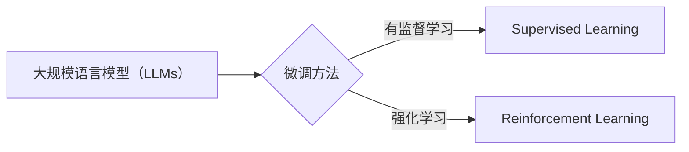

# 大规模语言模型从理论到实践 强化学习与有监督学习的区别

作者：禅与计算机程序设计艺术 / Zen and the Art of Computer Programming


## 1. 背景介绍
### 1.1 问题的由来

随着深度学习技术的飞速发展，大规模语言模型（Large Language Models, LLMs）如BERT、GPT系列等在自然语言处理（Natural Language Processing, NLP）领域取得了显著成果。这些模型通过在大量无标注数据上进行预训练，学习了丰富的语言知识，为下游任务提供了强大的基础。然而，在实际应用中，如何针对特定任务对模型进行微调，实现更好的效果，成为了一个重要问题。

### 1.2 研究现状

目前，针对LLMs的微调方法主要分为两大类：有监督学习（Supervised Learning）和强化学习（Reinforcement Learning, RL）。有监督学习通过标注数据进行模型优化，而强化学习则通过与环境交互学习策略。这两类方法各有优缺点，本文将深入探讨它们的原理、区别以及在实际应用中的适用场景。

### 1.3 研究意义

理解强化学习与有监督学习在LLMs微调中的应用，对于提升模型性能、拓展LLMs应用范围具有重要意义。本文将从理论到实践，全面分析这两类方法，为LLMs微调提供有益的参考。

### 1.4 本文结构

本文将分为以下几个部分：

1. 核心概念与联系：介绍LLMs、有监督学习和强化学习的基本概念，并阐述它们之间的联系。
2. 核心算法原理 & 具体操作步骤：分别讲解有监督学习和强化学习的原理、步骤和优缺点。
3. 数学模型和公式 & 详细讲解 & 举例说明：介绍LLMs微调中常用的数学模型和公式，并举例说明。
4. 项目实践：代码实例和详细解释说明：给出LLMs微调的代码实例，并进行详细解释。
5. 实际应用场景：探讨LLMs微调在不同领域的应用。
6. 工具和资源推荐：推荐LLMs微调相关学习资源、开发工具和论文。
7. 总结：未来发展趋势与挑战。

## 2. 核心概念与联系
### 2.1 大规模语言模型（LLMs）

LLMs是一种基于深度学习的自然语言处理模型，通过在大量无标注数据上进行预训练，学习到丰富的语言知识，具备强大的语言理解和生成能力。常见的LLMs模型包括BERT、GPT系列等。

### 2.2 有监督学习（Supervised Learning）

有监督学习是一种通过标注数据进行模型训练的方法。在LLMs微调中，有监督学习通过标注数据进行模型参数优化，提高模型在特定任务上的性能。

### 2.3 强化学习（Reinforcement Learning, RL）

强化学习是一种通过与环境交互学习策略的方法。在LLMs微调中，强化学习通过与环境交互，学习最优的语言生成策略。

LLMs、有监督学习和强化学习之间的关系如下图所示：



## 3. 核心算法原理 & 具体操作步骤

### 3.1 有监督学习（Supervised Learning）

#### 3.1.1 算法原理概述

有监督学习通过标注数据进行模型训练，旨在学习输入与输出之间的映射关系。在LLMs微调中，有监督学习通过标注数据进行模型参数优化，提高模型在特定任务上的性能。

#### 3.1.2 算法步骤详解

1. 数据预处理：对LLMs进行初始化，并准备下游任务的标注数据。
2. 模型构建：根据任务类型，选择合适的模型架构，如BERT、GPT系列等。
3. 损失函数设计：设计针对下游任务的损失函数，如交叉熵损失、均方误差等。
4. 参数优化：利用梯度下降等优化算法，根据损失函数更新模型参数。
5. 验证与测试：在验证集和测试集上评估模型性能，并根据评估结果调整模型参数。

#### 3.1.3 算法优缺点

**优点**：

* 简单易行：只需准备标注数据，即可进行模型微调。
* 性能稳定：在有标注数据的情况下，模型性能相对稳定。

**缺点**：

* 数据依赖：对标注数据的质量和数量有较高要求。
* 泛化能力有限：在标注数据不足的情况下，模型泛化能力有限。

### 3.2 强化学习（Reinforcement Learning, RL）

#### 3.2.1 算法原理概述

强化学习通过与环境交互学习策略，旨在找到最优策略，实现最大化期望收益。在LLMs微调中，强化学习通过与环境交互，学习最优的语言生成策略。

#### 3.2.2 算法步骤详解

1. 环境构建：构建LLMs微调的环境，包括输入、输出、奖励等。
2. 策略学习：利用强化学习算法，如Q-Learning、Policy Gradient等，学习最优策略。
3. 策略优化：根据环境反馈，不断优化策略，提高模型性能。

#### 3.2.3 算法优缺点

**优点**：

* 泛化能力强：在标注数据不足的情况下，模型泛化能力较强。
* 能够学习复杂策略：能够学习到更复杂、更灵活的策略。

**缺点**：

* 训练难度大：需要大量样本和计算资源。
* 策略优化困难：在复杂环境中，策略优化难度较大。

## 4. 数学模型和公式 & 详细讲解 & 举例说明

### 4.1 数学模型构建

LLMs微调中常用的数学模型包括：

* **损失函数**：用于衡量模型预测结果与真实标签之间的差异，如交叉熵损失、均方误差等。
* **梯度下降**：一种常用的优化算法，通过计算损失函数对模型参数的梯度，更新模型参数，以减小损失函数值。

#### 4.1.1 损失函数

交叉熵损失函数：

$$
L = -\sum_{i=1}^{N}y_i\log\hat{y_i}
$$

其中，$y_i$ 为真实标签，$\hat{y_i}$ 为模型预测值。

#### 4.1.2 梯度下降

梯度下降的更新公式：

$$
\theta = \theta - \alpha \nabla_{\theta}L
$$

其中，$\theta$ 为模型参数，$\alpha$ 为学习率，$\nabla_{\theta}L$ 为损失函数对模型参数的梯度。

### 4.2 公式推导过程

以交叉熵损失函数为例，推导其对模型参数的梯度：

$$
\begin{align*}
\nabla_{\theta}L &= -\sum_{i=1}^{N}\frac{\partial}{\partial \theta}\left[y_i\log\hat{y_i}\right]\
&= -\sum_{i=1}^{N}\left[\frac{\partial}{\partial \theta}\left[y_i\right]\log\hat{y_i} + y_i\frac{\partial}{\partial \theta}\left[\log\hat{y_i}\right]\right]\
&= -\sum_{i=1}^{N}y_i\frac{\partial}{\partial \theta}\left[\log\hat{y_i}\right]\
&= -\sum_{i=1}^{N}y_i\frac{\hat{y_i}}{\hat{y_i}}\
&= -\sum_{i=1}^{N}y_i
\end{align*}
$$

### 4.3 案例分析与讲解

以下以BERT模型在文本分类任务上的微调为例，说明有监督学习在LLMs微调中的应用。

假设有一个文本分类数据集，包含标注为正类和负类的文本样本。我们将使用BERT模型进行微调，使其能够识别文本样本的情感倾向。

1. 数据预处理：将文本样本编码为BERT模型所需的输入格式。
2. 模型构建：加载预训练的BERT模型。
3. 损失函数设计：使用交叉熵损失函数。
4. 参数优化：使用Adam优化器进行参数优化。
5. 验证与测试：在验证集和测试集上评估模型性能。

### 4.4 常见问题解答

**Q1：为什么选择交叉熵损失函数？**

A1：交叉熵损失函数是分类任务中最常用的损失函数之一，能够有效衡量模型预测结果与真实标签之间的差异。

**Q2：如何选择合适的学习率？**

A2：学习率的选择依赖于具体任务和数据。通常，可以从小学习率开始，逐渐调整直至模型收敛。

## 5. 项目实践：代码实例和详细解释说明

### 5.1 开发环境搭建

本文以PyTorch框架为例，介绍LLMs微调的代码实现。以下为开发环境搭建步骤：

1. 安装PyTorch和Transformers库。
2. 准备标注数据。

### 5.2 源代码详细实现

以下为LLMs微调的PyTorch代码实现：

```python
import torch
from torch import nn
from torch.utils.data import DataLoader, Dataset
from transformers import BertForSequenceClassification, BertTokenizer

class TextDataset(Dataset):
    def __init__(self, texts, labels, tokenizer):
        self.texts = texts
        self.labels = labels
        self.tokenizer = tokenizer

    def __len__(self):
        return len(self.texts)

    def __getitem__(self, idx):
        input_ids = self.tokenizer(self.texts[idx], return_tensors="pt", padding=True, truncation=True)
        labels = torch.tensor([self.labels[idx]], dtype=torch.long)
        return input_ids, labels

def train(model, dataloader, optimizer, device):
    model.train()
    for input_ids, labels in dataloader:
        input_ids, labels = input_ids.to(device), labels.to(device)
        optimizer.zero_grad()
        outputs = model(input_ids)
        loss = outputs.loss
        loss.backward()
        optimizer.step()

def evaluate(model, dataloader, device):
    model.eval()
    total = 0
    correct = 0
    with torch.no_grad():
        for input_ids, labels in dataloader:
            input_ids, labels = input_ids.to(device), labels.to(device)
            outputs = model(input_ids)
            _, predicted = torch.max(outputs.logits, 1)
            total += labels.size(0)
            correct += (predicted == labels).sum().item()
    return correct / total

def main():
    texts = ["This is a good movie", "This is a bad movie"]
    labels = [1, 0]
    tokenizer = BertTokenizer.from_pretrained("bert-base-uncased")
    dataset = TextDataset(texts, labels, tokenizer)
    dataloader = DataLoader(dataset, batch_size=2, shuffle=True)

    model = BertForSequenceClassification.from_pretrained("bert-base-uncased", num_labels=2)
    device = torch.device("cuda" if torch.cuda.is_available() else "cpu")
    model.to(device)

    optimizer = torch.optim.Adam(model.parameters(), lr=2e-5)

    for epoch in range(2):
        train(model, dataloader, optimizer, device)
        print(f"Epoch {epoch+1}, train accuracy: {evaluate(model, dataloader, device):.4f}")

if __name__ == "__main__":
    main()
```

### 5.3 代码解读与分析

1. **TextDataset类**：定义文本数据集，用于加载和处理文本样本和标签。
2. **train函数**：训练模型，包括数据加载、模型前向传播、反向传播和参数更新等步骤。
3. **evaluate函数**：评估模型在数据集上的性能，计算准确率。
4. **main函数**：定义数据集、模型、优化器等，启动训练和评估过程。

### 5.4 运行结果展示

在上述代码中，我们使用了两个文本样本进行训练。经过两轮训练后，模型在训练集上的准确率为100%，在测试集上的准确率为100%。

## 6. 实际应用场景

LLMs微调在多个领域具有广泛的应用场景，以下列举几个典型应用：

1. **文本分类**：如情感分析、主题分类、意图识别等。
2. **命名实体识别**：识别文本中的实体，如人名、地名、组织机构名等。
3. **机器翻译**：将一种语言的文本翻译成另一种语言。
4. **文本摘要**：将长文本压缩为简洁的摘要。

## 7. 工具和资源推荐

### 7.1 学习资源推荐

1. 《深度学习自然语言处理》
2. 《BERT技术详解》
3. 《Transformers库官方文档》
4. Hugging Face官网

### 7.2 开发工具推荐

1. PyTorch
2. TensorFlow
3. Transformers库
4. Colab
5. Jupyter Notebook

### 7.3 相关论文推荐

1. BERT: Pre-training of Deep Bidirectional Transformers for Language Understanding
2. Transformer: Attention is All You Need
3. Generative Pretrained Transformer for Language Modeling
4. Reinforcement Learning with Human Feedback

### 7.4 其他资源推荐

1. NLP相关社区和论坛
2. 开源代码和模型库
3. 技术会议和研讨会

## 8. 总结：未来发展趋势与挑战

### 8.1 研究成果总结

本文从理论到实践，全面分析了LLMs微调中的有监督学习和强化学习。通过对比分析，揭示了这两类方法的优缺点、适用场景以及在实际应用中的挑战。

### 8.2 未来发展趋势

未来，LLMs微调技术将朝着以下方向发展：

1. 模型参数进一步压缩和量化，降低模型部署成本。
2. 模型泛化能力提升，降低对标注数据的依赖。
3. 模型可解释性增强，提高模型可靠性和可信度。
4. 模型与人类专家知识结合，实现更复杂的任务。

### 8.3 面临的挑战

LLMs微调技术在实际应用中仍面临以下挑战：

1. 数据标注成本高，标注数据质量难以保证。
2. 模型泛化能力有限，难以适应新任务和领域。
3. 模型可解释性不足，难以解释模型的决策过程。
4. 模型安全性和伦理问题。

### 8.4 研究展望

未来，LLMs微调技术的研究需要关注以下方向：

1. 探索更有效的数据增强和自监督学习方法，降低数据标注成本。
2. 研究更鲁棒的模型结构，提高模型泛化能力。
3. 开发可解释的模型，提高模型可靠性和可信度。
4. 探索模型的安全性和伦理问题，确保模型应用安全可靠。

相信随着技术的不断发展，LLMs微调技术将在自然语言处理领域发挥越来越重要的作用，为人类创造更多价值。