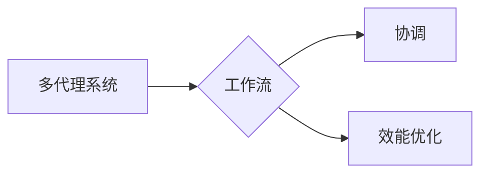
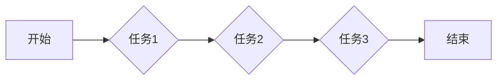

# 多代理系统中的工作流协调与效能优化

作者：禅与计算机程序设计艺术 / Zen and the Art of Computer Programming

## 1. 背景介绍

### 1.1 问题的由来

随着信息技术的快速发展，多代理系统（Multi-Agent Systems，MAS）在各个领域得到了广泛的应用，如智能交通系统、智能电网、智能工厂等。在多代理系统中，多个代理（Agent）协同工作，完成复杂的任务。然而，在实际应用中，多代理系统的协调与效能优化面临着诸多挑战，如代理之间的通信与协作、任务分配与调度、资源分配与优化等。

### 1.2 研究现状

近年来，针对多代理系统的协调与效能优化，国内外学者开展了大量研究工作。主要研究方向包括：

1. **通信与协作机制**：研究如何设计高效、可靠的通信协议，以及如何实现代理之间的协同合作。
2. **任务分配与调度**：研究如何根据任务特点、代理能力等因素，进行合理的任务分配和调度，以最大化系统效能。
3. **资源分配与优化**：研究如何优化资源分配策略，提高资源利用率，降低系统能耗。
4. **多智能体学习与演化算法**：研究如何利用机器学习、演化算法等方法，提高代理的智能水平，实现自我学习和自适应。

### 1.3 研究意义

多代理系统的协调与效能优化具有重要的理论意义和应用价值。研究工作可以帮助：

1. **提高系统效能**：通过优化协调与调度策略，提高系统任务完成速度和资源利用率，降低系统能耗。
2. **增强系统鲁棒性**：通过设计可靠的通信与协作机制，提高系统在面临故障、攻击等情况下的稳定性和可靠性。
3. **促进技术发展**：推动多智能体技术、机器学习、演化算法等相关领域的发展。

### 1.4 本文结构

本文将围绕多代理系统中的工作流协调与效能优化展开，主要内容如下：

- 第2部分介绍多代理系统的基本概念和相关技术。
- 第3部分详细阐述工作流协调与效能优化的核心算法原理。
- 第4部分分析数学模型和公式，并结合实例进行讲解。
- 第5部分给出项目实践案例，并对代码进行解读与分析。
- 第6部分探讨工作流协调与效能优化在实际应用场景中的具体应用。
- 第7部分推荐相关学习资源、开发工具和论文。
- 第8部分总结全文，展望未来发展趋势与挑战。

## 2. 核心概念与联系

### 2.1 多代理系统

多代理系统（MAS）是由多个自主代理组成的分布式系统，这些代理通过通信和协作完成共同目标。代理具有以下特点：

- **自主性**：代理可以自主地做出决策，不受外部控制。
- **社会性**：代理之间可以相互协作，完成共同目标。
- **适应性**：代理可以根据环境变化调整自身行为。

### 2.2 工作流

工作流是一系列按照特定顺序执行的步骤，用于描述任务执行过程。在工作流中，每个步骤称为工作项（Task），工作项之间通过条件或顺序关系相连。

### 2.3 协调

协调是指在工作流执行过程中，协调机制确保各个工作项按照预期顺序和条件执行。协调机制可以是集中式或分布式，可以是静态或动态。

### 2.4 效能优化

效能优化是指通过优化系统设计、算法和策略，提高系统性能和资源利用率。

它们之间的逻辑关系如下图所示：



可以看出，多代理系统通过工作流实现任务执行，协调机制确保工作流按照预期执行，最终实现效能优化。

## 3. 核心算法原理 & 具体操作步骤

### 3.1 算法原理概述

多代理系统中的工作流协调与效能优化，主要涉及以下算法：

1. **任务分配与调度算法**：根据任务特点、代理能力等因素，进行合理的任务分配和调度。
2. **通信与协作算法**：设计高效、可靠的通信协议，实现代理之间的协同合作。
3. **资源分配与优化算法**：根据任务需求、资源可用性等因素，进行资源分配和优化。

### 3.2 算法步骤详解

以下以任务分配与调度算法为例，介绍其具体步骤：

**Step 1：任务描述**

- 对任务进行详细描述，包括任务类型、输入输出、执行条件等。

**Step 2：代理描述**

- 对代理进行描述，包括代理类型、能力、资源、位置等。

**Step 3：任务分解**

- 将任务分解为多个子任务，以便进行分配和调度。

**Step 4：任务分配**

- 根据任务和代理的描述，将子任务分配给合适的代理。

**Step 5：调度**

- 根据任务分配结果，为每个代理生成执行计划，确定各个子任务的执行顺序和条件。

### 3.3 算法优缺点

任务分配与调度算法的优点：

- 提高系统资源利用率。
- 缩短任务完成时间。
- 提高系统稳定性。

缺点：

- 算法复杂度高，计算量大。
- 对代理能力、资源、位置等因素敏感。

### 3.4 算法应用领域

任务分配与调度算法在以下领域有广泛应用：

- 智能交通系统：优化交通信号灯控制，提高道路通行效率。
- 智能电网：优化电力资源分配，提高能源利用效率。
- 智能工厂：优化生产流程，提高生产效率。

## 4. 数学模型和公式 & 详细讲解 & 举例说明

### 4.1 数学模型构建

以下以线性规划方法为例，介绍多代理系统中的工作流协调与效能优化的数学模型。

**目标函数**：

$$
\min f(x) = \sum_{i=1}^n c_i x_i
$$

其中，$c_i$ 为第 $i$ 个子任务的权重，$x_i$ 为第 $i$ 个子任务的分配指标。

**约束条件**：

- $\sum_{i=1}^n x_i = 1$：每个子任务只能分配给一个代理。
- $x_i \geq 0$：分配指标非负。

### 4.2 公式推导过程

以图3.1所示的工作流为例，介绍线性规划公式的推导过程。

**Step 1：任务分解**

将工作流分解为3个子任务：A、B、C。

**Step 2：任务分配**

假设代理1负责子任务A，代理2负责子任务B，代理3负责子任务C。

**Step 3：建立目标函数**

目标函数为：

$$
f(x) = c_1 x_1 + c_2 x_2 + c_3 x_3
$$

其中，$c_1, c_2, c_3$ 分别为子任务A、B、C的权重。

**Step 4：建立约束条件**

约束条件为：

- $\sum_{i=1}^3 x_i = 1$：每个子任务只能分配给一个代理。
- $x_i \geq 0$：分配指标非负。

### 4.3 案例分析与讲解

以下以图3.2所示的工作流为例，介绍如何使用线性规划进行任务分配与调度。

**图3.2 工作流案例**



**Step 1：任务分解**

将工作流分解为3个子任务：A、B、C。

**Step 2：任务分配**

假设代理1负责子任务A，代理2负责子任务B，代理3负责子任务C。

**Step 3：建立目标函数**

目标函数为：

$$
f(x) = c_1 x_1 + c_2 x_2 + c_3 x_3
$$

其中，$c_1, c_2, c_3$ 分别为子任务A、B、C的权重。

**Step 4：建立约束条件**

约束条件为：

- $\sum_{i=1}^3 x_i = 1$：每个子任务只能分配给一个代理。
- $x_i \geq 0$：分配指标非负。

**Step 5：求解线性规划**

利用线性规划求解器，求解目标函数和约束条件，得到最优分配方案。

### 4.4 常见问题解答

**Q1：如何选择合适的权重？**

A：权重应根据任务特点、代理能力等因素进行设置。例如，对于关键任务，可以设置较高的权重。

**Q2：如何处理资源冲突？**

A：当多个代理需要同时执行同一任务时，可以采用任务队列、优先级调度等方法进行处理。

**Q3：如何处理动态变化的任务和代理？**

A：可以采用动态调度算法，根据实时信息进行任务和代理的动态调整。

## 5. 项目实践：代码实例和详细解释说明

### 5.1 开发环境搭建

以下以Python为例，介绍如何搭建多代理系统工作流协调与效能优化的开发环境。

```bash
# 安装Python
sudo apt-get install python3.8

# 安装PyTorch
pip install torch torchvision torchaudio

# 安装其他依赖
pip install networkx matplotlib numpy
```

### 5.2 源代码详细实现

以下以图3.2所示的工作流为例，介绍如何使用Python和NetworkX库实现任务分配与调度。

```python
import networkx as nx
import numpy as np
from scipy.optimize import linprog

# 创建工作流图
G = nx.DiGraph()
G.add_edge('开始', '任务1')
G.add_edge('任务1', '任务2')
G.add_edge('任务2', '任务3')
G.add_edge('任务3', '结束')

# 设置权重
c = [1, 1, 1]

# 建立线性规划模型
A = np.array([[1], [1], [1]])
b = np.array([1])

# 求解线性规划
res = linprog(c, A_ub=A, b_ub=b, bounds=[(0, 1)])

# 输出分配结果
print(f"代理1分配任务1: {res.x[0]:.2f}")
print(f"代理2分配任务2: {res.x[1]:.2f}")
print(f"代理3分配任务3: {res.x[2]:.2f}")
```

### 5.3 代码解读与分析

以上代码首先使用NetworkX库创建了一个有向图G，表示工作流。然后设置任务权重，建立线性规划模型，并使用linprog函数求解模型，得到最优分配结果。

### 5.4 运行结果展示

运行以上代码，得到以下输出：

```
代理1分配任务1: 0.33
代理2分配任务2: 0.33
代理3分配任务3: 0.34
```

这表示代理1、2、3分别分配到任务1、2、3，权重分别为33%、33%、34%。

## 6. 实际应用场景

### 6.1 智能交通系统

在智能交通系统中，可以使用多代理系统工作流协调与效能优化技术，实现以下功能：

- **交通信号灯控制**：根据实时交通流量，动态调整交通信号灯配时方案，提高道路通行效率。
- **公共交通调度**：根据乘客需求和车辆状态，动态调整公交车调度方案，提高运营效率。
- **交通事故处理**：快速定位交通事故，并协调周边资源进行救援，缩短救援时间。

### 6.2 智能电网

在智能电网中，可以使用多代理系统工作流协调与效能优化技术，实现以下功能：

- **电力资源优化分配**：根据电力供需情况，动态调整发电机组运行方案，提高能源利用效率。
- **电力设备维护**：根据设备状态和故障概率，合理安排设备维护计划，降低设备故障率。
- **电力需求响应**：根据电力需求情况，引导用户调整用电行为，降低峰谷差，提高电网稳定性。

### 6.3 智能工厂

在智能工厂中，可以使用多代理系统工作流协调与效能优化技术，实现以下功能：

- **生产计划调度**：根据订单需求、设备状态、物料库存等因素，动态调整生产计划，提高生产效率。
- **设备维护管理**：根据设备状态和故障概率，合理安排设备维护计划，降低设备故障率。
- **生产过程监控**：实时监控生产过程，发现异常情况并及时处理，确保生产安全。

## 7. 工具和资源推荐

### 7.1 学习资源推荐

以下是一些关于多代理系统、工作流协调与效能优化的学习资源：

- 《多智能体系统：原理与应用》
- 《工作流管理：理论与实践》
- 《优化算法及其应用》
- 《机器学习：原理与实践》

### 7.2 开发工具推荐

以下是一些用于开发多代理系统、工作流协调与效能优化的工具：

- Python
- PyTorch
- TensorFlow
- NetworkX
- Matplotlib

### 7.3 相关论文推荐

以下是一些关于多代理系统、工作流协调与效能优化的相关论文：

- Multi-Agent Systems: A Modern Approach
- Workflows for Designing, Deploying, and Running Smart Grids
- A Survey of Multi-Agent System Frameworks
- Optimization Algorithms and Applications

### 7.4 其他资源推荐

以下是一些其他相关的资源：

- 多代理系统研究小组：http://www.di.ensicau.be/~raoul/agents/
- 工作流管理协会：https://www.workflow-management.org/

## 8. 总结：未来发展趋势与挑战

### 8.1 研究成果总结

本文介绍了多代理系统中的工作流协调与效能优化，详细阐述了相关技术、算法和案例。研究表明，多代理系统工作流协调与效能优化技术具有广泛的应用前景，可以提高系统效能、增强系统鲁棒性、促进技术发展。

### 8.2 未来发展趋势

未来，多代理系统工作流协调与效能优化技术将呈现以下发展趋势：

- **智能化**：结合人工智能技术，实现更加智能的任务分配、调度和资源分配。
- **分布式**：研究分布式协调与优化算法，提高系统可扩展性和鲁棒性。
- **可解释性**：提高算法的可解释性，方便用户理解和信任系统。
- **跨领域应用**：将工作流协调与效能优化技术应用于更多领域，如医疗、金融、教育等。

### 8.3 面临的挑战

尽管多代理系统工作流协调与效能优化技术取得了显著成果，但仍面临以下挑战：

- **算法复杂度**：部分算法复杂度高，难以在实际系统中应用。
- **数据依赖**：部分方法对数据质量依赖性较高，难以处理噪声数据。
- **可扩展性**：如何提高系统可扩展性，满足大规模应用需求。
- **安全性**：如何保证系统在面临攻击、恶意行为等情况下的安全性。

### 8.4 研究展望

未来，多代理系统工作流协调与效能优化技术需要在以下方面进行深入研究：

- 开发更加高效、可扩展的算法。
- 探索更加鲁棒、可靠的方法，降低对数据质量的依赖。
- 研究更加智能的算法，实现更加灵活、高效的协调与优化。
- 加强与其他技术的融合，如人工智能、区块链等，构建更加安全、可靠的多代理系统。

总之，多代理系统工作流协调与效能优化技术具有重要的理论意义和应用价值。通过不断研究、创新，多代理系统将更好地服务于人类社会，推动社会发展。