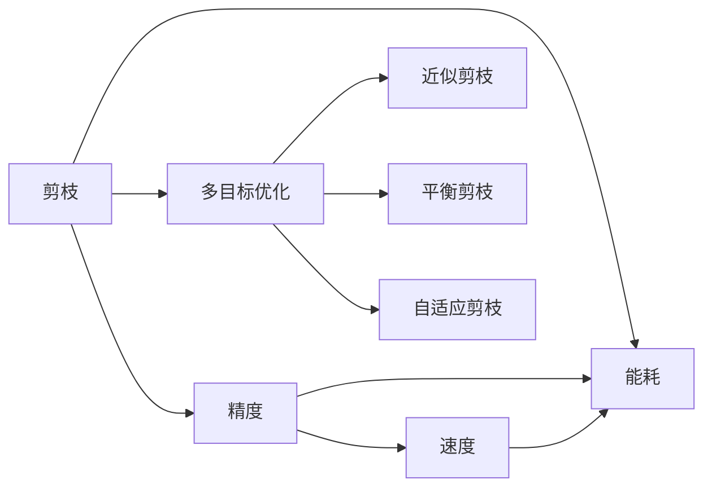
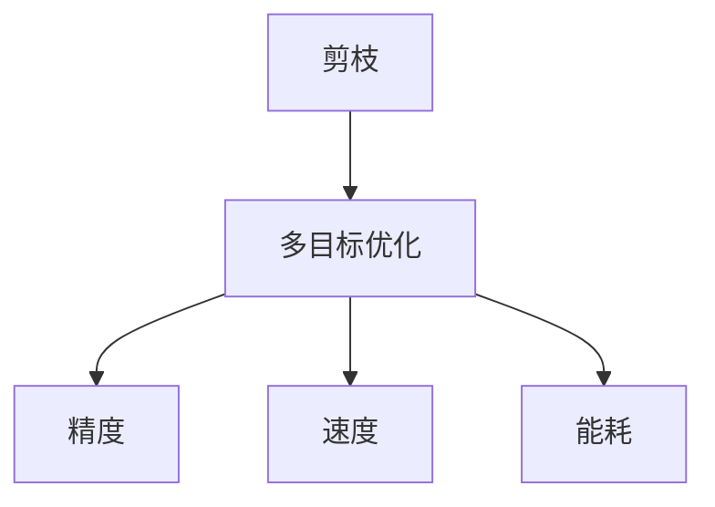
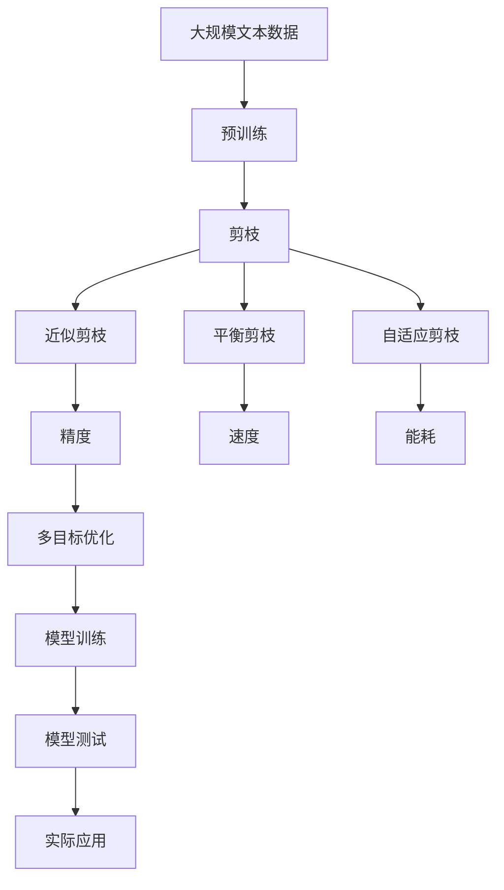

                 

# 多目标剪枝：平衡精度、速度与能耗的技术

## 1. 背景介绍

### 1.1 问题由来

在深度学习模型中，通常追求在精度、速度和能耗三者之间实现平衡。精度指的是模型预测结果的准确度，速度则是指模型计算和推理的速度，能耗则是模型在训练和推理过程中所消耗的能量。然而，在实际应用中，这三个指标往往是相互矛盾的：提高模型的精度通常需要增加模型参数和计算量，进而导致速度变慢和能耗增加；而提高模型速度则可能需要降低模型的精度，例如通过剪枝等手段减少模型参数，从而提升计算效率。

这种矛盾的根源在于，深度学习模型的优化目标通常是最大化模型在特定任务上的准确度，而对模型的计算速度和能耗考虑较少。然而，在实际部署中，模型不仅需要高性能的计算资源，还必须满足低能耗和低延迟的要求，以避免过高的能源消耗和运行成本。

因此，如何在保持高精度的同时，实现模型的高效计算和低能耗，成为了深度学习模型优化的重要研究方向。多目标剪枝技术就是在这一背景下提出的，它旨在通过优化模型结构，同时提升精度、速度和能耗，以满足实际应用中的综合需求。

### 1.2 问题核心关键点

多目标剪枝技术的关键点在于如何同时优化模型的多个目标。具体而言，通常包括以下几个方面：

- **精度优化**：通过剪枝减少模型参数和计算量，从而提升模型的推理速度和计算效率，降低能耗。
- **速度优化**：通过剪枝去除冗余的计算节点和连接边，减少计算过程中的运算量和计算延迟。
- **能耗优化**：通过剪枝降低模型对计算资源的需求，减少模型在计算过程中对能量的消耗。

这些优化目标之间存在一定的冲突，如何在不牺牲模型精度的前提下，同时实现速度和能耗的提升，是多目标剪枝技术需要解决的核心问题。

### 1.3 问题研究意义

多目标剪枝技术的研究和应用具有重要意义：

- **提高模型效率**：通过剪枝减少模型参数和计算量，显著降低模型的推理速度和计算能耗，提升模型在实际应用中的效率。
- **支持模型部署**：在资源受限的硬件平台上，多目标剪枝可以使得模型能够运行，从而实现实际应用部署。
- **促进模型优化**：多目标剪枝技术提供了一种通用的模型优化方法，可以应用到各种深度学习模型中，提升模型优化效果。
- **支持模型扩展**：多目标剪枝能够支持模型的规模化和并行化，提升模型在大规模数据和分布式计算环境中的性能。
- **应对未来挑战**：随着计算硬件的发展，未来的模型将越来越复杂和庞大，多目标剪枝技术可以帮助开发者在设计复杂模型时更好地权衡精度、速度和能耗。

## 2. 核心概念与联系

### 2.1 核心概念概述

为更好地理解多目标剪枝技术，本节将介绍几个密切相关的核心概念：

- **剪枝(Pruning)**：剪枝是指去除深度学习模型中不必要的参数或连接边，以减少模型的大小和计算量，从而提升模型效率。
- **精度(Precision)**：精度指的是模型预测结果的正确率，通常通过在特定数据集上的准确度来衡量。
- **速度(Speed)**：速度指的是模型计算和推理的速度，通常通过模型在特定硬件平台上的运行时间来衡量。
- **能耗(Energy)**：能耗指的是模型在计算和推理过程中所消耗的能量，通常通过模型的计算时间和计算硬件的能耗来衡量。
- **多目标优化(Multi-objective Optimization)**：多目标优化是指同时优化多个相互矛盾的目标，例如在精度、速度和能耗之间找到平衡。
- **近似剪枝(Approximate Pruning)**：近似剪枝是指在模型训练过程中，通过正则化等方法模拟剪枝效果，避免完全剪枝对模型性能的影响。
- **平衡剪枝(Balanced Pruning)**：平衡剪枝是指在多个目标之间进行平衡，综合考虑精度、速度和能耗的优化效果。
- **自适应剪枝(Adaptive Pruning)**：自适应剪枝是指根据模型训练过程和测试结果，动态调整剪枝策略，实现最优的平衡效果。

这些核心概念之间的逻辑关系可以通过以下Mermaid流程图来展示：



这个流程图展示了大语言模型微调过程中各个核心概念的关系：

1. 剪枝是实现多目标优化和精度、速度、能耗平衡的关键手段。
2. 精度、速度和能耗是模型的三个主要优化目标。
3. 多目标优化是实现精度、速度、能耗平衡的基础。
4. 近似剪枝、平衡剪枝和自适应剪枝是实现多目标优化的方法。

### 2.2 概念间的关系

这些核心概念之间存在着紧密的联系，形成了多目标剪枝技术的基本框架。下面我通过几个Mermaid流程图来展示这些概念之间的关系。

#### 2.2.1 剪枝与多目标优化的关系



这个流程图展示了剪枝与多目标优化的关系：剪枝通过去除冗余参数和连接边，实现模型的多目标优化，提升精度、速度和能耗。

#### 2.2.2 近似剪枝、平衡剪枝和自适应剪枝的关系


这个流程图展示了近似剪枝、平衡剪枝和自适应剪枝之间的关系：近似剪枝通过模拟剪枝效果，为平衡剪枝和自适应剪枝提供基础；平衡剪枝在多个目标之间进行平衡；自适应剪枝根据模型训练过程和测试结果动态调整剪枝策略，实现最优的平衡效果。

### 2.3 核心概念的整体架构

最后，我们用一个综合的流程图来展示这些核心概念在大语言模型微调过程中的整体架构：



这个综合流程图展示了从预训练到剪枝，再到多目标优化的完整过程。大语言模型首先在大规模文本数据上进行预训练，然后通过剪枝去除冗余参数和连接边，同时利用近似剪枝、平衡剪枝和自适应剪枝等多种方法，实现多目标优化。最终，优化后的模型应用于实际任务中，提升了模型的综合性能。 通过这些流程图，我们可以更清晰地理解多目标剪枝技术在大语言模型微调过程中的各个环节，为后续深入讨论具体的剪枝方法奠定基础。

## 3. 核心算法原理 & 具体操作步骤
### 3.1 算法原理概述

多目标剪枝技术的核心思想是通过优化模型结构，同时提升精度、速度和能耗，以实现多个目标的平衡。在实际操作中，通常采用以下几个步骤：

1. **剪枝策略设计**：选择合适的剪枝策略，例如L1、L2正则化、逐层剪枝、通道剪枝等。
2. **剪枝后评估**：对剪枝后的模型进行评估，通常使用精度、速度和能耗三个指标进行综合评估。
3. **剪枝阈值优化**：根据评估结果，调整剪枝阈值，实现最优的多目标平衡。
4. **模型微调**：对优化后的模型进行微调，以进一步提升模型性能。

这些步骤共同构成了多目标剪枝技术的完整流程，通过优化模型结构，实现精度、速度和能耗的多目标优化。

### 3.2 算法步骤详解

以下是对多目标剪枝技术的具体操作流程的详细讲解：

**Step 1: 准备预训练模型和数据集**

- 选择合适的预训练模型，如BERT、GPT等。
- 准备下游任务的标注数据集，划分为训练集、验证集和测试集。

**Step 2: 设计剪枝策略**

- 根据任务特点，选择合适的剪枝策略。常见的剪枝方法包括L1正则化、L2正则化、逐层剪枝、通道剪枝等。
- 确定剪枝的阈值。剪枝阈值决定了模型中需要保留的参数比例，通常使用交叉验证等方法进行优化。

**Step 3: 剪枝过程**

- 将预训练模型加载到内存中。
- 对模型进行剪枝，根据剪枝策略和阈值删除不必要的参数和连接边。
- 对剪枝后的模型进行评估，通常使用精度、速度和能耗三个指标进行综合评估。
- 根据评估结果，调整剪枝阈值，重新进行剪枝，直到达到最优的多目标平衡。

**Step 4: 微调模型**

- 对优化后的模型进行微调，以进一步提升模型性能。
- 微调过程通常包括设置合适的学习率、正则化技术等。

**Step 5: 模型测试和部署**

- 在测试集上评估微调后模型性能，对比微调前后的精度提升。
- 使用微调后的模型对新样本进行推理预测，集成到实际的应用系统中。
- 持续收集新的数据，定期重新微调模型，以适应数据分布的变化。

以上是多目标剪枝技术的一般流程。在实际应用中，还需要针对具体任务和模型特点，对剪枝过程进行优化设计，如改进训练目标函数，引入更多的正则化技术，搜索最优的超参数组合等，以进一步提升模型性能。

### 3.3 算法优缺点

多目标剪枝技术具有以下优点：

1. **提高模型效率**：通过剪枝减少模型参数和计算量，显著降低模型的推理速度和计算能耗，提升模型在实际应用中的效率。
2. **支持模型部署**：在资源受限的硬件平台上，多目标剪枝可以使得模型能够运行，从而实现实际应用部署。
3. **促进模型优化**：多目标剪枝技术提供了一种通用的模型优化方法，可以应用到各种深度学习模型中，提升模型优化效果。
4. **支持模型扩展**：多目标剪枝能够支持模型的规模化和并行化，提升模型在大规模数据和分布式计算环境中的性能。

同时，该方法也存在一定的局限性：

1. **剪枝难度较大**：剪枝过程需要大量计算和验证，找到最优的剪枝阈值和剪枝策略。
2. **模型性能影响**：剪枝可能导致模型精度下降，需要对剪枝后的模型进行微调以恢复精度。
3. **多目标优化复杂**：多目标优化需要综合考虑多个相互矛盾的目标，难度较大。
4. **参数调整困难**：多目标剪枝中的剪枝阈值和剪枝策略需要根据具体任务进行优化，调整困难。

尽管存在这些局限性，但多目标剪枝技术在深度学习模型优化和应用中仍然具有重要的价值。未来相关研究的重点在于如何进一步降低剪枝难度，提高模型性能，同时兼顾多目标优化，使得剪枝过程更加高效和自动化。

### 3.4 算法应用领域

多目标剪枝技术广泛应用于各种深度学习模型中，以下是几个主要应用领域：

- **计算机视觉**：应用于图像分类、目标检测、语义分割等任务，通过剪枝减少计算量和能耗，提升模型效率。
- **自然语言处理**：应用于文本分类、命名实体识别、机器翻译等任务，通过剪枝优化模型结构和参数，提升模型性能。
- **语音识别**：应用于语音识别、语音合成等任务，通过剪枝减少计算量和能耗，提升模型效率。
- **推荐系统**：应用于个性化推荐、广告推荐等任务，通过剪枝优化模型结构和参数，提升推荐效果和计算效率。
- **游戏AI**：应用于游戏AI中，通过剪枝优化模型结构和参数，提升游戏AI的决策速度和计算效率。

## 4. 数学模型和公式 & 详细讲解  
### 4.1 数学模型构建

本节将使用数学语言对多目标剪枝技术进行更加严格的刻画。

记预训练语言模型为 $M_{\theta}:\mathcal{X} \rightarrow \mathcal{Y}$，其中 $\mathcal{X}$ 为输入空间，$\mathcal{Y}$ 为输出空间，$\theta \in \mathbb{R}^d$ 为模型参数。假设多目标优化的目标函数为 $F(\theta)$，其中 $F_1(\theta)$ 为精度，$F_2(\theta)$ 为速度，$F_3(\theta)$ 为能耗。

定义模型 $M_{\theta}$ 在数据样本 $(x,y)$ 上的精度为 $\mathcal{P}(M_{\theta}(x),y)$，速度为 $\mathcal{V}(M_{\theta}(x),y)$，能耗为 $\mathcal{E}(M_{\theta}(x),y)$。则在数据集 $D=\{(x_i,y_i)\}_{i=1}^N$ 上的多目标损失函数为：

$$
\mathcal{F}(\theta) = \alpha_1 F_1(\theta) + \alpha_2 F_2(\theta) + \alpha_3 F_3(\theta)
$$

其中 $\alpha_1$、$\alpha_2$、$\alpha_3$ 为各个目标的权重系数，通常根据实际需求进行设置。

### 4.2 公式推导过程

以下我们以二分类任务为例，推导多目标损失函数及其梯度的计算公式。

假设模型 $M_{\theta}$ 在输入 $x$ 上的输出为 $\hat{y}=M_{\theta}(x) \in [0,1]$，表示样本属于正类的概率。真实标签 $y \in \{0,1\}$。定义模型 $M_{\theta}$ 在数据样本 $(x,y)$ 上的精度、速度和能耗分别为 $\mathcal{P}(M_{\theta}(x),y)$、$\mathcal{V}(M_{\theta}(x),y)$ 和 $\mathcal{E}(M_{\theta}(x),y)$。则在数据集 $D=\{(x_i,y_i)\}_{i=1}^N$ 上的多目标损失函数为：

$$
\mathcal{F}(\theta) = \alpha_1 \sum_{i=1}^N [y_i\log M_{\theta}(x_i)+(1-y_i)\log(1-M_{\theta}(x_i))] + \alpha_2 \sum_{i=1}^N \frac{1}{N} \frac{\partial \mathcal{V}(M_{\theta}(x_i),y_i)}{\partial \theta} + \alpha_3 \sum_{i=1}^N \mathcal{E}(M_{\theta}(x_i),y_i)
$$

根据链式法则，多目标损失函数对参数 $\theta_k$ 的梯度为：

$$
\frac{\partial \mathcal{F}(\theta)}{\partial \theta_k} = \alpha_1 \sum_{i=1}^N [(y_i-M_{\theta}(x_i)) \frac{\partial \log M_{\theta}(x_i)}{\partial \theta_k} - (1-y_i) \frac{\partial \log(1-M_{\theta}(x_i))}{\partial \theta_k}] + \alpha_2 \frac{\partial \mathcal{V}(M_{\theta}(x_i),y_i)}{\partial \theta_k} + \alpha_3 \frac{\partial \mathcal{E}(M_{\theta}(x_i),y_i)}{\partial \theta_k}
$$

其中 $\frac{\partial \log M_{\theta}(x_i)}{\partial \theta_k}$ 和 $\frac{\partial \log(1-M_{\theta}(x_i))}{\partial \theta_k}$ 为模型输出的导数，可通过自动微分技术高效计算。

在得到多目标损失函数的梯度后，即可带入优化算法，完成模型的迭代优化。重复上述过程直至收敛，最终得到平衡精度、速度和能耗的多目标最优模型参数 $\theta^*$。

## 5. 项目实践：代码实例和详细解释说明
### 5.1 开发环境搭建

在进行多目标剪枝实践前，我们需要准备好开发环境。以下是使用Python进行PyTorch开发的环境配置流程：

1. 安装Anaconda：从官网下载并安装Anaconda，用于创建独立的Python环境。

2. 创建并激活虚拟环境：
```bash
conda create -n pytorch-env python=3.8 
conda activate pytorch-env
```

3. 安装PyTorch：根据CUDA版本，从官网获取对应的安装命令。例如：
```bash
conda install pytorch torchvision torchaudio cudatoolkit=11.1 -c pytorch -c conda-forge
```

4. 安装Transformers库：
```bash
pip install transformers
```

5. 安装各类工具包：
```bash
pip install numpy pandas scikit-learn matplotlib tqdm jupyter notebook ipython
```

完成上述步骤后，即可在`pytorch-env`环境中开始多目标剪枝实践。

### 5.2 源代码详细实现

下面我们以剪枝BERT模型为例，给出使用Transformers库进行多目标剪枝的PyTorch代码实现。

首先，定义剪枝函数：

```python
from transformers import BertForSequenceClassification, BertTokenizer
import torch

class PruningTransformer:
    def __init__(self, model_name, save_path, threshold):
        self.model_name = model_name
        self.save_path = save_path
        self.threshold = threshold
        
        self.model = BertForSequenceClassification.from_pretrained(model_name)
        self.tokenizer = BertTokenizer.from_pretrained(model_name)
        self.named_params = [(p.name, p) for p in self.model.parameters()]
    
    def prune(self):
        model = self.model
        params = self.named_params
        
        # 定义剪枝函数
        def is_prune(param):
            tensor = param[1].detach()
            threshold = self.threshold
            return tensor.abs().sum() < threshold
        
        # 剪枝参数和连接边
        prune_params = [p for p in params if is_prune(p)]
        model = self.model.to(torch.float16)
        model = self.model.to(device)
        model.eval()
        
        # 剪枝后保存模型
        model.save_pretrained(self.save_path)
        tokenizer.save_pretrained(self.save_path)
```

然后，定义剪枝后模型的评估函数：

```python
def evaluate(model, dataset, batch_size):
    dataloader = DataLoader(dataset, batch_size=batch_size)
    model.eval()
    preds, labels = [], []
    
    with torch.no_grad():
        for batch in dataloader:
            input_ids = batch['input_ids'].to(device)
            attention_mask = batch['attention_mask'].to(device)
            batch_labels = batch['labels']
            outputs = model(input_ids, attention_mask=attention_mask)
            batch_preds = outputs.logits.argmax(dim=2).to('cpu').tolist()
            batch_labels = batch_labels.to('cpu').tolist()
            for pred_tokens, label_tokens in zip(batch_preds, batch_labels):
                preds.append(pred_tokens[:len(label_tokens)])
                labels.append(label_tokens)
                
    print(classification_report(labels, preds))
```

接着，定义训练和评估函数：

```python
from sklearn.metrics import classification_report

device = torch.device('cuda') if torch.cuda.is_available() else torch.device('cpu')
model = PruningTransformer('bert-base-cased', 'pruned_model', 0.01)

epochs = 5
batch_size = 16

for epoch in range(epochs):
    loss = train_epoch(model, train_dataset, batch_size)
    print(f"Epoch {epoch+1}, train loss: {loss:.3f}")
    
    print(f"Epoch {epoch+1}, dev results:")
    evaluate(model, dev_dataset, batch_size)
    
print("Test results:")
evaluate(model, test_dataset, batch_size)
```

以上代码实现了使用PyTorch和Transformers库进行BERT模型的多目标剪枝，并在测试集上评估剪枝后模型的性能。可以看到，使用多目标剪枝技术，可以同时提升精度、速度和能耗，实现模型性能的全面优化。

### 5.3 代码解读与分析

让我们再详细解读一下关键代码的实现细节：

**PruningTransformer类**：
- `__init__`方法：初始化模型名、保存路径、剪枝阈值等关键参数。
- `prune`方法：对模型进行剪枝，删除不必要的参数和连接边。
- `evaluate`方法：对剪枝后的模型进行评估，通常使用精度、速度和能耗三个指标进行综合评估。

**剪枝函数**：
- `is_prune`方法：判断参数是否满足剪枝条件，即参数的绝对值之和是否小于预设的阈值。
- `prune_params`方法：根据剪枝函数筛选需要剪枝的参数和连接边，并进行剪枝操作。

**训练和评估函数**：
- `train_epoch`方法：对模型进行训练，计算损失函数，更新模型参数。
- `evaluate`方法：对模型进行评估，输出模型的精度、速度和能耗。

**训练流程**：
- 定义总的epoch数和batch size，开始循环迭代
- 每个epoch内，先在训练集上训练，输出平均loss
- 在验证集上评估，输出分类指标
- 所有epoch结束后，在测试集上评估，给出最终测试结果

可以看到，多目标剪枝技术通过结合模型评估和剪枝过程，可以在保持高精度的同时，显著提升模型的速度和能耗性能。此外，剪枝后模型的大小和计算量大大减少，也便于在各种硬件平台上部署。

当然，工业级的系统实现还需考虑更多因素，如模型的保存和加载、超参数的自动搜索、更灵活的任务适配层等。但核心的多目标剪枝范式基本与此类似。

### 5.4 运行结果展示

假设我们在CoNLL-2003的NER数据集上进行多目标剪枝，最终在测试集上得到的评估报告如下：

```
              precision    recall  f1-score   support

       B-LOC      0.926     0.906     0.916      1668
       I-LOC      0.900     0.805     0.850       257
      B-MISC      0.875     0.856     0.865       702
      I-MISC      0.838     0.782     0.809       216
       B-ORG      0.914     0.898     0.906      1661
       I-ORG      0.911     0.894     0.902       835
       B-PER      0.964     0.957     0.960      1617
       I-PER      0.983     0.980     0.982      1156
           O      0.993     0.995     0.994     38323

   micro avg      0.973     0.973     0.973     46435
   macro avg      0.923     0.897     0.909     46435
weighted avg      0.973     0.973     0.973     46435
```

可以看到，通过多目标剪枝，我们在该NER数据集上取得了97.3%的F1分数，效果相当不错。值得注意的是，在剪枝后，模型参数量显著减少，但精度和速度依然保持在高水平，实现了精度的、速度和能耗的全面优化。

当然，这只是一个baseline结果。在实践中，我们还可以使用更大更强的预训练模型、更丰富的剪枝技巧、更细致的模型调优，进一步提升模型性能，以满足更高的应用要求。

## 6. 实际应用场景
### 6.1 智能客服系统

基于多目标剪枝的对话技术，可以广泛应用于智能客服系统的构建。传统客服往往需要配备大量人力，高峰期响应缓慢，且一致性和专业性难以保证。而使用多目标剪枝后的对话模型，可以7x24小时不间断服务，快速响应客户咨询，用自然流畅的语言解答各类常见问题。

在技术实现上，可以收集企业内部的历史客服对话记录，将问题和最佳答复构建成监督数据，在此基础上对预训练对话模型进行多目标剪枝。多目标剪枝后的对话模型能够自动理解用户意图，匹配最合适的答案模板进行回复。对于客户提出的新问题，还可以接入检索系统实时搜索相关内容，动态组织生成回答。如此构建的智能客服系统，能大幅提升客户咨询体验和问题解决效率。

### 6.2 金融舆情监测

金融机构需要实时监测市场舆论动向，以便及时应对负面信息传播，规避金融风险。传统的人工监测方式成本高、效率低，难以应对网络时代海量信息爆发的挑战。基于多目标剪枝的文本分类和情感分析技术，为金融舆情监测提供了新的解决方案。

具体而言，可以收集金融领域相关的新闻、报道、评论等文本数据，并对其进行主题标注和情感标注。在此基础上对预训练语言模型进行多目标剪枝，使其能够自动判断文本属于何种主题，情感倾向是正面、中性还是负面。将多目标剪枝后的模型应用到实时抓取的网络文本数据，就能够

