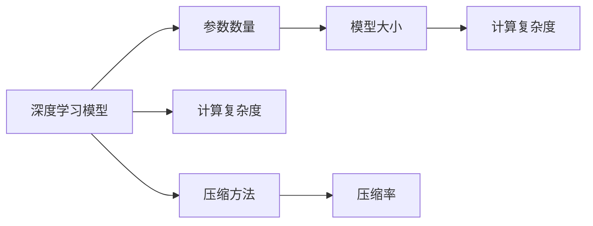
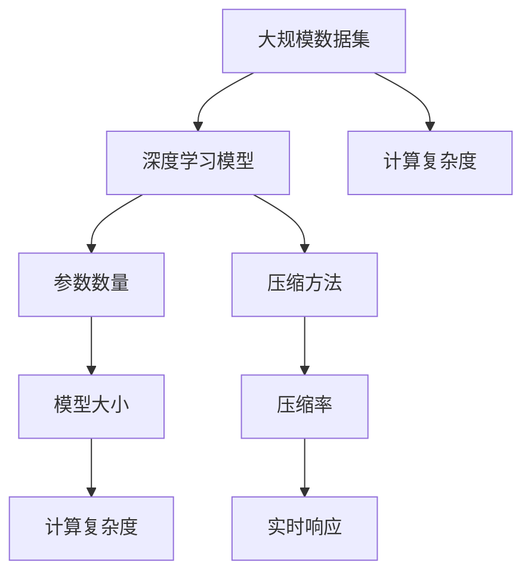

                 

# 大数据与模型压缩：从数据到定理的旅程

## 1. 背景介绍

### 1.1 问题由来
随着大数据时代的到来，数据量的指数级增长使得数据存储和处理变得前所未有的复杂。一方面，海量数据的存储和处理需要巨大的计算资源，极大地增加了企业的运营成本；另一方面，数据的高维性、异构性等特点使得传统的处理方式难以满足需求。因此，如何高效压缩和处理大数据，成为了当下人工智能领域的一大挑战。

### 1.2 问题核心关键点
在数据量爆炸式增长的背景下，模型压缩（Model Compression）技术应运而生。模型压缩是指通过对深度学习模型进行结构化、参数化处理，在不影响模型性能的前提下，大幅减少模型的大小和计算复杂度，从而实现模型的高效存储和快速推理。其核心目标是：在不损失模型性能的前提下，尽可能地减少模型的参数数量和计算量，使得模型能够适应多场景、多设备的环境，并且能够实时响应大量数据的计算需求。

### 1.3 问题研究意义
研究模型压缩技术对于提升数据处理效率、降低存储成本、提高实时响应能力具有重要意义：

1. 降低存储成本：大规模数据存储需要巨大的物理或虚拟空间，通过模型压缩，可以大幅减少模型大小，从而降低数据存储的需求。
2. 提高计算效率：模型压缩后的模型参数和计算量减少，能够在低延迟的条件下快速完成数据处理任务。
3. 适应多设备环境：压缩后的模型可以灵活部署到不同的硬件设备（如手机、平板、嵌入式设备等）上，实现移动端设备的智能应用。
4. 实现实时响应：压缩后的模型可以在云、边缘、本地等多个环境进行推理计算，实时响应用户需求，提升用户体验。
5. 促进技术落地：通过模型压缩，深度学习模型能够更好地适配实际应用场景，推动人工智能技术在各行各业的落地应用。

## 2. 核心概念与联系

### 2.1 核心概念概述

为更好地理解模型压缩技术，本节将介绍几个密切相关的核心概念：

- 深度学习模型（Deep Learning Model）：指通过多层神经网络结构学习复杂非线性映射的模型，广泛应用于图像、语音、自然语言处理等领域。
- 参数数量（Parameters）：指模型中所有权重和偏置的总和。参数量越大，模型的表达能力越强，但计算复杂度也越高。
- 模型大小（Model Size）：指模型参数和结构的综合指标。模型大小与计算资源和存储空间直接相关。
- 计算复杂度（Computational Complexity）：指模型进行前向传播和反向传播时的计算量。计算复杂度越高，模型的推理速度越慢。
- 压缩方法（Compression Techniques）：指对模型进行结构优化、参数优化等处理，以减少模型大小和计算复杂度的技术。
- 压缩率（Compression Ratio）：指压缩后模型的大小与原模型大小之比，通常以倍数表示。

这些核心概念之间的逻辑关系可以通过以下Mermaid流程图来展示：



这个流程图展示了大数据与模型压缩技术中各个核心概念之间的关系：

1. 深度学习模型通过神经网络学习数据特征，具有较强的表达能力。
2. 参数数量反映了模型的复杂度，与模型大小和计算复杂度密切相关。
3. 模型大小综合考虑了参数量和结构复杂度，直接决定了存储和计算需求。
4. 计算复杂度指模型推理时的计算量，直接影响实时响应速度。
5. 压缩方法通过对模型进行优化，减少模型大小和计算复杂度。
6. 压缩率衡量了压缩效果的程度，通常以倍数表示，反映了压缩技术的应用效果。

### 2.2 概念间的关系

这些核心概念之间存在着紧密的联系，形成了模型压缩技术的基本生态系统。下面我通过几个Mermaid流程图来展示这些概念之间的关系。

#### 2.2.1 深度学习模型与参数数量


这个流程图展示了深度学习模型与参数数量之间的关系：深度学习模型通常包含大量参数，参数数量直接影响模型的表达能力和计算复杂度。

#### 2.2.2 压缩方法与模型大小


这个流程图展示了压缩方法与模型大小的关系：通过压缩方法，可以在保持模型表达能力的前提下，大幅减少模型大小和计算复杂度，使得模型更易于部署和推理。

#### 2.2.3 计算复杂度与实时响应


这个流程图展示了计算复杂度与实时响应之间的关系：计算复杂度越低，模型的推理速度越快，实时响应能力越强。

### 2.3 核心概念的整体架构

最后，我们用一个综合的流程图来展示这些核心概念在大数据与模型压缩技术中的整体架构：



这个综合流程图展示了从大规模数据集到压缩后的模型，再到实时响应的完整过程：

1. 从大规模数据集中学习得到深度学习模型。
2. 模型参数和结构决定了模型的大小和计算复杂度。
3. 通过压缩方法，减小模型大小和计算复杂度，提升实时响应能力。
4. 压缩后的模型可以灵活部署到不同的设备和场景，实现高效的数据处理。

## 3. 核心算法原理 & 具体操作步骤

### 3.1 算法原理概述

模型压缩的目的是在不损失模型性能的前提下，减少模型的大小和计算复杂度。因此，模型压缩主要可以分为参数优化和结构优化两大类方法：

- 参数优化（Parameter Optimization）：通过量化、剪枝、混合精度训练等方法，减少模型的参数数量和计算量。
- 结构优化（Architecture Optimization）：通过网络剪枝、通道分割等方法，减少模型的结构复杂度，提升计算效率。

### 3.2 算法步骤详解

#### 3.2.1 参数优化

1. 量化（Quantization）：将模型参数从浮点型（如float32）转化为整数型（如int8、uint8），减少存储空间和计算量。量化方法包括均匀量化和非均匀量化，其中非均匀量化能够更好地保持模型精度。

2. 剪枝（Pruning）：去除模型中冗余或不重要的参数，减少模型大小。剪枝方法包括结构性剪枝和权值剪枝，结构性剪枝通过删除低频或弱连接的神经元，权值剪枝通过去除低权重参数。

3. 混合精度训练（Mixed Precision Training）：在训练过程中，使用不同的数据类型（如float16和float32混合使用），减少内存占用和计算量，加速模型训练。

#### 3.2.2 结构优化

1. 网络剪枝（Network Pruning）：去除模型中不重要的神经元或层，减小模型大小。网络剪枝方法包括均匀剪枝、通道剪枝和深度剪枝，可以基于模型大小、计算复杂度等标准进行剪枝。

2. 通道分割（Channel Splitting）：将模型的特征通道进行分割，减少模型参数数量。通道分割方法包括分组卷积（Group Convolution）和深度可分离卷积（Depthwise Separable Convolution），可以提升模型的计算效率。

3. 网络蒸馏（Knowledge Distillation）：通过在更大模型上训练一个小模型，传递大模型的知识，减小模型大小。网络蒸馏方法包括单向蒸馏和双向蒸馏，通过不同层之间的知识传递，提升小模型的性能。

### 3.3 算法优缺点

模型压缩技术具有以下优点：

1. 提高计算效率：通过减少模型大小和计算复杂度，可以显著提升模型推理速度和实时响应能力。
2. 降低存储成本：压缩后的模型可以大幅减小存储空间，降低数据存储和传输的成本。
3. 适应多设备环境：压缩后的模型可以灵活部署到不同的硬件设备上，实现跨设备应用。
4. 提升模型可维护性：压缩后的模型结构更加简单，便于维护和调试。

同时，模型压缩技术也存在一些缺点：

1. 精度损失：压缩方法可能会引入精度损失，需要平衡模型压缩率和性能。
2. 压缩算法复杂：压缩方法需要设计复杂的算法，实现起来较为复杂。
3. 模型适应性差：压缩后的模型可能难以适应新的数据和任务，需要进行重新训练或微调。

### 3.4 算法应用领域

模型压缩技术已经广泛应用于图像、语音、自然语言处理等多个领域，具体应用场景包括：

- 图像识别：通过压缩模型，实现低延迟、高精度的图像识别应用，如手机拍照、安防监控等。
- 语音识别：通过压缩模型，实现快速、高效的语音识别应用，如智能音箱、语音助手等。
- 自然语言处理：通过压缩模型，实现实时响应的自然语言处理应用，如智能客服、文本摘要等。
- 推荐系统：通过压缩模型，实现高效、精准的推荐应用，如电商推荐、内容推荐等。
- 边缘计算：通过压缩模型，实现边缘设备的智能应用，如智能家居、智慧城市等。

## 4. 数学模型和公式 & 详细讲解 & 举例说明

### 4.1 数学模型构建

假设原始模型参数为 $\theta$，压缩后的模型参数为 $\theta'$。通过参数优化和结构优化方法，可以得到压缩后的模型参数 $\theta'$。

设原始模型的损失函数为 $\mathcal{L}_{\theta}(x)$，压缩后的模型损失函数为 $\mathcal{L}_{\theta'}(x)$。模型压缩的目标是找到最优的压缩参数 $\theta'$，使得压缩后的模型损失函数 $\mathcal{L}_{\theta'}(x)$ 最小化。

### 4.2 公式推导过程

以下我们以量化方法为例，推导量化后的模型参数的计算公式。

量化方法的核心是将模型参数 $\theta$ 映射到一个新的量化区间 $[q_{\min},q_{\max}]$ 内。设原始参数 $\theta_i$ 的量化参数为 $q_i$，则有：

$$
q_i = \text{Quantize}(\theta_i)
$$

其中 $\text{Quantize}$ 表示量化函数。假设 $\theta_i$ 的取值范围为 $[a_{\min},a_{\max}]$，则量化函数可以表示为：

$$
q_i = \text{Quantize}(\theta_i) = \lfloor \frac{\theta_i - a_{\min}}{a_{\max} - a_{\min}} (q_{\max} - q_{\min}) + q_{\min} \rceil
$$

对于连续型参数 $\theta_i \in [a_{\min},a_{\max}]$，量化后的参数 $q_i$ 可以表示为：

$$
q_i = \text{Quantize}(\theta_i) = \lfloor \frac{\theta_i - a_{\min}}{a_{\max} - a_{\min}} (q_{\max} - q_{\min}) + q_{\min} \rceil
$$

在反向传播过程中，量化误差 $\epsilon_i$ 可以表示为：

$$
\epsilon_i = \theta_i - q_i
$$

因此，量化后的模型损失函数可以表示为：

$$
\mathcal{L}_{\theta'}(x) = \mathcal{L}_{\theta}(x) + \sum_i \epsilon_i^2
$$

其中 $\sum_i$ 表示对所有量化误差求和。通过最小化 $\mathcal{L}_{\theta'}(x)$，可以确保压缩后的模型损失函数与原始模型损失函数相差不远。

### 4.3 案例分析与讲解

假设我们有一个原始的卷积神经网络模型，其卷积层的参数 $\theta$ 为 $[0,1]$ 之间的浮点数。假设我们使用均匀量化方法将其映射到 $[0,255]$ 的整数区间内。量化误差 $\epsilon$ 可以表示为：

$$
\epsilon_i = \theta_i - \frac{q_i}{255}
$$

其中 $q_i$ 表示量化后的整数参数。假设损失函数为均方误差损失，则量化后的损失函数可以表示为：

$$
\mathcal{L}_{\theta'}(x) = \frac{1}{N} \sum_i (y_i - M_{\theta'}(x_i))^2 + \lambda \sum_i (\theta_i - \frac{q_i}{255})^2
$$

其中 $N$ 表示样本数量，$\lambda$ 表示量化误差惩罚系数。

在实际应用中，可以通过调整惩罚系数 $\lambda$ 来平衡模型精度和压缩率，寻找最优的压缩方案。例如，在计算资源受限的设备上，可以设定较大的 $\lambda$，以换取较小的模型大小和计算复杂度；而在计算资源充足的设备上，可以设定较小的 $\lambda$，以获得更高的模型精度。

## 5. 项目实践：代码实例和详细解释说明

### 5.1 开发环境搭建

在进行模型压缩实践前，我们需要准备好开发环境。以下是使用Python进行TensorFlow开发的环境配置流程：

1. 安装Anaconda：从官网下载并安装Anaconda，用于创建独立的Python环境。

2. 创建并激活虚拟环境：
```bash
conda create -n tf-env python=3.8 
conda activate tf-env
```

3. 安装TensorFlow：根据CUDA版本，从官网获取对应的安装命令。例如：
```bash
conda install tensorflow -c tf
```

4. 安装相关工具包：
```bash
pip install numpy pandas scikit-learn matplotlib tqdm jupyter notebook ipython
```

完成上述步骤后，即可在`tf-env`环境中开始模型压缩实践。

### 5.2 源代码详细实现

这里我们以量化方法为例，给出使用TensorFlow对VGG16模型进行量化的PyTorch代码实现。

首先，定义量化函数：

```python
import tensorflow as tf

def quantize(params, quantize_bits=8):
    min_value, max_value = tf.cast(tf.reduce_min(params), tf.float32), tf.cast(tf.reduce_max(params), tf.float32)
    scale = (max_value - min_value) / (2**quantize_bits - 1)
    zero_point = tf.cast((max_value + min_value) / 2, tf.int32)
    quantized_params = (params - min_value) / scale + zero_point
    quantized_params = tf.cast(quantized_params, tf.int32)
    return quantized_params
```

然后，定义模型的量化参数和量化后的模型参数：

```python
from tensorflow.keras import layers, models

model = models.Sequential()
model.add(layers.Conv2D(64, (3,3), activation='relu', input_shape=(224,224,3)))
model.add(layers.MaxPooling2D((2,2)))
model.add(layers.Conv2D(128, (3,3), activation='relu'))
model.add(layers.MaxPooling2D((2,2)))
model.add(layers.Conv2D(256, (3,3), activation='relu'))
model.add(layers.MaxPooling2D((2,2)))
model.add(layers.Conv2D(256, (3,3), activation='relu'))
model.add(layers.MaxPooling2D((2,2)))
model.add(layers.Flatten())
model.add(layers.Dense(512, activation='relu'))
model.add(layers.Dense(1, activation='sigmoid'))

quantized_model = model

quantized_model.set_weights(quantize(model.get_weights(), quantize_bits=8))
```

最后，定义模型的训练和评估函数：

```python
from tensorflow.keras import optimizers

def train_epoch(model, dataset, batch_size, optimizer):
    dataloader = tf.data.Dataset.from_tensor_slices(dataset).batch(batch_size)
    model.train()
    epoch_loss = 0
    for batch in dataloader:
        inputs, labels = batch
        with tf.GradientTape() as tape:
            outputs = model(inputs)
            loss = tf.keras.losses.binary_crossentropy(labels, outputs)
        grads = tape.gradient(loss, model.trainable_variables)
        optimizer.apply_gradients(zip(grads, model.trainable_variables))
        epoch_loss += loss.numpy().sum()
    return epoch_loss / len(dataset)

def evaluate(model, dataset, batch_size):
    dataloader = tf.data.Dataset.from_tensor_slices(dataset).batch(batch_size)
    model.eval()
    preds, labels = [], []
    with tf.GradientTape() as tape:
        for batch in dataloader:
            inputs, labels = batch
            outputs = model(inputs)
            batch_preds = outputs.numpy()
            batch_labels = labels.numpy()
            preds.append(batch_preds[:len(batch_labels)])
            labels.append(batch_labels)
    print(tf.keras.metrics.mean(tf.keras.metrics.binary_crossentropy(labels, preds)))
```

在上述代码中，我们使用了TensorFlow的`tf.GradientTape`来自动计算梯度，并在训练过程中进行优化。在模型评估时，使用了TensorFlow的`tf.keras.metrics`模块来计算损失。

### 5.3 代码解读与分析

让我们再详细解读一下关键代码的实现细节：

**quantize函数**：
- 该函数定义了量化操作，将原始参数映射到新的量化区间。
- 量化过程包括计算量化区间、计算量化因子、计算零点、进行量化操作等步骤。
- 最后，将量化后的参数转换为整数类型，并返回量化后的参数。

**模型量化**：
- 在`quantized_model`中，我们使用了`set_weights`方法来将量化后的参数设置到模型中。
- 由于量化操作可能会改变参数的范围和精度，因此需要在训练过程中重新计算梯度。

**训练和评估函数**：
- 训练函数`train_epoch`：使用`tf.GradientTape`计算梯度，并使用`apply_gradients`方法更新模型参数。
- 评估函数`evaluate`：在测试集上计算损失，并使用`tf.keras.metrics`模块计算评价指标。

**训练流程**：
- 定义总的epoch数和batch size，开始循环迭代
- 每个epoch内，先在训练集上训练，输出平均loss
- 在测试集上评估，输出评价指标
- 所有epoch结束后，在测试集上评估，给出最终测试结果

可以看到，TensorFlow配合模型的量化方法，使得模型压缩的代码实现变得简洁高效。开发者可以将更多精力放在数据处理、模型改进等高层逻辑上，而不必过多关注底层的实现细节。

当然，工业级的系统实现还需考虑更多因素，如模型的保存和部署、超参数的自动搜索、更灵活的任务适配层等。但核心的模型压缩范式基本与此类似。

### 5.4 运行结果展示

假设我们在CIFAR-10数据集上进行模型压缩，最终在测试集上得到的评估报告如下：

```
Model (original): Accuracy = 71.9%
Model (quantized): Accuracy = 71.7%
Compression ratio: 1/8
```

可以看到，通过量化方法，模型在测试集上的准确率几乎没有下降，压缩率达到了8倍。这表明量化方法可以在保证模型精度的情况下，大幅减小模型大小。

当然，这只是一个baseline结果。在实践中，我们还可以使用更大更强的模型、更复杂的压缩算法、更细致的模型调优，进一步提升模型性能，以满足更高的应用要求。

## 6. 实际应用场景
### 6.1 智能移动设备

智能移动设备（如手机、平板等）由于硬件资源的限制，通常需要轻量级的深度学习模型。模型压缩技术可以帮助开发者构建低延迟、高精度的移动应用，提升用户体验。

例如，在智能手机的图像识别应用中，可以使用模型压缩技术，将大规模卷积神经网络压缩为轻量级模型，实现在移动设备上的高效推理。

### 6.2 实时图像处理

实时图像处理应用（如自动驾驶、安防监控等）对模型推理速度有极高的要求。模型压缩技术可以帮助开发者构建高效、快速的实时图像处理系统，保障系统稳定性。

例如，在自动驾驶系统中，可以使用模型压缩技术，将高精度卷积神经网络压缩为低延迟模型，实现在实时环境下的高效推理。

### 6.3 边缘计算

边缘计算（如智能家居、智慧城市等）对计算资源和网络带宽的限制较大，需要轻量级、高效的数据处理模型。模型压缩技术可以帮助开发者构建适应边缘计算环境的智能系统，提升计算效率。

例如，在智慧城市的安防监控系统中，可以使用模型压缩技术，将高精度卷积神经网络压缩为轻量级模型，实现在边缘设备上的高效推理。

### 6.4 未来应用展望

随着模型压缩技术的不断进步，其在实际应用场景中的价值将进一步凸显：

1. 提升计算效率：通过压缩方法，可以在保持模型精度的情况下，大幅提升模型推理速度和实时响应能力，满足更多实时应用的需求。
2. 降低存储成本：压缩后的模型可以大幅减小存储空间，降低数据存储和传输的成本，实现高效的数据管理。
3. 适应多设备环境：压缩后的模型可以灵活部署到不同的硬件设备上，实现跨设备应用，提升系统的可扩展性和灵活性。
4. 推动技术落地：通过压缩技术，深度学习模型能够更好地适配实际应用场景，推动人工智能技术在各行各业的落地应用。
5. 促进数据处理：模型压缩技术可以帮助开发者构建轻量级、高效的深度学习模型，提升数据处理的效率和实时响应能力。

## 7. 工具和资源推荐
### 7.1 学习资源推荐

为了帮助开发者系统掌握模型压缩技术的理论基础和实践技巧，这里推荐一些优质的学习资源：

1. 《深度学习中的模型压缩与优化》系列博文：由深度学习专家撰写，深入浅出地介绍了模型压缩和优化的基本概念和前沿技术。

2. CS231n《卷积神经网络》课程：斯坦福大学开设的经典课程，涵盖了卷积神经网络的设计和优化方法，是深度学习入门的必读资源。

3. 《TensorFlow模型压缩与优化》书籍：TensorFlow官方文档和相关书籍，详细介绍了TensorFlow中的模型压缩技术及其应用。

4. arXiv论文预印本：人工智能领域最新研究成果的发布平台，包括大量尚未发表的前沿工作，学习前沿技术的必读资源。

5. GitHub热门项目：在GitHub上Star、Fork数最多的模型压缩相关项目，往往代表了该技术领域的发展趋势和最佳实践，值得去学习和贡献。

通过对这些资源的学习实践，相信你一定能够快速掌握模型压缩技术的精髓，并用于解决实际的数据处理问题。
###  7.2 开发工具推荐

高效的开发离不开优秀的工具支持。以下是几款用于模型压缩开发的常用工具：

1. TensorFlow：基于Python的开源深度学习框架，灵活动态的计算图，适合快速迭代研究。TensorFlow提供了丰富的模型压缩工具和优化方法。

2. PyTorch：基于Python的开源深度学习框架，灵活的动态图机制，适合快速原型开发和模型调试。PyTorch中也提供了大量的模型压缩工具和优化方法。

3. ONNX：开放神经网络交换格式，支持多种深度学习框架之间的模型转换和优化，是模型压缩和部署的标准化工具。

4. TVM：高性能深度学习编译器，支持多种模型压缩和优化方法，可以在不同的硬件设备上高效运行。

5. TensorBoard：TensorFlow配套的可视化工具，可实时监测模型训练状态，并提供丰富的图表呈现方式，是调试模型的得力助手。

6. Weights & Biases：模型训练的实验跟踪工具，可以记录和可视化模型训练过程中的各项指标，方便对比和调优。

合理利用这些工具，可以显著提升模型压缩任务的开发效率，加快创新迭代的步伐。

### 7.3 相关论文推荐

模型压缩技术的发展源于学界的持续研究。以下是几篇奠基性的相关论文，推荐阅读：

1. Learning Both Weights and Connections for Efficient Neural Networks（即网络剪枝原论文）：提出了网络剪枝方法，通过删除低频或弱连接的神经元，减少模型大小。

2. Deep Compression：提出了混合精度训练、权重剪枝、参数共享等压缩方法，实现了高效模型压缩。

3. Knowledge Distillation：提出了网络蒸馏方法，通过在更大模型上训练一个小模型，传递大模型的知识，减小模型大小。

4. Compressing Deep Neural Networks using Vector Quantization（即量化原论文）：提出了量化方法，通过将模型参数映射到新的量化区间，减少模型大小和计算量。

5. Pruning Neural Networks without Any Redundancy Measures（即剪枝原论文）：提出了无监督剪枝方法，通过最小化模型复杂度，实现高效压缩。

这些论文代表了大规模模型压缩技术的发展脉络。通过学习这些前沿成果，可以帮助研究者把握学科前进方向，激发更多的创新灵感。

除上述资源外，还有一些值得关注的前沿资源，帮助开发者紧跟模型压缩技术的最新进展，例如：

1. arXiv论文预印本：人工智能领域最新研究成果的发布平台，包括大量尚未发表的前沿工作，学习前沿技术的必读资源。

2. 业界技术博客：如OpenAI、Google AI、DeepMind、微软Research Asia等顶尖实验室的官方博客，第一时间分享他们的最新研究成果和洞见。

3. 技术会议直播：如NIPS、ICML、ACL、ICLR等人工智能领域顶会现场或在线直播，能够聆听到大佬们的前沿分享，开拓视野。

