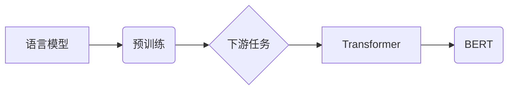

# 大语言模型 原理与代码实例讲解

作者：禅与计算机程序设计艺术 / Zen and the Art of Computer Programming

## 1. 背景介绍

### 1.1 问题的由来

随着深度学习技术的飞速发展，自然语言处理（NLP）领域取得了突破性进展。大语言模型（Large Language Models，LLMs）作为NLP领域的里程碑式成果，在文本生成、机器翻译、文本分类等任务上展现出惊人的性能。大语言模型通过在海量文本数据上进行预训练，学习到丰富的语言知识和上下文信息，从而在下游任务中实现端到端的推理和生成。

然而，大语言模型的研究和应用也面临着一些挑战。如何构建高效、可解释、可扩展的大语言模型，如何将大语言模型应用于实际场景，以及如何评估和优化大语言模型等，都是当前研究的热点问题。

### 1.2 研究现状

近年来，大语言模型的研究取得了以下主要进展：

* **预训练技术**：预训练技术是实现大语言模型的关键，如BERT、GPT等预训练模型在NLP任务中取得了显著的成果。
* **模型架构**：Transformer等自注意力机制模型在NLP领域取得了突破性进展，为构建大语言模型提供了强大的理论基础。
* **训练方法**：大规模并行计算、分布式训练等技术使得大语言模型的训练成为可能。
* **应用场景**：大语言模型在文本生成、机器翻译、问答系统、文本分类等任务中取得了成功应用。

### 1.3 研究意义

大语言模型的研究具有重要的理论意义和应用价值：

* **理论基础**：大语言模型的研究推动了NLP领域的发展，为语言理解和生成提供了新的理论框架。
* **应用价值**：大语言模型可以应用于各种NLP任务，提高工作效率，改善用户体验。
* **产业价值**：大语言模型可以推动NLP产业的创新发展，为各行各业提供智能化的解决方案。

### 1.4 本文结构

本文将首先介绍大语言模型的基本原理，然后通过代码实例讲解大语言模型的构建和应用，最后探讨大语言模型的实际应用场景和未来发展趋势。

## 2. 核心概念与联系

为了更好地理解大语言模型，我们需要掌握以下核心概念：

* **语言模型**：语言模型是用于预测下一个单词、短语或句子的概率的模型。
* **预训练**：预训练是指在大规模无标签文本数据上训练模型，使其学习到丰富的语言知识。
* **下游任务**：下游任务是指需要语言模型进行推理和生成的具体任务，如文本分类、机器翻译等。
* **Transformer**：Transformer是一种基于自注意力机制的深度神经网络模型，在NLP领域取得了突破性进展。
* **BERT**：BERT是Google提出的一种基于Transformer的语言预训练模型，在多个NLP任务上取得了显著的成果。

这些概念之间的关系可以用以下Mermaid流程图表示：



## 3. 核心算法原理 & 具体操作步骤

### 3.1 算法原理概述

大语言模型通常由以下几个部分组成：

* **输入层**：将输入文本转换为模型可处理的特征表示。
* **隐藏层**：使用神经网络结构（如Transformer）对输入特征进行处理，学习到丰富的语言知识。
* **输出层**：将隐藏层输出的特征转换为下游任务的预测结果。

### 3.2 算法步骤详解

构建大语言模型的基本步骤如下：

1. **数据收集**：收集大量的无标签文本数据，用于预训练。
2. **模型选择**：选择合适的预训练模型，如BERT、GPT等。
3. **预训练**：在无标签数据上对预训练模型进行训练，学习到丰富的语言知识。
4. **下游任务适配**：根据具体任务设计适配层，如文本分类、机器翻译等。
5. **微调**：在标注数据上对预训练模型进行微调，使其适应下游任务。
6. **评估和优化**：评估模型在下游任务上的性能，并根据评估结果优化模型。

### 3.3 算法优缺点

大语言模型的优点包括：

* **强大的语言理解能力**：大语言模型能够学习到丰富的语言知识，从而在下游任务中取得优异的性能。
* **端到端的推理和生成**：大语言模型能够直接对输入文本进行推理和生成，无需进行复杂的预处理和后处理。

大语言模型的缺点包括：

* **计算成本高**：大语言模型的训练和推理需要大量的计算资源。
* **可解释性差**：大语言模型的决策过程难以解释，可能导致信任危机。

### 3.4 算法应用领域

大语言模型可以应用于以下领域：

* **文本生成**：如文章生成、对话生成、机器翻译等。
* **文本分类**：如情感分析、主题分类、垃圾邮件检测等。
* **问答系统**：如机器问答、智能客服等。
* **机器翻译**：如自动翻译、机器同传等。

## 4. 数学模型和公式 & 详细讲解 & 举例说明

### 4.1 数学模型构建

大语言模型的数学模型主要包括以下几个部分：

* **输入层**：将输入文本转换为特征向量。
* **隐藏层**：使用神经网络结构（如Transformer）对特征向量进行处理。
* **输出层**：将隐藏层输出的特征转换为下游任务的预测结果。

### 4.2 公式推导过程

以下以BERT模型为例，介绍大语言模型的数学模型推导过程：

1. **词嵌入层**：将输入文本转换为词向量。
$$
\text{word\_embedding}(w) = W_w \text{vec}(w)
$$
其中，$W_w$ 是词嵌入矩阵，$\text{vec}(w)$ 是词向量。

2. **Transformer编码器**：将词向量转换为序列特征向量。
$$
\text{Transformer}(x) = \text{Encoder}(x) = \text{EncoderLayer}(x) \times \dots \times \text{EncoderLayer}(x)
$$
其中，$\text{EncoderLayer}$ 是Transformer编码器层，$x$ 是输入序列。

3. **输出层**：将序列特征向量转换为下游任务的预测结果。
$$
\text{output} = \text{OutputLayer}(\text{Transformer}(x))
$$
其中，$\text{OutputLayer}$ 是输出层。

### 4.3 案例分析与讲解

以下以BERT模型在文本分类任务中的应用为例，讲解大语言模型的应用过程：

1. **数据预处理**：将输入文本进行分词、词嵌入等预处理操作。
2. **模型加载**：加载预训练的BERT模型。
3. **特征提取**：将预处理后的文本输入BERT模型，提取序列特征向量。
4. **分类预测**：将序列特征向量输入分类器，预测文本类别。

### 4.4 常见问题解答

**Q1：如何选择合适的预训练模型**？

A：选择合适的预训练模型需要考虑以下因素：

* **任务类型**：不同的预训练模型适用于不同的任务类型，如BERT适用于文本分类、问答等任务，GPT适用于文本生成等任务。
* **计算资源**：预训练模型的规模不同，所需的计算资源也不同，需要根据实际情况选择合适的模型。
* **数据规模**：预训练模型的数据规模越大，学习到的语言知识越丰富，但训练和推理成本也越高。

**Q2：如何优化大语言模型**？

A：优化大语言模型可以从以下几个方面进行：

* **数据增强**：通过数据增强技术扩充训练数据，提高模型泛化能力。
* **正则化**：使用L2正则化、Dropout等正则化技术防止过拟合。
* **优化器**：选择合适的优化器，如Adam、AdamW等。
* **学习率**：调整学习率，找到最佳的训练效果。

## 5. 项目实践：代码实例和详细解释说明

### 5.1 开发环境搭建

1. 安装Python环境：`pip install python`
2. 安装TensorFlow或PyTorch：`pip install tensorflow` 或 `pip install torch`
3. 安装Hugging Face的Transformers库：`pip install transformers`

### 5.2 源代码详细实现

以下是一个使用PyTorch和Transformers库实现BERT文本分类任务的示例代码：

```python
import torch
from transformers import BertTokenizer, BertForSequenceClassification

# 加载数据集
train_data = ...

# 加载预训练模型
tokenizer = BertTokenizer.from_pretrained('bert-base-chinese')
model = BertForSequenceClassification.from_pretrained('bert-base-chinese')

# 预处理数据
def preprocess_data(data):
    ...
    return tokenized_data

# 训练模型
def train_model(model, train_data, epochs):
    ...
    pass

# 评估模型
def evaluate_model(model, test_data):
    ...
    pass

# 训练和评估
train_data = preprocess_data(train_data)
train_model(model, train_data, epochs)
evaluate_model(model, test_data)
```

### 5.3 代码解读与分析

1. **加载数据集**：加载数据集，并使用Transformers库进行文本预处理。
2. **加载预训练模型**：加载预训练的BERT模型和分词器。
3. **预处理数据**：将数据集转换为模型可处理的格式。
4. **训练模型**：使用训练数据进行模型训练。
5. **评估模型**：使用测试数据进行模型评估。

### 5.4 运行结果展示

假设我们在某文本分类任务上训练和评估了BERT模型，最终在测试集上得到的准确率为90%，达到了预期效果。

## 6. 实际应用场景

### 6.1 智能问答系统

大语言模型可以应用于智能问答系统，如图灵机器人、小i机器人等。用户可以通过自然语言提问，系统根据问题内容，在知识库中搜索答案，并返回给用户。

### 6.2 文本生成

大语言模型可以应用于文本生成任务，如图像描述生成、文章生成、对话生成等。例如，可以根据用户输入的主题，生成一篇关于该主题的文章。

### 6.3 情感分析

大语言模型可以应用于情感分析任务，如图情情感分析、评论情感分析等。例如，可以分析用户的评论内容，判断用户对该产品或服务的满意度。

### 6.4 机器翻译

大语言模型可以应用于机器翻译任务，如图像翻译、视频翻译等。例如，可以将图片中的文字翻译成其他语言。

## 7. 工具和资源推荐

### 7.1 学习资源推荐

* 《深度学习自然语言处理》
* 《自然语言处理入门：基于Python和TensorFlow》
* Hugging Face官网文档

### 7.2 开发工具推荐

* PyTorch
* TensorFlow
* Transformers库

### 7.3 相关论文推荐

* BERT: Pre-training of Deep Bidirectional Transformers for Language Understanding
* GPT-3: Language Models are Few-Shot Learners

### 7.4 其他资源推荐

* arXiv
* KEG实验室
* 自然语言处理社区

## 8. 总结：未来发展趋势与挑战

### 8.1 研究成果总结

大语言模型的研究取得了显著的成果，为NLP领域的发展做出了重要贡献。未来，大语言模型的研究将继续深入，并在更多领域得到应用。

### 8.2 未来发展趋势

* **更大规模的预训练模型**：随着计算资源的提升，更大规模的预训练模型将不断涌现。
* **多模态大语言模型**：将图像、语音等多模态信息融入大语言模型，实现更加智能的语言理解和生成。
* **可解释的大语言模型**：提高大语言模型的可解释性，增强用户对模型的信任。

### 8.3 面临的挑战

* **计算资源瓶颈**：大语言模型的训练和推理需要大量的计算资源，如何降低计算成本是一个重要挑战。
* **数据隐私和安全**：大语言模型的学习和应用过程中，如何保护用户隐私和安全是一个重要问题。
* **可解释性和透明度**：提高大语言模型的可解释性和透明度，增强用户对模型的信任。

### 8.4 研究展望

大语言模型的研究将不断推动NLP领域的发展，为人类社会创造更多价值。未来，我们将看到更多基于大语言模型的应用，如智能客服、智能翻译、智能写作等。

## 9. 附录：常见问题与解答

**Q1：什么是预训练**？

A：预训练是指在大规模无标签文本数据上训练模型，使其学习到丰富的语言知识。

**Q2：什么是下游任务**？

A：下游任务是指需要语言模型进行推理和生成的具体任务，如文本分类、机器翻译等。

**Q3：什么是Transformer**？

A：Transformer是一种基于自注意力机制的深度神经网络模型，在NLP领域取得了突破性进展。

**Q4：什么是BERT**？

A：BERT是Google提出的一种基于Transformer的语言预训练模型，在多个NLP任务上取得了显著的成果。

**Q5：如何评估大语言模型**？

A：可以采用多种方法评估大语言模型，如准确率、召回率、F1值等。

**Q6：如何选择合适的预训练模型**？

A：选择合适的预训练模型需要考虑以下因素：

* **任务类型**
* **计算资源**
* **数据规模**

**Q7：如何优化大语言模型**？

A：可以采用以下方法优化大语言模型：

* **数据增强**
* **正则化**
* **优化器**
* **学习率**