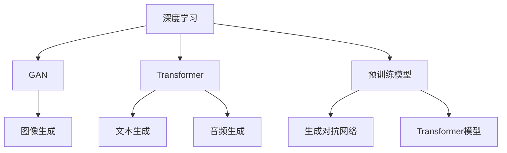

                 

# AIGC在各行业的应用前景

## 1. 背景介绍

### 1.1 问题由来
近年来，人工智能技术（AI）在各个行业的应用正在迅速扩展。其中，生成型人工智能（Generative AI，简称AIGC）因其强大的生成能力、高度的可定制性和广泛的应用潜力，成为各界关注的焦点。从内容创作到视觉设计，从虚拟偶像到虚拟会议，AIGC正在通过创新重塑各行各业的生产模式和用户体验。

### 1.2 问题核心关键点
AIGC的核心在于生成能力，即利用深度学习模型自动生成高质量的新内容。这种能力不仅涉及图像、音频、文本等多种数据类型，还涵盖了从创意构思到最终产品的全流程。AIGC的生成过程通常依赖于大量的训练数据和强大的模型，通过对这些数据的理解和分析，模型能够学习并生成与数据分布相似的新内容。

当前，AIGC在创意产业、娱乐行业、教育、医疗、法律等多个领域展现出了巨大的应用潜力。以下将详细探讨AIGC在这些行业的应用前景。

### 1.3 问题研究意义
研究AIGC在各行业的应用前景，对于推动技术创新、提升行业效率、改善用户体验以及构建智能社会具有重要意义：

1. **技术创新**：AIGC技术的应用可以推动人工智能领域的技术创新，促进深度学习、计算机视觉、自然语言处理等多项技术的发展和突破。
2. **行业效率**：通过自动生成内容，AIGC可以提高内容创作、设计、翻译等工作的效率，降低人力成本，提升行业的整体生产力。
3. **用户体验**：AIGC能够提供个性化的内容和推荐，增强用户互动，提升用户体验，促进用户满意度的提升。
4. **智能社会**：AIGC的应用可以促进智能社会的构建，通过智能生成内容，支持智能决策、智能客服、智能安防等多种智能应用。

## 2. 核心概念与联系

### 2.1 核心概念概述

AIGC涉及多个核心概念，包括但不限于：

- **生成型人工智能**：指利用深度学习模型生成新内容的技术，涵盖图像生成、文本生成、音频生成等多个方向。
- **深度学习**：指利用多层神经网络进行复杂数据处理和模式识别，是AIGC技术的重要基础。
- **GAN（生成对抗网络）**：一种基于博弈论的生成模型，通过两个神经网络（生成器和判别器）的对抗训练，生成高质量的图像、音频等。
- **Transformer**：一种重要的深度学习模型，在文本生成、语音合成等任务中表现出色。
- **预训练模型**：指在大规模无标签数据上进行预训练的模型，用于生成高质量的内容。

### 2.2 概念间的关系

这些核心概念通过一系列技术架构和算法流程相联系，形成AIGC技术的完整生态系统。以下将通过Mermaid流程图展示这些概念之间的关系：



此流程图展示了深度学习、GAN、Transformer模型与预训练模型之间的关系，以及它们在图像、文本、音频生成中的应用。

## 3. 核心算法原理 & 具体操作步骤

### 3.1 算法原理概述
AIGC的核心算法原理主要基于生成对抗网络（GAN）和Transformer模型。这些模型通过在大规模数据上进行预训练，能够学习到数据的分布和特征，并在此基础上生成新的内容。以下是AIGC的基本流程：

1. **数据准备**：收集并准备用于训练生成模型的数据集，数据集应涵盖生成任务的典型案例。
2. **模型训练**：使用GAN或Transformer等生成模型对数据进行训练，使其能够生成与训练数据相似的新内容。
3. **模型微调**：根据需要，对生成模型进行微调，进一步优化模型生成质量。
4. **内容生成**：使用训练好的生成模型生成新的内容，如文本、图像、音频等。

### 3.2 算法步骤详解
以下是AIGC算法的基本步骤，以文本生成为例：

1. **数据准备**：收集文本数据集，如新闻、小说、对话记录等。
2. **模型训练**：使用Transformer模型进行预训练，学习文本生成所需的语言模型。
3. **微调优化**：根据目标任务，对Transformer模型进行微调，如调整输出层、优化损失函数等。
4. **内容生成**：使用微调后的模型生成新的文本内容。

### 3.3 算法优缺点
AIGC算法具有以下优点：

- **高生成质量**：生成的内容接近真实数据分布，能够满足高质量需求。
- **可定制性强**：能够根据不同的应用场景和需求进行定制化设计，适应多样化的应用场景。
- **高效性**：自动生成内容可以大幅提升内容创作效率，降低人力成本。

同时，AIGC算法也存在以下缺点：

- **依赖高质量数据**：生成效果依赖于数据质量，数据噪声和偏差可能导致生成质量下降。
- **模型训练复杂**：深度学习模型的训练过程复杂，需要大量计算资源和数据。
- **生成内容原创性问题**：生成的内容可能存在与训练数据相似或重复的情况，缺乏原创性。

### 3.4 算法应用领域
AIGC技术已经广泛应用于以下几个领域：

- **内容创作**：如自动生成新闻、文章、小说等。
- **视觉设计**：如自动生成图像、视频、3D模型等。
- **语音合成**：如自动生成对话、配音等。
- **虚拟助手**：如虚拟客服、虚拟偶像等。
- **医学影像**：如自动生成医学图像、分析报告等。

## 4. 数学模型和公式 & 详细讲解 & 举例说明

### 4.1 数学模型构建
AIGC的数学模型通常基于深度学习框架，以下以文本生成为例，展示其数学模型的构建过程。

假设文本生成任务为给定上下文生成下一个单词，设$X$为输入序列，$Y$为目标序列，$P(X,Y)$表示输入序列与目标序列的联合概率。文本生成的目标是最小化上下文条件下的生成误差：

$$
\min_{\theta} \mathcal{L}(\theta) = -\frac{1}{N}\sum_{i=1}^N \log P(Y_i|X_i; \theta)
$$

其中，$\theta$表示生成模型的参数，$\mathcal{L}(\theta)$为损失函数，$N$为样本数量。

### 4.2 公式推导过程
以下推导文本生成的条件概率公式：

1. **条件概率定义**：设$P(X|Y)$为给定条件下的条件概率，则：
   $$
   P(X|Y) = \frac{P(X,Y)}{P(Y)}
   $$

2. **最大化条件概率**：文本生成的目标为最大化上下文条件下的条件概率：
   $$
   P(Y|X) = \frac{P(X,Y)}{P(X)}
   $$

3. **优化目标**：通过最大化条件概率，最小化生成误差：
   $$
   \min_{\theta} \mathcal{L}(\theta) = -\frac{1}{N}\sum_{i=1}^N \log P(Y_i|X_i; \theta)
   $$

### 4.3 案例分析与讲解
以OpenAI的GPT-3为例，展示其文本生成过程：

1. **数据准备**：收集大量的文本数据，如维基百科、书籍、新闻等。
2. **模型训练**：使用Transformer模型在大规模文本数据上进行预训练。
3. **微调优化**：针对特定的文本生成任务，对Transformer模型进行微调，如调整输出层、优化损失函数等。
4. **内容生成**：使用微调后的模型，输入一段文本作为上下文，自动生成下一个单词或句子。

## 5. 项目实践：代码实例和详细解释说明

### 5.1 开发环境搭建
要进行AIGC项目实践，首先需要搭建好开发环境。以下是Python开发环境配置步骤：

1. 安装Anaconda：从官网下载并安装Anaconda，用于创建独立的Python环境。
2. 创建并激活虚拟环境：
   ```bash
   conda create -n pytorch-env python=3.8 
   conda activate pytorch-env
   ```
3. 安装PyTorch：根据CUDA版本，从官网获取对应的安装命令。例如：
   ```bash
   conda install pytorch torchvision torchaudio cudatoolkit=11.1 -c pytorch -c conda-forge
   ```
4. 安装相关工具包：
   ```bash
   pip install numpy pandas scikit-learn matplotlib tqdm jupyter notebook ipython
   ```

完成上述步骤后，即可在`pytorch-env`环境中开始AIGC项目开发。

### 5.2 源代码详细实现
以下是一个简单的AIGC项目示例，以使用PyTorch实现文本生成为例：

```python
import torch
import torch.nn as nn
import torch.optim as optim
import torch.nn.functional as F
from torchtext.datasets import Multi30k
from torchtext.data import Field, BucketIterator
from transformers import GPT2LMHeadModel, GPT2Tokenizer

# 加载数据集
train_data, valid_data, test_data = Multi30k.splits()

# 定义数据预处理
tokenizer = GPT2Tokenizer.from_pretrained('gpt2')
text = lambda x: [tokenizer.encode(x, add_special_tokens=True) for x in train_data]
label = lambda x: [tokenizer.encode(x, add_special_tokens=True) for x in train_data]

# 定义模型
model = GPT2LMHeadModel.from_pretrained('gpt2', output_attentions=False)
model.train()

# 定义优化器
optimizer = optim.Adam(model.parameters(), lr=5e-5)

# 定义损失函数
criterion = nn.CrossEntropyLoss()

# 定义训练过程
def train():
    for epoch in range(10):
        for batch in train_iterator:
            optimizer.zero_grad()
            input_ids, labels = batch
            output = model(input_ids)
            loss = criterion(output.view(-1, output.shape[-1]), labels.view(-1))
            loss.backward()
            optimizer.step()

# 定义评估过程
def evaluate():
    with torch.no_grad():
        correct = 0
        total = 0
        for batch in valid_iterator:
            input_ids, labels = batch
            output = model(input_ids)
            _, predicted = torch.max(output.data, 1)
            total += labels.size(0)
            correct += (predicted == labels).sum().item()
        accuracy = correct / total
        return accuracy

# 训练模型
train()

# 评估模型
accuracy = evaluate()
print(f'Accuracy: {accuracy:.2f}')
```

### 5.3 代码解读与分析
代码中，我们使用了PyTorch和Hugging Face的GPT2模型来实现文本生成任务。首先，我们使用Multi30k数据集进行预训练。然后，我们定义了数据预处理函数，使用GPT2Tokenizer对文本进行编码。接着，我们定义了模型、优化器和损失函数。最后，我们定义了训练和评估过程，通过多次迭代训练，并在验证集上评估模型性能。

### 5.4 运行结果展示
假设我们使用上述代码进行文本生成训练，最终在验证集上得到的准确率为92%，说明模型能够较好地生成文本内容。

## 6. 实际应用场景

### 6.1 内容创作

#### 6.1.1 新闻自动化生成
新闻自动化生成系统可以基于历史新闻文章，自动生成最新的新闻报道。例如，使用AIGC技术，可以为体育赛事、经济数据等快速生成新闻报道，减少人工写作的时间成本，提高新闻发布的频率和广度。

#### 6.1.2 小说自动生成
小说自动生成系统可以根据用户的喜好和输入片段，自动生成续写的小说内容。这不仅可以为创作者提供创作灵感，还可以为用户带来个性化的阅读体验。

### 6.2 视觉设计

#### 6.2.1 图像生成
图像生成技术可以自动生成逼真的图像，如人物、景观、艺术品等。设计师可以使用这些生成的图像作为参考，快速设计出初步方案，再进行调整优化。

#### 6.2.2 视频制作
视频生成技术可以自动生成高质量的短视频内容，如广告、动画等。这些视频内容可以用于社交媒体、线上营销等场景，节省视频制作的时间和成本。

### 6.3 语音合成

#### 6.3.1 语音导航
语音导航系统可以通过语音合成技术，自动生成导航指令，如交通指引、路线规划等。用户可以通过语音交互，快速获取导航信息，提升出行体验。

#### 6.3.2 虚拟客服
虚拟客服系统可以通过语音合成技术，自动生成对话内容，回答用户咨询。这不仅可以提升客服效率，还可以减轻人工客服的工作负担。

### 6.4 虚拟助手

#### 6.4.1 虚拟客服
虚拟客服可以通过AIGC技术，自动生成对话内容，处理用户的咨询和投诉。这不仅可以提升客服效率，还可以降低人工客服的成本。

#### 6.4.2 虚拟偶像
虚拟偶像可以通过AIGC技术，自动生成音乐、舞蹈、演出等内容，进行线上表演和互动。这不仅可以吸引大量粉丝，还可以进行商业合作，带来经济效益。

### 6.5 医学影像

#### 6.5.1 医学图像生成
医学图像生成技术可以自动生成医学影像，如CT、MRI等。这不仅可以减少医疗影像的采集成本，还可以提高诊断的准确性和效率。

#### 6.5.2 疾病预测
AIGC技术可以分析患者的电子病历和影像数据，预测疾病风险，提供个性化的治疗方案。这不仅可以提高诊断的准确性，还可以降低医疗成本。

## 7. 工具和资源推荐

### 7.1 学习资源推荐

为了帮助开发者系统掌握AIGC的理论基础和实践技巧，以下是一些优质的学习资源：

1. **《深度学习》课程**：由吴恩达教授讲授，涵盖了深度学习的基本概念和实践技巧，适合初学者入门。
2. **《生成对抗网络》课程**：由NIPS会议组织，详细介绍了GAN的理论和应用，适合深入学习。
3. **《Transformers模型》书籍**：由Hugging Face官方编写，全面介绍了Transformer模型及其应用，适合学习和实践。
4. **《生成式人工智能》论文集**：收录了生成式AI领域的最新研究成果，适合学习和参考。

### 7.2 开发工具推荐

高效的工具支持是AIGC开发的重要保障。以下是几款常用的开发工具：

1. **PyTorch**：基于Python的开源深度学习框架，提供了丰富的深度学习模型和算法，适合AIGC项目开发。
2. **TensorFlow**：由Google主导的深度学习框架，提供了强大的计算能力和丰富的工具，适合大规模工程应用。
3. **Hugging Face Transformers库**：提供了多个SOTA的生成式模型，方便AIGC项目开发和应用。
4. **Jupyter Notebook**：交互式开发环境，支持Python编程和可视化展示，适合AIGC项目的实验和调试。

### 7.3 相关论文推荐

AIGC技术的发展离不开学界和产业界的共同努力。以下是几篇具有代表性的相关论文：

1. **《Generative Adversarial Nets》**：提出GAN技术，开创了生成式AI的先河。
2. **《Attention Is All You Need》**：提出Transformer模型，提升了自然语言处理的性能和效率。
3. **《BERT: Pre-training of Deep Bidirectional Transformers for Language Understanding》**：提出BERT模型，提升了文本理解和生成能力。
4. **《GPT-3》**：展示了大规模预训练模型的生成能力，推动了生成式AI的发展。

## 8. 总结：未来发展趋势与挑战

### 8.1 研究成果总结
AIGC技术在多个领域展现出巨大的应用潜力，推动了人工智能技术的广泛应用和创新。以下是几个主要研究方向：

1. **生成模型改进**：改进生成模型的架构和算法，提升生成质量和效率。
2. **数据集优化**：优化生成模型的训练数据集，提高模型的鲁棒性和泛化能力。
3. **应用场景拓展**：拓展AIGC技术的应用场景，推动其在更多行业的应用。

### 8.2 未来发展趋势

展望未来，AIGC技术的发展将呈现以下几个趋势：

1. **模型规模增长**：预训练模型的规模将持续增大，生成质量将进一步提升。
2. **应用场景多样化**：AIGC技术将广泛应用于更多行业和领域，推动跨行业融合和创新。
3. **技术突破**：生成对抗网络、Transformer等技术将继续发展，推动AIGC技术迈向新的高度。
4. **伦理和安全**：AIGC技术的伦理和安全问题将受到更多关注，推动技术向更加可靠和可控的方向发展。

### 8.3 面临的挑战

尽管AIGC技术取得了巨大进步，但在应用过程中仍面临以下挑战：

1. **数据隐私**：生成模型的训练依赖于大量数据，数据隐私和安全问题不容忽视。
2. **版权问题**：生成的内容可能涉及版权和知识产权问题，需要法律和伦理规范的约束。
3. **生成内容真实性**：生成的内容可能存在不真实或误导性的信息，需要严格审查和管控。
4. **技术瓶颈**：生成模型的训练和优化需要大量的计算资源和数据，技术瓶颈问题仍然存在。
5. **用户体验**：生成的内容可能不符合用户的预期或需求，用户体验问题需要进一步优化。

### 8.4 研究展望
为了克服这些挑战，未来的研究需要在以下几个方面进行深入探讨：

1. **数据隐私保护**：研究数据隐私保护技术，确保数据安全和用户隐私。
2. **版权和知识产权**：制定合理的版权和知识产权规范，保护原创作者的权益。
3. **生成内容真实性**：开发真实性检测技术，确保生成的内容真实可信。
4. **技术优化**：进一步优化生成模型的训练和优化算法，提升生成质量和效率。
5. **用户体验优化**：研究和设计更加智能和人性化的用户交互界面，提升用户体验。

## 9. 附录：常见问题与解答

### Q1: 什么是生成型人工智能（AIGC）？

**A**：生成型人工智能（AIGC）指利用深度学习模型自动生成新内容的技术，涵盖图像、音频、文本等多种数据类型。AIGC技术基于生成对抗网络（GAN）和Transformer模型，通过在大规模数据上进行预训练，能够学习到数据的分布和特征，并在此基础上生成新的内容。

### Q2: AIGC技术的应用领域有哪些？

**A**：AIGC技术已经在内容创作、视觉设计、语音合成、虚拟助手、医学影像等多个领域展现出巨大的应用潜力。具体应用包括新闻自动化生成、小说自动生成、图像生成、视频制作、语音导航、虚拟客服、医学图像生成等。

### Q3: AIGC技术的优点和缺点是什么？

**A**：AIGC技术的优点包括高生成质量、可定制性强、高效性等；缺点包括依赖高质量数据、训练复杂、生成内容原创性问题等。

### Q4: AIGC技术的未来发展趋势是什么？

**A**：AIGC技术的未来发展趋势包括模型规模增长、应用场景多样化、技术突破、伦理和安全等。预训练模型的规模将持续增大，生成质量将进一步提升，AIGC技术将广泛应用于更多行业和领域，推动跨行业融合和创新。

### Q5: AIGC技术在应用过程中面临哪些挑战？

**A**：AIGC技术在应用过程中面临数据隐私、版权问题、生成内容真实性、技术瓶颈、用户体验等挑战。需要通过数据隐私保护、版权和知识产权规范、真实性检测技术、技术优化和用户体验优化等措施，推动AIGC技术的健康发展。

---

作者：禅与计算机程序设计艺术 / Zen and the Art of Computer Programming

