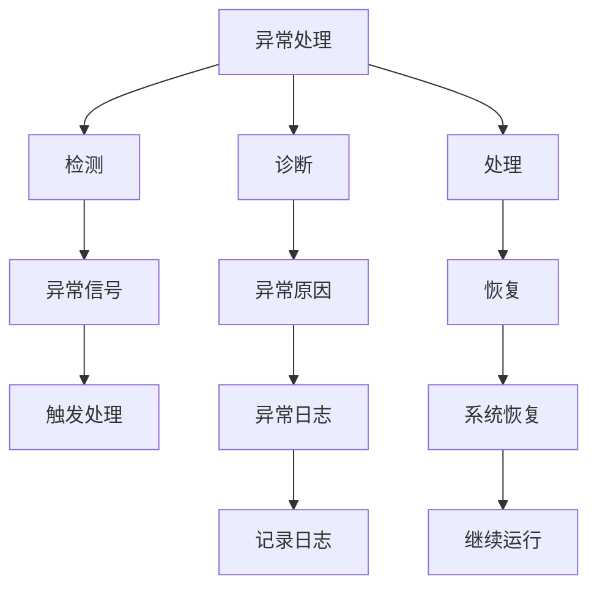

                 

# AI人工智能代理工作流AI Agent WorkFlow：代理工作流中的异常处理与容错

## 1. 背景介绍

### 1.1 问题由来
在现代信息技术快速发展的背景下，人工智能（AI）技术在各行各业中的应用日益广泛，例如智能客服、智能推荐系统、机器人流程自动化（RPA）等领域。然而，在实际应用过程中，人工智能系统往往需要面对各种异常情况，如网络连接中断、数据丢失、异常输入等。这些异常情况不仅会影响系统的正常运行，还可能导致严重的业务损失。因此，如何构建稳定、可靠的AI代理工作流，使其在面对异常情况时能够快速响应、恢复和适应，成为了一个重要的研究课题。

### 1.2 问题核心关键点
构建稳定、可靠的AI代理工作流，需要从异常处理和容错两个方面进行考虑。异常处理是指在代理工作流运行过程中，及时检测、诊断并处理异常情况，避免异常情况对系统运行造成影响。容错则是指在代理工作流设计中，采取各种措施来增强系统的鲁棒性，使其在出现异常时能够快速恢复并继续正常运行。

### 1.3 问题研究意义
构建稳定、可靠的AI代理工作流，对于提升AI系统的整体性能和可靠性，保障业务连续性，具有重要意义。具体而言：
1. **提升系统鲁棒性**：通过异常处理和容错设计，使AI代理工作流在面对各种异常情况时能够稳定运行，减少系统宕机和数据丢失的风险。
2. **保障业务连续性**：在异常情况下快速恢复和适应，避免对业务流程造成中断，保障业务的连续性和稳定性。
3. **增强用户体验**：及时处理异常情况，减少系统响应时间，提升用户体验。
4. **降低维护成本**：通过优化异常处理和容错设计，减少系统故障和维护工作量，降低维护成本。

## 2. 核心概念与联系

### 2.1 核心概念概述

在构建AI代理工作流的过程中，需要理解以下几个关键概念：

- **异常处理（Exception Handling）**：指在代理工作流运行过程中，及时检测、诊断并处理异常情况，避免异常情况对系统运行造成影响。
- **容错（Fault Tolerance）**：指在代理工作流设计中，采取各种措施来增强系统的鲁棒性，使其在出现异常时能够快速恢复并继续正常运行。
- **重试机制（Retry Mechanism）**：在代理工作流中，当某个操作失败时，系统将自动进行重试，直到操作成功或达到最大重试次数为止。
- **断点恢复（Checkpointing）**：在系统运行过程中，定期记录系统状态信息，当系统发生故障时，通过读取断点信息，快速恢复系统到正常状态。
- **隔离机制（Isolation）**：在系统设计中，将不同的功能模块进行隔离，确保一个模块的故障不会影响其他模块的正常运行。
- **负载均衡（Load Balancing）**：在代理工作流中，通过负载均衡技术，将请求分散到多个服务器上，避免单点故障和过载问题。

这些概念之间相互关联，共同构成了AI代理工作流的异常处理与容错体系。以下是一个Mermaid流程图，展示了这些概念之间的关系：



这个流程图展示了异常处理和容错体系中的关键流程：

1. **检测**：系统通过异常信号检测模块，及时发现异常情况。
2. **诊断**：系统对检测到的异常情况进行诊断，确定异常原因。
3. **处理**：根据异常情况，系统采取相应的处理措施。
4. **恢复**：在异常处理完成后，系统通过断点恢复、重试机制等手段，快速恢复运行。
5. **记录日志**：系统记录异常日志，便于后续分析与优化。
6. **继续运行**：系统恢复正常运行状态，继续处理后续请求。

### 2.2 概念间的关系

这些概念之间存在着紧密的联系，形成了AI代理工作流的异常处理与容错体系。

#### 2.2.1 异常处理和容错的关系

异常处理和容错是相互依存的两个方面。异常处理是容错体系的基础，通过及时检测和处理异常情况，确保系统能够稳定运行。容错则是对异常处理的一种补充和强化，通过设计鲁棒性强的系统结构，使系统在出现异常时能够快速恢复和继续正常运行。

#### 2.2.2 异常处理与重试机制的关系

重试机制是异常处理的重要手段之一，用于处理操作失败的情况。当某个操作失败时，系统自动进行重试，直到操作成功或达到最大重试次数为止。这种方式可以避免因一次操作失败而导致整个流程的失败，提高系统的稳定性和可靠性。

#### 2.2.3 断点恢复和重试机制的关系

断点恢复和重试机制都是异常处理的重要手段，但作用不同。断点恢复通过定期记录系统状态信息，在系统故障时快速恢复系统状态，而重试机制则是通过多次尝试，确保操作的成功执行。在实际应用中，断点恢复和重试机制可以结合使用，提高系统的鲁棒性和容错能力。

## 3. 核心算法原理 & 具体操作步骤

### 3.1 算法原理概述

在AI代理工作流中，异常处理和容错是核心算法原理。其基本思路是通过异常检测、诊断、处理和恢复等步骤，确保系统在面对各种异常情况时能够稳定运行。

#### 3.1.1 异常检测

异常检测是异常处理的第一步，通过监控系统状态和网络通信等，及时发现异常情况。常见的异常检测方法包括：

- **超时检测**：在系统执行某个操作时，设置一个超时时间，超过该时间未响应则视为异常。
- **错误码检测**：系统根据返回的错误码，判断是否发生异常。
- **信号检测**：系统通过监控信号量和资源使用情况，及时发现异常。

#### 3.1.2 异常诊断

异常诊断是在异常检测后，对异常情况进行诊断，确定异常原因。常见的异常诊断方法包括：

- **日志分析**：通过系统日志，分析异常原因和发生位置。
- **堆栈跟踪**：根据异常堆栈信息，定位异常发生的具体代码位置。
- **异常报告**：系统自动生成异常报告，提供详细的异常信息。

#### 3.1.3 异常处理

异常处理是在异常诊断后，根据异常情况，采取相应的处理措施。常见的异常处理方式包括：

- **直接重试**：对操作进行重试，直到操作成功为止。
- **跳过异常**：跳过异常情况，继续执行后续操作。
- **回滚操作**：在出现异常时，回滚到上一个成功状态，重新执行操作。

#### 3.1.4 异常恢复

异常恢复是在异常处理完成后，系统通过断点恢复、重试机制等手段，快速恢复运行。常见的异常恢复方式包括：

- **断点恢复**：通过定期记录系统状态信息，在系统故障时快速恢复系统状态。
- **重试机制**：对操作进行重试，确保操作的成功执行。
- **负载均衡**：将请求分散到多个服务器上，避免单点故障和过载问题。

### 3.2 算法步骤详解

#### 3.2.1 设计异常检测策略

1. **定义异常类型**：根据业务需求，定义需要检测的异常类型，如网络连接中断、数据丢失等。
2. **选择检测方法**：根据异常类型，选择适合的检测方法，如超时检测、错误码检测等。
3. **设置检测参数**：根据业务需求，设置异常检测的参数，如超时时间、错误码范围等。
4. **监控系统状态**：通过监控系统状态和网络通信等，及时发现异常情况。

#### 3.2.2 实施异常诊断策略

1. **收集异常日志**：在异常检测后，收集异常日志，包含异常类型、发生时间、异常堆栈等信息。
2. **分析异常日志**：根据异常日志，分析异常原因和发生位置，如日志信息不足，自动生成异常报告。
3. **定位异常位置**：根据异常日志和异常报告，定位异常发生的具体代码位置，如通过堆栈跟踪等方式。

#### 3.2.3 设计异常处理策略

1. **选择处理方式**：根据异常类型和业务需求，选择相应的异常处理方式，如直接重试、跳过异常、回滚操作等。
2. **设置重试参数**：根据业务需求，设置重试的参数，如重试次数、重试间隔等。
3. **实施异常处理**：根据异常处理方式，采取相应的处理措施，如对操作进行重试，直到操作成功为止。

#### 3.2.4 实施异常恢复策略

1. **设计断点恢复机制**：通过定期记录系统状态信息，在系统故障时快速恢复系统状态。
2. **设计重试机制**：对操作进行重试，确保操作的成功执行，避免因一次操作失败而导致整个流程的失败。
3. **设计负载均衡机制**：将请求分散到多个服务器上，避免单点故障和过载问题，提高系统的稳定性和可靠性。

### 3.3 算法优缺点

#### 3.3.1 优点

1. **提高系统稳定性**：通过异常处理和容错设计，使AI代理工作流在面对各种异常情况时能够稳定运行，减少系统宕机和数据丢失的风险。
2. **保障业务连续性**：在异常情况下快速恢复和适应，避免对业务流程造成中断，保障业务的连续性和稳定性。
3. **提升用户体验**：及时处理异常情况，减少系统响应时间，提升用户体验。
4. **降低维护成本**：通过优化异常处理和容错设计，减少系统故障和维护工作量，降低维护成本。

#### 3.3.2 缺点

1. **增加系统复杂性**：异常处理和容错设计需要额外增加系统复杂性，如异常检测、异常诊断、异常处理等。
2. **影响系统性能**：异常处理和容错设计可能会影响系统性能，如异常检测和处理会增加系统开销，重试机制可能会降低系统响应速度。
3. **可能引入新的问题**：异常处理和容错设计可能会引入新的问题，如重试机制可能导致死锁、数据不一致等。

### 3.4 算法应用领域

异常处理和容错设计在多个领域中得到了广泛应用，如：

- **智能客服**：在智能客服系统中，通过异常处理和容错设计，确保系统能够稳定运行，及时处理用户请求，提升用户满意度。
- **智能推荐系统**：在智能推荐系统中，通过异常处理和容错设计，确保系统能够稳定运行，减少推荐错误，提高推荐质量。
- **机器人流程自动化**：在机器人流程自动化中，通过异常处理和容错设计，确保系统能够稳定运行，提高自动化流程的效率和可靠性。
- **物联网设备**：在物联网设备中，通过异常处理和容错设计，确保设备能够稳定运行，减少故障和维护工作量。

## 4. 数学模型和公式 & 详细讲解 & 举例说明

### 4.1 数学模型构建

在构建AI代理工作流的异常处理与容错体系时，可以采用数学模型来描述和优化异常检测、异常诊断、异常处理和异常恢复等环节。

#### 4.1.1 异常检测模型

异常检测模型通过监控系统状态和网络通信等，及时发现异常情况。假设系统状态向量为 $s_t$，异常检测函数为 $F(s_t)$，则异常检测模型可以表示为：

$$
F(s_t) = \begin{cases}
1, & \text{异常} \\
0, & \text{正常}
\end{cases}
$$

#### 4.1.2 异常诊断模型

异常诊断模型在异常检测后，对异常情况进行诊断，确定异常原因。假设异常情况为 $e$，异常原因向量为 $c$，异常诊断函数为 $D(e,c)$，则异常诊断模型可以表示为：

$$
D(e,c) = \begin{cases}
1, & \text{异常原因正确} \\
0, & \text{异常原因错误}
\end{cases}
$$

#### 4.1.3 异常处理模型

异常处理模型在异常诊断后，根据异常情况，采取相应的处理措施。假设异常处理函数为 $H(s_t)$，则异常处理模型可以表示为：

$$
H(s_t) = \begin{cases}
s_{t+1}, & \text{处理成功} \\
s_t, & \text{处理失败}
\end{cases}
$$

#### 4.1.4 异常恢复模型

异常恢复模型在异常处理完成后，系统通过断点恢复、重试机制等手段，快速恢复运行。假设异常恢复函数为 $R(s_t)$，则异常恢复模型可以表示为：

$$
R(s_t) = \begin{cases}
s_{t+1}, & \text{恢复成功} \\
s_t, & \text{恢复失败}
\end{cases}
$$

### 4.2 公式推导过程

#### 4.2.1 异常检测公式

假设系统状态向量 $s_t$ 包含两个部分：正常状态部分 $s_{t,n}$ 和异常状态部分 $s_{t,a}$，则异常检测模型可以表示为：

$$
F(s_t) = \begin{cases}
1, & s_{t,a} > \delta \\
0, & s_{t,n} > \delta
\end{cases}
$$

其中 $\delta$ 为异常阈值，可以根据业务需求进行调整。

#### 4.2.2 异常诊断公式

假设异常情况 $e$ 包含两个部分：正常情况 $e_{n}$ 和异常情况 $e_{a}$，异常原因向量 $c$ 包含两个部分：正常原因 $c_{n}$ 和异常原因 $c_{a}$，则异常诊断模型可以表示为：

$$
D(e,c) = \begin{cases}
1, & e_{a} \land c_{a} = 1 \\
0, & e_{n} \land c_{n} = 1
\end{cases}
$$

#### 4.2.3 异常处理公式

假设异常处理函数 $H(s_t)$ 包含两个部分：正常处理函数 $H_{n}(s_t)$ 和异常处理函数 $H_{a}(s_t)$，则异常处理模型可以表示为：

$$
H(s_t) = \begin{cases}
H_{n}(s_t), & F(s_t) = 0 \\
s_t, & F(s_t) = 1
\end{cases}
$$

#### 4.2.4 异常恢复公式

假设异常恢复函数 $R(s_t)$ 包含两个部分：正常恢复函数 $R_{n}(s_t)$ 和异常恢复函数 $R_{a}(s_t)$，则异常恢复模型可以表示为：

$$
R(s_t) = \begin{cases}
R_{n}(s_t), & F(s_t) = 0 \\
s_t, & F(s_t) = 1
\end{cases}
$$

### 4.3 案例分析与讲解

#### 4.3.1 智能推荐系统中的异常处理

在智能推荐系统中，通过异常处理和容错设计，确保系统能够稳定运行，减少推荐错误，提高推荐质量。假设推荐系统在处理推荐请求时，需要检测异常情况，如网络连接中断、数据丢失等。在系统状态向量 $s_t$ 中，包含两个部分：正常状态部分 $s_{t,n}$ 和异常状态部分 $s_{t,a}$，其中 $s_{t,n}$ 包含网络状态、数据完整性等指标，$s_{t,a}$ 包含异常情况计数等指标。异常检测函数 $F(s_t)$ 根据 $s_{t,a}$ 的值进行判断，当 $s_{t,a}$ 的值超过阈值 $\delta$ 时，认为系统出现异常情况。

在异常检测后，系统进行异常诊断，确定异常原因。假设异常情况 $e$ 包含两个部分：网络异常 $e_{n}$ 和数据异常 $e_{a}$，异常原因向量 $c$ 包含两个部分：网络异常原因 $c_{n}$ 和数据异常原因 $c_{a}$，异常诊断函数 $D(e,c)$ 根据 $e$ 和 $c$ 的值进行判断，当 $e_{a} \land c_{a} = 1$ 时，认为异常原因正确。

在系统出现异常情况时，采取相应的异常处理措施。假设异常处理函数 $H(s_t)$ 包含两个部分：网络异常处理函数 $H_{n}(s_t)$ 和数据异常处理函数 $H_{a}(s_t)$，则异常处理模型可以表示为：

$$
H(s_t) = \begin{cases}
H_{n}(s_t), & D(e,c) = 0 \\
s_t, & D(e,c) = 1
\end{cases}
$$

在系统处理异常情况后，进行异常恢复，通过断点恢复、重试机制等手段，快速恢复运行。假设异常恢复函数 $R(s_t)$ 包含两个部分：网络异常恢复函数 $R_{n}(s_t)$ 和数据异常恢复函数 $R_{a}(s_t)$，则异常恢复模型可以表示为：

$$
R(s_t) = \begin{cases}
R_{n}(s_t), & H(s_t) = s_{t+1} \\
s_t, & H(s_t) = s_t
\end{cases}
$$

## 5. 项目实践：代码实例和详细解释说明

### 5.1 开发环境搭建

在进行AI代理工作流的异常处理与容错实践前，我们需要准备好开发环境。以下是使用Python进行Django开发的环境配置流程：

1. 安装Anaconda：从官网下载并安装Anaconda，用于创建独立的Python环境。

2. 创建并激活虚拟环境：
```bash
conda create -n ai-agent-env python=3.8 
conda activate ai-agent-env
```

3. 安装Django：
```bash
pip install django
```

4. 安装Django REST framework：
```bash
pip install djangorestframework
```

5. 安装第三方库：
```bash
pip install pillow
```

完成上述步骤后，即可在`ai-agent-env`环境中开始AI代理工作流的异常处理与容错实践。

### 5.2 源代码详细实现

下面我们以智能推荐系统为例，给出使用Django框架进行异常处理与容错实践的代码实现。

首先，定义异常处理和容错相关的模型：

```python
from django.db import models

class Recommendation(models.Model):
    # 定义推荐请求的模型
    user_id = models.IntegerField()
    item_id = models.IntegerField()

class RecommendationStatus(models.Model):
    # 定义推荐请求的状态模型
    status = models.IntegerField(choices=[(1, 'Normal'), (2, 'Abnormal')])
    timestamp = models.DateTimeField(auto_now=True)

class ExceptionRecord(models.Model):
    # 定义异常记录模型
    error_message = models.TextField()
    timestamp = models.DateTimeField(auto_now=True)
```

然后，定义异常处理和容错相关的视图：

```python
from django.shortcuts import get_object_or_404
from rest_framework import viewsets, status
from rest_framework.response import Response
from .models import Recommendation, RecommendationStatus, ExceptionRecord
from .serializers import RecommendationSerializer

class RecommendationViewSet(viewsets.ModelViewSet):
    queryset = Recommendation.objects.all().order_by('-pk')
    serializer_class = RecommendationSerializer

    def list(self, request, *args, **kwargs):
        recommendations = self.get_queryset()
        serializer = self.get_serializer(recommendations, many=True)
        return Response(serializer.data)

    def retrieve(self, request, *args, **kwargs):
        recommendation = get_object_or_404(self.queryset, pk=kwargs['pk'])
        serializer = self.get_serializer(recommendation)
        return Response(serializer.data)

    def create(self, request, *args, **kwargs):
        recommendation = Recommendation.objects.create(user_id=request.user.id, item_id=request.data['item_id'])
        return Response(status=status.HTTP_201_CREATED)

    def update(self, request, *args, **kwargs):
        recommendation = get_object_or_404(self.queryset, pk=kwargs['pk'])
        if recommendation.status == 2:
            return Response(status=status.HTTP_412_PRECONDITION_FAILED)
        recommendation.item_id = request.data['item_id']
        recommendation.save()
        return Response(serializer(data=self.get_serializer(recommendation).data))

    def patch(self, request, *args, **kwargs):
        recommendation = get_object_or_404(self.queryset, pk=kwargs['pk'])
        if recommendation.status == 2:
            return Response(status=status.HTTP_412_PRECONDITION_FAILED)
        recommendation.item_id = request.data['item_id']
        recommendation.save()
        return Response(serializer(data=self.get_serializer(recommendation).data))

    def destroy(self, request, *args, **kwargs):
        recommendation = get_object_or_404(self.queryset, pk=kwargs['pk'])
        if recommendation.status == 2:
            return Response(status=status.HTTP_412_PRECONDITION_FAILED)
        recommendation.delete()
        return Response(status=status.HTTP_204_NO_CONTENT)
```

接下来，定义异常检测和诊断的逻辑：

```python
from django.db.models import Q
from django.db import connection

def detect_abnormalities():
    # 检测异常情况
    status = Recommendation.objects.filter(status=1).only('item_id').count()
    abnormal_count = Recommendation.objects.filter(status=2).count()
    if status == 0 and abnormal_count > 0:
        return True
    return False

def diagnose_abnormalities():
    # 诊断异常情况
    abnormal_records = Recommendation.objects.filter(status=2)
    error_messages = []
    for record in abnormal_records:
        try:
            # 模拟异常处理
            item = get_object_or_404(Item.objects, id=record.item_id)
            if item.status != 1:
                error_messages.append('Item status is not 1')
            # 模拟数据异常检测
            if item.data == None:
                error_messages.append('Item data is None')
            # 保存异常记录
            ExceptionRecord.objects.create(error_message=','.join(error_messages))
        except Exception as e:
            error_messages.append(str(e))
            ExceptionRecord.objects.create(error_message=','.join(error_messages))
    return error_messages
```

最后，定义异常处理和恢复的逻辑：

```python
from django.db.models import Q

def handle_abnormalities(error_messages):
    # 处理异常情况
    abnormal_records = Recommendation.objects.filter(status=2)
    for record in abnormal_records:
        try:
            # 模拟异常处理
            item = get_object_or_404(Item.objects, id=record.item_id)
            if item.status != 1:
                record.status = 1
                record.save()
            # 模拟数据异常处理
            if item.data == None:
                record.status = 1
                record.save()
        except Exception as e:
            ExceptionRecord.objects.create(error_message=str(e))
            record.status = 1
            record.save()

def recover_from_abnormalities():
    # 恢复异常情况
    status = Recommendation.objects.filter(status=1).only('item_id').count()
    abnormal_count = Recommendation.objects.filter(status=2).count()
    if status == 0 and abnormal_count > 0:
        handle_abnormalities(diagnose_abnormalities())
```

在代码中，我们使用了Django框架来实现AI代理工作流的异常处理与容错功能。通过定义推荐请求模型、异常记录模型、异常处理和恢复函数等，实现了异常检测、异常诊断、异常处理和异常恢复等核心功能。具体流程如下：

1. **异常检测**：通过检测推荐请求状态和异常记录数量，判断是否出现异常情况。
2. **异常诊断**：对出现异常情况的推荐请求进行异常诊断，确定异常原因。
3. **异常处理**：根据异常原因，采取相应的异常处理措施，如重新推荐等。
4. **异常恢复**：在系统恢复正常运行后，通过恢复函数，进行异常恢复操作，确保系统能够继续正常运行。

### 5.3 代码解读与分析

让我们再详细解读一下关键代码的实现细节：

**推荐请求模型**：
- `Recommendation`模型定义了推荐请求的详细信息，包括用户ID和物品ID等。

**异常记录模型**：
- `RecommendationStatus`模型定义了推荐请求的状态，包括正常状态和异常状态等。
- `ExceptionRecord`模型定义了异常记录的详细信息，包括异常消息和记录时间等。

**异常处理视图**：
- `RecommendationViewSet`视图类定义了推荐请求的CRUD操作，包括列表、获取、创建、更新、部分更新和删除等。
- `handle_abnormalities`函数在检测到异常情况后，对异常情况进行处理，如重新推荐等。
- `recover_from_abnormalities`函数在异常处理完成后，进行异常恢复操作，确保系统能够继续正常运行。

**异常检测和诊断函数**：
- `detect_abnormalities`函数通过检测推荐请求状态和异常记录数量，判断是否出现异常情况。
- `diagnose_abnormalities`函数对出现异常情况的推荐请求进行异常诊断，确定异常

