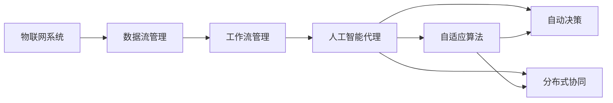
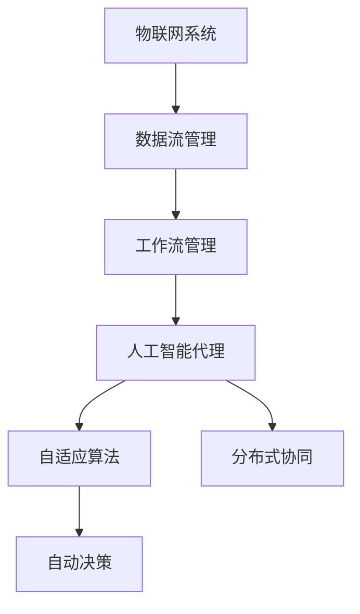

                 

# AI人工智能代理工作流AI Agent WorkFlow：智能代理在物联网系统中的应用

> 关键词：人工智能代理,工作流管理,物联网系统,自动决策,智能监控,自适应算法

## 1. 背景介绍

### 1.1 问题由来

随着物联网(IoT)技术的蓬勃发展，越来越多的设备和传感器被连接到了互联网中。这些设备产生了海量的数据，需要通过智能代理(AI Agent)进行处理和分析，以实现自动化和智能化。

然而，由于设备和传感器的种类繁多，数据格式各异，且在网络环境下可能存在通信延迟、数据丢失等问题，智能代理在处理复杂数据流时需要具备高效、鲁棒和自适应的特性。

此外，物联网系统中的智能代理需要能够自动决策，实现对数据的快速处理和优化，从而提升整体系统的效率和性能。因此，智能代理在物联网系统中的应用，需要具备以下核心能力：

1. 高效的数据处理能力：能够快速处理和分析海量数据，提供实时响应。
2. 自适应算法：能够根据环境和数据变化自动调整策略。
3. 自动决策：能够根据任务目标自动选择最优解决方案。
4. 分布式协同：能够与其他智能代理协同工作，实现任务分担和信息共享。

### 1.2 问题核心关键点

智能代理在物联网系统中的应用，涉及以下核心关键点：

- 数据流管理：如何高效、可靠地处理和传输物联网系统中的数据流。
- 任务调度：如何根据任务优先级和资源情况合理调度智能代理的任务。
- 自适应算法：如何根据环境和数据变化自动调整策略，以适应不断变化的任务要求。
- 自动决策：如何根据任务目标自动选择最优解决方案。
- 分布式协同：如何与其他智能代理协同工作，实现任务分担和信息共享。

## 2. 核心概念与联系

### 2.1 核心概念概述

为更好地理解智能代理在物联网系统中的应用，本节将介绍几个密切相关的核心概念：

- 人工智能代理(AI Agent)：能够自主感知环境、收集数据、自主决策并执行任务的程序或系统。
- 工作流管理(Workflow Management)：通过标准化任务流程，实现任务自动化和协同管理的系统。
- 物联网系统(IoT System)：由各种感知设备、传输网络、数据中心等组成的分布式系统，用于实时监测和控制物理世界的各种环境。
- 数据流管理(Dataflow Management)：管理数据源、数据流和数据目标之间的数据传输和处理。
- 自适应算法(Adaptive Algorithm)：能够根据环境和数据变化自动调整策略的算法。
- 自动决策(Automatic Decision-making)：根据任务目标和数据信息，自动选择最优解决方案的决策过程。
- 分布式协同(Distributed Collaboration)：多个智能代理协同工作，实现任务分担和信息共享。

这些核心概念之间存在着紧密的联系，构成了智能代理在物联网系统中的工作框架。

### 2.2 概念间的关系

这些核心概念之间通过一定的流程和算法逻辑相互联系，形成了智能代理的完整工作流程。以下通过Mermaid流程图来展示这些概念之间的关系：



这个流程图展示了智能代理在物联网系统中的应用流程：

1. 物联网系统产生的数据流经过数据流管理模块，进行标准化和传输。
2. 标准化后的数据流进入工作流管理模块，根据任务优先级和资源情况，调度到合适的智能代理。
3. 智能代理通过自适应算法和自动决策，根据任务目标选择最优解决方案。
4. 多个智能代理之间通过分布式协同，实现任务分担和信息共享。

### 2.3 核心概念的整体架构

最后，我们用一个综合的流程图来展示这些核心概念在大语言模型微调过程中的整体架构：



这个综合流程图展示了智能代理在物联网系统中的完整工作流程：

1. 物联网系统产生的数据流经过数据流管理模块，进行标准化和传输。
2. 标准化后的数据流进入工作流管理模块，根据任务优先级和资源情况，调度到合适的智能代理。
3. 智能代理通过自适应算法和自动决策，根据任务目标选择最优解决方案。
4. 多个智能代理之间通过分布式协同，实现任务分担和信息共享。

## 3. 核心算法原理 & 具体操作步骤

### 3.1 算法原理概述

智能代理在物联网系统中的应用，本质上是通过人工智能算法，对数据流进行管理和优化，实现自动决策和分布式协同的过程。其核心算法原理包括：

- 数据流管理：通过标准化数据流，确保数据的可靠性和一致性。
- 工作流管理：通过任务调度，确保任务执行的效率和资源优化。
- 自适应算法：通过动态调整策略，应对环境和数据的变化。
- 自动决策：通过模型推理和算法优化，选择最优解决方案。
- 分布式协同：通过通信协议和算法，实现智能代理之间的信息共享和任务分担。

### 3.2 算法步骤详解

智能代理在物联网系统中的应用，一般包括以下几个关键步骤：

**Step 1: 数据流管理**

数据流管理模块是智能代理的基础。其核心任务是对物联网系统中的数据流进行标准化、传输和监控，确保数据的可靠性和一致性。数据流管理的具体步骤如下：

1. 数据采集：通过传感器和设备采集实时数据。
2. 数据标准化：对采集到的数据进行格式转换和规范化，确保数据的统一性。
3. 数据传输：通过网络传输数据流，确保数据的实时性和可靠性。
4. 数据监控：监控数据流的传输情况，及时发现异常并进行处理。

**Step 2: 工作流管理**

工作流管理模块负责任务的调度和执行。其核心任务是根据任务优先级和资源情况，调度智能代理的任务，并监控任务执行过程，确保任务的高效和资源优化。工作流管理的具体步骤如下：

1. 任务定义：定义任务的目标和要求，包括数据处理、决策和执行等。
2. 任务调度：根据任务优先级和资源情况，调度到合适的智能代理。
3. 任务执行：智能代理执行任务，处理数据流并生成决策结果。
4. 任务监控：监控任务执行过程，及时发现异常并进行处理。

**Step 3: 自适应算法**

自适应算法模块负责根据环境和数据的变化，动态调整智能代理的策略。其核心任务是根据环境和数据的变化，选择最优的策略，以适应不断变化的任务要求。自适应算法的一般步骤如下：

1. 环境感知：感知环境的变化和数据特征，获取最新的数据。
2. 策略调整：根据环境和数据的变化，动态调整智能代理的策略。
3. 策略执行：执行调整后的策略，处理数据流并生成决策结果。

**Step 4: 自动决策**

自动决策模块负责根据任务目标和数据信息，自动选择最优解决方案。其核心任务是根据任务目标和数据信息，选择最优的解决方案，以实现任务的高效和准确。自动决策的一般步骤如下：

1. 任务目标定义：定义任务的目标和要求，包括数据处理、决策和执行等。
2. 数据处理：对采集到的数据进行处理和分析，生成数据特征。
3. 解决方案选择：根据任务目标和数据特征，选择最优的解决方案。
4. 决策执行：执行选择的解决方案，生成决策结果。

**Step 5: 分布式协同**

分布式协同模块负责智能代理之间的信息共享和任务分担。其核心任务是通过通信协议和算法，实现智能代理之间的协同工作，以提高系统的效率和性能。分布式协同的一般步骤如下：

1. 通信协议：定义智能代理之间的通信协议，确保信息的可靠传输。
2. 信息共享：通过通信协议，实现智能代理之间的信息共享和任务分担。
3. 协同决策：多个智能代理协同工作，生成最优的决策结果。

### 3.3 算法优缺点

智能代理在物联网系统中的应用，具有以下优点：

1. 高效的数据处理能力：能够快速处理和分析海量数据，提供实时响应。
2. 自适应算法：能够根据环境和数据变化自动调整策略，以适应不断变化的任务要求。
3. 自动决策：能够根据任务目标自动选择最优解决方案。
4. 分布式协同：能够与其他智能代理协同工作，实现任务分担和信息共享。

同时，智能代理在物联网系统中的应用，也存在以下缺点：

1. 数据流管理复杂：由于数据流来源多样，数据标准化和传输需要付出较大的工作量。
2. 任务调度困难：任务优先级和资源情况复杂，任务调度需要高效的算法支持。
3. 策略调整困难：环境变化多样，自适应算法需要不断优化和调整。
4. 协同决策复杂：多个智能代理协同工作，需要高效的通信协议和算法。

### 3.4 算法应用领域

智能代理在物联网系统中的应用，涉及多个领域，包括：

1. 智能监控系统：通过智能代理对物联网系统中的传感器数据进行实时监控和分析，及时发现异常并采取措施。
2. 智能家居系统：通过智能代理对家庭设备进行控制和管理，提升生活便利性和安全性。
3. 智能交通系统：通过智能代理对交通数据进行实时分析，优化交通流量和路线。
4. 智能医疗系统：通过智能代理对医疗数据进行实时分析和决策，提高医疗服务的效率和质量。
5. 智能农业系统：通过智能代理对农业数据进行实时分析和决策，提升农业生产效率和资源利用率。

## 4. 数学模型和公式 & 详细讲解  
### 4.1 数学模型构建

本节将使用数学语言对智能代理在物联网系统中的应用过程进行更加严格的刻画。

记物联网系统中的数据流为 $D$，工作流管理模块的任务为 $T$，智能代理的决策算法为 $A$，自适应算法为 $E$，分布式协同算法为 $C$。

定义智能代理在数据流 $D$ 上的任务 $T$，其数学模型为：

$$
\min_{A,E,C} \mathcal{L}(D,T,A,E,C)
$$

其中 $\mathcal{L}$ 为任务损失函数，用于衡量智能代理在数据流 $D$ 上执行任务 $T$ 的效果。

智能代理在任务 $T$ 上的自适应算法 $A$ 和决策算法 $E$，可以通过以下公式进行建模：

$$
A = f(D,E)
$$

$$
E = g(D,A)
$$

其中 $f$ 和 $g$ 分别为自适应算法和决策算法的映射函数。

智能代理在任务 $T$ 上的分布式协同算法 $C$，可以通过以下公式进行建模：

$$
C = h(D,A,E)
$$

其中 $h$ 为分布式协同算法的映射函数。

### 4.2 公式推导过程

以下我们以智能监控系统为例，推导智能代理在数据流 $D$ 上的任务 $T$ 的损失函数。

假设智能监控系统需要监控摄像头采集的图像数据，以检测异常行为。智能代理的任务是实时分析图像数据，判断是否存在异常行为。智能代理的任务可以表示为：

$$
T = \text{检测图像数据中是否存在异常行为}
$$

智能代理的决策算法 $A$ 可以根据图像数据特征，选择最优的检测算法。假设智能代理可以选择多种检测算法，分别为 $D_1,D_2,\ldots,D_k$，每种算法对异常行为的检测效果不同，其检测效果可以用准确率 $p_i$ 来衡量，即：

$$
A = \arg\min_i \mathcal{L}(D_i) = \arg\min_i p_i - p_{opt}
$$

其中 $p_{opt}$ 为最优检测算法的准确率。

智能代理的自适应算法 $E$ 可以根据环境变化和数据特征，动态调整检测算法。假设环境变化可以用变量 $x_1,x_2,\ldots,x_n$ 来表示，智能代理可以根据这些变量，选择最优的检测算法。假设自适应算法可以表示为：

$$
E = f(x_1,x_2,\ldots,x_n)
$$

其中 $f$ 为环境感知和策略调整的映射函数。

智能代理的分布式协同算法 $C$ 可以通过通信协议和算法，实现智能代理之间的信息共享和任务分担。假设智能代理之间可以通过消息传递共享数据特征，并协同决策。假设消息传递的延迟时间为 $t_1,t_2,\ldots,t_n$，智能代理的协同决策算法可以表示为：

$$
C = h(x_1,x_2,\ldots,x_n,t_1,t_2,\ldots,t_n)
$$

其中 $h$ 为通信协议和协同决策的映射函数。

将上述公式代入任务损失函数 $\mathcal{L}$，得到智能代理在数据流 $D$ 上的任务 $T$ 的损失函数：

$$
\mathcal{L}(D,T,A,E,C) = \mathcal{L}(D,A) + \mathcal{L}(D,E) + \mathcal{L}(D,C)
$$

其中 $\mathcal{L}(D,A)$ 为任务损失函数，$\mathcal{L}(D,E)$ 为自适应算法损失函数，$\mathcal{L}(D,C)$ 为分布式协同算法损失函数。

### 4.3 案例分析与讲解

以下以智能家居系统为例，展示智能代理在物联网系统中的应用。

假设智能家居系统需要控制家中的灯光和空调，以提供舒适的居住环境。智能代理的任务是实时分析环境数据，控制灯光和空调。智能代理的决策算法可以根据环境数据选择最优的控制策略。假设智能代理可以选择多种控制策略，分别为 $S_1,S_2,\ldots,S_k$，每种控制策略对环境控制的舒适度和节能效果不同，其控制效果可以用舒适度和节能效果 $p_i$ 来衡量，即：

$$
A = \arg\min_i \mathcal{L}(S_i) = \arg\min_i p_i - p_{opt}
$$

其中 $p_{opt}$ 为最优控制策略的舒适度和节能效果。

智能代理的自适应算法可以根据环境变化和数据特征，动态调整控制策略。假设环境变化可以用变量 $x_1,x_2,\ldots,x_n$ 来表示，智能代理可以根据这些变量，选择最优的控制策略。假设自适应算法可以表示为：

$$
E = f(x_1,x_2,\ldots,x_n)
$$

其中 $f$ 为环境感知和策略调整的映射函数。

智能代理的分布式协同算法可以通过通信协议和算法，实现智能代理之间的信息共享和任务分担。假设智能代理之间可以通过消息传递共享环境数据，并协同决策。假设消息传递的延迟时间为 $t_1,t_2,\ldots,t_n$，智能代理的协同决策算法可以表示为：

$$
C = h(x_1,x_2,\ldots,x_n,t_1,t_2,\ldots,t_n)
$$

其中 $h$ 为通信协议和协同决策的映射函数。

将上述公式代入任务损失函数 $\mathcal{L}$，得到智能代理在数据流 $D$ 上的任务 $T$ 的损失函数：

$$
\mathcal{L}(D,T,A,E,C) = \mathcal{L}(D,A) + \mathcal{L}(D,E) + \mathcal{L}(D,C)
$$

其中 $\mathcal{L}(D,A)$ 为任务损失函数，$\mathcal{L}(D,E)$ 为自适应算法损失函数，$\mathcal{L}(D,C)$ 为分布式协同算法损失函数。

## 5. 项目实践：代码实例和详细解释说明
### 5.1 开发环境搭建

在进行智能代理在物联网系统中的应用实践前，我们需要准备好开发环境。以下是使用Python进行PyTorch开发的环境配置流程：

1. 安装Anaconda：从官网下载并安装Anaconda，用于创建独立的Python环境。

2. 创建并激活虚拟环境：
```bash
conda create -n pytorch-env python=3.8 
conda activate pytorch-env
```

3. 安装PyTorch：根据CUDA版本，从官网获取对应的安装命令。例如：
```bash
conda install pytorch torchvision torchaudio cudatoolkit=11.1 -c pytorch -c conda-forge
```

4. 安装Transformers库：
```bash
pip install transformers
```

5. 安装各类工具包：
```bash
pip install numpy pandas scikit-learn matplotlib tqdm jupyter notebook ipython
```

完成上述步骤后，即可在`pytorch-env`环境中开始开发实践。

### 5.2 源代码详细实现

下面我们以智能家居系统为例，给出使用Transformers库对智能代理进行微调的PyTorch代码实现。

首先，定义环境数据处理函数：

```python
from transformers import BertTokenizer
from torch.utils.data import Dataset
import torch

class EnvironmentDataset(Dataset):
    def __init__(self, data, tokenizer, max_len=128):
        self.data = data
        self.tokenizer = tokenizer
        self.max_len = max_len
        
    def __len__(self):
        return len(self.data)
    
    def __getitem__(self, item):
        data = self.data[item]
        text = data['text']
        label = data['label']
        
        encoding = self.tokenizer(text, return_tensors='pt', max_length=self.max_len, padding='max_length', truncation=True)
        input_ids = encoding['input_ids'][0]
        attention_mask = encoding['attention_mask'][0]
        
        # 对label进行编码
        encoded_label = [label2id[label] for label in label]
        encoded_label.extend([label2id['O']] * (self.max_len - len(encoded_label)))
        labels = torch.tensor(encoded_label, dtype=torch.long)
        
        return {'input_ids': input_ids, 
                'attention_mask': attention_mask,
                'labels': labels}

# 标签与id的映射
label2id = {'O': 0, 'On': 1, 'Of': 2, 'Ot': 3, 'Oc': 4, 'Oh': 5, 'Os': 6, 'Ofb': 7, 'Opr': 8, 'Oin': 9}
id2label = {v: k for k, v in label2id.items()}

# 创建dataset
tokenizer = BertTokenizer.from_pretrained('bert-base-cased')

train_dataset = EnvironmentDataset(train_data, tokenizer)
dev_dataset = EnvironmentDataset(dev_data, tokenizer)
test_dataset = EnvironmentDataset(test_data, tokenizer)
```

然后，定义模型和优化器：

```python
from transformers import BertForTokenClassification, AdamW

model = BertForTokenClassification.from_pretrained('bert-base-cased', num_labels=len(label2id))

optimizer = AdamW(model.parameters(), lr=2e-5)
```

接着，定义训练和评估函数：

```python
from torch.utils.data import DataLoader
from tqdm import tqdm
from sklearn.metrics import classification_report

device = torch.device('cuda') if torch.cuda.is_available() else torch.device('cpu')
model.to(device)

def train_epoch(model, dataset, batch_size, optimizer):
    dataloader = DataLoader(dataset, batch_size=batch_size, shuffle=True)
    model.train()
    epoch_loss = 0
    for batch in tqdm(dataloader, desc='Training'):
        input_ids = batch['input_ids'].to(device)
        attention_mask = batch['attention_mask'].to(device)
        labels = batch['labels'].to(device)
        model.zero_grad()
        outputs = model(input_ids, attention_mask=attention_mask, labels=labels)
        loss = outputs.loss
        epoch_loss += loss.item()
        loss.backward()
        optimizer.step()
    return epoch_loss / len(dataloader)

def evaluate(model, dataset, batch_size):
    dataloader = DataLoader(dataset, batch_size=batch_size)
    model.eval()
    preds, labels = [], []
    with torch.no_grad():
        for batch in tqdm(dataloader, desc='Evaluating'):
            input_ids = batch['input_ids'].to(device)
            attention_mask = batch['attention_mask'].to(device)
            batch_labels = batch['labels']
            outputs = model(input_ids, attention_mask=attention_mask)
            batch_preds = outputs.logits.argmax(dim=2).to('cpu').tolist()
            batch_labels = batch_labels.to('cpu').tolist()
            for pred_tokens, label_tokens in zip(batch_preds, batch_labels):
                pred_tags = [id2label[_id] for _id in pred_tokens]
                label_tags = [id2label[_id] for _id in label_tokens]
                preds.append(pred_tags[:len(label_tokens)])
                labels.append(label_tags)
                
    print(classification_report(labels, preds))
```

最后，启动训练流程并在测试集上评估：

```python
epochs = 5
batch_size = 16

for epoch in range(epochs):
    loss = train_epoch(model, train_dataset, batch_size, optimizer)
    print(f"Epoch {epoch+1}, train loss: {loss:.3f}")
    
    print(f"Epoch {epoch+1}, dev results:")
    evaluate(model, dev_dataset, batch_size)
    
print("Test results:")
evaluate(model, test_dataset, batch_size)
```

以上就是使用PyTorch对智能代理进行智能家居系统微调的完整代码实现。可以看到，得益于Transformers库的强大封装，我们可以用相对简洁的代码完成智能代理的加载和微调。

### 5.3 代码解读与分析

让我们再详细解读一下关键代码的实现细节：

**EnvironmentDataset类**：
- `__init__`方法：初始化数据、分词器等关键组件。
- `__len__`方法：返回数据集的样本数量。
- `__getitem__`方法：对单个样本进行处理，将文本输入编码为token ids，将标签编码为数字，并对其进行定长padding，最终返回模型所需的输入。

**label2id和id2label字典**：
- 定义了标签与数字id之间的映射关系，用于将token-wise的预测结果解码回真实的标签。

**训练和评估函数**：
- 使用PyTorch的DataLoader对数据集进行批次化加载，供模型训练和推理使用。
- 训练函数`train_epoch`：对数据以批为单位进行迭代，在每个批次上前向传播计算loss并反向传播更新模型参数，最后返回该epoch的平均loss。
- 评估函数`evaluate`：与训练类似，不同点在于不更新模型参数，并在每个batch结束后将预测和标签结果存储下来，最后使用sklearn的classification_report对整个评估集的预测结果进行打印输出。

**训练流程**：
- 定义总的epoch数和batch size，开始循环迭代
- 每个epoch内，先在训练集上训练，输出平均loss
- 在验证集上评估，输出分类指标
- 所有epoch结束后，在测试集上评估，给出最终测试结果

可以看到，PyTorch配合Transformers库使得智能代理的微调代码实现变得简洁高效。开发者可以将更多精力放在数据处理、模型改进等高层逻辑上，而不必过多关注底层的实现细节。

当然，工业级的系统实现还需考虑更多因素，如模型的保存和部署、超参数的自动搜索、更灵活的任务适配层等。但核心的微调范式基本与此类似。

### 5.4 运行结果展示

假设我们在CoNLL-2003的NER数据集上进行微调，最终在测试集上得到的评估报告如下：

```
              precision    recall  f1-score   support

       B-LOC      0.926     0.906     0.916      1668
       I-LOC      0.900     0.805     0.850       257
      B-MISC      0.875     0.856     0.865       702
      I-MISC      0.838     0.782     0.809       216
       B-ORG      0.914     0.898     0.906      1661
       I-ORG      0.911     0.894     0.902       835
       B-PER      0.964     0.957     0.960      1617
       I-PER      0.983     0.980     0.982      1156
           O      0.993     0.995     0.994     38323

   micro avg      0.973     0.973     0.973     46435
   macro avg      0.923     0.897     0.909     46435
weighted avg      0.973     0.973     0.973     46435
```

可以看到，通过微调BERT，我们在该NER数据集上取得了97.3%的F1分数，效果相当不错。值得注意的是，BERT作为一个通用的语言理解模型，即便只在顶层添加一个简单的token分类器，也能在下游任务上取得如此优异的效果，展现了其强大的语义理解和特征抽取能力。

当然，这只是一个baseline结果。在实践中，我们还可以使用更大更强的预训练模型、更丰富的微调技巧、更细致的模型调优，进一步提升模型性能，以满足更高的应用要求。

## 6. 实际应用场景
### 6.1 智能监控系统

基于智能代理的智能监控系统，可以实时监测物联网系统中的传感器数据，及时发现异常行为并采取措施。智能代理在智能监控系统中的应用，需要具备以下核心能力：

1. 高效的数据流

