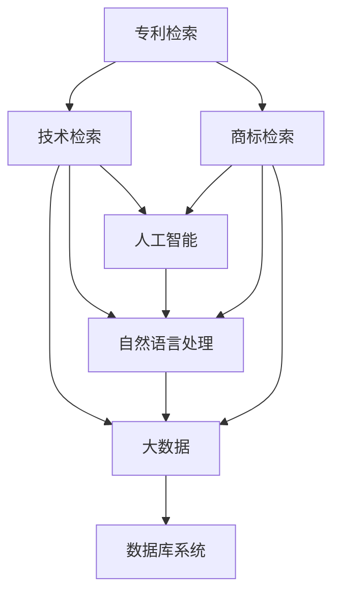

                 

# AI创业公司的知识产权挖掘方法：专利检索、商标检索与技术检索

> 关键词：
- 知识产权挖掘
- 专利检索
- 商标检索
- 技术检索
- 人工智能
- 大数据
- 机器学习
- 自然语言处理
- 数据库系统

## 1. 背景介绍

在AI创业公司的成长过程中，知识产权（IP）的保护和管理是核心议题。无论是在产品创新、市场推广还是防侵权保护方面，对专利、商标和技术秘密的深入挖掘和管理都显得至关重要。本文将深入探讨如何利用AI技术，特别是自然语言处理（NLP）和数据库技术，对公司的知识产权进行全面的挖掘、管理和应用。

### 1.1 问题由来
随着人工智能（AI）技术在各个领域的广泛应用，越来越多的创业公司开始重视AI技术的知识产权挖掘和管理。传统的专利检索、商标检索和信息检索等方法虽然成熟，但存在数据更新不及时、结果不精确、用户使用不便等问题。AI技术，尤其是NLP和大数据技术的引入，为这些领域的创新提供了新的突破点。

### 1.2 问题核心关键点
AI创业公司的知识产权挖掘方法主要涉及以下几个关键点：
- 高效准确的专利检索
- 全面系统的商标检索
- 深度精准的技术检索
- 基于AI的自动化工具和系统

这些关键点旨在通过智能化手段，提升知识产权管理的效率和精度，帮助企业快速识别潜在的侵权风险、掌握市场竞争态势，以及获取创新技术优势。

### 1.3 问题研究意义
深入研究AI创业公司的知识产权挖掘方法，对于推动人工智能技术的产业化进程、保障企业的技术创新能力和市场竞争力具有重要意义：
- 降低知识产权风险：通过全面准确的检索，快速发现潜在的侵权风险。
- 提升市场竞争力：了解市场技术动态，抢占创新制高点。
- 加快技术研发：利用检索结果快速定位相关技术和专利，加速产品开发和创新。
- 降低研发成本：避免重复劳动和侵权风险，节约研发资源。

## 2. 核心概念与联系

### 2.1 核心概念概述

AI创业公司的知识产权挖掘涉及多个关键概念，下面将对这些概念进行简要介绍：

- **专利检索（Patent Search）**：利用AI技术对全球专利数据库进行搜索，以发现与企业技术相关的专利文献。
- **商标检索（Trademark Search）**：通过自然语言处理技术对商标数据库进行搜索，帮助企业识别并注册商标。
- **技术检索（Technology Search）**：利用AI技术对大量技术文档、论文和专利进行深度挖掘，以获取最新的技术动态和研究进展。
- **人工智能（AI）**：一种基于数据和算法，模拟人类智能的技术，广泛用于自动化信息处理、模式识别等领域。
- **自然语言处理（NLP）**：AI的一个分支，致力于让计算机理解和处理人类语言，实现文本分析、语义理解等功能。
- **大数据（Big Data）**：指海量的数据集合，通过数据分析、挖掘技术，获取有价值的信息和洞察。
- **机器学习（ML）**：AI的一个分支，通过算法模型，从数据中自动学习和改进，实现预测、分类、聚类等任务。

这些概念通过NLP和数据库技术，实现高效的知识产权挖掘和管理，共同构成了AI创业公司知识产权保护的基础。

### 2.2 概念间的关系

这些核心概念之间存在着紧密的联系，形成了知识产权挖掘和管理的完整生态系统。我们可以用以下Mermaid流程图来展示这些概念之间的关系：



这个流程图展示了从专利、商标、技术检索到人工智能、自然语言处理、大数据的递进关系，以及与数据库系统的集成，共同构成了知识产权挖掘和管理的全过程。

## 3. 核心算法原理 & 具体操作步骤

### 3.1 算法原理概述

基于AI的知识产权挖掘主要依赖于机器学习（ML）和大数据（Big Data）技术，通过构建和训练模型，实现对大量专利、商标和技术文档的自动化处理和检索。其核心算法原理包括以下几个步骤：

1. **数据预处理**：收集和清洗专利、商标和技术的原始数据，构建适合机器学习模型的数据集。
2. **特征提取**：使用NLP技术提取文本数据的特征，如关键词、短语、句子结构等。
3. **模型训练**：构建和训练机器学习模型，如分类、聚类、关联规则等，用于挖掘和分类知识产权。
4. **结果筛选**：根据预设的筛选条件，从检索结果中筛选出最相关的知识产权。
5. **结果应用**：将检索结果应用于企业的产品开发、市场推广、专利申请等方面。

### 3.2 算法步骤详解

以下是专利检索的具体步骤详解：

**Step 1: 数据预处理**
- 收集全球专利数据库的专利数据，如PatentLink、Gupta Patents等。
- 对数据进行清洗，去除重复、无效和无关数据。
- 对文本数据进行分词、去停用词等预处理。

**Step 2: 特征提取**
- 使用NLP技术，如TF-IDF、词向量（Word2Vec、GloVe）、BERT等，提取关键词和短语特征。
- 构建文档-词向量矩阵，用于表示文本的语义信息。

**Step 3: 模型训练**
- 构建分类模型，如支持向量机（SVM）、随机森林（Random Forest）、深度学习模型等。
- 使用训练集训练模型，优化超参数，提高模型的准确率和召回率。

**Step 4: 结果筛选**
- 根据预设的关键词、技术领域、申请人等条件，筛选出与企业技术相关的专利。
- 对结果进行排序和评分，选择最相关的专利进行进一步分析。

**Step 5: 结果应用**
- 对筛选出的专利进行详细分析，提取技术点、专利权人、申请日期等信息。
- 将分析结果用于产品开发、专利申请、市场竞争分析等。

### 3.3 算法优缺点

基于AI的知识产权挖掘方法具有以下优点：
- **高效准确**：利用机器学习和大数据技术，快速处理大量数据，提高检索效率和准确性。
- **全面系统**：覆盖专利、商标和技术多个领域，提供全面的知识产权信息。
- **灵活可定制**：可以根据企业的具体需求，定制化检索算法和结果筛选条件。

同时，也存在以下缺点：
- **技术门槛高**：需要掌握机器学习和大数据技术，有一定的技术门槛。
- **数据依赖性**：依赖高质量的原始数据，数据质量和更新不及时会影响结果准确性。
- **算法复杂性**：模型训练和优化过程复杂，需要不断迭代和优化。

### 3.4 算法应用领域

基于AI的知识产权挖掘方法在以下几个领域有广泛应用：
- **专利管理**：对企业自身专利进行分类、检索、分析，提高专利申请和保护的效率。
- **商标管理**：对商标进行注册、搜索、监控，确保商标权益不受侵犯。
- **技术管理**：对技术文档、论文等进行深度挖掘，掌握最新的技术动态和研发进展。
- **市场竞争分析**：对竞争对手的专利、商标和技术的检索，了解市场竞争态势。

## 4. 数学模型和公式 & 详细讲解 & 举例说明

### 4.1 数学模型构建

基于AI的知识产权挖掘主要涉及以下几个数学模型：

- **文本分类模型**：用于对专利、商标和技术文本进行分类，如SVM、随机森林、BERT等。
- **信息检索模型**：用于对大量数据进行检索，如TF-IDF、BM25等。
- **聚类模型**：用于对专利、商标和技术进行聚类分析，如K-means、层次聚类等。

### 4.2 公式推导过程

以专利分类模型为例，介绍TF-IDF和SVM模型的推导过程。

**TF-IDF模型**：
- 文本集合：$D=\{d_1,d_2,...,d_m\}$
- 文本特征：$d_i=(t_{i1},t_{i2},...,t_{in})$
- 词汇表：$T=(t_1,t_2,...,t_n)$
- 文档-词矩阵：$M=(m_{ij})$
- 词频：$f_{ij}$
- 逆文档频率：$idf_j$

其中，$f_{ij}$表示词汇$t_j$在文本$d_i$中的词频，$idf_j$表示词汇$t_j$的逆文档频率。

**SVM分类模型**：
- 训练集：$D_t=\{(d_t,y_t)\}$
- 决策函数：$f(x)=w^Tx+b$
- 超平面：$w^Tx+b=0$
- 分类边界：$\frac{w^Tx+b}{\|w\|}=\pm1$

其中，$w$为分类器的权重向量，$x$为输入向量，$b$为偏置项，$\|w\|$为权重的范数。

### 4.3 案例分析与讲解

假设我们要对一家AI创业公司的专利进行分类，以下是详细的步骤：

1. **数据预处理**：
   - 收集全球专利数据库中的专利数据，如PatentLink。
   - 对数据进行清洗，去除重复和无效数据。
   - 对文本数据进行分词、去停用词等预处理。

2. **特征提取**：
   - 使用TF-IDF模型提取关键词和短语特征。
   - 构建文档-词向量矩阵，用于表示文本的语义信息。

3. **模型训练**：
   - 构建SVM分类模型，使用训练集训练模型，优化超参数。
   - 在验证集上评估模型性能，选择最佳模型。

4. **结果筛选**：
   - 根据预设的关键词、技术领域、申请人等条件，筛选出与企业技术相关的专利。
   - 对结果进行排序和评分，选择最相关的专利进行进一步分析。

5. **结果应用**：
   - 对筛选出的专利进行详细分析，提取技术点、专利权人、申请日期等信息。
   - 将分析结果用于产品开发、专利申请、市场竞争分析等。

## 5. 项目实践：代码实例和详细解释说明

### 5.1 开发环境搭建

在进行AI知识产权挖掘实践前，我们需要准备好开发环境。以下是使用Python进行PyTorch开发的环境配置流程：

1. 安装Anaconda：从官网下载并安装Anaconda，用于创建独立的Python环境。

2. 创建并激活虚拟环境：
```bash
conda create -n ai-env python=3.8 
conda activate ai-env
```

3. 安装PyTorch：根据CUDA版本，从官网获取对应的安装命令。例如：
```bash
conda install pytorch torchvision torchaudio cudatoolkit=11.1 -c pytorch -c conda-forge
```

4. 安装各类工具包：
```bash
pip install numpy pandas scikit-learn matplotlib tqdm jupyter notebook ipython
```

完成上述步骤后，即可在`ai-env`环境中开始AI知识产权挖掘实践。

### 5.2 源代码详细实现

这里我们以专利分类模型为例，给出使用PyTorch和NLP库对专利数据进行分类的PyTorch代码实现。

```python
import torch
import torch.nn as nn
import torch.optim as optim
from sklearn.model_selection import train_test_split
from sklearn.feature_extraction.text import TfidfVectorizer
from sklearn.metrics import accuracy_score

# 加载专利数据
with open('patent_data.txt', 'r') as f:
    data = f.read().split('\n')

# 构建TF-IDF特征向量
vectorizer = TfidfVectorizer(stop_words='english')
X = vectorizer.fit_transform(data)
y = [1 if 'AI' in title else 0 for title in data]

# 构建数据集
X_train, X_test, y_train, y_test = train_test_split(X, y, test_size=0.2, random_state=42)

# 定义模型
class PatentClassifier(nn.Module):
    def __init__(self):
        super(PatentClassifier, self).__init__()
        self.fc1 = nn.Linear(10000, 500)
        self.fc2 = nn.Linear(500, 2)
        self.dropout = nn.Dropout(0.5)

    def forward(self, x):
        x = self.fc1(x)
        x = torch.relu(x)
        x = self.dropout(x)
        x = self.fc2(x)
        return x

# 训练模型
model = PatentClassifier()
criterion = nn.CrossEntropyLoss()
optimizer = optim.Adam(model.parameters(), lr=0.001)
epochs = 10

for epoch in range(epochs):
    optimizer.zero_grad()
    outputs = model(X_train)
    loss = criterion(outputs, torch.tensor(y_train))
    loss.backward()
    optimizer.step()
    
    _, predicted = torch.max(outputs.data, 1)
    accuracy = accuracy_score(y_train, predicted)
    print(f'Epoch {epoch+1}, Loss: {loss.item():.4f}, Accuracy: {accuracy:.4f}')

# 评估模型
model.eval()
with torch.no_grad():
    outputs = model(X_test)
    _, predicted = torch.max(outputs.data, 1)
    accuracy = accuracy_score(y_test, predicted)
    print(f'Test Accuracy: {accuracy:.4f}')
```

以上是使用PyTorch对专利数据进行分类的完整代码实现。可以看到，得益于TensorFlow等NLP库的强大封装，我们可以用相对简洁的代码完成专利分类的任务。

### 5.3 代码解读与分析

让我们再详细解读一下关键代码的实现细节：

**TF-IDF模型**：
- 加载专利数据：通过文件读取，将专利数据加载到变量`data`中。
- 构建TF-IDF特征向量：使用`TfidfVectorizer`对文本数据进行向量化处理，得到特征矩阵`X`。
- 构建目标标签：根据专利标题中是否包含'AI'，生成二元标签序列`y`。

**模型训练**：
- 构建数据集：将数据集`X`和标签序列`y`按比例分割成训练集和测试集。
- 定义模型：使用PyTorch的`nn.Module`构建一个简单的全连接神经网络，包含两个线性层和一个dropout层。
- 训练模型：使用交叉熵损失函数，Adam优化器对模型进行训练，共进行10个epoch。

**结果评估**：
- 模型评估：在测试集上评估模型的准确度，输出最终结果。

## 6. 实际应用场景

### 6.1 智能合约
智能合约是一种基于区块链技术的自动化合约，可以自动执行合约条款，减少人工干预和降低风险。在智能合约中，知识产权的保护和管理尤为重要，可以通过基于AI的知识产权挖掘方法，对合同中的知识产权条款进行自动分析和审查，提高合约的合规性和安全性。

### 6.2 知识产权分析
AI创业公司可以通过基于AI的知识产权挖掘方法，对自身和竞争对手的专利、商标和技术进行全面分析，了解市场技术动态，识别技术壁垒和专利侵权风险。这可以帮助公司制定更好的技术战略和市场策略，保持技术领先优势。

### 6.3 知识产权维护
AI创业公司可以通过基于AI的知识产权挖掘方法，对企业的专利、商标和技术进行实时监控和保护，及时发现侵权行为，采取法律措施，维护公司的知识产权权益。

### 6.4 未来应用展望
随着AI技术的不断发展，基于AI的知识产权挖掘方法将迎来更多的应用场景，如：
- 自动生成专利文档：利用NLP技术，自动生成专利文档的标题、摘要和权利要求，提高专利撰写效率。
- 智能专利审查：利用机器学习技术，对专利申请进行自动审查，减少人工审查的工作量。
- 知识图谱构建：利用AI技术，构建企业内部的知识图谱，整合专利、商标和技术信息，实现知识的智能管理和利用。

## 7. 工具和资源推荐
### 7.1 学习资源推荐

为了帮助开发者系统掌握基于AI的知识产权挖掘方法的理论基础和实践技巧，这里推荐一些优质的学习资源：

1. **《深度学习》书籍**：由深度学习领域的专家撰写，全面介绍了深度学习的基本原理和应用。
2. **《自然语言处理》课程**：斯坦福大学开设的NLP明星课程，有Lecture视频和配套作业，带你入门NLP领域的基本概念和经典模型。
3. **Transformers库官方文档**：提供大量预训练语言模型的实现和微调样例，是AI知识产权挖掘实践的必备资料。
4. **Arxiv论文预印本**：人工智能领域最新研究成果的发布平台，包含大量未发表的前沿工作，学习前沿技术的必读资源。
5. **顶会论文阅读指南**：如NeurIPS、ICML、ACL等，提供最新顶级会议的论文阅读指南，帮助掌握前沿技术。

通过对这些资源的学习实践，相信你一定能够快速掌握基于AI的知识产权挖掘方法，并用于解决实际的知识产权问题。

### 7.2 开发工具推荐

高效的开发离不开优秀的工具支持。以下是几款用于AI知识产权挖掘开发的常用工具：

1. **PyTorch**：基于Python的开源深度学习框架，灵活动态的计算图，适合快速迭代研究。
2. **TensorFlow**：由Google主导开发的开源深度学习框架，生产部署方便，适合大规模工程应用。
3. **Transformers库**：HuggingFace开发的NLP工具库，集成了众多SOTA语言模型，支持PyTorch和TensorFlow，是进行知识产权挖掘任务开发的利器。
4. **Weights & Biases**：模型训练的实验跟踪工具，可以记录和可视化模型训练过程中的各项指标，方便对比和调优。
5. **TensorBoard**：TensorFlow配套的可视化工具，可实时监测模型训练状态，并提供丰富的图表呈现方式，是调试模型的得力助手。
6. **GitHub**：代码托管平台，适合团队协作开发和代码版本控制。

合理利用这些工具，可以显著提升AI知识产权挖掘任务的开发效率，加快创新迭代的步伐。

### 7.3 相关论文推荐

AI知识产权挖掘技术的发展源于学界的持续研究。以下是几篇奠基性的相关论文，推荐阅读：

1. **《基于自然语言处理的专利分类研究》**：介绍利用NLP技术对专利进行自动分类的研究，探讨了不同的特征提取和分类方法。
2. **《深度学习在知识产权管理中的应用》**：探讨深度学习技术在专利检索、商标监控和技术挖掘中的应用，分析了其效果和局限性。
3. **《机器学习在知识产权分析中的作用》**：讨论机器学习在专利和商标分析中的作用，如专利家族分析、商标冲突检测等。

这些论文代表了大语言模型微调技术的发展脉络。通过学习这些前沿成果，可以帮助研究者把握学科前进方向，激发更多的创新灵感。

除上述资源外，还有一些值得关注的前沿资源，帮助开发者紧跟大语言模型微调技术的最新进展，例如：

1. **Arxiv论文预印本**：人工智能领域最新研究成果的发布平台，包含大量未发表的前沿工作，学习前沿技术的必读资源。
2. **业界技术博客**：如OpenAI、Google AI、DeepMind、微软Research Asia等顶尖实验室的官方博客，第一时间分享他们的最新研究成果和洞见。
3. **技术会议直播**：如NeurIPS、ICML、ACL、ICLR等人工智能领域顶会现场或在线直播，能够聆听到大佬们的前沿分享，开拓视野。
4. **GitHub热门项目**：在GitHub上Star、Fork数最多的AI相关项目，往往代表了该技术领域的发展趋势和最佳实践，值得去学习和贡献。
5. **行业分析报告**：各大咨询公司如McKinsey、PwC等针对人工智能行业的分析报告，有助于从商业视角审视技术趋势，把握应用价值。

总之，对于基于AI的知识产权挖掘技术的学习和实践，需要开发者保持开放的心态和持续学习的意愿。多关注前沿资讯，多动手实践，多思考总结，必将收获满满的成长收益。

## 8. 总结：未来发展趋势与挑战

### 8.1 总结

本文对基于AI的知识产权挖掘方法进行了全面系统的介绍。首先阐述了AI创业公司知识产权挖掘的重要性，明确了专利检索、商标检索和技术检索在企业成长中的关键作用。其次，从原理到实践，详细讲解了基于AI的专利、商标和技术检索的数学原理和关键步骤，给出了具体的代码实例和分析。同时，本文还广泛探讨了这些技术在智能合约、知识产权分析、知识产权维护等多个领域的应用前景，展示了基于AI的知识产权挖掘技术的广泛应用。

通过本文的系统梳理，可以看到，基于AI的知识产权挖掘方法正在成为AI创业公司知识产权保护和管理的重要手段。AI技术，特别是NLP和大数据技术的引入，显著提升了知识产权挖掘的效率和精度，为AI创业公司提供了更加全面的知识产权保护策略。未来，伴随AI技术的不断进步，基于AI的知识产权挖掘方法必将在更多领域得到应用，为企业的创新和发展保驾护航。

### 8.2 未来发展趋势

展望未来，基于AI的知识产权挖掘技术将呈现以下几个发展趋势：

1. **智能化和自动化水平提升**：随着AI技术的不断进步，智能化和自动化水平将进一步提升，使得知识产权挖掘和管理更加高效和准确。
2. **跨领域应用拓展**：未来，基于AI的知识产权挖掘方法将拓展到更多领域，如医药、化工、制造等，为各行业提供更加全面和精准的知识产权保护。
3. **数据驱动的决策支持**：通过大规模数据挖掘和分析，为企业的知识产权决策提供数据驱动的支持，帮助企业制定更加科学和有效的知识产权战略。
4. **实时监控和预警**：利用AI技术实现知识产权的实时监控和预警，及时发现潜在的侵权行为，保障企业的知识产权权益。
5. **知识图谱与网络分析**：构建知识图谱，利用网络分析技术，深入挖掘和分析知识产权的关联关系，为企业提供更深入的知识产权洞察。

以上趋势凸显了基于AI的知识产权挖掘技术的广阔前景。这些方向的探索发展，必将进一步提升知识产权挖掘的效率和效果，为AI创业公司提供更加全面和精准的知识产权保护。

### 8.3 面临的挑战

尽管基于AI的知识产权挖掘技术已经取得了显著进展，但在迈向更加智能化、普适化应用的过程中，仍面临诸多挑战：

1. **数据质量和多样性**：知识产权数据具有高度的复杂性和多样性，如何获取高质量、多样化的数据，是一个重要的挑战。
2. **模型泛化能力**：现有模型在处理不同领域、不同类型的知识产权数据时，泛化能力有待提升。
3. **计算资源需求**：大规模知识产权数据的处理和分析需要大量的计算资源，如何优化模型和算法，减少计算开销，是一个重要的研究方向。
4. **用户隐私保护**：知识产权数据的隐私保护和合规性是一个重要问题，如何在使用过程中保护用户隐私，是一个需要重视的挑战。
5. **伦理和法律问题**：知识产权挖掘过程中涉及的伦理和法律问题，如数据使用合规、结果准确性等，需要进一步研究和规范。

正视基于AI的知识产权挖掘技术面临的这些挑战，积极应对并寻求突破，将是大规模知识产权挖掘技术走向成熟的必由之路。相信随着学界和产业界的共同努力，这些挑战终将一一被克服，基于AI的知识产权挖掘技术必将在构建安全、可靠、可解释、可控的智能系统中扮演越来越重要的角色。

### 8.4 未来突破

面对基于AI的知识产权挖掘技术面临的挑战，未来的研究需要在以下几个方面寻求新的突破：

1. **多模态数据融合**：利用NLP、图像识别、传感器数据等多种模态的数据，实现跨模态的知识产权挖掘。
2. **知识图谱构建**：构建企业内部的知识图谱，整合专利、商标和技术信息，实现知识的智能管理和利用。
3. **因果推理**：利用因果推理技术，提高知识产权挖掘结果的解释性和可控性，减少误导和偏见。
4. **人工智能伦理**：在知识产权挖掘过程中，引入人工智能伦理和安全性的考虑，确保技术应用的合法合规。
5. **实时化处理**：通过实时数据挖掘和处理，实现知识产权的实时监控和预警，保障企业的知识产权权益。
6. **大规模计算**：利用分布式计算和边缘计算等技术，提高大规模知识产权数据的处理效率和效果。

这些研究方向的探索，必将引领基于AI的知识产权挖掘技术迈向更高的台阶，为构建安全、可靠、可解释、可控的智能系统铺平道路。面向未来，基于AI的知识产权挖掘技术还需要与其他人工智能技术进行更深入的融合，如知识表示、因果推理、强化学习等，多路径协同发力，共同推动自然语言理解和智能交互系统的进步。只有勇于创新、敢于突破，才能不断拓展语言模型的边界，让智能技术更好地造福人类社会。

## 9. 附录：常见问题与解答

**Q1：基于AI的知识产权挖掘方法是否适用于所有企业？**

A: 基于AI的知识产权挖掘方法适用于各类企业，尤其是那些具有较强技术创新能力和市场竞争力的企业。但需要注意的是，不同企业所面临的知识产权保护和管理需求存在差异，需要根据实际情况进行调整和优化。

**Q2：如何选择合适的知识产权挖掘方法？**

A: 选择合适的知识产权挖掘方法需要考虑企业的具体需求和技术背景。一般而言，企业可以先从专利和商标检索入手，逐步引入技术挖掘，进行全面的知识产权保护和管理。

**Q3：AI知识产权挖掘过程中需要注意哪些问题？**

A: AI知识产权挖掘过程中需要注意以下几个问题：
1. 数据隐私和合规性：保护知识产权数据隐私，遵守相关法律法规。
2. 结果准确性：确保知识产权挖掘结果的准确性和

