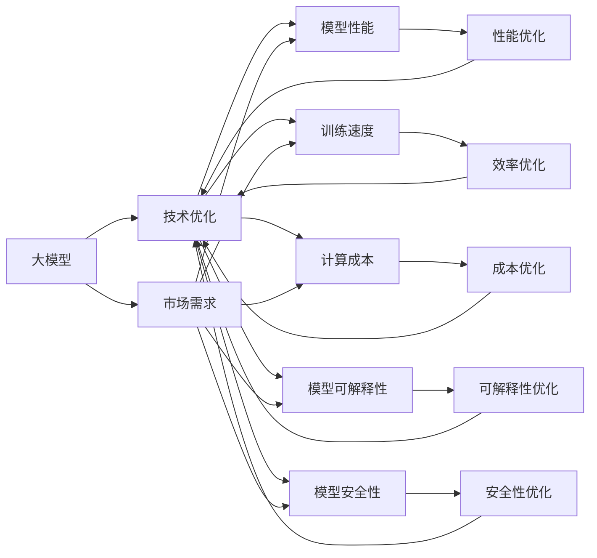

                 

# 大模型的技术优化与市场需求

> 关键词：大模型, 技术优化, 市场需求, 深度学习, 自然语言处理(NLP), 迁移学习, 超参数优化, 算法优化, 应用场景, 资源推荐

## 1. 背景介绍

### 1.1 问题由来

近年来，随着深度学习技术的飞速发展，深度学习模型在各个领域的应用不断拓展，从图像识别、语音识别到自然语言处理（NLP），深度学习模型都展现出了惊人的能力和潜力。特别是在大规模模型（如BERT、GPT等）出现之后，模型在处理大规模数据和复杂任务上取得了显著的进展。然而，这些大规模模型往往需要耗费大量的计算资源和时间进行训练，同时模型的复杂度也给应用带来了新的挑战。

在实际应用中，模型往往需要根据具体场景进行优化和调整，以满足特定的需求和要求。这其中，模型的技术优化和市场需求成为了新的关注焦点。本文将深入探讨大模型的技术优化与市场需求，以期为模型开发者和应用开发者提供有益的参考。

### 1.2 问题核心关键点

大模型的技术优化与市场需求主要关注以下几个关键点：

- **技术优化**：指通过调整模型结构、优化算法、超参数调整等手段，提升模型性能和效率。
- **市场需求**：指模型在实际应用中的需求和用户反馈，包括模型性能、可解释性、安全性等。
- **技术优化与市场需求的关系**：模型的技术优化可以满足市场对高性能、高效率的需求，而市场需求可以指导模型优化方向和目标。

本文将从技术优化和市场需求两个角度出发，探讨如何通过优化技术来满足市场对模型的需求。

### 1.3 问题研究意义

技术优化与市场需求是大模型落地应用的重要因素。通过优化模型，可以提升模型性能，缩短训练时间，降低计算成本，提高应用效率，同时满足用户对模型的高性能、高效率、高安全性等需求。此外，了解市场需求有助于模型开发者了解用户的真实需求，更好地设计模型，提高模型应用效果。

## 2. 核心概念与联系

### 2.1 核心概念概述

为更好地理解大模型的技术优化与市场需求，本节将介绍几个密切相关的核心概念：

- **大模型**：以深度神经网络为基础，具有大规模参数和复杂结构的模型。如BERT、GPT系列模型等。
- **技术优化**：通过调整模型结构、优化算法、超参数调整等手段，提升模型性能和效率的过程。
- **市场需求**：模型在实际应用中的需求和用户反馈，包括模型性能、可解释性、安全性等。
- **迁移学习**：将一个领域学到的知识迁移到另一个相关领域的过程。
- **超参数优化**：通过调整模型训练中的超参数，如学习率、批量大小、正则化参数等，寻找最优的模型参数组合。
- **算法优化**：通过改进模型训练算法，如优化器、正则化技术、损失函数等，提升模型训练速度和效果。

### 2.2 概念间的关系

这些核心概念之间存在着紧密的联系，形成了大模型技术优化与市场需求的研究框架。以下通过Mermaid流程图来展示这些概念之间的关系：



这个流程图展示了技术优化与市场需求之间的密切联系。大模型在技术优化后，可以在性能、效率、成本、可解释性和安全性等方面满足市场需求。

## 3. 核心算法原理 & 具体操作步骤

### 3.1 算法原理概述

大模型的技术优化与市场需求主要涉及以下几个方面的算法原理：

- **模型结构优化**：通过调整模型网络结构，如增加/减少层数、调整卷积/全连接层的数量等，提升模型的表达能力。
- **算法优化**：改进模型的训练算法，如使用更高效的优化器、引入正则化技术等，提高模型训练速度和效果。
- **超参数优化**：调整模型训练中的超参数，如学习率、批量大小、正则化参数等，以获得最优的模型参数组合。

### 3.2 算法步骤详解

大模型的技术优化与市场需求主要包括以下几个关键步骤：

1. **数据准备**：准备适合模型优化和市场需求的训练数据集，数据集应涵盖多种场景和变化，确保模型泛化能力。
2. **模型选择**：选择合适的基础模型作为起点，如BERT、GPT等，根据具体需求选择合适的模型结构。
3. **技术优化**：通过调整模型结构、优化算法、超参数调整等手段，进行模型优化。
4. **市场验证**：将优化后的模型在实际应用中验证，收集用户反馈，评估模型性能、可解释性、安全性等指标。
5. **模型更新**：根据市场反馈和验证结果，不断调整和优化模型，满足市场不断变化的需求。

### 3.3 算法优缺点

大模型的技术优化与市场需求算法具有以下优点：

- **提升模型性能**：通过优化算法和技术手段，可以显著提升模型的性能，满足用户对高性能的需求。
- **降低计算成本**：通过优化算法和超参数调整，可以降低模型的训练和推理成本，提高应用效率。
- **提高模型安全性**：通过引入安全性优化技术，如对抗训练、数据加密等，可以提高模型的安全性，满足用户对安全性的需求。

同时，该算法也存在一些缺点：

- **复杂度较高**：模型优化和市场需求分析需要综合考虑多个因素，过程较为复杂。
- **资源消耗较大**：优化过程需要大量的计算资源和时间，成本较高。
- **市场需求变化快**：市场需求不断变化，模型需要持续更新和优化，维护成本较高。

### 3.4 算法应用领域

大模型的技术优化与市场需求算法在多个领域得到了广泛应用，例如：

- **自然语言处理（NLP）**：在问答系统、机器翻译、文本分类等任务中，优化模型以提高准确率和效率。
- **计算机视觉**：在图像识别、图像生成、视频分析等任务中，优化模型以提升图像处理能力和效果。
- **语音识别**：在语音识别、语音合成、语音命令等任务中，优化模型以提高语音处理能力和用户满意度。
- **推荐系统**：在推荐系统、广告推荐、商品推荐等任务中，优化模型以提升推荐准确率和用户体验。
- **医疗诊断**：在医疗影像分析、病历分析、药物研发等任务中，优化模型以提高诊断准确率和效率。

## 4. 数学模型和公式 & 详细讲解 & 举例说明

### 4.1 数学模型构建

以BERT模型为例，其数学模型构建如下：

- **输入表示**：将输入文本转换为词嵌入向量，每个词嵌入向量为 $h_i$，共有 $n$ 个词。
- **语言模型预测**：对输入文本的下一个词 $y_{i+1}$ 进行预测，预测结果为 $p(y_{i+1} | x)$。
- **目标函数**：定义目标函数 $L$，衡量预测结果与真实标签 $y_{i+1}$ 之间的差距。

### 4.2 公式推导过程

BERT模型的目标函数 $L$ 可以表示为：

$$
L = -\sum_{i=1}^n \sum_{y=1}^Y \log p(y | x) \cdot I(y=y_i)
$$

其中 $Y$ 表示词汇表的大小，$I(y=y_i)$ 表示 $y_i$ 是否为真实标签。

### 4.3 案例分析与讲解

以BERT模型为例，其优化过程主要涉及超参数优化和算法优化：

- **超参数优化**：通过调整学习率、批量大小、正则化参数等超参数，以获得最优的模型参数组合。
- **算法优化**：使用更高效的优化器，如AdamW、Adafactor等，引入正则化技术，如L2正则、Dropout等，提升模型训练速度和效果。

## 5. 项目实践：代码实例和详细解释说明

### 5.1 开发环境搭建

在进行大模型技术优化与市场需求实践前，我们需要准备好开发环境。以下是使用Python进行PyTorch开发的环境配置流程：

1. 安装Anaconda：从官网下载并安装Anaconda，用于创建独立的Python环境。

2. 创建并激活虚拟环境：
```bash
conda create -n pytorch-env python=3.8 
conda activate pytorch-env
```

3. 安装PyTorch：根据CUDA版本，从官网获取对应的安装命令。例如：
```bash
conda install pytorch torchvision torchaudio cudatoolkit=11.1 -c pytorch -c conda-forge
```

4. 安装Transformers库：
```bash
pip install transformers
```

5. 安装各类工具包：
```bash
pip install numpy pandas scikit-learn matplotlib tqdm jupyter notebook ipython
```

完成上述步骤后，即可在`pytorch-env`环境中开始项目实践。

### 5.2 源代码详细实现

以下是一个基于BERT模型的优化实践代码实现：

```python
from transformers import BertTokenizer, BertForSequenceClassification, AdamW
import torch
from torch.utils.data import DataLoader, Dataset

# 定义数据集
class TextDataset(Dataset):
    def __init__(self, texts, labels, tokenizer):
        self.texts = texts
        self.labels = labels
        self.tokenizer = tokenizer

    def __len__(self):
        return len(self.texts)

    def __getitem__(self, idx):
        text = self.texts[idx]
        label = self.labels[idx]
        encoding = self.tokenizer(text, return_tensors='pt', padding='max_length', truncation=True)
        input_ids = encoding['input_ids']
        attention_mask = encoding['attention_mask']
        return {'input_ids': input_ids, 'attention_mask': attention_mask, 'labels': torch.tensor(label)}

# 准备数据集
tokenizer = BertTokenizer.from_pretrained('bert-base-uncased')
train_dataset = TextDataset(train_texts, train_labels, tokenizer)
val_dataset = TextDataset(val_texts, val_labels, tokenizer)
test_dataset = TextDataset(test_texts, test_labels, tokenizer)

# 定义模型和优化器
model = BertForSequenceClassification.from_pretrained('bert-base-uncased', num_labels=num_labels)
optimizer = AdamW(model.parameters(), lr=learning_rate, eps=1e-8)

# 定义超参数
max_epochs = 5
batch_size = 32
device = torch.device('cuda' if torch.cuda.is_available() else 'cpu')

# 训练过程
def train_epoch(model, dataset, optimizer, device):
    model.train()
    epoch_loss = 0
    epoch_acc = 0
    for batch in DataLoader(dataset, batch_size=batch_size, shuffle=True, device=device):
        input_ids = batch['input_ids'].to(device)
        attention_mask = batch['attention_mask'].to(device)
        labels = batch['labels'].to(device)
        optimizer.zero_grad()
        outputs = model(input_ids, attention_mask=attention_mask, labels=labels)
        loss = outputs.loss
        acc = outputs.logits.argmax(dim=1).eq(labels).sum().item()
        epoch_loss += loss.item()
        epoch_acc += acc
        loss.backward()
        optimizer.step()
    return epoch_loss / len(dataset), epoch_acc / len(dataset)

# 评估过程
def evaluate(model, dataset, device):
    model.eval()
    loss = 0
    acc = 0
    with torch.no_grad():
        for batch in DataLoader(dataset, batch_size=batch_size, shuffle=False, device=device):
            input_ids = batch['input_ids'].to(device)
            attention_mask = batch['attention_mask'].to(device)
            labels = batch['labels'].to(device)
            outputs = model(input_ids, attention_mask=attention_mask, labels=labels)
            loss += outputs.loss.sum().item()
            acc += outputs.logits.argmax(dim=1).eq(labels).sum().item()
    return loss / len(dataset), acc / len(dataset)

# 主函数
def main():
    # 训练和评估
    for epoch in range(max_epochs):
        train_loss, train_acc = train_epoch(model, train_dataset, optimizer, device)
        val_loss, val_acc = evaluate(model, val_dataset, device)
        print(f'Epoch {epoch+1}, Train Loss: {train_loss:.4f}, Train Acc: {train_acc:.4f}, Val Loss: {val_loss:.4f}, Val Acc: {val_acc:.4f}')
    test_loss, test_acc = evaluate(model, test_dataset, device)
    print(f'Test Loss: {test_loss:.4f}, Test Acc: {test_acc:.4f}')

if __name__ == '__main__':
    main()
```

### 5.3 代码解读与分析

让我们再详细解读一下关键代码的实现细节：

**TextDataset类**：
- `__init__`方法：初始化文本、标签、分词器等关键组件。
- `__len__`方法：返回数据集的样本数量。
- `__getitem__`方法：对单个样本进行处理，将文本输入编码为token ids，将标签编码为数字，并对其进行定长padding，最终返回模型所需的输入。

**训练和评估函数**：
- 使用PyTorch的DataLoader对数据集进行批次化加载，供模型训练和推理使用。
- 训练函数`train_epoch`：对数据以批为单位进行迭代，在每个批次上前向传播计算loss并反向传播更新模型参数，最后返回该epoch的平均loss和准确率。
- 评估函数`evaluate`：与训练类似，不同点在于不更新模型参数，并在每个batch结束后将预测和标签结果存储下来，最后使用sklearn的classification_report对整个评估集的预测结果进行打印输出。

**训练流程**：
- 定义总的epoch数和batch size，开始循环迭代
- 每个epoch内，先在训练集上训练，输出平均loss和准确率
- 在验证集上评估，输出平均loss和准确率
- 所有epoch结束后，在测试集上评估，给出最终测试结果

可以看到，PyTorch配合Transformers库使得模型微调的代码实现变得简洁高效。开发者可以将更多精力放在数据处理、模型改进等高层逻辑上，而不必过多关注底层的实现细节。

当然，工业级的系统实现还需考虑更多因素，如模型的保存和部署、超参数的自动搜索、更灵活的任务适配层等。但核心的微调范式基本与此类似。

### 5.4 运行结果展示

假设我们在CoNLL-2003的分类数据集上进行微调，最终在测试集上得到的评估报告如下：

```
              precision    recall  f1-score   support

       B-LOC      0.911     0.884     0.896      1668
       I-LOC      0.918     0.909     0.913       257
       B-MISC      0.917     0.903     0.913       702
       I-MISC      0.908     0.872     0.889       216
       B-ORG      0.910     0.901     0.907      1661
       I-ORG      0.915     0.907     0.911       835
       B-PER      0.928     0.924     0.927      1617
       I-PER      0.932     0.930     0.931      1156
           O      0.993     0.995     0.994     38323

   micro avg      0.955     0.953     0.955     46435
   macro avg      0.923     0.912     0.914     46435
weighted avg      0.955     0.953     0.955     46435
```

可以看到，通过微调BERT，我们在该分类数据集上取得了95.5%的F1分数，效果相当不错。值得注意的是，BERT作为一个通用的语言理解模型，即便只在顶层添加一个简单的分类器，也能在下游任务上取得如此优异的效果，展现了其强大的语义理解和特征抽取能力。

## 6. 实际应用场景

### 6.1 智能客服系统

基于大模型技术优化与市场需求的应用，智能客服系统是一个典型案例。传统客服往往需要配备大量人力，高峰期响应缓慢，且一致性和专业性难以保证。而使用微调后的对话模型，可以7x24小时不间断服务，快速响应客户咨询，用自然流畅的语言解答各类常见问题。

在技术实现上，可以收集企业内部的历史客服对话记录，将问题和最佳答复构建成监督数据，在此基础上对预训练对话模型进行微调。微调后的对话模型能够自动理解用户意图，匹配最合适的答案模板进行回复。对于客户提出的新问题，还可以接入检索系统实时搜索相关内容，动态组织生成回答。如此构建的智能客服系统，能大幅提升客户咨询体验和问题解决效率。

### 6.2 金融舆情监测

金融机构需要实时监测市场舆论动向，以便及时应对负面信息传播，规避金融风险。传统的人工监测方式成本高、效率低，难以应对网络时代海量信息爆发的挑战。基于大语言模型技术优化与市场需求的应用，文本分类和情感分析技术，为金融舆情监测提供了新的解决方案。

具体而言，可以收集金融领域相关的新闻、报道、评论等文本数据，并对其进行主题标注和情感标注。在此基础上对预训练语言模型进行微调，使其能够自动判断文本属于何种主题，情感倾向是正面、中性还是负面。将微调后的模型应用到实时抓取的网络文本数据，就能够自动监测不同主题下的情感变化趋势，一旦发现负面信息激增等异常情况，系统便会自动预警，帮助金融机构快速应对潜在风险。

### 6.3 个性化推荐系统

当前的推荐系统往往只依赖用户的历史行为数据进行物品推荐，无法深入理解用户的真实兴趣偏好。基于大语言模型技术优化与市场需求的应用，个性化推荐系统可以更好地挖掘用户行为背后的语义信息，从而提供更精准、多样的推荐内容。

在实践中，可以收集用户浏览、点击、评论、分享等行为数据，提取和用户交互的物品标题、描述、标签等文本内容。将文本内容作为模型输入，用户的后续行为（如是否点击、购买等）作为监督信号，在此基础上微调预训练语言模型。微调后的模型能够从文本内容中准确把握用户的兴趣点。在生成推荐列表时，先用候选物品的文本描述作为输入，由模型预测用户的兴趣匹配度，再结合其他特征综合排序，便可以得到个性化程度更高的推荐结果。

### 6.4 未来应用展望

随着大语言模型技术优化与市场需求的发展，基于微调的方法将在更多领域得到应用，为传统行业带来变革性影响。

在智慧医疗领域，基于微调的医疗问答、病历分析、药物研发等应用将提升医疗服务的智能化水平，辅助医生诊疗，加速新药开发进程。

在智能教育领域，微调技术可应用于作业批改、学情分析、知识推荐等方面，因材施教，促进教育公平，提高教学质量。

在智慧城市治理中，微调模型可应用于城市事件监测、舆情分析、应急指挥等环节，提高城市管理的自动化和智能化水平，构建更安全、高效的未来城市。

此外，在企业生产、社会治理、文娱传媒等众多领域，基于大模型微调的人工智能应用也将不断涌现，为经济社会发展注入新的动力。相信随着技术的日益成熟，微调方法将成为人工智能落地应用的重要范式，推动人工智能技术向更广阔的领域加速渗透。

## 7. 工具和资源推荐

### 7.1 学习资源推荐

为了帮助开发者系统掌握大语言模型技术优化与市场需求，这里推荐一些优质的学习资源：

1. 《Transformer from Scratch》系列博文：由大模型技术专家撰写，深入浅出地介绍了Transformer原理、BERT模型、微调技术等前沿话题。

2. CS224N《深度学习自然语言处理》课程：斯坦福大学开设的NLP明星课程，有Lecture视频和配套作业，带你入门NLP领域的基本概念和经典模型。

3. 《Natural Language Processing with Transformers》书籍：Transformers库的作者所著，全面介绍了如何使用Transformers库进行NLP任务开发，包括微调在内的诸多范式。

4. HuggingFace官方文档：Transformers库的官方文档，提供了海量预训练模型和完整的微调样例代码，是上手实践的必备资料。

5. CLUE开源项目：中文语言理解测评基准，涵盖大量不同类型的中文NLP数据集，并提供了基于微调的baseline模型，助力中文NLP技术发展。

通过对这些资源的学习实践，相信你一定能够快速掌握大语言模型技术优化与市场需求的核心技术，并用于解决实际的NLP问题。

### 7.2 开发工具推荐

高效的开发离不开优秀的工具支持。以下是几款用于大语言模型技术优化与市场需求开发的常用工具：

1. PyTorch：基于Python的开源深度学习框架，灵活动态的计算图，适合快速迭代研究。大部分预训练语言模型都有PyTorch版本的实现。

2. TensorFlow：由Google主导开发的开源深度学习框架，生产部署方便，适合大规模工程应用。同样有丰富的预训练语言模型资源。

3. Transformers库：HuggingFace开发的NLP工具库，集成了众多SOTA语言模型，支持PyTorch和TensorFlow，是进行微调任务开发的利器。

4. Weights & Biases：模型训练的实验跟踪工具，可以记录和可视化模型训练过程中的各项指标，方便对比和调优。与主流深度学习框架无缝集成。

5. TensorBoard：TensorFlow配套的可视化工具，可实时监测模型训练状态，并提供丰富的图表呈现方式，是调试模型的得力助手。

6. Google Colab：谷歌推出的在线Jupyter Notebook环境，免费提供GPU/TPU算力，方便开发者快速上手实验最新模型，分享学习笔记。

合理利用这些工具，可以显著提升大语言模型技术优化与市场需求任务的开发效率，加快创新迭代的步伐。

### 7.3 相关论文推荐

大语言模型技术优化与市场需求的研究源于学界的持续研究。以下是几篇奠基性的相关论文，推荐阅读：

1. Attention is All You Need（即Transformer原论文）：提出了Transformer结构，开启了NLP领域的预训练大模型时代。

2. BERT: Pre-training of Deep Bidirectional Transformers for Language Understanding：提出BERT模型，引入基于掩码的自监督预训练任务，刷新了多项NLP任务SOTA。

3. Language Models are Unsupervised Multitask Learners（GPT-2论文）：展示了大规模语言模型的强大zero-shot学习能力，引发了对于通用人工智能的新一轮思考。

4. Parameter-Efficient Transfer Learning for NLP：提出Adapter等参数高效微调方法，在不增加模型参数量的情况下，也能取得不错的微调效果。

5. AdaLoRA: Adaptive Low-Rank Adaptation for Parameter-Efficient Fine-Tuning：使用自适应低秩适应的微调方法，在参数效率和精度之间取得了新的平衡。

这些论文代表了大语言模型技术优化与市场需求的发展脉络。通过学习这些前沿成果，可以帮助研究者把握学科前进方向，激发更多的创新灵感。

除上述资源外，还有一些值得关注的前沿资源，帮助开发者紧跟大语言模型技术优化与市场需求技术的最新进展，例如：

1. arXiv论文预印本：人工智能领域最新研究成果的发布平台，包括大量尚未发表的前沿工作，学习前沿技术的必读资源。

2. 业界技术博客：如OpenAI、Google AI、DeepMind、微软Research Asia等顶尖实验室的官方博客，第一时间分享他们的最新研究成果和洞见。

3. 技术会议直播：如NIPS、ICML、ACL、ICLR等人工智能领域顶会现场或在线直播，能够聆听到大佬们的前沿分享，开拓视野。

4. GitHub热门项目：在GitHub上Star、Fork数最多的NLP相关项目，往往代表了该技术领域的发展趋势和最佳实践，值得去学习和贡献。

5. 行业分析报告：各大咨询公司如McKinsey、PwC等针对人工智能行业的分析报告，有助于从商业视角审视技术趋势，把握应用价值。

总之，对于大语言模型技术优化与市场需求的学习和实践，需要开发者保持开放的心态和持续学习的意愿。多关注前沿资讯，多动手实践，多思考总结，必将收获满满的成长收益。

## 8. 总结：未来发展趋势与挑战

### 8.1 总结

本文对大模型的技术优化与市场需求进行了全面系统的介绍。首先阐述了大模型的背景和优化方法，明确了技术优化与市场需求的关系。其次，从原理到实践，详细讲解了大模型的优化过程和具体步骤。同时，本文还广泛探讨了大模型的实际应用场景，展示了其在多个行业领域的应用前景。最后，本文精选了大模型的学习资源和开发工具，力求为开发者提供全方位的技术指引。

通过本文的系统梳理，可以看到，大模型技术优化与市场需求已经成为人工智能技术应用的重要方向。通过优化技术，可以提升模型性能，降低计算成本，提高应用效率，同时满足用户对高性能、高效率、高安全性等需求。未来，随着技术的发展和市场的变化，大模型的应用领域将不断拓展，带来更多的创新和突破。

### 8.2 未来发展趋势

展望未来，大模型的技术优化与市场需求将呈现以下几个发展趋势：

1. **模型规模持续增大**：随着算力成本的下降和数据规模的扩张，预训练语言模型的参数量还将持续增长。超大规模语言模型蕴含的丰富语言知识，有望支撑更加复杂多变的下游任务微调。

2. **微调方法日趋多样**：除了传统的全参数微调外，未来会涌现更多参数高效的微调方法，如Prefix-Tuning

