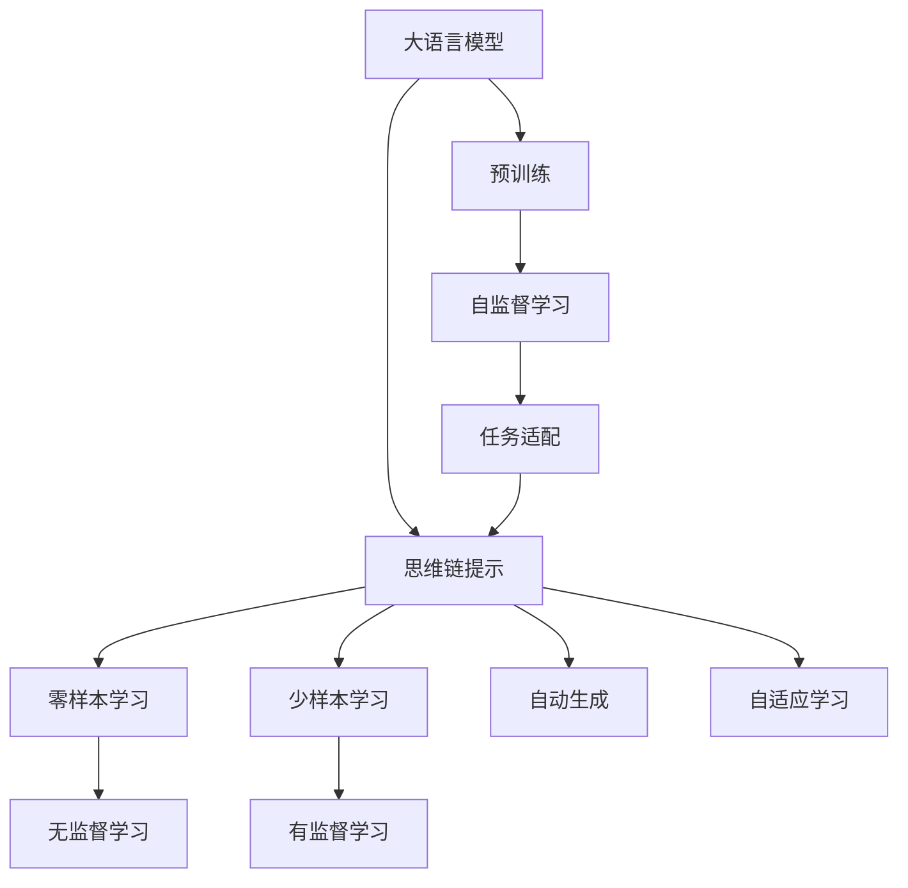
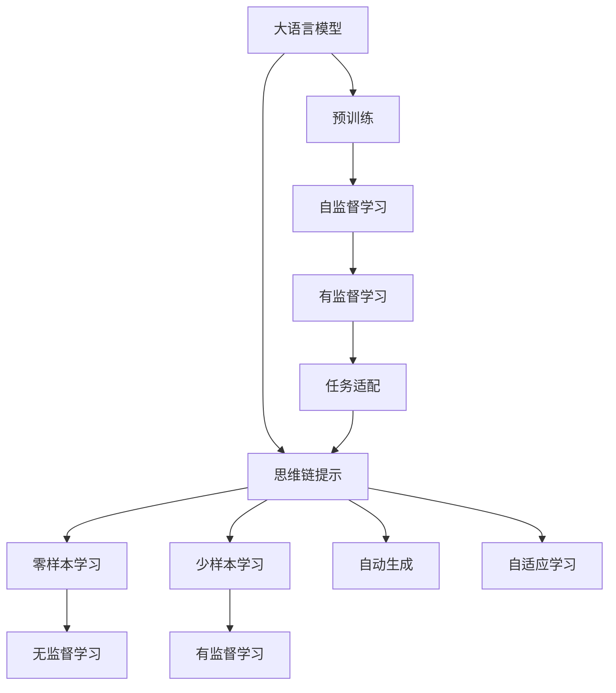
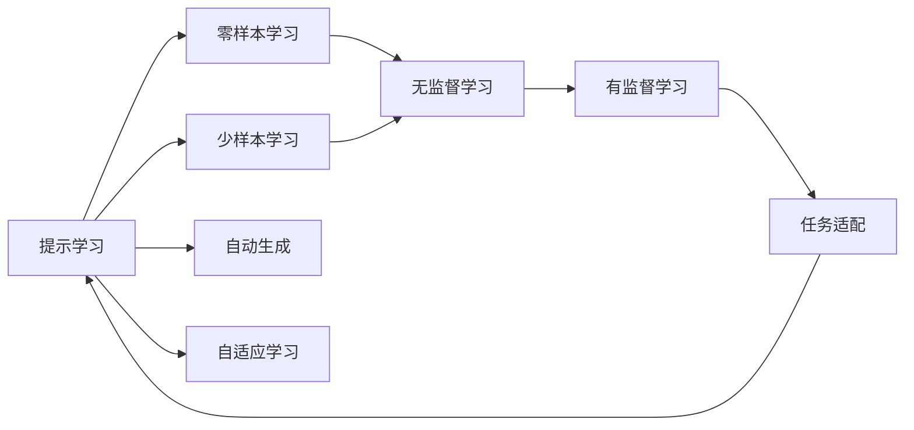
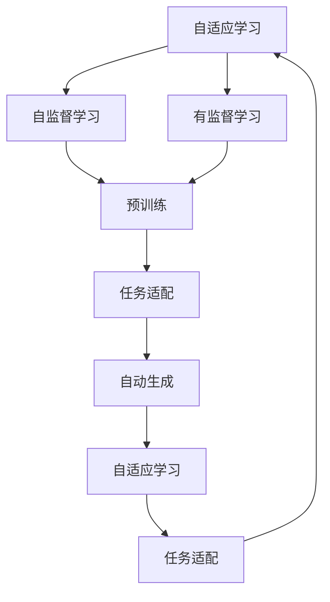
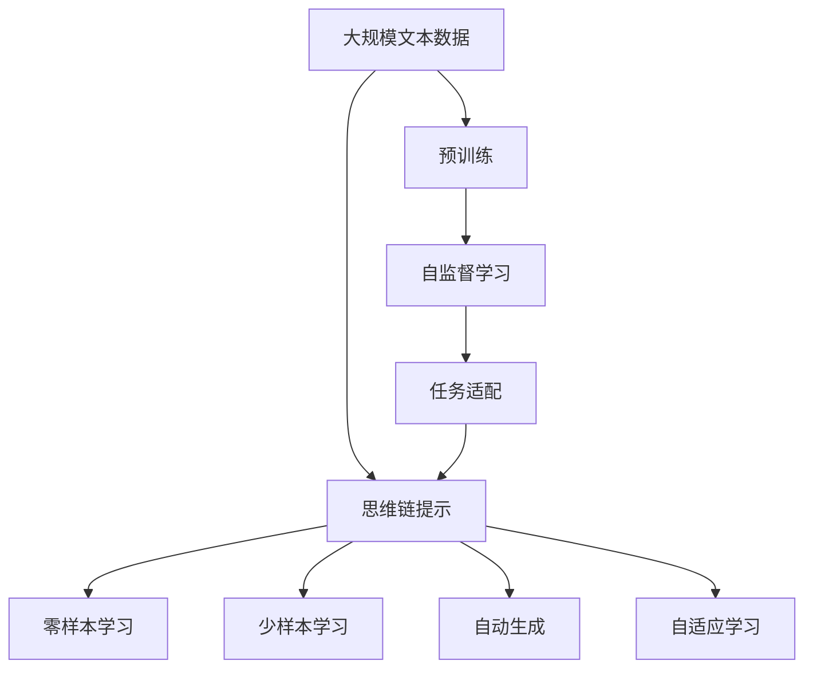

                 

# 大语言模型原理与工程实践：思维链提示

> 关键词：大语言模型,思维链提示,自然语言处理(NLP),深度学习,Transformer,BERT,自动提示生成,微调,Fine-Tuning

## 1. 背景介绍

### 1.1 问题由来
近年来，随着深度学习技术的飞速发展，自然语言处理(NLP)领域取得了巨大突破。特别是大规模预训练语言模型如BERT、GPT等，通过在海量无标签文本数据上自监督学习，获得了强大的语言理解和生成能力。这些模型在多种下游任务上取得了优异表现。

然而，这些模型也存在一些问题，如需要大量的标注数据，并且对输入的描述要求较高，难以灵活地适应不同应用场景。为了解决这些问题，研究者提出了基于思维链提示的生成方法。这种方法通过精心设计输入文本，引导模型输出符合期望的连续语义链，减少了对输入的描述需求，并提高了模型的泛化能力。

### 1.2 问题核心关键点
思维链提示的核心思想是通过在输入文本中嵌入提示模板，使得大语言模型能够根据模板生成的上下文信息，依次生成连续的语义链。这种方法可以在不改变模型架构的情况下，显著提高模型的输出质量和效果，特别是在少数样本甚至零样本的情况下表现优异。

思维链提示通常分为两种形式：
1. 连续思维链（Continuous Chains）：指在输入中连续多次引入提示模板，逐步生成多个相关的输出。
2. 离散思维链（Discrete Chains）：指在输入中多次引入不同的提示模板，生成一系列独立的输出。

这些方法已经被广泛应用于文本生成、摘要、问答、对话等多个NLP任务中，展示了其强大的潜力和广泛的应用前景。

### 1.3 问题研究意义
研究基于思维链提示的方法，对于提升NLP技术落地应用的灵活性和普适性，具有重要意义：

1. 降低应用开发成本。提示方法可以大大减少对标注数据的依赖，通过少量或零样本训练，即可实现高精度的任务适配。
2. 提高模型效果。提示方法能够利用预训练模型的语言理解能力，生成符合上下文逻辑的连贯文本，提升了模型在复杂任务上的表现。
3. 加速开发进度。提示技术能够快速实现任务适配，缩短了从预训练模型到实际应用的距离。
4. 带来技术创新。提示方法促进了深度学习在生成任务中的应用，催生了自动生成、智能问答等前沿研究方向。
5. 赋能产业升级。提示方法使得NLP技术更容易被各行各业采用，为传统行业数字化转型提供了新路径。

## 2. 核心概念与联系

### 2.1 核心概念概述

为更好地理解思维链提示在大语言模型中的应用，本节将介绍几个密切相关的核心概念：

- 大语言模型(Large Language Model, LLM)：以自回归(如GPT)或自编码(如BERT)模型为代表的大规模预训练语言模型。通过在大规模无标签文本数据上进行预训练，学习通用的语言表示，具备强大的语言理解和生成能力。

- 思维链提示(Prompt Learning)：通过在输入文本中添加提示模板(Prompt Template)，引导大语言模型进行特定任务的推理和生成。可以在不更新模型参数的情况下，实现零样本或少样本学习。

- 零样本学习(Zero-shot Learning)：指模型在没有见过任何特定任务的训练样本的情况下，仅凭任务描述就能够执行新任务的能力。大语言模型通过预训练获得的广泛知识，使其能够理解任务指令并生成相应输出。

- 少样本学习(Few-shot Learning)：指在只有少量标注样本的情况下，模型能够快速适应新任务的学习方法。在大语言模型中，通常通过在输入中提供少量示例来实现，无需更新模型参数。

- 自监督学习(Self-Supervised Learning)：指在大规模无标签数据上，通过设计自监督任务训练模型，使其学习到通用的语言表示，并在下游任务中利用这些表示进行有监督学习。

- 自动生成(Automatic Generation)：指模型根据输入的指令，自动生成符合语义逻辑的文本或数据，广泛应用于文本生成、摘要、对话等多个领域。

- 自适应学习(Adaptive Learning)：指模型能够根据输入的上下文信息，动态调整生成策略，适应不同的语言使用场景。

这些核心概念之间的逻辑关系可以通过以下Mermaid流程图来展示：



这个流程图展示了大语言模型的核心概念及其之间的关系：

1. 大语言模型通过自监督学习任务进行预训练，学习通用的语言表示。
2. 思维链提示方法通过输入文本中的提示模板，引导模型生成符合期望的连续语义链。
3. 零样本和少样本学习分别通过任务描述和少量示例实现，无需更新模型参数。
4. 自监督学习与有监督学习结合，使模型适应特定任务。
5. 自动生成和自适应学习提高了模型的灵活性和适应性。

这些概念共同构成了大语言模型的学习和应用框架，使其能够在各种场景下发挥强大的语言理解和生成能力。通过理解这些核心概念，我们可以更好地把握大语言模型的工作原理和优化方向。

### 2.2 概念间的关系

这些核心概念之间存在着紧密的联系，形成了大语言模型提示方法的完整生态系统。下面我们通过几个Mermaid流程图来展示这些概念之间的关系。

#### 2.2.1 大语言模型的学习范式



这个流程图展示了大语言模型的三种主要学习范式：

1. 大语言模型通过自监督学习进行预训练，学习通用的语言表示。
2. 提示方法通过任务适配层实现有监督微调，使模型适应特定任务。
3. 零样本和少样本学习分别通过任务描述和少量示例实现，无需更新模型参数。
4. 自动生成和自适应学习提升了模型的灵活性和适应性。

#### 2.2.2 提示学习与微调的关系



这个流程图展示了提示学习的基本原理，以及它与微调的关系：

1. 提示学习通过任务描述和少量示例实现无监督和有监督学习。
2. 提示学习可以生成符合期望的零样本或少样本输出，无需更新模型参数。
3. 提示学习与有监督微调相结合，提高了模型的泛化能力和适应性。
4. 自动生成和自适应学习进一步提升了模型的灵活性和应用范围。

#### 2.2.3 自适应学习在大语言模型中的应用



这个流程图展示了自适应学习在大语言模型中的应用：

1. 自适应学习通过自监督学习进行预训练，学习通用的语言表示。
2. 有监督学习使模型适应特定任务，增强了自适应能力。
3. 自动生成和自适应学习进一步提升了模型的灵活性和应用范围。
4. 任务适配层使模型能够适应各种NLP任务，提高了模型的泛化能力。

### 2.3 核心概念的整体架构

最后，我们用一个综合的流程图来展示这些核心概念在大语言模型提示方法中的整体架构：



这个综合流程图展示了从预训练到提示方法，再到自动生成和自适应学习的完整过程。大语言模型首先在大规模文本数据上进行预训练，然后通过提示方法生成符合期望的输出，进一步增强模型的自动生成和自适应能力。通过这些概念的协同作用，大语言模型能够在各种场景下发挥强大的语言理解和生成能力。 通过这些流程图，我们可以更清晰地理解大语言模型提示方法过程中各个核心概念的关系和作用，为后续深入讨论具体的提示方法和技术奠定基础。

## 3. 核心算法原理 & 具体操作步骤
### 3.1 算法原理概述

基于思维链提示的大语言模型生成方法，本质上是一种无监督或半监督的生成范式。其核心思想是：通过在输入文本中引入提示模板，引导大语言模型生成符合期望的连续语义链。

形式化地，假设预训练语言模型为 $M_{\theta}$，其中 $\theta$ 为预训练得到的模型参数。给定任务描述 $P$ 和提示模板 $T$，模型生成的连续语义链可以表示为：

$$
Y = M_{\theta}(P, T_1, T_2, \ldots, T_n)
$$

其中 $P$ 为任务描述，$T_i$ 为第 $i$ 个提示模板。

通过梯度下降等优化算法，模型不断更新参数 $\theta$，最小化生成的语义链 $Y$ 与期望输出 $Y^*$ 的差异。这种优化过程使得模型能够学习到如何将任务描述和提示模板转化为符合期望的输出。

### 3.2 算法步骤详解

基于思维链提示的大语言模型生成方法一般包括以下几个关键步骤：

**Step 1: 准备预训练模型和数据集**
- 选择合适的预训练语言模型 $M_{\theta}$ 作为初始化参数，如 BERT、GPT等。
- 准备任务描述 $P$ 和提示模板 $T_1, T_2, \ldots, T_n$，可以是文本、符号或其他形式。

**Step 2: 定义任务适配层**
- 根据任务类型，在预训练模型顶层设计合适的输出层和损失函数。
- 对于生成任务，通常使用语言模型的解码器输出概率分布，并以负对数似然为损失函数。
- 对于分类任务，通常在顶层添加线性分类器和交叉熵损失函数。

**Step 3: 设置提示微调超参数**
- 选择合适的优化算法及其参数，如 AdamW、SGD 等，设置学习率、批大小、迭代轮数等。
- 设置正则化技术及强度，包括权重衰减、Dropout、Early Stopping等。
- 确定冻结预训练参数的策略，如仅微调顶层，或全部参数都参与微调。

**Step 4: 执行提示训练**
- 将提示模板 $T_1, T_2, \ldots, T_n$ 与任务描述 $P$ 拼接，前向传播计算损失函数。
- 反向传播计算参数梯度，根据设定的优化算法和学习率更新模型参数。
- 周期性在验证集上评估模型性能，根据性能指标决定是否触发 Early Stopping。
- 重复上述步骤直到满足预设的迭代轮数或 Early Stopping 条件。

**Step 5: 测试和部署**
- 在测试集上评估提示微调后模型 $M_{\hat{\theta}}$ 的性能，对比提示微调前后的精度提升。
- 使用提示微调后的模型对新样本进行推理预测，集成到实际的应用系统中。
- 持续收集新的数据，定期重新提示微调模型，以适应数据分布的变化。

以上是基于思维链提示的大语言模型生成的一般流程。在实际应用中，还需要针对具体任务的特点，对提示微调过程的各个环节进行优化设计，如改进训练目标函数，引入更多的正则化技术，搜索最优的超参数组合等，以进一步提升模型性能。

### 3.3 算法优缺点

基于思维链提示的大语言模型生成方法具有以下优点：

1. 简单高效。提示方法可以大大减少对标注数据的依赖，通过少量或零样本训练，即可实现高精度的任务适配。
2. 通用适用。适用于各种NLP生成任务，如文本摘要、对话生成、翻译等，设计简单的提示模板即可实现生成。
3. 参数高效。利用提示微调技术，在固定大部分预训练参数的情况下，仍可取得不错的生成效果。
4. 效果显著。在学术界和工业界的诸多任务上，基于提示的方法已经刷新了最先进的性能指标。

同时，该方法也存在一定的局限性：

1. 依赖输入描述。提示方法的效果很大程度上取决于提示模板的质量和设计，设计好的提示模板可以大幅提升生成效果。
2. 难以处理复杂上下文。提示方法在处理复杂上下文时，生成的文本可能出现连贯性差、语法错误等问题。
3. 数据增强困难。提示方法难以像微调那样通过数据增强提升生成效果，生成质量受限于输入模板。
4. 推理效率有待提高。提示方法在推理生成时，模型的计算复杂度较高，需要优化以提高生成速度。
5. 可解释性不足。提示方法生成的文本缺乏可解释性，难以对其推理逻辑进行分析和调试。

尽管存在这些局限性，但就目前而言，基于思维链提示的生成方法仍是大语言模型生成任务的主流范式。未来相关研究的重点在于如何进一步提高提示模板的设计质量，提升生成模型的泛化能力，同时兼顾可解释性和伦理安全性等因素。

### 3.4 算法应用领域

基于大语言模型提示的生成方法，在NLP领域已经得到了广泛的应用，覆盖了几乎所有常见任务，例如：

- 文本生成：如作文、新闻、报告等。通过提示模板引导模型生成符合语义逻辑的文本。
- 对话生成：与用户自然对话，生成连贯的回复。通过对话历史和上下文信息进行生成。
- 摘要生成：将长文本压缩成简短摘要。通过摘要模板进行生成。
- 翻译生成：将源语言文本翻译成目标语言。通过翻译模板进行生成。
- 代码生成：根据任务描述生成程序代码。通过代码模板进行生成。
- 数据增强：生成符合训练数据分布的新样本，丰富训练集多样性。
- 推理生成：根据问题模板生成推理过程和结果。通过推理模板进行生成。

除了上述这些经典任务外，提示方法也被创新性地应用到更多场景中，如可控文本生成、常识推理、数据增强等，为NLP技术带来了全新的突破。随着预训练模型和提示方法的不断进步，相信NLP技术将在更广阔的应用领域大放异彩。

## 4. 数学模型和公式 & 详细讲解  
### 4.1 数学模型构建

本节将使用数学语言对基于思维链提示的大语言模型生成过程进行更加严格的刻画。

记预训练语言模型为 $M_{\theta}$，其中 $\theta$ 为预训练得到的模型参数。假设提示任务描述为 $P$，提示模板为 $T_1, T_2, \ldots, T_n$，生成结果为 $Y$。

定义模型 $M_{\theta}$ 在输入 $P, T_1, T_2, \ldots, T_n$ 上的损失函数为 $\ell(M_{\theta}(P, T_1, T_2, \ldots, T_n),Y)$，则在提示数据集 $D=\{(P_i, T_{i1}, T_{i2}, \ldots, T_{in}, Y_i)\}_{i=1}^N$ 上的经验风险为：

$$
\mathcal{L}(\theta) = \frac{1}{N} \sum_{i=1}^N \ell(M_{\theta}(P_i, T_{i1}, T_{i2}, \ldots, T_{in}), Y_i)
$$

微调的优化目标是最小化经验风险，即找到最优参数：

$$
\theta^* = \mathop{\arg\min}_{\theta} \mathcal{L}(\theta)
$$

在实践中，我们通常使用基于梯度的优化算法（如SGD、Adam等）来近似求解上述最优化问题。设 $\eta$ 为学习率，$\lambda$ 为正则化系数，则参数的更新公式为：

$$
\theta \leftarrow \theta - \eta \nabla_{\theta}\mathcal{L}(\theta) - \eta\lambda\theta
$$

其中 $\nabla_{\theta}\mathcal{L}(\theta)$ 为损失函数对参数 $\theta$ 的梯度，可通过反向传播算法高效计算。

### 4.2 公式推导过程

以下我们以文本生成任务为例，推导提示损失函数及其梯度的计算公式。

假设模型 $M_{\theta}$ 在输入 $P$ 上的输出为 $\hat{Y}=M_{\theta}(P, T_1, T_2, \ldots, T_n) \in [0,1]$，表示样本属于生成结果的分布概率。真实标签 $Y$ 为生成的文本序列。则生成任务的损失函数定义为：

$$
\ell(M_{\theta}(P, T_1, T_2, \ldots, T_n),Y) = -\log P(Y | P, T_1, T_2, \ldots, T_n)
$$

将其代入经验风险公式，得：

$$
\mathcal{L}(\theta) = -\frac{1}{N}\sum_{i=1}^N \log P(Y_i | P_i, T_{i1}, T_{i2}, \ldots, T_{in})
$$

根据链式法则，损失函数对参数 $\theta_k$ 的梯度为：

$$
\frac{\partial \mathcal{L}(\theta)}{\partial \theta_k} = -\frac{1}{N}\sum_{i=1}^N \left(\frac{\partial \log P(Y_i | P_i, T_{i1}, T_{i2}, \ldots, T_{in})}{\partial \theta_k}\right)
$$

其中 $\frac{\partial \log P(Y_i | P_i, T_{i1}, T_{i2}, \ldots, T_{in})$ 可以通过自动微分技术高效计算。

在得到损失函数的梯度后，即可带入参数更新公式，完成模型的迭代优化。重复上述过程直至收敛，最终得到提示微调后适应下游任务的最优模型参数 $\theta^*$。

## 5. 项目实践：代码实例和详细解释说明
### 5.1 开发环境搭建

在进行提示实践前，我们需要准备好开发环境。以下是使用Python进行PyTorch开发的环境配置流程：

1. 安装Anaconda：从官网下载并安装Anaconda，用于创建独立的Python环境。

2. 创建并激活虚拟环境：
```bash
conda create -n pytorch-env python=3.8 
conda activate pytorch-env
```

3. 安装PyTorch：根据CUDA版本，从官网获取对应的安装命令。例如：
```bash
conda install pytorch torchvision torchaudio cudatoolkit=11.1 -c pytorch -c conda-forge
```

4. 安装Transformers库：
```bash
pip install transformers
```

5. 安装各类工具包：
```bash
pip install numpy pandas scikit-learn matplotlib tqdm jupyter notebook ipython
```

完成上述步骤后，即可在`pytorch-env`环境中开始提示实践。

### 5.2 源代码详细实现

下面我们以摘要生成任务为例，给出使用Transformers库对BERT模型进行提示微调的PyTorch代码实现。

首先，定义摘要任务的数据处理函数：

```python
from transformers import BertTokenizer
from torch.utils.data import Dataset
import torch

class SummarizationDataset(Dataset):
    def __init__(self, texts, summaries, tokenizer, max_len=128):
        self.texts = texts
        self.summaries = summaries
        self.tokenizer = tokenizer
        self.max_len = max_len
        
    def __len__(self):
        return len(self.texts)
    
    def __getitem__(self, item):
        text = self.texts[item]
        summary = self.summaries[item]
        
        encoding = self.tokenizer(text, return_tensors='pt', max_length=self.max_len, padding='max_length', truncation=True)
        input_ids = encoding['input_ids'][0]
        attention_mask = encoding['attention_mask'][0]
        
        # 对摘要进行编码
        summaries = [tokenizer.convert_tokens_to_ids(tokenizer.encode(summary)) for summary in self.summaries]
        summaries.extend([tokenizer.convert_tokens_to_ids(tokenizer.convert_tokens_to_ids(['O'] * (self.max_len - len(summary)))) for summary in self.summaries])
        labels = torch.tensor(summaries, dtype=torch.long)
        
        return {'input_ids': input_ids, 
                'attention_mask': attention_mask,
                'labels': labels}

# 标签与id的映射
tag2id = {'O': 0, 'B-sum': 1, 'I-sum': 2}
id2tag = {v: k for k, v in tag2id.items()}

# 创建dataset
tokenizer = BertTokenizer.from_pretrained('bert-base-cased')

train_dataset = SummarizationDataset(train_texts, train_summaries, tokenizer)
dev_dataset = SummarizationDataset(dev_texts, dev_summaries, tokenizer)
test_dataset = SummarizationDataset(test_texts, test_summaries, tokenizer)
```

然后，定义模型和优化器：

```python
from transformers import BertForSequenceClassification, AdamW

model = BertForSequenceClassification.from_pretrained('bert-base-cased', num_labels=len(tag2id))

optimizer = AdamW(model.parameters(), lr=2e-5)
```

接着，定义训练和评估函数：

```python
from torch.utils.data import DataLoader
from tqdm import tqdm
from sklearn.metrics import classification_report

device = torch.device('cuda') if torch.cuda.is_available() else torch.device('cpu')
model.to(device)

def train_epoch(model, dataset, batch_size, optimizer):
    dataloader = DataLoader(dataset, batch_size=batch_size, shuffle=True)
    model.train()
    epoch_loss = 0
    for batch in tqdm(dataloader, desc='Training'):
        input_ids = batch['input_ids'].to(device)
        attention_mask = batch['attention_mask'].to(device)
        labels = batch['labels'].to(device)
        model.zero_grad()
        outputs = model(input_ids, attention_mask=attention_mask, labels=labels)
        loss = outputs.loss
        epoch_loss += loss.item()
        loss.backward()
        optimizer.step()
    return epoch_loss / len(dataloader)

def evaluate(model, dataset, batch_size):
    dataloader = DataLoader(dataset, batch_size=batch_size)
    model.eval()
    preds, labels = [], []
    with torch.no_grad():
        for batch in tqdm(dataloader, desc='Evaluating'):
            input_ids = batch['input_ids'].to(device)
            attention_mask = batch['attention_mask'].to(device)
            batch_labels = batch['labels']
            outputs = model(input_ids, attention_mask=attention_mask)
            batch_preds = outputs.logits.argmax(dim=2).to('cpu').tolist()
            batch_labels = batch_labels.to('cpu').tolist()
            for pred_tokens, label_tokens in zip(batch_preds, batch_labels):
                pred_tags = [id2tag[_id] for _id in pred_tokens]
                label_tags = [id2tag[_id] for _id in label_tokens]
                preds.append(pred_tags[:len(label_tags)])
                labels.append(label_tags)
                
    print(classification_report(labels, preds))
```

最后，启动训练流程并在测试集上评估：

```python
epochs = 5
batch_size = 16

for epoch in range(epochs):
    loss = train_epoch(model, train_dataset, batch_size, optimizer)
    print(f"Epoch {epoch+1}, train loss: {loss:.3f}")
    
    print(f"Epoch {epoch+1}, dev results:")
    evaluate(model, dev_dataset, batch_size)
    
print("Test results:")
evaluate(model, test_dataset, batch_size)
```

以上就是使用PyTorch对BERT进行摘要生成任务提示微调的完整代码实现。可以看到，得益于Transformers库的强大封装，我们可以用相对简洁的代码完成BERT模型的加载和提示微调。

### 5.3 代码解读与分析

让我们再详细解读一下关键代码的实现细节：

**SummarizationDataset类**：
- `__init__`方法：初始化文本、摘要、分词器等关键组件。
- `__len__`方法：返回数据集的样本数量。
- `__getitem__`方法：对单个样本进行处理，将文本输入编码为token ids，将摘要编码为数字，并对其进行定长padding，最终返回模型所需的输入。

**tag2id和id2tag字典**：
- 定义了标签与数字id之间的映射关系，

