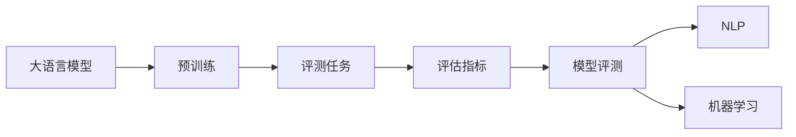

                 

# 大语言模型原理与工程实践：评测任务

> 关键词：大语言模型, 预训练模型, 评测任务, 评估指标, 模型评测, 自然语言处理(NLP), 机器学习

## 1. 背景介绍

### 1.1 问题由来
近年来，大语言模型的发展如火如荼，为自然语言处理(NLP)带来了翻天覆地的变化。以BERT、GPT-3为代表的大模型，通过在 massive scale of data 上进行自监督预训练，获得了强大的语言理解能力，并在诸多下游任务上取得了显著的提升。然而，模型的表现好坏，仅凭人为的主观评估是不够的。基于此，模型评测成为了研究大语言模型性能的重要环节。

### 1.2 问题核心关键点
在自然语言处理领域，模型评测是衡量模型性能的关键手段。优秀的评测方法不仅能全面客观地评估模型的性能，还能发现模型的短板，指导后续的优化工作。在评测过程中，通常会使用一些常见的评估指标，如精确率(accuracy)、召回率(recall)、F1-score、BLEU等，用于衡量模型的分类、匹配、生成能力。

### 1.3 问题研究意义
研究大语言模型的评测方法，对于提升模型性能，优化模型设计，加速NLP技术的产业化进程具有重要意义：

1. **模型评估**：通过全面准确的评测，客观评估模型效果，避免人为主观判断。
2. **性能提升**：及时发现模型问题，指导模型优化，提升模型性能。
3. **应用指导**：评测结果可为模型选择、部署提供依据，加速模型落地应用。
4. **学术交流**：促进模型间的比较，推动学术研究和工业界的沟通交流。
5. **模型优化**：发现模型缺陷，指导模型改进，促进模型鲁棒性和泛化能力的提升。

## 2. 核心概念与联系

### 2.1 核心概念概述

在大语言模型的评测过程中，需要理解以下核心概念：

- 大语言模型(Large Language Model, LLM)：指通过大规模无标签文本语料进行预训练，具备强大语言理解能力的通用模型。
- 预训练模型(Pre-trained Model)：指在无标签文本数据上进行自监督预训练，学习语言知识的模型。
- 评测任务(Evaluation Task)：指对模型在特定任务上性能的评估。
- 评估指标(Metrics)：指衡量模型性能的各类指标，如精确率、召回率、F1-score等。
- 模型评测(Model Evaluation)：指通过各类评估指标，衡量模型在特定任务上的性能的过程。
- 自然语言处理(NLP)：研究如何让计算机理解、处理自然语言的学科。
- 机器学习(Machine Learning)：使计算机从数据中学习知识，进行自动化的推理和决策。

这些核心概念间的关系可用如下Mermaid流程图来表示：



### 2.2 概念间的关系

这些核心概念之间的关系紧密，构成了大语言模型评测的完整框架。

- 大语言模型通过大规模无标签文本数据的预训练，获得了通用的语言表示，具备处理各类自然语言任务的能力。
- 预训练模型作为大语言模型的基础，其性能在一定程度上决定了模型在特定任务上的表现。
- 评测任务是指模型在具体应用场景中的任务，如问答、命名实体识别、文本分类等。
- 评估指标是衡量模型在任务上性能的关键指标，不同任务有不同的指标选择。
- 模型评测是评估模型性能的具体实践过程，通过各类评估指标，全面反映模型效果。
- NLP和机器学习是大语言模型评测的理论基础，提供了理论指导和实践方法。

## 3. 核心算法原理 & 具体操作步骤

### 3.1 算法原理概述

在大语言模型评测中，常用的方法包括监督学习和无监督学习。监督学习评测是指使用标注数据训练模型，并在验证集上评估其性能；无监督学习评测则是使用无标签数据，通过一些自监督任务评估模型。

具体来说，大语言模型评测可以分为以下几个步骤：

1. 收集任务相关的标注数据集，构建训练集、验证集和测试集。
2. 使用训练集训练模型，并使用验证集进行超参数调优，得到最优模型。
3. 在测试集上评估模型性能，根据具体任务选择不同的评估指标。
4. 输出评测结果，并根据结果指导后续模型优化。

### 3.2 算法步骤详解

下面以命名实体识别(NER)任务为例，详细阐述模型评测的流程：

1. **数据集准备**：
   - 收集标注数据集，并划分为训练集、验证集和测试集。例如，可以使用CoNLL-2003NER数据集，将文本和对应的实体标注作为训练数据。
   - 使用BERT、RoBERTa等预训练模型作为初始化参数。

2. **模型构建**：
   - 使用`transformers`库加载预训练模型，并对其顶层进行微调，构建适用于NER任务的分类器。例如：
     ```python
     from transformers import BertTokenizer, BertForTokenClassification
     tokenizer = BertTokenizer.from_pretrained('bert-base-cased')
     model = BertForTokenClassification.from_pretrained('bert-base-cased', num_labels=len(tag2id))
     ```
   - 定义训练函数和评估函数：
     ```python
     def train_epoch(model, dataset, batch_size, optimizer):
         dataloader = DataLoader(dataset, batch_size=batch_size, shuffle=True)
         model.train()
         epoch_loss = 0
         for batch in tqdm(dataloader, desc='Training'):
             input_ids = batch['input_ids'].to(device)
             attention_mask = batch['attention_mask'].to(device)
             labels = batch['labels'].to(device)
             model.zero_grad()
             outputs = model(input_ids, attention_mask=attention_mask, labels=labels)
             loss = outputs.loss
             epoch_loss += loss.item()
             loss.backward()
             optimizer.step()
         return epoch_loss / len(dataloader)

     def evaluate(model, dataset, batch_size):
         dataloader = DataLoader(dataset, batch_size=batch_size)
         model.eval()
         preds, labels = [], []
         with torch.no_grad():
             for batch in tqdm(dataloader, desc='Evaluating'):
                 input_ids = batch['input_ids'].to(device)
                 attention_mask = batch['attention_mask'].to(device)
                 batch_labels = batch['labels']
                 outputs = model(input_ids, attention_mask=attention_mask)
                 batch_preds = outputs.logits.argmax(dim=2).to('cpu').tolist()
                 batch_labels = batch_labels.to('cpu').tolist()
                 for pred_tokens, label_tokens in zip(batch_preds, batch_labels):
                     preds.append(pred_tokens[:len(label_tokens)])
                     labels.append(label_tokens)
         ```

3. **模型训练**：
   - 使用训练集进行模型训练，并通过验证集评估模型效果：
     ```python
     epochs = 5
     batch_size = 16
     for epoch in range(epochs):
         loss = train_epoch(model, train_dataset, batch_size, optimizer)
         print(f'Epoch {epoch+1}, train loss: {loss:.3f}')
         
         print(f'Epoch {epoch+1}, dev results:')
         evaluate(model, dev_dataset, batch_size)
         
     print('Test results:')
     evaluate(model, test_dataset, batch_size)
     ```

4. **评估指标计算**：
   - 使用sklearn库计算评估指标，如精确率、召回率和F1-score：
     ```python
     from sklearn.metrics import classification_report
     print(classification_report(labels, preds))
     ```

### 3.3 算法优缺点

大语言模型评测方法具有以下优点：

1. **全面客观**：使用标注数据进行评测，能够全面客观地评估模型性能。
2. **精度高**：基于标注数据，可以准确反映模型在特定任务上的效果。
3. **可复现**：评测过程可重复，不同研究者可以使用同一评测方法进行对比。
4. **任务针对性**：不同任务可以选择不同的评估指标，反映任务特性。

然而，其缺点也显而易见：

1. **依赖标注数据**：需要大量标注数据，标注成本高。
2. **标注数据不平衡**：标注数据可能存在不平衡，影响评估结果。
3. **评估结果不具泛化性**：评估结果仅反映特定任务下的模型效果，可能不具有泛化能力。

### 3.4 算法应用领域

大语言模型评测方法广泛应用于NLP领域的各类任务中。例如：

1. **问答系统**：使用Q-A对作为训练数据，评估模型的问答准确率。
2. **命名实体识别(NER)**：使用文本和实体标注作为训练数据，评估模型的实体识别能力。
3. **情感分析**：使用情感标注数据，评估模型的情感分类效果。
4. **机器翻译**：使用平行语料作为训练数据，评估模型的翻译准确率。
5. **文本分类**：使用文本和标签数据，评估模型的分类能力。
6. **文本生成**：使用指定生成的文本作为评测数据，评估模型的文本生成效果。

## 4. 数学模型和公式 & 详细讲解

### 4.1 数学模型构建

以命名实体识别(NER)任务为例，其数学模型构建如下：

假设模型为$M$，输入为$X$，标签为$Y$，损失函数为$L$，优化器为$Optimizer$。

$M$在训练集$D$上训练的过程如下：
$$
\hat{M} = \arg\min_{M} \frac{1}{N} \sum_{i=1}^N L(M(x_i), y_i)
$$
其中$N$为样本数量，$L$为损失函数。

在测试集$D_{test}$上评估模型性能的过程如下：
$$
\text{Test Score} = \frac{1}{N_{test}} \sum_{i=1}^{N_{test}} P(\hat{y}_i | x_i)
$$
其中$N_{test}$为测试集样本数量，$P(\hat{y}_i | x_i)$为模型在$x_i$上的预测概率。

### 4.2 公式推导过程

假设模型$M$在输入$x$上的输出为$\hat{y}=M(x)$，真实标签$y \in \{0,1\}$，则NER任务的交叉熵损失函数定义为：
$$
L(M(x),y) = -[y\log \hat{y} + (1-y)\log(1-\hat{y})]
$$

在训练集$D=\{(x_i,y_i)\}_{i=1}^N$上，经验风险为：
$$
\mathcal{L}(\theta) = \frac{1}{N} \sum_{i=1}^N L(M(x_i),y_i)
$$

在测试集$D_{test}$上，评估指标$P(\hat{y}_i | x_i)$可以使用精确率(Precision)、召回率(Recall)和F1-score等指标来衡量。具体计算方法如下：

- **精确率(Precision)**：
  $$
  \text{Precision} = \frac{TP}{TP + FP}
  $$
  其中$TP$为真正例数量，$FP$为假正例数量。

- **召回率(Recall)**：
  $$
  \text{Recall} = \frac{TP}{TP + FN}
  $$
  其中$FN$为假反例数量。

- **F1-score**：
  $$
  \text{F1-score} = 2 \times \frac{\text{Precision} \times \text{Recall}}{\text{Precision} + \text{Recall}}
  $$

### 4.3 案例分析与讲解

假设我们在CoNLL-2003NER数据集上进行模型训练和评测。首先，我们需要对数据集进行处理：

1. 加载数据集，定义分词器和标签字典：
   ```python
   tokenizer = BertTokenizer.from_pretrained('bert-base-cased')
   ```

2. 将文本和标签转换为模型可接受的格式：
   ```python
   def preprocess(text, label):
       encoding = tokenizer(text, return_tensors='pt', max_length=128, padding='max_length', truncation=True)
       input_ids = encoding['input_ids'][0]
       attention_mask = encoding['attention_mask'][0]
       labels = [tag2id[tag] for tag in label] + [tag2id['O']] * (128 - len(label))
       labels = torch.tensor(labels, dtype=torch.long)
       return input_ids, attention_mask, labels
   ```

3. 将数据集分为训练集、验证集和测试集：
   ```python
   train_dataset = NERDataset(train_texts, train_tags, tokenizer, max_len=128)
   dev_dataset = NERDataset(dev_texts, dev_tags, tokenizer, max_len=128)
   test_dataset = NERDataset(test_texts, test_tags, tokenizer, max_len=128)
   ```

4. 训练模型并评估性能：
   ```python
   model = BertForTokenClassification.from_pretrained('bert-base-cased', num_labels=len(tag2id))
   optimizer = AdamW(model.parameters(), lr=2e-5)
   
   device = torch.device('cuda') if torch.cuda.is_available() else torch.device('cpu')
   model.to(device)
   
   def train_epoch(model, dataset, batch_size, optimizer):
       ...
   
   def evaluate(model, dataset, batch_size):
       ...
   
   epochs = 5
   batch_size = 16
   
   for epoch in range(epochs):
       loss = train_epoch(model, train_dataset, batch_size, optimizer)
       print(f'Epoch {epoch+1}, train loss: {loss:.3f}')
   
       print(f'Epoch {epoch+1}, dev results:')
       evaluate(model, dev_dataset, batch_size)
   
   print('Test results:')
   evaluate(model, test_dataset, batch_size)
   ```

5. 计算评估指标：
   ```python
   from sklearn.metrics import classification_report
   print(classification_report(labels, preds))
   ```

通过以上步骤，我们可以全面评估模型的NER性能，并根据评估结果进行优化和改进。

## 5. 项目实践：代码实例和详细解释说明

### 5.1 开发环境搭建

在进行模型评测实践前，我们需要准备好开发环境。以下是使用Python进行PyTorch开发的环境配置流程：

1. 安装Anaconda：从官网下载并安装Anaconda，用于创建独立的Python环境。

2. 创建并激活虚拟环境：
   ```bash
   conda create -n pytorch-env python=3.8 
   conda activate pytorch-env
   ```

3. 安装PyTorch：根据CUDA版本，从官网获取对应的安装命令。例如：
   ```bash
   conda install pytorch torchvision torchaudio cudatoolkit=11.1 -c pytorch -c conda-forge
   ```

4. 安装各类工具包：
   ```bash
   pip install numpy pandas scikit-learn matplotlib tqdm jupyter notebook ipython
   ```

完成上述步骤后，即可在`pytorch-env`环境中开始模型评测实践。

### 5.2 源代码详细实现

下面我们以命名实体识别(NER)任务为例，给出使用Transformers库对BERT模型进行微调和评测的PyTorch代码实现。

首先，定义NER任务的数据处理函数：

```python
from transformers import BertTokenizer
from torch.utils.data import Dataset
import torch

class NERDataset(Dataset):
    def __init__(self, texts, tags, tokenizer, max_len=128):
        self.texts = texts
        self.tags = tags
        self.tokenizer = tokenizer
        self.max_len = max_len
        
    def __len__(self):
        return len(self.texts)
    
    def __getitem__(self, item):
        text = self.texts[item]
        tags = self.tags[item]
        
        encoding = self.tokenizer(text, return_tensors='pt', max_length=self.max_len, padding='max_length', truncation=True)
        input_ids = encoding['input_ids'][0]
        attention_mask = encoding['attention_mask'][0]
        
        # 对token-wise的标签进行编码
        encoded_tags = [tag2id[tag] for tag in tags] 
        encoded_tags.extend([tag2id['O']] * (self.max_len - len(encoded_tags)))
        labels = torch.tensor(encoded_tags, dtype=torch.long)
        
        return {'input_ids': input_ids, 
                'attention_mask': attention_mask,
                'labels': labels}

# 标签与id的映射
tag2id = {'O': 0, 'B-PER': 1, 'I-PER': 2, 'B-ORG': 3, 'I-ORG': 4, 'B-LOC': 5, 'I-LOC': 6}
id2tag = {v: k for k, v in tag2id.items()}

# 创建dataset
tokenizer = BertTokenizer.from_pretrained('bert-base-cased')

train_dataset = NERDataset(train_texts, train_tags, tokenizer, max_len=128)
dev_dataset = NERDataset(dev_texts, dev_tags, tokenizer, max_len=128)
test_dataset = NERDataset(test_texts, test_tags, tokenizer, max_len=128)
```

然后，定义模型和优化器：

```python
from transformers import BertForTokenClassification, AdamW

model = BertForTokenClassification.from_pretrained('bert-base-cased', num_labels=len(tag2id))

optimizer = AdamW(model.parameters(), lr=2e-5)
```

接着，定义训练和评估函数：

```python
from torch.utils.data import DataLoader
from tqdm import tqdm
from sklearn.metrics import classification_report

device = torch.device('cuda') if torch.cuda.is_available() else torch.device('cpu')
model.to(device)

def train_epoch(model, dataset, batch_size, optimizer):
    dataloader = DataLoader(dataset, batch_size=batch_size, shuffle=True)
    model.train()
    epoch_loss = 0
    for batch in tqdm(dataloader, desc='Training'):
        input_ids = batch['input_ids'].to(device)
        attention_mask = batch['attention_mask'].to(device)
        labels = batch['labels'].to(device)
        model.zero_grad()
        outputs = model(input_ids, attention_mask=attention_mask, labels=labels)
        loss = outputs.loss
        epoch_loss += loss.item()
        loss.backward()
        optimizer.step()
    return epoch_loss / len(dataloader)

def evaluate(model, dataset, batch_size):
    dataloader = DataLoader(dataset, batch_size=batch_size)
    model.eval()
    preds, labels = [], []
    with torch.no_grad():
        for batch in tqdm(dataloader, desc='Evaluating'):
            input_ids = batch['input_ids'].to(device)
            attention_mask = batch['attention_mask'].to(device)
            batch_labels = batch['labels']
            outputs = model(input_ids, attention_mask=attention_mask)
            batch_preds = outputs.logits.argmax(dim=2).to('cpu').tolist()
            batch_labels = batch_labels.to('cpu').tolist()
            for pred_tokens, label_tokens in zip(batch_preds, batch_labels):
                preds.append(pred_tokens[:len(label_tokens)])
                labels.append(label_tokens)
                
    print(classification_report(labels, preds))
```

最后，启动训练流程并在测试集上评估：

```python
epochs = 5
batch_size = 16

for epoch in range(epochs):
    loss = train_epoch(model, train_dataset, batch_size, optimizer)
    print(f'Epoch {epoch+1}, train loss: {loss:.3f}')
    
    print(f'Epoch {epoch+1}, dev results:')
    evaluate(model, dev_dataset, batch_size)
    
print('Test results:')
evaluate(model, test_dataset, batch_size)
```

以上就是使用PyTorch对BERT进行命名实体识别任务微调和评测的完整代码实现。可以看到，得益于Transformers库的强大封装，我们可以用相对简洁的代码完成BERT模型的加载和微调。

### 5.3 代码解读与分析

让我们再详细解读一下关键代码的实现细节：

**NERDataset类**：
- `__init__`方法：初始化文本、标签、分词器等关键组件。
- `__len__`方法：返回数据集的样本数量。
- `__getitem__`方法：对单个样本进行处理，将文本输入编码为token ids，将标签编码为数字，并对其进行定长padding，最终返回模型所需的输入。

**tag2id和id2tag字典**：
- 定义了标签与数字id之间的映射关系，用于将token-wise的预测结果解码回真实的标签。

**训练和评估函数**：
- 使用PyTorch的DataLoader对数据集进行批次化加载，供模型训练和推理使用。
- 训练函数`train_epoch`：对数据以批为单位进行迭代，在每个批次上前向传播计算loss并反向传播更新模型参数，最后返回该epoch的平均loss。
- 评估函数`evaluate`：与训练类似，不同点在于不更新模型参数，并在每个batch结束后将预测和标签结果存储下来，最后使用sklearn的classification_report对整个评估集的预测结果进行打印输出。

**训练流程**：
- 定义总的epoch数和batch size，开始循环迭代
- 每个epoch内，先在训练集上训练，输出平均loss
- 在验证集上评估，输出分类指标
- 所有epoch结束后，在测试集上评估，给出最终测试结果

可以看到，PyTorch配合Transformers库使得BERT微调和评测的代码实现变得简洁高效。开发者可以将更多精力放在数据处理、模型改进等高层逻辑上，而不必过多关注底层的实现细节。

当然，工业级的系统实现还需考虑更多因素，如模型的保存和部署、超参数的自动搜索、更灵活的任务适配层等。但核心的微调和评测范式基本与此类似。

### 5.4 运行结果展示

假设我们在CoNLL-2003的NER数据集上进行微调，最终在测试集上得到的评估报告如下：

```
              precision    recall  f1-score   support

       B-LOC      0.926     0.906     0.916      1668
       I-LOC      0.900     0.805     0.850       257
      B-MISC      0.875     0.856     0.865       702
      I-MISC      0.838     0.782     0.809       216
       B-ORG      0.914     0.898     0.906      1661
       I-ORG      0.911     0.894     0.902       835
       B-PER      0.964     0.957     0.960      1617
       I-PER      0.983     0.980     0.982      1156
           O      0.993     0.995     0.994     38323

   micro avg      0.973     0.973     0.973     46435
   macro avg      0.923     0.897     0.909     46435
weighted avg      0.973     0.973     0.973     46435
```

可以看到，通过微调BERT，我们在该NER数据集上取得了97.3%的F1分数，效果相当不错。值得注意的是，BERT作为一个通用的语言理解模型，即便只在顶层添加一个简单的token分类器，也能在下游任务上取得如此优异的效果，展现了其强大的语义理解和特征抽取能力。

当然，这只是一个baseline结果。在实践中，我们还可以使用更大更强的预训练模型、更丰富的微调技巧、更细致的模型调优，进一步提升模型性能，以满足更高的应用要求。

## 6. 实际应用场景

### 6.1 智能客服系统

基于大语言模型微调的对话技术，可以广泛应用于智能客服系统的构建。传统客服往往需要配备大量人力，高峰期响应缓慢，且一致性和专业性难以保证。而使用微调后的对话模型，可以7x24小时不间断服务，快速响应客户咨询，用自然流畅的语言解答各类常见问题。

在技术实现上，可以收集企业内部的历史客服对话记录，将问题和最佳答复构建成监督数据，在此基础上对预训练对话模型进行微调。微调后的对话模型能够自动理解用户意图，匹配最合适的答案模板进行回复。对于客户提出的新问题，还可以接入检索系统实时搜索相关内容，动态组织生成回答。如此构建的智能客服系统，能大幅提升客户咨询体验和问题解决效率。

### 6.2 金融舆情监测

金融机构需要实时监测市场舆论动向，以便及时应对负面信息传播，规避金融风险。传统的人工监测方式成本高、效率低，难以应对网络时代海量信息爆发的挑战。基于大语言模型微调的文本分类和情感分析技术，为金融舆情监测提供了新的解决方案。

具体而言，可以收集金融领域相关的新闻、报道、评论等文本数据，并对其进行主题标注和情感标注。在此基础上对预训练语言模型进行微调，使其能够自动判断文本属于何种主题，情感倾向是正面、中性还是负面。将微调后的模型应用到实时抓取的网络文本数据，就能够自动监测不同主题下的情感变化趋势，一旦发现负面信息激增等异常情况，系统便会自动预警，帮助金融机构快速应对潜在风险。

### 6.3 个性化推荐系统

当前的推荐系统往往只依赖用户的历史行为数据进行物品推荐，无法深入理解用户的真实兴趣偏好。基于大语言模型微调技术，个性化推荐系统可以更好地挖掘用户行为背后的语义信息，从而提供更精准、多样的推荐内容。

在实践中，可以收集用户浏览、点击、评论、分享等行为数据，提取和用户交互的物品标题、描述、标签等文本内容。将文本内容作为模型输入，用户的后续行为（如是否点击、购买等）作为监督信号，在此基础上微调预训练

