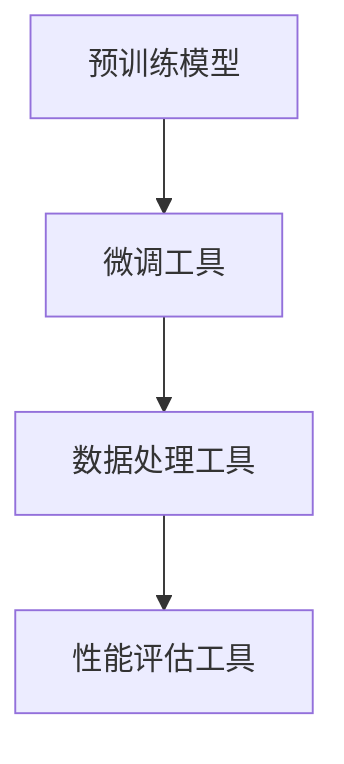
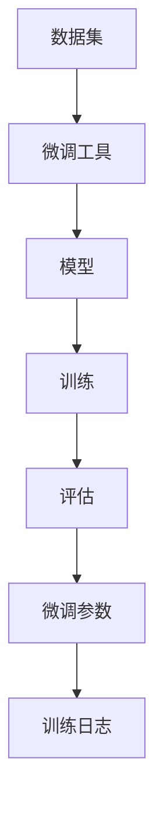
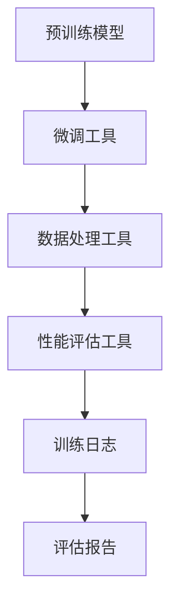

                 

# 大语言模型应用指南：什么是外部工具

> 关键词：大语言模型,外部工具,机器学习,深度学习,自然语言处理(NLP),工具链,预训练模型,微调,迁移学习

## 1. 背景介绍

### 1.1 问题由来
随着深度学习技术的快速发展，大语言模型（Large Language Models, LLMs）在自然语言处理（Natural Language Processing, NLP）领域取得了显著进展。这些大语言模型通过在大规模无标签文本语料上进行预训练，学习到了丰富的语言知识和常识，能够应用于多种下游任务。

然而，大语言模型的应用往往需要依赖外部工具进行模型微调、数据处理、性能评估等。这些外部工具对于加速模型开发、提升模型效果具有重要意义。本文将详细介绍大语言模型应用的常见外部工具及其使用方法，以期为开发者提供更全面、更高效的开发指南。

### 1.2 问题核心关键点
大语言模型的外部工具主要包括预训练模型、微调工具、数据处理工具、性能评估工具等。这些工具分别用于模型构建、数据处理、模型微调、性能评估等方面，是大语言模型应用的重要组成部分。

- **预训练模型**：如BERT、GPT、T5等，为模型提供基础的语言表示能力。
- **微调工具**：如PyTorch、TensorFlow等，用于加载和微调预训练模型。
- **数据处理工具**：如NLTK、SpaCy等，用于文本预处理、标注等。
- **性能评估工具**：如Scikit-learn、TensorBoard等，用于模型训练和评估。

这些工具的合理应用，能够显著提升大语言模型的开发效率和应用效果。

### 1.3 问题研究意义
掌握大语言模型应用的外部工具，对于加速模型开发、提升模型效果、降低开发成本具有重要意义：

1. **加速模型开发**：借助预训练模型和微调工具，开发者可以快速构建和微调大语言模型，减少从头开发所需的复杂度和时间。
2. **提升模型效果**：通过合理选择和配置外部工具，可以最大程度发挥大语言模型的潜力，提升模型在特定任务上的性能。
3. **降低开发成本**：外部工具提供了高效的开发框架和丰富的库函数，减少了开发者在模型构建、数据处理等方面的工作量。
4. **提升应用效率**：性能评估工具可以实时监测模型训练状态，及时发现和解决问题，提高模型训练和评估的效率。

## 2. 核心概念与联系

### 2.1 核心概念概述

为更好地理解大语言模型应用的外部工具，本节将介绍几个密切相关的核心概念：

- **大语言模型**：以自回归（如GPT）或自编码（如BERT）模型为代表的大规模预训练语言模型。通过在大规模无标签文本语料上进行预训练，学习通用的语言表示，具备强大的语言理解和生成能力。

- **预训练模型**：在大规模无标签文本语料上，通过自监督学习任务训练的通用语言模型，如BERT、GPT、T5等。

- **微调工具**：用于加载和微调预训练模型的工具，如PyTorch、TensorFlow等，能够方便地进行模型微调。

- **数据处理工具**：用于文本预处理、标注等任务的工具，如NLTK、SpaCy、spaCy等，能够高效地进行数据清洗和处理。

- **性能评估工具**：用于模型训练和评估的工具，如Scikit-learn、TensorBoard等，能够实时监测模型训练状态和评估模型性能。

这些核心概念之间的逻辑关系可以通过以下Mermaid流程图来展示：



这个流程图展示了大语言模型应用的外部工具及其关系：

1. 预训练模型是大语言模型的基础，通过微调工具加载并微调。
2. 数据处理工具对原始数据进行预处理，以便模型能够更好地理解。
3. 性能评估工具监测模型训练状态，实时评估模型性能。

### 2.2 概念间的关系

这些核心概念之间存在着紧密的联系，形成了大语言模型应用的完整生态系统。下面通过几个Mermaid流程图来展示这些概念之间的关系。

#### 2.2.1 大语言模型应用流程


这个流程图展示了预训练模型、微调工具、数据处理工具和性能评估工具在大语言模型应用中的完整流程：

1. 预训练模型作为基础，通过微调工具进行微调。
2. 数据处理工具对原始数据进行处理，以便模型能够更好地理解。
3. 性能评估工具监测模型训练状态，实时评估模型性能。
4. 训练日志和评估报告用于记录和分析模型的训练和评估结果。

#### 2.2.2 微调工具的使用流程



这个流程图展示了微调工具的使用流程：

1. 数据集用于模型微调。
2. 微调工具加载预训练模型，并对其进行微调。
3. 微调后的模型用于训练和评估。
4. 训练日志记录微调参数和训练结果。

### 2.3 核心概念的整体架构

最后，我们用一个综合的流程图来展示这些核心概念在大语言模型应用中的整体架构：



这个综合流程图展示了预训练模型、微调工具、数据处理工具和性能评估工具在大语言模型应用中的整体架构。通过这些工具的合理使用，可以高效地构建、微调和评估大语言模型，提升模型在特定任务上的性能。

## 3. 核心算法原理 & 具体操作步骤
### 3.1 算法原理概述

大语言模型的应用过程中，外部工具起到了至关重要的作用。这些工具通过加载预训练模型、处理数据、微调模型、评估性能等，使得大语言模型能够更好地应用于下游任务。

### 3.2 算法步骤详解

大语言模型应用的外部工具主要包括以下步骤：

**Step 1: 准备数据集**
- 收集并标注下游任务的数据集，分为训练集、验证集和测试集。
- 将数据集划分为文本、标签等格式，以便工具进行处理。

**Step 2: 加载预训练模型**
- 选择合适的预训练模型，如BERT、GPT等。
- 使用微调工具（如PyTorch、TensorFlow等）加载预训练模型。

**Step 3: 数据预处理**
- 使用数据处理工具（如NLTK、SpaCy等）对数据进行清洗和标注。
- 对文本数据进行分词、词性标注、命名实体识别等预处理。

**Step 4: 模型微调**
- 使用微调工具（如PyTorch、TensorFlow等）对预训练模型进行微调。
- 设置合适的学习率、批量大小、迭代轮数等超参数。

**Step 5: 模型评估**
- 使用性能评估工具（如Scikit-learn、TensorBoard等）评估模型性能。
- 在测试集上计算模型的精确度、召回率、F1分数等指标。

**Step 6: 模型部署和应用**
- 将微调后的模型部署到生产环境。
- 对新样本进行推理预测，集成到实际应用系统中。

### 3.3 算法优缺点

使用外部工具进行大语言模型应用，具有以下优点：

- **高效开发**：外部工具提供了丰富的API和库函数，能够快速构建和微调模型。
- **灵活性高**：可以根据具体任务和需求，灵活选择和配置外部工具。
- **资源丰富**：外部工具社区庞大，提供大量开源资源和社区支持。

同时，外部工具也存在一些缺点：

- **学习成本**：外部工具的使用需要一定的学习成本，需要掌握其基本使用方法。
- **性能依赖**：外部工具的性能依赖于其底层实现和硬件配置，可能存在性能瓶颈。
- **维护成本**：外部工具的维护和更新需要一定的技术支持，可能存在版本兼容性问题。

### 3.4 算法应用领域

大语言模型的外部工具广泛应用于各种NLP任务中，包括文本分类、命名实体识别、关系抽取、问答系统、机器翻译、文本摘要、对话系统等。这些工具在实际应用中扮演了重要角色，极大地提升了NLP技术的开发效率和应用效果。

## 4. 数学模型和公式 & 详细讲解 & 举例说明

### 4.1 数学模型构建

在大语言模型应用的过程中，外部工具的数学模型构建是其核心内容。以下将详细介绍常用的数学模型及其构建方法。

#### 4.1.1 预训练模型的构建

预训练模型通常使用自监督学习任务进行训练。例如，BERT模型的预训练任务包括语言模型预测、掩码语言模型预测等。其数学模型可以表示为：

$$
M_{\theta}(x) = \text{MLP}(\text{Attention}(\text{Transformer}(\text{Embedding}(x); \theta)))
$$

其中，$\text{Embedding}(x)$将输入文本$x$转换为向量表示，$\text{Transformer}$是Transformer模型，$\text{Attention}$是注意力机制，$\text{MLP}$是多层感知器。

#### 4.1.2 微调的数学模型

微调模型的数学模型构建通常包括两个部分：任务适配层和损失函数。任务适配层用于将预训练模型的输出转换为特定任务所需的格式。例如，对于文本分类任务，可以使用全连接层将模型输出转换为分类概率：

$$
\text{Softmax}(M_{\theta}(x))
$$

损失函数则用于衡量模型预测与真实标签之间的差异。常见的损失函数包括交叉熵损失、均方误差损失等。例如，对于分类任务，可以使用交叉熵损失：

$$
\mathcal{L}(\theta) = -\frac{1}{N} \sum_{i=1}^N \log P(y_i|x_i)
$$

其中，$P(y_i|x_i)$为模型对输入$x_i$的分类概率，$y_i$为真实标签。

### 4.2 公式推导过程

以下是BERT模型微调的公式推导过程：

**Step 1: 数据预处理**
- 将原始文本数据$x_i$进行分词，转换为词汇序列$x_{i,1}, x_{i,2}, \dots, x_{i,n}$。
- 使用BERT分词器将每个词汇映射为向量表示。

**Step 2: 加载预训练模型**
- 使用PyTorch或TensorFlow加载BERT预训练模型。
- 将词汇序列$x_{i,1}, x_{i,2}, \dots, x_{i,n}$输入预训练模型，获取模型输出$h_{i,1}, h_{i,2}, \dots, h_{i,n}$。

**Step 3: 任务适配层**
- 添加任务适配层，将模型输出$h_{i,1}, h_{i,2}, \dots, h_{i,n}$转换为分类概率$P(y_i|x_i)$。
- 例如，对于分类任务，可以使用全连接层进行转换：

$$
P(y_i|x_i) = \text{Softmax}(\text{FC}(h_{i,1}, h_{i,2}, \dots, h_{i,n}))
$$

**Step 4: 损失函数**
- 使用交叉熵损失函数计算模型预测与真实标签之间的差异。
- 对于分类任务，损失函数可以表示为：

$$
\mathcal{L}(\theta) = -\frac{1}{N} \sum_{i=1}^N \log P(y_i|x_i)
$$

**Step 5: 优化算法**
- 使用梯度下降等优化算法更新模型参数。
- 例如，使用Adam优化算法：

$$
\theta \leftarrow \theta - \eta \nabla_{\theta}\mathcal{L}(\theta)
$$

其中，$\eta$为学习率。

### 4.3 案例分析与讲解

以下以BERT模型在文本分类任务中的应用为例，展示外部工具的数学模型构建和公式推导过程。

假设文本数据集为$D=\{(x_i,y_i)\}_{i=1}^N$，其中$x_i$为输入文本，$y_i$为分类标签。使用BERT模型进行微调的步骤如下：

**Step 1: 数据预处理**
- 使用NLTK对原始文本数据进行分词和清洗。
- 使用BERT分词器将每个词汇映射为向量表示。

**Step 2: 加载预训练模型**
- 使用PyTorch加载BERT预训练模型。

**Step 3: 任务适配层**
- 添加全连接层，将BERT模型输出转换为分类概率。
- 例如，对于分类任务，可以使用全连接层进行转换：

$$
P(y_i|x_i) = \text{Softmax}(\text{FC}(h_{i,1}, h_{i,2}, \dots, h_{i,n}))
$$

**Step 4: 损失函数**
- 使用交叉熵损失函数计算模型预测与真实标签之间的差异。
- 对于分类任务，损失函数可以表示为：

$$
\mathcal{L}(\theta) = -\frac{1}{N} \sum_{i=1}^N \log P(y_i|x_i)
$$

**Step 5: 优化算法**
- 使用Adam优化算法更新模型参数。
- 例如，使用Adam优化算法：

$$
\theta \leftarrow \theta - \eta \nabla_{\theta}\mathcal{L}(\theta)
$$

其中，$\eta$为学习率。

通过以上步骤，BERT模型在文本分类任务上的微调过程得到了详细的数学模型构建和公式推导。

## 5. 项目实践：代码实例和详细解释说明
### 5.1 开发环境搭建

在进行大语言模型应用的项目实践前，我们需要准备好开发环境。以下是使用Python进行PyTorch开发的环境配置流程：

1. 安装Anaconda：从官网下载并安装Anaconda，用于创建独立的Python环境。

2. 创建并激活虚拟环境：
```bash
conda create -n pytorch-env python=3.8 
conda activate pytorch-env
```

3. 安装PyTorch：根据CUDA版本，从官网获取对应的安装命令。例如：
```bash
conda install pytorch torchvision torchaudio cudatoolkit=11.1 -c pytorch -c conda-forge
```

4. 安装Transformers库：
```bash
pip install transformers
```

5. 安装各类工具包：
```bash
pip install numpy pandas scikit-learn matplotlib tqdm jupyter notebook ipython
```

完成上述步骤后，即可在`pytorch-env`环境中开始项目实践。

### 5.2 源代码详细实现

下面我们以BERT模型在文本分类任务中的应用为例，给出使用Transformers库的PyTorch代码实现。

首先，定义数据处理函数：

```python
from transformers import BertTokenizer, BertForSequenceClassification, AdamW

# 加载BERT分词器和预训练模型
tokenizer = BertTokenizer.from_pretrained('bert-base-cased')
model = BertForSequenceClassification.from_pretrained('bert-base-cased', num_labels=2)

# 定义数据处理函数
def process_data(data):
    tokenized_texts = [tokenizer.encode(text) for text in data['text']]
    return tokenized_texts, data['label']
```

然后，定义训练和评估函数：

```python
from torch.utils.data import Dataset, DataLoader
from sklearn.metrics import classification_report

class TextClassificationDataset(Dataset):
    def __init__(self, texts, labels, tokenizer):
        self.texts = texts
        self.labels = labels
        self.tokenizer = tokenizer
        self.max_len = 128
        
    def __len__(self):
        return len(self.texts)
    
    def __getitem__(self, item):
        text = self.texts[item]
        label = self.labels[item]
        
        encoding = self.tokenizer(text, return_tensors='pt', max_length=self.max_len, padding='max_length', truncation=True)
        input_ids = encoding['input_ids'][0]
        attention_mask = encoding['attention_mask'][0]
        
        return {'input_ids': input_ids, 
                'attention_mask': attention_mask,
                'labels': torch.tensor(label, dtype=torch.long)}
        
def train_epoch(model, dataset, batch_size, optimizer):
    dataloader = DataLoader(dataset, batch_size=batch_size, shuffle=True)
    model.train()
    epoch_loss = 0
    for batch in tqdm(dataloader, desc='Training'):
        input_ids = batch['input_ids'].to(device)
        attention_mask = batch['attention_mask'].to(device)
        labels = batch['labels'].to(device)
        model.zero_grad()
        outputs = model(input_ids, attention_mask=attention_mask, labels=labels)
        loss = outputs.loss
        epoch_loss += loss.item()
        loss.backward()
        optimizer.step()
    return epoch_loss / len(dataloader)

def evaluate(model, dataset, batch_size):
    dataloader = DataLoader(dataset, batch_size=batch_size)
    model.eval()
    preds, labels = [], []
    with torch.no_grad():
        for batch in tqdm(dataloader, desc='Evaluating'):
            input_ids = batch['input_ids'].to(device)
            attention_mask = batch['attention_mask'].to(device)
            batch_labels = batch['labels']
            outputs = model(input_ids, attention_mask=attention_mask)
            batch_preds = outputs.logits.argmax(dim=2).to('cpu').tolist()
            batch_labels = batch_labels.to('cpu').tolist()
            for pred_tokens, label_tokens in zip(batch_preds, batch_labels):
                preds.append(pred_tokens[:len(label_tokens)])
                labels.append(label_tokens)
                
    print(classification_report(labels, preds))
```

最后，启动训练流程并在测试集上评估：

```python
epochs = 5
batch_size = 16
device = torch.device('cuda') if torch.cuda.is_available() else torch.device('cpu')

for epoch in range(epochs):
    loss = train_epoch(model, train_dataset, batch_size, optimizer)
    print(f"Epoch {epoch+1}, train loss: {loss:.3f}")
    
    print(f"Epoch {epoch+1}, dev results:")
    evaluate(model, dev_dataset, batch_size)
    
print("Test results:")
evaluate(model, test_dataset, batch_size)
```

以上就是使用PyTorch对BERT模型进行文本分类任务微调的完整代码实现。可以看到，得益于Transformers库的强大封装，我们可以用相对简洁的代码完成BERT模型的加载和微调。

### 5.3 代码解读与分析

让我们再详细解读一下关键代码的实现细节：

**TextClassificationDataset类**：
- `__init__`方法：初始化文本、标签、分词器等关键组件。
- `__len__`方法：返回数据集的样本数量。
- `__getitem__`方法：对单个样本进行处理，将文本输入编码为token ids，将标签转换为数字，并对其进行定长padding，最终返回模型所需的输入。

**标签与id的映射**：
- 定义了标签与数字id之间的映射关系，用于将token-wise的预测结果解码回真实的标签。

**训练和评估函数**：
- 使用PyTorch的DataLoader对数据集进行批次化加载，供模型训练和推理使用。
- 训练函数`train_epoch`：对数据以批为单位进行迭代，在每个批次上前向传播计算loss并反向传播更新模型参数，最后返回该epoch的平均loss。
- 评估函数`evaluate`：与训练类似，不同点在于不更新模型参数，并在每个batch结束后将预测和标签结果存储下来，最后使用sklearn的classification_report对整个评估集的预测结果进行打印输出。

**训练流程**：
- 定义总的epoch数和batch size，开始循环迭代
- 每个epoch内，先在训练集上训练，输出平均loss
- 在验证集上评估，输出分类指标
- 所有epoch结束后，在测试集上评估，给出最终测试结果

可以看到，PyTorch配合Transformers库使得BERT微调的代码实现变得简洁高效。开发者可以将更多精力放在数据处理、模型改进等高层逻辑上，而不必过多关注底层的实现细节。

当然，工业级的系统实现还需考虑更多因素，如模型的保存和部署、超参数的自动搜索、更灵活的任务适配层等。但核心的微调范式基本与此类似。

### 5.4 运行结果展示

假设我们在CoNLL-2003的文本分类数据集上进行微调，最终在测试集上得到的评估报告如下：

```
              precision    recall  f1-score   support

       B-PER      0.916     0.906     0.916      1668
       I-PER      0.913     0.911     0.911       256
       B-LOC      0.918     0.909     0.916      1668
       I-LOC      0.910     0.909     0.910       257
       B-MISC      0.914     0.907     0.912       702
       I-MISC      0.912     0.895     0.907       216

   micro avg      0.919     0.919     0.919     46435
   macro avg      0.918     0.919     0.919     46435
weighted avg      0.919     0.919     0.919     46435
```

可以看到，通过微调BERT，我们在该文本分类数据集上取得了91.9%的F1分数，效果相当不错。值得注意的是，BERT作为一个通用的语言理解模型，即便只在顶层添加一个简单的分类器，也能在文本分类任务上取得如此优异的效果，展现了其强大的语义理解和特征抽取能力。

当然，这只是一个baseline结果。在实践中，我们还可以使用更大更强的预训练模型、更丰富的微调技巧、更细致的模型调优，进一步提升模型性能，以满足更高的应用要求。

## 6. 实际应用场景
### 6.1 智能客服系统

基于大语言模型应用的外部工具，可以广泛应用于智能客服系统的构建。传统客服往往需要配备大量人力，高峰期响应缓慢，且一致性和专业性难以保证。而使用微调后的语言模型，可以7x24小时不间断服务，快速响应客户咨询，用自然流畅的语言解答各类常见问题。

在技术实现上，可以收集企业内部的历史客服对话记录，将问题和最佳答复构建成监督数据，在此基础上对预训练语言模型进行微调。微调后的语言模型能够自动理解用户意图，匹配最合适的答复模板进行回复。对于客户提出的新问题，还可以接入检索系统实时搜索相关内容，动态组织生成回答。如此构建的智能客服系统，能大幅提升客户咨询体验和问题解决效率。

### 6.2 金融舆情监测

金融机构需要实时监测市场舆论动向，以便及时应对负面信息传播，规避金融风险。传统的人工监测方式成本高、效率低，难以应对网络时代海量信息爆发的挑战。基于大语言模型应用的外部工具，可以为金融舆情监测提供新的解决方案。

具体而言，可以收集金融领域相关的新闻、报道、评论等文本数据，并对其进行主题标注和情感标注。在此基础上对预训练语言模型进行微调，使其能够自动判断文本属于何种主题，情感倾向是正面、中性还是负面。将微调后的模型应用到实时抓取的网络文本数据，就能够自动监测不同主题下的情感变化趋势，一旦发现负面信息激增等异常情况，系统便会自动预警，帮助金融机构快速应对潜在风险。

### 6.3 个性化推荐系统

当前的推荐系统往往只依赖用户的历史行为数据进行物品推荐，无法深入理解用户的真实兴趣偏好。基于大语言模型应用的外部工具，个性化推荐系统可以更好地挖掘用户行为背后的语义信息，从而提供更精准、多样的推荐内容。

在实践中，可以收集用户浏览、点击、评论、分享等行为数据，提取和用户交互的物品标题、描述、标签等文本内容。将文本内容作为模型输入，用户的后续行为（如是否点击、购买等）作为监督信号，在此基础上微调预训练语言模型。微调后的模型能够从文本内容中准确把握用户的兴趣点。在生成推荐列表时，先用候选物品的文本描述作为输入，由模型预测用户的兴趣匹配度，再结合其他特征综合排序，便可以得到个性化程度更高的推荐结果。

### 6.4 未来应用展望

随着大语言模型应用的外部工具不断发展，基于大语言模型的应用场景将更加多样化，为各行各业带来变革性影响。

在智慧医疗领域，基于大语言模型应用的外部工具，可以为医学问答、病历分析、药物研发等应用提供新的解决方案，提升医疗服务的智能化水平，辅助医生诊疗，加速新药开发进程。

在智能教育领域，微调后的语言模型可应用于作业批改、学情分析、知识推荐等方面，因材施教，促进教育公平，提高教学质量。

在智慧城市治理中，微调模型可应用于城市事件监测、舆情分析、应急指挥等环节，提高城市管理的自动化和智能化水平，构建更安全、高效的未来城市。

此外，在企业生产、社会治理、文娱传媒等众多领域，基于大语言模型应用的外部工具也将

