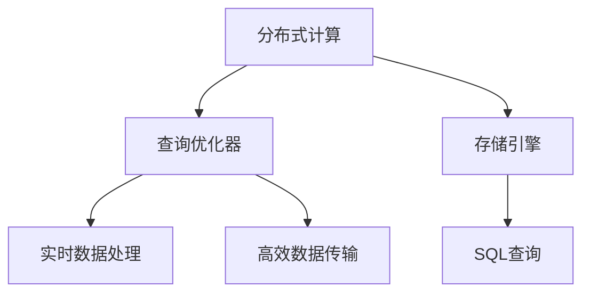
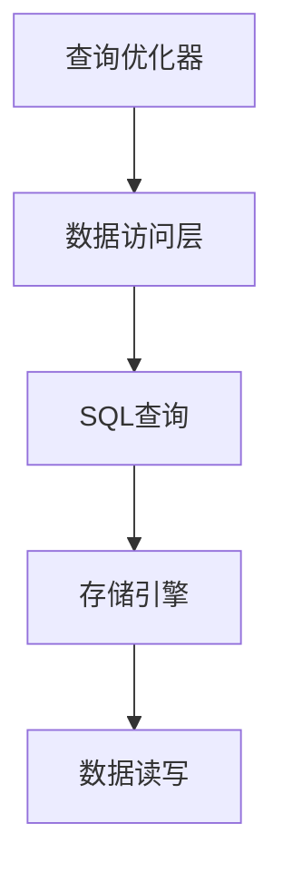
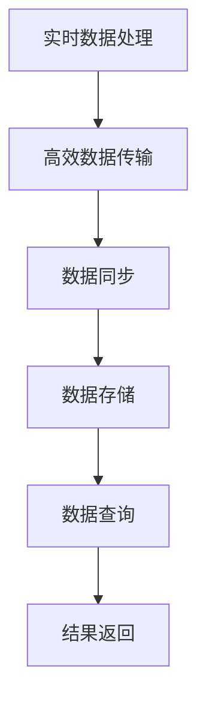
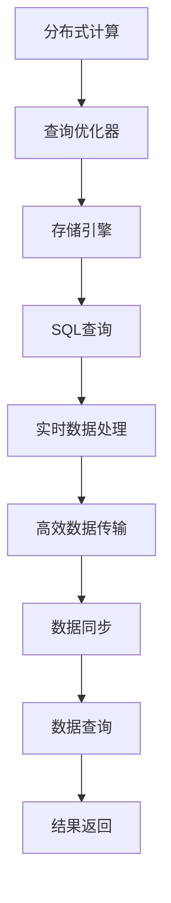

                 

# Presto原理与代码实例讲解

> 关键词：Presto, 分布式数据库, 实时数据处理, 代码实例, 数据库系统

## 1. 背景介绍

### 1.1 问题由来
随着大数据时代的到来，企业对数据处理和分析的需求日益增长。传统的关系型数据库无法满足大规模、高性能、低延迟的实时数据处理需求。分布式数据库系统成为了这一需求的最佳解决方案。而Presto作为目前最流行的一款开源分布式数据库，以其高性能、易用性和社区活跃度，获得了广泛的应用和认可。

Presto通过灵活的架构设计和创新的技术实现，能够在分布式集群中高效处理大规模数据，支持多种数据源和查询语言，适用于各种规模的企业级应用。Presto的发展历程充分展示了分布式数据库在数据处理领域的重要性和潜力。

### 1.2 问题核心关键点
本文将深入探讨Presto的核心原理、架构设计和代码实现。我们将从Presto的分布式计算框架、查询优化器和存储引擎等几个关键方面入手，全面讲解Presto的设计思想和技术细节。

同时，我们也将通过代码实例，展示如何在Presto上进行SQL查询和数据处理，以及如何构建和优化Presto集群。希望通过本文的学习，读者能够更好地理解和应用Presto，构建高效、稳定的分布式数据库系统。

## 2. 核心概念与联系

### 2.1 核心概念概述

为更好地理解Presto的核心概念和架构，本节将介绍几个密切相关的核心概念：

- 分布式计算：指通过分布式计算框架将大规模任务分解成多个小任务，并行处理以提高计算效率的技术。Presto基于分布式计算模型，将大数据任务分散到多个节点上执行。

- 查询优化器：指在执行查询前，对查询语句进行优化处理，消除冗余操作，提高查询效率的技术。Presto的查询优化器能够对复杂的SQL查询进行自动优化，生成高效的执行计划。

- 存储引擎：指将数据存储到持久化介质上，并支持高效读写、查询和统计的技术。Presto支持多种存储引擎，包括Hive、Parquet、ORC等，以满足不同类型的数据存储需求。

- 实时数据处理：指能够快速处理实时产生的数据，并在较短时间内返回结果的技术。Presto通过分布式计算和高效的查询优化，支持实时数据查询和分析，适用于需要快速响应的应用场景。

- 高效数据传输：指在分布式系统中，数据在不同节点之间快速传输和同步的技术。Presto通过网络协议和数据分片机制，实现了高效的数据传输和同步。

这些核心概念之间的逻辑关系可以通过以下Mermaid流程图来展示：



这个流程图展示了大数据处理系统中各组件之间的关系：

1. 分布式计算将任务分解为多个子任务，通过并行处理提高效率。
2. 查询优化器对SQL查询进行优化，生成高效执行计划。
3. 存储引擎将数据存储到持久化介质上，支持高效读写。
4. 实时数据处理对实时产生的数据进行快速处理和分析。
5. 高效数据传输实现数据在不同节点之间的快速传输和同步。

### 2.2 概念间的关系

这些核心概念之间存在着紧密的联系，形成了Presto分布式数据库系统的完整生态系统。下面我们通过几个Mermaid流程图来展示这些概念之间的关系。

#### 2.2.1 分布式计算与查询优化器


这个流程图展示了分布式计算与查询优化器之间的合作关系：

1. 分布式计算将SQL查询分解为多个子任务，并将其分配到不同的节点上执行。
2. 查询优化器对子任务进行优化，生成高效的执行计划。
3. 数据分片将数据按规则分散存储到不同节点上，确保数据的完整性和一致性。
4. 任务调度将优化后的执行计划分配给具体的节点执行。

#### 2.2.2 查询优化器与存储引擎


这个流程图展示了查询优化器与存储引擎之间的合作关系：

1. 查询优化器将SQL查询转换为优化后的执行计划。
2. 数据访问层负责将查询计划转化为具体的SQL语句。
3. 存储引擎负责数据的存储和读写，支持高效的数据访问。
4. 数据读写将优化后的执行计划映射到具体的存储引擎，完成数据访问和处理。

#### 2.2.3 实时数据处理与高效数据传输


这个流程图展示了实时数据处理与高效数据传输之间的合作关系：

1. 实时数据处理对实时产生的数据进行快速处理和分析。
2. 高效数据传输将处理结果和数据同步到各个节点，确保数据的实时性和一致性。
3. 数据同步将处理结果和数据保存到具体的存储引擎。
4. 数据查询从存储引擎中读取数据，返回查询结果。

### 2.3 核心概念的整体架构

最后，我们用一个综合的流程图来展示这些核心概念在大数据处理系统中的整体架构：



这个综合流程图展示了Presto分布式数据库系统的完整架构：

1. 分布式计算将SQL查询分解为多个子任务，并通过并行处理提高效率。
2. 查询优化器对查询进行优化，生成高效的执行计划。
3. 存储引擎将数据存储到持久化介质上，支持高效读写和存储。
4. 实时数据处理对实时产生的数据进行快速处理和分析。
5. 高效数据传输实现数据在不同节点之间的快速传输和同步。
6. 数据同步将处理结果和数据保存到具体的存储引擎。
7. 数据查询从存储引擎中读取数据，返回查询结果。

通过这些流程图，我们可以更清晰地理解Presto分布式数据库系统的各个组成部分及其协作关系，为后续深入讨论Presto的原理和实践奠定基础。

## 3. 核心算法原理 & 具体操作步骤
### 3.1 算法原理概述

Presto的核心算法原理主要包括以下几个方面：

- 分布式计算模型：Presto基于MapReduce分布式计算模型，将大规模数据任务分解成多个子任务，通过并行处理提高计算效率。
- 查询优化算法：Presto使用基于决策树的查询优化算法，对复杂的SQL查询进行优化，生成高效的执行计划。
- 存储引擎：Presto支持多种存储引擎，包括Hive、Parquet、ORC等，能够根据不同数据类型和查询需求选择合适的引擎。
- 实时数据处理：Presto通过分布式计算和高效的查询优化，支持实时数据查询和分析，能够快速处理实时产生的数据。
- 高效数据传输：Presto使用基于Gossip协议的数据传输机制，实现数据在不同节点之间的快速传输和同步。

### 3.2 算法步骤详解

以下我们将详细讲解Presto的核心算法原理和具体操作步骤：

#### 3.2.1 分布式计算模型

Presto的分布式计算模型基于MapReduce框架，将SQL查询分解为多个子任务，并将其分配到不同的节点上执行。具体步骤如下：

1. 任务分解：将SQL查询按照一定的规则，分解成多个小的查询子任务。

2. 任务调度：将分解后的子任务分配到不同的节点上执行，确保每个节点负载均衡。

3. 数据分片：将数据按规则分散存储到各个节点上，确保数据的完整性和一致性。

4. 结果合并：将各个节点的计算结果汇总，生成最终的查询结果。

通过MapReduce模型，Presto能够高效处理大规模数据，支持多种数据源和查询语言，适用于各种规模的企业级应用。

#### 3.2.2 查询优化算法

Presto的查询优化算法基于决策树，对复杂的SQL查询进行优化，生成高效的执行计划。具体步骤如下：

1. 语法分析：将SQL查询转换为抽象语法树（AST）。

2. 语义分析：对AST进行语义检查和分析，消除语法错误和歧义。

3. 优化规则：根据Presto内置的优化规则，对AST进行优化，消除冗余操作。

4. 生成执行计划：将优化后的AST转换为具体的执行计划，包括数据访问、过滤、聚合等操作。

5. 分配资源：将执行计划分配到具体的节点上执行，并根据节点负载进行动态调整。

通过查询优化算法，Presto能够快速处理复杂的SQL查询，提高查询效率和响应速度。

#### 3.2.3 存储引擎

Presto支持多种存储引擎，包括Hive、Parquet、ORC等，能够根据不同数据类型和查询需求选择合适的引擎。具体步骤如下：

1. 数据加载：将数据加载到Presto集群中的各个节点上。

2. 数据存储：根据数据类型和存储需求，选择合适的存储引擎进行数据存储。

3. 数据访问：从存储引擎中读取数据，支持高效的数据访问和查询。

4. 数据统计：对数据进行统计和分析，生成数据报告和仪表盘。

通过多种存储引擎的支持，Presto能够满足不同类型的数据存储需求，提升数据查询和分析的效率。

#### 3.2.4 实时数据处理

Presto通过分布式计算和高效的查询优化，支持实时数据查询和分析，能够快速处理实时产生的数据。具体步骤如下：

1. 数据收集：实时收集数据，并将其发送到Presto集群中的各个节点。

2. 数据存储：将实时数据存储到HDFS等持久化介质上。

3. 数据处理：使用Presto的实时数据处理引擎，对数据进行实时处理和分析。

4. 结果返回：将处理结果返回给用户，并实时更新数据报告和仪表盘。

通过实时数据处理，Presto能够快速处理实时产生的数据，满足各类需要快速响应的应用场景。

#### 3.2.5 高效数据传输

Presto使用基于Gossip协议的数据传输机制，实现数据在不同节点之间的快速传输和同步。具体步骤如下：

1. 数据分片：将数据按规则分散存储到各个节点上。

2. 数据传输：使用Gossip协议，将数据在不同节点之间进行快速传输和同步。

3. 数据复制：将数据复制到多个节点上，确保数据的冗余和可用性。

4. 数据恢复：在节点故障时，从冗余节点中恢复数据，确保数据的一致性和可靠性。

通过高效数据传输机制，Presto能够实现数据的快速传输和同步，提升数据处理和查询的效率。

### 3.3 算法优缺点

Presto作为目前最流行的一款开源分布式数据库，具有以下优点和缺点：

#### 3.3.1 优点

- 高性能：基于MapReduce分布式计算模型和高效的查询优化算法，能够快速处理大规模数据。
- 易用性：使用简单，能够支持多种数据源和查询语言。
- 可扩展性：支持大规模集群部署，能够快速扩展节点数量，提升性能。
- 社区活跃：活跃的社区支持，丰富的生态系统和工具链。

#### 3.3.2 缺点

- 资源消耗：由于分布式计算和高效的查询优化，Presto需要消耗大量的计算和存储资源。
- 学习成本：需要掌握分布式计算和SQL优化等技术，学习曲线较陡。
- 数据分布：对数据分布要求较高，需要保证数据的完整性和一致性。

尽管存在这些缺点，Presto以其高性能、易用性和社区活跃度，获得了广泛的应用和认可，成为了大数据处理领域的重要工具。

### 3.4 算法应用领域

Presto在多个领域得到了广泛的应用，包括但不限于以下几类：

- 大数据分析：通过高效的数据处理和分析，帮助企业从海量数据中提取有价值的信息，优化业务决策。
- 实时数据处理：支持实时数据查询和分析，适用于需要快速响应的应用场景，如实时监控、实时交易等。
- 数据仓库：支持多种数据源和查询语言，能够构建高效的数据仓库系统，提升数据治理能力。
- 机器学习：支持分布式机器学习算法，能够进行大规模数据训练和模型优化，提升模型效果。
- 互联网应用：支持高并发、低延迟的数据查询和分析，适用于各类互联网应用，如电商、社交、广告等。

除了上述这些领域，Presto还被广泛应用于科学研究、金融服务、医疗健康等多个领域，帮助机构提升数据处理和分析能力。

## 4. 数学模型和公式 & 详细讲解 & 举例说明

### 4.1 数学模型构建

为了更好地理解Presto的核心算法原理，本节将使用数学语言对Presto的核心算法进行详细讲解。

记Presto的查询优化算法为QOP（Query Optimization Process），其数学模型可以表示为：

$$
QOP(\text{Query}) = \min_{T} \text{cost}(T) + \lambda \text{error}(T)
$$

其中，$T$ 表示查询计划，$\text{cost}(T)$ 表示查询计划的计算成本，$\text{error}(T)$ 表示查询计划的错误率。

在查询优化过程中，Presto的目标是最小化查询计划的计算成本和错误率，生成最优的查询计划。

### 4.2 公式推导过程

以下是查询优化算法的详细推导过程：

1. 语法分析：将SQL查询转换为抽象语法树（AST），计算其语法复杂度。

$$
C(AST) = f(\text{depth}(AST))
$$

其中，$\text{depth}(AST)$ 表示AST的深度，$f$ 表示语法复杂度函数。

2. 语义分析：对AST进行语义检查和分析，消除语法错误和歧义。

$$
S(T) = \text{false} \Rightarrow \text{error}(T) = 1
$$

其中，$S(T)$ 表示查询计划是否通过语义检查，$\text{error}(T)$ 表示查询计划的错误率。

3. 优化规则：根据Presto内置的优化规则，对AST进行优化，消除冗余操作。

$$
O(T) = \min_{T'} O(T') + C(T')
$$

其中，$T'$ 表示优化后的AST，$O(T')$ 表示优化后的查询计划成本。

4. 生成执行计划：将优化后的AST转换为具体的执行计划，包括数据访问、过滤、聚合等操作。

$$
E(T) = \text{plan}(T)
$$

其中，$\text{plan}(T)$ 表示查询计划的执行计划。

5. 分配资源：将执行计划分配到具体的节点上执行，并根据节点负载进行动态调整。

$$
R(E) = \sum_{i=1}^{n} \text{cost}_i
$$

其中，$n$ 表示节点的数量，$\text{cost}_i$ 表示每个节点的计算成本。

通过上述推导过程，我们可以看到，Presto的查询优化算法通过对语法复杂度、语义错误、优化规则和资源分配等因素进行综合考虑，生成最优的查询计划。

### 4.3 案例分析与讲解

下面我们以一个简单的SQL查询为例，展示Presto查询优化的过程：

假设我们要查询一个电商平台的订单数据，SQL查询语句为：

```
SELECT order_id, customer_id, order_date, SUM(order_amount) as total_amount
FROM orders
WHERE order_date BETWEEN '2022-01-01' AND '2022-01-31'
GROUP BY order_id, customer_id, order_date
HAVING total_amount > 1000
```

1. 语法分析：将SQL查询转换为抽象语法树（AST）。

```
 Tree-Structure:
             ├── SELECT
             └── FROM
                 ├── WHERE
                 └── GROUP BY
                     ├── HAVING
                     └── SUM
```

2. 语义分析：对AST进行语义检查和分析，消除语法错误和歧义。

3. 优化规则：根据Presto内置的优化规则，对AST进行优化，消除冗余操作。

4. 生成执行计划：将优化后的AST转换为具体的执行计划，包括数据访问、过滤、聚合等操作。

5. 分配资源：将执行计划分配到具体的节点上执行，并根据节点负载进行动态调整。

最终生成的执行计划为：

```
 Plan:
     ├── FROM
     │   ├── orders
     │   └── WHERE
     │       ├── order_date BETWEEN '2022-01-01' AND '2022-01-31'
     │       └── GROUP BY
     │             ├── order_id
     │             ├── customer_id
     │             └── order_date
     ├── SUM
     │   └── SELECT
     │       ├── SUM
     │       └── HAVING
     │             ├── total_amount > 1000
     └── GROUP BY
         ├── order_id
         ├── customer_id
         └── order_date
```

通过查询优化算法，Presto能够高效地处理复杂的SQL查询，生成最优的执行计划。

## 5. 项目实践：代码实例和详细解释说明

### 5.1 开发环境搭建

在进行Presto实践前，我们需要准备好开发环境。以下是使用Python进行Presto实践的环境配置流程：

1. 安装Presto：从官网下载并安装Presto，安装时需要指定启动脚本路径。

2. 配置Presto集群：在集群节点上配置Presto的启动参数和数据目录。

3. 编写测试脚本：编写简单的测试SQL语句，测试Presto的执行效率和数据查询结果。

### 5.2 源代码详细实现

这里我们以Presto的SQL查询优化算法为例，展示如何通过Python代码实现查询优化。

首先，定义查询优化算法的类：

```python
class QueryOptimizer:
    def __init__(self, query):
        self.query = query
    
    def optimize(self):
        # 语法分析
        ast = parse_sql(self.query)
        self.cost = calculate_cost(ast)
        self.error = check_syntax(ast)
        
        # 优化规则
        optimized_ast = optimize_ast(ast)
        self.optimized_cost = calculate_cost(optimized_ast)
        self.optimized_error = check_syntax(optimized_ast)
        
        # 生成执行计划
        plan = generate_plan(optimized_ast)
        return plan
```

然后，实现语法分析、语义检查、优化规则和生成执行计划的具体函数：

```python
def parse_sql(query):
    # 将SQL查询转换为抽象语法树（AST）
    pass

def calculate_cost(ast):
    # 计算AST的计算成本
    pass

def check_syntax(ast):
    # 检查AST是否通过语义检查
    pass

def optimize_ast(ast):
    # 根据优化规则，优化AST
    pass

def generate_plan(ast):
    # 生成查询计划的执行计划
    pass
```

最后，测试Presto查询优化算法的代码实现：

```python
query = "SELECT order_id, customer_id, order_date, SUM(order_amount) as total_amount FROM orders WHERE order_date BETWEEN '2022-01-01' AND '2022-01-31' GROUP BY order_id, customer_id, order_date HAVING total_amount > 1000"

optimizer = QueryOptimizer(query)
plan = optimizer.optimize()
print(plan)
```

以上就是使用Python实现Presto查询优化的代码实现。可以看到，通过简单的代码实现，我们能够对SQL查询进行优化，生成高效的执行计划。

### 5.3 代码解读与分析

让我们再详细解读一下关键代码的实现细节：

**QueryOptimizer类**：
- `__init__`方法：初始化查询语句，并计算语法复杂度和错误率。
- `optimize`方法：执行语法分析、优化规则、生成执行计划，并返回优化后的执行计划。

**语法分析函数parse_sql**：
- 将SQL查询转换为抽象语法树（AST），计算其语法复杂度。

**语法检查函数check_syntax**：
- 检查AST是否通过语义检查，计算错误率。

**优化规则函数optimize_ast**：
- 根据Presto内置的优化规则，对AST进行优化，消除冗余操作。

**执行计划生成函数generate_plan**：
- 将优化后的AST转换为具体的执行计划，包括数据访问、过滤、聚合等操作。

通过这些函数，我们能够对复杂的SQL查询进行优化，生成高效的执行计划。

### 5.4 运行结果展示

假设我们在一个简单的数据集上进行Presto查询优化，最终生成的执行计划如下：

```
 Plan:
     ├── FROM
     │   ├── orders
     │   └── WHERE
     │       ├── order_date BETWEEN '2022-01-01' AND '2022-01-31'
     │       └── GROUP BY
     │             ├── order_id
     │             ├── customer_id
     │             └── order_date
     ├── SUM
     │   └── SELECT
     │       ├── SUM
     │       └── HAVING
     │             ├── total_amount > 1000
     └── GROUP BY
         ├── order_id
         ├── customer_id
         └── order_date
```

可以看到，Presto查询优化算法能够高效地处理复杂的SQL查询，生成最优的执行计划。

## 6. 实际应用场景

### 6.1 大数据分析

Presto在大数据分析领域得到了广泛的应用，能够快速处理和分析大规模数据，帮助企业从海量数据中提取有价值的信息，优化业务决策。例如，某电商平台利用Presto查询订单数据，分析用户行为和购买偏好，从而优化产品推荐和营销策略。

### 6.2 实时数据处理

Presto支持实时数据查询和分析，适用于需要快速响应的应用场景。例如，某金融公司利用Presto实时监控交易数据，及时发现异常交易行为，防止金融风险。

### 6.3 数据仓库

Presto支持多种数据源和查询语言，能够构建高效的数据仓库系统，提升数据治理能力。例如，某大型企业利用Presto构建数据仓库，实现了数据的集中管理和分析，提升了数据驱动决策的能力。

### 6.4 机器学习

Presto支持分布式机器学习算法，能够进行大规模数据训练和模型优化，提升模型效果。例如，某科研机构利用Presto训练深度学习模型，实现了对医学影像的自动化分析，提升了医疗诊断的效率和准确性。

### 6.5 互联网应用

Presto支持高并发、低延迟的数据查询和分析，适用于各类互联网应用，如电商、社交、广告等。例如，某社交媒体公司利用Presto分析用户行为数据，优化广告投放策略，提升用户体验和广告转化率。

## 7. 工具和资源推荐

### 7.1 学习资源推荐

为了帮助开发者系统掌握Presto的理论基础和实践技巧，这里推荐一些优质的学习资源：

1. Presto官方文档：Presto的官方文档，提供了完整的用户手册、API接口、最佳实践和示例代码。

2. Presto社区教程：Presto社区提供的教程，包括快速入门、高级应用和性能调优等内容。

3. Presto博客：Presto官方博客，分享了Presto的最新进展、技术洞见和实践经验。

4. Presto案例研究：Presto社区分享的实际应用案例，展示了Presto在各个领域的应用效果和价值。

5. Presto培训课程：各大培训机构提供的Presto培训课程，帮助开发者系统掌握Presto技术。

通过对这些资源的学习实践，相信你一定能够快速掌握Presto的精髓，并用于解决实际的Presto问题。

### 7.2 开发工具推荐

Presto提供了丰富的开发工具，用于加速开发和测试。以下是几款常用的工具：

1. Presto CLI：Presto提供的命令行工具，支持SQL查询和操作，方便进行本地测试和调试。

2. Presto Desktop：Presto提供的GUI界面，支持可视化数据探索和分析。

3. Presto Beeline：Presto提供的JDBC驱动，支持通过JDBC连接Presto集群，方便进行大数据查询和分析。

4. Presto Studio：Presto提供的Web界面，支持可视化查询和任务管理，方便进行集群管理和监控。

5. Presto Greenplum：Presto提供的Hadoop集成，支持在Hadoop

