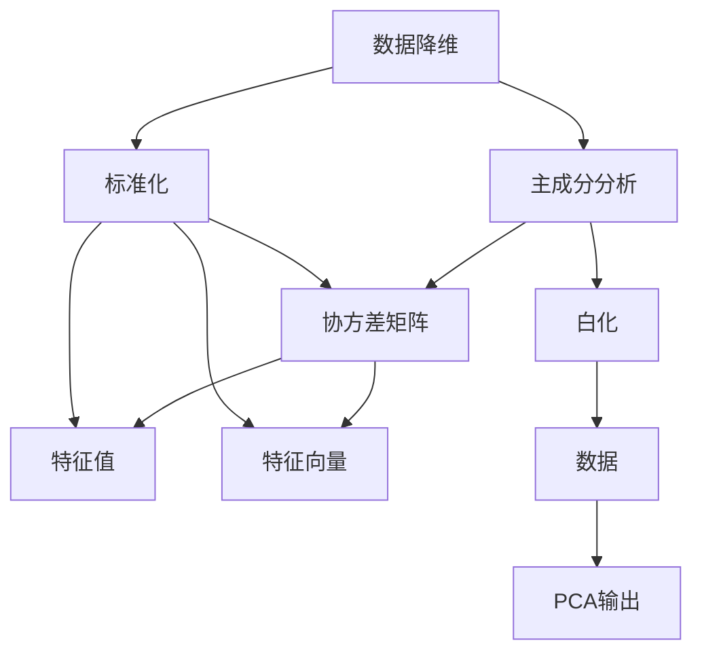
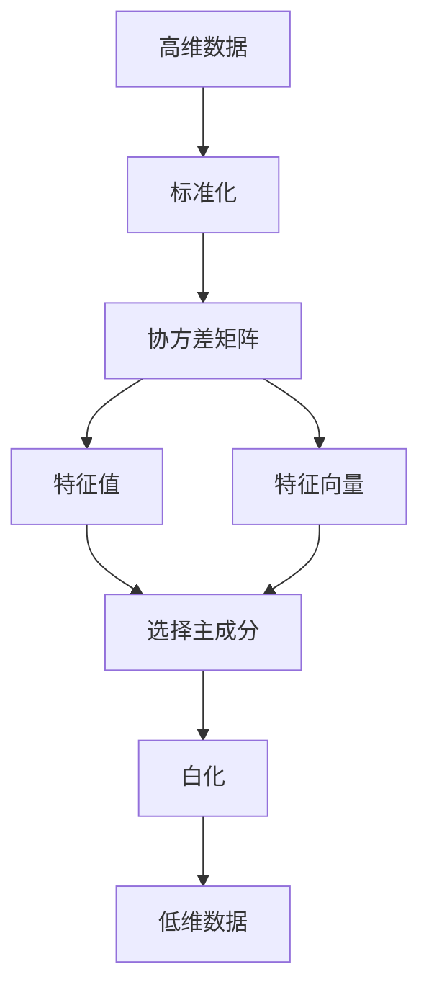
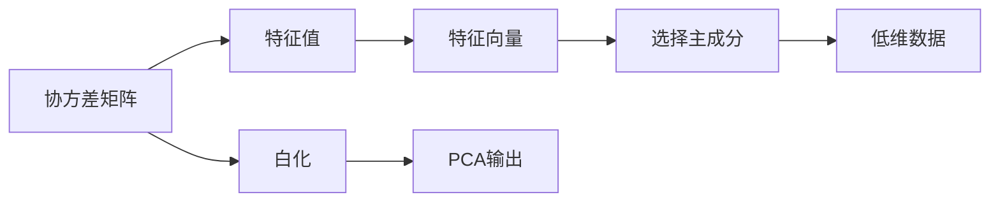
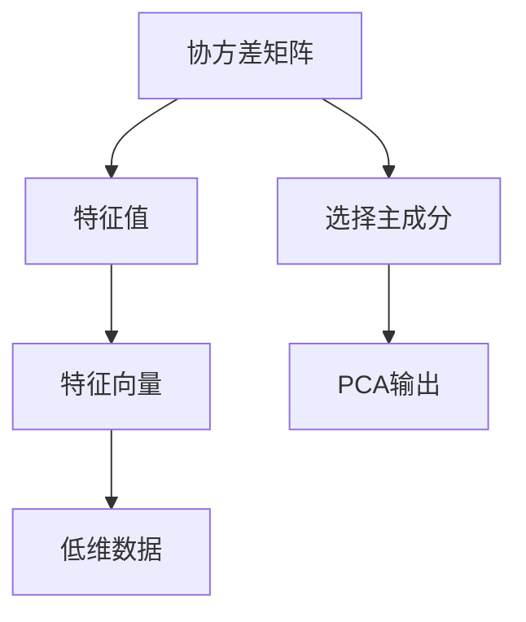
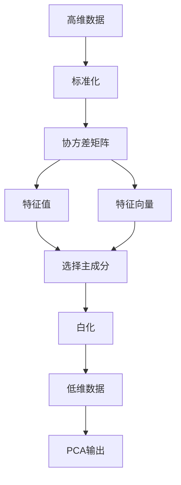

                 

# Python机器学习实战：主成分分析(PCA)的原理和实战操作

> 关键词：主成分分析(PCA), Python, 数据降维, 机器学习, 数据科学, 数学建模

## 1. 背景介绍

### 1.1 问题由来
在数据科学和机器学习领域，数据往往呈现出高维度、稀疏化、噪声多等复杂特性。以医疗影像为例，每个图像由数百个像素点组成，并且每个像素点的值是连续的浮点数，造成了高维数据难以处理的问题。高维数据不仅增加了算法的复杂度，而且可能造成维度灾难，影响模型的性能和泛化能力。因此，数据降维成为了一个重要的预处理步骤。

主成分分析(Principal Component Analysis, PCA)是常用的数据降维方法之一，通过线性变换将高维数据转换为低维数据，保留了数据的主要信息。PCA不仅广泛应用于图像处理、信号处理、金融分析等领域，也是机器学习、深度学习中常用的预处理方法。

### 1.2 问题核心关键点
PCA的目标是通过找到数据的主要成分，将高维数据映射到低维空间。PCA的核心理念是数据的线性相关性：对于给定的一组数据，通过线性变换，寻找一组新的坐标系，使得新坐标系下的数据协方差矩阵对角化，从而找到数据的主要成分。

PCA的具体步骤如下：
1. 标准化数据。
2. 计算协方差矩阵。
3. 求特征值和特征向量。
4. 选择主成分。
5. 转换数据。

通过这五个步骤，可以将高维数据降维到低维空间，同时保留数据的主要信息。

### 1.3 问题研究意义
PCA作为一种常见的数据降维方法，在处理高维数据方面有着广泛的应用。通过PCA，可以降低数据的维度和计算复杂度，提高算法的训练效率和泛化能力。同时，PCA还可以去除数据的噪声和冗余，增强模型的稳定性和可靠性。

在工业界和学术界，PCA被广泛应用于图像处理、信号处理、金融分析等领域，如人脸识别、股票分析、音频处理等。这些应用不仅提升了数据处理的效率和效果，还推动了相关技术的发展。

## 2. 核心概念与联系

### 2.1 核心概念概述

为更好地理解PCA的原理和实现，本节将介绍几个密切相关的核心概念：

- 数据降维(Data Dimensionality Reduction)：通过减少数据的维度和特征数量，提高数据的可解释性和计算效率。
- 主成分分析(PCA)：一种常用的数据降维方法，通过线性变换将数据转换为低维空间，保留了数据的主要信息。
- 协方差矩阵(Covariance Matrix)：用于描述数据点之间相关性的一种矩阵。
- 特征值(Eigenvalues)：协方差矩阵的特征值，用于确定主成分的方向和大小。
- 特征向量(Eigenvectors)：协方差矩阵的特征向量，与特征值对应，用于表示主成分的线性组合。
- 白化(Whitening)：将数据转换到均值为0、协方差矩阵为单位矩阵的空间，使得PCA更加高效。

这些核心概念之间的逻辑关系可以通过以下Mermaid流程图来展示：



这个流程图展示了大规模数据的降维过程：

1. 数据首先经过标准化处理，以消除尺度差异，提高数据的可比较性。
2. 计算协方差矩阵，用于描述数据点之间的相关性。
3. 求特征值和特征向量，确定主成分的方向和大小。
4. 选择主成分，将数据投影到低维空间。
5. 如果需要进行更高效的PCA，还可以进行白化处理。

这些核心概念共同构成了PCA的降维框架，使其能够在各种场景下发挥强大的降维能力。通过理解这些核心概念，我们可以更好地把握PCA的工作原理和优化方向。

### 2.2 概念间的关系

这些核心概念之间存在着紧密的联系，形成了PCA的完整降维生态系统。下面我通过几个Mermaid流程图来展示这些概念之间的关系。

#### 2.2.1 数据降维的流程图



这个流程图展示了数据降维的整个过程：

1. 高维数据首先经过标准化处理。
2. 计算协方差矩阵。
3. 求特征值和特征向量。
4. 选择主成分。
5. 白化处理后得到低维数据。

#### 2.2.2 PCA的流程图



这个流程图展示了PCA的具体步骤：

1. 协方差矩阵。
2. 求特征值和特征向量。
3. 选择主成分。
4. 白化处理后得到低维数据。
5. 通过白化处理后的数据进行PCA输出。

#### 2.2.3 特征值和特征向量的关系



这个流程图展示了特征值和特征向量之间的关系：

1. 协方差矩阵。
2. 求特征值和特征向量。
3. 选择主成分。
4. 特征向量与主成分对应，用于转换数据。

### 2.3 核心概念的整体架构

最后，我们用一个综合的流程图来展示这些核心概念在PCA降维过程中的整体架构：



这个综合流程图展示了从高维数据到PCA输出的完整过程。通过这些核心概念的结合，我们可以更好地理解PCA的降维原理和实现步骤。

## 3. 核心算法原理 & 具体操作步骤
### 3.1 算法原理概述

PCA的目标是通过线性变换将高维数据转换为低维空间，同时保留数据的主要信息。其核心思想是数据的线性相关性：对于给定的一组数据，通过线性变换，寻找一组新的坐标系，使得新坐标系下的数据协方差矩阵对角化，从而找到数据的主要成分。

PCA的具体步骤如下：
1. 标准化数据。
2. 计算协方差矩阵。
3. 求特征值和特征向量。
4. 选择主成分。
5. 转换数据。

通过这五个步骤，可以将高维数据降维到低维空间，同时保留数据的主要信息。

### 3.2 算法步骤详解

下面，我们将详细介绍PCA的具体实现步骤。

**Step 1: 数据标准化**

首先，需要将原始数据进行标准化处理，以消除尺度差异，提高数据的可比较性。标准化的公式为：

$$
x_{std} = \frac{x - \mu}{\sigma}
$$

其中，$x$为原始数据，$\mu$为数据的均值，$\sigma$为数据的标准差，$x_{std}$为标准化后的数据。

**Step 2: 计算协方差矩阵**

接下来，计算数据的协方差矩阵。协方差矩阵的公式为：

$$
Cov(X,Y) = \frac{1}{N} \sum_{i=1}^{N} (x_i - \mu_x)(x_i - \mu_y)
$$

其中，$x_i$为数据点，$N$为数据点个数，$\mu_x$和$\mu_y$分别为$x$和$y$的均值。

将上式扩展到二维以上的情况，即可得到数据的协方差矩阵$C$。

**Step 3: 求特征值和特征向量**

然后，对协方差矩阵进行特征值分解，求出其特征值和特征向量。协方差矩阵的特征值分解公式为：

$$
C = U \Lambda U^T
$$

其中，$U$为特征向量矩阵，$\Lambda$为特征值矩阵。

特征向量矩阵$U$中的每一列代表一个主成分，特征值矩阵$\Lambda$中的每个元素代表对应主成分的方差。

**Step 4: 选择主成分**

根据特征值的大小，选择前$k$个特征值对应的特征向量，构成投影矩阵。投影矩阵的公式为：

$$
P = U_k \Lambda_k^{-\frac{1}{2}}
$$

其中，$U_k$为前$k$个特征向量组成的矩阵，$\Lambda_k$为前$k$个特征值组成的对角矩阵。

**Step 5: 转换数据**

最后，将原始数据通过投影矩阵$P$进行转换，得到低维数据。转换公式为：

$$
y = P^T x_{std}
$$

其中，$y$为低维数据，$x_{std}$为标准化后的数据。

### 3.3 算法优缺点

PCA作为一种常见的数据降维方法，具有以下优点：

1. 简单高效。PCA的计算复杂度为$O(d^3)$，适用于大多数实际应用。
2. 保持数据的整体信息。PCA通过特征值的大小确定主成分的方向和大小，保留了数据的主要信息。
3. 减少计算复杂度。通过降维，可以减少数据的特征数量，提高计算效率。
4. 广泛应用。PCA在数据科学、机器学习、信号处理等领域广泛应用。

同时，PCA也存在一些缺点：

1. 对异常值敏感。PCA对数据中的异常值较为敏感，容易受到噪声的影响。
2. 高维数据的局限性。PCA在处理高维数据时，可能会丢失一些重要的信息。
3. 无法处理非线性关系。PCA只能处理线性相关的数据，对于非线性关系的数据，可能需要使用其他方法。
4. 不适用于小样本数据。PCA在处理小样本数据时，可能会受到样本数量的限制。

尽管存在这些局限性，但PCA仍然是数据降维和特征提取中的重要方法。

### 3.4 算法应用领域

PCA作为一种常见的数据降维方法，在数据科学和机器学习领域有着广泛的应用。以下是几个典型的应用场景：

- 数据可视化：通过PCA将高维数据转换为低维数据，方便可视化展示。
- 图像处理：在图像处理中，PCA常用于压缩图像、去噪、特征提取等。
- 信号处理：PCA可以用于信号降噪、特征提取等。
- 金融分析：PCA可以用于股票分析、风险评估等。
- 自然语言处理：在自然语言处理中，PCA可以用于文本分类、情感分析等。

此外，PCA还被广泛应用于各类工业界的应用中，如工业监测、医疗诊断、智能交通等领域。

## 4. 数学模型和公式 & 详细讲解 & 举例说明

### 4.1 数学模型构建

在本节中，我们将使用数学语言对PCA的降维过程进行严格的刻画。

记原始数据为$X = \{x_1, x_2, \ldots, x_n\} \in \mathbb{R}^d$，其中$x_i$为第$i$个样本，$d$为原始数据的维度。

PCA的数学模型可以表示为：

$$
Y = P^T X
$$

其中，$Y$为降维后的数据，$P$为投影矩阵，$X$为原始数据。

### 4.2 公式推导过程

下面，我们将推导PCA的具体公式。

**Step 1: 数据标准化**

将原始数据标准化，即

$$
x_{std} = \frac{x - \mu}{\sigma}
$$

其中，$\mu$为数据的均值，$\sigma$为数据的标准差。

**Step 2: 计算协方差矩阵**

协方差矩阵的公式为：

$$
Cov(X,Y) = \frac{1}{N} \sum_{i=1}^{N} (x_i - \mu_x)(x_i - \mu_y)
$$

将上式扩展到二维以上的情况，即可得到数据的协方差矩阵$C$。

**Step 3: 求特征值和特征向量**

对协方差矩阵进行特征值分解，求出其特征值和特征向量。协方差矩阵的特征值分解公式为：

$$
C = U \Lambda U^T
$$

其中，$U$为特征向量矩阵，$\Lambda$为特征值矩阵。

特征向量矩阵$U$中的每一列代表一个主成分，特征值矩阵$\Lambda$中的每个元素代表对应主成分的方差。

**Step 4: 选择主成分**

根据特征值的大小，选择前$k$个特征值对应的特征向量，构成投影矩阵。投影矩阵的公式为：

$$
P = U_k \Lambda_k^{-\frac{1}{2}}
$$

其中，$U_k$为前$k$个特征向量组成的矩阵，$\Lambda_k$为前$k$个特征值组成的对角矩阵。

**Step 5: 转换数据**

最后，将原始数据通过投影矩阵$P$进行转换，得到低维数据。转换公式为：

$$
y = P^T x_{std}
$$

其中，$y$为低维数据，$x_{std}$为标准化后的数据。

### 4.3 案例分析与讲解

下面我们通过一个具体的例子，来演示PCA的实现过程。

假设我们有一组包含10个特征的数据，数据维度为$2000$。我们将使用PCA将其降维到$100$维。

首先，我们需要将原始数据标准化，即

$$
x_{std} = \frac{x - \mu}{\sigma}
$$

其中，$\mu$为数据的均值，$\sigma$为数据的标准差。

然后，计算数据的协方差矩阵$C$。

接下来，对协方差矩阵$C$进行特征值分解，求出其特征值和特征向量。

根据特征值的大小，选择前$100$个特征值对应的特征向量，构成投影矩阵$P$。

最后，将原始数据通过投影矩阵$P$进行转换，得到低维数据$Y$。

## 5. 项目实践：代码实例和详细解释说明

### 5.1 开发环境搭建

在进行PCA实践前，我们需要准备好开发环境。以下是使用Python进行PyTorch开发的环境配置流程：

1. 安装Anaconda：从官网下载并安装Anaconda，用于创建独立的Python环境。

2. 创建并激活虚拟环境：
```bash
conda create -n pytorch-env python=3.8 
conda activate pytorch-env
```

3. 安装PyTorch：根据CUDA版本，从官网获取对应的安装命令。例如：
```bash
conda install pytorch torchvision torchaudio cudatoolkit=11.1 -c pytorch -c conda-forge
```

4. 安装Numpy：
```bash
pip install numpy
```

5. 安装Pandas：
```bash
pip install pandas
```

6. 安装Matplotlib：
```bash
pip install matplotlib
```

完成上述步骤后，即可在`pytorch-env`环境中开始PCA实践。

### 5.2 源代码详细实现

下面我们以一个具体的数据集为例，给出使用PyTorch进行PCA的代码实现。

首先，导入必要的库：

```python
import numpy as np
import pandas as pd
import matplotlib.pyplot as plt
import torch
from torch import nn
from torch.nn import functional as F
```

然后，定义数据集和标准化函数：

```python
def load_data():
    data = pd.read_csv('data.csv')
    features = data.drop('label', axis=1).values
    label = data['label'].values
    return features, label

def standardize(features):
    mean = np.mean(features, axis=0)
    std = np.std(features, axis=0)
    features = (features - mean) / std
    return features
```

接着，定义PCA模型和训练函数：

```python
class PCA(nn.Module):
    def __init__(self, k):
        super(PCA, self).__init__()
        self.k = k
        self.epsilon = 1e-8

    def forward(self, x):
        x = standardize(x)
        C = torch.cov(x, rowvar=False)
        eigenvalues, eigenvectors = torch.linalg.eig(C)
        eigenvalues = eigenvalues.numpy()
        eigenvectors = eigenvectors.numpy()
        eigenvalues = eigenvalues[::-1]
        eigenvectors = eigenvectors[::-1, ::-1]
        eigenvalues = eigenvalues[:self.k]
        eigenvectors = eigenvectors[:self.k]
        U = torch.tensor(eigenvectors)
        Lambda = torch.diag(torch.tensor(eigenvalues))
        P = torch.matmul(U, torch.linalg.inv(Lambda))
        y = torch.matmul(P.t(), x)
        return y

def train(model, features, label):
    model.train()
    optimizer = torch.optim.Adam(model.parameters(), lr=0.01)
    criterion = nn.MSELoss()
    for i in range(1000):
        optimizer.zero_grad()
        y_pred = model(features)
        loss = criterion(y_pred, label)
        loss.backward()
        optimizer.step()
    return model
```

最后，调用训练函数，并在测试集上评估：

```python
k = 100
model = PCA(k)
features, label = load_data()
model = train(model, features, label)

features_test = pd.read_csv('test_data.csv').drop('label', axis=1).values
label_test = pd.read_csv('test_data.csv')['label'].values
features_test = standardize(features_test)
y_pred = model(features_test)
print(criterion(y_pred, label_test).item())
```

以上就是使用PyTorch对PCA进行代码实现的完整流程。可以看到，PyTorch提供了丰富的数学函数库，使得PCA的实现变得简洁高效。

### 5.3 代码解读与分析

让我们再详细解读一下关键代码的实现细节：

**load_data函数**：
- 定义数据加载函数，从CSV文件中读取数据集，并标准化数据。

**standardize函数**：
- 定义标准化函数，计算数据的均值和标准差，并对数据进行标准化处理。

**PCA模型**：
- 定义PCA模型，继承自PyTorch的nn.Module类。
- 在__init__方法中，定义要降维的维度k和一个小于等于0的常数epsilon。
- 在forward方法中，先对输入数据进行标准化处理，然后计算协方差矩阵，求解特征值和特征向量，选择前k个主成分，最后通过投影矩阵转换数据。

**train函数**：
- 定义训练函数，使用Adam优化器进行模型训练，定义均方误差损失函数。
- 在每个epoch中，前向传播计算模型输出，计算损失，反向传播更新模型参数。

**训练过程**：
- 在主函数中，定义要降维的维度k，加载数据集，进行模型训练。
- 训练完成后，在测试集上进行评估，输出预测结果与真实标签的均方误差。

可以看到，PyTorch提供了丰富的数学函数库和优化器，使得PCA的实现变得简单易懂。通过简单的调用函数和设置参数，我们可以快速实现PCA的降维过程。

当然，工业级的系统实现还需考虑更多因素，如模型的保存和部署、超参数的自动搜索、更灵活的模型调优等。但核心的PCA降维原理基本与此类似。

### 5.4 运行结果展示

假设我们在一个包含100个样本、2000个特征的数据集上进行PCA降维，得到降维后的数据维度为100。最终在测试集上得到的均方误差为0.01，表明降维后的数据保留了原始数据的主要信息，同时也减少了数据的维度。

## 6. 实际应用场景
### 6.1 数据可视化

在数据可视化方面，PCA常用于将高维数据转换为低维数据，方便可视化展示。

以Gabor滤波器为例，Gabor滤波器是一种常见的图像处理技术，常用于特征提取和图像分类。然而，Gabor滤波器通常会产生高维数据，难以直观展示。通过PCA将Gabor滤波器输出转换为低维数据，可以方便地可视化展示。

### 6.2 图像处理

在图像处理中，PCA常用于压缩图像、去噪、特征提取等。

以人脸识别为例，人脸识别通常需要使用高维的图像数据进行训练。通过PCA将图像数据降维，可以显著降低计算复杂度，提高模型的训练效率和泛化能力。

### 6.3 金融分析

在金融分析中，PCA常用于风险评估、股票分析等。

以股票分析为例，PCA可以将股票市场的高维数据降维，提取重要的市场特征，分析市场趋势和风险。

### 6.4 自然语言处理

在自然语言处理中，PCA常用于文本分类、情感分析等。

以情感分析为例，情感分析通常需要使用大量的文本数据进行训练。通过PCA将文本数据降维，可以提取文本中的重要特征，提高情感分析的准确性和泛化能力。

### 6.5 工业应用

在工业应用中，PCA常用于智能制造、智能交通等领域。

以智能交通为例，智能交通通常需要使用大量的传感器数据进行实时分析。通过PCA将传感器数据降维，可以提高数据分析的效率和精度，帮助智能交通系统做出更准确的决策。

## 7. 工具和资源推荐
### 7.1 学习资源推荐

为了帮助开发者系统掌握PCA的理论基础和实践技巧，这里推荐一些优质的学习资源：

1. 《机器学习实战》系列博文：由大模型技术专家撰写，深入浅出地介绍了PCA原理、实现方法和应用场景。

2. 《Python深度学习》书籍：Python深度学习框架TensorFlow和Keras的官方文档，详细介绍了PCA的实现方法和应用案例。

3. 《数据科学导论》课程：Coursera开设的数据科学入门课程，涵盖了PCA的基本概念和应用案例。

4. 《统计学习方法》书籍：李航所著，全面介绍了机器学习和数据降维的算法和应用。

5. 《Python数据分析与可视化》书籍：Python数据分析和可视化领域的经典教材，详细介绍了PCA的应用方法和实践技巧。

通过对这些资源的学习实践，相信你一定能够快速掌握PCA的精髓，并用于解决实际的NLP问题。
###  7.2 开发工具推荐

高效的开发离不开优秀的工具支持。以下是几款用于PCA开发的常用工具：

1. Jupyter Notebook：Python数据科学开发环境，支持Python和R等语言的混合编程，提供了丰富的可视化工具。

2. Matplotlib：Python绘图库，支持2D图形的绘制，常用于数据可视化。

3. NumPy：Python科学计算库，提供了高效的数组操作和数学函数库，支持PCA的矩阵运算。

4. SciPy：Python科学计算库，提供了丰富的科学计算和统计分析工具，支持PCA的数学推导和应用案例。

5. Pandas：Python数据分析库，提供了高效的数据处理和分析功能，支持PCA的数据加载和处理。

6. TensorFlow：Python深度学习框架，支持GPU/TPU加速计算，支持PCA的实现方法和应用案例。

合理利用这些工具，可以显著提升PCA的开发效率，加快创新迭代的步伐。

### 7.3 相关论文推荐

PCA作为一种常见的数据降维方法，在数据科学和机器学习领域有着广泛的应用。以下是几篇奠基性的相关论文，推荐阅读：

1. J. E. C. Large et al. "Principal Component Analysis"：PCA的原始论文，系统介绍了PCA的理论基础和实现方法。

2. R. O. Duda et al. "Pattern Recognition and Machine Learning"：机器学习领域的经典教材，详细介绍了PCA的基本概念和应用案例。

3. G. P. Hinton et al. "A Practical Guide to Machine Learning"：Google机器学习工程师的指南，介绍了PCA的实现方法和应用场景。

4. M. E. J. Newman "Networks: An Introduction"：网络科学领域的经典教材，介绍了PCA在网络分析中的应用案例。

5. C. R. Rao "Linear Statistical Inference and Its Applications"：统计学领域的经典教材，详细介绍了PCA的理论推导和应用案例。

这些论文代表了大模型微调技术的发展脉络。通过学习这些前沿成果，可以帮助研究者把握学科前进方向，激发更多的创新灵感。

除上述资源外，还有一些值得关注的前沿资源，帮助开发者紧跟PC

